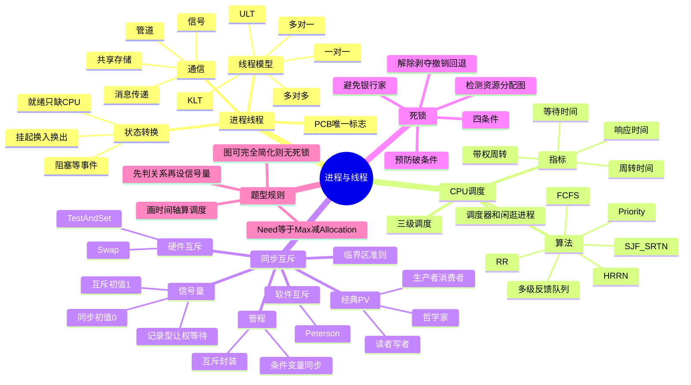
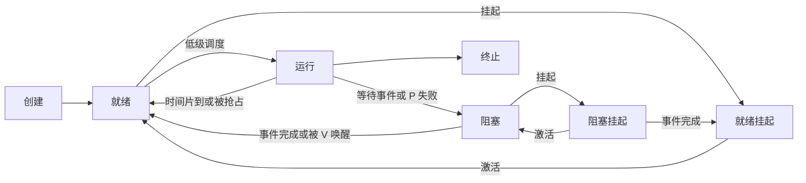

# 操作系统 第2章 进程与线程

> 来源：`2026操作系统.pdf`，第2章 进程与线程，PDF 页码 p49-p188。
> 复核：本轮重新读取教材、31 份基础课件、期中/期末卷、P1 PV 大题、强化结课考试及答案、历年真题，共 38 组 598 页；直接查看覆盖全部页面的 117 张联系图，并对教材 14 个定义、代码和表格密集页补做 OCR。重点复核 PCB/状态图、线程模型、调度时间轴、软硬件互斥代码、经典 PV、管程、银行家算法、资源分配图、教材习题与统考真题。

## 本章速览

- 进程是程序并发执行时的动态实体，PCB 是进程存在的唯一标志。
- 引入线程后，进程是资源分配单位，线程是 CPU 调度单位。
- CPU 调度题抓三件事：调度层次、调度时机、调度算法指标。
- 同步互斥题抓三件事：互斥关系、同步先后、信号量初值和 P/V 位置。
- 让权等待是记录型信号量的关键优势；Peterson、TestAndSet、Swap、自旋锁都属于忙等。
- 死锁题抓四条件、银行家算法安全性、资源分配图能否完全简化。

## 课件补充来源

- 基础考点讲解 2.1：`2.1.1+2.1.2 进程的概念、组成、特征.pdf`、`2.1.3 进程的状态与转换.pdf`、`2.1.4 进程控制.pdf`、`2.1.5_1 进程通信.pdf`、`2.1.5_2 信号.pdf`、`2.1.6_1 线程的概念与特点.pdf`、`2.1.6_2 线程的实现方式和多线程模型.pdf`、`2.1.6_3 线程的状态与转换.pdf`。
- 基础考点讲解 2.2：`2.2.1 调度的概念、层次.pdf`、`2.2.2_1+2.2.4 进程调度的时机、切换与过程、方式.pdf`、`2.2.2_2 调度器和闲逛进程.pdf`、`2.2.3 调度的目标（调度算法的评价指标）.pdf`、`2.2.5_1 调度算法：先来先服务、最短作业优先、最高响应比优先.pdf`、`2.2.5_2 调度算法：时间片轮转、优先级、多级反馈队列.pdf`、`2.2.5_3 调度算法：多级队列调度算法.pdf`、`2.2.6 多处理机调度.pdf`。
- 基础考点讲解 2.3：`2.3.1 同步与互斥的基本概念.pdf`、`2.3.2_1 进程互斥的软件实现方法.pdf`、`2.3.2_2 进程互斥的硬件实现方法.pdf`、`2.3.3 互斥锁.pdf`、`2.3.4_1 信号量机制.pdf`、`2.3.4_2 用信号量实现进程互斥、同步、前驱关系.pdf`、`2.3.5_1_1 生产者-消费者问题.pdf`、`2.3.5_1_2 多生产者-多消费者.pdf`、`2.3.5_2 读者-写者问题.pdf`、`2.3.5_3 哲学家进餐问题.pdf`、`2.3.6 管程.pdf`。
- 基础考点讲解 2.4：`2.4.1 死锁的概念.pdf`、`2.4.2 死锁的处理策略—预防死锁.pdf`、`2.4.3 死锁的处理策略—避免死锁.pdf`、`2.4.4 死锁的处理策略—死锁的检测与解除.pdf`。
- 强化/试题补充：`OS期中试卷及答案解析（学员版）.pdf`、`OS期末试卷及答案解析（学员版）.pdf`、`操作系统P1_PV操作大题.pdf`、`操作系统强化【结课考试】.pdf`、`操作系统强化【结课考试+答案】.pdf`、`操作系统历年真题合集.pdf`。

## 关联导航

- 本章内：[[02-进程与线程#2.1 进程与线程|进程与线程]]、[[02-进程与线程#2.2 CPU 调度|CPU 调度]]、[[02-进程与线程#2.3 同步与互斥|同步与互斥]]、[[02-进程与线程#2.4 死锁|死锁]]、[[02-进程与线程#课件补充/强化题规则|强化题规则]]。
- 同科联动：[[01-计算机系统概述#1.3 操作系统的运行环境|中断与系统调用]]、[[03-内存管理#3.1 内存管理概念|进程内存与地址空间]]、[[05-输入输出管理#5.1 I/O 管理概述|I/O 中断与阻塞]]。
- 跨科联动：[[408/408考研笔记/计算机组成原理/05-中央处理器#5.5 异常和中断机制|异常和中断机制]]、[[408/408考研笔记/计算机组成原理/05-中央处理器#5.7 多处理器的基本概念|多处理器基础]]。

## 知识网络

## 知识点清单

### 2.1 进程与线程

#### 2.1.1 进程的概念和特征

- 引入进程的原因：程序并发执行后失去封闭性和可再现性，需要一个实体来描述、控制和管理程序运行过程。
- 进程实体/进程映像：`程序段 + 数据段 + PCB`。
- PCB `Process Control Block`：
  - 系统用 PCB 描述进程基本情况和运行状态。
  - 创建进程实质是创建 PCB，撤销进程实质是撤销 PCB。
  - PCB 是进程存在的唯一标志。
- 进程：进程实体的运行过程，是系统进行资源分配和调度的独立单位。
- 进程特征：
  - 动态性：有创建、活动、暂停、终止过程，是最基本特征。
  - 并发性：多个进程可在同一时间间隔内推进。
  - 独立性：可独立获得资源、独立接受调度。
  - 异步性：以不可预知的速度走走停停推进。
- 程序 vs 进程：程序是静态指令集合，进程是程序的一次动态执行活动。

#### 2.1.2 进程的组成

- PCB 常见内容：
  - 进程标识信息：PID、UID、父进程号等。
  - 处理机状态：PC、PSW、通用寄存器、栈指针等。
  - 进程调度信息：进程状态、优先级、队列指针、阻塞原因。
  - 进程控制信息：程序/数据地址、资源清单、打开文件、同步通信信息。
- PCB 组织：数量少时可线性组织；常用链接方式把同状态 PCB 串成队列，或用索引表按状态定位。不同阻塞原因通常对应不同等待队列。
- 程序段：可被进程执行的程序代码。
- 数据段：进程运行时使用和产生的数据，包括全局变量、堆、栈等。

#### 2.1.3 进程的状态与转换

- 五状态模型：
  - 创建态：申请 PCB 和资源，初始化进程。
  - 就绪态：除 CPU 外所需资源已具备，等待调度。
  - 运行态：正在 CPU 上执行。
  - 阻塞态/等待态：等待 I/O、资源或事件，CPU 空闲也不能运行。
  - 终止态：运行结束或异常终止，等待资源回收。
- 基本转换：
  - 创建态 -> 就绪态：系统接纳进程。
  - 就绪态 -> 运行态：被进程调度选中。
  - 运行态 -> 就绪态：时间片到，或被更高优先级进程抢占。
  - 运行态 -> 阻塞态：主动请求 I/O、资源或等待事件。
  - 阻塞态 -> 就绪态：等待事件发生或资源满足。
  - 运行态 -> 终止态：正常结束或异常结束。
- 就绪态 vs 阻塞态：
  - 就绪态只缺 CPU。
  - 阻塞态缺事件/资源；即使 CPU 可用也不能执行。
- 挂起态：
  - 进程暂时调到外存，称为挂起。
  - 就绪挂起：在外存，只缺调回内存和 CPU。
  - 阻塞挂起：在外存，仍在等待事件。
  - 中级调度负责在内存和外存之间换入/换出。
  - 涉及挂起/激活的状态转换才一定发生内存与外存交换；运行态到就绪/阻塞本身不必交换到磁盘。

#### 2.1.4 进程控制

- 进程控制通过原语实现，原语必须原子执行。
- 创建原语：
  - 申请空白 PCB。
  - 分配运行所需资源。
  - 初始化 PCB。
  - 插入就绪队列。
  - 创建只使进程具备被调度资格，并不等于立即分配 CPU。
- 终止原语：
  - 根据 PID 找 PCB。
  - 若进程正在运行，则立即终止并调度新进程。
  - 终止其子孙进程。
  - 回收资源，删除 PCB。
- 阻塞原语：
  - 当前运行进程主动阻塞。
  - 修改状态并插入相应等待队列。
  - 重新调度。
- 唤醒原语：
  - 等待事件发生后，将进程从等待队列移出。
  - 改为就绪态并插入就绪队列。
- 阻塞与唤醒成对：阻塞只能由当前运行进程主动执行；唤醒通常由其他进程或中断处理触发。
- 切换原语：
  - 保存当前进程现场。
  - 更新 PCB。
  - 恢复新进程现场。

#### 2.1.5 进程的通信

- 共享存储：
  - 多进程共享同一存储区。
  - 速度快，但同步互斥由进程自己负责。
  - 低级方式：共享某些数据结构。
  - 高级方式：共享一段存储区。
- 消息传递：
  - 以格式化消息为单位，通过 OS 的 `send/receive` 原语通信。
  - 直接通信：发送给指定进程。
  - 间接通信：通过信箱/邮箱通信。
- 管道通信：
  - 管道是连接读写进程的共享文件/缓冲区。
  - 半双工，若需双向通信通常要两个管道。
  - FIFO 顺序，面向字节流。
  - 写满则写进程阻塞，读空则读进程阻塞。
  - 读取会取走数据；普通管道通常按“一端写、一端读”使用，多写者/读者需额外协调。
- 信号：
  - 用于通知进程发生某事件。
  - PCB 中可用位图记录待处理 `pending` 信号和屏蔽 `mask` 信号；被屏蔽者保留待处理，解除屏蔽后再递送。
  - 通常在内核态返回用户态前检查并递送；处理方式有默认处理、用户自定义处理、忽略。
  - 普通信号一般不排队，同一种信号重复到达可能只保留一次“待处理”状态。
  - 少数强制信号不能被自定义处理、忽略或屏蔽，如 Linux 的 `SIGKILL`、`SIGSTOP`。
  - 信号是异步事件通知机制，不等同于同步互斥中的信号量 `semaphore`。

#### 2.1.6 线程和多线程模型

- 引入线程的目的：减少进程并发执行的时空开销，提高并发性能。
- 线程：
  - 轻量级进程，是进程中的一个执行流。
  - 线程拥有 TID、PC、寄存器、栈等运行现场。
  - 线程也有 TCB，保存 TID、PC/寄存器、状态、优先级、私有存储和栈指针等。
  - 同一进程内线程共享代码段、数据段、打开文件和地址空间等资源。
  - 线程也有就绪、运行、阻塞等状态。
- 进程 vs 线程：
  - 进程是资源分配单位，线程是 CPU 调度单位。
  - 同一进程内线程切换不引起进程切换，开销小。
  - 不同进程中的线程切换会引起进程切换，开销大。
  - 同进程线程共享资源方便通信，但也更需要同步互斥。
- 用户级线程 `ULT`：
  - 线程管理在用户态完成，内核不可感知。
  - 优点：切换快，可移植性好。
  - 缺点：多对一时一个阻塞系统调用可拖住整个进程，且同进程线程不能在多 CPU 上并行；内核按进程分配 CPU 时间，线程多的进程中每个线程分得的时间反而更少。
- 内核级线程 `KLT`：
  - 线程管理由内核完成，内核按线程调度。
  - 优点：并行性强，一个线程阻塞不影响同进程其他线程。
  - 缺点：切换要进内核，开销大。
- 多线程模型：
  - 多对一：多个用户线程映射到一个内核线程；管理快，但并发度低。
  - 一对一：一个用户线程对应一个内核线程；并发性好，但创建/切换开销大。
  - 多对多：多个用户线程映射到多个内核线程，兼顾管理开销和多核并行。

#### 2.1.7 本节小结

- 进程是程序并发执行的动态过程；程序本身无法描述并发执行时的暂停、恢复、同步和资源占用。
- PCB、状态转换、控制原语、通信方式、线程模型构成进程管理基础。

#### 2.1.8/2.1.9 本节习题精选与答案解析吸收

- “执行中断处理程序时进程的状态”常考：被中断进程通常从运行态转为就绪态或内核处理上下文，不要误判为阻塞。
- 进程上下文是恢复执行所需的状态信息，如 PC、PSW、寄存器和地址空间信息；程序代码/普通数据本身不等于“处理机上下文”。
- 父子进程可共享部分资源，但地址空间通常相互独立；线程共享同进程地址空间。
- 管道是半双工，双向通信要两个管道。
- 进程通信中共享存储最快，但要自己处理互斥同步。
- 一个程序可对应多个进程；一个进程也可能执行多个程序。

### 2.2 CPU 调度

#### 2.2.1 调度的概念

- CPU 调度：从就绪队列中按某种算法选择一个进程，把 CPU 分配给它。
- 调度目标：公平、高效地分配 CPU，使进程并发执行。
- 三级调度：
  - 高级调度/作业调度：外存后备队列 -> 内存就绪队列，决定哪些作业进入内存。
  - 中级调度/内存调度：把进程换出到外存或调回内存，形成挂起态。
  - 低级调度/进程调度：就绪队列 -> CPU，最基本、最频繁。
- 调度频率：低级调度最高，中级次之，高级最低。

#### 2.2.2 调度的实现

- 调度时机：
  - 主动放弃 CPU：进程正常终止、异常终止、阻塞、等待 I/O。
  - 被迫放弃 CPU：时间片到、更高优先级进程到达、中断等。
- 不能进行调度/切换的常见情况：
  - 正在处理中断或执行不可中断的原子操作时；此时可记下重新调度标志，待安全点再切换。
  - 处于需要关闭中断保护的内核临界区时；并非所有内核态执行都禁止调度。
- 非抢占式调度：
  - 当前进程主动放弃 CPU 前不会被剥夺。
  - 实现简单，系统开销小；实时性和响应性差。
- 抢占式调度：
  - 可强行暂停当前进程。
  - 适合分时/实时系统；开销较大。
- 调度程序 vs 分派程序：
  - 调度程序决定“选谁”。
  - 分派程序执行“切换给谁”，包括上下文切换、切换到用户态、跳转到目标进程。
- 闲逛进程 `idle`：
  - 当没有其他就绪进程时运行，属于调度程序的兜底目标。
  - 通常 PID 为 0、优先级最低，除 CPU 外不占用普通进程资源。
  - 可设计为 0 地址指令，占一个完整指令周期，在周期末尾例行检查中断。
  - 考点：闲逛进程不是阻塞等待，而是在系统空闲时占用 CPU 运行。

#### 2.2.3 调度的目标

- CPU 利用率：`CPU 忙碌时间 / 总时间`。
- 系统吞吐量：单位时间完成作业数。
- 周转时间：`完成时间 - 提交/到达时间`。
- 平均周转时间：多个作业周转时间平均值。
- 带权周转时间：`周转时间 / 实际运行时间`。
- 等待时间：进程等待 CPU 的总时间，常用 `周转时间 - 运行时间`。
- 响应时间：从提交请求到第一次响应的时间。

#### 2.2.4 进程切换

- 进程切换要保存当前进程上下文、恢复新进程上下文。
- 上下文包括 PC、PSW、寄存器、栈指针、页表/地址空间等。
- 调度与切换区别：
  - 调度是决策行为。
  - 切换是执行行为。
  - 先有资源调度，才有进程切换。
- 切换有时间开销，频繁切换会降低有效 CPU 利用率。
- 用户态/内核态切换只是处理机模式切换；若仍由同一进程/线程继续执行，就不是进程/线程上下文切换。

#### 2.2.5 CPU 调度算法

| 算法 | 抢占性 | 核心规则 | 优点 | 易错点 |
| --- | --- | --- | --- | --- |
| FCFS | 非抢占 | 按到达先后服务 | 公平、简单 | 利于长作业，不利短作业和 I/O 型作业 |
| SJF | 通常非抢占 | 选估计运行时间最短者 | 平均等待/周转时间最优 | 需预知运行时间，长作业可能饥饿 |
| SRTN | 抢占 | 剩余时间最短者优先 | SJF 抢占式版本 | 新短作业可抢占当前作业 |
| HRRN | 非抢占 | 响应比最高者优先 | 兼顾短作业和等待过久作业 | 每次调度要重新算响应比 |
| Priority | 可抢占/非抢占 | 优先级高者先运行 | 适合实时/重要任务 | 低优先级可能饥饿，可用老化 |
| RR | 抢占 | 时间片轮转 | 分时系统响应好 | 时间片过大退化 FCFS，过小切换开销大 |
| 多级队列 | 视队列而定 | 不同队列不同优先级/算法 | 分类管理清晰 | 队列间固定，低优先级可能饥饿 |
| 多级反馈队列 | 抢占为主 | 高优先级短时间片，用完降级 | 兼顾短作业、I/O 型和长作业 | 规则复杂，注意队列优先级和降级 |

- HRRN 公式：`响应比 = (等待时间 + 服务时间) / 服务时间 = 1 + 等待时间 / 服务时间`。
- HRRN 是非抢占式算法；可用于作业调度，也可用于进程调度。等待时间相同选服务时间短者，服务时间相同选等待时间长者。
- RR 时间片：
  - 过大：退化为 FCFS。
  - 过小：切换开销过大。
  - 选择受系统响应时间、就绪队列进程数、处理能力影响。
  - 运行期间到达的新进程立即入就绪队尾；当前进程只有时间片用完后才重新排到队尾，画时间轴必须按事件发生顺序入队。
- 优先级调度：
  - 静态优先级运行前确定，动态优先级可随等待时间、运行时间、I/O 行为调整。
  - 老化 `aging`：等待越久优先级越高，用于缓解低优先级饥饿。
  - 动态优先级常按“运行越久越降级、等待越久越升级”设计，例如 `priority = nice + k1 * cpuTime - k2 * waitTime`；若规定数值越小优先级越高，则 `cpuTime` 使数值增大，`waitTime` 使数值减小。
- 多级反馈队列：
  - 新进程先入最高优先级队列。
  - 高优先级队列时间片短，低优先级队列时间片长。
  - 用完整个时间片仍未完成则降级。
  - 高优先级队列非空时，低优先级队列不运行。
  - 可通过提升等待过久进程优先级防止饥饿。
- 多级队列 vs 多级反馈队列：前者进程通常固定在某类队列；后者会根据运行和等待情况在队列间升降。

#### 2.2.6 多处理机调度

- 非对称多处理 `AMP`：
  - 主处理机负责调度和 I/O，从处理机执行用户程序。
  - 简单，但主处理机易成瓶颈。
- 对称多处理 `SMP`：
  - 各处理机地位平等，调度任务可由任一处理机执行。
  - 可采用公共就绪队列或私有就绪队列。
- 处理机亲和性：
  - 尽量让进程继续在原 CPU 上运行，以利用缓存。
  - 软亲和：尽量保持但可迁移。
  - 硬亲和：进程只能在指定 CPU 集合上运行。
- 负载均衡：
  - 推迁移：周期性把超载 CPU 的进程推到空闲 CPU。
  - 拉迁移：空闲 CPU 主动从繁忙 CPU 拉进程。

#### 2.2.7 本节小结

- 调度层次解决“作业进内存、进程换入换出、就绪进程上 CPU”。
- 调度算法题先画时间轴，再算完成时间、周转时间、等待时间、响应时间。

#### 2.2.8/2.2.9 本节习题精选与答案解析吸收

- SJF/SRTN 的平均等待时间通常较小，但不公平，可能让长作业饥饿。
- HRRN 不会长期忽视长作业，因为等待时间越长响应比越大。
- 多级反馈队列是 RR 与优先级调度的综合发展。
- 调度算法若问“是否可抢占”，注意 SJF 通常非抢占，SRTN 才是抢占式短作业。
- 等待时间不包含进程运行时间，但通常包含在就绪队列等待 CPU 的时间。

### 2.3 同步与互斥

#### 2.3.1 同步与互斥的基本概念

- 临界资源：一次只允许一个进程访问的资源，如打印机、共享变量、缓冲区。
- 临界区：进程中访问临界资源的代码段。
- 临界区结构：进入区、临界区、退出区、剩余区。
- 同步：进程间为完成共同任务而等待、传递信息，强调先后次序。
- 互斥：进程竞争同一临界资源，强调不能同时进入临界区。
- 临界区互斥准则：
  - 空闲让进：临界区空闲时允许一个请求进程进入。
  - 忙则等待：已有进程在临界区时，其他进程等待。
  - 有限等待：请求进入的进程应在有限时间内进入。
  - 让权等待：不能进入临界区时应释放 CPU，避免忙等。

#### 2.3.2 实现临界区互斥的基本方法

- 软件方法：
  - 单标志法：用 `turn` 强制轮流进入；违反空闲让进。
  - 双标志先检查：先检查对方标志再设置自己标志；检查和设置非原子，可能同时进入。
  - 双标志后检查：先设置自己标志再检查对方标志；可能双方互等，违反空闲让进和有限等待。
  - Peterson 算法：`flag[] + turn`，能保证互斥、空闲让进、有限等待，但仍忙等，不满足让权等待。
- 硬件方法：
  - 关中断：简单，但只适合单处理机内核临界区，不适合用户进程和多处理机。
  - TestAndSet/TSL：原子读改写，适合多处理机，但忙等。
  - Swap/XCHG：原子交换，效果类似 TSL，但忙等。
- 用户程序不能用开/关中断实现临界区互斥：开关中断是特权指令，只能在内核态执行。
- `Swap` 必须是硬件原子指令；若改写成普通函数，函数内部多条语句可被穿插执行，不能保证互斥。
- 硬件互斥优点：简单、适合多处理机、可用于任意数量进程。
- 硬件互斥缺点：忙等，不让权；可能饥饿。

#### 2.3.3 互斥锁

- 互斥锁用 `acquire()` 获取锁，用 `release()` 释放锁。
- 获取和释放必须原子执行，常由硬件原子指令实现。
- 自旋锁：
  - 等待时不断循环检查锁，不释放 CPU。
  - 适合锁持有时间极短、多处理机环境。
  - 不适合单处理机长等待场景。

#### 2.3.4 信号量

- 信号量只能通过两个原语访问：
  - `wait(S)` / `P(S)`：申请资源或等待条件。
  - `signal(S)` / `V(S)`：释放资源或发出条件。
- `P/V` 必须原子执行；对信号量内部 `value` 和等待队列的访问必须互斥。
- 整型信号量：
  - `S > 0` 时可用资源数。
  - `S <= 0` 时进程不断循环测试，属于忙等，不满足让权等待。
- 记录型信号量：
  - 包含 `value` 和等待队列 `L`。
  - `P(S)`：`S.value--`；若 `< 0`，进程加入等待队列并阻塞。
  - `V(S)`：`S.value++`；若 `<= 0`，从等待队列唤醒一个进程。
  - 满足让权等待。
- 记录型信号量含义：
  - `S.value > 0`：可用资源数。
  - `S.value = 0`：资源刚好用完。
  - `S.value < 0`：`|S.value|` 为等待进程数。
- 互斥信号量：
  - 初值通常为 `1`。
  - 临界区前 `P(mutex)`，临界区后 `V(mutex)`。
- 同步信号量：
  - 初值通常为 `0`。
  - 前驱动作完成后 `V(S)`，后继动作前 `P(S)`。
- 前驱图信号量：
  - 每条前驱边设一个同步信号量，初值 `0`。
  - 边的起点动作后 `V`，终点动作前 `P`。

#### 2.3.5 经典同步问题

- PV 分析步骤：
  - 找进程和共享资源。
  - 区分互斥关系和同步关系。
  - 设置信号量含义和初值。
  - 按“先等资源/条件，再进临界区；先出临界区，再通知别人”的顺序写 P/V。
- 教材三步法：关系分析 -> 整理 P/V 顺序 -> 设置信号量和初值；前驱图可直接把每条边转成一个初值为 0 的同步信号量。
- 生产者-消费者：
  - `mutex = 1`：缓冲区互斥。
  - `empty = n`：空缓冲区数量。
  - `full = 0`：满缓冲区数量。
  - 生产者：生产 -> `P(empty)` -> `P(mutex)` -> 放入 -> `V(mutex)` -> `V(full)`。
  - 消费者：`P(full)` -> `P(mutex)` -> 取出 -> `V(mutex)` -> `V(empty)` -> 消费。
  - 必须先 P 资源数，再 P 互斥量；否则可能拿着互斥锁等待资源而死锁。
- 读者-写者：
  - 多个读者可同时读。
  - 写者与读者、写者与写者互斥。
  - `count` 记录读者数，`mutex` 保护 `count`，`rw` 控制读写互斥。
  - 第一个读者 `P(rw)`，最后一个读者 `V(rw)`。
  - 读者优先：新读者可插队继续读，写者可能饥饿。
  - 写者优先：第一个等待写者会阻止后续读者进入，防止写者饥饿。
  - 读写公平：用排队信号量让读者、写者按到达顺序争用，常见变量是 `queue`/`readLock`/`writeLock`。
- 哲学家进餐：
  - 错误拿筷子顺序可能死锁。
  - 常见解法：最多允许 `n-1` 人同时拿筷子；奇偶哲学家拿筷子顺序相反；一次性申请两只筷子。
  - 课件强调：限制申请资源顺序不太通用；限制并发数通用但并发度低；一次性取齐所需资源最通用且并发度较高。
- 吸烟者/水果盘/司机售票类：
  - 每类等待条件设同步信号量，初值多为 `0`。
  - 共享盘/缓冲区设互斥信号量或容量信号量。
  - 供应者放入资源后 V 对应消费者，消费者取走后 V 供应者/空位。

#### 2.3.6 管程

- 管程是由代表共享资源的数据结构及对其操作的一组过程组成的资源管理程序。
- 管程组成：
  - 管程名称。
  - 局部于管程的共享数据结构说明。
  - 对共享数据结构操作的一组过程/函数。
  - 初始化语句。
- 管程特点：
  - 把共享资源和操作封装起来。
  - 管程内共享数据只能由管程内过程访问。
  - 任一时刻管程内最多只有一个进程活动，互斥由语言/编译器/运行时保证。
  - 条件变量配合 `x.wait`/`x.signal` 实现同步：`wait` 阻塞调用者，`signal` 唤醒该条件队列中的一个等待者。
  - 条件变量没有可增减的数值，不保存“通知”；无人等待时 `signal` 无效果，这与信号量 `V` 会累计资源数不同。
- 结论：管程既能实现互斥，也能实现同步。

#### 2.3.7 本节小结

- 同步与互斥的底层目标是正确约束并发执行顺序。
- 软件/硬件互斥方法多会忙等；记录型信号量和管程能把等待进程阻塞起来。

#### 2.3.8/2.3.9 本节习题精选与答案解析吸收

- `P/V` 都是原语，不可被中断；对信号量 `S` 的访问必须互斥。
- 信号量的 `V` 操作一定会改变 `S.value`，但若没有等待进程，不一定唤醒进程。
- `mutex = -1` 表示已有一个进程在临界区，且还有一个进程等待。
- 同一个共享变量若被多个线程/进程并发读写，通常需要互斥。
- 只读共享变量、线程私有局部变量、不同进程的不同变量不需要互斥。
- `Swap` 若被写成普通函数调用，函数内部多条语句不再是原子指令，不能保证互斥。
- 让权等待回归规则：信号量方法可实现；Peterson、Swap、TestAndSet、自旋锁不能实现。
- 真题临界区先看是否存在冲突访问：并发只读可共存；只要有人修改同一共享对象，就要与相关读/写操作互斥。

### 2.4 死锁

#### 2.4.1 死锁的概念

- 死锁：多个进程因竞争资源而互相等待，若无外力干预都无法继续推进。
- 死锁产生原因：
  - 系统资源竞争，尤其是不可剥夺资源不足。
  - 进程推进顺序非法。
  - 信号量使用不当。
- 死锁 vs 饥饿/活锁：
  - 死锁至少涉及两个或多个进程，通常都阻塞。
  - 饥饿可只涉及一个进程，可能处于就绪态或阻塞态。
  - 活锁中的进程不断响应彼此、持续改变状态却无实质进展，仍可能占用 CPU；死锁进程通常阻塞不动。
  - 死循环是程序逻辑问题，进程仍可能上 CPU；死锁/饥饿通常是资源分配或调度策略问题。
- 死锁四个必要条件：
  - 互斥条件：资源一次只能被一个进程使用。
  - 不可剥夺条件：资源未用完前不能被强行夺走。
  - 请求并保持条件：已持有资源，又请求新资源而阻塞。
  - 循环等待条件：存在进程资源循环等待链。

#### 2.4.2 死锁预防

- 破坏互斥条件：
  - 把互斥资源改为共享资源。
  - 很多设备不可行，如打印机。
- 破坏不可剥夺条件：
  - 请求新资源失败时释放已持有资源，之后重新申请。
  - 适合易保存/恢复状态的资源，不适合打印机等。
- 破坏请求并保持条件：
  - 一次性申请全部资源。
  - 或运行中申请新资源前先释放已有资源。
  - 缺点：资源利用率低，可能饥饿。
  - 静态分配/预分配要求运行前一次申请全部资源，典型地破坏“请求并保持”和“循环等待”。
- 破坏循环等待条件：
  - 给资源编号，进程按递增顺序申请。
  - 同类资源应一次申请完，避免同一编号资源之间形成等待链。
  - 缺点：编号不灵活，可能浪费资源，编程麻烦。

#### 2.4.3 死锁避免

- 避免死锁不是事先破坏必要条件，而是在每次分配前判断是否会进入不安全状态。
- 安全状态：
  - 存在一个安全序列，使所有进程能按序完成。
  - 安全状态一定无死锁。
  - 不安全状态不一定死锁。
  - 死锁状态一定是不安全状态。
- 银行家算法数据结构：
  - `Available[j]`：第 `j` 类可用资源数。
  - `Max[i][j]`：进程 `Pi` 对第 `j` 类资源的最大需求。
  - `Allocation[i][j]`：进程 `Pi` 已获得的第 `j` 类资源数。
  - `Need[i][j]`：进程 `Pi` 还需要的第 `j` 类资源数。
  - `Need = Max - Allocation`。
- 请求处理：
  - 若 `Requesti > Need[i]`，请求非法。
  - 若 `Requesti > Available`，资源不足，等待。
  - 否则试探分配：`Available -= Requesti`，`Allocation[i] += Requesti`，`Need[i] -= Requesti`。
  - 执行安全性算法；安全才正式分配，不安全则回滚。
- 安全性算法：
  - 初始化 `Work = Available`，`Finish[i] = false`。
  - 找 `Finish[i] = false` 且 `Need[i] <= Work` 的进程。
  - 假设它完成：`Work += Allocation[i]`，`Finish[i] = true`。
  - 重复直到所有 `Finish` 为真则安全；否则不安全。
  - 安全序列不唯一，找到一条即可。

#### 2.4.4 死锁检测和解除

- 死锁检测：
  - 不限制资源请求，允许死锁发生后再检测。
  - 检测只需要当前资源分配和请求状态，不需要知道进程生命周期全部请求。
  - 并发性从大到小一般为：死锁检测和解除 > 死锁避免（银行家算法） > 静态预分配等死锁预防。
- 资源分配图：
  - 圆表示进程，方框表示资源类，方框内圆点表示资源实例。
  - 请求边：进程 -> 资源。
  - 分配边：资源实例 -> 进程。
- 资源分配图简化：
  - 找既不阻塞又非孤立的进程，消去其所有请求边和分配边。
  - 释放它占有的资源后继续简化。
  - 若最终所有边都能消去，则可完全简化，无死锁。
  - 不能完全简化，则剩余相关进程为死锁进程。
  - 判断空闲资源要看资源实例总数减去已分配数，不只看图上是否有环。
- 死锁解除：
  - 资源剥夺法：挂起部分死锁进程，抢占其资源给其他进程。
  - 撤销进程法：撤销部分或全部死锁进程，回收资源。
  - 进程回退法：回退到安全检查点，需要保存历史状态。
  - 牺牲者选择要综合优先级、已运行时间、仍需时间、占用/还需资源和回退代价，目标是降低解除成本并避免同一进程反复被牺牲。

#### 2.4.5 本节小结

- 死锁预防：破坏必要条件。
- 死锁避免：分配前检查系统是否仍安全。
- 死锁检测和解除：不预先限制，发生后检测并恢复。

#### 2.4.6/2.4.7 本节习题精选与答案解析吸收

- 出现循环等待可能导致死锁，但不一定已经死锁；资源有多个实例时要继续分析。
- 进程释放资源不会导致死锁。
- 共享型设备可多进程同时使用，一般不会因互斥导致死锁。
- 同类资源死锁保证题：
  - `n` 个进程，每个最多需要 `k` 个同类资源。
  - 若资源总数 `m >= n(k - 1) + 1`，一定不会死锁。
- 银行家算法实际计算时，不必枚举所有执行顺序；可把当前可满足 `Need <= Work` 的进程作为集合逐步释放资源。
- 解除死锁后，资源分配图中仍与边相连的进程就是死锁进程。
- 避免死锁需预先知道最大需求 `Max`；检测死锁只依据当前 `Allocation/Request/Available`。这是银行家算法和检测算法的关键输入差异。

### 2.5 本章疑难点

- 进程与程序：
  - 程序是静态的，进程是动态的。
  - 进程可创建进程，程序不能形成新程序。
  - 进程由程序、数据和 PCB 组成。
- 银行家算法：
  - 核心是避免系统进入不安全状态。
  - 不是检测死锁，而是在资源分配前做安全性检查。
- 同步与互斥：
  - 互斥是竞争关系，强调不能同时访问。
  - 同步是协作关系，强调按顺序等待和通知。
  - 一个题中常同时有同步和互斥，要分别设信号量。

## 易错点/易混点

- 进程实体不等于进程；进程是实体的运行过程。
- PCB 是进程存在的唯一标志。
- 缺 CPU 是就绪，不是阻塞；等 I/O/资源/事件才是阻塞。
- 阻塞态不能直接转运行态，要先转就绪态再被调度。
- 运行态到阻塞态通常是主动行为；阻塞态到就绪态由事件发生触发。
- 挂起/激活才一定涉及内存与外存交换；普通运行/就绪/阻塞转换不一定发生换出换入。
- 进程是资源分配单位；线程是 CPU 调度单位。
- 用户级线程切换快，但一个线程阻塞可能拖住整个进程。
- 调度是决策，切换是执行。
- 闲逛进程 `idle` 优先级最低，不是阻塞态；没有就绪进程时由 CPU 执行。
- FCFS 利于长作业，不利短作业和 I/O 型作业。
- SJF/SRTN 平均等待时间好，但可能饥饿。
- HRRN 是非抢占式，响应比随等待时间变化。
- RR 时间片过大近似 FCFS，过小切换开销过高。
- 单标志法违反空闲让进；双标志先检查可能同时进入；双标志后检查可能双方互等。
- Peterson 能互斥，但不让权等待。
- TestAndSet、Swap、自旋锁都忙等，不能实现让权等待。
- 普通函数形式的 `swap(a,b)` 不是硬件原子指令，不能替代 `Swap` 指令。
- 用户程序不能用开/关中断指令实现互斥，因为它是特权指令。
- 记录型信号量能让等待进程阻塞，因此能实现让权等待。
- `S.value < 0` 时绝对值表示等待该信号量的进程数。
- 互斥信号量初值通常为 `1`，同步信号量初值通常为 `0`。
- 生产者-消费者要先 P 资源数，再 P 互斥量。
- 读者优先会让写者饥饿；写者优先会阻止后续读者插队；读写公平按到达队列推进。
- 管程既能互斥也能同步；条件变量用于同步。
- 不安全状态不一定死锁，死锁状态一定不安全。
- 静态分配破坏请求并保持和循环等待，但资源利用率低且可能饥饿。
- 银行家算法要先检查 `Request <= Need` 和 `Request <= Available`，再试探分配并安全性检查。
- 资源分配图有环不一定死锁；资源类有多个实例时还要看能否完全简化。
- 死锁预防、避免、检测不是一回事：预防破条件，避免判安全，检测是事后发现。
- 死锁处理并发性通常：检测解除最高，银行家算法其次，静态预分配最低。

## 课件补充/强化题规则

- 状态题：只缺 CPU 是就绪；等 I/O/资源/事件是阻塞；挂起态说明进程被换到外存，涉及换入/换出的是中级调度。
- 线程题：同一进程内线程共享地址空间和打开文件，但每个线程有自己的 TID、寄存器、PC、栈和 TCB。
- 调度题：先画时间轴，再算完成时间、周转时间、带权周转、等待时间、响应时间；抢占式算法遇新进程到达必须重新比较。
- 动态优先级题：先确认“数值大/小谁优先”，再分别判断运行时间项和等待时间项对优先级的影响；不能只看公式正负号。
- 模式切换题：系统调用/中断会切换到内核态，但未必更换执行实体；“模式切换”不能直接等同于“上下文切换”。
- HRRN 题：只在调度点计算响应比，响应比恒 `>= 1`；等待越久越照顾长作业，因此一般不会饥饿。
- 闲逛进程题：无其他就绪进程才运行，优先级最低，可为 0 地址指令，作用是让 CPU 有事可做并等待中断。
- 临界区软件法题：单标志违背空闲让进；双标志先检查会同时进；双标志后检查会双方互等；Peterson 满足互斥、空闲让进、有限等待，但仍忙等。
- 让权等待题：只有能把等待者阻塞起来的机制才算让权；记录型信号量、管程可以，Peterson、TestAndSet、Swap、自旋锁不可以。
- 2023 `Swap` 真题：入口应反复执行 `while (key) Swap(key, lock);`，退出时 `lock = false`；硬件 Swap 是原子指令，不能用由多条普通语句组成的 `newSwap` 函数替代。
- 2021 信号量真题：整个 P/V 对 `S.value` 和等待队列的修改都必须原子化；只在局部关中断仍可能被穿插，且用户程序无权执行关中断特权指令。
- PV 大题：先列进程/资源/事件，再分互斥和同步；互斥信号量保护“共享变量或共享缓冲区”，同步信号量表达“先后条件或资源数量”。
- 复杂 PV 题：为每种独立资源分别设信号量，容量型初值取资源数；再检查连续多个 `P` 是否形成“拿着一种资源等另一种”的环路。前驱关系来自事件依赖，不要求一条边只对应一对固定进程。
- 生产者-消费者：先 `P(empty/full)` 再 `P(mutex)`；若先拿互斥锁再等资源，可能拿着锁睡眠导致死锁。
- 前驱图：每条有向边一个同步信号量，初值 0；边起点动作后 `V`，边终点动作前 `P`。
- 读者写者：保护 `count` 必须互斥；第一个读者上读写锁，最后一个读者解锁；写者优先/公平队列要额外信号量防止插队。
- 哲学家类题：若问“破坏哪个条件”，左右手取筷顺序不一致主要破坏循环等待；若问“通用解法”，优先想限制并发人数或一次性取齐资源。
- 综合 PV 真题：先把“有限数量资源、单实例互斥资源、动作先后”分开建模；如坑位数量用计数信号量、水桶用互斥信号量，前后工序再用同步信号量串联。
- 管程题：管程把共享数据和操作过程封装，进入管程天然互斥；条件变量负责同步，所以“管程只能互斥”是错的。
- 银行家算法：先算 `Need = Max - Allocation`；请求先过 `Request <= Need` 和 `Request <= Available`，再试探分配和找安全序列。
- 安全序列题：可满足的进程可先成批纳入候选，完成后 `Work += Allocation`；安全序列不唯一，找到一条即可。
- 死锁处理题：预防是破坏必要条件，避免是分配前防止进入不安全状态，检测是允许死锁后再发现并解除。
- 资源分配图题：单实例资源时有环等价于死锁；多实例资源时有环不一定死锁，必须看图能否完全简化。
- 同类资源题：`n` 个进程、每个最多需 `k` 个、同类资源总数 `m`，若 `m >= n(k - 1) + 1` 可保证不死锁；若不足，只能说可能死锁。
- 并发性排序题：限制越少并发性越强；一般为“检测并解除” > “银行家避免” > “静态预分配预防”。

## 注解

- 进程状态记忆：就绪只差 CPU，阻塞差事件，运行占 CPU。
- PCB 记忆：标识、现场、调度、控制。
- 调度算法题先画时间轴，再算完成时间、周转时间、带权周转时间、等待时间。
- PV 题先列资源和事件，再分互斥信号量、同步信号量。
- 同步信号量的方向：前驱后 `V`，后继前 `P`。
- 读者写者记忆：`count` 只数读者，`mutex` 只护 `count`，真正挡写者的是 `rw/writeLock`。
- 判断让权等待：看等待时是否释放 CPU 并阻塞；忙等循环就不是让权等待。
- 死锁四条件记作：互斥、不可抢、拿着等、环路等。
- 银行家算法的直觉：先假装借出去，看剩下资源能不能让所有人依次完成。

## 速背检查

1. 进程实体和 PCB 的关系？实体由程序段、数据段、PCB 组成，PCB 是进程存在的唯一标志。
2. 就绪、阻塞、挂起怎样区分？就绪只缺 CPU，阻塞缺事件，挂起表示已换到外存。
3. 阻塞/唤醒由谁执行？运行进程主动阻塞，其他进程或中断在事件完成后唤醒它。
4. 共享存储、消息、管道、信号各抓什么？最快但自管同步、传格式化消息、半双工字节流、异步事件通知。
5. 进程和线程各是什么单位？进程是资源分配单位，线程是 CPU 调度单位；同进程线程共享资源但各有现场和栈。
6. 三级调度分别做什么？作业入内存、进程挂起/激活、就绪实体上 CPU。
7. 调度题四个常用公式？周转=`完成-到达`，带权周转=`周转/服务`，等待=`周转-运行`，响应=`首次响应-到达`。
8. HRRN、RR、动态优先级各抓什么？响应比 `1+等待/服务`；时间片过大近 FCFS、过小开销大；等待越久应逐步升优先级。
9. 模式切换一定是上下文切换吗？不一定；同一执行实体进入内核再返回，只改变处理机模式。
10. 四种软件互斥法各错在哪里？单标志违空闲让进，双标志先检查可同进，后检查可互等，Peterson 正确互斥但忙等。
11. 谁能让权等待？记录型信号量和管程；Peterson、TestAndSet、Swap、自旋锁都忙等。
12. 记录型信号量负值表示什么？`S.value<0` 时绝对值是等待进程数；每个 P/V 都必须原子执行。
13. PV 题怎样落笔？先分互斥/同步/容量，每种资源独立设量；资源计数先 P、互斥量后 P，前驱后 V、后继前 P。
14. 管程的互斥和同步从哪来？编译器保证管程内一次仅一进程活动，条件变量 `wait/signal` 负责阻塞唤醒且不累计通知。
15. 死锁题怎样判？先看四条件；银行家用 `Need=Max-Allocation` 试分配找安全序列；检测图能完全简化则无死锁，不安全不等于已死锁。
