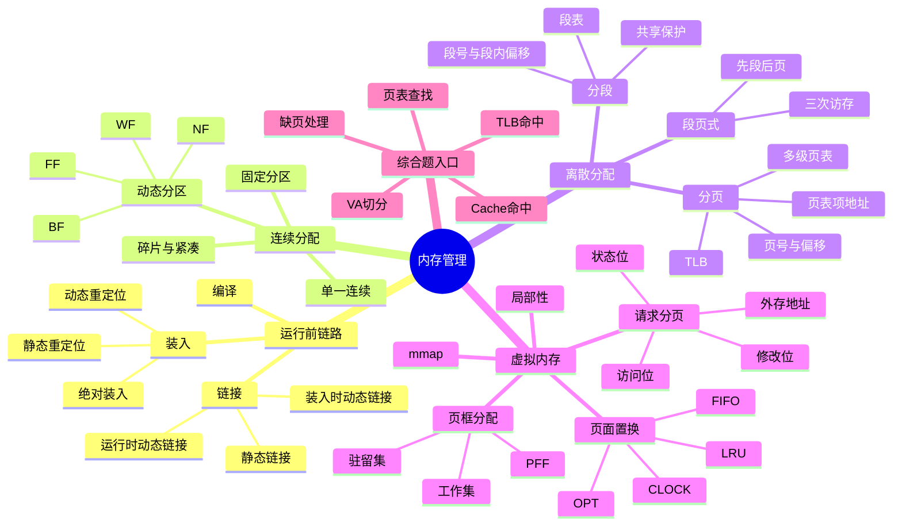

# 操作系统 第3章 内存管理

> 来源：`2026操作系统.pdf`，第3章 内存管理，PDF 页码 p189-p263。
> 新版重整理复核：按书签小节 p189-p263 对照整理，重点看图复核装入/链接、重定位、页表/段表/段页式结构、请求分页流程、页面置换表、地址翻译例题、习题解析和本章疑难点。
> 课件整合复核：读取并渲染 `操作系统基础考点讲解/第三章 内存管理` 17 个 PDF，补充 OS 期中/期末解析、OS 强化 P2/P3、历年真题合集和结课考试答案；已看图复核装入/链接、段页式地址变换、缺页中断、CLOCK、调页来源、TLB/Cache 串讲和教材习题解析关键页。

## 本章速览

- 内存管理的核心任务：分配回收、地址转换、逻辑扩充、共享、保护。
- 程序运行前先经历编译、链接、装入；装入方式和链接方式常考“发生时间”和“是否便于共享/更新”。
- 本章主线是从连续分配到离散分配：分页解决外部碎片，分段贴近用户逻辑，段页式折中。
- 地址转换公式必背：分页 `P=A/L, W=A%L, E=bL+W`；分段 `E=段基址+段内偏移`。
- 分页和分段最常混：页是系统管理单位，一维地址；段是用户逻辑单位，二维地址。
- 虚拟内存依赖局部性，特点是多次性、对换性、虚拟性；缺页中断和页面置换是核心。
- 高频计算：页号/偏移、页表项地址、TLB 平均访存时间、页面置换缺页次数、数组访问局部性。

## 课件补充来源

- 教材：`2026操作系统.pdf` 第3章 p189-p263，含正文、本节小结、习题、答案解析、本章疑难点。
- 基础考点讲解：`3.1.1_1 内存的基础知识.pdf`、`3.1.1_2 内存管理的概念.pdf`、`3.1.1_3 进程的内存映像.pdf`、`3.1.1_4 （选修）覆盖与交换.pdf`、`3.1.2_1 连续分配管理方式.pdf`、`3.1.2_2 动态分区分配算法.pdf`、`3.1.3_1 基本分页存储管理的基本概念.pdf`、`3.1.3_2 基本地址变换机构.pdf`、`3.1.3_3 具有快表的地址变换机构.pdf`、`3.1.3_4 两级页表.pdf`、`3.1.4 基本分段存储管理方式.pdf`、`3.1.5 段页式管理方式.pdf`、`3.2.1 虚拟内存的基本概念.pdf`、`3.2.2 请求分页管理方式.pdf`、`3.2.4 页面置换算法.pdf`、`3.2.5+3.2.3 页面分配策略.pdf`、`3.2.7 内存映射文件.pdf`。
- 强化与试卷解析：`OS期中试卷及答案解析（学员版）.pdf`、`OS期末试卷及答案解析（学员版）.pdf`、`操作系统P2_存储系统骚图pro.pdf`、`【带上课凌乱手稿】操作系统P2_存储系统骚图pro.pdf`、`操作系统P2_计组+操作系统存储系统串讲骚图.pdf`、`【带上课凌乱手稿】操作系统P2_计组+操作系统存储系统串讲骚图.pdf`、`操作系统P3（上半场）_存储系统真题补充.pdf`、`操作系统历年真题合集.pdf`、`操作系统强化【结课考试+答案】.pdf`。

## 关联导航

- 本章内部：[[03-内存管理#地址、装入与重定位|装入/链接/重定位]]、[[03-内存管理#基本分页存储管理|分页地址变换]]、[[03-内存管理#请求分页管理方式|请求分页]]、[[03-内存管理#页面置换算法|页面置换]]、[[03-内存管理#虚拟存储器性能影响因素|TLB/Cache 地址翻译]]、[[03-内存管理#课件补充/强化题规则|强化题规则]]。
- 操作系统联动：[[01-计算机系统概述#1.3 操作系统的运行环境|中断与异常]]、[[02-进程与线程#2.1 进程与线程|进程内存映像]]、[[05-输入输出管理#5.2 设备独立性软件|缓冲与设备分配]]。
- 计组联动：[[../计算机组成原理/03-存储系统#3.5 高速缓冲存储器 Cache|Cache]]、[[../计算机组成原理/03-存储系统#3.6 虚拟存储器|虚拟存储器]]、[[../计算机组成原理/05-中央处理器#5.5 异常和中断机制|异常处理]]。

## 知识网络

## 知识点清单

### 3.1 内存管理概念

- 内存管理：操作系统对内存空间进行划分、分配、回收和保护。
- 主要功能：
  - 内存空间分配与回收。
  - 地址转换：逻辑地址 -> 物理地址。
  - 内存空间扩充：通过覆盖、交换、虚拟存储等逻辑扩充。
  - 内存共享：允许多个进程访问同一只读区域或共享区域。
  - 内存保护：防止进程互相越界访问，保护 OS 和用户进程。

#### 地址、装入与重定位

- 逻辑地址/相对地址/虚拟地址：程序使用的地址，通常从 0 开始。
- 物理地址/绝对地址：内存单元真实地址，是地址转换的最终结果。
- MMU：把逻辑地址转换为物理地址的硬件机构，配合 OS 维护的表项工作。
- 用户程序变为可执行程序：
  - 编译：源程序 -> 若干目标模块。
  - 链接：目标模块和库函数 -> 装入模块。
  - 装入：装入模块 -> 内存中的运行程序。
- 装入方式：
  - 绝对装入：编译时已知装入物理地址，逻辑地址和物理地址一致；只适合单道程序等简单环境。
  - 可重定位装入/静态重定位：装入时一次性把相对地址改成物理地址；程序运行期间不能移动，必须一次获得所需连续空间。
  - 动态运行时装入/动态重定位：装入后仍保留相对地址，运行到某条指令时再由重定位寄存器转换；支持程序移动、交换、动态申请内存和程序段共享。
  - 动态重定位常用规则：先用界地址寄存器判断逻辑地址是否越界，再用 `物理地址 = 重定位寄存器 + 逻辑地址` 得到最终地址。
- 链接方式：
  - 静态链接：运行前把目标模块和库函数链接成完整装入模块；需修改相对地址并解析外部符号，之后不再拆开。
  - 装入时动态链接：边装入边链接；便于目标模块修改、更新和共享。
  - 运行时动态链接：程序执行中真正需要某目标模块时才链接；未用模块不装入，能加快装入并节省内存。
- 重定位：
  - 静态重定位发生在装入时，地址转换一次完成。
  - 动态重定位发生在运行时，需要硬件地址变换机构支持。
- 保护寄存器：
  - 重定位寄存器存放起始物理地址，用来“加”。
  - 界地址寄存器存放最大逻辑地址，用来“比”。
  - 加载这些寄存器必须使用特权指令。

#### 进程内存映像、覆盖与交换

- 进程内存映像：进程调入内存后形成的布局。
  - 代码段：二进制机器代码，通常只读，可被多个进程共享。
  - 数据段：全局变量、静态变量等运行数据。
  - PCB：操作系统在系统区维护，用于控制和管理进程。
  - 堆：由 `malloc/free` 等动态分配，通常向高地址增长。
  - 栈：函数调用相关信息，通常向低地址增长。
  - 共享库映射区：存放共享库代码，可被多个进程映射共享。
- 覆盖：把程序划分为若干段，让不会同时执行的段共用同一内存区；可在较小内存中运行较大程序，但需要程序员参与划分，组织复杂。
- 覆盖细节：常把必要部分放固定区，互斥执行部分放覆盖区；覆盖由 OS 按覆盖结构装入，但覆盖结构要由程序员声明，对用户不透明。
- 交换/对换：把暂不运行的进程或部分程序数据换出到外存，需要时再换入；可提高并发度，但换入换出开销大。
- 交换细节：通常优先换出阻塞或低优先级进程，PCB 等管理信息仍需保留；外存交换区速度通常快于文件区。

#### 内存共享与保护

- 可重入代码/纯代码：允许多个进程同时访问，但不允许任何进程修改。
- 共享原则：只读代码最适合共享；数据区通常私有，必须修改时只改私有数据，不改共享代码。
- 分页共享：多个进程页表中的页表项指向同一物理页框。
- 分段共享：多个进程段表项指向同一共享段，通常比分页共享更自然。
- 内存保护方式：
  - 上、下限寄存器：检查物理地址是否落在合法范围。
  - 重定位寄存器 + 界地址寄存器：先比逻辑地址是否越界，再加基址得到物理地址。
  - 页表/段表中的保护位和有效位也可用于访问控制。
  - 内存保护是 OS 的职责，但必须由硬件地址检查配合完成。

#### 连续分配管理方式

- 单一连续分配：
  - 内存中只装一道用户程序。
  - 简单、无外部碎片，但有内部碎片，内存利用率低。
- 固定分区分配：
  - 用户区划成若干固定分区，每个分区装一道作业。
  - 有内部碎片，无外部碎片。
  - 分区大小固定，程序太大可能放不进任何分区。
- 动态分区分配：
  - 作业装入时按需建立分区，分区大小可变。
  - 有外部碎片，可用紧凑技术解决，但紧凑需要动态重定位支持且开销大。
  - 回收分区时看相邻空闲区：上邻/下邻均空闲则三者合并且空闲分区数减少；只邻一侧通常合并但数量不变；两侧都不空闲则新增一个空闲分区。
- 动态分区分配算法：

| 算法 | 空闲分区组织 | 选择规则 | 特点 |
| --- | --- | --- | --- |
| 首次适应 FF | 按地址递增 | 从头找第一个够大的分区 | 开销小，综合性能最好 |
| 邻近适应 NF | 按地址递增，循环查找 | 从上次位置继续找 | 避免总从低地址找，但易破坏大分区 |
| 最佳适应 BF | 按容量递增 | 找最小的够大分区 | 容易留下大量小外部碎片 |
| 最坏适应 WF | 按容量递减 | 找最大的分区 | 很快消耗大分区，性能差 |

- 索引搜索分配：
  - 快速适应：按常用大小分类，查表取链首；查找快，但回收合并复杂。
  - 伙伴系统：分区大小为 `2^k`，分裂成伙伴，回收时相邻伙伴可合并。
  - 哈希算法：用空闲分区大小作为关键字定位空闲链表。

#### 基本分页存储管理

- 页/页面：进程逻辑地址空间被划分成的固定大小块。
- 页框/页帧/物理块：物理内存被划分成的同样大小块。
- 页面大小通常取 `2^k`，便于用二进制地址拆分页号和页内偏移。
- 页面大小取舍：
  - 过小：页表项多，页表长，地址转换和换入换出开销大。
  - 过大：页内碎片大，内存利用率降低。
- 分页特点：
  - 无外部碎片。
  - 有内部碎片，平均约半页。
  - 作业逻辑地址空间是一维的，程序员只给出一个线性地址。
- 逻辑地址结构：`页号 P + 页内偏移量 W`。
- 地址转换：
  - 页面大小为 `L`，逻辑地址为 `A`。
  - `P = A / L`，`W = A % L`。
  - 若 `P >= 页表长度 M`，越界中断。
  - 页表项地址：`页表始址 F + P x 页表项长度`。
  - 取页表项得到物理块号 `b`。
  - 物理地址：`E = b x L + W`。
- 页表：
  - 每个进程一张页表。
  - 页表项连续存放，页号可隐含，不一定实际存储。
  - 页表项至少要能表示所有物理页框号，还可含有效位、保护位、访问位等。
  - 页表项长度题先算物理页框号位数，再按字节向上取整；实际系统常让一个页框能容纳整数个页表项，所以页表项可能比理论最小值更大。
- 页表寄存器 `PTR`：
  - 存放页表始址和页表长度。
  - 单 CPU 系统一般只有一个页表寄存器，进程切换时装入当前进程页表信息。
- 快表 `TLB`：
  - 保存最近访问的页表项，主存页表也称慢表；TLB 是高速相联存储器，不在主存中。
  - 无 TLB 时，访问一个数据通常需两次访存：查页表一次，访问数据一次。
  - TLB 命中时，通常只需一次访存访问数据。
  - TLB 未命中时，查内存页表后应把页表项调入 TLB，若 TLB 满则替换旧项。
  - TLB 提高地址转换速度，但不减少缺页中断次数。
  - TLB 未命中不等于缺页：页表项可能在主存页表中且状态位有效，此时只补入 TLB。
- 有效访问时间常见模型：
  - 若 TLB 查找时间忽略，命中率为 `a`，内存访问时间为 `t`：`EAT = a x t + (1-a) x 2t`。
  - 若 TLB 查找时间为 `e`：`EAT = a x (e+t) + (1-a) x (e+2t)`。
  - 若题干说明 TLB 和页表可并行查找，未命中路径的 TLB 时间通常被查慢表时间覆盖，常按 `a(e+t)+(1-a)2t` 或题干给定路径计算。
- 多级页表：
  - 解决页表过大、需要连续存放、无用页表常驻内存的问题。
  - 外层页表记录下一级页表位置，只有用到的页表才调入内存。
  - 代价：TLB 未命中时访存次数增加。
  - 设计多级页表时通常要求每一级页表能放入一个页框；若外层页表仍大到一个页框放不下，就继续分级。
  - 页内偏移位数：`d = log2(页大小)`；页号位数：`逻辑地址位数 - d`。
  - 页表项数：`逻辑地址空间页数`；页表占用空间：`页表项数 × 页表项长度`。
  - 两级页表无 TLB 时，访问数据通常需要 3 次访存：外层页表、二级页表、数据。
  - 多级页表若 TLB 命中，仍可直接得到页框号，访问数据通常只需 1 次访存。

#### 基本分段存储管理

- 分段：按程序逻辑结构划分，如主程序段、子程序段、数据段、栈段。
- 分段特点：
  - 段是信息的逻辑单位，面向用户，便于共享和保护。
  - 段长可变，内存按段分配。
  - 有外部碎片，无内部碎片。
  - 作业地址空间是二维的，地址表示为 `段号 S + 段内偏移 W`。
- 段表：
  - 每个进程一张段表。
  - 段表项至少包含段长和段基址，还可含保护位、共享位等。
  - 段表寄存器保存段表始址和段表长度，进程切换时随运行现场切换。
- 地址转换：
  - 先判断 `S` 是否超过段表长度。
  - 再判断 `W` 是否超过该段段长；通常 `W >= 段长` 即越界。
  - 合法时，物理地址 `E = 段基址 b + W`。
- 分段共享和保护：
  - 共享更符合用户逻辑，只需共享对应逻辑段。
  - 保护可按段设置读、写、执行权限。

#### 段页式存储管理

- 段页式：先把进程按逻辑结构分段，再把每段分页；物理内存仍按页框分配。
- 逻辑地址结构：`段号 S + 页号 P + 页内偏移 W`。
- 表结构：
  - 每个进程只有一个段表。
  - 每个段可有一张页表，因此页表可能有多张。
  - 段表项记录页表始址和页表长度。
- 地址转换：
  - 先查段表，得到该段页表始址。
  - 再查页表，得到物理块号。
  - 拼接块号和页内偏移得到物理地址。
  - 无 TLB 时，取一次数据通常需要 3 次访存：段表、页表、数据。
  - 可引入快表，以 `(段号, 页号)` 作为查询关键字；命中后可直接得到物理块号。
- 特点：
  - 兼有分段的逻辑清晰、便于共享保护，以及分页的内存利用率高。
  - 开销比单纯分页或分段更大。
  - 地址空间仍是二维的，因为用户只感知段号和段内地址，分页是 OS 管理行为。

### 3.2 虚拟内存管理

#### 虚拟内存基本概念

- 传统存储管理的局限：
  - 一次性：作业必须一次全部装入内存。
  - 驻留性：作业运行期间一直驻留内存。
- 局部性原理：
  - 时间局部性：刚访问过的指令或数据，短期内可能再次访问。
  - 空间局部性：访问某单元后，附近单元短期内可能被访问。
- 虚拟存储器：
  - 程序装入时只装入当前需要的少数页/段。
  - 访问未在内存的信息时，由 OS 请求调入。
  - 内存不足时，置换暂不用的信息到外存。
- 虚拟地址空间：
  - 大小主要由虚拟地址位数决定，如 32 位按字节编址最多形成 `4GB` 虚拟地址空间。
  - 虚拟存储不是扩充外存，而是借助外存从逻辑上扩充主存。
- 虚拟内存特征：
  - 多次性：作业可多次调入内存，是最重要特征。
  - 对换性：运行中可换入、换出。
  - 虚拟性：从逻辑上扩充内存容量，是最终表现。
- 实现方式：
  - 请求分页存储管理。
  - 请求分段存储管理。
  - 请求段页式存储管理。
- 硬件支持：
  - 一定容量的内存和外存。
  - 页表/段表机制。
  - 缺页/缺段中断机构。
  - 地址变换机构。

#### 请求分页管理方式

- 请求分页在基本分页基础上增加：
  - 请求调页功能。
  - 页面置换功能。
  - 缺页中断处理。
- 请求分页页表项增加字段：
  - 状态位/存在位 `P`：该页是否在内存。
  - 访问字段 `A`：访问次数或最近未访问时间，供置换算法使用。
  - 修改位 `M`/脏位：调入后是否被修改，决定换出时是否写回外存。
  - 外存地址：该页在外存中的位置。
- 缺页中断：
  - 访问页不在内存时产生。
  - 属于内中断/异常。
  - 发生在指令执行期间，而不是指令执行完之后。
  - 一条指令可能产生多次缺页中断。
  - 缺页处理后，应重新执行引起缺页的指令。
  - 进程通常由运行态转为阻塞态，缺页调入完成后再转入就绪态等待调度。
- 请求分页地址变换简化流程：
  - 检查页号是否越界。
  - 查 TLB，命中则形成物理地址并访问。
  - 未命中则查页表。
  - 若页在内存，更新 TLB、访问位/修改位，形成物理地址。
  - 若页不在内存，产生缺页中断。
  - OS 查找缺页外存位置；内存满时选 victim 页面。
  - victim 若被修改，写回外存；再把缺页调入内存。
  - 更新页表和 TLB，恢复进程执行。
  - 若被换出的页在 TLB 中，其快表项也要删除或置无效；调入页对应表项可直接加入 TLB，题干另有说明时按题干处理。
- 页框分配：
  - 驻留集：分配给某进程的物理页框集合。
  - 驻留集太小：缺页频繁。
  - 驻留集过大：浪费内存，降低多道程序并发度。
  - 驻留集大小不能小于工作集大小，否则易频繁缺页并诱发抖动。
- 分配与置换策略：

| 策略 | 含义 | 特点 |
| --- | --- | --- |
| 固定分配局部置换 | 页框数固定，只换出本进程页 | 简单，但页框数难确定 |
| 可变分配全局置换 | 页框数可变，可从全局换出 | 灵活，但可能盲目增加进程页框 |
| 可变分配局部置换 | 页框数可调，只换本进程页 | 兼顾独立性和动态调整，开销较大 |

- 固定分配不能与全局置换组合，因为全局置换会改变进程拥有的页框数。
- 缺页率控制 `PFF`：缺页率过高说明驻留集偏小，应增加页框或降低多道程序度；缺页率过低说明页框可能分配过多，可回收部分页框。
- 物理块分配算法：
  - 平均分配：各进程平均分。
  - 按比例分配：按进程大小比例分。
  - 优先权分配：重要/紧迫进程分更多页框。
- 调页策略：
  - 预调页：运行前预测并调入，成功率有限，常用于首次调入。
  - 请求调页：运行时缺页再调入，虚拟存储器常用。
- 页面从何处调入：
  - 对换区足够：可把进程相关页面先复制到对换区，提高调页速度。
  - 对换区不足：未修改文件页从文件区调入；可能修改的页换出到对换区。
  - UNIX 方式：未运行过页从文件区调入；运行后换出的页从对换区调入。

#### 页面置换算法

- 目标：选择调出哪个页面，使缺页率尽量低。
- OPT 最佳置换：
  - 淘汰以后永不使用或最长时间后才使用的页。
  - 理论最优，但无法实际实现。
  - 常作为评价其他算法的基准。
  - 注意区分“以后最长时间不用”和 LRU 的“过去最长时间未用”。
- FIFO 先进先出：
  - 淘汰最早进入内存的页面。
  - 实现简单，但未利用局部性，性能较差。
  - 可能出现 Belady 异常：页框数增加，缺页次数反而增加。
- LRU 最近最久未使用：
  - 淘汰最近最长时间未被访问的页面。
  - 利用过去推测未来，效果好。
  - 需要记录访问历史，硬件/软件开销较大。
  - 属于栈类算法，不出现 Belady 异常。
- 简单 CLOCK：
  - 每页有访问位 `A`。
  - 指针循环扫描，遇到 `A=0` 的页则淘汰。
  - 遇到 `A=1` 的页，将其改为 `0`，给第二次机会。
  - 也称近似 LRU 或 NRU 思想。
- 改进型 CLOCK：
  - 同时考虑访问位 `A` 和修改位 `M`。
  - 优先级：`(0,0)` 最优，`(0,1)` 次之，`(1,0)`，`(1,1)` 最差。
  - 先找未访问且未修改页，尽量减少写回磁盘。
  - 可减少 I/O，但扫描轮次可能增加。
  - 常见四轮规则：第一轮找 `(0,0)`；第二轮找 `(0,1)` 且把扫过页面访问位置 0；第三轮再找 `(0,0)`；第四轮找 `(0,1)`，此时必能选出 victim。

#### 抖动、工作集与页框回收

- 抖动/颠簸：
  - 刚换出的页马上又要换入，刚换入的页马上又被换出。
  - 根本原因：分配给进程的物理块太少，不能容纳其活跃页面。
  - 后果：大量时间用于换入/换出，CPU 利用率急剧下降。
- 处理抖动：
  - 减少多道程序度，撤销或挂起部分进程。
  - 给进程分配更多页框。
  - 采用工作集或缺页率控制策略。
- 工作集：
  - 某段时间窗口内进程实际访问的页面集合。
  - 工作集大小反映近期局部性。
  - 只有当工作集完全包含在驻留集中时，才能保证不因工作集页面缺失而频繁缺页。
  - 工作集记作 `W(t, Δ)`：时刻 `t` 前长度为 `Δ` 的窗口中访问过的不同页面集合；工作集大小可能小于窗口长度。
- 页面缓冲算法：
  - 空闲页面链表：保留被换出但未修改的页框内容，若后续再访问可直接取回。
  - 修改页面链表：暂存已修改页，积累到一定数量后批量写回磁盘。
  - 目的：降低页面换入/换出的磁盘 I/O 频率。
- 页框回收：
  - 大部分内核页框不可回收。
  - 进程代码段、数据段、堆栈、文件映射页、共享内存页通常可回收。
  - Linux 中可由 `kswapd` 在空闲页框低于阈值时发起回收。
  - 回收不是简单丢弃：脏页可能先写回磁盘，干净页可直接复用或挂入空闲链。

#### 内存映射文件

- 内存映射文件：把磁盘文件映射到进程虚拟地址空间的一段区域。
- 特点：
  - 建立映射时不必把整个文件读入内存。
  - 访问到相应页时才按页调入。
  - 程序可像访问内存一样读写文件。
  - 关闭映射或退出时，修改过的页再写回磁盘。
  - 与 `open/seek/read/write` 的传统方式相比，mmap 省去频繁系统调用和显式缓冲复制，文件页可直接参与虚拟内存管理。
- 用途：
  - 简化文件读写。
  - 多进程可把同一文件映射到各自虚拟地址空间，并映射到同一物理内存，实现共享。

#### 虚拟存储器性能影响因素

- 缺页率是主要性能因素。
- 页面大小：
  - 页面大：缺页率可能低，页表短，但页内碎片大。
  - 页面小：碎片小，但页表长，缺页率和管理开销可能上升。
- 分配给进程的物理块数：
  - 增加页框通常降低缺页率。
  - 超过某阈值后收益很小，只会浪费内存。
- 置换算法：
  - 好算法保留未来更可能访问的页，如 LRU、CLOCK。
- 写回磁盘频率：
  - 修改页逐个写回开销大。
  - 批量写回和页面缓冲可降低 I/O。
- 程序局部性：
  - 局部性越好，缺页率越低。
  - 行优先存储的数组按行遍历通常比按列遍历局部性更好。
- TLB 和 Cache 地址翻译：
  - 综合题常见查找顺序：TLB -> 页表 -> Cache/主存；若页不在内存，再触发缺页从外存调入。
  - 访问虚拟地址题的固定步骤：先拆 `虚页号 + 页内偏移`；用虚页号查 TLB；TLB 不中再查页表；页表有效则拼出物理地址；用物理地址查 Cache；Cache 不中才访问主存。
  - 页内偏移位数：`log2(页面大小/编址单位)`。
  - 虚页号位数：`虚拟地址位数 - 页内偏移位数`。
  - 物理页号位数：`物理地址位数 - 页内偏移位数`。
  - TLB 组索引位数取决于 TLB 组数，剩余高位为 TLB 标记。
  - Cache 块内偏移取决于行大小，组索引取决于组数，剩余高位为 Cache 标记。

### 3.3 本章疑难点

- 分页 vs 分段：

| 对比 | 分页 | 分段 |
| --- | --- | --- |
| 目的 | 系统管理需要，提高内存利用率 | 用户逻辑需要，便于共享和保护 |
| 单位 | 固定大小页 | 不定长逻辑段 |
| 地址空间 | 一维线性地址 | 二维地址 |
| 碎片 | 有内部碎片，无外部碎片 | 有外部碎片，无内部碎片 |
| 透明性 | 对用户透明 | 用户可感知段结构 |
| 共享保护 | 粒度较机械 | 粒度更符合逻辑 |

- 段页式不是“三维地址空间”：
  - 物理内存按页框管理，但用户逻辑仍按段理解。
  - 虽然地址字段有 `S/P/W` 三部分，作业地址空间仍看作二维。
- 多级页表的关键：
  - 解决页表过大和连续存放问题。
  - 不会减少缺页中断。
  - TLB 命中时，不必逐级查页表。

## 易错点/易混点

- 内存的物理存取速度由硬件决定，不是 OS 内存管理直接决定。
- 内存保护是 OS 的任务，但必须有硬件配合，不能只靠软件。
- 编址空间大小通常由地址位数决定，不由当前内存容量决定。
- 虚拟内存并没有真的扩大内存或外存，只是从逻辑上扩充主存。
- 进程运行时看到的是逻辑地址；物理地址转换机制对用户透明。
- 绝对装入只适合已知物理装入位置的简单环境；现代多道程序通常不考它作为通用方案。
- 可重定位装入是装入时改地址，运行后不能移动；动态运行时装入是运行时改地址，必须有重定位寄存器等硬件支持。
- 静态链接在运行前完成；装入时动态链接边装入边链接；运行时动态链接用到模块时才链接，未用模块不必装入。
- 运行时动态链接的关键词是“运行过程中”“需要某目标模块时才链接”，不是编译或装入时完成。
- 覆盖解决“小内存运行大程序”，但对程序员负担大；交换提高并发度，但磁盘 I/O 开销大。
- 重定位寄存器是“加”，界地址寄存器是“比”。
- 动态分区产生外部碎片，固定分区产生内部碎片。
- 最佳适应名字好听，但最容易留下小碎片；首次适应综合性能通常最好。
- 回收动态分区时，上邻/下邻同时空闲才会让空闲分区数减少；只和一侧合并通常数量不变。
- 分页无外部碎片，但有页内碎片；平均约半页。
- 分段无内部碎片，但有外部碎片。
- 段页式以固定页框管理物理内存，所以通常按有内部碎片处理。
- 页号在页表项中可以隐含，因为页表项连续存放。
- 页表项数量主要由虚拟地址空间大小和页面大小决定，不由物理地址位数直接决定。
- 页表项大小至少要能表示物理页框号，还可能要容纳控制位。
- 页式地址空间是一维，分段和段页式地址空间是二维。
- 分页由系统完成，对用户透明；分段更贴近用户程序逻辑。
- 无 TLB 且不缺页时：页式取一次数据通常访存 2 次，段式 2 次，段页式 3 次。
- TLB 命中可减少地址转换访存次数，但不减少缺页次数。
- 多级页表 TLB 命中时仍通常只需一次访问数据；未命中才逐级查表。
- 二级页表解决页表占用连续内存和无用页表常驻问题，但增加查表开销。
- 请求分页和基本分页的关键区别是：请求分页不要求一开始全部装入，并支持缺页调入和置换。
- 请求分页需要页表机制、缺页中断机构和地址变换机构；基本分页不具备请求调页和置换功能。
- 虚拟存储容量不是由物理内存大小决定；常见题先看虚拟地址位数和编址单位。
- 缺页中断发生在指令执行期间，处理后要重新执行该指令。
- 缺页中断由“需要访问的页不在内存”引起，处理后继续执行被中断的那一条指令。
- 一条指令可能产生多次缺页中断。
- 若页面在内存中，不会发生缺页中断，也不会发生页面调入/调出。
- 初始空页框调入页面会缺页，但不一定发生页面置换；不要把缺页次数等同于置换次数。
- 页面尺寸增大时，程序所需页数通常减少，缺页次数可能下降；但页内碎片会增大。
- FIFO 可能出现 Belady 异常；OPT 和 LRU 不会。
- FIFO 页框数增加时，缺页次数可能增加，也可能减少，不是必然增加。
- LRU 开销大，原因是要记录并比较最近使用历史。
- 改进型 CLOCK 优先淘汰 `(A=0, M=0)`，尽量避免写回磁盘。
- 固定分配不能配全局置换，因为全局置换会改变进程页框数。
- 工作集不一定是驻留集的子集；工作集中的页可能尚未调入或已被换出。
- 抖动主要是物理块不足导致频繁缺页，不是简单增大交换区或提高 CPU 速度能解决。
- 对换区足够时，换出页优先从对换区调入；文件页未修改时可从文件区重新调入，修改页通常要写回对换区或文件。
- 内存映射文件不是把整个文件一次性加载进内存，而是按需调页。
- 数组按行优先存放时，按行遍历通常局部性更好，缺页更少。
- 地址翻译综合题中，虚拟地址先用于 TLB/页表查页框，形成物理地址后再查 Cache/主存。
- Cache 命中不代表 TLB 一定命中；TLB 管地址翻译，Cache 管数据副本，题目要按两个层次分别判断。

## 课件补充/强化题规则

- 装入/链接三问法：问“地址何时确定”判装入，问“模块何时合并”判链接，问“运行中能否移动/换出换入”判是否需要动态重定位。
- 静态重定位题：装入时一次性修改地址；运行期不能移动，必须一次分配所需连续空间；因此不适合频繁交换和动态扩展。
- 动态重定位题：逻辑地址先与界地址比较，合法再加重定位寄存器；加载重定位/界地址寄存器属于特权操作。
- 连续分配题：先判固定还是动态。固定分区看内部碎片；动态分区看外部碎片、紧凑、回收合并和 FF/NF/BF/WF 排序方式。
- 页表项长度题：先由物理地址位数和页大小算页框号位数，再加控制位，最后按字节向上取整；若题干强调页表项整齐装入页框，要考虑取整后的页表项长度。
- 页表项地址题：公式是 `页表始址 + 页号 x 页表项长度`，不是乘页面大小；页号等于页表长度时已经越界。
- TLB 平均访存题：先画路径。顺序查找未命中通常是 `TLB + 页表 + 数据`；并行查找要按题干把 TLB 时间是否被慢表时间覆盖处理。
- TLB/缺页判断题：TLB 未命中只说明快表没有副本；页表状态位为 1 时不缺页，状态位为 0 才缺页。
- 多级页表题：无 TLB 时 `n` 级页表访问一次数据通常需 `n+1` 次访存；TLB 命中时不逐级查表。多级页表减少页表连续存放压力，不减少地址转换层级。
- 分段题：先查段号是否越过段表长度，再查段内偏移是否小于段长；段长比较用 `W >= 段长` 判越界。
- 段页式题：用户逻辑上仍是二维地址；物理内存按页框分配；无 TLB 时段表、页表、数据三次访存。
- 请求分页题：缺页发生在指令执行期间，处理后重新执行该指令；一条指令可能因源地址、目的地址、指令本身等产生多次缺页。
- 置换统计题：初始空页框导致缺页但不置换；缺页率用缺页次数除以访问总次数；置换次数通常小于或等于缺页次数。
- 置换算法题：OPT 看未来，LRU 看过去，FIFO 看进入内存先后，CLOCK 看访问位，改进 CLOCK 同时看访问位和修改位。
- Belady 异常题：只把 FIFO 当重点嫌疑；OPT、LRU 等栈类算法不会因页框数增加而缺页次数反增。
- 工作集/PFF 题：工作集是窗口内去重页面集合；驻留集小于工作集易抖动；PFF 过高加页框，PFF 过低可回收页框。
- 地址翻译综合题：拆 VA -> 查 TLB -> 查页表/可能缺页 -> 拼 PA -> 查 Cache -> 访主存。页内偏移在 VA 到 PA 转换中保持不变。
- Cache/TLB 串讲题：TLB 标记来自虚页号，Cache 标记/索引常来自物理地址；Cache 命中时直接给数据，Cache 未命中才访问主存。
- mmap 题：映射只建立虚拟地址到文件的关系，不立即读完整文件；访问文件页时按需调入，脏页在换出、关闭或同步时写回。

## 注解

- 学内存管理先抓三件事：地址怎么切、表项存什么、怎样从逻辑地址走到物理地址。
- 装入/链接题先问“发生在什么时候”：编译时已知地址是绝对装入，装入时改地址是静态重定位，运行时改地址是动态重定位。
- 链接题先问“模块什么时候合并”：运行前全合并是静态链接，装入时合并是装入时动态链接，用到才合并是运行时动态链接。
- 碎片判断口诀：固定大小分配看内部碎片，不定长连续分配看外部碎片。
- 页式计算题先找页面大小，再拆页号和页内偏移；页内偏移位数就是页面大小的指数。
- 页表项地址题别漏“页表项长度”：`页表基址 + 页号 x 页表项长度`。
- TLB 题先画路径：命中走 TLB + 数据；未命中走 TLB + 页表 + 数据；缺页另加磁盘调页和重执行。
- 页面置换题先区分“缺页”和“置换”：有空页框时只缺页不置换。
- Belady 只盯 FIFO；看到页框更多反而缺页更多，第一反应就是 FIFO 异常。
- 工作集题抓窗口：在给定时间窗口内去重得到页面集合。
- 地址翻译综合题按位切分：虚页号/页内偏移 -> TLB 组索引/标记 -> 物理页号 -> Cache 索引/标记。

## 速背检查

1. 内存管理的五个主要功能是什么？分配回收、地址转换、扩充、共享、保护。
2. 逻辑地址和物理地址区别？逻辑地址是程序使用的地址，物理地址是内存真实地址。
3. MMU 做什么？把逻辑地址转换为物理地址。
4. 编译、链接、装入分别做什么？源程序成目标模块，目标模块成装入模块，装入模块入内存。
5. 三种装入方式是什么？绝对装入、可重定位装入、动态运行时装入。
6. 哪种装入运行后不能移动？可重定位装入/静态重定位。
7. 哪种装入需要重定位寄存器？动态运行时装入。
8. 三种链接方式是什么？静态链接、装入时动态链接、运行时动态链接。
9. 用到某模块时才链接是哪种？运行时动态链接。
10. 覆盖和交换分别解决什么？覆盖让小内存运行大程序，交换提高并发度。
11. 重定位寄存器和界地址寄存器分别干什么？重定位用于加基址，界地址用于比较越界。
12. 固定分区有什么碎片？内部碎片。
13. 动态分区有什么碎片？外部碎片。
14. 动态分区哪种算法综合性能最好？首次适应。
15. 最佳适应的常见问题是什么？容易产生很多小外部碎片。
16. 分页有外部碎片吗？没有。
17. 分页有什么碎片？内部碎片/页内碎片。
18. 页面大小过小有什么问题？页表长，地址转换和换页开销大。
19. 页面大小过大有什么问题？页内碎片大。
20. 页式逻辑地址由什么组成？页号和页内偏移。
21. 分页中 `P` 和 `W` 怎么算？`P=A/L`，`W=A%L`。
22. 分页物理地址怎么算？`E=块号 x 页面大小 + 页内偏移`。
23. 无 TLB 的页式系统取一次数据通常访存几次？2 次。
24. TLB 命中时通常访存几次？1 次。
25. 多级页表解决什么？页表过大、连续存放和无用页表常驻问题。
26. 分段逻辑地址由什么组成？段号和段内偏移。
27. 分段地址空间是几维？二维。
28. 段页式每个进程有几张段表？一张。
29. 段页式每个进程可能有几张页表？多张。
30. 段页式无 TLB 取一次数据通常访存几次？3 次。
31. 虚拟内存三个特征是什么？多次性、对换性、虚拟性。
32. 虚拟内存基于什么原理？局部性原理。
33. 虚拟地址空间大小主要由什么决定？虚拟地址位数和编址单位。
34. 请求分页页表比基本页表多哪些关键字段？状态位、访问字段、修改位、外存地址。
35. 缺页中断属于什么？内中断/异常。
36. 缺页处理后原指令怎么办？重新执行。
37. 哪个置换算法可能出现 Belady 异常？FIFO。
38. LRU 淘汰什么页？最近最长时间未使用的页。
39. 简单 CLOCK 主要看哪一位？访问位。
40. 改进 CLOCK 还看哪一位？修改位。
41. 抖动根本原因是什么？分配物理块太少，不能容纳活跃页面。
42. 工作集是什么？某时间窗口内进程实际访问过的页面集合。
43. 内存映射文件有什么好处？像访问内存一样访问文件，便于共享。
44. TLB 未命中一定缺页吗？不一定，还要看页表状态位。
45. 分段越界要检查什么？段号是否超过段表长度，段内偏移是否小于段长。
46. 多级页表无 TLB 访存次数怎么算？`n` 级页表取一次数据通常 `n+1` 次。
47. 页表项地址为什么不能乘页面大小？页表项连续存放，偏移单位是页表项长度。
48. 改进 CLOCK 最优先淘汰哪类页？`A=0, M=0` 的页。
49. 缺页但不置换什么时候发生？内存还有空闲页框时。
50. 地址翻译综合题的主路径是什么？VA 拆分、查 TLB、查页表、拼 PA、查 Cache/主存。
