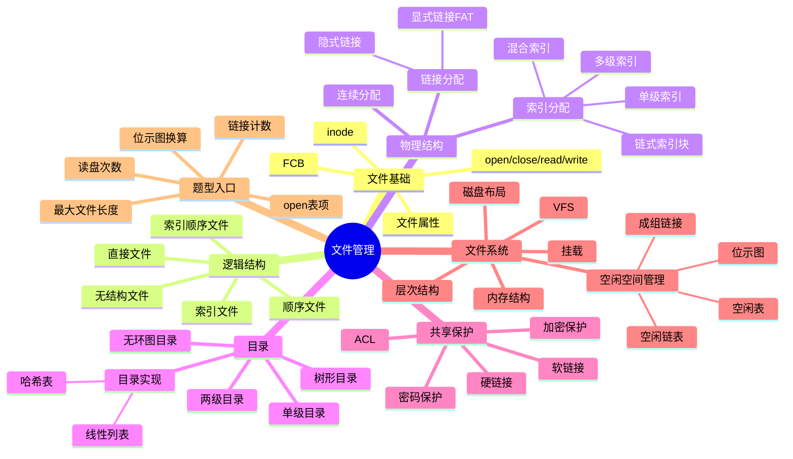
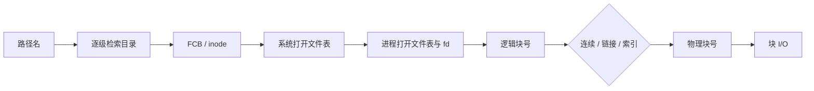

# 操作系统 第4章 文件管理

> 来源：`2026操作系统.pdf`，第4章 文件管理，PDF 页码 p264-p317。
> 复核：本章已做 p264-p317 全章 OCR 抽取，渲染全章页面，并直接查看文件控制块/索引节点、逻辑结构与物理结构、连续/链接/索引分配图、目录结构、硬链接/软链接、文件系统层次、位示图、成组链接法、VFS、挂载、习题解析和本章疑难点。
> 课件整合复核：共读取 25 组 394 页资料，包括教材、17 份基础/磁盘联动课件、OS 期中/期末解析、P3/P4 文件系统骚图与手稿、强化结课考试及答案、历年真题；185 个扫描/低文本页完成 OCR，并直接查看全部 73 张页面联系图。重点复核目录项瘦身、FAT、混合索引、硬/软链接、ACL、UFS 布局、位示图、成组链接、VFS/挂载及教材习题解析。
> 二次查漏（2026-07-16）：重新遍历同一批 25 组 394 页资料，直接查看 25 张覆盖全部页面的联系图，并高清复核 20 个定义、结构图、公式和真题关键原页；补齐定长记录寻址、链式索引块、目录检索精确公式、UFS/FAT 布局、vnode、挂载遮蔽及成组链接终止标志，并统一 0/1 基编号口径。

## 本章速览

- 文件是以外存为载体的信息集合；OS 通过目录、FCB/索引节点管理“名字 -> 文件”的映射。
- 文件操作的关键是 `open()`：打开后读写通常使用文件描述符/句柄，不再反复用文件名查目录。
- 逻辑结构面向用户，物理结构面向外存；连续、链接、索引分配是本章最核心对比。
- 目录管理解决按名存取、检索效率、重名、共享与保护；树形目录、无环图目录、硬/软链接常考。
- 文件系统要把用户的文件操作变成磁盘块操作，重点掌握层次结构、磁盘/内存布局、空闲空间管理、VFS 和挂载。
- 高频计算：索引节点可管理最大文件、索引级数、访问磁盘次数、位示图盘块号与行列号转换。

## 课件补充来源

- 教材：`2026操作系统.pdf` 第4章 p264-p317，含正文、本节小结、习题、答案解析、本章疑难点。
- 基础考点讲解：`4.1_1_初识文件管理.pdf`、`4.1_2_文件的逻辑结构.pdf`、`4.1_3_文件目录.pdf`、`4.1_4_文件的物理结构.pdf`、`4.1_5_逻辑结构VS物理结构.pdf`、`4.1_6_文件存储空间管理.pdf`、`4.1_7_文件的基本操作.pdf`、`4.1_8_文件共享.pdf`、`4.1_9_文件保护.pdf`、`4.3_1_文件系统的层次结构.pdf`、`4.3_2_文件系统布局.pdf`、`4.3_4_虚拟文件系统.pdf`。
- 同目录跨章课件已读取：`5.3_1_磁盘的结构.pdf`、`5.3_2_磁盘调度算法.pdf`、`5.3_3_减少磁盘延迟时间的方法.pdf`、`5.3_4_磁盘的管理.pdf`、`5.3_5_固态硬盘SSD.pdf`；OS4 只吸收与文件系统布局和盘块管理相关的背景，详细磁盘调度归入 [[05-输入输出管理#5.3 磁盘和固态硬盘|OS 第5章磁盘和固态硬盘]]。
- 强化与试卷解析：`OS期中试卷及答案解析（学员版）.pdf`、`OS期末试卷及答案解析（学员版）.pdf`、`操作系统P3+P4_文件系统骚图.pdf`、`操作系统P4【凌乱手稿】_文件系统骚图.pdf`、`操作系统强化【结课考试】.pdf`、`操作系统强化【结课考试+答案】.pdf`、`操作系统历年真题合集.pdf`。

## 关联导航

- 本章内部：[[04-文件管理#4.1.2 FCB 与索引节点|FCB 与 inode]]、[[04-文件管理#4.1.5 文件的物理结构|文件物理结构]]、[[04-文件管理#4.2.5 文件共享|文件共享]]、[[04-文件管理#4.3.3 文件存储空间管理|空闲空间管理]]、[[04-文件管理#4.3.4 虚拟文件系统 VFS|VFS]]、[[04-文件管理#课件补充/强化题规则|强化题规则]]。
- 操作系统联动：[[03-内存管理#3.2.7 内存映射文件|内存映射文件]]、[[03-内存管理#3.2.8 虚拟存储器性能影响因素|局部性与 Cache/TLB]]、[[05-输入输出管理#5.2 设备独立性软件|缓冲与设备独立性]]、[[05-输入输出管理#5.3 磁盘和固态硬盘|磁盘调度与 SSD]]。
- 计组联动：[[../计算机组成原理/03-存储系统#3.4 外部存储器|外部存储器]]、[[../计算机组成原理/03-存储系统#3.5 高速缓冲存储器 Cache|Cache 与局部性]]。

## 知识网络

## 知识点清单

### 4.1 文件系统基础

#### 4.1.1 文件的基本概念

- 文件：以计算机硬盘等外存为载体的、具有文件名的一组相关信息集合。
- 用户以文件为基本 I/O 单位，文件系统负责把文件名、逻辑记录和外存块联系起来。
- 文件属性常见包括：
  - 文件名：用户可读名称。
  - 标识符：系统内部唯一标识，通常用户不可见。
  - 类型：区分普通文件、目录文件、特殊文件等。
  - 位置：文件在外存上的存放位置。
  - 大小：当前长度或最大长度。
  - 保护信息：访问权限、用户/组等。
  - 时间信息：创建、修改、访问时间。
- 文件分类角度：
  - 按性质和用途：系统文件、用户文件、库文件。
  - 按数据形式：源文件、目标文件、可执行文件。
  - 按访问控制：只读、读写、可执行等。
  - 按组织形式：普通文件、目录文件、特殊文件。

#### 4.1.2 FCB 与索引节点

- 文件控制块 FCB：OS 为管理文件而设置的数据结构，存放文件属性、位置、访问控制和使用信息。
- 文件目录：FCB 的有序集合；一个 FCB 就是一个文件目录项。
- 目录文件：目录本身也可看作一种文件，用于保存目录项。
- FCB 典型内容：
  - 基本信息：文件名、物理位置、逻辑结构、物理结构。
  - 访问控制信息：用户权限、访问方式。
  - 使用信息：创建/修改/访问时间、当前使用情况。
- UNIX 思路：把文件名和文件描述信息分离。
  - 目录项只保存文件名和索引节点号。
  - 索引节点 inode 保存文件属性和物理地址等元数据。
  - 这样目录项变小，目录检索时可减少读盘次数。
- 磁盘索引节点常含：文件主、文件类型、访问权限、物理地址、长度、链接计数、访问/修改/索引节点修改时间。
- 内存索引节点在磁盘 inode 基础上增加运行期信息：inode 号、状态、引用计数、逻辑设备号、队列指针等。

#### 4.1.3 文件的基本操作

- 创建文件：分配外存空间，在目录中建立目录项。
- 删除文件：根据文件名找目录项，回收外存空间，删除目录项。
- 打开文件 `open()`：
  - 检索目录，检查权限。
  - 把文件控制信息复制到内存打开文件表。
  - 在进程打开文件表中登记表项，返回文件描述符/句柄。
- 关闭文件 `close()`：删除进程打开文件表项，必要时更新系统打开文件表和外存元数据。
- 读/写文件：根据文件描述符、读写指针和权限执行 I/O。
- 定位 `lseek()`：改变当前文件读写指针。
- 打开文件后常维护的信息：
  - 文件指针：记录当前读写位置，通常每个打开该文件的进程各有一份。
  - 打开计数：记录文件被多少进程打开，便于最后一次关闭时清理。
  - 磁盘位置缓存：减少重复查目录和读 FCB/inode。
  - 访问权限/打开方式：限制本次打开后的读写行为。
- 两级打开表关系：
  - **进程打开文件表**：以 `fd` 为索引，保存本次打开的读写指针、访问方式，并指向系统打开文件表项。
  - **系统打开文件表**：保存共享的文件控制信息、内存 inode/FCB 指针和打开计数。同一文件被另一进程打开时，通常只增加进程表项并使打开计数加 1。
  - `close()` 先删本进程表项并使打开计数减 1；计数为 0 才删除系统表项。关闭文件不等于删除文件。
  - 找到 FCB/inode 后即可由其标识文件，**文件名不一定保存在打开文件表中**；选择题说“打开表必须含文件名”是错的。
- 两类计数不要混：inode 的**链接计数**统计指向它的目录项，打开/引用计数统计仍在使用它的打开实例；`close()` 改后者，`link/unlink` 改前者。

#### 4.1.4 文件的逻辑结构

- 逻辑结构：从用户角度看到的文件内部组织形式，与外存介质无关。
- 无结构文件/流式文件：
  - 文件被看成字节流或字符流。
  - 常见于源程序、目标程序、可执行文件。
  - 没有 OS 规定的记录边界，通常按字节偏移读写；可用 `lseek()` 定位字节，但按记录关键字查找一般仍需应用程序解释并扫描。
- 有结构文件/记录式文件：
  - 由一组相似记录组成。
  - 定长记录便于快速定位；变长记录节省空间但定位复杂。
- 顺序文件：
  - 串结构：记录顺序通常与关键字无关。
  - 顺序结构：记录按关键字顺序排列。
  - 定长记录支持按记录号定位。记录 `i` 从 0 编号、记录长 `r`、块长 `B` 时：起始字节 `i*r`，逻辑块号 `(i*r) DIV B`，块内偏移 `(i*r) MOD B`；若记录从 1 编号，先把 `i` 换成 `i-1`。
  - 对定长且有序的顺序文件，可用折半查找；插入、删除维护成本较高。
  - 逻辑上能算出记录地址，不代表物理上只读 1 块；最终 I/O 还取决于连续、链接或索引分配。
- 索引文件：
  - 为文件建立索引表，索引项通常含关键字和记录地址。
  - 适合随机访问；缺点是索引表占空间。
- 索引顺序文件：
  - 分组建立稀疏索引，先查索引表定位分组，再在组内顺序查找。
  - 若 `N` 条记录分成约 `sqrt(N)` 组，平均查找次数约为 `sqrt(N)`。
  - 推广到 `K` 级索引：各层/组规模取约 `N^(1/(K+1))` 时较均衡，平均比较次数约为 `(K+1)N^(1/(K+1))/2`；考研通常重点掌握一级索引的 `sqrt(N)` 结论。
- 直接文件/散列文件：
  - 用散列函数把关键字映射到记录地址。
  - 查找快，但要处理冲突，不适合顺序处理。

#### 4.1.5 文件的物理结构

- 物理结构：文件数据块在外存上的组织方式，又称文件分配方式。
- 注意区分：
  - 文件物理分配：已分配给文件的磁盘块如何组织。
  - 空闲空间管理：未分配磁盘块如何记录和回收。
  - **索引文件**是用户视角的逻辑结构，索引项是“关键字 -> 记录地址”；**索引分配**是 OS 视角的物理结构，索引项是“逻辑块号 -> 物理块号”，二者不能互推。

| 分配方式 | 目录项/索引信息 | 访问特点 | 优点 | 缺点 |
| --- | --- | --- | --- | --- |
| 连续分配 | 起始块号 + 文件长度 | 顺序和随机访问都方便 | 顺序读写快，磁头移动少 | 要连续空间，有外部碎片，文件不易增长 |
| 隐式链接分配 | 首块指针 + 末块指针 | 主要顺序访问 | 无外部碎片，易增长 | 随机访问慢，指针坏会影响后续块，指针占空间 |
| 显式链接分配/FAT | 目录项存首块，FAT 存每块后继 | 可较快顺序和随机访问 | FAT 在内存时少读盘，可兼管空闲块 | FAT 占内存，磁盘大时开销明显 |
| 索引分配 | 每文件一个索引块/索引表 | 支持随机访问 | 无外部碎片，易增删 | 索引块有空间开销，大文件需多级索引 |

- 连续分配：
  - 若文件从物理块 `b` 开始、长度为 `n` 块，逻辑块从 0 编号时 `PBN=b+i`，合法范围 `0<=i<n`；逻辑块从 1 编号时才是 `PBN=b+i-1`。
  - 适合顺序访问和定长记录随机访问。
  - 文件增长困难，可能需要移动文件或预留空间。
- 隐式链接分配：
  - 每个文件块含指向下一块的指针。
  - 只能沿链逐块查找；链未缓存时，访问从 0 编号的逻辑块 `i` 要读 `i+1` 个数据块，访问从 1 编号的第 `i` 块要读 `i` 块。
  - 可用“簇”把若干块组合起来，减少指针和查找开销，但会增加内部碎片。
  - 题目只说“链接分配”而未说明 FAT 时，教材/课件通常按隐式链接处理；是否默认需以题干定义为准。
- 显式链接分配/FAT：
  - 所有块的后继指针集中在文件分配表中。
  - 目录项给出首块号，通过 FAT 可找到后续块。
  - FAT 的表项与全部磁盘块一一对应；本书例图中 `-1` 表示文件最后一块，`-2` 表示空闲块。
  - 不同题图可能用空白、`0`、`-1`、`-2` 等特殊值表示空闲或文件尾，先读题干图例，不要死背单一符号。
  - FAT 既记录文件各块的先后链接关系，也能标记空闲块，因此可用于文件分配和空闲空间管理。
- 索引分配：
  - 每个文件有索引块，索引项保存该文件各数据块号。
  - 设块长 `B`、地址项长 `a`，一个索引块可放 `K=B/a` 个地址；单级索引最大文件长度为 `K*B`。
  - 一个索引块放不下时有三种扩展：**链式索引块、多级索引、混合索引**。链式方案由 inode/目录项指向首个索引块，要访问后部索引块仍须依次追链，随机访问效率低。
  - 多级索引类似多级页表，`m` 级纯多级索引最多管理 `K^m` 个数据块，容量 `K^m*B`；每个索引块本身必须能装入一个磁盘块。
  - 若索引块不在内存，`m` 级索引访问目标数据块通常要访问 `m+1` 次磁盘；若题目说明索引节点/索引块已在内存，则相应扣掉已在内存的访问。
- 混合索引分配：
  - 把直接地址、一次间接、二次间接、三次间接结合。
  - 小文件可直接访问，大文件通过多级间接索引扩展。
  - UNIX 典型 inode 有 13 个地址项：`i.addr(0)-i.addr(9)` 是 10 个直接地址，`i.addr(10)` 一次间接，`i.addr(11)` 二次间接，`i.addr(12)` 三次间接。
  - 若块大小 4KB、地址项 4B，则每个索引块可存 `4KB/4B=1024` 个块号。
  - 该例最大文件长度为 `40KB+4MB+4GB+4TB`；不能只写最大的三次间接项。一般式为 `(d+sK+tK^2+uK^3)B`，其中 `d/s/t/u` 是直接、一级、二级、三级地址项数。
  - “最大文件长度”只统计数据块容量；问实际占用外存时，还要另算 inode 与各级索引块。
  - 文件最大长度、可存文件个数、最多可存某类文件数要同时看：inode/FCB 数量上限、数据区空间上限、目录项/文件名编号上限，取最小约束。

#### 4.1.6 文件保护

- 文件保护：防止未经授权的用户访问文件，也要限制已授权用户的访问方式。
- 常见访问类型：读、写、执行、追加、删除、列表。
- 访问控制表 ACL：
  - 为每个文件列出用户及其访问权限。
  - 简化形式常分为文件主、同组用户、其他用户。
- 访问矩阵：行表示用户/保护域，列表示文件等客体，单元格是访问权；ACL 是按客体保存矩阵的一列，能力表是按主体保存矩阵的一行。它们用于保护，不是文件备份方法。
- 密码保护：
  - 访问文件时输入密码。
  - 简单，但密码管理复杂，且通常不能细分访问类型。
- 加密保护：
  - 文件内容加密，只有掌握密钥才能读懂。
  - 保密性强，但编解码有开销。
- 目录保护也重要：不仅要保护文件内容，还要保护目录项、文件名和路径信息。

### 4.2 目录

#### 4.2.1 目录的基本概念

- 目录是文件名与文件之间的映射表，支持“按名存取”。
- 目录管理的基本要求：
  - 实现按名存取。
  - 提高目录检索速度。
  - 支持文件共享和访问控制。
  - 允许不同用户使用相同文件名。

#### 4.2.2 目录操作

- 目录操作：
  - 搜索目录：按路径名找到目录项。
  - 创建/删除文件：增加或删除文件目录项。
  - 创建/删除目录：维护树形目录层次；删除非空目录可选择拒绝删除，或递归删除其下文件和子目录。
  - 移动目录：改变父目录，路径名随之改变。
  - 显示目录：列出目录内容和属性。
  - 修改目录：目录中保存的属性改变时同步更新。

#### 4.2.3 目录结构

- 单级目录：
  - 整个文件系统只有一张目录表。
  - 实现简单，能按名存取。
  - 查找慢，不允许重名，不适合多用户，也不便共享。
- 两级目录：
  - 分为主文件目录 MFD 和用户文件目录 UFD。
  - MFD 记录用户名及其 UFD 位置；UFD 记录该用户文件的 FCB。
  - 解决多用户重名问题，提高检索速度，可在目录层面做访问限制。
  - 缺点是层次少，不便文件分类和跨用户共享。
- 树形目录：
  - 由根目录出发，目录和文件按层次组织。
  - 绝对路径：从根目录开始，如 `/dev/hda`。
  - 相对路径：从当前目录开始，如当前目录为 `/bin` 时，`./ls` 表示当前目录下的 `ls`。
  - 当前目录/工作目录可减少从根目录逐级查找的开销。
  - 优点是层次清晰、分类方便、便于管理和保护。
  - 缺点是普通树形结构不便共享文件。
- 无环图目录：
  - 在树形目录上增加指向同一文件或子目录的有向边，形成有向无环图。
  - 用共享计数记录有多少目录项指向共享节点。
  - 增加共享链时计数加 1；删除共享节点时先删除该用户的共享链并使计数减 1，计数为 0 才真正删除节点。
  - 便于共享，但系统管理更复杂。

#### 4.2.4 目录实现

- 目录实现的本质是提高“按路径查找目录项”的效率。
- 线性列表：
  - 目录项按线性表保存，查找时逐项比较。
  - 实现简单，删除可用空闲目录项表或移动最后一项填补。
  - 查找较慢；若按文件名排序，可折半查找，但创建/删除维护成本增加。
- 哈希表：
  - 对文件名做哈希，得到指向目录项的指针。
  - 查找、插入、删除较快。
  - 需要处理冲突，表大小改变不方便。
- 目录通常在磁盘上反复搜索，开销大；可把当前使用目录复制到内存，通过目录缓存减少 I/O。
- 目录检索性能主要由目录项数量、目录项大小和目录文件存放方式决定；与文件内容大小无直接关系。
- 顺序目录题：目录占用块数为 `ceil(目录项数*目录项大小/块大小)`。若每块放 `k` 个目录项、共有 `N=qk+r` 项且 `0<=r<k`，成功查找平均读目录块数
  `A=[k*q(q+1)/2+r(q+1)]/N`；若目录项只存“文件名 + inode 号”且 inode 块不在内存，总读盘数再加 1。只求近似时才用“约一半目录块”。

#### 4.2.5 文件共享

- 硬链接/基于索引节点的共享：
  - 多个目录项指向同一个 inode/索引节点。
  - inode 中维护链接计数 `count`，表示有多少目录项链接到该文件。
  - 建立硬链接：新增目录项指向同一 inode，`count+1`。
  - 删除硬链接：删除目录项，`count-1`；链接计数为 0 后不能再按名打开。若仍有进程持有打开引用，数据可保留到最后一次关闭；题目未给打开状态时通常简化为 `count=0` 即回收文件和 inode。
  - 查找速度快，因为目录项直接指向 inode。
  - 不会因为某个用户删除自己的目录项就让其他用户的链接悬空。
  - 同一文件的不同硬链接共享同一个磁盘 inode；若已被打开，也通常共享同一个内存 inode，但各进程的文件描述符、打开方式、读写指针可不同。
  - 传统 UNIX 中硬链接通常不能跨文件系统，并限制对目录建立硬链接；符号链接可以跨文件系统。
- 软链接/符号链接：
  - 系统创建一个 LINK 类型文件，文件内容保存目标文件路径名。
  - 访问软链接时，OS 先读 LINK 文件，再按路径查找目标文件。
  - 可以跨文件系统、跨机器共享，只要保存网络地址和路径即可。
  - 软链接自身也是一个文件，有自己的 inode 和链接计数；建立软链接不增加目标文件的硬链接计数。
  - 目标文件被删除后，软链接会失效；删除软链接本身只删除这个 LINK 文件，不影响目标文件。
  - 访问开销比硬链接大，且软链接文件也占用 inode 和磁盘空间。

### 4.3 文件系统

#### 4.3.1 文件系统结构

- 文件系统：OS 中负责管理和存储文件信息的软件机制，简称文件系统。
- 文件系统由三部分组成：
  - 与文件管理有关的软件。
  - 被管理的文件。
  - 实施文件管理所需的数据结构。
- 文件系统对用户的功能：
  - 文件基本操作。
  - 按名存取和目录组织。
  - 文件共享与保护。
- 文件系统对 OS 的功能：
  - 管理文件与磁盘的信息交换。
  - 完成逻辑结构到物理结构的转换。
  - 组织文件在磁盘上的存放。
  - 通过合理排放和调度提升系统性能。
- 文件系统层次：
  - I/O 控制层：设备驱动和中断处理，负责和硬件交互。
  - 基本文件系统：向设备驱动发送通用读写命令，管理缓冲区和缓存。
  - 文件组织模块：把逻辑块号转换为物理块号，并管理空闲空间。
  - 逻辑文件系统：管理元数据、目录结构、FCB/inode 和文件保护。

#### 4.3.2 文件系统布局

- 磁盘中的结构：
  - MBR：位于 0 号扇区，含主引导程序和分区表，用于启动和定位活动分区。
  - 引导块：每个分区通常从引导块开始，负责启动该分区的 OS。
  - 超级块：保存文件系统关键信息，如块数、块大小、空闲块数量、FCB 数量等。
  - 空闲空间管理区：用位示图、链表等记录空闲块。
  - inode/FCB 区：保存文件元数据。
  - 根目录、文件和目录区：保存目录树和实际文件内容。
- 典型布局辨图：
  - UFS 类卷通常含引导块、超级块、inode 区和目录/数据块；为提高局部性可按柱面组分散保存超级块副本、inode 和数据块。
  - FAT 类卷通常含引导扇区、一个或多个 FAT 副本、根目录区和数据区；根目录是否独立成区随 FAT 版本而异。
- 卷/分区：
  - 一个磁盘可分为多个分区，每个分区可有独立文件系统；一个卷也可能只是磁盘的一部分，或跨多个物理盘组成。
  - 一个文件系统的容量不一定等于磁盘容量，还受分区/卷大小、目录项、FCB/inode、FAT 等结构限制。
- 内存中的结构：
  - 安装表/挂载表：记录已挂载文件系统的信息。
  - 目录缓存：保存最近访问目录信息。
  - 系统打开文件表：保存每个打开文件的 FCB 副本、打开计数等。
  - 进程打开文件表：保存文件描述符/句柄，以及指向系统打开文件表项的指针。

#### 4.3.3 文件存储空间管理

- 文件存储空间管理，也叫文件空闲空间管理，目标是组织、分配和回收空闲磁盘块。
- 空闲表法：
  - 为每个空闲区建立表项：序号、起始空闲盘块号、空闲盘块数。
  - 适合连续分配，可用首次适应、最佳适应、最坏适应等算法。
  - 回收时要考虑前后空闲区相邻则合并。
  - 优点是分配速度较快，适合小文件连续分配；缺点是不适合大量离散空闲块。
- 空闲链表法：
  - 空闲盘块链：把所有空闲块逐块链接。
    - 分配和回收单块很简单。
    - 为一个文件分配多个块时可能要多次摘链，效率较低，链也较长。
    - 适合离散分配，较难快速得到连续空闲区。
  - 空闲盘区链：把连续空闲块组成盘区，每个盘区记录起始块号和块数。
    - 链较短，分配/回收效率高于盘块链。
    - 分配和回收时也要维护相邻盘区合并，过程更复杂。
- 位示图法：
  - 用 1 个二进制位表示 1 个盘块是否空闲。
  - 本书默认：`0` 表示空闲，`1` 表示已分配。
  - 若每行 `n` 位，行号和列号从 1 开始：
    - 盘块分配：找到 `map[i,j]=0`，盘块号 `b=n(i-1)+j`，置 `map[i,j]=1`。
    - 盘块回收：`i=(b-1) DIV n+1`，`j=(b-1) MOD n+1`，置 `map[i,j]=0`。
  - 若题目说明行列或盘块号从 0 开始，公式要相应改为 0 基。
  - 0 基统一公式：`b=ni+j`，逆变换 `i=b DIV n`、`j=b MOD n`。
  - 优点：位图小，可放内存，易找连续空闲块。
  - 位图占用空间 = 总盘块/簇数对应的位数，和当前空闲块数量无关；题目常要换算成字节数或占用多少簇。
  - 缺点：位图大小随磁盘总块数增大，适合小型计算机或中等规模磁盘。
- 成组链接法：
  - UNIX 常用，结合空闲表和空闲链表思想，避免表/链过长。
  - 把空闲块分组，每组第一个块记录下一组空闲块总数和块号。
  - 内存中维护空闲盘块号栈。
  - 分配：
    - 从栈顶弹出空闲块号并分配。
    - 若弹出的是栈底块，说明该块保存下一组空闲块号，要先把该块内容读入栈，再分配该块。
  - 回收：
    - 若栈未满，将回收块号压栈。
    - 若栈满，把当前栈内容写入回收块，把该回收块作为新一组的索引块。
  - 最后一组用终止值表示“没有下一组”；本书图中用 `0`，部分课件图用 `-1`，必须按题图约定识别，末组实际空闲块数也可能少于组容量。
  - 空闲盘块号栈或空闲空间位向量通常保存在卷头的超级块中；超级块要预先读入内存，并保持内存超级块与磁盘超级块一致。

#### 4.3.4 虚拟文件系统 VFS

- VFS：屏蔽不同文件系统差异，向上提供统一文件操作接口。
- 用户程序调用 `open()`、`write()` 等统一接口时，不必关心底层是 Ext、NTFS、FAT 还是其他文件系统。
- VFS 不是实际外存文件系统，只存在于内存中，系统启动时建立，关闭时消亡。
- VFS 抽象的四类对象：
  - 超级块对象：表示一个已安装/挂载的特定文件系统，保存该文件系统元数据。
  - 索引节点对象：表示一个具体文件，只有文件被访问时才在内存中建立。
  - 目录项对象：表示路径中的一个组成部分，包含指向父目录和相关 inode 的指针；磁盘上不一定有对应独立结构。
  - 文件对象：表示进程已经打开的文件，包含文件指针、目录项对象、文件系统信息和操作函数；文件对象和物理文件的关系类似“进程和程序”。
- 课件中的 vnode 是 VFS 在内存中采用的统一文件表示，含属性和指向具体文件系统操作函数的指针；vnode 只存在于内存，而 inode 可在外存长期保存并在访问时调入内存。
- 写文件的大致路径：用户空间 `write()` -> VFS 的 `sys_write()` -> 具体文件系统写方法 -> 物理介质。
- Linux/VFS 常考“四对象”，不包括“目录树对象”这类干扰项。

#### 4.3.5 文件系统挂载

- 挂载：文件系统在使用前必须先安装到某个目录，使用户能通过该目录访问设备中文件。
- 挂载点：被挂载文件系统接入目录树的位置。
- Windows：
  - 传统上用驱动器字母表示设备和卷。
  - 新版本也允许把文件系统挂载到目录树的任意位置。
- UNIX/Linux：
  - 根文件系统在启动时挂载，其他文件系统要挂载到根文件系统的某个目录下。
  - 挂载点必须是目录；若该目录原来非空，其原内容会在挂载期间被遮蔽，卸载后重新可见，并未被删除。
  - 同一个设备可以有多个挂载点。
  - 同一个挂载点同一时刻只能挂载一个设备。
  - 常用命令形态：`mount -t ext2 /dev/fd0 /flp`，卸载用 `umount`。

### 4.4 本章疑难点

- 文件三种物理分配方式快速比较：

| 项目 | 连续分配 | 链接分配 | 索引分配 |
| --- | --- | --- | --- |
| 访问第 `n` 条记录/块 | 通常访问磁盘 1 次 | 通常要沿链访问，可能 `n` 次 | 若索引已知，查索引后访问数据块 |
| 优点 | 顺序读写快，直接访问方便 | 无外部碎片，外存利用率高，动态增长方便 | 支持随机访问，文件易增删 |
| 缺点 | 要连续空间，有碎片，文件不易扩展 | 只能按链顺序访问，查找效率低，指针占外存空间 | 索引表占空间，查索引表会带来额外开销 |

- 文件打开过程：
  - 检索目录，确认文件已存在。
  - 把磁盘 inode/FCB 复制到活动 inode/系统打开文件表。
  - 将打开方式与访问权限比较。
  - 为进程分配打开文件表项，建立与系统打开文件表项的联系。
  - 返回文件描述符 `fd` 或文件句柄。

## 易错点/易混点

- `open()` 不是把文件内容全部读入内存，而是把文件控制信息登记到打开文件表。
- 打开后 `read/write/lseek/close` 使用文件描述符/句柄，不再每次用文件名查目录。
- 打开文件表不一定保存文件名；目录检索找到 FCB/inode 后，内核可直接靠控制信息标识文件。
- 一个文件通常对应一个 FCB/inode；但多个目录项可以通过硬链接指向同一个 inode。
- 目录项不一定保存完整 FCB。UNIX 中目录项只保存文件名和 inode 号，元数据在 inode 中。
- 磁盘 inode 保存长期元数据；内存 inode 还要保存引用计数、状态、队列指针等运行期信息。
- 文件指针通常属于一次打开/一个进程；打开计数是系统范围的打开次数统计。
- 逻辑结构不等于物理结构。顺序文件若采用隐式链接分配，随机访问仍然很慢。
- 连续分配支持直接访问，但有外部碎片且文件增长困难；逻辑块从 0 编号用 `b+i`，从 1 编号才用 `b+i-1`。
- 隐式链接分配没有外部碎片，但只适合顺序访问；显式链接/FAT 因 FAT 在内存中，可较快随机定位。
- 未特别说明 FAT 的“链接分配”通常指隐式链接；从 0 编号的第 `i` 块需沿链读 `i+1` 个数据块。
- 用簇能减少链指针和查找开销，但会带来内部碎片。
- 索引分配支持随机访问且无外部碎片，但索引块本身占空间；多级索引适合大文件，小文件纯多级会浪费。
- 索引表过大有链式索引块、多级索引、混合索引三种扩展；链式索引块仍需逐块追链，不能据“索引”二字判断为高效随机访问。
- 混合索引容量计算要分清直接、一次间接、二次间接、三次间接，每级索引项数 = 块大小/地址项大小。
- 最大文件长度只算数据块；问文件实际占用外存时还要计 inode 和已分配的索引块。
- 混合索引访问时间题要先看“索引节点是否已在内存”。直接地址通常直接给出数据块号；一次/二次/三次间接要多读相应级数的索引块。
- 密码/加密侧重防止未授权访问；访问控制表侧重规定“谁能以什么方式访问”。
- 单级目录无法解决文件重名；两级目录解决多用户重名但不便分类；树形目录便于分类但共享要额外机制。
- 相对路径从当前目录开始，绝对路径从根目录开始；设置当前目录可减少路径检索开销。
- 硬链接删除时只减少链接计数；软链接删除不影响目标文件，目标文件删除后软链接可能失效。
- 硬链接会增加目标文件链接计数；软链接创建的是独立 LINK 文件，不增加目标文件链接计数。
- 链接计数与打开/引用计数不是一回事：`unlink` 改前者，`open/close` 改后者；题干出现“已打开”时两类计数都要看。
- 通过硬链接打开同一文件时可共享内存 inode，但不同进程的打开文件表项、文件描述符、访问方式和读写位置不必相同。
- 顺序检索目录时，路径某一分量找不到即可停止，不必继续查。
- 顺序检索目录得到的是文件的逻辑地址/控制信息入口，不是直接得到文件内容。
- 目录文件已在内存时，做“读某文件需要几个磁盘块”类题，不再计目录文件块；但通常还要读目标 inode/索引节点块和数据块。
- 目录检索时间与目录项个数、目录项大小、目录实现有关；不要把文件大小算进目录查找时间。
- 空闲空间管理方法管理的是“空闲块”，不要和文件物理分配方式混为一谈。
- 位示图占用空间取决于磁盘总块数，不取决于当前空闲块数量。
- 2024 类题问“占用空间大小与当前空闲块数量无关”的空闲空间管理方法，优先想到位示图。
- 位示图题必须先看编号从 0 还是从 1 开始；本书公式默认行列从 1 开始。
- FAT 不仅记录文件块之间的链接，也可用特殊值标记空闲块，因此可参与空闲空间管理。
- VFS 的文件对象表示“进程视角下已打开的文件”，不是磁盘上的普通文件本体。
- VFS 四对象常考：超级块对象、索引节点对象、目录项对象、文件对象。
- VFS 的目录项对象是路径解析产生的内存对象，磁盘上没有一一对应的独立数据结构。
- vnode 只存在于内存并提供统一操作入口；inode 可同时有磁盘版本和调入内存后的版本。
- 挂载点同一时刻只能挂载一个设备；同一设备可以有多个挂载点。挂载会临时遮蔽挂载点原内容，卸载后原内容恢复可见。
- 文件系统容量不一定等于磁盘容量，可能小于分区/卷可用空间，也可能因磁盘阵列等跨多个物理盘。

## 课件补充/强化题规则

- 逻辑结构/物理结构判题：逻辑结构回答“用户看到的记录怎样组织”，物理结构回答“磁盘块怎样组织”；顺序文件不等于连续分配，索引文件也不等于索引分配。
- `open()` 过程题：先查目录确认文件存在并检查权限，再把 FCB/inode 调入系统打开文件表，建立进程打开文件表项，返回 fd/句柄；后续读写靠 fd，不再按文件名从头查目录。
- 打开表题：系统打开文件表按“同一打开文件的内核控制信息”计数，进程打开文件表保存本进程 fd、打开方式和指向系统表项的指针；多个进程可打开同一文件但读写指针不一定共享。
- 目录读盘次数题：先看根目录、当前目录、目标目录、inode/FCB、索引块是否已在内存；已在内存的结构不计磁盘 I/O，路径某一级找不到即可停止。
- 顺序目录精算题：若每块 `k` 项、`N=qk+r`，成功查找平均目录 I/O 为 `[kq(q+1)/2+r(q+1)]/N`；inode 与目录项分离且 inode 不在内存时再加 1。
- 综合读盘次数统一拆成三段：`路径/目录项定位 + inode/各级索引定位 + 数据块读写`。FAT 已在内存则沿 FAT 查链不读盘；隐式链必须把沿途数据块读入才能取得后继指针。
- 目录项瘦身题：FCB 大会导致目录文件占块多、检索慢；inode 机制让目录项只保存“文件名 + inode 号”，找到文件名后才读 inode。
- 连续分配题：目录项给起始块号和长度；0 基逻辑块用 `PBN=b+i`，1 基才用 `b+i-1`，并先检验逻辑块未越界。
- 隐式链接题：目录项给首块/末块，盘块内藏后继指针；0 基逻辑块 `i` 通常需读 `i+1` 个数据块，指针损坏会影响后续链。
- FAT 题：一个卷通常一张 FAT，开机后常驻内存；目录项只需首块号，查 FAT 不算磁盘 I/O，FAT 表项大小同时限制可表示块号范围和 FAT 总大小。
- 索引分配题：每个文件一张索引表；索引块最多容纳 `K=块大小/地址项大小` 个块号。表放不下时分链式索引块、多级索引、混合索引；纯 `m` 级容量为 `K^m*块大小`。
- 多级索引题：`m` 级索引若索引块都不在内存，访问目标数据块通常要读 `m` 个索引块 + 1 个数据块；若 inode/顶级索引块已在内存，要按题干扣减。
- 混合索引题：直接索引覆盖小文件；一次/二次/三次间接逐级扩大。最大长度按各级可管理数据块数相加，别把索引块本身当数据块。
- 末字节/末记录题：先由文件大小求逻辑块号，再判断落在直接、一级、二级还是三级间接区；磁盘访问数只计算题干未声明在内存中的索引块和目标数据块。
- 链式插入/修改题：先沿链读到插入点；再按实际修改的指针个数计写盘。不要把“读到内存的新记录”再算一次读盘，也不要漏掉原前驱块指针改写。
- 物理结构选型题：一次写入、不可修改且重视顺序/直接访问，优先连续分配；文件动态增长优先链接或索引；需要随机访问且大小可变优先索引。FCB 集中存放更利于一级目录的快速检索，和数据块混放会造成额外寻道。
- 文件系统容量题：同时看数据区块数、inode/FCB 数、目录项数、FAT 可表示块号数、文件名编号范围等限制，最终取最小约束。
- 硬链接题：多个目录项指向同一 inode，建立硬链接使链接计数加 1；删除一个目录项只让计数减 1，计数为 0 才真正释放文件。
- 若硬链接题同时给出“文件已打开”，链接计数归零只代表名称消失，还要等打开引用归零才能回收数据；普通教材题未给此条件时按链接计数判定。
- 软链接题：软链接是保存目标路径的独立文件，有自己的 inode；不增加目标硬链接计数，目标删除或路径变化会让软链接失效。
- 文件保护题：ACL/访问矩阵判“谁能做什么操作”；密码保护简单但不细分权限；加密保护内容但有编解码开销。
- 空闲表/空闲链题：空闲表适合连续分配并要合并相邻空闲区；空闲盘块链适合离散单块分配；空闲盘区链兼顾连续区但回收合并更复杂。
- 位示图题：先确认 `0/1` 含义和编号从 0 还是 1 开始；位图空间取决于磁盘总块/簇数，与当前空闲块数无关。
- 成组链接题：超级块中保存一组空闲块号；分配到栈底/组首块时，要先把该块中下一组信息读入超级块，再分配该块；回收栈满时把当前组信息写入回收块。
- 成组链接末组题：终止值按题图识别，本书用 `0`、部分课件用 `-1`；末组块数可小于每组上限，不要机械补满。
- VFS 题：VFS 是内存中的统一接口层，不是实际磁盘文件系统；常考四对象为超级块、inode、目录项、文件对象，vnode 只在内存中。
- 挂载题：挂载要在 VFS 注册文件系统、提供函数地址表、加入挂载点；同一挂载点同一时刻只能挂载一个设备，同一设备可有多个挂载点，挂载期间原目录内容被遮蔽而非删除。

## 注解

- 记忆主线：文件名通过目录找到 FCB/inode，FCB/inode 找到外存块，外存块再由磁盘驱动读写。
- 看到“按名存取”先想到目录；看到“文件属性/物理地址”先想到 FCB/inode；看到“打开后读写”先想到打开文件表和 fd/句柄。
- 逻辑结构回答“用户怎样看文件”，物理结构回答“磁盘上怎样放文件”。
- 连续、链接、索引可类比内存管理：
  - 连续分配像连续内存分配，有外部碎片。
  - 链接分配像链表，增删方便但随机访问慢。
  - 索引分配像页表，支持随机访问但表有开销。
- 文件共享题先判断是硬链接还是软链接：
  - 看到“索引节点、链接计数、多个目录项指向同一文件”就是硬链接。
  - 看到“LINK 类型文件、保存路径名、快捷方式、目标删除后失效”就是软链接。
- 磁盘访问次数题先划掉题目已说明“在内存中”的结构，再按路径目录块、inode/索引块、数据块逐层计数。
- 位示图题的安全步骤：
  - 先确认 0/1 含义。
  - 再确认行列/盘块号从 0 还是 1 开始。
  - 最后代入公式，不要凭直觉数。
- 位图空间题三步：先算总块/簇数，再换成位数和字节数，最后按块/簇大小向上取整。
- 文件系统层次从上到下可背：逻辑文件系统 -> 文件组织模块 -> 基本文件系统 -> I/O 控制。
- VFS 要点不是“新增一种文件系统”，而是“给不同文件系统套统一接口”。

## 速背检查

1. 文件名怎样找到数据？目录项找到 FCB/inode，后者把逻辑块映射为物理块，再进行块 I/O。
2. UNIX 为什么拆分目录项与 inode？目录项只留“文件名 + inode 号”，变小后可减少目录检索读盘。
3. `open()` 返回什么？返回进程打开文件表的索引 `fd`；它不是文件内容，也不是路径名。
4. 系统打开文件表和进程打开文件表各存什么？前者存共享控制信息和打开计数，后者存 `fd`、本次打开方式、读写指针及系统表指针。
5. 逻辑结构与物理结构怎样区分？前者回答用户怎样组织记录，后者回答 OS 怎样组织磁盘块。
6. 三种物理分配怎样选？连续方式快但难增长；链接方式易增长但隐式链随机访问慢；索引方式支持随机访问但有索引开销。
7. FAT 与隐式链接的关键差别？后继指针集中在常驻内存的 FAT 中，沿链通常不产生额外读盘。
8. 混合索引最大文件长度怎么算？直接块容量加各级间接索引能指向的数据块容量，索引块本身不算文件数据。
9. 目录结构主线是什么？单级简单但不能重名；两级解决用户间重名；树形便于分类；无环图支持共享。
10. 硬链接和软链接删除语义？硬链接计数为 0 才释放目标；软链接不增加目标计数，目标删除后可能悬空。
11. 文件系统磁盘/内存结构各抓什么？磁盘抓引导块、超级块、空闲区、inode/目录/数据区；内存抓挂载表、目录缓存和两级打开表。
12. 位示图 1 基公式是什么？`b=n(i-1)+j`；逆变换为 `i=(b-1) DIV n+1`、`j=(b-1) MOD n+1`，0 基题整体换公式。
13. 成组链接法的两个边界动作？分配到栈底先装入下一组；回收时栈满则把当前栈写入回收块并以它作为新组首块。
14. VFS 四对象是什么？超级块、inode、目录项、文件对象；VFS 只在内存中提供统一接口。
15. 综合读盘题怎样列式？按“目录定位 + inode/各级索引 + 数据块读写”分段，先划掉题干已在内存的结构。
16. 定长记录怎样随机定位？先算起始字节 `i*r`，再用 `DIV B` 得逻辑块、`MOD B` 得块内偏移；1 基记录号先减 1。
17. 连续分配和位示图的 0 基公式？前者 `PBN=b+i`；后者 `b=ni+j`，逆变换为 `i=b DIV n`、`j=b MOD n`。
18. 一个索引块放不下有哪三种扩展？链式索引块、多级索引、混合索引；链式方案仍须顺序追索引块。
19. 链接计数与打开计数分别由什么改变？`link/unlink` 改链接计数，`open/close` 改打开/引用计数。
20. 挂载非空目录会怎样？原内容暂时被新文件系统遮蔽，卸载后重新可见；内容没有被删除。
