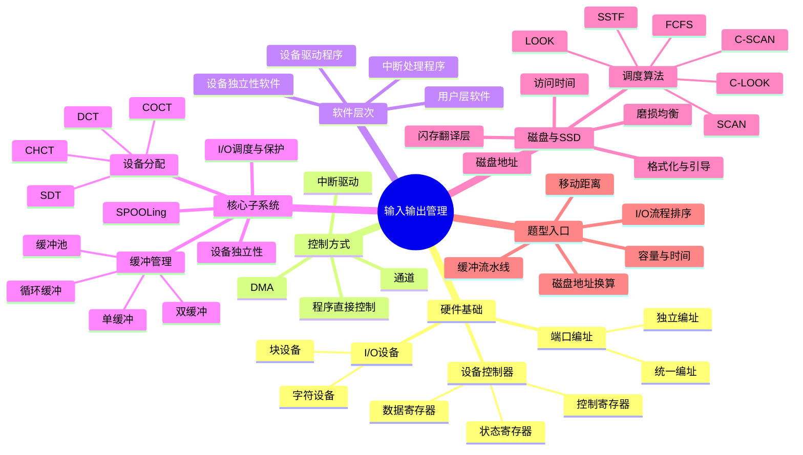

# 操作系统 第5章 输入/输出管理

> 来源：`2026操作系统.pdf`，第5章 输入/输出管理，PDF 页码 p318-p371。
> 复核：本章已做 p318-p371 全章 OCR 抽取，渲染全章页面，并直接查看设备控制器、I/O 编址、I/O 控制方式、DMA 控制器、通道、I/O 软件层次、缓冲区、设备分配数据结构、SPOOLing、键盘 I/O 操作流程、磁盘调度、SSD、习题解析和本章疑难点。
> 课件整合复核：本轮共读取教材、14 份基础课件、2 份阶段卷和 4 份强化资料，共 21 组 330 页；170 个扫描/低文本页补做 OCR，生成并逐张查看 64 张联系图。已看图复核控制方式、软件层次、缓冲时间线、设备分配表、SPOOLing、键盘 I/O 流程、磁盘调度、SSD、教材习题和统考真题。

## 本章速览

- I/O 管理主线：上层发出统一请求，OS 经设备独立层、驱动层、中断层，最终控制硬件。
- I/O 控制方式从轮询到通道，本质是逐步减少 CPU 对 I/O 的干预。
- 缓冲技术解决速度不匹配、数据粒度不匹配和中断频繁问题；单/双缓冲公式常考。
- 设备独立性让用户使用逻辑设备名，系统再映射到物理设备名，提高灵活性并支持重定向。
- SPOOLing 用磁盘井和内存缓冲区把独占设备逻辑上改造为共享设备。
- 磁盘题抓三件事：访问时间公式、调度算法移动距离、物理格式化/逻辑格式化/引导顺序。

## 课件补充来源

- 教材：`2026操作系统.pdf` 第5章 p318-p371，含正文、本节小结、习题、答案解析和本章疑难点。
- 5.1 基础课件：`5.1_1_IO设备的基本概念和分类.pdf`、`5.1_2_IO控制器.pdf`、`5.1_3_IO控制方式.pdf`、`5.1_4_IO软件层次结构.pdf`、`5.1_5_输入输出应用程序接口和驱动程序接口.pdf`。
- 5.2 基础课件：`5.2_1_IO核心子系统.pdf`、`5.2_2_假脱机技术.pdf`、`5.2_3_设备的分配与回收.pdf`、`5.2_4_缓冲区管理.pdf`。
- 5.3 基础课件：`5.3_1_磁盘的结构.pdf`、`5.3_2_磁盘调度算法.pdf`、`5.3_3_减少磁盘延迟时间的方法.pdf`、`5.3_4_磁盘的管理.pdf`、`5.3_5_固态硬盘SSD.pdf`。
- 强化与试卷解析：`OS期中试卷及答案解析（学员版）.pdf`、`OS期末试卷及答案解析（学员版）.pdf`、`操作系统P5【凌乱手稿】_IO过程梳理.pdf`、`操作系统强化【结课考试】.pdf`、`操作系统强化【结课考试_答案】.pdf`、`操作系统历年真题合集.pdf`。

## 关联导航

- 本章内部：[[05-输入输出管理#5.1.2 I/O 控制方式|I/O 控制方式]]、[[05-输入输出管理#5.1.3 I/O 软件层次结构|软件层次]]、[[05-输入输出管理#5.2.2 高速缓存与缓冲区|缓冲管理]]、[[05-输入输出管理#5.2.3 设备分配与回收|设备分配]]、[[05-输入输出管理#5.3.3 磁盘调度算法|磁盘调度]]、[[05-输入输出管理#课件补充/强化题规则|强化题规则]]。
- 操作系统联动：[[03-内存管理#3.2.7 内存映射文件|内存映射文件]]、[[04-文件管理#4.3.2 文件系统布局|文件系统布局]]、[[04-文件管理#4.3.3 文件存储空间管理|磁盘空闲空间管理]]。
- 计组联动：[[../计算机组成原理/07-输入输出系统#7.2 I/O 接口|I/O 接口与编址]]、[[../计算机组成原理/07-输入输出系统#7.3 I/O 方式|中断与 DMA]]、[[../计算机组成原理/03-存储系统#3.4 外部存储器|磁盘与 SSD]]。

## 知识网络

## 知识点清单

### 5.1 I/O 管理概述

#### 5.1.1 I/O 设备

##### I/O 设备分类

- I/O 设备：向计算机输入数据或接收计算机输出数据的外部设备。
- I/O 设备通常由机械部件和电子部件组成；电子部分即 I/O 控制器/设备控制器。类 Unix 系统常把设备抽象为特殊文件，使应用可沿用文件式接口访问设备。
- 按信息交换单位：
  - 块设备：以数据块为单位交换，如磁盘、U 盘。特点是传输速率较高、可寻址，典型控制方式是 DMA。
  - 字符设备：以字符为单位交换，如键盘、打印机。特点是速率低、不可寻址，常用中断驱动方式。
- 按存取方式：磁带是典型顺序存取设备；磁盘、光盘、U 盘可直接/随机访问，也可按顺序读写。
- 按传输速率：
  - 低速设备：键盘、鼠标等。
  - 中速设备：激光打印机等。
  - 高速设备：磁盘、光盘等。
- 按使用特性：
  - 人机交互设备：键盘、显示器、打印机。
  - 存储设备：磁盘、磁带、光盘。
  - 网络通信设备：网卡、调制解调器。
- 按共享属性：
  - 独占设备：同一时刻只能一个进程占用，如打印机。
  - 共享设备：一段时间内允许多个进程访问，典型是磁盘；需要可寻址、可随机访问。
  - 虚拟设备：通过 SPOOLing 把独占设备逻辑上改造为多个逻辑设备。

##### I/O 接口与设备控制器

- I/O 接口/设备控制器：CPU 与设备之间的桥梁，接收 CPU 命令并控制设备工作。
- 设备控制器组成：
  - CPU 与控制器接口：通过数据线、地址线、控制线与 CPU 通信。
  - 控制器与设备接口：一个控制器可连接一个或多个设备接口。
  - I/O 逻辑：译码 CPU 命令，选择设备，控制数据传送。
- 设备控制器主要功能：
  - 接收和识别命令。
  - 数据交换。
  - 标识和报告设备状态。
  - 地址识别。
  - 数据缓冲。
  - 差错控制。
- I/O 端口：设备控制器中可被 CPU 直接访问的寄存器。
  - 数据寄存器：缓存输入/输出数据。
  - 状态寄存器：保存设备状态，供 CPU 读取。
  - 控制寄存器：由 CPU 写入，用于启动命令或设置设备模式。
- 控制器与设备并非必然一一对应：一个控制器可接多个设备接口；同一设备也可能存在多条“设备-控制器-通道”通路。
- I/O 端口编址：

| 编址方式 | 特点 | 优点 | 缺点 |
| --- | --- | --- | --- |
| 独立编址 I/O | I/O 地址空间与主存地址空间分开 | I/O 端口译码简单，寻址快；专用 I/O 指令清晰 | 指令少、灵活性差；CPU 需提供两套读写控制信号 |
| 统一编址/内存映射 I/O | I/O 端口占用主存地址空间 | 可用普通访存指令访问 I/O，编程灵活；端口地址空间大 | 占用主存地址空间；全部地址线参与译码，译码复杂、速度可能下降 |

#### 5.1.2 I/O 控制方式

- I/O 控制方式的发展目标：减少 CPU 对 I/O 过程的干预，让 CPU 更多执行计算任务。

| 控制方式 | 数据单位 | CPU 参与 | 数据是否经 CPU 寄存器 | 特点 |
| --- | --- | --- | --- | --- |
| 程序直接控制/轮询 | 字/字节 | CPU 一直查询设备状态 | 是 | 简单，但 CPU 和设备串行，CPU 利用率低 |
| 中断驱动 | 字/字节 | 设备准备好后中断 CPU | 是 | CPU 可在设备准备期间做其他事，但每字/字节仍需 CPU 干预 |
| DMA | 数据块 | CPU 只做预处理和后处理 | 否 | 设备与内存直接交换数据，适合块设备 |
| 通道控制 | 一组 I/O 任务 | CPU 只启动通道程序 | 否 | 通道执行通道程序，可控制多台设备 |

- 程序直接控制方式：
  - CPU 发出 I/O 命令后不断轮询状态。
  - 设备准备好后，CPU 把数据从控制器寄存器取出并送入内存。
  - 缺点是 CPU 等待时间长，CPU 与 I/O 设备只能串行工作。
- 中断驱动方式：
  - CPU 发出 I/O 命令后可转去做其他事。
  - 设备准备好后向 CPU 发中断，CPU 执行中断处理程序完成数据传送。
  - 发出读命令的进程通常被阻塞；中断处理程序执行时，该请求进程仍可能处于阻塞态，直到数据就绪后再转入就绪队列。
  - 键盘中断服务例程读取的是键盘控制器的数据寄存器，再把字符送入系统/内核缓冲区。
  - 缺点是数据仍经过 CPU 寄存器，且按字/字节干预，不适合高速块设备。
  - 简化的中断处理顺序：硬件保存断点并完成模式切换 -> 保存现场 -> 转入中断服务程序 -> 执行服务 -> 恢复现场 -> 中断返回。设备中断通常使原阻塞进程由阻塞态转为就绪态，不保证立刻运行。
- DMA 方式：
  - 在设备和内存之间建立直接数据通路。
  - 以块为单位传送；CPU 只在开始和结束时参与。
  - DMA 控制器常见寄存器：
    - CR：命令/状态寄存器，保存 I/O 命令或设备状态。
    - MAR：内存地址寄存器，保存源/目标内存地址。
    - DR：数据寄存器，保存正在传送的数据。
    - DC：数据计数器，保存本次传送字节数或字数。
  - DMA 传送阶段：预处理由 CPU 初始化 DMA；数据传送由 DMA 控制；后处理由 DMA 中断 CPU。
  - 读磁盘块的常考顺序：CPU 初始化 DMA 并启动磁盘 -> DMA 将块送入内存缓冲区 -> 传送完成后 DMA 发中断 -> CPU 执行“DMA 结束”中断服务程序。
- 通道控制方式：
  - I/O 通道是一种特殊处理机，可执行通道指令。
  - 通道指令类型较少；通道没有自己的内存，通道程序放在主存中，与 CPU 共享内存。
  - CPU 只需告诉通道程序位置和目标设备，通道完成任务后中断 CPU。
  - 与 DMA 区别：DMA 每次按 CPU 设置传送一个或多个连续块，控制对象较少；通道执行主存中的通道程序，可组织多条 I/O 指令并管理多台设备。

#### 5.1.3 I/O 软件层次结构

- I/O 软件常分为 4 层，自上而下：

| 层次 | 主要功能 |
| --- | --- |
| 用户层软件 | 产生 I/O 请求，格式化 I/O，部分 SPOOLing 功能 |
| 设备独立性软件 | 设备命名与映射、保护、分块、缓冲、分配 |
| 设备驱动程序 | 设置设备寄存器，检查设备状态，发出具体 I/O 命令 |
| 中断处理程序 | 保存/恢复上下文，处理中断信号，唤醒相关进程 |

- 设备独立性软件、设备驱动程序和中断处理程序属于内核 I/O 子系统；用户层库函数在用户态发起系统调用，真正控制设备的工作在内核态完成。
- 功能定位：I/O 调度、缓冲、分配、保护、统一命名多在设备独立层；设备寄存器读写和设备专用命令在驱动层；完成通知和唤醒在中断层。

- 磁盘 `read` 的层次处理可记为：
  - 用户层发出 `read`。
  - 设备独立层解析统一命令。
  - 驱动层把抽象请求转换为设备专用命令。
  - 中断层响应设备完成事件。
  - 硬件控制器实际执行 I/O。
- 数据返回时按相反方向逐层回到用户程序。
- 层次题以“逻辑请求向下、完成结果向上”判断：请求路径为用户层 -> 设备独立层 -> 驱动层 -> 中断层/硬件；完成中断沿反方向通知并唤醒进程。

#### 5.1.4 应用程序 I/O 接口

- 字符设备接口：
  - 以字符为单位，顺序存取，不可寻址。
  - 提供 `get/put`、`in-control`、打开/关闭等操作。
  - 常用于键盘、打印机等，通常采用中断方式。
- 块设备接口：
  - 以数据块为单位，可寻址，传输速率较高。
  - 常用于磁盘，通常采用 DMA。
  - 支持抽象的打开、读、写、关闭等命令；可把二维磁盘地址抽象成线性块号。
  - 内存映射文件把文件映射到进程虚拟地址空间，使访问文件像访问内存一样。
- 网络设备接口：
  - 常用套接字 socket 接口。
  - 应用通过本地套接字创建连接，发送和接收网络数据。
- 阻塞 I/O：
  - 发起 I/O 后进程阻塞，I/O 完成后被唤醒。
  - 简单，适合并发量小场景。
- 非阻塞 I/O：
  - 发起 I/O 后进程不阻塞，但要轮询 I/O 是否完成。
  - 进程可做其他事，但轮询会消耗 CPU 时间。
- 应用程序 I/O 接口与驱动程序接口不要混：前者按字符、块、网络设备向应用提供抽象操作；后者规定 OS 调用驱动的统一入口。统一驱动接口让不同厂商驱动可接入同一 OS，但驱动本身仍与具体设备和 OS 密切相关。
- I/O 管理要完成的 4 类功能：
  - 状态跟踪：实时掌握设备状态。
  - 设备存取：实现对设备的读写。
  - 设备分配：多用户环境下分配和回收设备。
  - 设备控制：驱动设备，处理中断、完成和故障。

### 5.2 设备独立性软件

#### 5.2.1 设备独立性软件

- 设备独立性软件也称与设备无关软件，是 I/O 系统最高层的内核 I/O 软件。
- 设备独立性：用户程序使用的设备不依赖具体物理设备。
- 实现方式：用户用逻辑设备名请求 I/O，系统运行时把逻辑设备名映射为物理设备名。
- 好处：
  - 增加设备分配灵活性。
  - 易实现 I/O 重定向。
  - 程序运行不受具体机器环境限制，便于移植。
- 设备独立性软件主要功能：
  - 执行所有设备的公有操作。
  - 逻辑设备名到物理设备名的映射。
  - 设备保护，禁止用户直接访问设备。
  - 缓冲管理、差错控制和设备错误处理。
  - 提供统一接口，如 `read/write`。
- I/O 调度：对同一设备的请求排队并选择服务次序，磁盘调度是典型；I/O 保护：检查进程是否有权访问目标设备，设备文件权限可用于实现保护。

#### 5.2.2 高速缓存与缓冲区

- 磁盘高速缓存 Disk Cache：
  - 利用内存暂存从磁盘读出的盘块信息。
  - 逻辑上属于磁盘，物理上驻留在内存。
  - 可固定开辟一片缓存区，也可把空闲内存作为缓冲池与请求分页、磁盘 I/O 共享。
- 引入缓冲区的目的：
  - 缓和 CPU 与 I/O 设备速度不匹配。
  - 减少 CPU 中断频率，放宽中断响应时间要求。
  - 解决数据粒度不匹配。
  - 提高 CPU 与 I/O 设备的并行性。
- 单缓冲：
  - 设备输入一块到缓冲区时间为 `T`，缓冲区到用户工作区传送时间为 `M`，CPU 处理时间为 `C`。
  - `T` 可与 `C` 并行，但 `M` 不能与二者都并行。
  - 平均处理一块数据时间：`Max(C,T)+M`。
  - 连续处理 `n` 块的总时间：`T + (n-1)[Max(C,T)+M] + M + C`；不能只用稳态平均时间乘 `n`，首块装入和末块处理要单算。
  - 若 `T>C`，CPU 处理完后要等缓冲区装满；若 `T<C`，设备装满缓冲区后要等 CPU 取走数据。
  - 缓冲区是共享资源，使用时要互斥，满缓冲不能继续写入，空缓冲不能继续取出。
- 双缓冲：
  - 又称缓冲对换，一个缓冲区装入，另一个缓冲区传送和处理。
  - `C+M` 可与 `T` 并行。
  - 平均处理一块数据时间：`Max(C+M,T)`。
  - 连续处理 `n` 块的总时间：`T + (n-1)Max(T,M+C) + M + C`。
  - 两台机器通信时，单缓冲只能半双工；双向同时传输时，每台机器通常要设置发送缓冲区和接收缓冲区，双缓冲可实现双向并行传输。
- 循环缓冲：
  - 多个缓冲区链接成循环队列。
  - `in` 指向第一个可输入数据的空缓冲区，`out` 指向第一个可提取数据的满缓冲区。
- 缓冲池：
  - 管理多个缓冲区的机制，可被多个进程共享。
  - 3 类队列：空缓冲队列、输入队列、输出队列。
  - 4 类工作缓冲区：
    - `hin`：收容输入。
    - `sin`：提取输入。
    - `hout`：收容输出。
    - `sout`：提取输出。
- 高速缓存与缓冲区对比：

| 项目 | 高速缓存 | 缓冲区 |
| --- | --- | --- |
| 相同点 | 都介于高速设备和低速设备之间 | 都介于高速设备和低速设备之间 |
| 存放数据 | 低速设备上某些数据的副本 | 正在高速/低速设备间传递的数据，低速设备上不一定有备份 |
| 目的 | 提高重复访问速度，若命中则不访问低速设备 | 协调速度差异，降低等待和中断频率 |

- 若 I/O 时间远短于 CPU 处理时间，缓冲难以进一步提高并行度；是否设置缓冲应看两端速度差和并行收益，而非“有 I/O 就一定要缓冲”。

#### 5.2.3 设备分配与回收

- 设备分配目标：提高设备利用率，尽量让设备忙碌，同时避免不合理分配导致死锁。
- 设备分配数据结构：
  - DCT：设备控制表，每台设备一张，记录设备类型、物理标识符、状态、控制器指针、等待队列等。
  - COCT：控制器控制表，每个控制器一张，记录控制器状态、连接通道、等待队列等。
  - CHCT：通道控制表，每个通道一张，记录通道状态、连接控制器、等待队列等。
  - SDT：系统设备表，全系统一张，记录所有物理设备及其 DCT/驱动入口等。
- 设备分配考虑因素：
  - 设备固有属性：独占、共享、虚拟。
  - 设备分配算法：FCFS、最高优先级优先等。
  - 分配安全性：是否会导致进程死锁。
  - 设备独立性：是否使用逻辑设备名。
- 按申请时机：
  - 静态分配：进程运行前一次分配所需设备，运行结束再归还；不会发生设备死锁，但设备利用率低，独占设备常采用。
  - 动态分配：进程运行中按需申请、用完释放；利用率高，但分配不当可能死锁，共享设备常采用。
- 分配方式：
  - 安全分配：发出 I/O 请求后进程阻塞，直到 I/O 完成；安全但 CPU 与 I/O 并行性差。
  - 不安全分配：进程发出 I/O 请求后继续运行，可继续请求其他资源；推进快但可能死锁。
- 独占设备分配过程：
  - 分配设备：查 SDT 得到 DCT，设备忙则挂入设备等待队列。
  - 分配控制器：由 DCT 找 COCT，控制器忙则挂入控制器等待队列。
  - 分配通道：由 COCT 找 CHCT，通道忙则挂入通道等待队列。
  - 设备、控制器、通道都分配成功后，才可启动 I/O。
- 设备回收：若进程释放设备且无其他进程请求，将 DCT 中设备状态改为空闲。
- 若使用逻辑设备名，系统应先在 SDT 中找同类设备；某台忙则尝试同类下一台，所有同类设备都忙才进入等待队列。
- 若设备存在多条控制器/通道路经，控制器或通道忙时也应尝试另一条可用路径，以提高分配成功率。
- 逻辑设备表 LUT：
  - 用于把逻辑设备名映射为物理设备名和驱动程序入口。
  - 全系统一张 LUT：要求所有用户逻辑设备名唯一，适合单用户系统。
  - 每用户一张 LUT：不同用户可使用相同逻辑设备名，适合多用户系统。

#### 5.2.4 SPOOLing 技术（假脱机技术）

- SPOOLing/假脱机技术：用磁盘和程序模拟脱机输入/输出，把独占设备逻辑上改造成共享设备。
- 组成：
  - 输入井、输出井：磁盘上的存储区域。
  - 输入缓冲区、输出缓冲区：内存中的缓冲区。
  - 输入进程、输出进程：模拟外围控制机。
  - 井管理程序：控制作业与磁盘井之间的信息交换。
- 输入井：收容输入设备送来的数据。
- 输出井：收容用户程序要输出的数据。
- 假脱机打印过程：
  - 进程提交打印请求。
  - 系统把待打印数据先写入输出井，并建立请求打印表。
  - 打印机空闲时，输出进程按队列把数据真正送到打印机。
- SPOOLing 特点：
  - 提高 I/O 速度：把低速设备操作变成对磁盘缓冲区的快速存取。
  - 独占设备改造为共享设备。
  - 实现虚拟设备：每个进程都感觉自己独占一台设备。
  - 典型场景是打印机。
  - 基本条件：需要高速、大容量、可随机访问的磁盘空间，还需要 SPOOLing 软件/进程；不是“不需要独占设备”，而是把真实独占设备虚拟成多台逻辑设备。
  - 用户打印请求实际先分配输出井中的空间和请求打印表项，不是立即分配真实打印机。
  - 本质是以磁盘空间换等待时间；输入/输出进程可与用户进程并发，不需要额外的外围计算机，但需要真实独占设备作为最终输入/输出端。

#### 5.2.5 设备驱动程序接口

- 设备驱动程序：
  - 位于上层软件和设备控制器之间。
  - 接收抽象 I/O 请求，转换成设备相关的具体命令。
  - 检查请求合法性、设备状态，设置设备寄存器，启动设备。
  - 与中断处理程序协作处理设备完成事件；硬件中断先进入中断处理流程，再更新状态、唤醒等待者。
- 驱动处理请求的一般顺序：校验请求和参数 -> 将抽象命令转换为设备专用要求 -> 检查设备状态 -> 传送必要参数 -> 设置控制器寄存器并启动 I/O。
- 设备驱动程序特点：
  - 与设备和 I/O 控制方式紧密相关。
  - 不同设备通常需要不同驱动。
  - 同一类型的多台设备通常共用一个驱动；不同设备类型各需相应驱动。
  - 许多驱动同时属于内核代码。
  - 应尽量提供统一接口，便于添加新设备。

#### 5.2.6 I/O 操作举例

- 用户缓冲区：
  - 用户进程申请的内存区域，如 `scanf` 关联的 `buf`。
  - 目的是减少系统调用次数，降低用户态/内核态切换开销。
- 内核缓冲区：
  - 内核空间中的缓冲区。
  - I/O 数据通常先进入内核缓冲区，再复制到用户缓冲区；写出时也可能先写入内核缓冲区。
  - 目的是在 OS 级别提高 I/O 效率、优化磁盘读写。
- 键盘输入到用户变量的大致流向：
  - 键盘 -> 键盘 I/O 接口 -> 设备驱动程序 -> 内核缓冲区 -> 系统调用内核代码 -> 用户缓冲区 -> `scanf` 解析 -> 用户变量。
- 键盘输入题常见顺序：
  - 用户进程执行 `scanf`，库函数触发 `read` 系统调用；陷入/trap 后进入内核。
  - 系统调用服务例程设置 I/O 参数，启动键盘 I/O，并由调度程序把进程置为阻塞态。
  - 用户按键后，键盘控制器发中断；CPU 执行键盘中断处理程序。
  - 设备驱动程序把字符从键盘控制器数据寄存器读入系统/内核缓冲区。
  - 数据就绪后唤醒原进程，进程进入就绪队列；重新运行后从系统调用返回，再由 `scanf` 把数据送入用户缓冲区并解析。
- 磁盘写入链路：用户 `write(fd,buf,size)` -> 陷入内核 -> 设备独立层解析 `fd`、映射文件并构造统一请求 -> 驱动设置控制器/DMA -> 磁盘完成后中断 -> 更新 I/O 状态并唤醒进程；进程状态通常是运行 -> 阻塞 -> 就绪 -> 运行。

### 5.3 磁盘和固态硬盘

#### 5.3.1 磁盘

- 磁盘盘面数据组织：
  - 磁道：盘面上一组同心圆。
  - 扇区：磁道划分出的固定大小区域，是磁盘物理读写的基本单位；OS 的盘块/簇可由一个或多个连续扇区组成。
  - 柱面：多个盘面上相同位置的磁道组成柱面。
  - 磁盘地址常用 `柱面号 + 盘面号/磁头号 + 扇区号` 表示。
- 读写扇区过程：
  - 按柱面号移动磁头臂。
  - 激活目标盘面的磁头。
  - 等待目标扇区转到磁头下完成读写。
- 磁盘分类：
  - 固定头磁盘：每个磁道有一个磁头。
  - 活动头磁盘：磁头臂可移动定位磁道。
  - 固定盘磁盘：盘片固定在驱动器中。
  - 可换盘磁盘：盘片可更换。
- 现代磁盘常采用分区带记录，让外圈磁道拥有更多扇区，提高容量。
- 线性盘块号换物理地址：设每柱面 `H` 个磁道、每磁道 `S` 个扇区，盘块号为 `b`，则 `柱面=b div (H*S)`，余数 `q=b mod (H*S)`，`磁头=q div S`，`扇区=q mod S`；编号若从 1 开始须按题意修正。

#### 5.3.2 磁盘的管理

- 物理格式化/低级格式化：
  - 把空白磁盘划分为扇区。
  - 每个扇区包含头部、数据区、尾部等信息。
  - 头尾部含扇区标识和校验信息，如 CRC。
  - 磁盘扇区划分在物理格式化阶段完成。
- 分区：
  - 把磁盘划分为一个或多个分区，每个分区可看作独立磁盘。
  - 分区信息记录在分区表中。
- 逻辑格式化/高级格式化：
  - 在分区上建立文件系统数据结构。
  - 建立根目录、初始化空闲空间管理结构等。
  - 文件系统根目录建立在逻辑格式化阶段完成。
- 新盘常见顺序：物理格式化 -> 分区 -> 逻辑格式化 -> 安装操作系统。物理格式化建立扇区，分区建立分区表，逻辑格式化建立文件系统；不要交换三者工作。
- 簇/块：
  - OS 常把多个相邻扇区组成簇/块以提高管理效率。
  - 一簇只能存放一个文件的内容；文件占用空间是簇的整数倍。
  - 即使文件小于一簇，通常也至少占一簇空间。
- 引导块：
  - ROM 中保存小型自举装入程序。
  - 完整引导程序常放在磁盘固定位置的启动块。
  - MBR 位于磁盘第 0 号扇区，含引导代码、分区表和标志。
  - 多阶段引导常见顺序：ROM 引导程序 -> 磁盘引导程序/MBR -> 分区引导程序 -> OS 初始化程序。
- 坏块：
  - 简单磁盘可由软件扫描并在 FAT 等结构中标记。
  - 复杂磁盘由控制器维护坏块列表，可用备用块替代坏块。
  - 处理坏块的本质是让系统不再使用这些块；低级格式化可保留备用块，逻辑格式化可扫描并标记坏块。

#### 5.3.3 磁盘调度算法

##### 磁盘访问时间

- 一次磁盘读/写时间由 3 部分组成：
  - 寻道时间 `Ts`：磁头移动到目标磁道的时间。若跨越 `n` 条磁道，每条耗时 `m`，启动时间为 `s`，则 `Ts=mn+s`。
  - 旋转延迟时间 `Tr`：目标扇区转到磁头下的平均等待时间。若每秒转数为 `r`，则 `Tr=1/(2r)`。
  - 传输时间 `Tt`：读写数据的时间。若读写字节数为 `b`，每秒转数为 `r`，每磁道字节数为 `N`，则 `Tt=b/(rN)`。
  - 若题目给转速为 `rpm`，要先换成每秒转数 `r=rpm/60`。
- 总平均存取时间：
  - `Ta = Ts + 1/(2r) + b/(rN)`。
- 通常寻道时间占比最大；磁盘调度主要目标是减少平均寻道时间。

| 算法 | 规则 | 优点 | 缺点 |
| --- | --- | --- | --- |
| FCFS | 按请求到达顺序服务 | 公平、简单 | 平均寻道距离可能很大 |
| SSTF | 每次选离当前磁头最近的请求 | 性能通常优于 FCFS | 可能饥饿，不能保证平均寻道最短 |
| SCAN | 磁头像电梯一样按方向扫描，到端点再反向 | 避免饥饿，寻道性能较好 | 对刚扫过区域不公平，不利于远离端点请求 |
| C-SCAN | 只沿一个方向服务，到端点后快速返回另一端 | 消除两端请求不公平 | 返回过程不服务请求，移动距离需按题意计入 |
| LOOK | SCAN 改进，只移动到当前方向最远请求就返回 | 少走无请求区域 | 仍有方向偏向 |
| C-LOOK | C-SCAN 改进，只在最远请求之间循环 | 少走无请求区域 | 仍需注意快速返回距离 |

- 做磁盘调度题：
  - 先画数轴，标当前磁头位置和运动方向。
  - 按算法列出访问顺序。
  - 移动距离是相邻位置差的绝对值求和。
  - `SCAN/C-SCAN` 是否必须到端点，按题意；若无特别说明，本书提示也可默认按 `LOOK/C-LOOK` 改进版。
  - C-SCAN 快速返回通常不服务请求，但移动距离是否计入要看题目；王道示例把端点返回距离计入。
  - 2024 类 C-SCAN 题若明确“非 LOOK 调度”或给出磁道端点，必须按端点计算，不可偷换成 C-LOOK。

##### 减少延迟和提高磁盘 I/O 速度

- 减少旋转延迟：
  - 扇区交替编号：让逻辑相邻扇区在物理上留出处理间隔。
  - 盘面错位命名：不同盘面扇区错位编号，连续读不同盘面时减少等待。
- 提高磁盘 I/O 速度：
  - 采用磁盘高速缓存。
  - 调整磁盘请求顺序，即使用合适调度算法。
  - 提前读：读当前块时预读下一块到缓存。
  - 延迟写：先写入缓存并设置延迟写标志，稍后再写盘。
  - 优化物理块分布：同一文件块尽量放在同一磁道或相邻磁道，或按簇分配。
  - 虚拟盘/RAM 盘：用内存空间模拟磁盘，适合临时文件。
  - RAID：并行交叉存取，提高磁盘 I/O 速度和可靠性。
- 对文件剩余部分的存放：若同一磁道存不下，通常放在同一柱面不同盘面更好，因为不必移动磁头臂，减少寻道时间。

#### 5.3.4 固态硬盘 SSD

- SSD 基于闪存，没有机械移动部件。
- 组成：闪存芯片 + 闪存翻译层 FTL；FTL 把系统看到的逻辑块号映射到实际闪存页，并配合垃圾回收和磨损均衡隐藏“擦除后才能写”的限制。
- 闪存组织：
  - 一个闪存有多个块，每块有多个页。
  - 以页为单位读/写，以块为单位擦除。
  - 只有页所在块被整体擦除后，才能重新写该页。
- 随机写慢的原因：
  - 擦除块比访问页慢很多。
  - 修改已有数据页时，常要把同块中有效页复制到新块，再擦除旧块。
- SSD 优点：
  - 随机访问快。
  - 无机械噪声和震动。
  - 能耗低、抗震性好、安全性较高。
- SSD 缺点：
  - 闪存擦写寿命有限。
  - 写速度通常慢于读速度，随机写尤其慢。
- 磨损均衡 Wear Leveling：
  - 目的：延长 SSD 寿命，不是提高读写速度。
  - 动态磨损均衡：写入时优先选择擦除次数少的新块。
  - 静态磨损均衡：即使没有写入，也会移动冷数据，让老块承担以读为主任务，新块承担写任务。
- 理想寿命估算：在均匀写入且忽略写放大的条件下，`寿命约等于物理容量 × 每块可擦写次数 / 每日写入量`；题目给块数、块大小和擦写上限时先算总可写数据量。
- Flash/SSD 没有机械寻道和旋转延迟，磁盘调度算法的意义大幅降低；若只看请求顺序，FCFS 往往比 C-SCAN 更直接。

### 5.4 本章疑难点

- 提高设备分配灵活性和成功率：
  - 增加设备独立性：用逻辑设备名请求 I/O，系统从同类设备中选择可用物理设备。
  - 考虑多通路：若第一个控制器/通道忙，继续尝试同设备连接的其他控制器/通道。
- 设备分配“过三关”：
  - 设备可用。
  - 控制器可用。
  - 通道可用。
  - 数据结构访问顺序：`SDT -> DCT -> COCT -> CHCT`。
- 用户缓冲区与内核缓冲区：
  - 用户缓冲区在用户空间，通常由用户进程申请，用于减少系统调用次数。
  - 内核缓冲区在内核空间，OS 先把设备数据读入内核缓冲区，再复制到用户缓冲区。
  - 内核缓冲区的目标是提高系统级 I/O 效率；用户缓冲区的目标是减少用户态/内核态切换。

## 易错点/易混点

- 共享设备不是“任意多个进程同一时刻同时操作”，而是一段时间内可被多个进程共享访问；磁盘满足，打印机不满足。
- 字符设备不可寻址，块设备可寻址；键盘通常中断方式，磁盘通常 DMA 方式。
- 虚拟设备是逻辑概念，不是物理上把独占设备变成共享设备。
- 控制寄存器、状态寄存器是设备控制器提供给上层的接口；中断寄存器位于主机侧。
- 独立编址 I/O 和内存映射 I/O 的优缺点相反，不要混。
- 程序直接控制方式中，用户进程在 I/O 过程中不阻塞，但 CPU 和 I/O 串行，CPU 利用率低。
- 中断方式的数据仍要经过 CPU 寄存器，所以高速块设备不适合逐字节中断。
- DMA 不是处理机，而是控制器；通道才是一种特殊处理机/硬件技术。
- DMA 只在预处理和后处理阶段需要 CPU；数据传送阶段由 DMA 控制。
- DMA 方式下传送信息不是“CPU 给 DMA 可解释的程序”，而是 CPU 发命令并设置 DMA 控制器寄存器。
- 通道没有自己的内存，通道程序在主存中。
- I/O 软件层次从上到下：用户层、设备独立层、设备驱动程序、中断处理程序。
- 数据返回用户程序时，按调用路径逆向返回。
- 阻塞 I/O 简单但进程等待；非阻塞 I/O 不等待但轮询耗 CPU。
- 磁盘高速缓存逻辑上属于磁盘，物理上在内存。
- 缓冲池是共享资源，可输入也可输出；单缓冲、双缓冲是专用缓冲。
- 单缓冲公式是 `Max(C,T)+M`，双缓冲公式是 `Max(C+M,T)`。
- 多块缓冲题不能把稳态公式直接乘块数；必须补上首块装入和末块传送/处理的流水线首尾开销。
- 缓冲区使用要互斥；即使是循环缓冲/缓冲池也有申请和释放问题。
- 高速缓存保存副本，低速设备上必然有原数据；缓冲区保存传输中的数据，原设备上不一定有备份。
- 设备分配常用算法是 FCFS 和最高优先级优先，不是动态分区分配算法。
- 独占设备通常静态分配，共享设备通常动态分配；“动态分配”不等于动态分区内存分配。
- DCT、COCT、CHCT 属于设备管理数据结构；PCB 不属于设备管理数据结构。
- SPOOLing 的输入井/输出井在磁盘；输入/输出缓冲区在内存。
- SPOOLing 提高 I/O 速度、实现虚拟设备，但真实打印机仍只有一台。
- SPOOLing 不需要外围计算机，但需要磁盘空间、软件进程和最终执行 I/O 的真实设备；它是空间换时间。
- 用户缓冲区与内核缓冲区不是一回事；内核缓冲区不是“用户空间”。
- 磁盘文件以块为单位读写，不是以记录为单位直接读写。
- 磁盘调度优化的是寻道时间；旋转延迟和传输时间主要受硬件转速影响。
- 寻道时间和旋转延迟都属于“找”的时间，但优化手段不同：磁盘调度直接减少寻道，交替编号和盘面错位减少旋转等待；传输时间不能靠调度减少。
- 磁盘访问时间中一般寻道时间影响最大。
- `CLOCK` 是页面置换算法，不是磁盘调度算法；`C-LOOK` 才是磁盘调度算法。
- SCAN/C-SCAN 是否到端点，必须看题目；无说明时本书可默认 LOOK/C-LOOK。
- “SCAN 下一项”先服从当前运动方向，再在该方向选最近请求；SSTF 才是不考虑方向只找全局最近请求。
- 文件系统可只占用磁盘一部分；一个磁盘也可有多个文件系统。
- 物理格式化划分扇区；逻辑格式化建立文件系统根目录等结构。
- MBR 产生在对硬盘分区之后；操作系统安装在物理格式化、分区、逻辑格式化之后。
- 磁盘扇区划分在物理格式化阶段完成；文件系统根目录建立在逻辑格式化阶段完成。
- SSD 磨损均衡是为了延长寿命，不是加快读写速度。
- SSD 没有机械寻道/旋转延迟，磁盘调度算法不再像机械硬盘那样关键。

## 课件补充/强化题规则

### I/O 控制与调用链

- 判断控制方式先问三件事：数据单位是字还是块、数据是否经过 CPU 寄存器、完成一次传送 CPU 被打断多少次。轮询和中断按字，DMA 按块，通道按一组任务。
- DMA 顺序题固定抓 `CPU 初始化 -> DMA 传块 -> DMA 请求中断 -> CPU 后处理`；DMA 不是处理机，也不执行 CPU 传来的通道程序。
- I/O 层次排序题：用户层 -> 设备独立层 -> 驱动层 -> 中断层 -> 硬件。请求向下翻译，完成中断向上通知。
- 功能归层：算柱面/磁头/扇区、写设备寄存器、启动设备属于驱动；权限检查、逻辑/物理设备映射、缓冲与统一错误处理属于设备独立层；格式化输出可在用户层完成。
- 键盘输入流程题：系统调用启动 I/O 后进程阻塞；按键触发外中断，驱动从控制器数据寄存器取字符送入内核缓冲区并唤醒进程；被唤醒只进入就绪态，待调度后才继续。
- 中断处理简化顺序为“保护现场 -> 转入中断 -> 执行中断服务 -> 恢复现场”；外设完成/寻道结束是外部中断，缺页和溢出属于异常。
- 中断开销题：`CPU 占用率 = 每秒中断次数 × 每次中断处理时间`；若每输出一个字符中断一次，每秒中断次数就是字符输出率。

### 缓冲、分配与 SPOOLing

- 缓冲题先画 `设备输入 T -> 内核缓冲到用户区 M -> CPU 处理 C` 时间线，再判断并行段；单缓冲稳态 `Max(T,C)+M`，双缓冲稳态 `Max(T,M+C)`。
- `n` 块总时间：单缓冲 `T+(n-1)[Max(T,C)+M]+M+C`；双缓冲 `T+(n-1)Max(T,M+C)+M+C`。考试常专门考首尾开销。
- 设备分配先查 `SDT -> DCT -> COCT -> CHCT`，设备、控制器、通道均可用才成功；任一忙时进入对应等待队列或尝试同类设备/另一通路。
- SPOOLing 判断题抓“四件套”：磁盘输入井/输出井、内存输入缓冲区/输出缓冲区、输入进程/输出进程、井管理程序。用户获得的是井空间和请求表项，不是真实打印机。

### 磁盘与 SSD 计算

- 物理地址题按 `柱面 -> 磁头/盘面 -> 扇区` 分解线性块号；容量题按 `柱面数 × 每柱面磁道数 × 每磁道扇区数 × 扇区大小`。
- 调度题必须写出完整访问序列再求相邻差绝对值之和。题目明确 SCAN/C-SCAN、端点或“非 LOOK”时必须走端点，不能擅自按 LOOK/C-LOOK。
- C-SCAN 快速回程不服务请求，但机械移动距离通常仍计入；2024 真题型要把 `当前点 -> 0 -> 最大端点 -> 后续请求` 全部计算。
- 2010 真题型综合顺序：位示图空间 -> C-SCAN 寻道时间 -> 平均旋转延迟 -> 扇区传输时间；若介质改为 Flash/SSD，因无机械寻道和旋转延迟，可按 FCFS 直接服务请求。
- 位示图占用：`磁盘块数 / 机器字位数 = 机器字数`，再乘每字节数；如 16384 块、32 位字，需要 `512 × 4B = 2KB`。
- 连续记录布局题要把“读盘时间”和“每条记录处理时间”一起流水；可利用处理时间，把逻辑相邻记录错开放在物理扇区中，减少等待下一扇区转回来的延迟。
- 磁带容量题：总带长 = 记录数 ×（单条记录长度 + 记录间隙），有效利用率 = 单条记录长度 /（单条记录长度 + 间隙）；先统一字符密度、记录长度和英寸单位。
- SSD 题抓页写块擦、擦除后写、FTL、写放大和磨损均衡；磨损均衡延长寿命，不负责缩短机械寻道时间，因为 SSD 本就没有磁头。

## 注解

- I/O 控制方式可用“CPU 参与程度”背：轮询全程盯着，中断每字提醒，DMA 每块汇报，通道自带任务清单。
- I/O 软件层次可用一次 `read` 记忆：用户发请求，设备独立层统一处理，驱动层翻译成设备命令，中断层处理完成事件。
- 设备独立性抓两个名词：逻辑设备名给用户看，物理设备名给系统分配。
- 缓冲题先画时间线，再判断哪些阶段能并行；不要直接套公式到所有缓冲池/循环缓冲问题。
- SPOOLing 题先判断问的是“井”还是“缓冲区”：井在磁盘，缓冲区在内存。
- 磁盘调度题不要只写算法名，必须列出访问顺序和移动距离。
- 容量计算常用：容量 = 柱面数 × 每柱面磁道数 × 每磁道扇区数 × 扇区大小。
- 簇号转物理地址时，先把簇号换成扇区地址，再按每柱面扇区数、每磁道扇区数分解。
- 存储容量里的 `K` 通常按 1024；传输速率里的 `k` 常按 1000，题目若另有说明按题目。

## 速背检查

1. 块设备、字符设备和虚拟设备怎样区分？
   - 块设备按块且可寻址；字符设备按字符且不可寻址；虚拟设备是 SPOOLing 等技术提供的逻辑设备。
2. 设备控制器有哪些端口？两种编址方式差在哪？
   - 数据、状态、控制寄存器；独立编址另设 I/O 地址空间和专用指令，内存映射 I/O 与主存统一编址并用访存指令。
3. 四种 I/O 控制方式怎样快速判断？
   - 轮询全程占 CPU；中断按字/字符通知且数据经 CPU；DMA 按块直达内存；通道执行通道程序管理一组 I/O 操作。
4. I/O 软件层次及请求方向是什么？
   - 用户层 -> 设备独立层 -> 驱动层 -> 中断处理层/硬件；请求向下翻译，完成结果向上通知。
5. 阻塞与非阻塞 I/O 有何区别？
   - 阻塞请求使进程等待完成；非阻塞立即返回，但需轮询或配合事件通知。
6. 单、双缓冲稳态时间与多块题入口是什么？
   - 单缓冲 `Max(C,T)+M`，双缓冲 `Max(C+M,T)`；多块必须另算首块装入和末块传送、处理。
7. 高速缓存与缓冲区的本质区别？
   - 高速缓存保存低速设备数据的副本以复用；缓冲区暂存传输中的数据以协调速度和粒度。
8. 设备分配的表和“三关”是什么？
   - `SDT -> DCT -> COCT -> CHCT`；设备、控制器、通道均可用才分配成功，同类设备或多通路应逐一尝试。
9. LUT 和设备独立性解决什么问题？
   - LUT 将逻辑设备名映射为物理设备和驱动入口，使程序不绑定具体设备并支持重定向。
10. SPOOLing 的组成和作用？
    - 磁盘输入/输出井、内存输入/输出缓冲区、输入/输出进程及井管理程序；以空间换时间，把独占设备逻辑上改造成共享设备。
11. 键盘输入到用户变量的主链是什么？
    - 系统调用并阻塞 -> 按键中断 -> 从控制器数据寄存器取字符到内核缓冲区 -> 唤醒为就绪态 -> 重新运行后复制、解析到用户变量。
12. 磁盘地址与平均访问时间怎样算？
    - 线性块号依次整除/取余得到柱面、磁头、扇区；`Ta=Ts+1/(2r)+b/(rN)`，rpm 先除以 60 得 `r`。
13. 六种磁盘调度怎样抓规则？
    - FCFS 按到达；SSTF 选全局最近且可能饥饿；SCAN/C-SCAN 到端点；LOOK/C-LOOK 到本方向最远请求，循环算法回程不服务。
14. 物理格式化、分区、逻辑格式化分别做什么？
    - 依次划分扇区、建立分区表、在分区上建立文件系统结构；随后才能安装和引导 OS。
15. SSD 题抓哪四点？
    - 页读写、块擦除、FTL 映射、磨损均衡延寿；无寻道和旋转延迟，机械磁盘调度意义很小。
