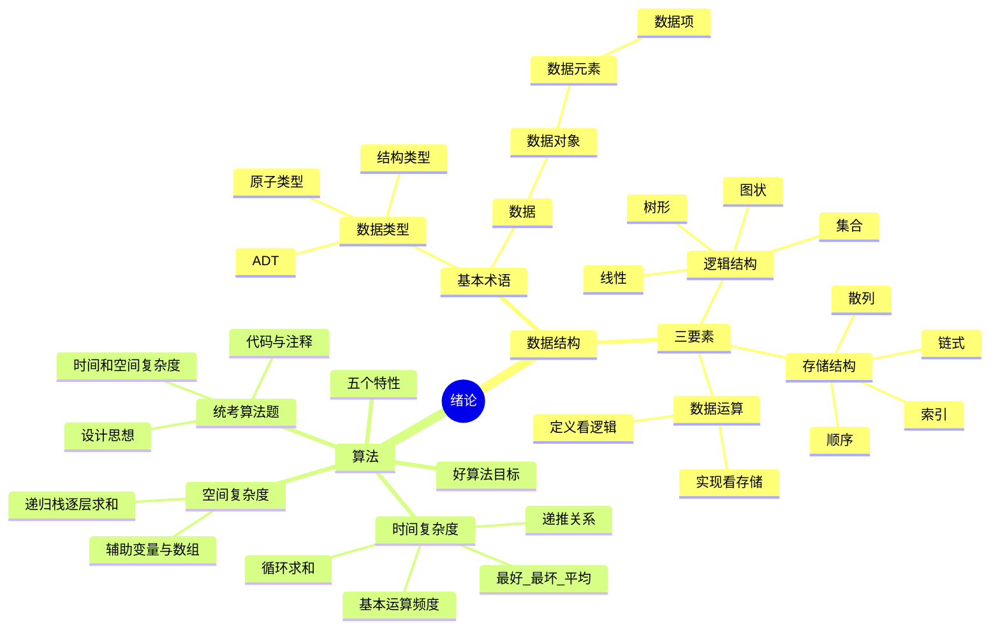

# 数据结构 第1章 绪论

> 来源：`27王道《数据结构》高清带书签.pdf`，第1章 绪论，PDF 页码 p13-p24。
> 复核：全局复核再次读取教材 p13-p24、5 个基础课件、期中/期末试卷与解析、4 个强化资料，共 14 组 242 页；对 137 个低文本页补做 OCR，直接查看全部 24 张页面联系图，并放大核对三要素、复杂度代码、递归栈及习题答案。

## 本章速览

- 数据结构 = 逻辑结构 + 存储结构 + 数据运算，三者缺一不可。
- 逻辑结构看“元素之间的关系”，与计算机怎么存无关；存储结构看“在内存中怎么表示”。
- 线性结构是一对一，树是一对多，图是多对多，集合只有“同属一个集合”。
- 同一逻辑结构可有不同存储方式，同一逻辑/存储也可能因运算不同而成为不同数据结构。
- 算法的五个特性是有穷性、确定性、可行性、输入、输出；正确性、可读性、健壮性是好算法目标。
- 复杂度分析抓基本运算执行次数，只看数量级；统考常用最坏时间复杂度评价算法。
- 空间复杂度只看算法额外辅助空间；输入本身和固定常量开销通常不计入。

## 课件补充来源

- 基础课件：`第一章 绪论/1.0_开篇_数据结构在学什么.pdf`、`1.1_数据结构的基本概念.pdf`、`1.2_1_算法的基本概念.pdf`、`1.2_2_算法的时间复杂度.pdf`、`1.2_3_算法的空间复杂度.pdf`。
- 阶段试卷：`数据结构期中考试试卷  .pdf`、`数据结构期中考试答案解析 .pdf`、`数据结构期末考试.pdf`、`数据结构期末考试答案解析.pdf`；基础与强化目录中的同名副本已做哈希去重。
- 强化资料：`数据结构大纲、历年大题.pdf`、`DS直播P1_应用题备考.pdf`、`DS直播P3_算法题备考.pdf`、`DS强化结课考试_试卷+答案.pdf`。
- 复核范围：共处理 14 组、242 页；章节课件逐页渲染，137 个低文本页 OCR，教材习题、阶段卷复杂度题、强化课算法题评分结构及递归空间示例均已查看原页。

## 关联导航

- 本章主线：[[01-绪论#1.1 数据结构的基本概念|数据结构三要素]] -> [[01-绪论#1.2 算法和算法评价|算法与复杂度]] -> [[01-绪论#课件补充/强化题规则|算法题作答模板]]。
- 存储结构实例：[[02-线性表#2.2 线性表的顺序表示|顺序存储]]、[[02-线性表#2.3 线性表的链式表示|链式存储]]、[[07-查找#7.5 散列 Hash 表|散列存储]]。
- 逻辑结构实例：[[03-栈、队列和数组#3.1 栈|线性结构]]、[[05-树与二叉树#5.1 树的基本概念|树形结构]]、[[06-图#6.1 图的基本概念|图结构]]。
- 复杂度联动：[[03-栈、队列和数组#3.3.3 栈在递归中的应用|递归栈]]、[[07-查找#7.2 顺序查找和折半查找|查找复杂度]]、[[08-排序#8.6 各种内部排序算法的比较及应用|排序复杂度比较]]。

## 知识网络

## 知识点清单

### 1.1 数据结构的基本概念

#### 1.1.1 基本概念和术语

- 数据：能被计算机识别和处理的符号集合，是程序加工对象。
- 数据元素：数据的基本单位，可由多个数据项组成；数据项是不可再分的最小单位。
- 数据对象：性质相同的数据元素的集合，是数据的子集。
- 从属关系常按“数据 -> 数据对象 -> 数据元素 -> 数据项”理解；数据结构研究某个数据对象中元素之间的特定关系。
- 数据类型：值的集合 + 定义在该集合上的操作。
  - 原子类型：值不可再分。
  - 结构类型：值可分解为若干分量。
  - 抽象数据类型 ADT：数学模型 + 定义在模型上的操作，可展开为数据对象、数据关系和基本操作；只规定逻辑功能，不暴露具体存储实现。
- 数据结构：存在一种或多种特定关系的数据元素集合。
  - 完整数据结构包含逻辑结构、存储结构和数据运算。
  - 算法设计取决于逻辑结构，算法实现依赖存储结构。

#### 1.1.2 数据结构三要素

- 逻辑结构：从逻辑关系描述数据，与存储方式无关。
  - 总分类：线性结构只有一对一关系；集合、树形和图状结构属于非线性结构。
  - 集合：元素之间除同属一个集合外无其他关系。
  - 线性结构：元素之间一对一，如线性表、栈、队列、串、数组。
  - 树形结构：元素之间一对多，如一般树、二叉树。
  - 图状结构：元素之间多对多，如有向图、无向图。
- 存储结构：逻辑结构在计算机中的实现，也叫物理结构。
  - 顺序存储：逻辑相邻，物理也相邻；可按下标随机存取，元素本身无指针开销；要求连续空间，可能产生外部碎片，插删常要移动元素。
  - 链式存储：用指针表示关系；插删灵活，不要求连续空间；指针占额外空间，通常只能顺序存取。
  - 索引存储：建立索引表，索引项通常含关键字和地址；检索快；额外占空间，增删需维护索引。
  - 散列存储：由关键字直接计算地址；查找、插入、删除通常快；散列函数不佳会冲突。
- 数据运算：分“定义”和“实现”。
  - 定义：基于逻辑结构，说明运算做什么。
  - 实现：基于存储结构，说明具体怎么做。
  - 运算也是区分数据结构的重要方面；逻辑结构和存储结构相同，若运算定义不同，也可视为不同数据结构。
- “随机存取”指已知序号可直接定位，不等于“按值查找也是 `O(1)`”；顺序表按值查找通常仍为 `O(n)`。

### 1.2 算法和算法评价

- 算法：解决特定问题的有穷指令序列，每条指令表示一个或多个操作。
- 程序可看作“数据结构 + 算法”的具体实现，但程序不一定满足有穷性，例如操作系统可长期运行；算法必须在有限步后结束。
- 算法五特性：
  - 有穷性：有限步后结束，每步有限时间完成。
  - 确定性：指令含义明确，相同输入得到相同输出。
  - 可行性：每个操作能用已有基本运算有限次完成。
  - 输入：可以有零个或多个输入。
  - 输出：至少有一个输出。
- 好算法目标：正确性、可读性、健壮性、高效率、低存储量。
- 时间复杂度：
  - 用语句频度或基本运算次数衡量，记作 `T(n)`。
  - 严格地说，`T(n)` 可看作各语句频度之和；求数量级时通常只数最深层、执行最频繁的基本运算。
  - 大 O 只描述增长阶，不等于精确执行时间。
  - 严格定义：若存在正常数 `c`、`n0`，使 `n >= n0` 时均有 `0 <= T(n) <= c*f(n)`，则 `T(n)=O(f(n))`。
  - 忽略常数系数和低阶项，抓增长最快的项。
  - 常见阶次：`O(1) < O(log n) < O(n) < O(nlog n) < O(n^2) < O(n^3) < O(2^n) < O(n!) < O(n^n)`。
- 最好、最坏、平均时间复杂度：
  - 最好：最有利输入下的运行时间。
  - 最坏：最不利输入下的运行时间，常作为考试默认评价标准。
  - 平均：按各种输入出现概率加权的期望运行时间；题目未给概率时常假设等概率。
- 时间复杂度标准步骤：
  - 明确问题规模 `n`，找最深层或执行最频繁的基本运算。
  - 设基本运算执行 `x` 次，建立 `x=f(n)` 或递推式 `T(n)`。
  - 求出数量级并写成大 O；若有多个规模，用 `T(m,n)`，例如双重独立循环为 `O(mn)`。
- 快速规则：
  - 顺序代码用加法规则：取最大阶。
  - 嵌套代码用乘法规则：内外层相乘。
  - 条件分支：求最坏复杂度时取最大阶；最好/平均复杂度必须结合分支条件和输入概率，不能一律取最大。
  - 递归：数真实递归调用并建立递推式，不要只看函数体一层。
- 递归调用数易错：`return 2*F(n/2)+n` 只有一次 `F(n/2)` 调用，若单层为 `O(1)`，则 `T(n)=T(n/2)+O(1)=O(log n)`；写成 `F(n/2)+F(n/2)` 才是两次递归调用。
- 空间复杂度：
  - 只关注额外辅助空间，记作 `S(n)=O(g(n))`。
  - 若额外空间与 `n` 无关，是 `O(1)`，也称原地工作。
  - 输入数据本身占用的空间通常不计入算法空间复杂度。
  - 普通程序先找大小随 `n` 变化的数组、容器或变量，再按加法规则取最高阶。
  - 递归程序要把未返回调用帧同时占用的空间逐层相加：每层 `O(1)`、深度 `n` 则为 `O(n)`；第 `k` 层开 `k` 个元素时，`1+2+...+n=O(n^2)`。

### 归纳总结与思维拓展

- 循环变量参与条件判断：
  - 先设基本运算执行 `t` 次，写出循环变量与 `t` 的关系，再由循环条件解出 `t`。
  - `i*=2` 且到 `n` 停：`2^t <= n`，复杂度 `O(log n)`。
  - `i*i <= n`：`t^2 <= n`，复杂度 `O(sqrt(n))`。
  - `i*i*i <= n`：`t^3 <= n`，复杂度 `O(cuberoot(n))`。
  - `sum += ++i` 且到 `n` 停：`1+2+...+t < n`，复杂度 `O(sqrt(n))`。
- 循环变量与条件无关：
  - 直接累计主体执行次数，嵌套循环要从内到外列求和，不要机械相乘。
  - 外层 `i*=2`，内层执行 `n` 次：`O(nlog n)`。
  - 外层 `i*=2`，内层执行 `i` 次：`1+2+4+...+n = O(n)`。
  - 外层 `i*i<=n`，内层执行 `i` 次：`1+...+sqrt(n)=O(n)`。
- 分段/周期型循环：先找一次周期内的固定工作量和推进变量。例如每经过常数次 `x++` 就把 `x` 复位并令 `y*=2`，周期数为 `O(log n)`，总复杂度仍为 `O(log n)`。
- 递归复杂度：
  - `T(n)=T(n/2)+O(1)`：`O(log n)`。
  - `T(n)=2T(n/2)+O(1)`：`O(n)`；只有代码真实出现两次递归调用时才这样列式。
  - `T(n)=T(n-1)+O(1)`：`O(n)`。
  - 递归阶乘时间 `O(n)`，递归栈空间 `O(n)`。
  - 时间看调用树中所有结点的总工作量；空间看同一时刻尚未返回的最长调用链，二者不能混算。
  - 朴素递归 Fibonacci 会重复求子问题，时间近似指数级；迭代 Fibonacci 时间 `O(n)`、额外空间 `O(1)`。

## 课件补充/强化题规则

1. **概念题先归类**：题目问元素关系，判逻辑结构；问内存表示，判存储结构；问“做什么/怎么做”，分别对应运算定义/实现。
2. **循环题三步法**：圈出基本运算 -> 设执行次数 `t` -> 由循环条件或求和式解出 `t=f(n)`；不能仅凭循环层数猜阶。
3. **分支与多段代码**：互斥分支取最坏路径的最大阶；顺序执行各段相加后保留最高阶，不把互斥分支机械相加。
4. **递归题先数调用**：表达式前的系数不是调用次数。先写 `T(n)`，再分析递归深度/调用树；时间和递归栈空间分别作答。
5. **空间题看“同时存在”**：循环反复申请并及时释放的空间不能简单累加；递归帧在返回前同时存在，必须沿调用链求和。
6. **统考算法题固定结构**：`设计思想 -> C/C++ 代码及关键注释 -> 时间复杂度 + 空间复杂度`。强化课与结课卷均按这三部分给分。
7. **复杂度说明要可核对**：先定义 `n、m`，再指出主循环/递归访问了多少元素；复杂度必须针对自己的完整算法。若先排序 `O(nlog n)` 再查找 `O(n)`，总复杂度仍是 `O(nlog n)`。
8. **空间答案写清口径**：若复用输入结点、只用若干指针，辅助空间可为 `O(1)`；新建长度为 `n` 的结果数组或递归深度为 `n`，则不能写 `O(1)`。
9. **强化题选结构的原则**：先从所需操作反推逻辑结构，再选使核心操作更高效的存储结构，并用本章复杂度方法验证选择。
10. **算法题评分重点**：思想、关键代码和复杂度必须相互一致；代码关键处写注释并交代空表、越界等边界。局部语法小错通常不如核心逻辑错误严重，但不能用“健壮性不重要”代替正确性。

## 易错点/易混点

- “完整的数据结构”不是只有逻辑结构和存储结构，还必须包括定义在其上的运算。
- 数据对象是数据的子集；数据结构强调对象中数据元素之间的关系，数据类型则强调值域及其允许的操作。
- 逻辑结构独立于存储结构；存储结构不能脱离逻辑结构，它是逻辑结构的机器表示。
- 逻辑结构先分线性与非线性；集合虽然没有元素间次序关系，仍属于非线性结构。
- 有序表是逻辑结构；顺序表、单链表、哈希表通常同时涉及存储方式和运算。
- 树和图是非线性结构；字符串、队列、栈属于线性结构或受限线性结构。
- 两种不同数据结构的逻辑结构和物理结构可能相同，差异也可能体现在运算定义上；不要只用结构形态判断。
- 同一逻辑结构采用不同存储结构，运算效率可能完全不同；如线性表顺序存储插删 `O(n)`，链式存储定位后插删可 `O(1)`。
- 顺序存储“可随机存取”只保证按序号定位快，不保证按值查找快；链式存储的 `O(1)` 插删也以已知目标结点/前驱位置为前提。
- 存储数据时不仅要存元素值，还要存元素间关系。
- 算法五特性不包括正确性、可读性、健壮性、可维护性、可靠性；这些是评价“好算法”或软件质量的目标。
- 算法必须有穷，程序可以长期运行；“程序能无限运行”不能据此否定它是程序。
- 时间复杂度不是 CPU 实际耗时，也不表示“执行时间等于某个函数”，只表示增长数量级。
- `T(n)=O(f(n))` 表示上界数量级，不表示问题规模变成 `f(n)`；问题规模仍是 `n`。
- 大 O 严格说是渐近上界，不保证 `T(n)` 与 `f(n)` 精确相等；统考答题通常取紧的最高阶上界。
- `O(1)` 空间复杂度不是“不用空间”，而是额外辅助空间与问题规模无关。
- 平均复杂度是按输入概率加权的期望；只有题目假定等概率时，才可直接做等权平均。
- “用空间换时间”可以改善时间效率，但评价算法优劣仍要综合正确性、可读性、健壮性、时间和空间。
- 最高阶比较要先抓增长最快项：`log n < n < nlog n < n^2 < n^3 < 2^n < n! < n^n`。
- 循环变量按倍增变化时常是 `O(log n)`；按平方、立方条件停止时要先列不等式再解循环次数。
- 多层循环不能机械相乘，要看内层循环次数是否随外层变量变化；必要时求和。
- 递归复杂度要看递归深度或递推关系，例如 `n/2` 型常见 `O(log n)`，`n-1` 型常见 `O(n)`。
- `2*F(n/2)` 只有一次函数调用，不能误写成 `2T(n/2)`；应按代码中实际出现的递归调用次数列式。
- 递归函数即使没有显式数组，也会占调用栈；各层数组大小不同还要逐层求和，不能只写递归深度。
- 条件语句分析通常取最坏分支，而不是把所有分支都相加。
- 上一条只适用于最坏复杂度；求平均复杂度要按分支概率加权，求最好复杂度要看最有利输入路径。
- 统考题中 `log n` 通常默认以 2 为底；复杂度中换底只差常数，阶不变。

## 注解

- 记忆“三要素”：逻辑结构决定“想怎么组织”，存储结构决定“实际怎么放”，数据运算决定“能对它做什么”。
- 判断逻辑结构时，只看元素关系，不看数组、指针、哈希表这些实现手段。
- 复杂度分析的核心动作是“数基本运算”。不要从代码行数判断复杂度，要从执行次数判断。
- 遇到循环题优先写出“循环执行 t 次后变量变成什么”，再由循环条件反推 `t` 和 `n` 的关系。
- 遇到求和型循环，常见公式要熟：`1+2+...+m = m(m+1)/2`，几何级数 `1+2+4+...+2^t = 2^(t+1)-1`。
- 遇到 `while(i*i<=n)`、`while((x+1)*(x+1)<=n)` 这类题，先把停止条件改写成平方根级别。
- 遇到外层倍增、内层随外层增长的循环，不要直接写 `O(nlog n)`，先看内层总和是不是几何级数。
- 遇到递归题，先写递推式；只看函数体一层通常会错。
- 算法题最后两行建议固定写：`时间复杂度：...，因为主操作共执行...次；空间复杂度：...，因为额外使用...`，让推导和答案对应。
- 斐波那契是典型对照：朴素递归会反复计算子问题，时间复杂度通常按指数级理解；迭代写法逐项推进，时间 `O(n)`、额外空间 `O(1)`。

## 速背检查

| 问题 | 快速答案 |
| --- | --- |
| 数据结构的三要素是什么？ | 逻辑结构、存储结构、数据运算。 |
| 数据元素和数据项的区别？ | 数据元素是基本处理单位，数据项是构成元素的最小单位。 |
| ADT 强调什么？ | 数学模型和操作集合，强调逻辑抽象。 |
| 逻辑结构与存储结构谁独立？ | 逻辑结构独立于存储结构。 |
| 逻辑结构怎样总分类？ | 线性结构与非线性结构；集合、树、图属非线性。 |
| 线性、树、图分别是什么关系？ | 一对一、一对多、多对多。 |
| 顺序存储的主要优点？ | 随机存取、空间开销小。 |
| 随机存取等于按值查找 `O(1)` 吗？ | 不等于；它只表示已知序号可直接定位。 |
| 链式存储的主要代价？ | 指针额外空间，通常不能随机存取。 |
| 数据运算的定义和实现分别依赖什么？ | 定义依赖逻辑结构，实现依赖存储结构。 |
| 不同数据结构的逻辑和物理结构一定不同吗？ | 不一定，差异也可能体现在运算定义上。 |
| 存储结构只存元素值吗？ | 不是，还要存元素之间的关系。 |
| 算法五特性？ | 有穷性、确定性、可行性、输入、输出。 |
| 好算法评价目标？ | 正确、可读、健壮、高效、省空间。 |
| 时间复杂度主要看什么？ | 基本运算执行次数的数量级。 |
| 为什么常看最坏复杂度？ | 它给出运行时间上界，最稳妥。 |
| `O(1)` 空间表示什么？ | 额外辅助空间与问题规模无关。 |
| 顺序执行和嵌套执行复杂度规则？ | 顺序取最大阶，嵌套相乘或按实际次数求和。 |
| `i=i*2` 到 `n` 停是什么复杂度？ | `O(log n)`。 |
| `i*i<=n` 到 `n` 停是什么复杂度？ | `O(sqrt(n))`。 |
| `sum+=++i` 到 `n` 停是什么复杂度？ | `O(sqrt(n))`。 |
| 外层 `i*=2`、内层跑 `i` 次是什么复杂度？ | `O(n)`，几何级数求和。 |
| 外层 `i*=2`、内层跑 `n` 次是什么复杂度？ | `O(nlog n)`。 |
| 外层 `i*i<=n`、内层跑 `i` 次是什么复杂度？ | `O(n)`。 |
| 递归复杂度第一步做什么？ | 找递归深度或建立递推关系。 |
| `T(n)=T(n/2)+O(1)` 是什么阶？ | `O(log n)`。 |
| `T(n)=2T(n/2)+O(1)` 是什么阶？ | `O(n)`，前提是每层真实递归调用两次。 |
| `T(n)=T(n-1)+O(1)` 是什么阶？ | `O(n)`。 |
| 递归阶乘的时间和栈空间？ | 时间 `O(n)`，递归栈空间 `O(n)`。 |
| 算法与程序在有穷性上有何区别？ | 算法必须有穷，程序可以长期运行。 |
| 平均时间复杂度如何计算？ | 按各类输入出现概率加权求期望。 |
| `2*F(n/2)` 有几次递归调用？ | 一次，前面的 2 是返回值乘法。 |
| 递归空间复杂度只看深度吗？ | 每层空间相同时看深度；不同时要沿调用链逐层求和。 |
| 阶段循环每轮固定工作、规模变量倍增是什么阶？ | 通常为 `O(log n)`。 |
| 统考算法题通常写哪三部分？ | 设计思想、代码与注释、时间和空间复杂度。 |
