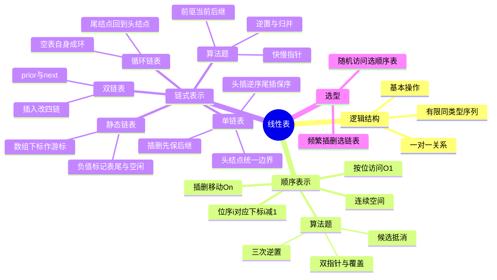

# 数据结构 第2章 线性表

> 来源：`27王道《数据结构》高清带书签.pdf`，第2章 线性表，PDF 页码 p25-p74。
> 复习定位：本章是算法设计题高频章，重点掌握顺序表、单链表、双链表、循环链表的操作思想、复杂度和指针修改顺序。
> 复核：教材 p25-p74、12 个基础课件、期中/期末试卷与解析、链表强化课及统考真题页均已提取文字，并直接查看顺序表移位、链表指针修改、教材习题和强化题关键页图片。

## 本章速览

- 线性表是逻辑结构，顺序表和链表是存储结构，二者不是同一层面的概念。
- 顺序表支持随机访问，按位查找 `O(1)`；插入、删除平均要移动约一半元素，`O(n)`。
- 单链表插入、删除不移动元素，但若未知前驱，定位仍需 `O(n)`。
- 带头结点能统一首元结点和其他结点的插删，也统一空表与非空表处理。
- 指针题核心是“先保存原后继，再改链接”，防止断链、自环和内存泄漏。
- 线性表算法题通常按“三段式”作答：设计思想、代码/伪代码、复杂度。

## 课件补充来源

- 基础课件：`第二章 线性表/` 下 12 份 PDF，完整覆盖定义与基本操作、顺序表，以及单链表、双链表、循环链表、静态链表和存储结构比较。
- 阶段试卷：`数据结构期中考试试卷  .pdf`、`数据结构期中考试答案解析 .pdf`、`数据结构期末考试.pdf`、`数据结构期末考试答案解析.pdf`。
- 强化资料：`算法2.1.x_链表的算法题备考(带手稿，有点乱).pdf`、对应纯净版、`DS直播P3_算法题备考.pdf`、`数据结构大纲、历年大题.pdf`、`DS直播P1_应用题备考.pdf`、`DS强化结课考试_试卷+答案.pdf`。
- 复核范围：共处理 23 组、294 个本章相关页面；全部页面已渲染，扫描页已 OCR，并放大复核教材习题、链表手稿、2009/2012/2015/2019 统考题和强化结课考试的有序链表题。

## 关联导航

- 本章主线：[[02-线性表#2.1 线性表的定义和基本操作|逻辑与操作]] -> [[02-线性表#2.2 线性表的顺序表示|顺序存储]] -> [[02-线性表#2.3 线性表的链式表示|链式存储]] -> [[02-线性表#课件补充/强化题规则|算法题规则]]。
- 前置方法：[[01-绪论#1.2 算法和算法评价|复杂度分析与算法题三段式]]。
- 直接应用：[[03-栈、队列和数组#3.1.3 栈的链式存储结构|链栈]]、[[03-栈、队列和数组#3.2.3 队列的链式存储结构|链队]]。
- 有序表联动：[[07-查找#7.2 顺序查找和折半查找|顺序/折半查找]]、[[08-排序#8.5.1 归并排序|二路归并]]、[[08-排序#8.7.5 最佳归并树|多表最佳归并]]。

## 知识网络

## 知识点清单

### 2.1 线性表的定义和基本操作

#### 2.1.1 线性表的定义

- 线性表：由 `n(n>=0)` 个相同数据类型的数据元素组成的有限序列；`n=0` 时为空表。
- 逻辑特性：
  - 有唯一的表头元素和表尾元素。
  - 除第一个元素外，每个元素有且仅有一个直接前驱。
  - 除最后一个元素外，每个元素有且仅有一个直接后继。
  - 元素个数有限、类型相同、逻辑上有序。
- 线性表只描述元素之间的一对一逻辑关系；“数组、记录、结点、指针”等属于存储实现，不能与逻辑结构混为一谈。

#### 2.1.2 线性表的基本操作

- 常用基本操作：
  - `InitList(&L)`：初始化空表。
  - `Length(L)`：求表长。
  - `LocateElem(L,e)`：按值查找，返回位置。
  - `GetElem(L,i)`：按位查找，返回第 `i` 个元素。
  - `ListInsert(&L,i,e)`：在第 `i` 个位置插入元素。
  - `ListDelete(&L,i,&e)`：删除第 `i` 个元素，并用 `e` 返回被删值。
  - `PrintList(L)`、`Empty(L)`、`DestroyList(&L)`：输出、判空、销毁。
- 基本操作的实现依赖存储结构；同一操作在顺序表和链表上复杂度可能不同。
- 参数语义：会改变表本身或头指针的操作通常传 `&L`；只读操作传 `L`；删除值常用输出参数 `&e` 返回。

#### 2.1.3-2.1.4 试题精选与解析要点

- 题目问“线性表是什么”时，抓逻辑：有限、同类型、有次序、一对一；不要答成数组或链表。
- 非空线性表中，若某元素既无直接前驱又无直接后继，则表长只能是 1。
- 题目给出“第 `i` 个元素”要先区分位序和下标；线性表位序从 1 开始，数组下标从 0 开始。

### 2.2 线性表的顺序表示

#### 2.2.1 顺序表的定义

- 顺序表：用一组地址连续的存储单元依次存储线性表元素。
- 核心特点：逻辑相邻，物理也相邻；位序从 1 开始，数组下标从 0 开始。
- 存储地址公式：第 `i` 个元素地址约为 `LOC(A)+(i-1)*sizeof(ElemType)`，所以可随机存取。
- 静态分配：数组容量编译时固定；满表后再插入会溢出。
- 动态分配：运行时申请数组空间，可扩容；仍是顺序存储，不是链式存储。
- 动态扩容不是原地“长大”：申请更大的连续区、复制旧元素、释放旧区、更新指针和 `MaxSize`，一次扩容为 `O(n)`，且可能因没有足够连续空间而失败。
- 顺序表占用空间与表长、元素类型和每个数据项大小有关；与元素值本身和“按什么顺序排列”无关。
- 优点：随机访问 `O(1)`，存储密度高，无指针开销。
- 缺点：插入/删除需移动元素；需要连续空间；扩容可能复制全表且申请失败。

#### 2.2.2 顺序表基本操作的实现

- 初始化：静态表只需 `length=0`；动态表还要申请空间并记录 `MaxSize`。
- 插入第 `i` 位：
  - 合法范围：`1 <= i <= length+1`。
  - 从后往前移动元素：第 `length` 位到第 `i` 位依次后移。
  - 插入到数组下标 `i-1`，表长加 1。
  - 最好：表尾插入 `O(1)`；最坏：表头插入 `O(n)`；平均移动 `n/2` 个元素，`O(n)`。
- 删除第 `i` 位：
  - 合法范围：`1 <= i <= length`。
  - 保存 `data[i-1]`，从第 `i+1` 位起依次前移。
  - 表长减 1。
  - 最好：删表尾 `O(1)`；最坏：删表头 `O(n)`；平均移动 `(n-1)/2` 个元素，`O(n)`。
- 按值查找：
  - 顺序扫描，返回第一个等于 `e` 的元素位序；失败返回 0。
  - 最好 `O(1)`，最坏 `O(n)`，平均约 `(n+1)/2` 次比较。
- 有序顺序表：
  - 按值查找可用折半查找，`O(log n)`。
  - 插入/删除仍要移动元素，平均 `O(n)`。

#### 2.2.3-2.2.4 顺序表试题与解析模板

- 选择存储结构：随机访问、按位取前驱/后继多，优先顺序表；频繁中间插删且已知位置，优先链表。
- 删除最小元素：保存最小值和位置，用最后一个元素覆盖最小位置，表长减 1；适用于题目允许改变元素相对顺序。
- 多删一类元素：不要“删一个移一次”；用 `k` 统计已删除个数或用新下标保存保留元素，一趟完成。
- 有序表去重/求交/合并：利用有序性，双指针线性扫描；重复元素连续，只保留第一个不同值。
- 表段交换/循环左移：三次逆置是常见 `O(n)`、`O(1)` 方法，如左移 `p` 位可逆置前段、后段、整体。
- 有序顺序表查找插入：先折半查找；找到且不是表尾时可与后继交换，未找到则后移插入。
- 两个等长有序序列求中位数：比较两个序列中位数，每次丢弃不可能包含中位数的半边，直到剩两个候选。
- 主元素：候选抵消找候选，再二次计数确认是否超过 `n/2`；只找候选不能保证存在。
- 最小未出现正整数：只需标记 `1..n` 是否出现；答案一定在 `1..n+1`。
- 三个有序数组最小距离：距离等于 `2*(max-min)`，每轮只移动当前最小值所在指针。
- 乘积最大类题：从右向左维护后缀最大值和最小值；当前数为负时要用后缀最小值。

### 2.3 线性表的链式表示

#### 2.3.1 单链表的定义

- 链式存储：逻辑相邻的元素物理地址可不相邻，通过指针维护关系。
- 单链表结点：`data` 数据域 + `next` 后继指针域。
- 链表优点：按需分配结点，插入/删除不移动元素。
- 链表缺点：不能随机存取；每个结点有指针额外空间；查找通常从头遍历。

#### 2.3.1 头指针和头结点

- 头指针：指向链表第一个结点；带头结点时指向头结点，不带头结点时指向首元结点。
- 头结点：首元结点前的附加结点，数据域通常无效，可记录表长等辅助信息。
- 带头结点空表：`L->next == NULL`。
- 不带头结点空表：`L == NULL`。
- 引入头结点的好处：
  - 首元结点的插入/删除与其他位置统一。
  - 空表和非空表处理统一，头指针始终非空。

#### 2.3.2 单链表基本操作的实现

- 初始化：
  - 带头结点：申请头结点，令 `L->next=NULL`。
  - 不带头结点：令 `L=NULL`。
- 不带头结点时，在第 1 位插入或删除首元结点会改变头指针，必须单独处理并传入 `&L`；带头结点可把它们统一为“头结点之后”的操作。
- 求表长：从首元结点遍历到 `NULL`，不计头结点，`O(n)`。
- 按序号查找：从首元结点沿 `next` 找第 `i` 个结点，`O(n)`。
- 按值查找：顺序比较数据域，找到返回结点指针，否则 `NULL`，`O(n)`。
- 后插操作：
  - 已知前驱结点 `p`，插入 `s`：先 `s->next=p->next`，再 `p->next=s`。
  - 若顺序反了，原后继丢失，甚至形成 `s->next=s` 自环。
  - 若已知 `p`，后插 `O(1)`；若要先找第 `i-1` 个结点，总体 `O(n)`。
- 前插操作：
  - 常规：从头找前驱，`O(n)`。
  - 技巧：在目标结点 `p` 后插入 `s`，再交换 `p` 与 `s` 的数据域，等效前插，`O(1)`；要求数据域可复制。
- 删除结点：
  - 已知前驱 `p`，删除其后继 `q`：`p->next=q->next`，再 `free(q)`。
  - 若删除给定结点 `p` 且允许改数据：复制后继 `q` 的数据到 `p`，再删 `q`，`O(1)`。
  - 上述技巧不能删除尾结点，因为尾结点无后继。
- 头插法建表：每次把新结点插到头结点之后，生成顺序与输入顺序相反，总时间 `O(n)`。
- 尾插法建表：维护尾指针 `r`，每次插到表尾，生成顺序与输入顺序相同，总时间 `O(n)`。
- 尾插或重新串链结束后必须令 `r->next=NULL`；否则可能保留旧链形成错误后缀或环。

#### 2.3.3 双链表

- 双链表结点：`prior` 前驱指针 + `data` + `next` 后继指针。
- 普通双链表：头结点 `prior=NULL`，尾结点 `next=NULL`。
- 优点：可直接访问前驱，已知目标结点时插入、删除可 `O(1)`。
- 在结点 `p` 后插入 `s`：
  - 典型顺序：`s->next=p->next`，`p->next->prior=s`，`s->prior=p`，`p->next=s`。
  - 必须先保存/连接原后继，再覆盖 `p->next`。
  - 普通非循环双链表若 `p` 是尾结点，`p->next` 为空，需单独处理；循环双链表或带尾哨兵结构可统一。
- 删除 `p` 的后继 `q`：
  - `p->next=q->next`，`q->next->prior=p`，`free(q)`。
  - 若 `q` 是尾结点，要注意是否存在 `q->next`。
- 双链表插入通常要改 4 个指针域；删除要把前后结点重新接起来。

#### 2.3.4 循环链表

- 循环单链表：尾结点 `next` 指向头结点；链中不存在 `next==NULL` 的结点。
- 带头结点循环单链表判空：`L->next == L`。
- 只设尾指针的循环单链表：
  - 表头为 `r->next->next`（带头结点时）或 `r->next`（不带头结点时，视结构而定）。
  - 表头、表尾插入都可做到 `O(1)`。
- 循环双链表：
  - 尾结点 `next` 指向头结点，头结点 `prior` 指向尾结点。
  - 空表判定：`L->next==L && L->prior==L`。
  - 删除首结点/尾结点常可 `O(1)`，但要更新头结点或尾指针相关链接。

#### 2.3.5 静态链表

- 静态链表：用数组模拟链式存储。
- 每个结点含 `data` 和 `next`，其中 `next` 是数组下标，也叫游标。
- 结束标志常为 `next == -1`。
- 一种常见初始化约定：`a[0]` 作头结点并令 `a[0].next=-1`，其余空闲结点用特殊值（如 `-2`）标记；插入要先取得空闲下标，删除后要回收该下标。题目若另给约定，以题设为准。
- 需要预先分配连续数组空间；容量上限定义时确定。
- 插入、删除只改游标，不移动元素；但查找第 `i` 个元素仍需顺链扫描，非 `O(1)`。

#### 2.3.6 顺序表和链表的比较

| 维度 | 顺序表 | 链表 |
| --- | --- | --- |
| 存取方式 | 随机存取 `O(1)`，也可顺序存取 | 只能顺序存取，按位查找 `O(n)` |
| 物理结构 | 逻辑相邻，物理相邻 | 逻辑相邻，物理未必相邻 |
| 按值查找 | 无序 `O(n)`；有序可折半 `O(log n)` | 通常 `O(n)` |
| 插入/删除 | 平均移动约半表，`O(n)` | 已知位置改指针 `O(1)`，定位仍 `O(n)` |
| 空间 | 存储密度高，但需连续空间 | 需指针域，存储密度低，空间更灵活 |
| 适合场景 | 长度稳定、随机访问多 | 长度变化大、插删多 |

#### 2.3.7-2.3.8 链表试题与解析模板

- 删除所有满足条件的结点：常用 `pre/p/q`，删除时 `pre` 不动、`p` 后移；保留时 `pre=p, p=p->next`。
- 删除最小值结点：一趟扫描，同时维护 `minp` 和 `minpre`，结束后由 `minpre` 断链并释放 `minp`。
- 链表逆置：可用头插法重建，也可用三指针 `pre/p/r` 原地反转；都要先保存后继再改 `next`。
- 拆分奇偶位：奇数位尾插到 A，偶数位头插到 B 可得到 A 原序、B 逆序；把结点插到 B 前必须先保存原后继。
- 有序链表去重：重复结点相邻，比较 `p` 与 `p->next` 即可；重复时删后继，非重复时后移。
- 两个有序链表求公共元素/交集：双指针归并，小者释放或后移，相等时保留一个并同时后移。
- 判断 B 是否为 A 的连续子序列：类似串的朴素模式匹配，失配后 A 的起点后移，B 回到表头。
- 公共后缀起点：比较的是结点地址，不是 `data` 值；先求两表长度，让长表先走差值步，再同步找第一个相同地址。
- 循环双链表对称：从两端 `p=L->next`、`q=L->prior` 向中间比较；结束条件要覆盖奇数、偶数结点数。
- 连接两个循环单链表：分别找尾结点，令第一表尾接第二表头，第二表尾接第一表头；若仅有尾指针可更快。
- 按访问频度调整双链表：命中结点后 `freq++`，先摘下，再向前找第一个频度更大的位置后插入。
- 右移/重排链表：先求长并成环，再找到断点；或找中点、逆置后半段、前后交替合并，均可 `O(n)`、`O(1)`。
- 绝对值去重：若 `|data|<=n`，用 `n+1` 大小辅助数组标记绝对值，首次保留，重复删除。
- 2009 倒数第 `k` 个：快指针先走 `k` 个数据结点；不足 `k` 个则失败，否则快慢同步至快指针到表尾，慢指针即答案，`O(n)`、`O(1)`。
- 2012 公共后缀：分别求长、长表先走长度差，再同步比较结点地址；若只比较数据值，会把“值相同”误当成“共享结点”。
- 2015 绝对值去重：题设给出 `|data|<=n` 才能直接用大小 `n+1` 的标记数组；扫描时保留首次出现，重复结点由前驱断链并释放，时间 `O(m)`、空间 `O(n)`。
- 2019 前后交替重排：快慢指针找中点，断开并逆置后半段，再按“前半段一个、逆序后半段一个”交叉接链，时间 `O(n)`、空间 `O(1)`。

#### 归纳总结与思维拓展

- 顺序表的优势来自连续地址，链表的优势来自链接关系；“数组实现”不必然等于顺序存储，静态链表就是反例。
- 链表插删本身是 `O(1)`，题目复杂度常由“寻找操作位置”决定；回答时要把定位和修改分开分析。
- 线性表大题优先考虑复用原空间：顺序表用覆盖/逆置，链表用摘链/接链；题目要求原地算法时，不要偷偷新建同规模数组或链表。
- 多个有序链表合并：两表可用尾插式二路归并并复用原结点，`O(n+m)`、额外空间 `O(1)`；多表逐次归并能实现功能，若要求最少比较次数则联想最佳归并树、小根堆或败者树。

## 课件补充/强化题规则

- **基本功路线**：按位查找用“循环 + 计数器”；有条件插删用 `pre/p`；逆置用头插或三指针；保持原序用尾插并维护尾指针。
- **指针题落笔前**：先画出 `pre -> p -> next`，标明头结点是否计入位序；每摘下一个结点先保存原后继，接完后检查新表尾是否指向 `NULL`。
- **链表算法通用循环**：删除当前 `p` 时 `pre` 不动；保留当前 `p` 时才令 `pre=p`；两种分支最后都要保证 `p` 指向尚未处理的结点。
- **有序单链表原地归并**：比较两当前结点，小者接到结果尾；相等时按题意求和、保留一个或全部删除；最后接剩余链。不能只写“调用归并”而不说明结点复用与释放。
- **多项式相加模型**：指数小者直接接入；指数相同则系数相加，和为 0 时删除两项，否则保留合并项；时间 `O(n+m)`、额外空间 `O(1)`。
- **复杂度得分点**：必须同时写时间与额外空间，并说明变量含义；辅助数组长度由取值范围决定，不能把 `O(n)` 空间误写成 `O(1)`。
- **统考作答顺序**：先写 3-5 句设计思想，再写结构定义和核心代码，最后单列复杂度；关键指针变化写注释，边界至少检查空表、单结点、首尾结点和非法 `k/i`。

## 易错点/易混点

- 线性表是逻辑结构；顺序表、链表是存储结构。
- 链式存储通过指针表达逻辑关系，可表示线性表、树、图等多种逻辑结构；散列存储本身不能体现元素逻辑关系。
- 位序从 1 开始，数组下标从 0 开始；第 `i` 个元素对应 `data[i-1]`。
- 修改表长、数据区指针或头指针的操作要传引用/二级指针；把 `L` 按值传入可能只改到局部副本。
- 动态分配顺序表仍是顺序存储，不是链式存储。
- 动态顺序表扩容要申请新连续区并复制，不能仅修改 `MaxSize`；扩容后旧指针若未更新或旧空间未释放会出错。
- 顺序表“随机存取”指按位访问 `O(1)`，不是随机位置插入/删除 `O(1)`。
- 顺序表插入合法位置包括 `length+1`，但移动元素最多从第 `length` 位开始。
- 顺序表删除第 `i` 个元素要移动 `n-i` 个元素；插入第 `i` 个元素要移动 `n-i+1` 个元素。
- 顺序表按位访问 `O(1)`，在第 `i` 位插入不是 `O(1)`。
- 有序顺序表查找可 `O(log n)`，但插入、删除平均仍 `O(n)`。
- 单链表“插删 `O(1)`”的前提是已知前驱或目标位置；若要先查找，整体仍可能是 `O(n)`。
- 带头结点只统一边界处理，不会改变查找、插入、删除算法的数量级。
- 带头结点的单链表空表是 `head->next==NULL`；不带头结点是 `head==NULL`。
- 单链表删除尾结点即使有尾指针，也通常要找前驱，仍为 `O(n)`。
- 头插法建表会逆序；尾插法建表保持输入顺序。
- 单链表后插必须先 `s->next=p->next`，再 `p->next=s`。
- 单链表删除当前结点时，必须保存待删结点或后继；删除后不要访问已释放结点。
- 双链表插入/删除不能机械背顺序，要先判断哪些指针会被覆盖，保证不断链。
- 双链表在尾后插入、删除尾结点时，最容易访问空后继；先判断 `p->next` 或采用循环双链表结构。
- 循环单链表带头结点判空是 `L->next==L`，不是 `L==NULL`。
- 循环双链表空表要同时满足 `L->next==L` 和 `L->prior==L`。
- 只给循环单链表尾指针时，找头结点/首元结点常为 `O(1)`；只给头指针找尾通常仍要 `O(n)`。
- 静态链表用数组实现，但不是顺序表；它需连续空间，插删不移动元素，查找仍沿游标。
- 静态链表的 `-1` 常表示表尾，`-2` 可表示空闲，但这些数值是实现约定；不要把空闲标记当成链尾标记。
- 两链表公共后缀题要比较结点地址是否相同，不能只比较数据域是否相等。
- 链表判环入口：快慢指针相遇后，一个指针回到头，两个同步走，第一次相遇就是入口。

## 注解

- 线性表算法题先判断“顺序存储还是链式存储”：顺序表常考移动、逆置、删除区间、合并有序表；链表常考指针重连、逆置、拆分、找公共结点。
- 顺序表删除多个元素时，不要每删一个就整体前移。常用 `k` 记录已删除个数，把保留元素前移 `k` 位，一趟完成。
- 有序顺序表去重：因为重复元素连续，可用两个下标维护“已保留区”和“扫描区”。
- 有序表合并：双指针分别扫描 A、B，小者进入 C，剩余部分直接接到末尾。
- 顺序表区间互换：整体逆置，再分别逆置两段，是常见 `O(n)`、`O(1)` 技巧。
- 主元素题：候选抵消法先找候选，再二次计数确认是否超过 `n/2`。
- 最小未出现正整数：用辅助标记数组记录 `1..n` 是否出现，时间 `O(n)`，空间 `O(n)`。
- 链表删除满足条件的多个结点：若直接删除，用 `pre` 保持前驱；若重建保留链，用尾插法把保留结点串起来，最后置尾指针为空。
- 链表删除最小结点：扫描时同步记录最小结点和它的前驱，不能只记最小值。
- 链表逆置：头插法适合理解；三指针原地反转更常用于要求空间 `O(1)` 的题。
- 链表按奇偶位拆分、重排或后半段逆置时，第一步通常是找中点或保存原后继，防止后半段断链。
- 两个有序链表类题：求并、交、差都可归并扫描；题目要求“释放多余结点”时，不能只移动指针不处理空间。
- 子序列匹配题：把 B 看成模式串，A 当前起点失配后后移一位，B 重新从头比较。
- 循环双链表对称判断：两端指针相向走，奇数长度会相遇，偶数长度会相邻。
- 链表找倒数第 `k` 个结点：快指针先走 `k` 步，然后快慢同步，一趟扫描。
- 链表判环和找入口：快慢指针相遇后，一个指针回到头结点，两个同步走，相遇处为入口。
- 链表重排类题常用三步：找中点、逆置后半段、交替合并。
- 绝对值去重题若给定 `|data|<=n`，优先想到辅助数组标记出现过的绝对值；这是空间换时间。
- 有序链表归并若复用原结点，摘链后应立即接到结果尾；同指数系数相加为 0 的结点要释放，不能留下零项。
- 统考算法题优先把“基本设计思想”写清楚；代码可接近 C/C++ 伪代码，但关键指针变化和复杂度必须交代。

## 速背检查

| 问题 | 快速答案 |
| --- | --- |
| 线性表的逻辑特点？ | 有限、同类型、有序、一对一关系。 |
| 线性表和顺序表是什么关系？ | 线性表是逻辑结构，顺序表是其顺序存储实现。 |
| 哪些基本操作通常要传 `&L`？ | 会改变表结构、表长、数据区指针或头指针的操作。 |
| 顺序表最大优势？ | 按位随机访问 `O(1)`，存储密度高。 |
| 顺序表插入第 `i` 位移动几个元素？ | `n-i+1` 个。 |
| 顺序表删除第 `i` 位移动几个元素？ | `n-i` 个。 |
| 顺序表插入/删除平均复杂度？ | 都是 `O(n)`。 |
| 有序顺序表按值查找最优复杂度？ | 折半查找 `O(log n)`。 |
| 单链表结点由什么组成？ | 数据域 `data` 和后继指针 `next`。 |
| 带头结点单链表如何判空？ | `L->next == NULL`。 |
| 头结点的主要作用？ | 统一首元结点和其他结点的插删，统一空表处理。 |
| 头结点会降低算法复杂度吗？ | 通常不会，只是简化边界处理。 |
| 单链表后插两句关键语句？ | `s->next=p->next; p->next=s;` |
| 删除多个满足条件的链表结点怎么防错？ | 删除时 `pre` 不动，保留时 `pre` 和 `p` 同步后移。 |
| 单链表删除最小结点要记录什么？ | 最小结点 `minp` 及其前驱 `minpre`。 |
| 头插法建表的结果顺序？ | 与输入顺序相反。 |
| 尾插法为什么要尾指针？ | 避免每次遍历找尾，建表总时间 `O(n)`。 |
| 双链表插入一个结点通常改几个指针？ | 4 个。 |
| 循环单链表带头结点如何判空？ | `L->next == L`。 |
| 循环双链表如何判空？ | `L->next==L && L->prior==L`。 |
| 静态链表的指针是什么？ | 数组下标/游标。 |
| 静态链表中 `-1`、`-2` 常表示什么？ | `-1` 表尾，`-2` 空闲；具体以题设约定为准。 |
| 两链表公共后缀比较什么？ | 比较结点地址相同，不是数据值相等。 |
| 顺序表和链表如何选？ | 随机访问多选顺序表，频繁插删且规模变化大选链表。 |
| 链表倒数第 `k` 个怎么找？ | 快慢指针，快指针先走 `k` 步后同步走。 |
| 链表判环入口怎么找？ | 快慢相遇后，一个回头，两个同步走到入口。 |
| 链表重排成前后交替常用哪三步？ | 找中点、逆置后半段、交替合并。 |
| 有序链表去重为什么可一趟完成？ | 重复元素相邻，只需比较当前结点和后继。 |
| 绝对值去重题常用什么思想？ | 辅助数组标记已出现的绝对值，重复则删。 |
| 两个有序单链表如何原地归并？ | 双指针比较，小者摘下接到结果尾，最后接剩余链。 |
| 多项式链表同指数相加为 0 怎么办？ | 删除并释放对应结点，不在结果中保留零项。 |
| 线性表算法题作答三段式？ | 设计思想、代码/伪代码、时间与空间复杂度。 |
