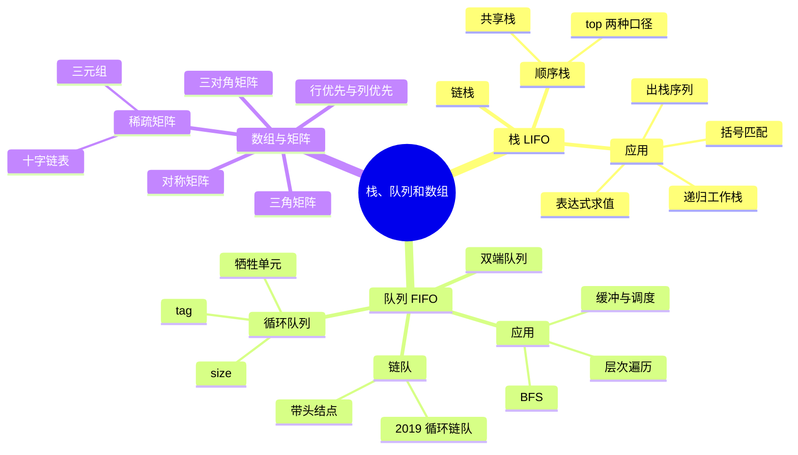

# 数据结构 第3章 栈、队列和数组

> 来源：`27王道《数据结构》高清带书签.pdf`，第3章 栈、队列和数组，PDF 页码 p75-p120。
> 复习定位：本章以选择题为主，但栈和队列常作为算法题辅助结构；重点掌握操作限制、指针/下标约定、循环队列判空判满、表达式处理和特殊矩阵压缩下标。
> 全局复核：已核对教材 p75-p120、13 个基础考点课件、4 份阶段卷与解析及 5 组强化资料，共 23 组 407 页；对 197 个低文本页补做 OCR，直接查看全部 40 张页面联系图，并在成稿后逐张复核 25 个关键原页，反查教材习题、阶段题和统考真题。

## 本章速览

- 栈和队列都是操作受限的线性表：栈后进先出 `LIFO`，队列先进先出 `FIFO`。
- 顺序栈、循环队列的判空、判满、长度公式都依赖 `top/front/rear` 的具体约定。
- 循环队列解决“假溢出”，区分队空和队满常用牺牲一个单元、增设 `size` 或增设 `tag`。
- 栈常用于括号匹配、表达式求值、递归；队列常用于层次遍历、缓冲区和资源调度。
- 数组和特殊矩阵考查地址映射，本质是“前面已有多少元素 + 当前偏移”。
- 稀疏矩阵适合三元组或十字链表压缩，但会牺牲普通数组的随机访问优势。

## 课件补充来源

- **教材**：`27王道《数据结构》高清带书签.pdf` 第 3 章 p75-p120，含 4 节正文、习题与解析、归纳总结和思维拓展。
- **基础考点讲解**：栈 3 份、队列 4 份、括号匹配 1 份、表达式求值 2 份、递归 1 份、队列应用 1 份、特殊矩阵 1 份，共 13 份课件。
- **阶段训练**：数据结构期中、期末试卷及答案解析，反查栈序列、循环队列、递归、表达式与矩阵下标题。
- **强化资料**：`数据结构大纲、历年大题`、`DS直播P1_应用题备考`、`DS直播P2_手稿`、`DS直播P3_算法题备考`、`DS强化结课考试_试卷+答案`。
- **图片复核重点**：两种栈顶指针约定、共享栈、循环队列空满、受限双端队列、表达式扫描过程、递归调用树、三对角矩阵映射、十字链表、2015/2019 真题。

## 关联导航

- 前置存储基础：[[02-线性表#2.2 线性表的顺序表示|顺序表]]、[[02-线性表#2.3 线性表的链式表示|链表]]。
- 栈与递归复杂度：[[01-绪论#1.2 算法和算法评价|算法复杂度分析]]。
- 队列的典型遍历：[[05-树与二叉树#5.3.1 二叉树的遍历|二叉树层次遍历]]、[[06-图#6.3.1 广度优先搜索 BFS|图的 BFS]]。
- 特殊矩阵跨章应用：[[06-图#6.2.1 邻接矩阵法|图的邻接矩阵]]。
- 系统中的队列：[[操作系统/02-进程与线程#2.2 CPU 调度|CPU 调度]]、[[操作系统/02-进程与线程#2.3 同步与互斥|进程同步]]。

## 知识网络

## 知识点清单

### 3.1 栈

#### 3.1.1 栈的基本概念

- 栈：只允许在一端进行插入和删除的线性表。
- 栈顶：允许插入、删除的一端；栈底：固定不变的一端。
- 空栈：不含任何元素的栈。
- 基本操作：
  - `InitStack(&S)`：初始化空栈。
  - `StackEmpty(S)`：判空。
  - `Push(&S,x)`：进栈，若栈未满则把 `x` 加到栈顶。
  - `Pop(&S,&x)`：出栈，若栈非空则删除栈顶并用 `x` 返回。
  - `GetTop(S,&x)`：读取栈顶元素，不改变栈。
  - `DestroyStack(&S)`：销毁栈。
- 进出栈序列：
  - 若 `n` 个不同元素按固定顺序进栈，可能的出栈序列数为 Catalan 数：`C_n = 1/(n+1) * C(2n,n)`。
  - 合法性快速判断：任意前缀中“出栈次数 <= 入栈次数”；模拟时栈顶必须等于当前要出的元素。
  - 若题目给出具体 `Push/Pop` 操作序列，栈容量至少等于模拟过程中栈内元素个数的最大值。

#### 3.1.2 栈的顺序存储结构

- 顺序栈：用连续数组存储栈中元素。
- 常见约定一：`top` 指向当前栈顶元素。
  - 初始化：`top = -1`。
  - 判空：`top == -1`。
  - 判满：`top == MaxSize - 1`。
  - 栈长：`top + 1`。
  - 进栈：`data[++top] = x`。
  - 出栈：`x = data[top--]`。
  - 取栈顶：`x = data[top]`。
- 常见约定二：`top` 指向栈顶元素的下一个空位置。
  - 初始化：`top = 0`。
  - 判空：`top == 0`。
  - 判满：`top == MaxSize`。
  - 进栈：`data[top++] = x`。
  - 出栈：`x = data[--top]`。
- 顺序栈进栈、出栈、取栈顶均为 `O(1)`；缺点是容量固定，满栈后再进栈上溢，空栈再出栈下溢。

#### 3.1.2 补充：共享栈

- 共享栈：两个顺序栈共享同一数组，一个从低地址端增长，一个从高地址端增长。
- **栈顶指向当前元素**：初始 `top0=-1, top1=MaxSize`；进栈分别为 `data[++top0]=x`、`data[--top1]=x`；满为 `top0+1>=top1`；总元素数为 `(top0+1)+(MaxSize-top1)`。
- **栈顶指向下一个空位**：初始 `top0=0, top1=MaxSize-1`；进栈分别为 `data[top0++]=x`、`data[top1--]=x`；满为 `top0>top1`；总元素数为 `top0+(MaxSize-1-top1)`。
- 两套写法只是指针语义不同，判空、判满、先加还是后加必须成套使用。
- 优点：两个栈总空间动态互补，减少单个栈空间闲置；各项基本操作仍为 `O(1)`。
- 普通共享栈只有整个数组占满时才上溢，两个栈不会在不同位置“同时上溢”；某一栈可占用大部分甚至几乎全部空间，但不能越过另一栈的栈顶。

#### 3.1.3 栈的链式存储结构

- 链栈：用链式存储实现的栈，通常把链表头部作为栈顶。
- 进栈、出栈只改头部指针，时间复杂度 `O(1)`。
- 链栈通常不需要预设容量，除非内存耗尽，一般不存在“栈满”问题。
- 书中本节默认链栈不带头结点，栈顶指针直接指向栈顶元素；若题目改成带头结点，判空和插删细节要随之改变。

#### 3.1.4-3.1.5 栈试题与解析模板

- 判断操作序列合法：从左到右扫描 `I/O`，任意前缀 `O` 数不能超过 `I` 数，最后两者数量相等。
- 判断出栈序列合法：按入栈序列模拟，目标元素不是栈顶就继续入栈，无法匹配则非法。
- 固定入栈序列中，若某元素先出栈，它之前尚未出的元素一定按逆序出栈。
- 连续多次出栈得到的子序列在原入栈序列中一定表现为逆序；若题目禁止连续 3 次出栈，就排除含长度不少于 3 的连续逆序段。
- 链表中心对称：前一半元素入栈；若长度为奇数，跳过中心结点；后一半逐个与栈顶比较。
- 两栈共享数组：两个栈从两端向中间增长；入栈先判满，出栈先判空，栈号决定 `top` 加还是减。

### 3.2 队列

#### 3.2.1 队列的基本概念

- 队列：只允许在一端插入、另一端删除的线性表。
- 队尾：允许插入的一端；队头：允许删除的一端。
- 基本操作：
  - `InitQueue(&Q)`：初始化队列。
  - `QueueEmpty(Q)`：判空。
  - `EnQueue(&Q,x)`：入队，元素从队尾进入。
  - `DeQueue(&Q,&x)`：出队，元素从队头离开。
  - `GetHead(Q,&x)`：读取队头元素，不删除。
- 队列和栈一样都是操作受限的线性表，不能直接访问或修改中间元素；区别只在插入、删除端点不同。

#### 3.2.2 队列的顺序存储结构

- 顺序队列常用数组和两个指针 `front`、`rear` 表示。
- 本章常见约定：`front` 指向队头元素，`rear` 指向队尾元素的下一个位置。
- 普通顺序队列会出现“假溢出”：数组前部已有空位，但 `rear` 已到数组末端。
- 循环队列：把顺序队列的数组空间在逻辑上看成环。
  - 初始化：`front = rear = 0`。
  - 指针前进：`front = (front + 1) % MaxSize`，`rear = (rear + 1) % MaxSize`。
  - 队列长度：`(rear - front + MaxSize) % MaxSize`。
- 区分队空和队满的三种方法：
  - 牺牲一个存储单元：队空 `front == rear`；队满 `(rear + 1) % MaxSize == front`；最多存 `MaxSize - 1` 个元素。
  - 增设 `size`：队空 `size == 0`；队满 `size == MaxSize`。
  - 增设 `tag`：删除后令 `tag=0`，插入后令 `tag=1`；当 `front==rear` 时用 `tag` 区分空和满。
- 牺牲一个单元时：
  - 入队：先写 `data[rear] = x`，再 `rear = (rear + 1) % MaxSize`。
  - 出队：先读 `x = data[front]`，再 `front = (front + 1) % MaxSize`。
  - 入队、出队、取队头均为 `O(1)`。
- 若题设令 `rear` 指向**当前队尾元素**，空队可初始化为 `front=0, rear=MaxSize-1`，空为 `(rear+1)%MaxSize==front`，入队改为先移动 `rear` 再写入。此时若牺牲一个单元，满为 `(rear+2)%MaxSize==front`；若用 `size/tag`，空满仍由辅助变量区分。
- 若数组写作 `A[0..n]`，真实容量是 `n+1`，循环队列取模也应对 `n+1` 取模。
- “循环队列”是顺序存储空间的循环利用，不等于逻辑结构一定成环。

#### 3.2.3 队列的链式存储结构

- 链式队列：用链表表示队列，同时设置队头指针 `front` 和队尾指针 `rear`。
- 常见实现带头结点：
  - 初始化与判空：`front == rear`，且二者均指向头结点；运行中 `front` 始终指向头结点。
  - 入队：新结点接到 `rear->next`，再令 `rear` 指向新结点。
  - 出队：删除 `front->next`；若删除的是最后一个结点，要令 `rear = front`。
- 链式队列一般不考虑队满，除非内存分配失败。
- 不带头结点链队：空队常见 `front==NULL && rear==NULL`；入第一个结点时令 `front=rear=s`；删除唯一结点后必须把 `front`、`rear` 都置为 `NULL`。

#### 3.2.4 双端队列

- 双端队列：两端都可插入和删除的线性表。
- 输出受限双端队列：一端允许插入和删除，另一端只允许插入。
- 输入受限双端队列：一端允许插入和删除，另一端只允许删除。
- 若每端插入的元素只能从同端删除，双端队列可退化成两个栈。
- 普通栈允许的输出序列，在输入受限或输出受限双端队列中也一定可实现；反过来不成立，因为双端队列操作更自由。
- 入队序列为 `1,2,3,4` 时，书中例题结论：
  - 输入受限双端队列不能得到 `4,1,3,2`。
  - 输出受限双端队列不能得到 `4,2,1,3`。
  - 二者都不能得到 `4,2,3,1`。

#### 3.2.5-3.2.6 队列试题与解析模板

- 队列入队、出队顺序一致；栈入栈、出栈顺序可能逆转，这是二者本质区别。
- 循环队列题先写明 `front/rear` 含义和数组容量，再套判空、判满、长度公式。
- `front==rear` 不能直接断定空或满；必须看牺牲单元、`size` 或 `tag` 方案。
- `tag` 法：入队后 `tag=1`，出队后 `tag=0`；`front==rear && tag==0` 为空，`front==rear && tag==1` 为满。
- 链队若只设尾指针的循环单链表，入队可 `O(1)`，但若只有头指针找尾通常 `O(n)`。
- 用两个栈模拟队列：入队压入栈 1；出队时若栈 2 非空则弹栈 2，否则把栈 1 全部倒入栈 2 后再弹。
  - 队空：两个栈都空。
  - 两栈容量相同且固定时，栈 1 满但栈 2 为空，可先把栈 1 全倒入栈 2 再入队；栈 1 满且栈 2 非空时才无法继续入队。
- 用栈逆置队列：队列全部出队并依次入栈，再全部出栈并依次入队。
- **2019 统考特殊队列**：要求空间可增长、出队结点可复用且入队/出队始终 `O(1)`，应使用带 `front/rear` 的循环单链表。
  - 初始只建一个空结点，`front=rear`；队空 `front==rear`，当前空间用满 `front==rear->next`。
  - 入队时若满，就在 `rear` 后插入新空结点；随后写入 `rear` 所指结点并令 `rear=rear->next`。
  - 出队时读取 `front` 所指结点，再令 `front=front->next`；结点不释放，之后循环复用。

### 3.3 栈和队列的应用

#### 3.3.1 栈在括号匹配中的应用

- 括号匹配：
  - 遇到左括号进栈。
  - 遇到右括号时，栈空或栈顶不匹配则失败；匹配则弹出栈顶。
  - 扫描结束后栈空才匹配成功。
  - 需要的栈深度等于扫描过程中“尚未匹配左括号”的最大数量。
- 若题目限制栈容量，能处理的最大括号嵌套深度不能超过容量。

#### 3.3.2 栈在表达式求值中的应用

- 表达式形式：
  - 中缀表达式：运算符在两个操作数之间，符合人类阅读习惯。
  - 后缀表达式：运算符在操作数之后，与对应表达式树的后序遍历一致。
  - 前缀表达式：运算符在操作数之前，与对应表达式树的先序遍历一致。
- 中缀表达式转后缀表达式：
  - 手算法：按优先级补全括号，把运算符移到对应右括号后，再删除括号。
  - 操作数直接输出。
  - 左括号进栈。
  - 右括号使栈内运算符依次出栈，直到左括号；左右括号本身不输出。
  - 当前运算符优先级高于栈顶运算符或栈顶为左括号时进栈。
  - 对教材中的左结合四则运算，当前运算符优先级低于或等于栈顶运算符时，先弹出栈顶运算符，再继续比较。
  - 全部字符处理完后，把栈内剩余运算符依次输出。
- 后缀表达式求值：
  - 从左到右扫描。
  - 操作数进栈。
  - 遇到运算符，先弹出右操作数，再弹出左操作数，计算 `左 op 右` 后把结果进栈。
  - 合法后缀式扫描结束时栈中应恰有一个结果；中途缺操作数或最终剩多个数都说明表达式非法。
- 前缀表达式求值：从右向左扫描；操作数入栈；遇运算符时先弹出左操作数、再弹出右操作数，计算后压栈。
- 中缀转前缀：手算时按运算次序把运算符放到两个操作数之前；机器处理可从右向左扫描，或采用“逆置中缀式并交换括号 -> 按相应结合性转后缀 -> 再逆置”的方法。
- 直接计算中缀表达式：操作数栈保存数、运算符栈保存运算符；结合括号和优先级决定“压入运算符”还是“弹出运算符并计算”。
- 表达式合法性要同时检查：括号成对且类型匹配；每次执行运算都有足够操作数；运算符与操作数的相邻关系合法；扫描结束后无未处理运算符且操作数栈恰有一个结果。
- 手算时可先确定运算次序再移动运算符；机器转换必须按扫描规则使用运算符栈。未明确运算次序时，合法前/后缀写法可能不唯一；按既定优先级、结合性执行标准算法时结果唯一。
- 表达式栈深题：
  - 求“操作数栈”最大深度时模拟操作数入栈和运算符计算。
  - 求“运算符栈”最大深度时可忽略操作数，只模拟界限符和运算符。

#### 3.3.3 栈在递归中的应用

- 递归：
  - 递归必须有递归表达式和递归出口。
  - 系统用运行时栈保存返回地址、参数和局部变量。
  - 递归层数过深可能栈溢出；低效递归可能重复计算。
  - 递归通常可借助显式栈改写为非递归算法。
- 递归空间看**最大调用深度**，不是总调用次数；每层活动记录大小近似固定时，辅助空间为 `O(递归深度)`。
- 阶乘递归时间、栈空间均为 `O(n)`；朴素斐波那契递归因大量重复子问题，时间约为 `O(2^n)`，最大递归深度仍为 `O(n)`。
- 改写非递归不一定需要显式栈：若可直接推出递推关系（如阶乘、斐波那契），迭代变量即可；必须保留回溯现场时才使用自定义栈。

#### 3.3.4-3.3.5 队列的应用

- 树的层次遍历：根结点入队；每次出队访问一个结点，并把其孩子依次入队。
- 图的广度优先搜索：队列保存“已发现但尚未扩展”的顶点。
- 缓冲区：用队列协调生产速度和消费速度不一致的问题。
- 资源调度：CPU 就绪队列、打印队列等常按先来先服务思想处理。
- 缓冲区保持数据原有顺序，因此逻辑上符合先进先出。

#### 3.3.6-3.3.7 应用试题与解析模板

- 括号匹配题：右括号出现时若栈空或栈顶类型不匹配，立即失败；扫描结束栈非空也失败。
- 后缀表达式题：弹栈顺序不能反，先弹出右操作数，再弹出左操作数。
- 中缀转后缀题：遇到低优先级或同优先级运算符时，要先弹出栈顶运算符；遇到左括号停止弹出。
- 函数调用栈题：递归调用链上，后调用的函数先返回，栈底到栈顶通常对应“主调到当前被调”的路径。
- 多队列车轨/缓冲题：先保证“后面的元素大于前面的元素”这类单调约束，再尽量减少队列数。

### 3.4 数组和特殊矩阵

#### 3.4.1 数组的定义

- 数组：由相同类型数据元素构成的有限序列；每个元素由下标唯一标识。
- 数组一旦定义，维数和各维长度通常固定。
- 数组采用顺序存储，支持随机访问。
- 数组是线性表的推广；二维数组可看成定长一维数组的一维表。
- 数组通常只支持取元素和修改元素，维数、界限固定后不再改变。

#### 3.4.2 数组的存储结构

- 一维数组地址公式：`LOC(A[i]) = LOC(A[0]) + i * L`，其中 `L` 为每个元素所占字节数。
- 二维数组行优先存储，若行下标为 `0..h1`、列下标为 `0..h2`：
  - 行数为 `h1+1`，列数为 `h2+1`；跨过一整行要跳过“列数”个元素。
  - `LOC(A[i][j]) = LOC(A[0][0]) + (i * (h2 + 1) + j) * L`。
- 二维数组列优先存储：
  - 跨过一整列要跳过“行数”个元素。
  - `LOC(A[i][j]) = LOC(A[0][0]) + (j * (h1 + 1) + i) * L`。
- 若题目给出两个已知元素地址，可先由地址差推出每行/每列元素个数，再计算目标地址。

#### 3.4.3 特殊矩阵的压缩存储

- 压缩存储思想：
  - 多个值相同的元素只存一个。
  - 值为 0 且无必要显式保存的元素不存。
- 对称矩阵：
  - `n*n` 矩阵满足 `a[i][j] == a[j][i]`。
  - 只存下三角含主对角线，共 `n(n+1)/2` 个元素。
  - 设矩阵下标从 1 开始，数组 `B` 下标从 0 开始：
    - 若 `i >= j`，`k = i(i-1)/2 + j - 1`。
    - 若 `i < j`，转化为 `a[j][i]`，`k = j(j-1)/2 + i - 1`。
- 下三角矩阵：
  - 下三角含主对角线元素正常存储，上三角元素相同，可只额外存一个常量。
  - 若 `i >= j`，`k = i(i-1)/2 + j - 1`。
  - 若 `i < j`，`k = n(n+1)/2`，表示上三角常量位置。
- 上三角矩阵：
  - 上三角含主对角线元素正常存储，下三角元素相同，可只额外存一个常量。
  - 按行优先存储，若 `i <= j`，`k = (i-1)(2n-i+2)/2 + (j-i)`。
  - 若 `i > j`，`k = n(n+1)/2`，表示下三角常量位置。
- 常用三角区映射速查（矩阵下标 1 基、数组 `B` 下标 0 基，均只计应保存区域）：
  - 下三角行优先：`k=i(i-1)/2+j-1`。
  - 上三角行优先：`k=(i-1)(2n-i+2)/2+j-i`。
  - 下三角列优先：`k=(j-1)(2n-j+2)/2+i-j`。
  - 上三角列优先：`k=j(j-1)/2+i-1`。
  - 对称矩阵若元素落在未存半区，先交换 `i,j`，再套所存三角区的公式。
- 三对角矩阵：
  - 非零元素只可能在主对角线及其上下相邻对角线上，即 `|i-j| <= 1`。
  - 共 `3n - 2` 个非零元素。
  - 按行优先存入 `B[0..3n-3]`，若矩阵下标从 1 开始、`B` 下标从 0 开始：`k = 2i + j - 3`。
  - 反推：已知 `B[k]`，则 `i = floor((k+1)/3)+1`，`j = k - 2i + 3`。

#### 3.4.4 稀疏矩阵

- 稀疏矩阵：
  - 非零元素个数远少于矩阵元素总数。
  - 常用三元组 `(row, col, value)` 顺序表保存非零元素。
  - 三元组表还应记录矩阵行数、列数和非零元素个数。
  - 十字链表结点除 `(row,col,value)` 外还有 `right`、`down`：分别链接同一行的下一个非零元素和同一列的下一个非零元素，并设置行、列头指针数组。
  - 三元组顺序表结构简单、存储紧凑；十字链表适合频繁按行、按列插入、删除或查找非零元素。
  - 三元组表压缩后失去普通二维数组的随机访问特性。
  - 仅保存非零元素三元组还不能唯一确定矩阵大小，至少还要保存行数和列数。

#### 3.4.5-3.4.6 数组和矩阵试题与解析模板

- 地址题先确认四件事：行优先还是列优先、下标从 0 还是 1 开始、每个元素字节数、首地址对应哪个元素。
- 特殊矩阵下标题可用特殊值代入排除选项，如 `A[1][1]`、第一行最后一个元素、主对角元素。
- 对称矩阵、三角矩阵：先数“前面完整行/列存了多少”，再加本行/本列偏移。
- 三对角矩阵：可直接用公式，也可画三条对角线按行数元素个数，采用“平移拨动”避免下标错。
- 稀疏矩阵采用三元组表的主要缺点是失去随机存取；十字链表适合频繁插入、删除非零元素。
- 无向图邻接矩阵是对称矩阵，可只存一个三角区；矩阵幂 `A^m[i][j]` 表示从顶点 `i` 到 `j` 的长度为 `m` 的路径（更准确说是游走）条数，非零即至少存在一条。

#### 归纳总结与思维拓展

- 算法题中栈、队列常作为辅助工具，不必完整实现 ADT；可直接写声明、初始化、入栈/出栈或入队/出队关键语句。
- 顺序栈常用精简写法：`ElemType stack[maxSize]; int top=-1;`，入栈 `stack[++top]=x`，出栈 `x=stack[top--]`。
- 链式栈真题频率低于顺序栈，复习重心放在顺序栈和栈在表达式、括号匹配中的应用。
- `Push`、`Pop`、`min` 都要求 `O(1)` 的栈：用主栈保存元素，辅助栈同步保存“当前最小值”，空间换时间。

## 课件补充/强化题规则

- **先定指针语义**：遇到栈、共享栈、队列代码，先在题边写清 `top/rear` 指向“当前元素”还是“下一空位”，再写空、满、长度和更新顺序。
- **出栈序列题**：按目标输出逐项模拟；需要的最小容量等于模拟过程中栈内元素数峰值，不能只凭逆序片段猜。
- **受限双端队列题**：固定一种允许的输入端和输出端，逐步模拟每个候选序列；“输入受限”限制插入端，“输出受限”限制删除端。
- **循环队列题**：先确认数组真实长度和空满区分方案。`front==rear` 本身没有结论；`tag` 记录最近一次可能造成空/满的操作。
- **特殊队列设计题**：把“空间能否增长、结点能否复用、每次操作复杂度”逐条翻译为存储结构约束；2019 题的交集是可扩容循环链表。
- **表达式题**：后缀从左向右、前缀从右向左；每遇运算符都在纸上标 `左 op 右`，减法和除法最能暴露弹栈次序错误。
- **递归计数题**：求调用次数就画递归调用树；求空间只看最长根到叶路径；两者不是同一个量。
- **矩阵映射题**：统一写出矩阵下标基准、压缩数组下标基准、存储方向，再用“前面完整部分 + 当前偏移”推导，并以首元素或边界元素验算。
- **2015 矩阵综合题**：先识别无向图邻接矩阵的对称性，再用矩阵乘法理解 `A^m`；这是 [[06-图#6.2.1 邻接矩阵法|邻接矩阵]] 与特殊矩阵的交叉点。
- **算法题书写**：栈、队列只是辅助结构时，声明、初始化并写清核心操作即可；重点交代循环不变量、边界条件和时间/空间复杂度。

## 易错点/易混点

- 栈和队列的逻辑结构都是线性结构，区别在操作受限方式，不在元素之间的逻辑关系。
- 删除栈底元素不是栈的基本操作；基本出栈只能从栈顶进行。
- `GetTop` 只读栈顶，不删除栈顶；`Pop` 才会删除。
- 顺序栈的判空、判满、进栈、出栈写法必须先看 `top` 的定义。
- 共享栈的 `top0+1==top1` 与 `top0>top1` 都可能是满，区别只在两指针是指向当前元素还是下一空位；不能跨口径拼公式。
- 共享栈降低的是上溢概率并节省空间，不会加快存取；普通共享栈满时是两个栈顶相遇，不能说两个栈在不同位置同时溢出。
- 链栈通常不会“栈满”，但内存分配失败仍可能导致进栈失败。
- 判断出栈序列时，只看元素集合不够，必须符合入栈顺序和栈顶弹出规则。
- 判断 `I/O` 操作序列时，任意前缀中 `O` 的个数不能超过 `I` 的个数。
- 栈容量题看过程中“栈内元素个数最大值”，不是看总入栈次数。
- 普通顺序队列的“假溢出”不等于队列真的没有空位。
- 循环队列中 `front == rear` 可能表示队空，也可能表示队满，必须看题目采用哪种区分方案。
- 牺牲一个单元的循环队列最多只能存 `MaxSize - 1` 个元素，不是 `MaxSize` 个。
- `rear` 指向队尾元素还是队尾后一位置，会直接改变入队、出队和判满公式。
- `A[0..n]` 有 `n+1` 个单元；循环队列取模数要用真实容量。
- 带头结点链队删除最后一个结点后，要令 `rear = front`，否则尾指针悬空。
- 不带头结点链队删除唯一结点后，要同时置 `front=rear=NULL`，只改其中一个仍是假空队或悬空指针。
- 2019 特殊循环链队列中，`front==rear->next` 表示当前已分配空间用满，此时要扩容，不代表整个链式队列永久不能入队。
- 双端队列题不要默认“什么序列都能输出”；输入受限、输出受限都会排除部分排列。
- 后缀表达式遇到运算符时，先弹出的是右操作数，后弹出的是左操作数。
- 前缀表达式从右向左求值，遇到运算符时先弹出左操作数；扫描方向变了，弹栈角色也随之改变。
- 中缀转后缀遇到同优先级运算符时，通常要先弹出栈顶运算符，再压入当前运算符。
- “同优先级先弹出”针对左结合运算；若题目引入右结合运算符，应按结合性单独处理。
- 表达式扫描结束不能只看括号：操作数不足、连续运算符或最终栈中不止一个结果，同样说明表达式非法。
- 递归必须有出口；能写成递归不代表效率高。
- 递归总调用次数决定时间量级，最大调用深度决定栈空间；二者不能互换。
- 特殊矩阵公式最容易错在下标从 0 还是从 1 开始、压缩数组从 0 还是从 1 开始。
- 二维数组按行优先时每跨一行乘列数，按列优先时每跨一列乘行数；最常见错误是把乘数写反。
- 三对角矩阵首行和末行只有 2 个非零元素，中间行才有 3 个。
- 稀疏矩阵“稀疏”的是非零元素少，不是矩阵总元素少；三元组表不能像普通二维数组一样 `O(1)` 随机访问。
- 三元组表仅有 `(row,col,value)` 不能确定矩阵大小，还要保存矩阵行数和列数。
- 邻接矩阵幂统计的是定长游走，允许顶点或边重复；不要无条件理解成“简单路径”。

## 注解

- 进出栈序列题可用模拟法：按输入序列不断入栈，栈顶等于目标输出就弹出；无法匹配则序列非法。
- 共享栈最稳记法不是背满条件，而是画出两个栈顶：若二者都指当前元素，则中间没有空格时满；若都指下一空位，则两个指针越过时满。
- 循环队列只背一个核心式：`(rear - front + MaxSize) % MaxSize` 表示队列中元素个数；判满式再按题目约定变化。
- `tag` 法本质是记录最近一次操作：入队可能导致满，出队可能导致空。
- 链队是否带头结点要先看初始化和判空条件：带头结点常见 `front==rear`，不带头结点常见 `front==NULL`。
- 表达式题不要把中缀求值、中缀转后缀、后缀求值混在一起；408 更常考处理规则和栈变化过程。
- 中缀转后缀手算可用“补括号、移运算符、删括号”，栈模拟可用来验证答案。
- 前缀、后缀表达式都不需要括号；运算次序已由运算符相对位置确定。它们分别对应表达式树先序、后序遍历。
- 括号匹配的栈容量就是最大嵌套深度；容量不足时，即使括号最终能匹配也无法处理。
- 递归本质上依赖系统栈；若算法题要求非递归遍历，通常就是把系统栈显式写出来。
- 算法题中栈、队列常只是辅助工具，能写清声明、初始化和核心入栈/出栈/入队/出队语句即可，不必展开完整 ADT。
- 特殊矩阵下标公式不要死背孤立结果，先数“前面完整存了多少行/列”，再加“本行/本列偏移”。
- 矩阵下标题可用特殊值代入检验，如 `A[1][1]`、第 1 行末尾、主对角线元素。
- 三对角矩阵题可用“平移拨动”数元素，先看前面完整行存了几个，再看本行偏移。
- 上三角、下三角若包含一个常量区，压缩数组长度是 `n(n+1)/2 + 1`。
- 三元组表适合“只关心非零元素”的运算；如果需要频繁按位置取任意元素，普通压缩表可能反而不方便。
- 十字链表把每个非零结点同时挂在行链和列链上，适合矩阵结构经常变化的题；静态只读时三元组通常更省空间、更简单。
- 支持 `Push`、`Pop`、`Min` 均为 `O(1)` 的栈，可用一个主栈保存元素，一个辅助栈同步保存当前最小值。

## 速背检查

| 问题 | 快速答案 |
| --- | --- |
| 栈的核心特征？ | 只在栈顶插入和删除，后进先出 `LIFO`。 |
| 队列的核心特征？ | 队尾插入、队头删除，先进先出 `FIFO`。 |
| `top=-1` 的顺序栈如何判空？ | `top == -1`。 |
| `top=-1` 的顺序栈如何判满？ | `top == MaxSize - 1`。 |
| `top=-1` 的顺序栈长度？ | `top + 1`。 |
| `top` 指向下一个空位时，进栈语句？ | `data[top++] = x`。 |
| 共享栈两指针指向当前栈顶时何时满？ | `top1 - top0 == 1`。 |
| 共享栈指针指下一空位时什么时候满？ | 左指针越过右指针，即 `top0 > top1`。 |
| 固定顺序入栈的出栈序列个数？ | `C_n = 1/(n+1) * C(2n,n)`。 |
| `I/O` 栈操作序列是否合法怎么看？ | 任意前缀 `O<=I`，最后 `O==I`。 |
| 栈容量至少是多少？ | 模拟过程中栈内元素个数的最大值。 |
| 循环队列指针如何前进？ | `(指针 + 1) % MaxSize`。 |
| 循环队列元素个数公式？ | `(rear - front + MaxSize) % MaxSize`。 |
| 牺牲一个单元时如何判满？ | `(rear + 1) % MaxSize == front`。 |
| 牺牲一个单元时最多存几个元素？ | `MaxSize - 1` 个。 |
| `tag` 法如何区分空满？ | `front==rear` 时，`tag=0` 为空，`tag=1` 为满。 |
| 带头结点链队如何判空？ | `front == rear`。 |
| 链队删除最后一个结点后如何处理？ | 令 `rear = front`。 |
| 无头结点链队删除唯一结点后怎么办？ | 同时令 `front=rear=NULL`。 |
| 两栈模拟队列怎么出队？ | 栈 2 非空弹栈 2，否则把栈 1 全倒入栈 2 再弹。 |
| 2019 特殊队列选什么结构？ | 带 `front/rear`、可扩容且复用结点的循环单链表。 |
| 括号匹配成功的最终条件？ | 扫描结束且栈空。 |
| 括号匹配容量看什么？ | 最大未匹配左括号数，也就是最大嵌套深度。 |
| 后缀表达式遇到运算符怎么弹栈？ | 先弹右操作数，再弹左操作数。 |
| 前缀表达式如何求值？ | 从右向左；遇运算符先弹左操作数，再弹右操作数。 |
| 中缀转后缀遇到同优先级运算符怎么办？ | 先弹出栈顶运算符，再考虑压入当前运算符。 |
| 表达式最终合法的核心栈条件？ | 运算中操作数始终足够，结束时操作数栈恰有一个结果。 |
| 递归必须满足什么？ | 有递归表达式和递归出口。 |
| 递归工作栈保存什么？ | 返回地址、参数、局部变量等现场信息。 |
| 递归空间复杂度主要看什么？ | 最大递归深度，而非总调用次数。 |
| 二维数组行优先地址核心？ | 前面完整行数乘列数，再加列偏移。 |
| 二维数组列优先地址核心？ | 前面完整列数乘行数，再加行偏移。 |
| 对称矩阵压缩存几个元素？ | `n(n+1)/2` 个。 |
| 三对角矩阵非零元素个数？ | `3n - 2` 个。 |
| 三对角矩阵压缩下标公式？ | 1 基矩阵、0 基数组时 `k = 2i + j - 3`。 |
| 三对角矩阵已知 `B[k]` 怎么反推行列？ | `i=floor((k+1)/3)+1`，`j=k-2i+3`。 |
| 稀疏矩阵三元组保存什么？ | 行号、列号、非零值，并记录行数、列数、非零个数。 |
| 十字链表结点的两个方向指针？ | `right` 指向同一行下一个非零元，`down` 指向同一列下一个非零元。 |
