# 数据结构 第4章 串

> 来源：`27王道《数据结构》高清带书签.pdf`，第4章 串，PDF 页码 p121-p135。
> 复习定位：统考重点是字符串模式匹配，尤其是 KMP 的思想、`next` 数组、`nextval` 数组和匹配过程；串的定义与存储结构以选择题掌握即可。
> 新版复核：已按书签小节、习题解析和归纳总结复核，并整合基础课件、阶段卷与强化资料；全部相关页面均已渲染，公式、代码、匹配图及习题页已直接看图核对。

## 本章速览

- 串是字符组成的有限序列，逻辑结构类似线性表，但常以“子串”为操作单位。
- 空串长度为 0；空格串不是空串，长度等于空格个数。
- 简单模式匹配会回溯主串指针，最坏时间复杂度 `O(nm)`。
- KMP 的核心是主串指针 `i` 不回溯，只根据模式串自身结构调整 `j`。
- `next[j]` 表示模式串第 `j` 位失配时，下一次应让模式串第 `next[j]` 位继续比较。
- `nextval` 是对 `next` 的优化，避免用与失配字符相同的字符继续做必然失败的比较。

## 课件补充来源

- 教材：`27王道《数据结构》高清带书签.pdf` p121-p135，含正文、试题精选、答案解析和章末总结。
- 基础考点讲解：`第四章 串` 下 6 份课件，共 273 页，覆盖定义与操作、存储结构、朴素匹配、KMP、`next` 手算和 `nextval`。
- 阶段测试：数据结构期中/期末试卷及答案解析，重点反查 KMP 比较次数，并区分静态链表的 `next` 域与 KMP 的 `next` 数组。
- 强化资料：大纲与历年大题、P1 应用题、P2 手稿、P3 算法题、强化结课考试；本章强化定位仍是 KMP 手算与过程题。
- 本轮共核对 16 组、366 个相关页面；OCR/文本提取用于检索，关键页均以原尺寸页面图片复核。

## 关联导航

- 前置概念：[[02-线性表#2.1 线性表的定义和基本操作|线性表的逻辑结构与基本操作]]、[[03-栈、队列和数组#3.4.2 数组的存储结构|数组的顺序存储]]。
- 复杂度入口：[[01-绪论#1.2 算法和算法评价|时间复杂度分析]]。
- 本章主线：[[04-串#4.1 串的定义和实现|串的定义与实现]] -> [[04-串#4.2.1 简单的模式匹配算法|朴素匹配]] -> [[04-串#4.2.2（1）KMP 算法的基本原理|KMP]] -> [[04-串#4.2.3 KMP 算法的进一步优化|nextval]]。
- 下一章：[[05-树与二叉树#5.3.1 二叉树的遍历|递归与遍历算法]]。

## 知识网络

```mermaid
mindmap
  root((串))
    定义与操作
      空串与空格串
      子串必须连续
      比较与求子串
    存储
      定长顺序存储
      堆分配存储
      块链存储
    模式匹配
      朴素匹配
        主串回溯
        最坏 O(nm)
      KMP
        主串不回溯
        最长相等前后缀
        next
        O(n+m)
      nextval
        跳过必败比较
    题型
      数组手算
      指针变化
      比较次数
      右滑距离
```

## 知识点清单

### 4.1 串的定义和实现

#### 4.1.1 串的定义

- 串：由零个或多个字符组成的有限序列，通常写作 `S='a1a2...an'`。
- 串长：串中字符个数 `n`；`n=0` 时为空串。
- 子串：串中任意多个连续字符组成的子序列。
- 主串：包含某个子串的串。
- 子串位置：子串第一个字符在主串中的位置，王道默认位序从 1 开始。
- 串相等：两个串长度相等，且对应位置字符完全相同。
- 空格串：由一个或多个空格组成的串，不是空串。
- 串与线性表的区别：
  - 逻辑结构相似，都是线性结构。
  - 串的数据对象限定为字符。
  - 串的基本操作通常以子串为单位，线性表操作多以单个元素为单位。
- 本节 4.1 不属于统考大纲重点，但概念、操作名和存储特点常作为选择题背景。

#### 4.1.1 串的基本操作

- `StrAssign(&T, chars)`：赋值。
- `StrCopy(&T, S)`：复制。
- `StrEmpty(S)`：判空。
- `StrCompare(S, T)`：按字典序比较，返回正数、0 或负数；先看首个不同字符的编码，若一串是另一串的前缀，则较短者小。
- `StrLength(S)`：求串长。
- `SubString(&Sub, S, pos, len)`：求从第 `pos` 个字符起、长度为 `len` 的子串。
- `Concat(&T, S1, S2)`：串联接。
- `Index(S, T)`：定位模式串 `T` 在主串 `S` 中首次出现的位置；失败返回 0。
- `ClearString(&S)`：清空串。
- `DestroyString(&S)`：销毁串。
- 最小操作子集：赋值、比较、求长、联接、求子串；其他多数操作可由它们组合实现。
- `SubString` 的 1 基合法条件：`pos>=1`、`len>=0` 且 `pos+len-1<=S.length`；复制后令 `Sub.length=len`。
- 字符数不必等于字节数：ASCII、Unicode/UTF-8 的编码单位不同；乱码通常源于编码和解码规则不一致。408 算法题一般仍按“一个数组元素存一个字符”的抽象处理。

#### 4.1.2 串的存储结构

- 定长顺序存储：
  - 用固定长度数组保存字符序列。
  - 常见四种约定：字符从 `ch[0]` 开始并另设 `length`；`ch[0]` 存长度、字符从 `ch[1]` 开始；用 `\0` 结束且不设长度；教材方案是弃用 `ch[0]`、字符从 `ch[1]` 开始并另设 `length`。
  - 做代码题先读类型定义，确认字符起点、长度字段和结束标志，不能凭习惯套下标。
  - 若操作结果超过最大长度，通常截断。
- 堆分配存储：
  - 仍用连续空间存放字符，但空间在运行时动态申请。
  - `ch` 指向基地址，`length` 记录串长。
  - 比定长顺序存储更灵活，但仍需连续存储空间。
- 块链存储：
  - 用链表保存串，每个结点可存一个或多个字符。
  - 结点存多个字符时，最后一块不足可用特殊符号补齐。
  - 适合插删较多的长串，但实现复杂，存储密度受块大小影响。
  - 块大小为 1 时类似普通链表，块越大存储密度越高但插删调整越复杂。

### 4.2 串的模式匹配

#### 4.2.1 简单的模式匹配算法

- 模式匹配：在主串 `S` 中查找与模式串 `T` 完全相同的子串，并返回首次出现的位置。
- 基本思想：
  - 从主串某个起点开始，逐字符与模式串比较。
  - 若连续匹配，则 `i`、`j` 同时后移。
  - 若失配，则主串起点后移一位，模式串重新从第 1 位比较。
- 两种等价实现：枚举主串的 `n-m+1` 个候选起点，用 `SubString+StrCompare` 比较；或用双指针逐字符比较，失配后回退 `i`、重置 `j`。前者直观，后者更常用于过程题。
- 典型 1 基写法：
  - 匹配：`++i; ++j`。
  - 失配：`i = i - j + 2; j = 1`。
  - 成功：`j > T.length`，返回 `i - T.length`。
  - 失败：返回 `0`。
- 复杂度：
  - 主串长为 `n`，模式串长为 `m`。
  - 最多 `n-m+1` 趟，每趟最多比较 `m` 次。
  - 最坏时间复杂度 `O(nm)`，平均情况常接近 `O(n+m)`。
- 低效原因：失配后主串指针回溯，已比较过的字符可能被重复比较。
- 典型最坏例子：模式串前 `m-1` 个字符与主串大量重复字符相同，最后一位才失配，会造成大量重复比较。

#### 4.2.2（1）KMP 算法的基本原理

- KMP 优化点：失配时主串指针 `i` 不回溯，只移动模式串指针 `j`。
- 依据：已经匹配成功的部分是模式串的前缀，可分析模式串自身的“相等前后缀”来决定右滑距离。
- 前缀：除最后一个字符外，字符串的所有头部子串。
- 后缀：除第一个字符外，字符串的所有尾部子串。
- 部分匹配值 `PM`：当前子串的最长相等前后缀长度。
- 右滑位数公式：
  - `右滑位数 = 已匹配字符数 - 对应部分匹配值`。
  - 若不存在相等前后缀，右滑距离较大；若存在，则让最长相等前后缀对齐。
- KMP 时间复杂度：预处理 `next` 为 `O(m)`，匹配为 `O(n)`，总计 `O(n+m)`。
- KMP 仅在存在大量“部分匹配”时显著优于暴力匹配；一般情况下暴力匹配平均表现也常接近 `O(n+m)`。

#### 4.2.2（2）next 数组的手算方法

- `next[j]` 含义：当模式串第 `j` 个字符与主串当前字符失配时，下一轮让模式串第 `next[j]` 个字符继续与主串当前字符比较。
- 王道常用 1 基规则：
  - `next[1] = 0`。
  - `next[2] = 1`。
  - 若第 1 个字符失配，`next[1]=0` 表示模式串右滑一位，主串进入下一字符。
- 手算步骤：
  - 先写编号和模式串字符。
  - 对每个失配位置，只看失配位置之前的已匹配部分。
  - 找该部分的最长相等前后缀长度 `PM`。
  - 由 `PM` 转换为 `next`。
- 课件“分界线法”：在失配位置前画线，逐步右移模式串，找到分界线左侧能使前缀与后缀对齐的最近位置；该位置编号就是 `next[j]`。本质仍是找最长相等前后缀。
- `next` 与 `PM` 表关系：
  - 对 `j>=2`，`next[j] = PM[j-1] + 1`。
  - `next[1]` 固定为 `0`；可理解为 `PM` 表右移一位后，首位补 `0`，其余移入项再加 `1`。
  - 注意：上式按王道 1 基 `next[1]=0` 的写法理解。
- 0 基下标版本：
  - 常见写法为 `next[0] = -1`。
  - 与 1 基版本相比，整体会出现 `-1/0` 的差异，做真题时必须先判断题目下标口径。
- 递推求 `next` 的常见思路：
  - 设已知 `next[j]=k`。
  - 若 `p[j] == p[k]`，则 `next[j+1] = k + 1`。
  - 若不等，则令 `k = next[k]`，继续寻找更短的相等前后缀。
  - 若退到 `k=0` 仍不满足，则 `next[j+1] = 1`。

#### 4.2.2（3）next 数组的推理公式

- 设主串第 `i` 个字符与模式串第 `j` 个字符失配，下一步若要从模式串第 `k` 个字符继续比，必须满足：
  - `p1...p(k-1) = p(j-k+1)...p(j-1)`。
  - `k` 要取满足条件的最大值，目的是让右滑距离 `j-k` 尽可能小，不漏掉可能匹配。
- 若不存在这样的相等前后缀，则退回模式串第 1 个字符比较，即 `next[j]=1`；若 `j=1` 失配，则规定 `next[1]=0`。
- 递推时若 `p_k != p_j`，继续令 `k=next[k]`，沿 `next` 链寻找更短的相等前后缀。

#### 4.2.2（4）KMP 算法的实现

- 典型 1 基流程：
  - 初始 `i=1, j=1`。
  - 若 `j==0` 或 `S[i] == T[j]`，则 `++i; ++j`。
  - 若失配，则 `j = next[j]`，主串指针 `i` 不变。
  - 若 `j > T.length`，匹配成功，返回 `i - T.length`。
  - 若主串扫完仍未成功，返回 `0`。
- 特殊情况：`j==0` 表示模式串首字符失配，此时 `i` 和 `j` 同时后移，等价于模式串整体右滑一位。
- KMP 的优势在于避免主串回溯；当主串和模式串存在大量部分匹配时优势最明显。

#### 4.2.3 KMP 算法的进一步优化

- `next` 的不足：若 `T[j] == T[next[j]]`，失配后用 `T[next[j]]` 再比较，必然仍失配。
- 问题根源：不应出现 `p_j == p_next[j]`；因为已经知道 `p_j != s_i`，再用同字符去比 `s_i` 只会重复失败。
- `nextval` 优化原则：
  - 若 `T[j] != T[next[j]]`，则 `nextval[j] = next[j]`。
  - 若 `T[j] == T[next[j]]`，则继续回退，令 `nextval[j] = nextval[next[j]]`。
- 使用 `nextval` 后，匹配主流程不变，只是失配时执行 `j = nextval[j]`。
- 高频例子：模式串 `aaaab` 的 1 基 `next` 为 `0,1,2,3,4`，`nextval` 为 `0,0,0,0,4`。

#### 4.2.4-4.2.5 试题精选与解析模板

- 求 `next`：优先写 `PM` 表，再“右移一位、首位补 0、整体加 1”；若题目采用 0 基下标，则整体减 1。
- 求 `nextval`：先求 `next`，再检查 `T[j]` 和 `T[next[j]]` 是否相等；相等则沿 `nextval` 继续回退。
- 匹配过程题：失配时 `i` 不变，只改 `j`；若 `j=0`，再令 `i++、j++`。
- 比较次数题：每一趟中导致失配的那一次比较也要计入；使用 `nextval` 可能减少多次必败比较。
- 比较次数快算：按匹配图逐趟累计“本趟实际比较字符数”，KMP 跳转本身不算字符比较。例如阶段题前三次失配分别比较 `4、7、1` 次，累计 `12` 次。
- 右滑距离题：
  - 1 基常看 `j-next[j]` 或 `j-nextval[j]`。
  - 0 基题也常写成 `j-nextval[j]`，但要先看选项中是否出现 `-1` 来判断口径。
- 2015 类题：若失配时题干给出 `i=j=5` 且 `next[5]=2`，下一次通常是 `i=5,j=2`，主串不动。
- 2024 类题：使用修正后的 `next`/`nextval` 问“最长右滑距离”时，逐位算 `j-nextval[j]`，取最大。
- 综合定义题：
  - `next[1]=0` 表示首字符失配后模式串整体右滑一位。
  - `max{k}` 是为了使右滑距离最小，避免丢掉可能匹配。
  - “其他情况取 1”表示没有可复用前后缀，只能从模式串首字符重新比较。

#### 归纳总结与思维拓展

- 复习 KMP 要从暴力匹配低效入手：主串回溯导致重复比较；KMP 通过预计算最佳跳转位置避免无效比较。
- 统考一般不要求编程实现 KMP，但会考 `next`、`nextval`、指针变化、比较次数和复杂度。
- 思维拓展题“统计主串中有多少个完整匹配子串”属于编程拓展，复习时理解即可。

## 课件补充/强化题规则

- **先判口径再手算**：题目若从 1 编号，常取 `next[1]=0,next[2]=1`；若从 0 编号，常取 `next[0]=-1`。数组值、跳转位置和右滑距离必须全程使用同一口径。
- **`next` 三种等价做法**：求 `PM` 后右移换算；在失配位置前用分界线对齐；按递推式沿 `next` 链回退。考场优先选自己最稳的一种，另一种用于验算。
- **`nextval` 固定两步**：先完整求 `next`；若 `T[j]==T[next[j]]`，取 `nextval[next[j]]`，否则取 `next[j]`。
- **匹配过程表**：每行记录 `(i,j)`；相等则二者都加 1，失配只令 `j=next[j]`，仅 `j=0` 时下一步二者都加 1。
- **比较次数**：只数真正执行的 `S[i]` 与 `T[j]` 比较，失配比较也算；`j` 的连续回退若没有比较字符则不额外计数。
- **原题回归值**：教材示例普通 KMP 比较 9 次、`nextval` 优化后 7 次；2019 统考题比较 10 次；阶段题第三次失配时累计 12 次；2024 统考题最大右滑距离为 5。
- **代码边界**：朴素枚举的最后起点是 `n-m+1`；1 基失配回退是 `i=i-j+2,j=1`；KMP 成功位置常为 `i-m`，具体仍以循环退出时的下标定义为准。

## 易错点/易混点

- 空串长度为 0；空格串长度不为 0，二者不能混淆。
- 子串必须连续；子序列可以不连续，二者不是同一概念。
- 求子串操作是从指定位置截取指定长度，不是判断两个串相等。
- 顺序串没有唯一的长度表示法；`ch[0]` 可能存字符、存长度或被弃用，也可能使用 `\0`，必须先看结构定义。
- `Index(S,T)` 返回的是 `T` 在 `S` 中首次出现的位置；失败返回 0。
- 简单模式匹配的理论最坏复杂度是 `O(nm)`，不要因为平均情况较好写成 `O(n+m)`。
- KMP 失配时主串指针 `i` 不变，模式串指针 `j` 变为 `next[j]`。
- `next[j]` 不是右滑距离，而是下一次参与比较的模式串位置。
- 静态链表的 `next` 域保存下一元素的数组下标；KMP 的 `next[j]` 保存第 `j` 位失配后的模式串比较位置，二者只是同名。
- 右滑距离应为 `j - next[j]`，或“已匹配字符数 - PM 值”。
- 王道 1 基版本和很多教材/代码的 0 基版本不同：1 基常有 `next[1]=0`，0 基常有 `next[0]=-1`。
- 手算 `next` 时，比较的是失配位置之前的子串，不包括当前失配字符。
- `PM` 表右移转换成 `next` 时，最后一个 `PM` 值会移出，不用于当前模式串最后一位的 `next`。
- `nextval` 不是重新定义 KMP，匹配过程不变，只优化失配后的跳转位置。
- 不能只凭 `next` 判断右滑距离，还要确认题目使用的是 1 基还是 0 基。
- 求 `nextval` 时，要判断 `T[j]` 与 `T[next[j]]` 是否相等；若相等，继续沿 `next` 链回退。
- 统计比较次数题要把失配那一次比较也算进去。
- KMP 的 `j=next[j]` 是指针赋值，不是字符比较；统计比较次数时不能把回退步数直接相加。
- 真题若给出 `i=j=5` 但选项出现 `j=2`、`j=0`，要判断题目是否采用 0 基下标。

## 注解

- KMP 的一句话理解：已经匹配过的前缀不白匹配，失配后让模式串中最长相等前后缀对齐，主串站在原地继续比。
- 手算 `next` 可以先求每个前缀的 `PM` 值，再转换；比直接套递推更稳。
- 看到 `abab...`、`aaaa...`、`aabaab...` 这类重复结构，要警惕 KMP 和 `nextval` 题。
- `next` 数组题推荐写出三行：编号、模式串字符、`PM/next`。这样能显著减少下标错位。
- 匹配过程题推荐画出 `i` 不动、`j` 回退的过程；不要把 KMP 画成朴素匹配的“主串起点后移一位”。
- `nextval` 的意义可以记成“不要拿同一个字符去撞已经证明不相等的主串字符”。
- 若题目问“模式串向右滑动最长距离”，常用 `j - next[j]` 或 `j - nextval[j]`，但要先确认 0 基还是 1 基。
- 0 基 `next[0]=-1` 时，首字符失配后 `j=-1`，随后通常执行 `i++、j++`，效果仍是主串前进一位。
- `max{k}` 的直觉：模式串尽量少滑，滑多了可能跳过正确匹配；滑少了会重复无效比较。
- 统考通常不要求手写完整 KMP 程序，但会考 `next/nextval`、指针变化、比较次数和复杂度。

## 速背检查

| 问题 | 快速答案 |
| --- | --- |
| 串是什么？ | 零个或多个字符组成的有限序列。 |
| 空串和空格串区别？ | 空串长度为 0；空格串由空格组成，长度为空格个数。 |
| 子串必须连续吗？ | 必须连续。 |
| 串和线性表主要区别？ | 串的数据对象限定为字符，操作多以子串为单位。 |
| `Index(S,T)` 的含义？ | 返回模式串 `T` 在主串 `S` 中首次出现的位置，失败返回 0。 |
| 顺序串做题第一步看什么？ | 看字符起始下标、`length` 和 `\0` 的约定。 |
| `SubString` 的越界条件？ | 1 基下要求 `pos+len-1<=S.length`。 |
| 定长顺序存储的主要问题？ | 最大长度固定，结果过长会截断。 |
| 堆分配存储的特点？ | 运行时动态申请连续空间。 |
| 块链存储最后一块不足怎么办？ | 常用特殊字符如 `#` 补齐。 |
| 朴素模式匹配失配后怎么做？ | 主串起点后移一位，模式串从头比较。 |
| 朴素匹配最坏复杂度？ | `O(nm)`。 |
| KMP 的核心优势？ | 主串指针 `i` 不回溯。 |
| KMP 失配时 `j` 怎么变？ | `j = next[j]`。 |
| `next[j]` 表示什么？ | 第 `j` 位失配后，模式串下一次比较的位置。 |
| `next[1]=0` 表示什么？ | 首字符失配时，主串后移一位，模式串从第 1 位重新比。 |
| `PM` 值是什么？ | 最长相等前后缀长度。 |
| 右滑位数公式？ | 已匹配字符数减对应 `PM` 值。 |
| 1 基 `next` 与 `PM` 的关系？ | `next[j] = PM[j-1] + 1`，且 `next[1]=0`。 |
| 0 基 `next` 和 1 基口径怎么换？ | 通常整体减 1，常见 `next[0] = -1`。 |
| `max{k}` 为什么取最大？ | 让右滑距离最小，不漏掉可能匹配。 |
| KMP 总时间复杂度？ | `O(n+m)`。 |
| `nextval` 解决什么问题？ | 避免失配后继续比较必然相同且必然失败的字符。 |
| `T[j] == T[next[j]]` 时 `nextval[j]` 怎么取？ | 取 `nextval[next[j]]`。 |
| KMP 失配且 `j=0` 怎么办？ | `i` 和 `j` 同时加 1。 |
| 右滑距离常怎么算？ | 看口径后用 `j-next[j]` 或 `j-nextval[j]`。 |
| 比较次数题要注意什么？ | 失配那一次比较也要计数。 |
| KMP 指针回退本身算字符比较吗？ | 不算，只有实际比较 `S[i]` 与 `T[j]` 才计数。 |
