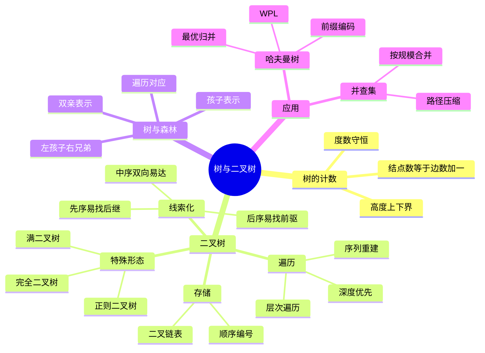

# 数据结构 第5章 树与二叉树

> 来源：`27王道《数据结构》高清带书签.pdf`，第5章 树与二叉树，PDF 页码 p136-p205。
> 复习定位：本章选择题与算法题都很重要；先掌握树形计数、完全二叉树和遍历，再用“递归信息流”统一处理树高、宽度、WPL、平衡性与表达式树。
> 课件整合复核：已读取教材 p136-p205、17 份基础考点课件、期中/期末试卷与解析及强化资料；共处理 29 组 515 个相关页面，对 256 个低文本页完成 OCR，并直接查看 68 张整章联系图，复核关键树形图、代码、手稿和真题后反查习题考点。

## 本章速览

- 树的计数题先抓两个等式：`结点数 = 边数 + 1`，`边数 = 所有结点度数之和`。
- 二叉树题的高频核心是特殊形态、编号公式、存储空指针数和遍历序列构造。
- 遍历不是只背 `NLR/LNR/LRN`，而是二叉树算法题的总模板：访问根的位置决定题型写法。
- 线索二叉树把空指针改作遍历前驱/后继；先序、中序、后序线索的可达性不同。
- 树、森林与二叉树转换靠“左孩子、右兄弟”，遍历对应关系和左右指针含义最常考。
- 哈夫曼树、前缀编码、并查集都是应用题高频点；堆在考纲中出现，但系统复习放到排序章。

## 课件补充来源

- **教材**：`27王道《数据结构》高清带书签.pdf` 第 5 章 p136-p205，含 5 节正文、习题与解析、归纳总结和思维拓展。
- **基础考点讲解**：树概念与性质 2 份、二叉树概念/性质/存储 3 份、遍历与构造 3 份、线索二叉树 3 份、树和森林 3 份、哈夫曼树 1 份、并查集 2 份，共 17 份课件。
- **阶段训练**：数据结构期中、期末试卷及答案解析，反查完全二叉树编号、森林棵数、哈夫曼树、并查集和遍历构造题。
- **强化资料**：`数据结构大纲、历年大题`、`DS直播P1_应用题备考`、`DS直播P2_手稿`、`DS直播P3_算法题备考`、`DS强化结课考试_试卷+答案`，以及二叉树算法题纯净版和手稿版。
- **图片复核重点**：顺序/链式存储图、遍历三次经过模型、序列构造过程、三类线索树、孩子兄弟表示、哈夫曼合并、并查集压缩路径、2014 WPL、2016 正则 k 叉树、2017 表达式树和 2020 前缀编码题。

## 关联导航

- 递归栈与层序队列：[[03-栈、队列和数组#3.3.3 栈在递归中的应用|递归工作栈]]、[[03-栈、队列和数组#3.2 队列|队列]]。
- 复杂度统一口径：[[01-绪论#1.2 算法和算法评价|时间与空间复杂度]]。
- 树遍历推广到图：[[06-图#6.3.1 广度优先搜索 BFS|BFS]]、[[06-图#6.3.2 深度优先搜索 DFS|DFS]]。
- 特殊树的后续操作：[[07-查找#7.3.1 二叉排序树 BST|二叉排序树]]、[[07-查找#7.3.2 平衡二叉树 AVL|平衡二叉树]]。
- 并查集与最小生成树：[[06-图#Kruskal 算法|Kruskal 算法]]。
- 哈夫曼思想在外部排序中的应用：[[08-排序#8.7.5 最佳归并树|最佳归并树]]。

## 知识网络

## 知识点清单

### 5.1 树的基本概念

#### 5.1.1 树的定义

- 树是 `n(n>=0)` 个结点的有限集合；`n=0` 为空树。
- 非空树满足：
  - 有且仅有一个根结点。
  - 除根外，其余结点可分为若干互不相交的子树。
  - 除根外，每个结点有且仅有一个双亲。
- 树是递归定义的数据结构，也是典型分层结构：根无前驱，其他结点有唯一前驱；每个结点可有零个或多个后继。

#### 5.1.2 基本术语

- 祖先/子孙：从根到某结点路径上的结点是其祖先；以某结点为根的子树中的结点是其子孙。
- 双亲/孩子/兄弟/堂兄弟：相邻上下层为双亲与孩子；同双亲为兄弟；双亲在同一层的结点可称堂兄弟。
- 结点的度：该结点的孩子数；树的度：树中结点度的最大值。
- 分支结点：度大于 0 的结点；叶结点：度为 0 的结点。
- 路径：两个结点间经过的结点序列；路径长度按边数计。
- 结点层次/深度：教材按根为第 1 层；根到结点的路径长度等于其层次减 1。结点高度是以该结点为根的子树最大层数；树的高度/深度是最大结点层次。
- 有序树：孩子之间有次序，交换孩子位置得到不同树；无序树反之。
- 森林：`m(m>=0)` 棵互不相交的树的集合；删去一棵树的根，其子树构成森林。
- “度为 `m` 的树”要求至少有一个结点度为 `m`；“`m` 叉树”只限制每个结点至多有 `m` 个孩子，两者不能混用。

#### 5.1.3 树的性质

- 含 `n` 个结点的树有 `n-1` 条边。
- `n = 所有结点度数之和 + 1`。
- 森林有 `n` 个结点、`e` 条边，则树的棵数为 `n-e`。
- 度为 `m` 的树，第 `i` 层至多有 `m^(i-1)` 个结点。
- 高度为 `h` 的 `m` 叉树至多有 `(m^h-1)/(m-1)` 个结点。
- 当 `m>=2、n>=m+1` 时，度为 `m`、有 `n` 个结点的树，最小高度为 `ceil(log_m(n(m-1)+1))`。
- 当 `m>=2、n>=m+1` 时，度为 `m`、有 `n` 个结点的树，最大高度为 `n-m+1`；等价地，高度为 `h`、度为 `m` 的树至少有 `h+m-1` 个结点。
- 若 `n_i` 表示度为 `i` 的结点数，则一般树叶结点数：
  - `n_0 = 1 + sum((i-1)n_i), i=2..m`。

#### 5.1.4-5.1.5 习题反查：树的计数入口

- 遇到“度为 0、1、2、... 的结点个数”题，先列：
  - `n = n_0+n_1+...+n_m`
  - `n-1 = n_1+2n_2+...+mn_m`
- 遇到森林题，优先用 `树数 = 结点数 - 边数`。
- 遇到最小高度，想“前面层尽量满”；遇到最大高度，想“除一个度为 m 的结点外，其余尽量拉成链”。
- “路径长度”不要和哈夫曼的带权路径长度混淆：普通路径长度只数边，WPL 还要乘权值。

### 5.2 二叉树的概念

#### 5.2.1 二叉树的定义及其主要特性

- 二叉树：每个结点至多有两棵子树，且左右子树有次序。
- 二叉树 5 种基本形态：空树、只有根、只有左子树、左右子树都有、只有右子树。
- 二叉树不同于度为 2 的有序树：
  - 二叉树可以为空；度为 2 的树至少有 3 个结点。
  - 二叉树中单孩子也必须区分左孩子或右孩子。

#### 几种特殊二叉树

- 满二叉树：
  - 高度为 `h`，结点数 `2^h-1`。
  - 每层结点数达到最大；叶结点都在最后一层；非叶结点度均为 2。
- 完全二叉树：
  - 高度为 `h`、含 `n` 个结点，结点与同高满二叉树编号 `1..n` 一一对应。
  - 只有最后一层可能不满，且最后一层从左到右连续。
- 二叉排序树：
  - 左子树所有关键字小于根，右子树所有关键字大于根。
  - 关键字互异时，中序遍历得到严格递增序列；若允许重复关键字，必须按题设的重复元素放置规则判断。
- 平衡二叉树：
  - 任一结点左右子树高度差绝对值不超过 1。
- 正则二叉树：
  - 每个分支结点都有 2 个孩子，即只含度为 0 或 2 的结点。
- 正则 `k` 叉树：
  - 只含叶结点和度为 `k` 的分支结点。
  - 若度为 `k` 的结点数为 `m`，叶结点数 `n_0=(k-1)m+1`。
  - 高度 `h` 时最多结点 `(k^h-1)/(k-1)`，最少结点 `1+(h-1)k`。

#### 二叉树性质

- 非空二叉树中，叶结点数 `n_0 = n_2 + 1`。
- 第 `k` 层至多有 `2^(k-1)` 个结点。
- 高度为 `h` 的二叉树至多有 `2^h-1` 个结点。
- 具有 `n(n>0)` 个结点的完全二叉树高度：
  - `ceil(log_2(n+1))`
  - 或 `floor(log_2 n)+1`
- 完全二叉树按 1 基层序编号 `1..n`：
  - 最后一个分支结点编号为 `floor(n/2)`。
  - 编号 `> floor(n/2)` 的结点均为叶结点。
  - 叶结点只可能出现在最后两层。
  - 最多只有一个度为 1 的结点，且只有左孩子；若 `n` 为偶数，该结点编号为 `n/2`。
  - 若 `n` 为奇数，则所有分支结点都有左右孩子。
  - 编号 `i>1` 的双亲为 `floor(i/2)`；左孩子为 `2i`，右孩子为 `2i+1`，存在前提是不超过 `n`。
  - 结点 `i` 所在层次为 `floor(log_2 i)+1`。
- 满 `m` 叉树按 1 基层序编号：
  - 结点 `i` 的第 1 个孩子编号为 `(i-1)m+2`。
  - 第 `k` 个孩子编号为 `(i-1)m+k+1, 1<=k<=m`。
  - 结点 `i>1` 的双亲编号为 `floor((i-2)/m)+1`。
  - 若结点不是其双亲的第 `m` 个孩子，则右兄弟为 `i+1`。

#### 5.2.2 二叉树的存储结构

- 顺序存储：
  - 满二叉树、完全二叉树最适合顺序存储。
  - 一般二叉树必须保留其在完全二叉树中的对应位置，不能只给现有结点重新连续编号，否则父子下标关系会失真。
  - 高度为 `h` 的单支树最坏要开到编号 `2^h-1`，仅存 `h` 个结点，空置 `2^h-1-h` 个位置。
  - 0 基数组中，结点 `i` 的左孩子为 `2i+1`，右孩子为 `2i+2`，双亲为 `floor((i-1)/2)`。
- 二叉链表：
  - 每个结点包含 `data,lchild,rchild`。
  - `n` 个结点共有 `2n` 个指针域。
  - 非空指针数为边数 `n-1`。
  - 空指针数为 `n+1`。
- 三叉链表：
  - 若在二叉链表中增加双亲指针，空指针数为 `n+2`。
  - 若是一般 `m` 叉链表，每个结点有 `m` 个孩子指针，空指针域数为 `(m-1)n+1`。

#### 5.2.3-5.2.4 习题反查：完全二叉树与顺序存储

- 完全二叉树求叶结点数：
  - `n_0 = ceil(n/2)`，分支结点数 `floor(n/2)`。
  - 也可用 `n_0=n_2+1`，再结合是否存在度为 1 的结点。
- 完全二叉树“某层有叶结点”：
  - 该层可能是最后一层，也可能是倒数第二层。
  - 最后层不满时，除最后层外其他层都满。
- 顺序存储判二叉树是否合法：
  - 若某结点不存在，则其后代位置不能存在。
  - 0 基下孩子位置 `2i+1,2i+2`；父亲位置 `floor((i-1)/2)`。
- 顺序存储求最近公共祖先：
  - 1 基编号下，循环让较大编号除以 2，直到两个编号相等；相等编号即最近公共祖先。

### 5.3 二叉树的遍历和线索二叉树

#### 5.3.1 二叉树的遍历

- 遍历：按某种次序访问每个结点一次且仅一次。
- 三种深度优先递归遍历：
  - 先序 `NLR`：根、左、右。
  - 中序 `LNR`：左、根、右。
  - 后序 `LRN`：左、右、根。
- “三次经过”理解：沿树外缘递归行走时，第一次经过结点访问为先序，第二次为中序，第三次为后序；表达式树相应得到前缀、中缀、后缀表达式。
- 递归模板：
  - 访问语句放在递归左子树前，为先序。
  - 放在左右子树之间，为中序。
  - 放在递归右子树后，为后序。
- 层次遍历：
  - 使用队列。
  - 根入队；队头出队访问；非空左孩子、右孩子依次入队；队列空则结束。
  - 求高度、宽度、每层结点数时，可记录当前层最后结点 `last` 或记录队列中结点层号。
- 复杂度：
  - 每个结点访问一次，时间 `O(n)`。
  - 递归栈深为树高 `h`，最坏空间 `O(n)`；层次遍历队列最坏空间也可达 `O(n)`。

#### 由遍历序列构造二叉树

- 单独任意一种遍历序列不能唯一确定二叉树。
- 结点值互异时，已知中序序列，再加先序、后序或层序中的任一种，可唯一确定二叉树；有重复值时还需额外标识。
- 先序 + 中序：
  - 先序第一个是根；用根在中序中划分左右子树。
- 后序 + 中序：
  - 后序最后一个是根；用根在中序中划分左右子树。
- 层序 + 中序：
  - 层序第一个是根；按中序划分左右子树，再在层序中筛出左右子树结点。
- 先序 + 后序通常不能唯一确定二叉树。
- 即使再给层序，若没有中序或额外结构限制，仍可能因单孩子在左还是在右而不唯一；两个结点的树就是最小反例。
- 若限定为正则二叉树（无度为 1 的结点），先序和后序可唯一确定结构；若进一步是满二叉树，每个分支结点左右子树结点数相等，可用 `half=(区间长度-1)/2` 分治。

#### 二叉树算法题模板

- 递归信息流：参数适合把“深度、路径状态”从根向下传；返回值适合把“高度、结点数、是否满足条件”从子树向上传；全局量适合保存跨分支累计值，但答题时要写明初始化。
- 统计度为 0/1/2 的结点：遍历时判断左右孩子是否为空。
- 求树高：`height(T)=max(height(left),height(right))+1`，空树高度为 0。
- 判断平衡：后序同时取得左右子树高度；任一处 `abs(hl-hr)>1` 即失败，并向上返回高度/失败标记，时间 `O(n)`。
- 判断完全二叉树：层次遍历时把空结点也入队；一旦遇到空，后面不能再出现非空结点。等价写法是：右孩子存在而左孩子为空立即失败；首次遇到孩子不全的结点后，后续结点都必须是叶结点。
- 交换左右子树：递归交换左右子树后，再交换当前结点左右指针。
- 删除以某值为根的子树：释放整棵子树宜用后序；查找父结点可用层次遍历。
- 查找先序第 `k` 个结点：用全局计数或引用计数，在先序访问根时递增。
- 打印某结点祖先：后序遍历或栈保存从根到当前结点路径。
- 求一般链式二叉树最近公共祖先：后序返回目标所在子树；左右返回均非空时当前根即 LCA，只一侧非空则向上传递该侧结果。
- 求宽度：层次遍历统计每层结点数，取最大值；队列元素出队后仍需保留层信息或边界信息。
- 求 WPL：可带深度递归，叶结点返回 `weight*depth`；也可在非叶结点保存孩子权值和，WPL 等于所有非叶结点权值之和。
- 按指定遍历次序串成单链表：在“访问根”的位置维护前驱指针 `pre`，令 `pre->next=current`；处理完将表头、表尾和被改作链域的旧指针收好。
- 判断两树相似：两者同时空为真，仅一者空为假；否则递归比较对应左子树和右子树，不比较数据值。
- 表达式树转完全括号化中缀表达式：中序遍历；除根和叶结点外，每个分支结点所代表的子表达式前后各加一个括号。
- 判断顺序存储 BST：先验证形状合法，空位置的后代不能非空；再对所有非空位置中序遍历，关键字互异时序列必须严格递增，也可自底向上维护每棵子树的最小/最大值。只比较结点与直接孩子不够，因为要求左子树所有值 `<` 根 `<` 右子树所有值。

#### 5.3.2 线索二叉树

- 线索化思想：利用二叉链表中的空指针保存某种遍历序列中的前驱或后继。
- 标志域：
  - `ltag=0`：`lchild` 指向左孩子。
  - `ltag=1`：`lchild` 指向遍历前驱。
  - `rtag=0`：`rchild` 指向右孩子。
  - `rtag=1`：`rchild` 指向遍历后继。
- 线索二叉树是“二叉链表 + 线索”，线索含义必须绑定某种遍历次序。

#### 中序线索二叉树

- 线索化本质是一次中序遍历。
- `pre` 指向刚访问过的结点，当前结点 `p` 的中序前驱就是 `pre`。
- 若 `p->lchild == NULL`，令其指向 `pre`，置 `ltag=1`。
- 若 `pre != NULL && pre->rchild == NULL`，令 `pre->rchild = p`，置 `rtag=1`。
- 线索化结束后还要处理最后访问结点：通常令 `pre->rchild=NULL, pre->rtag=1`；在线索树上递归时，仅当相应 `tag=0` 才能进入孩子，否则会沿线索重复访问。
- 可增设头结点形成循环线索链表，便于正向、反向遍历。
- 中序线索树求后继：
  - 若 `rtag=1`，后继为 `rchild`。
  - 若 `rtag=0`，后继为右子树中最左下结点。
- 中序线索树求前驱：
  - 若 `ltag=1`，前驱为 `lchild`。
  - 若 `ltag=0`，前驱为左子树中最右下结点。

#### 先序线索和后序线索

- 先序线索树求后继较直接：
  - 若有左孩子，后继为左孩子。
  - 若无左孩子但有右孩子，后继为右孩子。
  - 若为叶结点，则看右线索。
- 先序线索树若无双亲指针，求先序前驱不方便。
- 后序线索树求前驱较直接，但求后继复杂：
  - 若结点是根，后继为空。
  - 若是双亲的右孩子，或是双亲的左孩子且双亲无右子树，后继为双亲。
  - 若是双亲的左孩子且双亲有右子树，后继为右子树中后序遍历第一个结点。
- 后序线索树若无双亲指针，通常不能高效求后继，常需三叉链表。
- 可达性速记：中序线索的前驱、后继都易求；先序线索易求后继；后序线索易求前驱。另一个方向通常需要双亲指针或从根重新查找。

#### 5.3.3-5.3.4 习题反查：遍历与线索

- “遍历序列不能唯一确定”说的是反推树；对一棵给定二叉树，四种遍历序列各自唯一。
- 先序最后一个结点不一定是中序最后一个；判断相对位置时要回到“根分左右子树”的规则。
- 中序线索树中，某结点有左孩子时，前驱是左子树最右下结点，不一定是叶结点。
- 线索化只改空指针，不改变原有孩子指针。
- 首结点没有前驱、尾结点没有后继；是否接头结点要看题目结构。
- 判断“完全二叉树”不能只看度为 1 结点，还要看层序是否从左到右连续。

### 5.4 树、森林

#### 5.4.1 树的存储结构

- 双亲表示法：
  - 数组存放结点，增设 `parent` 域记录双亲下标。
  - 根结点 `parent=-1`。
  - 查双亲快；查孩子需扫描数组。
- 孩子表示法：
  - 每个结点的孩子组成链表，各链表头指针集中存放。
  - 查孩子快；查双亲需遍历孩子链表。
- 孩子兄弟表示法：
  - 又称二叉树表示法。
  - `firstchild` 指向第一个孩子，`nextsibling` 指向右兄弟。
  - 能自然实现树、森林与二叉树转换。
  - 查某结点双亲通常仍需遍历整棵树，时间 `O(n)`。

#### 5.4.2 树、森林与二叉树的转换

- 树转二叉树：
  - 左指针指向第一个孩子。
  - 右指针指向下一个右兄弟。
  - 由一棵树转换来的二叉树，其根结点没有右子树。
- 森林转二叉树：
  - 先把每棵树转为二叉树。
  - 各树根看成兄弟，用右指针依次连接。
  - 第一棵树的根为转换后二叉树的根。
- 二叉树转树/森林：
  - 根及其左子树对应第一棵树。
  - 根的右指针链对应森林中后续树的根。
  - 沿右指针链拆分，再按“左孩子、右兄弟”还原。
- 转换题常用对应：
  - 森林中树的棵数 = 二叉树根结点及其右指针链上的结点数。
  - 森林中第 1 棵树结点数 = 二叉树总结点数 - 根右子树结点数。
  - 森林中叶结点数 = 对应二叉树中左孩子为空的结点数。

#### 5.4.3 树和森林的遍历

- 树的先根遍历：先访问根，再依次先根遍历各子树。
- 树的后根遍历：先依次后根遍历各子树，再访问根。
- 树的层次遍历：根入队，每次访问队头后，将其全部孩子从左到右入队。
- 森林先序遍历：
  - 访问第一棵树根。
  - 先序遍历第一棵树的子树森林。
  - 先序遍历剩余森林。
- 森林中序遍历：
  - 中序遍历第一棵树的子树森林。
  - 访问第一棵树根。
  - 中序遍历剩余森林。
- 与二叉树遍历的对应关系：
  - 树的先根遍历 = 对应二叉树的先序遍历。
  - 树的后根遍历 = 对应二叉树的中序遍历。
  - 森林先序遍历 = 对应二叉树的先序遍历。
  - 森林中序遍历 = 对应二叉树的中序遍历。
- 有些教材把森林中序遍历称为森林后序遍历；考试按题目术语判断，核心对应关系不变。
- 孩子兄弟表示下的递归题：`firstchild==NULL` 表示原树叶结点；统计整个森林时分别递归第一孩子与右兄弟，求一棵树高度时“孩子链取最大后 +1”，兄弟不增加当前树深度。

#### 5.4.4-5.4.5 习题反查：转换判题规则

- 看到“左孩子右兄弟”，立即把左指针理解成第一个孩子，右指针理解成下一个兄弟。
- 一棵普通树转成二叉树后，根无右子树；森林转二叉树后，根可能有右子树。
- 原树的叶结点在孩子兄弟二叉树中表现为“无左孩子”，不一定左右指针都空。
- 森林中各树根在二叉树中沿右指针相连。
- 已知树的先根和后根，可转化为对应二叉树的先序和中序，从而唯一确定结构。

### 5.5 树与二叉树的应用

#### 5.5.1 哈夫曼树和哈夫曼编码

- 权：赋给结点的数值。
- 结点带权路径长度：从根到该结点路径长度乘以该结点权值。
- 树的带权路径长度 `WPL`：所有叶结点带权路径长度之和，`WPL=sum(w_i*l_i)`。
- 加权平均长度：`WPL / 各叶结点权值之和`。
- 哈夫曼树：含 `n` 个带权叶结点、`WPL` 最小的二叉树，也叫最优二叉树。

#### 哈夫曼树构造与性质

- 构造：
  - 初始把每个权值看成一棵单结点树。
  - 每次选根权值最小的两棵树合并，新根权值为二者之和。
  - 删除原两棵树，加入新树，直到只剩一棵树。
- 性质：
  - 每个初始结点最终都是叶结点。
  - `n` 个叶结点会新建 `n-1` 个分支结点，总结点数 `2n-1`。
  - 不存在度为 1 的结点。
  - 形态不一定唯一，但最小 `WPL` 唯一。
  - 两个最小权值结点可作为兄弟，且通常在最深层。
  - 任意非叶结点权值等于左右子树根权值之和。
  - WPL 也可等于所有分支结点权值之和。
- 度为 `m` 的哈夫曼树：
  - 只含度为 0 和度为 `m` 的结点时，`(m-1)n_m=n_0-1`。
  - 若叶数不满足整除关系，需补权值为 0 的虚叶；最少补 `d=((m-1)-((n_0-1) mod (m-1))) mod (m-1)` 个。

#### 哈夫曼编码

- 固定长度编码：每个字符编码长度相同。
- 可变长度编码：不同字符编码长度可不同。
- `k` 种字符的固定长度至少为 `ceil(log_2 k)` 位/字符；若总频次为 `N`，固定编码总位数为 `N*ceil(log_2 k)`。
- 哈夫曼编码：
  - 高频字符短编码，低频字符长编码。
  - 左分支记 0、右分支记 1 只是约定，可互换。
  - 是前缀编码：任一字符编码都不是另一字符编码的前缀。
  - 译码：从根按 0/1 向下走，遇到叶结点输出字符并回到根。
  - 当叶权值就是频次时，编码总位数等于 `WPL`，平均码长为 `WPL/N`；压缩率用它与固定编码总位数比较。
- 判断前缀编码：
  - 可把所有编码插入二叉树/Trie。
  - 插入途中若提前遇到已有叶结点，或某编码结束时其结点已有后代，则违反前缀特性。

#### 最优归并

- 多个有序表两两合并时，长度 `a` 和 `b` 的两个表最坏比较次数为 `a+b-1`。
- 要使总比较次数最少，每次合并当前最短的两个表。
- 该过程等价于哈夫曼树构造，表长就是权值。

#### 5.5.2 并查集

- 并查集：处理不相交集合的合并与查询的数据结构。
- 基本操作：
  - `Initial(S)`：每个元素初始化为单元素集合。
  - `Find(S,x)`：返回元素 `x` 所在集合的根。
  - `Union(S,Root1,Root2)`：把两个不同集合合并。
- 存储：
  - 常用双亲表示法，用数组 `S[]`。
  - `S[i] < 0` 表示 `i` 是根；负值绝对值常表示集合大小。
  - `S[i] >= 0` 表示 `S[i]` 是 `i` 的双亲下标。
- 基本实现：
  - 初始化：所有 `S[i] = -1`。
  - `Find`：沿双亲指针向上直到 `S[x] < 0`。
  - `Union`：先找两个根，再把一个根挂到另一个根下。
- 优化：
  - 按规模合并：小树并入大树，根结点负值累加集合大小；树高不超过 `floor(log_2 n)+1`。
  - 路径压缩：`Find` 找到根后，把路径上结点直接挂到根下。
  - 两者结合后效率极高，均摊复杂度可近似看作常数，严格记为反阿克曼函数级别。
- 复杂度口径：朴素 `Find` 为 `O(d)`（`d` 是树深），已给根的挂接为 `O(1)`；仅按规模合并使 `Find=O(log n)`，再配合路径压缩后，一系列操作均摊为 `O(alpha(n))`。
- 常见应用：
  - 判断无向图连通性。
  - 判断加入边是否成环。
  - Kruskal 最小生成树中判断一条边两个端点是否已在同一集合。

#### 5.5.3-5.5.4 习题反查：哈夫曼与并查集

- 哈夫曼树有 `2n-1` 个结点，则叶结点/字符数为 `(总结点数+1)/2`。
- 若题目给频次并问编码长度或 WPL，先完整执行“取最小两项合并”过程。
- 若问“是否可能为某哈夫曼编码”，检查：
  - 是否前缀编码。
  - 权值大者不应比明显更小者更深。
  - 两个最小权值结点通常可同层成兄弟。
- 并查集判断环：若 `Find(u)==Find(v)`，加入边 `(u,v)` 会成环。
- `Find` 返回根结点编号，不返回集合大小；集合大小通常看 `S[Find(x)]` 的相反数。
- `Union` 的参数若不是根，要先 `Find`；否则可能破坏树结构。

## 课件补充/强化题规则

- **计数题**：先写 `n-1=度数和`，再写总结点数；正则 `k` 叉树直接用 `n_0=(k-1)n_k+1`，高度极值再画“尽量满”或“尽量成链”。
- **编号题**：先确认 0 基/1 基和是否按完全树位置存放；缺失结点的后代必须缺失，但数组中间的空位不能擅自压缩。
- **序列重建题**：先序/层序定根在首，后序定根在尾，中序负责切左右；若没有中序，先主动检查“单孩子左右可交换”的不唯一反例。
- **线索题**：先判指针是孩子还是线索，再沿对应遍历序列找前驱/后继；写线索化代码时补上尾结点，并用 `tag=0` 限制递归。
- **算法题选型**：按层、宽度、完全性用队列；左右子树结果合并、释放、平衡性用后序；路径深度向下传参数，子树性质向上返回值。
- **2014 WPL**：叶权值乘深度求和；若内部结点保存其子树叶权值和，也可累加全部内部结点权值。答题必须先声明根深度取 0 还是 1。
- **2017 表达式树**：中序输出运算符；除根与叶外，每个子表达式前后配一对括号，保证运算顺序不被优先级改变。
- **2020 前缀编码**：用二叉 Trie 插入；途中遇到已有叶、编码结束处已有孩子、或重复编码，均不满足前缀特性。
- **哈夫曼/最优归并**：每轮只取当前最小两项；若有 `n` 个有序表，每次合并长度为 `a、b` 的表至多比较 `a+b-1` 次，所以总比较次数 `=所有内部结点权值之和-(n-1)`，最小化原则与 WPL 相同。
- **并查集**：题目给边时先 `Find` 两端；同根则成环，不同根才 `Union`。数组根的负值若存规模，合并时先累加负值再挂小树。

## 易错点/易混点

- 树的度为 `m` 表示最大结点度为 `m`，不是每个分支结点都有 `m` 个孩子。
- 路径长度按边数算；根到自身路径长度为 0。
- 树高默认根为第 1 层；若题目把空树高记为 0、叶高记为 1，要统一口径。
- `n_0=n_2+1` 适用于任意非空二叉树，不要求正则；对一般非二叉树不能直接套用。
- 一般树叶结点公式要用 `n_0 = 1 + sum((i-1)n_i)`。
- 二叉树允许“只有右孩子”；普通有序树的单孩子通常不分左右。
- 满二叉树一定是完全二叉树；完全二叉树不一定是满二叉树。
- 完全二叉树某结点没有左孩子，则必无右孩子，且一定是叶结点。
- 完全二叉树最多一个度为 1 的结点，且该结点只有左孩子。
- 顺序存储要先看 0 基还是 1 基，下标公式完全不同。
- “先序 + 后序不能唯一确定”有例外：若题目限定满/正则二叉树，可进一步确定。
- 中序线索树中，前驱/后继不一定是叶结点。
- 线索指向遍历序列中的前驱/后继，不是树形图上的相邻结点。
- 先序线索适合找后继，不适合无双亲指针找前驱；后序线索相反。
- 树的后根遍历对应二叉树中序遍历，不是后序遍历。
- 原树的叶结点对应孩子兄弟二叉树中的“无左孩子”，不是“左右都空”。
- 哈夫曼树不唯一，但最小 WPL 唯一。
- 哈夫曼编码的 0/1 左右约定可互换，所以编码不唯一。
- 哈夫曼树没有度为 1 的结点，也不一定是完全二叉树。
- 一个编码是另一个编码的前缀，就不是前缀编码。
- 并查集 `S[i] < 0` 才表示根；负值不是双亲下标。
- 未优化并查集可退化成链，`Find` 最坏 `O(n)`。
- 路径压缩是在 `Find` 时做，不是 `Union` 自动完成。

## 注解

- 树计数题的第一反应：写 `n = n_0+n_1+...` 和 `n-1 = n_1+2n_2+...`，再消元。
- 完全二叉树题先画“最后一层从左到右填充”，再套 `floor(n/2)` 找最后分支结点。
- 顺序存储公共祖先题不用建树：两个编号不断向上除以 2，直到相等。
- 遍历构造题一定先定位根：先序看第一个，后序看最后一个，层序看第一个；中序负责切分左右子树。
- 算法题看到“统计、查找、求高、求宽、删除、输出路径”，先判断用哪种遍历最顺。
- 后序适合“先处理孩子再处理根”的题，如释放子树、求左右子树结果后合并。
- 层次遍历适合“按层、宽度、完全性”的题。
- 表达式树输出完全括号化中缀表达式时，根和叶不加括号，其余每个分支结点代表的子表达式都加括号。
- 哈夫曼题不要凭直觉排编码，先构造或按前缀树验证。
- 并查集图题中，“同根”表示已连通；若同根还加边，就会形成环。
- 408 算法题重视思路、关键语句和复杂度，边界不必写到工程级，但不能违背遍历顺序。

## 速背检查

| 问题 | 快速答案 |
| --- | --- |
| `n` 个结点的树有几条边？ | `n-1` 条。 |
| 树中结点数和度数之和关系？ | `n = 度数之和 + 1`。 |
| 森林有 `n` 个结点、`e` 条边，有几棵树？ | `n-e` 棵。 |
| 度为 `m` 的树第 `i` 层最多几个结点？ | `m^(i-1)` 个。 |
| 高度为 `h` 的 `m` 叉树最多几个结点？ | `(m^h-1)/(m-1)` 个。 |
| 度为 `m`、`n` 个结点的树最小高度？ | `ceil(log_m(n(m-1)+1))`。 |
| 一般树叶结点公式？ | `n_0 = 1 + sum((i-1)n_i)`。 |
| 二叉树叶结点和度为 2 结点关系？ | `n_0 = n_2 + 1`。 |
| 高度为 `h` 的二叉树最多几个结点？ | `2^h - 1`。 |
| 完全二叉树最后一个分支结点编号？ | `floor(n/2)`。 |
| 完全二叉树叶结点编号范围？ | `floor(n/2)+1` 到 `n`。 |
| 1 基编号结点 `i` 的左、右孩子？ | `2i`、`2i+1`。 |
| 0 基数组结点 `i` 的左、右孩子？ | `2i+1`、`2i+2`。 |
| `n` 个结点二叉链表有几个空指针？ | `n+1` 个。 |
| 判断完全二叉树的层序规则？ | 遇到空结点后，后面不能再出现非空结点。 |
| 先序遍历顺序？ | 根、左、右。 |
| 中序遍历顺序？ | 左、根、右。 |
| 后序遍历顺序？ | 左、右、根。 |
| 层次遍历用什么辅助结构？ | 队列。 |
| 哪些遍历序列组合能唯一构造二叉树？ | 结点值互异时，中序 + 先序/后序/层序。 |
| 为什么判断 BST 不能只比较父子？ | BST 要求左子树所有值 `<` 根 `<` 右子树所有值。 |
| 中序线索树 `ltag=1` 表示什么？ | `lchild` 指向中序前驱。 |
| 中序线索树 `rtag=1` 表示什么？ | `rchild` 指向中序后继。 |
| 树转二叉树的核心规则？ | 左孩子、右兄弟。 |
| 树的先根遍历对应二叉树什么遍历？ | 先序遍历。 |
| 树的后根遍历对应二叉树什么遍历？ | 中序遍历。 |
| 森林中树的棵数对应二叉树哪里？ | 根及其右指针链上的结点数。 |
| `WPL` 是什么？ | 所有叶结点 `权值 * 路径长度` 之和。 |
| 哈夫曼树构造每次选什么？ | 根权值最小的两棵树。 |
| `n` 个叶结点的哈夫曼树总结点数？ | `2n-1`。 |
| 哈夫曼树有度为 1 的结点吗？ | 没有。 |
| 前缀编码的判定？ | 任何编码都不是另一个编码的前缀。 |
| 最优归并策略？ | 每次合并长度最短的两个表。 |
| 并查集根结点在数组中如何表示？ | `S[i] < 0`。 |
| 并查集 `Find` 返回什么？ | 元素所在集合的根。 |
| 并查集两大优化？ | 按规模合并、路径压缩。 |
| 并查集如何判断加边成环？ | 两端点 `Find` 结果相同则成环。 |
