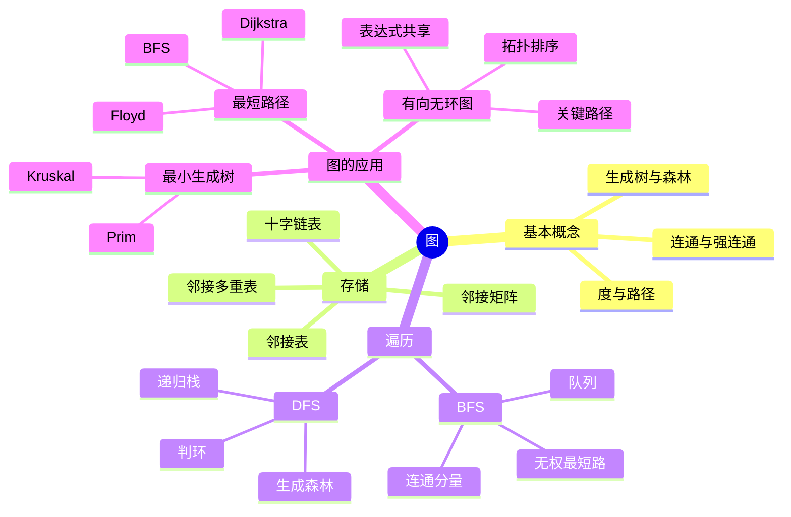

# 数据结构 第6章 图

> 来源：`27王道《数据结构》高清带书签.pdf`，第6章 图，PDF 页码 p206-p275。
> 复习定位：本章选择题、手工模拟与算法题并重；先辨图的类型和存储结构，再用遍历统一连通、判环和无权最短路，最后掌握 MST、最短路、拓扑排序与关键路径的适用条件和表格计算。
> 课件整合复核：已读取教材 p206-p275、14 份基础考点课件、期中/期末试卷与解析及强化资料；共处理 28 组 784 个相关页面，并完成低文本页 OCR、全页渲染、图示/公式/代码/手稿/真题图片复核与习题反查。

## 本章速览

- 图的顶点集不能为空，边集可以为空；无向图看“边”，有向图看“弧”。
- 图的计数题先分清：无向图度数和 `2|E|`，有向图入度和 = 出度和 = `|E|`。
- 存储结构决定操作效率：邻接矩阵适合稠密图，邻接表适合稀疏图，十字链表偏有向图，邻接多重表偏无向图。
- BFS 用队列、按距离分层，可求无权图单源最短路；DFS 类似先序遍历，可用于判环、连通性和拓扑排序。
- MST、最短路、拓扑排序、关键路径是本章高频应用，重点会手工模拟、判适用条件和复杂度。
- AOV 网顶点是活动；AOE 网边是活动、顶点是事件；关键路径是最长路径，不是最短路径。

## 课件补充来源

- **教材**：`27王道《数据结构》高清带书签.pdf` 第 6 章 p206-p275，含 4 节正文、习题与解析、归纳总结和思维拓展。
- **基础考点讲解**：图的概念 1 份、四种存储及基本操作 4 份、BFS/DFS 2 份、MST 1 份、三类最短路 3 份、表达式 DAG/拓扑排序/关键路径 3 份，共 14 份课件。
- **阶段训练**：数据结构期中、期末试卷及答案解析，反查存储结构、遍历序列、MST、最短路、拓扑排序与关键路径题。
- **强化资料**：`数据结构大纲、历年大题`、`DS直播P1_应用题备考`、`DS直播P2_手稿`、`DS直播P3_算法题备考`、图算法与结构定义专题、2021/2023 真题实战及强化结课考试。
- **图片复核重点**：邻接矩阵幂、四种存储图、BFS/DFS 生成树、Prim/Kruskal 选边、Dijkstra/Floyd 表格、DAG 共享、拓扑唯一性、关键路径时标，以及 2015/2017/2021/2023/2024 真题关键页。

## 关联导航

- BFS 队列与 DFS 递归栈：[[03-栈、队列和数组#3.2 队列|队列]]、[[03-栈、队列和数组#3.3.3 栈在递归中的应用|递归工作栈]]。
- 生成树与 Kruskal 判环：[[05-树与二叉树#5.1 树的基本概念|树的性质]]、[[05-树与二叉树#5.5.2 并查集|并查集]]。
- 图查找与算法复杂度：[[01-绪论#1.2 算法和算法评价|算法评价]]、[[07-查找#7.1 查找的基本概念|查找基础]]。
- Dijkstra 在网络路由中的应用：[[计算机网络/04-网络层#OSPF|OSPF]]。
- 图的后续排序联系：[[08-排序#8.2 插入排序|排序与优先选择]]。

## 知识网络

## 知识点清单

### 6.1 图的基本概念

#### 图的定义

- 图：`G=(V,E)`，`V` 为顶点集，`E` 为边集。
- `V` 必须非空；`E` 可以为空。
- 有向图：边是有序对 `<v,w>`，也称弧；`v` 为弧尾，`w` 为弧头。
- 无向图：边是无序对 `(v,w)`，`(v,w)` 与 `(w,v)` 表示同一条边。
- 简单图：不存在重复边，也不存在顶点到自身的边；本书默认讨论简单图。
- 多重图：允许重复边或自环。

#### 度、路径、距离

- 无向图顶点的度 `TD(v)`：依附于该顶点的边数。
  - 所有顶点度数和为 `2|E|`。
  - 度为奇数的顶点个数一定为偶数。
- 有向图顶点的入度 `ID(v)`、出度 `OD(v)`：
  - `TD(v)=ID(v)+OD(v)`。
  - 所有顶点入度和 = 所有顶点出度和 = `|E|`。
- 路径：顶点序列。
- 路径长度：路径上边/弧的条数；带权图中也常讨论带权路径长度。
- 回路/环：第一个顶点与最后一个顶点相同的路径。
- 简单路径：路径中顶点不重复。
- 简单回路：除首尾外顶点不重复的回路。
- `n` 个顶点的简单路径最长含 `n-1` 条边，简单回路最长含 `n` 条边。
- `n` 个顶点的无向图若边数大于 `n-1`，则一定含回路。
- 距离：从 `u` 到 `v` 的最短路径长度；不可达时为无穷大。

#### 子图、连通性、生成树

- 子图：`V'` 是 `V` 的子集，`E'` 是 `E` 的子集，且 `E'` 中边的端点都在 `V'` 中。
- 生成子图：包含原图全部顶点的子图。
- 无向图：
  - 若任意两顶点连通，则为连通图。
  - 极大连通子图称为连通分量。
  - 边数 `< n-1` 时一定非连通。
  - 非连通无向图最多有 `(n-1)(n-2)/2` 条边。
  - 若边数 `>= (n-1)(n-2)/2 + 1`，则无论边如何分布都一定连通。
- 有向图：
  - 若任意两顶点互相可达，则为强连通图。
  - 极大强连通子图称为强连通分量。
  - `n` 个顶点的强连通有向图至少需要 `n` 条弧，可构成一个有向环。
- 生成树：
  - 连通图的生成树是包含全部顶点的极小连通子图。
  - 含 `n` 个顶点时，生成树恰有 `n-1` 条边。
  - 删除任意一条边会不连通，增加任意一条边会形成回路。
- 生成森林：非连通图中，每个连通分量的生成树共同构成生成森林。
  - 若无向图有 `n` 个顶点、`c` 个连通分量，则任一生成森林有 `n-c` 条边。
- 极大连通子图 vs 极小连通子图：
  - 极大连通子图：在连通前提下顶点和边尽可能多，是连通分量。
  - 极小连通子图：在连通前提下边尽可能少，是生成树。

#### 完全图、稠密图、网和有向树

- 无向完全图：任意两顶点之间都有边，边数 `n(n-1)/2`。
- 有向完全图：任意两顶点之间都有方向相反的两条弧，弧数 `n(n-1)`。
- 稠密图/稀疏图是相对概念，常以边数多少判断；一般认为 `|E| < |V|log_2|V|` 时可视为稀疏图。
- 边的权：赋给边/弧的数值；带权图称为网。
- 有向树：一个顶点入度为 0，其余顶点入度均为 1 的有向图。

#### 6.1.2-6.1.3 习题反查：图概念

- 无向图“保证连通”：
  - 只说“可能连通”至少要 `n-1` 条边。
  - 说“任何情况下都连通”至少要 `(n-1)(n-2)/2 + 1` 条边。
- 非连通图边数固定、求最少顶点数：
  - 让尽可能多的边集中在一个完全图，再加一个孤立点。
- `n` 个顶点的环有 `n` 条边，删去任意一条边得到一棵生成树，因此可有 `n` 棵不同生成树。
- “所有顶点度数都大于等于 2 的无向图必有回路”，但不一定连通。
- 无向图有 `n-1` 条边不一定是树；还必须连通。

### 6.2 图的存储及基本操作

#### 6.2.1 邻接矩阵法

- 用 `n*n` 矩阵 `A` 表示边关系。
  - 无权图：有边为 `1`，无边为 `0`。
  - 带权图：有边为权值，无边常为 `∞`，主对角线通常为 `0`。
- 空间复杂度 `O(|V|^2)`，只与顶点数有关。
- 无向图邻接矩阵对称，顶点编号固定时表示唯一。
- 有向图：
  - 第 `i` 行非零/非 `∞` 元素个数为顶点 `i` 的出度。
  - 第 `i` 列非零/非 `∞` 元素个数为顶点 `i` 的入度。
- 无向图：
  - 第 `i` 行或第 `i` 列非零元素个数为顶点 `i` 的度。
  - 零元素数为 `n^2-2e`，非零元素数为 `2e`。
- 判断两点是否有边：`O(1)`。
- 找一个顶点的所有邻边：需扫描一行或一列，`O(|V|)`。
- 带权矩阵统计度数时应数“有限的非对角元素”，不能把权值直接相加当度数。
- 矩阵幂含义：`A^k[i][j]` 表示从 `i` 到 `j` 长度为 `k` 的游走序列数；顶点/边可能重复，若题目限定简单路径则不能直接套用。
  - `A^k` 全部元素之和 = 图中所有起点、终点之间长度为 `k` 的游走总数。
- 若有向图邻接矩阵可通过顶点重排变为上三角矩阵，则图一定无环，存在拓扑序列。

#### 6.2.2 邻接表法

- 顶点表：存顶点信息和第一条边/弧指针。
- 边表：每个结点存邻接点编号、下一条边/弧指针，带权图还可存权值。
- 空间：
  - 无向图：`O(|V|+2|E|)`，每条边存两次。
  - 有向图：`O(|V|+|E|)`，通常存出边表。
- 无向图：顶点的度 = 该顶点边表结点数。
- 有向图：
  - 出度 = 该顶点边表结点数。
  - 入度需遍历全部边表统计。
- 邻接表表示不唯一，取决于边输入顺序；这会影响 BFS/DFS 序列。
- 适合稀疏图；判断两点是否有边要在边表中查找。
- 常见结构定义：顶点结点存 `data, first`，边结点存 `adjvex, next[, weight]`，图再存顶点数组及顶点数、边数。

#### 6.2.3 十字链表

- 有向图的链式存储。
- 顶点结点通常含 `data, firstin, firstout`。
- 弧结点通常含 `tailvex, headvex, hlink, tlink, info`。
- 可方便同时查某顶点的入边和出边，适合求入度、出度和修改有向图。

#### 6.2.4 邻接多重表

- 无向图的链式存储。
- 每条边只用一个边结点表示，避免邻接表中无向边存两份带来的删除/标记不便。
- 边结点通常含 `ivex, jvex, ilink, jlink, info`。
- 适合需要频繁删除、标记、访问边的无向图。

#### 6.2.5 图的基本操作

- `Adjacent(G,x,y)`：判断是否存在边 `(x,y)` 或弧 `<x,y>`。
- `Neighbors(G,x)`：列出顶点 `x` 的所有邻接点。
- `InsertVertex(G,x)` / `DeleteVertex(G,x)`：插入/删除顶点。
- `AddEdge(G,x,y)` / `RemoveEdge(G,x,y)`：增加/删除边或弧。
- `FirstNeighbor(G,x)` / `NextNeighbor(G,x,y)`：求第一个/下一个邻接点。
- `Get_edge_value(G,x,y)` / `Set_edge_value(G,x,y,v)`：获取/设置边权。
- 归纳总结强调：这些操作封装后，很多图算法能同时适配邻接矩阵和邻接表。

| 操作 | 邻接矩阵 | 邻接表 |
| --- | --- | --- |
| 判断 `x,y` 是否邻接 | `O(1)` | `O(deg(x))`，最坏 `O(V)` |
| 枚举 `x` 的邻接点 | `O(V)` | `O(deg(x))` |
| 加边 | `O(1)` | 头插可 `O(1)` |
| 删边 | `O(1)` | `O(deg(x))` |
| 删顶点及关联边 | `O(V)` | 无向图与有向图通常需扫描相关甚至全部边，最坏 `O(V+E)` |

- 矩阵的 `FirstNeighbor/NextNeighbor` 本质是继续扫描一行；邻接表则沿边结点指针移动。
- 有向邻接表若只存出边，删除顶点的入边必须扫描所有顶点的边表。

#### 6.2.6-6.2.7 习题反查：存储结构

- 邻接矩阵：
  - 边数统计需遍历矩阵；有向图数非零元素，无向图数非零元素的一半。
  - 2015 统考题证明矩阵幂时，先用矩阵乘法解释 `A^m[i][j]`，再对全部 `i,j` 求和；不要逐条枚举路径。
  - 无向图矩阵一定对称；非对称矩阵一定不是无向图。
  - 对角线以下全 0 的有向图必无环，但不代表拓扑序列唯一。
- 邻接表：
  - 无向图边表结点个数一定为偶数。
  - 删除与某顶点相关的所有边，有向图出边易删，入边需扫描全部边表。
  - 无向图邻接表转邻接矩阵时，每条边会在矩阵中置两个对称位置。
- 十字链表不是无向图结构；邻接多重表不是有向图结构。
- 存储选择：
  - 稠密图、快速判边：邻接矩阵。
  - 稀疏图、遍历邻接点：邻接表。
  - 有向图频繁查入/出边：十字链表。
  - 无向图频繁处理边：邻接多重表。

### 6.3 图的遍历

#### 6.3.1 广度优先搜索 BFS

- BFS 类似树的层序遍历，按路径长度从近到远访问顶点。
- 必须使用 `visited[]` 防止重复访问。
- 辅助结构：队列。
- 基本流程：
  - 访问起点并标记，起点入队。
  - 队头出队，依次检查其未访问邻接点，访问、**立即标记**、入队。
  - 队列空则该轮 BFS 结束。
  - 若图非连通，外层循环从未访问顶点重新启动 BFS。
- 必须在入队时标记，而不是出队时才标记，否则同一顶点可能被多个前驱重复入队。
- 性能：
  - 邻接表：`O(|V|+|E|)`。
  - 邻接矩阵：`O(|V|^2)`。
  - 队列空间最坏 `O(|V|)`。
- BFS 求无权图单源最短路径：
  - 第一次访问某顶点时经过的边数就是从源点到它的最短距离。
  - 初始化 `d[s]=0`、其余为 `∞`，`path[]=-1`；首次发现 `w` 时令 `d[w]=d[v]+1, path[w]=v`。
  - 沿 `path[]` 从终点反向回溯即可恢复路径。
- 广度优先生成树：
  - 连通图从一个顶点 BFS 可得一棵生成树。
  - 非连通图会得到生成森林。
  - 邻接矩阵 + 同一源点时生成树通常唯一；邻接表因边顺序不同可能不唯一。

#### 6.3.2 深度优先搜索 DFS

- DFS 类似树的先序遍历，沿未访问邻接点尽可能深入，走不通再回溯。
- 辅助结构：递归栈或显式栈。
- 基本流程：
  - 进入顶点 `v` 时立即访问并标记。
  - 依次找未访问邻接点 `w`，递归访问 `w`。
  - 若图非连通，外层循环继续访问未访问顶点。
- 性能：
  - 邻接表：`O(|V|+|E|)`。
  - 邻接矩阵：`O(|V|^2)`。
  - 递归栈最坏 `O(|V|)`。
- DFS 生成树/森林：
  - 对连通图调用 DFS 可得到深度优先生成树。
  - 对非连通图完整遍历得到深度优先生成森林。
  - 邻接表下生成树可能因边输入顺序而不同。

#### 6.3.3 图的遍历与图的连通性

- 无向图：
  - 若一次 BFS/DFS 能访问全部顶点，则图连通。
  - 完整遍历中调用 BFS/DFS 的次数等于连通分量数。
- 有向图：
  - 从某点能访问所有顶点，只能说明该点可达所有顶点，不等于强连通。
  - 非强连通分量中，单次 BFS/DFS 不一定访问该分量所有顶点。
- 判断无向图是否为树：
  - 图连通且边数为 `|V|-1`。
  - 或一次遍历访问全部顶点且无回路。
- 判断二分图：
  - BFS/DFS 染色，相邻顶点染不同颜色。
  - 若遇到相邻顶点同色，则不是二分图。
- 遍历序列与生成树不是一一对应：邻接点次序可能改变访问序列或树边；同一棵生成树也可能对应不同合法序列。

#### 6.3.4-6.3.5 习题反查：遍历

- BFS 每个顶点最多入队一次。
- BFS 生成树中，从根到任意顶点的路径是原图中对应的无权最短路径。
- DFS 判环：
  - 无向图遇到已访问邻接点时，必须排除当前顶点的双亲；否则会把同一条无向边的反向访问误判为环。
  - 有向图使用白/灰/黑三色或递归栈；遇到指向灰色祖先的回边，则有环。
- DFS 输出语句若移到“退出递归前”，对 DAG 的输出序列常与拓扑排序相关：按结束时间降序可得拓扑序列。
- BFS/DFS 序列是否可能，取决于邻接点访问顺序；邻接矩阵通常按固定编号扫描，邻接表可因建表顺序不同而变化。

### 6.4 图的应用

#### 6.4.1 最小生成树 MST

- 适用对象：带权连通无向图。
- MST：包含全部顶点、边数为 `n-1`、总权值最小的生成树。
- 性质：
  - 若所有边权互不相同，则 MST 唯一。
  - 若存在相同权值边，MST 可能唯一，也可能不唯一。
  - MST 不唯一时，最小总代价仍相同。
  - MST 总权值最小，不保证任意两点间路径最短。
  - 若原图本身就是树，则 MST 就是它本身。
- 切分性质：跨越任意割的最小权边是安全边；若它是严格唯一最小边，则它属于每一棵 MST。
- 回路性质：一个回路中的严格最大权边不属于任何 MST；若最大权并列，只能说其中至少有一条可不选。
- 通用贪心框架：反复选择一条安全边，使已选边仍能扩展成某棵 MST。
- 破圈法：
  - 在任意回路中删去一条当前最大权边，反复直到无回路，可得到一棵 MST。
  - 本质利用“回路中最大边不必在某棵 MST 中”。

#### Prim 算法

- 从任意顶点开始维护顶点集合 `U`。
- 每轮选连接 `U` 与 `V-U` 的最小权边，加入新顶点。
- `lowCost[v]` 表示 `v` 到当前树 `U` 的最小连接边权，不是源点到 `v` 的路径长度。
- 执行 `n-1` 轮后得到 MST。
- 邻接矩阵实现时间 `O(|V|^2)`，适合稠密图。
- 与 Dijkstra 相似但目标不同：
  - Prim 选离当前树最近的顶点。
  - Dijkstra 选离源点最近的顶点。

#### Kruskal 算法

- 初始时每个顶点是一棵树，构成森林。
- 按边权从小到大检查边：
  - 若两个端点属于不同连通分量，则加入该边并合并分量。
  - 若加入后成环，则舍弃。
- 常用[[05-树与二叉树#5.5.2 并查集|并查集]]判断端点是否同属一个集合：同根则加边成环，不同根才合并。
- 时间复杂度常记 `O(|E|log|E|)`，适合稀疏图或顶点多边少的图。

#### 6.4.2 最短路径

- 最短路径具有最优子结构：最短路径上的任意子路径也是对应端点间的最短路径。
- BFS：
  - 求无权图单源最短路径。
  - 时间取决于存储结构：邻接表 `O(|V|+|E|)`，邻接矩阵 `O(|V|^2)`。
- Dijkstra：
  - 求非负权图单源最短路径。
  - 维护 `final[]`、`dist[]`、`path[]`。
  - 每轮从未确定顶点中选 `dist` 最小者加入集合，再用其出边松弛其他顶点。
  - 松弛规则：若 `dist[u]+w(u,v)<dist[v]`，则更新 `dist[v]`，并令 `path[v]=u`。
  - 邻接矩阵实现时间 `O(|V|^2)`。
  - 不适用于有负权边的图；即使没有负权回路，只要存在负权边也可能失败。
  - 可生成一棵最短路径树，但不一定是 MST。
- Floyd：
  - 求任意两顶点之间最短路径。
  - 递推：`A[k][i][j] = min(A[k-1][i][j], A[k-1][i][k] + A[k-1][k][j])`。
  - 原地实现必须令 `k` 为最外层：`D[i][j]=min(D[i][j],D[i][k]+D[k][j])`。
  - 时间 `O(|V|^3)`。
  - 可处理负权边，但不能有负权回路；结束后若出现 `D[i][i]<0`，说明存在可达负权回路。
- 选算法先看条件：无权单源用 BFS；非负权单源用 Dijkstra；全源最短路用 Floyd。

#### 6.4.3 有向无环图描述表达式

- DAG：不含有向环的有向图。
- 表达式树中重复出现的公共子表达式会造成重复存储。
- 用 DAG 表达表达式时，公共子表达式只存一份，通过多个父结点共享。
- 规范构造时，相同操作数可共享叶结点；仅当“运算符、左孩子、右孩子”都相同，才复用同一个运算结点。
- 统计运算次数要数 DAG 中的非叶结点，而不是直接数表达式文本中的运算符，因为公共子表达式只计算一次。

#### 6.4.4 拓扑排序

- AOV 网：用 DAG 表示工程，顶点表示活动，边表示活动的先后约束。
- 拓扑序列：图中每个顶点出现一次，且若存在边 `<u,v>`，则 `u` 必须排在 `v` 之前。
- 基本算法：
  - 选择入度为 0 的顶点输出。
  - 删除该顶点及其所有出边。
  - 重复直到所有顶点输出；若图未空但无入度为 0 的顶点，则有环。
- 实现时维护入度数组和零入度栈/队列；容器的选择只会改变合法序列的取法。
- 复杂度：
  - 邻接表：`O(|V|+|E|)`。
  - 邻接矩阵：`O(|V|^2)`。
- 拓扑排序性质：
  - 有拓扑序列等价于有向图无环。
  - 拓扑序列可能不唯一。
  - 若每次入度为 0 的顶点都唯一，则拓扑序列唯一。
  - 若某一步零入度候选多于 1 个，则拓扑序不唯一；若未输出完就没有候选，则有环。
  - 若任意两顶点之间都有明确先后路径，则拓扑序列唯一。
  - DFS 结束时间降序可得到拓扑序列；选择出度为 0 顶点并删除入边可得到逆拓扑序列。

#### 6.4.5 关键路径

- AOE 网：顶点表示事件，边表示活动，边权表示活动持续时间。
- AOE 网通常有唯一源点和唯一汇点。
  - 若原网有多个源点或汇点，可添加持续时间为 0 的虚拟源点/汇点统一计算。
- 关键路径：从源点到汇点的最长路径，其长度决定工程最短完成时间。
- 计算步骤：
  - 拓扑序正向求事件最早发生时间：
    - `ve(源点)=0`
    - `ve(k)=max{ve(j)+Weight(j,k)}`
  - 逆拓扑序反向求事件最迟发生时间：
    - `vl(汇点)=ve(汇点)`
    - `vl(k)=min{vl(j)-Weight(k,j)}`
  - 活动 `<k,j>` 最早开始时间：`e=ve(k)`。
  - 活动 `<k,j>` 最迟开始时间：`l=vl(j)-Weight(k,j)`。
  - 时间余量：`d=l-e`。
  - `d=0` 的活动是关键活动，关键活动构成关键路径。
- 性质：
  - 关键路径可能不止一条。
  - 延长任一关键活动，会使包含它的当前关键路径变长，因此工程工期必然增加。
  - 缩短某个关键活动不一定缩短总工期，尤其存在多条关键路径时。
  - 多条关键路径并存时，必须让每条关键路径都被缩短；优先缩短它们的公共关键活动。
  - 过度缩短某条关键路径上的活动，可能导致关键路径转移。
- 活动区间可写为 `[开始时刻, 开始时刻+工期)`；两个区间有重叠即并行执行。
- 活动 `<u,v>` 若实际推迟到时刻 `s` 开始而不延误工程，其最长允许工期为 `vl(v)-s`。

#### 6.4.6-6.4.7 习题反查：应用算法

- Prim 与 Kruskal 求得的 MST 权值一定相同，但边集可能不同。
- Kruskal 某一步“不能选”的边，通常是加入后会成环的边。
- Dijkstra 的错误贪心：不能只从当前顶点选最近邻继续走；必须在所有未确定顶点中选源点距离最小者。
- Dijkstra 与 OSPF 联动：路由器掌握链路状态图后，以自身为源点运行 Dijkstra，得到最短路径树和下一跳。
- 有向图邻接矩阵主对角线以下全为 0，说明按该编号所有边从小编号指向大编号，因此无环。
- 判断拓扑序是否唯一：Kahn 算法每轮统计零入度顶点；候选始终恰有 1 个才唯一，矩阵实现为 `O(V^2)`。
- AOE 选择题中，若只求关键路径，有时先求 `ve` 就能排除选项；完整计算仍按 `ve/vl/e/l/d`。
- 关键路径综合题常先由压缩矩阵还原无向/有向图，再画网、列拓扑序并计算；每一步的顶点编号和边权必须保持一致。
- 总复杂度速记：
  - 邻接矩阵：Dijkstra `O(n^2)`，Floyd `O(n^3)`，Prim `O(n^2)`，DFS/BFS/拓扑/关键路径多为 `O(n^2)`。
  - 邻接表：DFS/BFS/拓扑/关键路径 `O(n+e)`，Kruskal `O(elog_2e)`。

#### 归纳总结与思维拓展

- 图算法的共同基础是基本操作接口，如 `FirstNeighbor`、`NextNeighbor`，它们屏蔽具体存储结构差异。
- 遍历必须设置 `visited[]`，否则图中回路会导致重复访问。
- BFS 是分层推进，不是递归过程；DFS 常用递归，也可改成栈实现。
- 邻接矩阵表示唯一；邻接表表示依赖输入顺序。
- 割点：删除该顶点及相关边后，无向连通图不再连通。简单判断法是逐个删除顶点，再用 BFS/DFS 检查剩余图是否连通。

## 课件补充/强化题规则

- **存储结构题**：先写顶点结点与边结点字段，再按“矩阵扫行、邻接表沿链”分析复杂度；有向邻接表求入度或删入边必须扫全部边表。
- **矩阵幂题（2015）**：用归纳法说明 `A^m[i][j]` 统计长度为 `m` 的游走，再对所有元素求和；不要把带权矩阵权值和误当成度数。
- **遍历题**：BFS 在入队时标记，DFS 在进入结点时标记；题目问可行序列时，还要结合矩阵扫描顺序或邻接表结点次序。
- **连通分量题**：无向图可用完整 BFS/DFS 的启动次数，或对每条边执行并查集合并，最后统计根结点数。
- **欧拉通路题（2021）**：连通无向图存在一条恰好经过每条边一次的通路，当且仅当奇度顶点数为 `0` 或 `2`；邻接矩阵统计各行度数为 `O(V^2)`。
- **K 顶点题（2023）**：有向邻接矩阵第 `i` 行和为出度、第 `i` 列和为入度，筛选 `OD(i)>ID(i)`；邻接表一次扫边同时累计两端，时间 `O(V+E)`、辅助空间 `O(V)`。
- **唯一拓扑序题（2024）**：每轮寻找零入度顶点，出现多个候选立即判“不唯一”，无候选但尚未输出完说明有环；不能只随便求出一条序列。
- **MST 手算**：Prim 表中维护“到当前树的最小边”，Kruskal 按边权全局排序并用并查集拒绝成环边；权值相同不能直接断定 MST 不唯一。
- **最短路表格**：BFS 首次发现即定距；Dijkstra 每轮确定全局最小暂定距离；Floyd 按 `k` 分阶段允许新中间点，三者不可混用更新规则。
- **无权换乘题**：站点作顶点、直达关系作边，从起点 BFS；边数就是最少乘坐区段数，首次发现终点即可结束。
- **表达式 DAG**：先建/复用操作数叶，再按优先级建立运算结点；只有“运算符与两个孩子均相同”才共享整个子表达式。
- **关键路径题**：按拓扑序求 `ve`，逆拓扑序求 `vl`，最后逐活动算 `e/l/d`；赶工时要同时检查所有关键路径和关键路径转移。

## 易错点/易混点

- 图不能没有顶点；“空图”如果指顶点集为空，在本书语境下不合法。
- 无向图讨论连通性；有向图讨论强连通性，不要把“有路径”误读成“有弧”。
- 强连通图任意两点互相可达，但不要求任意两点之间都有直接弧。
- 无向图边数 `n-1` 只是可能连通，不能保证连通。
- “保证无向图连通”的边数阈值是 `(n-1)(n-2)/2 + 1`，不是 `n-1`。
- 生成树是极小连通子图，不是连通分量；连通分量是极大连通子图。
- 无向图所有顶点度数和一定为偶数，但每个顶点度数不一定为偶数。
- 邻接表无向图每条边存两次；有向图通常只存出边。
- 邻接表不唯一会影响遍历序列；邻接矩阵固定编号下通常唯一。
- `A^k` 统计允许重复顶点/边的定长游走，不等于定长简单路径数。
- BFS 要在入队时标记；等到出队才标记会重复入队。
- 无向图 DFS 遇到已访问邻接点不一定有环，还要排除父边。
- BFS 可求无权最短路径，不适合一般带权图。
- Dijkstra 不适合负权边；Floyd 不适合负权回路。
- MST 不是最短路径树；最短路径树也不一定是 MST。
- 边权互不相同可推出 MST 唯一；边权有相同不能推出 MST 一定不唯一。
- Prim 的 `lowCost` 是到当前树的最小连接代价，不是源点最短距离。
- 回路中只有“严格最大边”才能断定不在任何 MST；最大权并列时不能全部排除。
- 拓扑排序只适用于 DAG；有拓扑序列等价于有向图无环。
- 邻接矩阵可排成上三角只能说明无环，不能说明拓扑序唯一。
- AOV 网顶点表示活动；AOE 网边表示活动。
- 表达式 DAG 的共享条件是整个子表达式相同，不是只看运算符相同。
- 关键路径是最长路径，不是边数最多的路径，也不是最短路径。
- 关键活动余量为 0；非关键活动有时间余量。
- 缩短一个关键活动不一定缩短工期；多关键路径时尤其要看公共关键活动。

## 注解

- 图题先问四件事：有向/无向、带权/无权、连通/非连通、采用哪种存储结构。
- 度数题先写：无向图 `sum TD=2e`；有向图 `sum ID=sum OD=e`。
- 连通边数题用极端构造：让 `n-1` 个顶点先构成完全图，剩一个孤立点。
- 邻接矩阵第 `i` 行/列的含义要按有向图出入度判断：行出列入。
- BFS 题注意“首次访问即最短距离”只对无权图成立。
- DFS 判环可想“如果遇到还在递归栈里的祖先，就形成回路”。
- Prim 像从一个点集向外长树；Kruskal 像按边权排序后用并查集拼森林。
- Dijkstra 和 Prim 都贪心，但 Dijkstra 的 `dist` 是到源点的距离，Prim 的最小边是到当前树的距离。
- 拓扑排序若每轮都有多个入度为 0 的顶点，序列通常不唯一。
- 关键路径计算不要跳表：先 `ve`，再 `vl`，再算活动 `e/l/d`。
- 算法题先声明存储结构；同一个“扫邻接点”，邻接矩阵与邻接表的复杂度不同。

## 速背检查

| 问题 | 快速答案 |
| --- | --- |
| 图可以没有边吗？ | 可以。 |
| 图可以没有顶点吗？ | 不可以。 |
| 无向完全图边数？ | `n(n-1)/2`。 |
| 有向完全图弧数？ | `n(n-1)`。 |
| 无向图度数和？ | `2|E|`。 |
| 有向图入度和、出度和？ | 都等于 `|E|`。 |
| 强连通有向图最少几条边？ | `n` 条，构成有向环。 |
| 无向图边数小于多少一定非连通？ | `< n-1`。 |
| 多少条边能保证无向图一定连通？ | `(n-1)(n-2)/2 + 1`。 |
| 生成树有几条边？ | `n-1` 条。 |
| 邻接矩阵适合什么图？ | 稠密图。 |
| 邻接表适合什么图？ | 稀疏图。 |
| 十字链表适合什么图？ | 有向图。 |
| 邻接多重表适合什么图？ | 无向图。 |
| 邻接矩阵中 `A^k[i][j]` 表示什么？ | 从 `i` 到 `j` 长度为 `k` 的游走序列数。 |
| BFS 用什么辅助结构？ | 队列。 |
| DFS 用什么辅助结构？ | 递归栈或显式栈。 |
| 邻接表下 BFS/DFS 时间复杂度？ | `O(|V|+|E|)`。 |
| 邻接矩阵下 BFS/DFS 时间复杂度？ | `O(|V|^2)`。 |
| BFS 能求什么最短路？ | 无权图单源最短路径。 |
| BFS 何时标记已访问？ | 顶点入队时。 |
| 无向图 DFS 如何避免把父边误判成环？ | 遇到已访问点时排除当前顶点的双亲。 |
| Prim 适合什么图？ | 稠密图。 |
| Kruskal 适合什么图？ | 稀疏图。 |
| Dijkstra 不能处理什么？ | 负权边。 |
| Floyd 不能处理什么？ | 负权回路。 |
| MST 是否保证两点间路径最短？ | 不保证。 |
| 拓扑排序失败说明什么？ | 有向图有环。 |
| 拓扑序列唯一的常见判定？ | 每轮入度为 0 的顶点唯一。 |
| AOV 网顶点表示什么？ | 活动。 |
| AOE 网边表示什么？ | 活动。 |
| 关键路径是什么？ | 源点到汇点的最长路径。 |
| 关键活动如何判定？ | `l-e=0`。 |
| 连通无向图何时存在欧拉通路？ | 奇度顶点数为 0 或 2。 |
