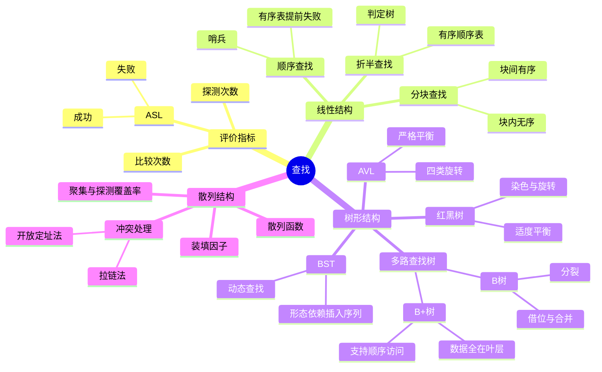

# 数据结构 第7章 查找

> 来源：`27王道《数据结构》高清带书签.pdf`，第7章 查找，PDF 页码 p276-p342。
> 复核：已读取 31 组资料：29 个 PDF 共 651 页、2 份 DOCX；筛出 240 个低文本 PDF 页，教材第7章 67 页补做 OCR，并生成 63 张页面联系图。已直接查看教材整章和折半/分块、AVL/红黑树、B/B+ 树、散列、阶段卷与强化查找算法关键页，重点核对判定树、树形调整、B/B+ 树插删、散列表 ASL 和习题解析。

## 本章速览

- 全章核心指标是平均查找长度 `ASL`，成功和失败通常分开算；题目若综合考虑，概率空间会变。
- 线性结构查找依次掌握顺序查找、有序顺序查找、折半查找、分块查找；重点是适用存储结构和 ASL。
- 树形查找以 BST 为基础，AVL 追求高度平衡，红黑树追求适度平衡；常考插入、删除、查找路径和高度界。
- B 树/B+ 树服务外存索引；B 树重插入、删除、查找，B+ 树重基本性质和与 B 树差异。
- 散列表的效率不只看表长或记录数，而取决于散列函数、冲突处理方法和装填因子 `alpha`。
- 做题入口：先判结构约束，再数比较/探测次数；图形题优先画判定树、旋转图、B 树分裂合并或散列表。

## 课件补充来源

- **教材**：`27王道《数据结构》高清带书签.pdf` 第 7 章 p276-p342，含正文、习题与解析、归纳总结和思维拓展。
- **基础考点讲解**：7.1 基本概念 1 份、三类线性查找 3 份、BST/AVL/红黑树 6 份、B/B+ 树 3 份、散列表 5 份，共 18 份课件。
- **阶段训练**：数据结构期中、期末试卷及答案解析，反查判定树、BST/AVL、散列表构造与 ASL 等小题口径。
- **强化资料**：`数据结构大纲、历年大题`、`DS直播P1/P2/P3/P4`、强化结课考试、`2026数据结构应用题打卡表参考文档`、`26考研数据结构复习建议`。
- **处理规模**：29 个 PDF 共 651 页、2 份 DOCX；教材 67 页已补 OCR，课件与强化资料的低文本页以渲染联系图、OCR 抽骨架和看图复核补足。
- **图片复核重点**：折半判定树、AVL 四类旋转与删除回溯、红黑树插入、B 树高度/分裂/借位/合并、B+ 树顺序查找、四类开放定址探测、删除标记及成功/失败 ASL。

## 关联导航

- ASL 与复杂度评价：[[01-绪论#1.2 算法和算法评价|算法评价]]。
- 顺序表随机访问、链表顺序访问：[[02-线性表#2.2.1 顺序表的定义|顺序表]]、[[02-线性表#2.3.1 单链表的定义|单链表]]。
- BST/AVL/红黑树共同依赖：[[05-树与二叉树#5.2 二叉树的概念|二叉树性质]]、[[05-树与二叉树#5.3.1 二叉树的遍历|中序遍历]]。
- 拉链法与邻接表的结构类比：[[06-图#6.2.2 邻接表法|邻接表法]]；链式桶与基数排序类比：[[08-排序#8.5.2 基数排序|基数排序]]。
- B/B+ 树与外存：[[08-排序#8.7.1 外部排序的基本概念|外部排序]]、[[操作系统/04-文件管理#4.3 文件系统|文件系统索引]]。
- 查找结果常作为后续排序/维护入口：[[08-排序#8.1 排序的基本概念|排序基础]]。

## 知识网络

## 知识点清单

### 7.1 查找的基本概念

- 查找：在数据集合中寻找满足条件的数据元素；结果分查找成功和查找失败。
- 查找表：用于查找的数据集合，由同类型数据元素或记录组成。
- 静态查找表：操作只涉及查找，不动态插入/删除；常用顺序查找、折半查找。
- 动态查找表：需要支持插入或删除；常用 BST、AVL、红黑树、散列表等。
- 关键字：能唯一标识数据元素的数据项；按关键字查找应返回唯一结果。
- 平均查找长度：
  - `ASL = sum(P_i * C_i)`。
  - `P_i` 是查找第 `i` 个元素的概率，等概率时为 `1/n`。
  - `C_i` 是找到该元素所需的关键字比较次数。
  - 归纳总结中强调：查找成功和查找失败的 `ASL` 可分别计算，也可综合计算；考试多数按“成功/失败”分开给概率。

### 7.2 顺序查找和折半查找

#### 7.2.1 顺序查找

- 顺序查找又称线性查找，顺序表和链表都能使用；链表只能顺序查找。
- 一般线性表顺序查找：
  - 从表的一端逐个比较，找到则成功，扫描完仍未找到则失败。
  - 哨兵：把 `key` 放在 `ST.elem[0]`，从表尾向前找，可省去循环中的越界判断。
  - 对长度为 `n` 的表，从表尾向前找第 `i` 个元素，比较次数 `C_i=n-i+1`。
  - 等概率成功：`ASL成功=(n+1)/2`。
  - 失败：需与表中各关键字比较并触及哨兵，常记 `ASL失败=n+1`。
  - 概率不等时，应让高频记录靠近查找起点，可降低 `ASL`。
- 有序线性表顺序查找：
  - 表按关键字有序，失败时可提前停止，不必查完整表。
  - 成功 `ASL` 与一般顺序查找相同。
  - 失败用判定树描述，有 `n+1` 个失败结点；失败比较次数等于失败结点父结点所在层数。
  - 等概率失败：`ASL失败 = n/2 + n/(n+1)`。
  - 有序顺序查找可以用于链式存储；折半查找不能直接用于链式存储。

#### 7.2.2 折半查找

- 又称二分查找，仅适用于关键字有序的顺序表；必须能随机访问中间元素。
- 基本过程：
  - 初始 `low=0, high=n-1`。
  - `mid=(low+high)/2`，向下或向上取整均可，但同一题必须一致。
  - `key` 等于中间元素则成功；小于则查左半；大于则查右半；直到区间空则失败。
- 判定树：
  - 圆形内部结点表示表中实际元素，共 `n` 个。
  - 方形外部结点表示失败区间，共 `n+1` 个。
  - 成功比较次数 = 根到目标结点路径上的结点数。
  - 失败比较次数 = 根到对应失败结点父结点路径上的结点数，不是方形结点层数本身。
  - 判定树满足 BST 性质，也是平衡二叉树；折半查找的判定树由给定有序表和取整方式唯一决定。
  - 若始终向下取整，则任一子树的“右子树结点数 - 左子树结点数”只能为 `0` 或 `1`；向上取整时左右相反，可据此排除伪判定树。
- 性能：
  - 树高 `h=ceil(log2(n+1))`，最多比较次数不超过 `h`。
  - 等概率成功近似 `ASL ≈ log2(n+1)-1`。
  - 时间复杂度 `O(log2 n)`；插入/删除仍需移动元素，动态性差。
- 习题反查规则：
  - 判断某棵二叉树能否是折半查找判定树，要看中序有序、左右子树高度差、结点数分布和取整方式。
  - 查找概率不等时，折半查找不一定优于按概率排序后的顺序查找。

#### 7.2.3 分块查找

- 又称索引顺序查找，兼有顺序查找的动态性和折半查找的较快定位能力。
- 结构要求：
  - 将查找表分为若干块。
  - 块内元素可以无序。
  - 块间必须有序：任一前块的最大关键字小于后一块所有关键字。
  - 索引表按各块最大关键字有序，每项通常含“最大关键字 + 块起始地址”。
- 查找过程：
  - 第一步在索引表确定目标块，可顺序查找或折半查找。
  - 若索引表用折半查找且未命中任何块最大关键字，循环结束时应进入 `low` 所指的第一个“最大关键字 >= key”的块；若 `low` 越过索引表末尾，则目标一定不存在。
  - 第二步在目标块内顺序查找。
- 性能：
  - `ASL = L_i + L_s`，即索引查找平均长度 + 块内查找平均长度。
  - 若长度 `n` 的表均分为 `b` 块，每块 `s` 个记录，`n=bs`，索引和块内都顺序查找：
    - `ASL=(b+1)/2+(s+1)/2=(s^2+2s+n)/(2s)`。
    - 最优块长 `s=sqrt(n)`，最小 `ASL=sqrt(n)+1`。
  - 分块查找需要额外索引空间，但整体效率通常优于普通顺序查找。
  - 查找失败若未给各失败区间概率，通常不能直接求统一失败 ASL；指定失败关键字时，按“索引比较数 + 目标块内比较数”计数。

#### 本节习题与真题反查

- 有序二维矩阵查找：若每行、每列均有序，可从右上角或左下角开始；当前值大于目标则左移，小于目标则下移，比较次数不超过 `2n`，时间 `O(n)`，空间 `O(1)`。
- 有序单链表不能折半查找，仍只能顺序查找；若要求链式存储下较好的查找性能，可构造二叉排序树或其他树形结构。
- 顺序查找在概率不等时可按概率降序排列；折半查找要求关键字有序，不能随意按概率重排。

### 7.3 树形查找

#### 7.3.1 二叉排序树 BST

- BST 是利用有序结构支持动态查找、插入、删除的非线性结构。
- 定义：
  - 左子树所有关键字小于根。
  - 右子树所有关键字大于根。
  - 左、右子树本身也是 BST。
- 遍历与输出：
  - 中序遍历得到递增序列。
  - 右-根-左遍历得到递减序列。
  - 输出不小于 `k` 的关键字，可先访问右子树，再访问根，再访问左子树，并在结点值 `<k` 时剪枝。
- 查找：
  - 从根开始比较；小于走左，大于走右，相等成功。
  - 查找失败时停在空指针处，该空位置就是插入新关键字的位置。
  - 查找路径会不断缩小可取值区间，可用于判断“给定查找序列是否可能”。
- 插入：
  - 先按查找规则定位空指针；若树中已有相同关键字，则插入失败。
  - 新结点一定作为叶结点插入。
- 构造：
  - 按给定关键字序列逐个插入。
  - 同一关键字集合可生成不同 BST，形态取决于插入顺序。
  - 折半查找判定树唯一，BST 不唯一。
- 删除：
  - 叶结点：直接删除。
  - 只有一棵子树：用其孩子顶替。
  - 有两棵子树：用直接前驱或直接后继替换，再删除被替换的那个结点。
- 效率：
  - 查找、插入、删除均为 `O(h)`，`h` 为树高。
  - 接近平衡时平均 `O(log2 n)`。
  - 插入序列有序时可能退化为单支树，平均查找长度退化为 `(n+1)/2`。
  - 计算成功 ASL 时按内部结点层数加权；计算失败 ASL 时补出所有空指针对应的外部结点，比较次数数到其父结点。

#### 7.3.2 平衡二叉树 AVL

- 定义：
  - AVL 是任意结点左右子树高度差绝对值不超过 1 的 BST。
  - 平衡因子 `BF = 左子树高度 - 右子树高度`。
  - 所有结点的 `BF` 只能是 `-1, 0, 1`。
- 插入调整：
  - 插入过程前半部分与 BST 相同。
  - 插入后沿查找路径向上检查，找到离插入点最近的失衡祖先 `A`，以 `A` 为根的子树称最小不平衡子树。
  - 在保持 BST 性质前提下，通过旋转让该子树重新平衡。
- 四种旋转：
  - LL：在 `A` 的左孩子的左子树插入，右单旋。
  - RR：在 `A` 的右孩子的右子树插入，左单旋。
  - LR：在 `A` 的左孩子的右子树插入，先左旋后右旋。
  - RL：在 `A` 的右孩子的左子树插入，先右旋后左旋。
  - 书中注意：LR/RL 旋转时，新结点插入中间结点 `C` 的左子树或右子树，不影响旋转过程。
- 删除调整：
  - 先按 BST 方法删除结点。
  - 若失衡，从被删位置向上找第一个失衡结点 `z`。
  - 令 `y` 为 `z` 的较高子树根，`x` 为 `y` 的较高子树根，根据 `x,y,z` 相对位置判断 LL/LR/RR/RL。
  - 删除可能导致多次向上调整，甚至回溯到根；插入通常只需对最小不平衡子树做一次局部调整。
  - 插入调整后最小不平衡子树恢复到插入前高度，因此更高祖先不再失衡；删除调整后子树高度可能继续减小，所以必须继续向上检查。
- 查找与高度：
  - AVL 最大深度为 `O(log2 n)`，查找 `O(log2 n)`。
  - 深度为 `h` 的 AVL 最少结点数满足 `n_0=0, n_1=1, n_2=2, n_h=n_{h-1}+n_{h-2}+1`。
  - 该递推常用于“给定结点数，最多比较多少次”类题。

#### 7.3.3 红黑树

- 红黑树是满足红黑性质的 BST，采用适度平衡策略。
- 适用场景：
  - AVL 更严格，查找通常更快，但插入/删除调整更频繁。
  - 红黑树调整开销较小，适合插入/删除频繁的动态查找表；常见于 `map/set`、`TreeMap/TreeSet`。
- 五条性质：
  - 每个结点非红即黑。
  - 根结点是黑色。
  - 叶结点指虚构的外部 `NULL` 结点，都是黑色。
  - 不存在两个相邻红结点，红结点的父结点和孩子结点均为黑色。
  - 从任一结点到其任意后代叶结点的简单路径上，黑结点数相同。
- 黑高与高度界：
  - 黑高 `bh`：从某结点出发（不计该结点自身）到任一后代 `NULL` 叶结点路径上的黑结点数；做题先确认题目是否采用相同口径。
  - 从根到叶的最长路径不大于最短路径的 2 倍。
  - 含 `n` 个内部结点的红黑树高度 `h <= 2log2(n+1)`。
  - 黑高为 `h` 的红黑树，内部结点最少 `2^h-1`，最多 `2^(2h)-1`。
- 插入：
  - 新插入结点初始染红；若染黑会使该路径黑高加 1，更难维护性质。
  - 若插入结点为根，则改染黑。
  - 若父结点黑，插入结束。
  - 若父结点红，祖父必黑；根据叔结点颜色处理：
    - 叔红：父和叔染黑，祖父染红，再把祖父作为新的待调整结点向上检查。
    - 叔黑且新结点为“内侧”：先旋转转成外侧情形。
    - 叔黑且新结点为“外侧”：父染黑，祖父染红，再对祖父做一次旋转。
- 删除：
  - 本节内容难度较大，统考概率较低。
  - 先按 BST 删除规则把问题转化为删除至多只有一个孩子的结点，再恢复红黑性质，整体复杂度 `O(log2 n)`。
  - 删除红结点通常不破坏性质。
  - 删除黑结点可能使经过该结点的路径黑高减 1，需要通过兄弟结点颜色、重染色和旋转修复。

#### 本节习题与真题反查

- 判断 BST 查找序列：每比较一次就收缩一个上/下界，后续关键字必须落在新区间。
- BST 最大关键字结点一定没有右孩子，但可以有左孩子；最小关键字结点一定没有左孩子。
- AVL 题先找“最近失衡祖先”，不要直接以根结点为调整对象。
- 若 AVL 某结点左右孩子平衡因子都为 0，不能据此推出该结点左右子树高度相等，还要看左右孩子本身高度。
- 红黑树子树未必仍是红黑树，因为子树根不一定为黑色；判断红黑树要同时检查根黑、无连续红、各路径黑高一致。

### 7.4 B 树和 B+ 树

#### 7.4.1 B 树及其基本操作

- `B` 树也可写作 `B-` 树，这里的 `-` 是连接词，不是“减”。
- `m` 阶 B 树是平衡的 `m` 路查找树，所有叶结点都在同一层。
- 性质：
  - 每个结点最多有 `m` 棵子树，最多有 `m-1` 个关键字。
  - 若根结点不是叶结点，则至少有 2 棵子树，至少 1 个关键字。
  - 除根结点外，所有非叶结点至少有 `ceil(m/2)` 棵子树，至少有 `ceil(m/2)-1` 个关键字。
  - 非叶结点若有 `n` 个关键字，则有 `n+1` 棵子树。
  - 结点内关键字有序，指针 `P_{i-1}` 和 `P_i` 分别划分小于、介于、大于关键字的子区间。
  - 所有叶结点是查找失败的外部结点，不存实际数据，可类比折半判定树的失败结点。
- 查找：
  - 包含两个动作：在 B 树中定位目标结点，在结点内查找关键字。
  - B 树通常存储在磁盘上，定位结点对应磁盘访问；结点内查找在内存中进行。
  - 在非叶结点命中关键字即可查找成功；查到外部叶结点则失败。
- 高度与磁盘访问次数：
  - 本书 B 树高度不包括最底层外部叶结点所在层。
  - 最小高度：每层尽量满，`n <= m^h-1`，所以 `h >= log_m(n+1)`。
  - 最大高度：每层尽量少，`n+1 >= 2*ceil(m/2)^{h-1}`，所以 `h <= log_{ceil(m/2)}((n+1)/2)+1`。
  - 实际高度取整数范围。
- 插入：
  - 先沿查找路径定位到外部叶结点，但实际插入位置是其父结点，即最底层非终端结点。
  - 若插入后结点关键字数不超过 `m-1`，直接结束。
  - 若插入后达到 `m` 个关键字，结点溢出：创建新结点，把中间关键字提升到父结点，左右两部分分别留在原结点和新结点。
  - 父结点若继续溢出，则向上递归分裂；若根分裂，树高加 1。
  - 插入分裂不一定导致树高增加，只有分裂一路传到根才会增高。
- 删除：
  - 若被删关键字不在终端结点，用其直接前驱或直接后继替换，再到对应终端结点删除。
  - 若删除前该结点关键字数 `>=ceil(m/2)`，删除后仍不少于下限，可直接删除。
  - 若删除前该结点关键字数为 `ceil(m/2)-1`，删除后低于下限：
    - 兄弟够借：父结点分隔关键字下移，兄弟关键字上移到父结点。
    - 兄弟不够借：把该结点、兄弟结点和父结点中的分隔关键字合并。
  - 合并会使父结点关键字数减 1；若父结点因此低于下限，需继续向上借位或合并。
  - 若根结点关键字数减为 0，删除根，合并后的新结点成为根，树高减 1。

#### 7.4.2 B+ 树的基本概念

- B+ 树是为数据库和文件系统高效检索设计的 B 树变体。
- `m` 阶 B+ 树性质：
  - 每个分支结点最多有 `m` 棵子树。
  - 非叶根结点至少有 2 棵子树；其他分支结点至少有 `ceil(m/2)` 棵子树。
  - 每个分支结点的关键字个数等于其子树个数。
  - 所有关键字及其记录指针都存储在叶结点中；叶结点关键字有序，并按关键字顺序链接。
  - 分支结点只起索引作用，通常存放其子树中的最大关键字及对应指针。
  - 通常设两个头指针：一个指向根结点，支持从根开始的多路查找；另一个指向最小叶结点，支持顺序/范围查找。
- B 树与 B+ 树差异：
  - 子树数量：B+ 树中 `n` 个关键字的分支结点有 `n` 棵子树；B 树中为 `n+1` 棵。
  - 关键字范围：B+ 树非根内部分支结点关键字数满足 `ceil(m/2) <= n <= m`；B 树满足 `ceil(m/2)-1 <= n <= m-1`。
  - 存储位置：B+ 树所有数据关键字都在叶结点，内部关键字可作为副本重复出现；B 树关键字通常只出现一次。
  - 查找终点：B 树可在非叶结点成功；B+ 树内部结点只负责分支，即使在内部关键字命中，也不能停，必须继续到叶结点验证记录。
  - 顺序访问：B+ 树叶结点有序链接，更适合范围查询和顺序遍历。

#### 本节习题与真题反查

- 有 `n` 个关键字的 B 树有 `n+1` 个外部叶结点，对应失败情况。
- B 树结点分裂后不一定增高；只有根结点也分裂时才增高。
- “插入的新关键字最终一定在终端结点中”不总成立，因为中间关键字可能上升到父结点。
- B 树查找某关键字不一定到叶结点；B+ 树每次查找都到叶结点。
- B 树索引用于文件时，一个索引结点大小应不超过磁盘块；B 树的数据索引项可能分布在各层，B+ 树的数据索引项都在叶结点。

### 7.5 散列 Hash 表

#### 7.5.1 散列表的基本概念

- 散列函数：把关键字映射到存储地址，记为 `Hash(key)=Addr` 或 `H(key)=Addr`。
- 散列表：根据关键字直接访问的数据结构，理想情况下查找时间 `O(1)`。
- 冲突/碰撞：不同关键字映射到同一地址。
- 同义词：发生冲突的不同关键字。
- 冲突不可完全避免，因此必须设计冲突处理方法。

#### 7.5.2 散列函数的构造方法

- 构造要求：
  - 定义域必须包含全部关键字，值域范围取决于散列表大小。
  - 地址尽可能均匀分布，以减少冲突。
  - 函数尽量简单，能快速计算。
- 直接定址法：`H(key)=key` 或 `H(key)=a*key+b`。
  - 简单且不冲突；适合关键字基本连续。
  - 关键字稀疏时会浪费空间。
- 除留余数法：`H(key)=key % p`。
  - 最常用。
  - `p` 取不大于表长 `m` 且尽量接近 `m` 的质数。
- 数字分析法：
  - 选关键字中分布较均匀的若干位作为地址。
  - 适合已知且固定的关键字集合；集合变化时可能要重构。
- 平方取中法：
  - 取关键字平方后的中间若干位作为地址。
  - 适合关键字各位取值分布不均或关键字本身位数较少。
- 没有绝对最优的散列函数，应按关键字集合特点选取。

#### 7.5.3 处理冲突的方法

- 开放定址法：
  - 散列表中的所有空闲地址都可存放任意关键字。
  - 通式：`H_i=(H(key)+d_i)%m`，初始探测 `d_0=0`，之后的 `d_i` 为冲突后的探测增量。
  - 插入依赖表中存在真正空单元，实际应用通常要求 `alpha<1`；若没有真正空单元，探测序列即使覆盖全表也无法插入。
  - 线性探测：`d_i=1,2,...,m-1`；顺序查看下一个单元，到表尾回到表首。
  - 线性探测易产生聚集：同义词和非同义词的探查序列交织，使元素在相邻地址堆积。
  - 平方探测：`d_i=1^2,-1^2,2^2,-2^2,...,k^2,-k^2`；一般至少覆盖约一半单元；若表长 `m` 是形如 `4k+3` 的质数，则可覆盖全表。
  - 双散列法：`d_i=iH2(key)`，探测序列 `H_i=(H(key)+iH2(key))%m`。
  - 双散列只有在 `H2(key)` 与表长 `m` 互质时才能保证覆盖全表；伪随机序列也必须覆盖各地址才可靠。
- 开放定址删除：
  - 不能直接物理删除表中已有元素，否则可能截断其他元素的探测路径，导致查找失败。
  - 正确做法是设置删除标记，实现逻辑删除。
  - 插入时可复用删除标记位置；查找时必须越过删除标记，只有遇到从未使用过的真正空单元才可判失败。
  - 副作用：多次删除后，表看似很满，但实际有许多位置未被正常利用。
- 拉链法/链地址法：
  - 把映射到同一地址的同义词组成一个链表。
  - 第 `i` 个散列地址存放第 `i` 条链的头指针。
  - 头插法构造会使链内次序与插入次序相反；若按访问概率或关键字有序组织链，可改善相应查找。
  - 适合插入、删除频繁的场景。
  - 记录数可以超过散列地址数，因此 `alpha` 可大于 1；此时平均链长增大，但不会像开放定址那样因无空单元而无法插入。
  - 不会产生开放定址中的聚集现象；但链长不均仍会影响查找效率。

#### 7.5.4 散列查找及性能分析

- 构造和查找过程基本一致：
  - 先算初始地址 `Addr=H(key)`。
  - 若该地址为空，查找失败。
  - 若该地址非空，比较关键字；相等则成功，不等则按冲突处理方法继续探测或沿链查找。
- 成功 ASL：
  - 对每个已存关键字，按实际查找该关键字需要的比较/探测次数统计，再取平均。
  - 同一关键字集合、同一散列函数，不同冲突处理方法会得到不同 `ASL`。
- 失败 ASL：
  - 开放定址：通常从散列函数值域中的每个可能初始地址出发，数到遇到第一个真正空单元为止，再对这些初始地址取平均；删除标记不能作为失败终点。
  - 拉链法：通常按每个地址对应链长统计失败时需要比较的结点数；空链比较次数按题目口径处理。
- 装填因子：
  - `alpha = 表中记录数 n / 散列表长度 m`。
  - 散列表平均查找长度主要依赖 `alpha`，并受散列函数和冲突处理方法影响；不直接只由 `n` 或 `m` 决定。
  - `alpha` 越大，表越满，冲突概率越高。
- 常见线性探测近似公式：
  - 查找成功：`ASL_s = (1 + 1/(1-alpha))/2`。
  - 查找失败常见形式：`ASL_f = (1 + 1/(1-alpha)^2)/2`。
  - 统考更常要求按构造出的表逐格数探测次数，不要只背公式。

#### 本节习题与真题反查

- 只有折半查找必须是有序顺序存储；顺序查找可顺序/链式，树形查找用树结构，散列的链地址法是顺序存储和链式存储结合。
- `alpha<1` 不能避免碰撞；碰撞由散列函数映射关系导致。
- 散列查找仍要比较关键字，不是只计算地址。
- 线性探测插入 `K` 个互为同义词的关键字，至少探测 `1+2+...+K=K(K+1)/2` 次。
- 聚集的主要原因不是数据元素过多本身，而是开放定址下同义词与非同义词探查序列交织。
- 用线性探测“寻找下一个空位”时，空位可能在原散列地址之后，也可能因循环回到表首而在原散列地址之前。

## 课件补充/强化题规则

- **ASL 总入口**：先写清概率空间，再决定分母；成功对已存关键字加权，失败对失败区间、外部结点或散列初始地址加权，不能把两类样本混算。
- **顺序查找题**：先确认查找方向和是否设哨兵；概率不等时把高频元素放在查找起点附近，有序只改善失败查找，不改变等概率成功 ASL。
- **折半过程题**：固定下标起点与 `mid` 取整方式，逐轮写 `low/high/mid`；判断比较序列时，每次比较都必须落入上一次留下的区间。
- **折半变式题**：找第一个等于 `key` 的元素时，命中后记录位置并令 `high=mid-1`；找最后一个时令 `low=mid+1`，不能第一次命中就返回。
- **分块查找题**：先确定索引表用顺序还是折半，再进入唯一候选块顺序扫描；折半索引未命中时进 `low` 指向的块，不是随便选 `mid/high`。失败关键字的长度也必须包含索引比较。
- **BST 题**：构造按输入次序逐个插入；路径合法性用上下界判定；成功/失败 ASL 都要画外部空指针，删除双孩子结点只换直接前驱或后继。
- **AVL 题**：沿插入/删除路径向上找最近失衡祖先，按 `z-y-x` 的走向判 LL/LR/RR/RL；每次旋转后重新接好中间子树并检查 BST 次序。
- **红黑树题**：先验五条性质；插入牢记“新结点红，父黑停，父红看叔”，叔红重染上推，叔黑把内侧转外侧后旋转重染。
- **B 树手算题**：每一步都检查关键字上下限；插入超上限“中间上升、左右分裂”，删除低下限“先向兄弟借，借不到连父分隔字一起合并”。
- **B+ 树判断题**：内部关键字只是索引副本，命中仍须下行到叶层；叶结点顺序链支持范围查找，这是与 B 树最稳定的区分点。
- **散列表构造题**：先标出物理表长 `m` 与散列函数值域，两者可能不同；逐关键字写初址和完整探测序列，表中位置不能只凭结果倒推。
- **探测覆盖题**：线性探测覆盖全表；平方探测满足 `m=4k+3` 且为质数时覆盖全表；双散列检查步长与 `m` 是否互质。
- **散列删除题**：开放定址采用删除标记，查找遇标记继续、遇真正空位才失败，插入可复用删除标记；成功删除后重新计算 ASL 时，成功分母改为剩余记录数。
- **散列 ASL 题**：成功次数按每个元素实际插入/查找路径统计；失败次数从每个可能初址数到空位。拉链法失败通常等于链长，空链是否记 `0` 以题目口径为准。
- **强化复习侧重**：第7章是小题和应用题高频章；优先练 AVL/B 树/散列表手算，红黑树抓定义和插入框架，B+ 树抓性质与 B 树对比，折半查找变式抓代码边界。

## 易错点/易混点

- ASL 是加权平均；概率不等时不能直接套等概率公式。
- 查找成功和查找失败的概率空间不同：分开算时成功概率和失败概率各自归一，综合算时两者总和为 1。
- 静态查找表不是数据永远不变，而是当前操作不涉及插入/删除。
- 顺序查找的哨兵用于省边界判断，不是表中真实元素。
- 有序顺序查找可用于链表；折半查找必须顺序存储且有序。
- 有序顺序查找失败 ASL 小于一般无序顺序查找，因为可提前失败。
- 折半判定树有 `n` 个成功结点和 `n+1` 个失败结点；失败长度数到失败结点的父结点。
- 折半查找始终向下取整时，各子树右结点数不会少于左结点数且至多多 1；改用向上取整时结论镜像。
- 折半查找的判定树唯一，BST 的形态由插入顺序决定，不唯一。
- 分块查找用折半查索引失败时，候选块是 `low` 指向的块；若 `low` 已越界，则不能再进最后一块硬扫。
- BST 插入的新结点一定是叶结点；B 树插入的新关键字最终不一定在叶层，因为可能上升。
- BST 最大关键字结点不一定是叶结点，只能保证没有右孩子。
- AVL 平衡因子是“左高 - 右高”，不是右高减左高。
- AVL 插入只调最近失衡祖先；删除可能多次向上调整。
- 红黑树中的叶结点是虚构外部 `NULL` 结点，不是普通内部叶子结点。
- 红黑树子树不一定仍是红黑树，因为子树根未必为黑。
- B 树非根结点关键字下限是 `ceil(m/2)-1`，不是 `m/2`。
- B 树高度不计最底层外部叶结点；题目问磁盘访问次数时通常看实际结点层数。
- B 树 `n` 个关键字对应 `n+1` 棵子树；B+ 树分支结点 `n` 个关键字对应 `n` 棵子树。
- B 树查找可在非叶结点成功；B+ 树必须继续到叶结点。
- B+ 树内部结点命中关键字也不是查找成功，它只说明要沿对应分支继续下行。
- B 树插入分裂不一定使树增高，只有根分裂才增高。
- B 树删除时先借后并；兄弟够借时不要直接合并。
- `alpha<1` 不代表无冲突；冲突只与散列函数和关键字集合有关。
- 散列表物理长度可以大于散列函数值域；失败 ASL 的初始位置分母按可产生的散列地址数，而非机械使用物理表长。
- 平方探测并非永远只能覆盖半张表；满足 `m=4k+3` 且 `m` 为质数时可以覆盖全部单元。
- 开放定址删除不能直接清空单元，要做删除标记。
- 删除标记可被后续插入复用，但查找失败不能停在删除标记上。
- 拉链法 `alpha` 可大于 1；开放定址表必须保留真正空单元，通常要求 `alpha<1`。
- 线性探测聚集可由非同义词造成，不只是同义词冲突。

## 注解

- 折半查找题：先画判定树，再数层数；别用 `log2 n` 粗估 ASL。
- 分块查找题：先看索引表用顺序还是折半，再加块内查找长度。
- BST 查找序列题：维护一个允许区间，每比较一次缩小一次区间。
- AVL 旋转记忆：外侧插入单旋，内侧插入双旋；LL/RR 单旋，LR/RL 双旋。
- 红黑树插入记忆：新结点红；父黑结束；父红看叔，叔红重染色上推，叔黑旋转。
- B 树插入删除口诀：插入超上限就分裂，中间上升；删除低下限先借，借不到合并。
- B+ 树抓三句话：全部记录在叶子，叶子顺序链接，查找一定到叶子。
- 散列表计算题：先画表，再逐个数成功探测次数；失败 ASL 按每个可能初始地址数到空位。
- 树形 ASL：内部结点算成功，空指针对应的外部结点算失败；两者都按“实际关键字比较次数”计数。
- 章末“多数元素”思维拓展：若某数字出现次数超过数组长度一半，每次删除两个不同数，它仍可能留下；Boyer-Moore 抵消法可 `O(n)` 找候选，再计数验证。

## 速背检查

- `ASL=sum(P_i*C_i)` 中 `P_i` 和 `C_i` 分别表示什么？
- 查找成功 ASL 和查找失败 ASL 的概率空间有何区别？
- 顺序查找哨兵的作用是什么？
- 等概率顺序查找成功和失败 ASL 分别是多少？
- 有序顺序查找失败 ASL 为什么小于无序顺序查找？
- 折半查找为什么不能直接用于链表？
- 始终向下取整的折半判定树，左右子树结点数满足什么限制？
- 折半判定树中成功结点和失败结点各有多少个？
- 折半查找失败比较次数为什么数到失败结点父结点？
- 分块查找的块间有序、块内无序是什么意思？
- 分块查找用折半索引且未命中索引关键字时，应进入哪个块？
- 分块查找在顺序索引和顺序块内查找时，最优块长是多少？
- BST 中序遍历和右-根-左遍历分别得到什么序列？
- BST 删除有两个孩子的结点时如何转化？
- BST/AVL 的失败 ASL 为什么要补出外部结点？
- AVL 平衡因子如何定义？合法值有哪些？
- AVL 的 LL、RR、LR、RL 分别怎样旋转？
- AVL 删除为什么可能比插入调整更多次？
- 红黑树五条性质是什么？黑高是什么意思？
- 红黑树插入新结点为什么先染红？
- `m` 阶 B 树非根非叶结点最少有几个关键字？
- B 树高度公式中为什么不计外部叶结点？
- B 树插入和删除的“分裂、借位、合并”何时发生？
- B 树与 B+ 树中 `n` 个关键字对应几棵子树？
- B+ 树在内部结点命中关键字时能否立即成功？
- B+ 树为什么适合范围查询？
- 装填因子 `alpha` 如何定义？它影响什么？
- 开放定址法删除为什么不能直接物理删除？
- 删除标记在开放定址查找和插入时分别如何处理？
- 拉链法的 `alpha` 能否大于 1？开放定址为什么通常不行？
- 四类开放定址探测在什么条件下能覆盖全表？
- 线性探测为什么容易产生聚集？
- 散列表成功 ASL 和失败 ASL 分别如何数？
- 多数元素为什么可以用“删除两个不同数”的抵消思想寻找？
