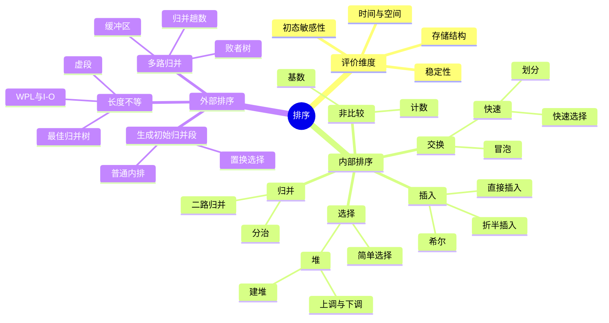

# 数据结构 第8章 排序

> 来源：`27王道《数据结构》高清带书签.pdf`，第8章 排序，PDF 页码 p343-p403；已额外查看 p404 参考文献页确认正文结束。
> 复核：本轮重新读取 34 组资料：30 个 PDF 共 1093 页、4 份 DOCX；筛出 378 个低文本 PDF 页，教材第8章 p343-p404 共 62 页补做 OCR，并生成 101 张页面联系图。已直接查看教材整章、基础课件和强化排序算法关键页，重点核对排序过程、代码边界、复杂度/稳定性、外部排序计算和习题解析。

## 本章速览

- 排序题常问四件事：能否模拟中间过程、是否稳定、时空复杂度、初始序列是否影响性能。
- 稳定算法：直接插入、折半插入、冒泡、归并、基数、计数；不稳定算法：希尔、快速、简单选择、堆。
- 平均 `O(n^2)`：直接插入、折半插入、冒泡、简单选择；平均 `O(nlog2n)`：快速、堆、归并。
- 快速排序平均最快但可能退化；堆排序最坏时间仍为 `O(nlog2n)` 且省空间；归并排序稳定但需 `O(n)` 辅助空间。
- 外部排序核心是减少磁盘 I/O：减少初始归并段、增大归并路数、用败者树降低内部比较、用最佳归并树安排长度不等的段。
- 复习顺序建议：先背总表，再会模拟每类算法的一趟结果，最后做外部排序公式题。

## 课件补充来源

- **教材**：`27王道《数据结构》高清带书签.pdf` 第 8 章 p343-p403，另看 p404 确认正文结束；覆盖正文、习题解析、归纳总结和思维拓展。
- **基础考点讲解**：排序概念，插入/希尔/冒泡/快速/选择/堆，归并/基数/计数及计数排序代码附件，外部排序/败者树/置换-选择/最佳归并树，共 16 个 PDF。
- **阶段训练**：数据结构期中、期末试卷及答案解析，反查稳定性、排序中间状态、复杂度、堆调整和外部排序小题口径。
- **强化资料**：`数据结构大纲、历年大题`、`DS直播P1/P2/P3/P5`、排序算法加场、快速排序代码、快排划分思想、归并排序算法题专题、强化结课考试。
- **补充文档**：`2026数据结构应用题打卡表参考文档`、`26考研数据结构复习建议`；重点标出希尔/堆/基数手算、快速排序算法题和外部排序历年考法。
- **处理规模**：30 个 PDF 共 1093 页、4 份 DOCX；378 个低文本 PDF 页中，教材第8章 62 页已补 OCR，其余低文本页以联系图和关键页看图复核补足。
- **图片复核重点**：希尔分组、快排双指针、堆的上下调整、稳定归并、基数队列、计数前缀和、败者树、置换-选择与最佳归并树。

## 关联导航

- 排序算法的时间/空间复杂度：[[01-绪论#1.2 算法和算法评价|算法评价]]。
- 顺序表与链表决定可选算法：[[02-线性表#2.2 线性表的顺序表示|顺序表]]、[[02-线性表#2.3 线性表的链式表示|链表]]。
- 基数排序的分配/收集依赖：[[03-栈、队列和数组#3.2 队列|队列]]。
- 堆与最佳归并树的结构基础：[[05-树与二叉树#5.2 二叉树的概念|完全二叉树]]、[[05-树与二叉树#5.5 树与二叉树的应用|哈夫曼树]]。
- 外存排序与文件组织：[[操作系统/04-文件管理#4.3 文件系统|文件系统]]；外存索引对照：[[07-查找#7.4 B 树和 B+ 树|B/B+ 树]]。
- 本章内部联系：[[08-排序#8.3.2 快速排序|划分思想]]、[[08-排序#8.4.2 堆排序|优先队列]]、[[08-排序#8.7.5 最佳归并树|k 叉哈夫曼思想]]。

## 知识网络

## 知识点清单

### 8.1 排序的基本概念

- 排序：将表中元素重新排列，使其按关键字有序；本书默认非递减有序。
- 稳定性：
  - 若两个元素关键字相同，排序后相对先后次序不变，则算法稳定。
  - 稳定性不是算法优劣标准；当关键字互不相同时，稳定性无实际影响。
  - 证明“不稳定”只需构造一组相同关键字相对次序改变的反例。
- 内部排序：排序期间所有元素都在内存中。
- 外部排序：数据量过大，不能一次装入内存，需要在内存和外存间多次交换。
- 内部排序主要操作：
  - 比较：确定关键字相对次序。
  - 移动：调整元素位置。
  - 基数排序、计数排序不是基于关键字两两比较。
- 习题反查：
  - “稳定排序更优”是错的。
  - 链表也可以排序，但折半插入、希尔、快排、堆排这类依赖随机访问的算法不适合链式存储。

### 8.2 插入排序

#### 8.2.1 直接插入排序

- 思想：每趟把一个待排序元素插入到前面已排好序的子序列中。
- 第 `i` 趟：将 `L(i)` 插入 `L[1..i-1]` 的合适位置，初始 `L[1]` 可视为有序。
- 常用 `A[0]` 作哨兵/暂存单元：
  - 暂存待插入元素。
  - 从后向前比较并移动元素。
  - 找到位置后放回。
- 性能：
  - 空间复杂度 `O(1)`。
  - 最好：初始有序，只需 `n-1` 次比较，`O(n)`。
  - 最坏：初始逆序，比较和移动均为 `O(n^2)`。
  - 平均：`O(n^2)`，平均比较和移动次数约为 `n^2/4` 量级。
  - 稳定。
- 适用：顺序表和链表均可；链式存储时不必大量移动元素。
- 链表直接插入排序：
  - 逐个摘下原链表结点，插入到已排序链表的合适位置。
  - 关键是先保存 `next`，再改链插入；比较仍顺序进行，但不搬移记录本体。

#### 8.2.2 折半插入排序

- 思想：将“查找插入位置”和“移动元素”分开。
  - 先在前面有序子表中用折半查找确定插入位置。
  - 再统一后移元素并插入。
- 与直接插入排序对比：
  - 标准实现每趟折半定位，比较次数为 `Theta(nlog2n)`，基本不受初态影响。
  - 元素移动次数不减少，仍依赖初始序列有序程度。
  - 初始有序时无批量后移，最好时间为 `Theta(nlog2n)`；平均/最坏仍为 `O(n^2)`。
  - 空间复杂度 `O(1)`。
  - 稳定。
- 保持稳定的边界：遇到相等关键字继续向右找，即令 `low=mid+1`，最终插入 `high+1`，放在原有相等元素之后。
- 适用：仅适用于顺序存储线性表。
- 易考口径：不能笼统称它为 `O(nlogn)` 排序；其平均/最坏情况仍受移动瓶颈限制。

#### 8.2.3 希尔排序

- 又称缩小增量排序，是直接插入排序的改进。
- 思想：
  - 选增量序列 `d1 > d2 > ... > dt = 1`。
  - 每趟按当前增量 `d` 把元素分成 `d` 个子序列，对每个子序列做直接插入排序。
  - 增量逐渐变小，使整体逐步接近有序；最后一趟 `d=1` 完成整体排序。
- 一趟结束只保证“下标相差 `d` 的各子序列分别有序”，不保证整个表已有序；判断中间状态必须按增量拆组。
- 注意：
  - 目前无理论最优增量序列。
  - `A[0]` 只是暂存单元，不是哨兵；下标越界时插入位置已到。
- 性能：
  - 空间复杂度 `O(1)`。
  - 时间复杂度依赖增量序列，通常优于直接插入，最坏可为 `O(n^2)`。
  - 不稳定，因为相同关键字可能被分到不同子序列并跨组移动。
- 适用：仅适用于顺序存储；适合中等规模、空间要求低的场景。

#### 本节习题与真题反查

- 初始序列基本有序时，直接插入排序往往最优。
- 三类简单算法中，直接插入和冒泡最好可达 `O(n)`；简单选择不受初始序列影响，始终 `O(n^2)`。
- 希尔排序属于插入类排序，不属于交换或选择。
- 判断希尔排序一趟结果：按增量分组，只在同组内做插入排序。

### 8.3 交换排序

#### 8.3.1 冒泡排序

- 思想：反复比较相邻元素，若逆序则交换；每趟把当前未排序部分的最小或最大元素放到最终位置。
- 可从后向前把最小元素“冒”到前面，也可从前向后把最大元素“沉”到后面。
- `flag` 优化：某趟没有发生交换，说明表已整体有序，可提前结束。
- 性能：
  - 空间复杂度 `O(1)`。
  - 最好：初始有序，只做一趟扫描，`O(n)`。
  - 最坏：初始逆序，比较 `n(n-1)/2` 次，交换移动为 `3n(n-1)/2` 次，`O(n^2)`。
  - 平均 `O(n^2)`。
  - 稳定，相等元素不交换。
- 过程特征：
  - 每趟产生的有序子序列具有全局有序性。
  - 已排序部分中的所有元素均小于或大于未排序部分。
  - 与直接插入排序的“局部有序”不同。

#### 8.3.2 快速排序

- 思想：
  - 选一个枢轴 `pivot`，通常取首元素。
  - 一趟划分后，左子表关键字均小于枢轴，右子表关键字均大于或等于枢轴。
  - 枢轴被放到最终位置。
  - 再递归处理左右子表。
- 划分过程：
  - 常用 `low/high` 双向扫描。
  - 右侧先找小于枢轴的元素放到左端，左侧再找大于枢轴的元素放到右端。
  - `low==high` 时把枢轴放入该位置。
  - 以首元素为枢轴的挖坑法通常必须先从右向左扫描；两次扫描都要带 `low<high`，递归区间为 `[low,p-1]`、`[p+1,high]`。
  - 相等关键字要统一归边；若左右扫描的比较条件处理不一致，容易导致枢轴回填错误或指针不推进。
- 性能：
  - 最好：每次划分均衡，`O(nlog2n)`。
  - 平均：`O(nlog2n)`，平均性能通常是内部排序中最优。
  - 最坏：初始基本有序或逆序且固定取首元素为枢轴，划分极不均衡，`O(n^2)`。
  - 空间复杂度取决于递归深度：最好/平均 `O(log2n)`，最坏 `O(n)`。
  - 不稳定。
- 改进：
  - 三者取中。
  - 随机选枢轴。
  - 小规模子表切换为直接插入排序。
- 适用：要求随机访问，通常用于顺序存储。
- 过程特征：
  - 每趟至少确定一个枢轴最终位置。
  - 每趟不产生全局有序子序列，左右子表内部不一定有序。

#### 本节习题与真题反查

- 判断是否是一趟快排结果：枢轴左侧都小于它、右侧都大于等于它，并且枢轴在最终位置。
- 判断第二趟快排结果：两个子表分别继续划分，可能确定多个枢轴，但不能要求所有小区间已完全有序。
- 快排递归深度最大为 `n`，发生在每次只划出一个元素的极不均衡情况。
- 求第 `k` 小元素可用快排划分思想，只递归包含第 `k` 位的一侧，平均 `O(n)`，空间 `O(1)`。
- 第 `k` 小若对应数组下标，通常要和 `k-1` 比较；题目若直接给“位置 k”，先确认使用 0 下标还是 1 下标。
- 快速选择若写成循环，每轮只保留包含第 `k` 位的一侧，才能得到额外空间 `O(1)`；若递归实现还要计递归栈。
- 把所有负数放到非负数前面，也可用快排划分思想，时间 `O(n)`，空间 `O(1)`。

### 8.4 选择排序

#### 8.4.1 简单选择排序

- 思想：第 `i` 趟从 `L[i..n]` 中选出最小元素，与 `L(i)` 交换。
- 每趟确定一个元素的最终位置，共 `n-1` 趟。
- 性能：
  - 比较次数固定为 `n(n-1)/2`，与初始状态无关。
  - 移动次数很少，最多 `3(n-1)` 次，最好为 0。
  - 最好、平均、最坏时间均为 `O(n^2)`。
  - 空间复杂度 `O(1)`。
  - 不稳定，如 `{2a,2b,1}` 一趟后可能变成 `{1,2b,2a}`。
- 适用：顺序表和链表均可；记录本身信息量大、移动代价高时可考虑。

#### 8.4.2 堆排序

- 堆可看作顺序存储的完全二叉树。
- 下标从 1 开始：
  - 大根堆：`L(i) >= L(2i)` 且 `L(i) >= L(2i+1)`。
  - 小根堆：`L(i) <= L(2i)` 且 `L(i) <= L(2i+1)`。
  - 只需检查 `1 <= i <= floor(n/2)` 的分支结点。
- 下标从 0 开始：父结点 `floor((i-1)/2)`，左右孩子 `2i+1`、`2i+2`，最后一个分支结点为 `floor(n/2)-1`。
- 升序排序通常建大根堆；降序排序通常建小根堆。
- 建初始堆：
  - 从最后一个分支结点 `floor(n/2)` 开始，依次向前处理到根。
  - 对每个分支结点执行自上而下筛选。
  - 建堆时间复杂度 `O(n)`，不是 `O(nlogn)`。
- 输出堆顶并调整：
  - 将堆顶与堆底交换，使堆顶元素归位。
  - 堆规模减 1。
  - 新堆顶自上而下筛选，恢复堆性质。
  - 单次调整 `O(log2n)`。
- 插入/删除：
  - 插入：新元素放堆尾，自下而上调整，`O(log2n)`。
  - 删除堆顶：堆尾补根，自上而下调整，`O(log2n)`。
  - 删除任意位置后，以堆尾补位；新值破坏父子关系时，按与父结点/孩子的关系选择上调或下调。
- 性能：
  - 最好、平均、最坏均为 `O(nlog2n)`。
  - 空间复杂度 `O(1)`。
  - 不稳定。
  - 适用于顺序存储。
- 堆的应用：
  - Top-K：求最大 `K` 个，用大小为 `K` 的小根堆；求最小 `K` 个，用大小为 `K` 的大根堆。
  - 扫描大数据并维护堆，常见复杂度 `O(nlogK)`，空间 `O(K)`。
  - 若只求前 10 个最小元素且无需全排序，维护大小为 10 的大根堆比全排序高效。
  - 验证数组是否为堆只需扫描所有分支结点并检查父子关系，时间 `O(n)`。

#### 本节习题与真题反查

- 判断一个序列是否为堆：按完全二叉树下标关系检查父子，不要看线性局部大小。
- 小根堆中最大元素只能出现在叶结点，即下标范围通常为 `floor(n/2)+1..n`。
- 建堆和调整堆复杂度不同：建堆 `O(n)`，一次插入/删除 `O(logn)`，完整堆排序 `O(nlogn)`。
- 冒泡、简单选择、堆排序每趟都能确定当前最大/最小元素的最终位置；快排每趟确定枢轴位置。

### 8.5 归并排序、基数排序和计数排序

#### 8.5.1 归并排序

- 核心：将两个或多个有序子表归并成一个更长的有序表。
- 2 路归并排序：
  - 初始把 `n` 个记录视为 `n` 个长度为 1 的有序子表。
  - 两两归并，得到长度为 2 的子表，再得到长度为 4 的子表，直到完整有序。
  - 非递归时，每趟把相邻长度为 `h` 的有序段归并为长度为 `2h` 的有序段。
  - 递归时采用分治：分解、递归排序、合并。
- 合并两个有序表时，相等关键字先取左段元素才能保持稳定；两个长度分别为 `m,n` 的有序表合并需 `O(m+n)`。
- 性能：
  - 每趟处理全部 `n` 个元素。
  - 趟数约 `ceil(log2n)`。
  - 最好、平均、最坏时间均为 `O(nlog2n)`。
  - 空间复杂度 `O(n)`。
  - 稳定，相等时优先取前一段元素。
- 适用：顺序表和链表均可；链表归并可减少移动。
- 多个有序表合并：两表合并可直接归并；多个长度不等的表两两合并时，按权值最小优先的哈夫曼思想可减少总工作量；同时多路合并可用小根堆或败者树选最小段首。

#### 8.5.2 基数排序

- 非比较排序，基于多关键字排序思想。
- 对长度为 `n` 的线性表，每个关键字由 `d` 个分量组成，每位取值范围 `0..r-1`。
- 两种方法：
  - MSD：最高位优先，按高位逐层划分子序列。
  - LSD：最低位优先，从低位到高位逐趟分配和收集。
- 链式基数排序 LSD：
  - 准备 `r` 个队列。
  - 每一位做一次分配：按当前位把记录入对应队列。
  - 再按队列编号顺序收集，形成新序列。
  - 共 `d` 趟。
- 每次分配与收集都必须保持队列的先进先出，才能维持前一低位已有的稳定次序；复合关键字应按“次要关键字到主要关键字”依次做稳定排序。
- 性能：
  - 时间复杂度 `O(d(n+r))`。
  - 空间复杂度 `O(r)`。
  - 与序列初始状态无关。
  - 稳定。
- 适用：关键字位数和取值范围较小、可分解为多关键字；顺序和链式存储均可，链式结构尤其适合。

#### 8.5.3 计数排序

- 非比较排序，思想是统计每个元素前面有多少个元素小于等于它，从而确定最终位置。
- 常见做法：
  - `C[x]` 统计值为 `x` 的元素个数。
  - 对 `C` 做前缀和，使 `C[x]` 表示小于等于 `x` 的元素总数。
  - 从后向前扫描输入数组，把元素放入输出数组，保证稳定。
- 关键字含负数时可统一减去最小值作偏移，下标范围变为 `0..max-min`。
- 性能：
  - 时间复杂度 `O(n+k)`，`k` 为关键字范围大小。
  - 空间复杂度 `O(n+k)`；若关键字范围为固定常量，可相对 `n` 视为 `O(1)`。
- 注意：计数排序不在统考大纲范围内，但思想在真题中多次出现。

#### 本节习题与真题反查

- 归并排序趟数与初始状态无关。
- 在 `O(nlogn)` 比较排序中，归并排序稳定，堆排序和快速排序不稳定。
- 基数排序不能直接处理普通 `float/double` 实数，除非能合理拆分关键字。
- 若整数范围固定为 `0..65535`，可用计数数组实现 `O(n)` 时间、相对 `n` 的 `O(1)` 空间；有负数时可加偏移量。

### 8.6 各种内部排序算法的比较及应用

#### 8.6.1 内部排序算法的比较

| 算法 | 最好 | 平均 | 最坏 | 空间 | 稳定 | 适用存储 |
| --- | --- | --- | --- | --- | --- | --- |
| 直接插入 | `O(n)` | `O(n^2)` | `O(n^2)` | `O(1)` | 是 | 顺序/链式 |
| 折半插入 | `O(nlog2n)` | `O(n^2)` | `O(n^2)` | `O(1)` | 是 | 顺序 |
| 希尔 | 依赖增量 | 依赖增量 | `O(n^2)` | `O(1)` | 否 | 顺序 |
| 冒泡 | `O(n)` | `O(n^2)` | `O(n^2)` | `O(1)` | 是 | 顺序/链式 |
| 快速 | `O(nlog2n)` | `O(nlog2n)` | `O(n^2)` | 平均 `O(log2n)` | 否 | 顺序 |
| 简单选择 | `O(n^2)` | `O(n^2)` | `O(n^2)` | `O(1)` | 否 | 顺序/链式 |
| 堆 | `O(nlog2n)` | `O(nlog2n)` | `O(nlog2n)` | `O(1)` | 否 | 顺序 |
| 2 路归并 | `O(nlog2n)` | `O(nlog2n)` | `O(nlog2n)` | `O(n)` | 是 | 顺序/链式 |
| 基数 | `O(d(n+r))` | `O(d(n+r))` | `O(d(n+r))` | `O(r)` | 是 | 顺序/链式 |
| 计数 | `O(n+k)` | `O(n+k)` | `O(n+k)` | `O(n+k)` | 是 | 顺序 |

- 时间复杂度：
  - 简单选择比较次数与初始序列无关。
  - 直接插入、冒泡在最好情况可达 `O(n)`。
  - 快排平均最优但最坏退化。
  - 堆排和归并时间稳定为 `O(nlogn)`。
- 空间复杂度：
  - 直接插入、折半插入、希尔、冒泡、简单选择、堆均为 `O(1)`。
  - 快排平均 `O(logn)`，最坏 `O(n)`。
  - 归并需要 `O(n)`。
- 稳定性：
  - 稳定：插入、冒泡、归并、基数、计数。
  - 不稳定：希尔、快排、简单选择、堆。
- 固定趟数/初态无关：直接插入、简单选择通常做 `n-1` 趟；归并约 `ceil(log2n)` 趟；基数做 `d` 趟；堆输出 `n-1` 次。冒泡可能提前结束，快排趟数由划分形态决定。

#### 8.6.2 内部排序算法的应用

- 选择算法要考虑：
  - 元素个数 `n`。
  - 初始序列是否基本有序。
  - 关键字结构和分布。
  - 是否要求稳定。
  - 存储结构和辅助空间限制。
  - 记录本身信息量和移动代价。
- 选型小结：
  - `n` 小：直接插入或简单选择；若记录本身很大、移动代价高，简单选择移动少。
  - 初始基本有序：直接插入或冒泡。
  - `n` 大且随机分布：快速排序通常平均最快。
  - 要求最坏也稳定在 `O(nlogn)` 且空间少：堆排序。
  - 要求稳定且能接受 `O(n)` 空间：归并排序。
  - 关键字位数少、范围有限、可分解：基数排序或计数排序。
  - 记录很大且频繁移动代价高：链式存储、索引排序或归并类方法更合适。
- 排序下界：
  - 基于比较的排序，每次比较只有两种结果，可用判定树描述。
  - 对 `n` 个关键字的随机排列，任意基于比较的排序最坏至少需要 `O(nlog2n)` 时间。
- 混合策略：
  - 实际系统常在快速排序或归并排序递归底层切换为直接插入排序，减少函数调用并提升小规模局部效率。
- 高频比较：近乎有序时，直接插入比简单选择的比较次数少，但移动次数未必更少；直接插入优于快排还可能因为数据少、空间 `O(1)` 或要求稳定。

#### 本节习题与真题反查

- “稳定且关键字为实数”常排除基数排序，因为实数不易按固定有限位直接分配。
- 判断某趟中间结果：
  - 直接插入：前缀局部有序。
  - 冒泡/选择/堆：某个最大或最小元素已到最终位置，全局边界确定。
  - 快排：枢轴到最终位置，左右区间满足大小关系。
  - 归并：有序段长度按趟数成倍增长。
- 两个连续有序段原地合并：若不用辅助数组，最坏比较/移动可为 `O(mn)`；若用归并思想和辅助空间，可 `O(m+n)` 时间、`O(m+n)` 空间。
- 把最后一个元素放到排序后的正确位置，可用以最后元素为枢轴的一趟快排划分，比较次数不超过 `n`。

### 8.7 外部排序

#### 8.7.1 外部排序的基本概念

- 外部排序：待排序记录存储在外存，无法一次装入内存，需多次内外存交换完成排序。
- 外部排序主要代价是磁盘 I/O，不是 CPU 比较。
- 常用归并排序思路：
  - 生成初始归并段。
  - 多路平衡归并，直到得到完整有序文件。
- 外部排序总时间由三部分组成：
  - 内部排序生成初始段的时间。
  - 外存读写时间。
  - 内部归并时间。

#### 8.7.2 外部排序的方法

- 设文件有 `r` 个初始归并段，采用 `k` 路平衡归并：
  - 归并趟数 `S=ceil(log_k r)`。
  - 每趟读一遍、写一遍所有记录。
  - 减少 I/O 的主要方法：增大归并路数 `k`，减少初始归并段数 `r`。
- 若文件共占 `B` 个磁盘块：生成普通初始段需 `2B` 次块 I/O，每趟归并也需 `2B`；只算归并阶段为 `2BS`，连同初始段生成共 `2B(1+S)`。先看题目是否已给出初始归并段，避免多算一轮。
- `k` 路归并至少需要 `k` 个输入缓冲区和 1 个输出缓冲区；内存缓冲区数和可同时打开的文件数共同限制 `k`。
- 输入缓冲区空时，从对应归并段再读入一块；输出缓冲区满时，才把这一块写回外存。
- 初始归并段：
  - 普通内部排序生成的段长受内存工作区大小限制。
  - 若内存一次可容纳 `m` 个记录，则普通方法段长通常约为 `m`，段数约 `ceil(n/m)`。

#### 8.7.3 多路平衡归并与败者树

- 普通 `k` 路归并：
  - 每输出一个最小记录，普通方法可能要在 `k` 个段首中比较 `k-1` 次。
  - 归并路数越大，归并趟数少，但内部比较开销上升。
- 败者树：
  - 是树形选择排序的变体。
  - `k` 个叶结点对应 `k` 个归并段当前记录。
  - 内部结点保存比较中的败者，胜者继续向上。
  - `ls[0]` 保存当前胜者段号，即当前最小关键字所在段。
  - 输出胜者后，从该段读入下一个关键字，只沿该叶到根的路径调整。
  - 更新后的胜者/败者关系必须一路调整到根，不能因为中途某次比较结果看似不变就提前停止。
- 作用：
  - 初建败者树需 `k-1` 次比较；替换一个胜者后只沿叶到根调整，复杂度 `O(log2k)`。
  - 统考教材与选择题通常按 `ceil(log2k)` 次作答；若题目给出具体非满树并要求精确计数，则按胜者所在叶到根的实际深度数，可能为 `floor(log2k)` 或 `ceil(log2k)`。
  - 内部归并比较次数与 `k` 的线性增长脱钩。
  - 在内存允许时，增大 `k` 可减少归并趟数和 I/O。
- 注意：`k` 不是越大越好。总内存固定时，`k` 增大意味着每个输入缓冲区变小，可能增加每趟读写次数。
- 根部保存的是“当前最小记录来自哪个归并段”的段号，不只是最小关键字；败者树降低 CPU 比较开销，本身不直接减少 I/O。

#### 8.7.4 置换-选择排序

- 目的：生成更长的初始归并段，减少初始归并段个数 `r`。
- 设输入文件 `FI`，输出文件 `FO`，工作区 `WA` 可容纳 `w` 个记录。
- 过程：
  - 从 `FI` 读入 `w` 个记录到 `WA`。
  - 从 `WA` 选当前最小关键字记录作为 `MINIMAX`，输出到 `FO`。
  - 若 `FI` 非空，读入下一个记录到 `WA`。
  - 在 `WA` 中选关键字不小于当前 `MINIMAX` 的最小记录作为新 `MINIMAX`。
  - 若不存在这样的记录，则当前初始归并段结束，开始下一段。
  - 重复直到 `FI` 和 `WA` 均空。
- 特点：
  - 初始归并段长度不再固定受限于工作区大小 `w`，而取决于输入数据分布。
  - 输入升序时可只生成 1 个归并段，长度最大为 `n`。
  - 若工作区内 `w` 个元素都大于后续输入记录，第一个归并段最小长度为 `w`。
  - 随机输入时平均段长常接近 `2w`。
  - `WA` 中选择 `MINIMAX` 可用败者树实现。
- 判题操作：输出当前最小值后读入新记录；若新记录小于刚输出的 `MINIMAX`，就“冻结”到下一归并段，否则仍可参加当前段竞争。
- 生成所有初始段时，每个记录仍会被读一次、写一次；若按磁盘块计，I/O 仍为 `2B`。

#### 8.7.5 最佳归并树

- 用于安排长度不等的初始归并段的归并顺序，使 I/O 次数最少。
- 归并树：
  - 叶结点表示初始归并段，权值为段长。
  - 叶到根路径长度表示该段参与归并的趟数。
  - `WPL` 表示归并过程中读出的总记录数。
  - 总 I/O 次数通常为 `2*WPL`，因为每趟读和写各一次。
- 最佳归并树：
  - 按 `k` 叉哈夫曼树思想构造。
  - 优先归并长度较小的段，让长段尽量晚参与归并。
  - 构造时先补 0 权虚段，再反复取 `k` 个最小权值合并；不能先随意合并再补虚段。
- 虚段：
  - 若初始归并段数不能构成严格 `k` 叉树，要补长度为 0 的虚段。
  - 虚段不产生实际 I/O，但能让归并树满路，从而获得最优结构。
- 补虚段规则：
  - 设初始归并段数为 `n0`，归并路数为 `k`。
  - 若 `(n0-1) % (k-1) = 0`，不补虚段。
  - 若余数 `u != 0`，需补 `k-u-1` 个虚段。
  - 例：`n0=8, k=3`，`(8-1)%2=1`，补 `3-1-1=1` 个虚段。
  - 等价约束：补虚段数 `d` 后应满足 `(n0+d-1)%(k-1)=0`，使所有非叶结点都有 `k` 个孩子。
  - 补虚段后，度为 `k` 的内部结点数为 `(n0+d-1)/(k-1)`；若无需补虚段，则为 `(n0-1)/(k-1)`。

#### 本节习题与真题反查

- 外部排序和内部排序的主要区别不是数据量绝对大小，而是是否涉及内外存数据交换。
- 多路平衡归并用于减少归并趟数，不是减少初始归并段个数。
- 置换-选择排序用于生成初始归并段，不是完成整个外部排序。
- 败者树用于高效实现多路归并，不直接减少初始段个数。
- 输入/输出缓冲区的作用是暂存输入/输出记录，不是内部归并的工作区。

## 课件补充/强化题规则

- **中间状态判定**：希尔按增量拆组；插入看有序前缀；冒泡/选择/堆看已归位边界；快排找满足左小右大的枢轴；归并看等长有序段；基数按当前位稳定分桶。
- **稳定性判定**：不要只背表。插入/冒泡需让相等元素不越过，归并相等先取左段，基数使用 FIFO，计数从右向左回填；跨组交换、远距离交换常破坏稳定性。
- **手写排序代码**：先写区间含义和循环不变式。快排重点查扫描方向、`low<high`、枢轴回填和递归边界；归并重点查临时数组、尾段复制与相等取左；堆重点查下标口径和堆规模。
- **链表排序代码**：直接插入先保存当前结点的 `next`，再把当前结点插入有序链表；头结点、空表、尾结点 `next=NULL` 是检查点。
- **划分型算法题**：奇偶分区、正负分区、第 `k` 小等都可复用快排划分；只处理目标所在一侧才是快速选择，平均 `O(n)`，且第 `k` 小常对应下标 `k-1`。
- **移动次数题**：交换一次通常按 3 次移动；简单选择比较固定但移动至多 `3(n-1)`，因此“记录很大、移动昂贵”是其选型入口。
- **堆题四步**：确认 0/1 起始下标 -> 画完全二叉树 -> 判大/小根堆 -> 插入上调、删除/建堆下调；升序排序建大根堆。
- **线性时间入口**：关键字范围固定用计数，位数与基数固定用基数，选择第 `k` 小用期望线性的快速选择；它们不与比较排序 `Omega(nlogn)` 下界冲突。
- **外排计算四步**：算磁盘块数 `B` -> 算初始段数 `r` -> 由缓冲区确定 `k` -> 算 `S=ceil(log_k r)` 和题目要求范围内的 `2B` 倍数。
- **三种优化分工**：置换-选择减小 `r`；败者树把选最小的比较降至 `O(logk)`；最佳归并树以最小 `WPL` 安排长度不等的段。
- **外排过程题**：输入缓冲区空才补读，对应归并段读完才弃用；输出缓冲区满才写出。败者树替换叶结点后必须一路调整到根。
- **最佳归并树题**：先补 0 权虚段，再每次合并 `k` 个最小权；`WPL` 是总读记录量，总读写量为 `2WPL`，虚段不产生实际 I/O。
- **真题侧重**：希尔、堆、基数常考过程模拟；快排常考手写与划分应用；外排重点落在最佳归并树、置换-选择和败者树的职责及计算。

## 易错点/易混点

- 稳定性不是优劣标准；不稳定只需一个反例。
- 直接插入排序的有序区是局部有序；冒泡排序的有序区是全局有序。
- 折半插入排序只减少比较次数，不减少移动次数；标准实现最好 `Theta(nlogn)`，平均/最坏仍为 `O(n^2)`。
- 希尔排序中 `A[0]` 是暂存单元，不是哨兵；希尔排序不稳定。
- 冒泡排序若一趟无交换即可提前结束，最好 `O(n)`。
- 快速排序每趟只保证枢轴到最终位置，不保证左右子表内部有序。
- 快速排序最坏不是因为数据“大”，而是划分极不均衡。
- 快速选择的“第 `k` 小”常和数组下标 `k-1` 对应，不能把名次和下标混用。
- 简单选择排序比较次数与初始序列无关，移动次数与初始序列有关。
- 简单选择排序移动次数少，但不稳定。
- 建初始堆是 `O(n)`；完整堆排序是 `O(nlogn)`。
- 小根堆最大元素不在根，只可能在叶结点。
- 堆排序不稳定，且只适合顺序存储。
- 归并排序稳定，但需要 `O(n)` 辅助空间。
- 基数排序是稳定的非比较排序，适合关键字可分解且范围小的场景。
- 计数排序若关键字范围固定，可相对 `n` 视为空间 `O(1)`；范围大则不合适。
- 仅归并排序在常见 `O(nlogn)` 比较排序中稳定。
- 快排平均性能通常优于堆排，但堆排最坏情况更稳。
- 外部排序主要瓶颈是磁盘 I/O。
- 增大归并路数 `k` 不总是越大越好，缓冲区变小可能增加 I/O。
- 外排 I/O 要辨别“只算归并阶段”还是“连初始段生成一起算”，两者相差 `2B`。
- 败者树每次调整为 `O(logk)`，统考常用 `ceil(log2k)`；给出具体树时再按叶深精确计数。
- 败者树调整要从替换的叶结点一直比较到根；不完整调整会导致 `ls[0]` 仍可能不是全局胜者。
- 败者树减少的是内部比较次数；置换-选择减少的是初始归并段数；最佳归并树优化的是长度不等段的归并顺序。
- 最佳归并树补虚段公式是 `k-u-1`，其中 `u=(n0-1)%(k-1)`。

## 注解

- 判断中间状态先问“这一趟能确定什么”：插入看前缀，冒泡/选择/堆看边界元素，快排看枢轴，归并看有序段长度。
- 复杂度表要和稳定性表一起背，选择题经常把两者交叉考。
- 快排划分题用“左小右大、枢轴归位”检查，不要要求左右内部有序。
- 堆题一律先把数组画成完全二叉树，再按父子下标判断。
- Top-K 题抓“反向堆”：求最大 K 个用小根堆，求最小 K 个用大根堆。
- 外部排序题先算初始段数 `r`，再算归并趟数 `ceil(log_k r)`；长度不等时转最佳归并树。
- 置换-选择题跟踪 `MINIMAX`：新记录若小于当前输出值，就不能进入当前段，只能等下一段。
- 固定整数范围的 `O(n)` 排序，本质是计数思想，不违反比较排序下界，因为它不是比较排序。
- 归并应用题常不是让你重写排序，而是让你把两个有序序列按归并思想同步前进，直到找到中位数或第 `k` 个元素。

## 速背检查

- 什么叫排序稳定？稳定性是否代表算法更优？
- 内部排序和外部排序的本质区别是什么？
- 直接插入排序的最好、平均、最坏复杂度分别是什么？
- 链表直接插入排序改链前必须先保存哪个指针？
- 折半插入排序为什么仍是 `O(n^2)`？
- 希尔排序为什么不稳定？为什么只适合顺序存储？
- 冒泡排序何时提前结束？每趟的有序区有什么特点？
- 快速排序一趟划分后一定能确定什么？不能保证什么？
- 快速排序最坏情况何时出现？空间复杂度为什么与递归深度有关？
- 第 `k` 小元素与数组下标通常如何对应？
- 简单选择排序的比较次数是否受初始序列影响？
- 大根堆、小根堆分别满足什么父子关系？
- 建堆为什么是 `O(n)`？完整堆排序为什么是 `O(nlogn)`？
- 求最大 K 个元素应维护什么堆？
- 归并排序为什么稳定？为什么需要 `O(n)` 空间？
- 基数排序的 `d` 和 `r` 分别表示什么？复杂度是多少？
- 计数排序适合什么范围的关键字？
- 常见稳定排序有哪些？常见不稳定排序有哪些？
- 要求稳定且 `O(nlogn)`，一般选什么？
- 外部排序的归并趟数如何计算？
- 败者树的作用是什么？替换叶结点后能否中途停止调整？
- 置换-选择排序的作用是什么？最短和最长初始段长度分别可能是多少？
- 最佳归并树的 `WPL` 与总 I/O 次数是什么关系？
- `n0` 个初始归并段做 `k` 路最佳归并，什么时候需要补虚段？补几个？
- 补 `d` 个虚段后，最佳归并树中度为 `k` 的内部结点数怎么算？
- 折半插入如何处理相等关键字才能保持稳定？其最好时间为何不是 `O(n)`？
- 0 下标堆的父结点、左右孩子和最后一个分支结点下标分别是什么？
- 已知文件块数 `B`、初始段数 `r` 和归并路数 `k`，怎样区分归并阶段与完整外排 I/O？
