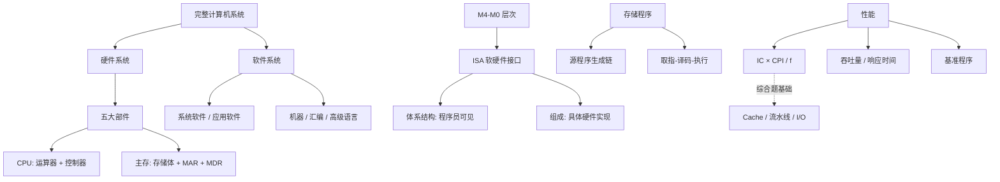

# 计算机组成原理 第1章 计算机系统概述

> 来源：`27王道《计算机组成原理》高清带书签.pdf`，第1章 计算机系统概述，PDF 页码 p13-p31。
> 复核：本轮重新读取教材 p13-p31 与 19 组课件/试卷共 281 页；识别 137 个低文本页，并对教材 19 页、期中/期末卷 38 页强制 OCR，实际 OCR 175 页。已直接查看全部 32 张页面联系图，重点核对硬件结构、寄存器与微操作、M0-M4 层次、程序生成链、性能公式和习题解析。

## 本章速览

- 本章主线：系统组成和层次结构讲“计算机是什么”，性能指标讲“计算机快不快怎样算”。
- 冯·诺依曼机核心是存储程序：指令和数据先放入主存，CPU 按 PC 自动取指、译码、执行。
- ISA 是软件和硬件之间的关键接口：规定程序员/编译器可见的机器属性，不规定具体电路怎样实现。
- 语言转换必背：机器语言可直接执行；汇编语言要汇编；高级语言要编译或解释。
- CPU 执行时间抓三要素：指令条数 `IC`、平均 `CPI`、主频 `f`，公式为 `CPU时间 = IC * CPI / f`。
- 性能题不要只看主频或 MIPS；要结合程序、指令集、CPI、I/O 时间和基准程序适用范围。

## 课件补充来源

- 基础课件：`1.0 你好，我是计算机组成原理`、`1.1 计算机发展历程`、`1.2.1+1.2.2 计算机硬件的基本组成`、`1.2.2（补充）各个硬件的工作原理`。
- 基础课件：`1.2.3 计算机软件`、`1.2.4 计算机系统的层次结构`、`1.2.5 计算机系统的工作原理`、`1.3 计算机的性能指标`。
- 阶段检测：计算机组成原理期中、期末试卷及答案解析；本章命中存储程序、语言转换、程序生成链、加权 CPI/MIPS、机器字长等题。
- 强化资料：五段式流水线总结、强化课考试及答案、P1-P5 大题课件；本章只吸收性能公式、动态指令数、I/O 时间占比和后续综合题入口，具体算法分别回链对应章节。

## 关联导航

- 本章内部：[[01-计算机系统概述#1.2.2 计算机硬件|硬件组成]] · [[01-计算机系统概述#1.2.4 计算机系统的层次结构|系统层次与 ISA]] · [[01-计算机系统概述#1.2.6 计算机系统的工作原理|程序执行]] · [[01-计算机系统概述#1.3 计算机的性能指标|性能计算]]
- 计组后续：[[02-数据的表示和运算#2.1 数制与编码|二进制表示]] · [[03-存储系统#3.1 存储器概述|存储层次]] · [[04-指令系统#4.1 指令系统|ISA 与指令]] · [[05-中央处理器#5.1 CPU 的功能和基本结构|CPU 结构]] · [[05-中央处理器#5.2 指令执行过程|指令执行过程]]
- 性能联动：[[05-中央处理器#5.6 指令流水线|流水线]] · [[06-总线#6.1 总线概述|总线]] · [[07-输入输出系统#7.1 I/O 系统基本概念|I/O 系统]] · [[408/408考研笔记/操作系统/01-计算机系统概述#1.3 操作系统的运行环境|操作系统运行环境]]

## 知识网络

## 知识点清单

### 1.1 计算机发展历程

#### 1.1.1 计算机硬件的发展

- 计算机四代变化：
  - 第一代：电子管，机器语言，延迟线/磁鼓，体积大、速度慢。
  - 第二代：晶体管，磁芯存储器，出现高级语言和编译程序，操作系统萌芽。
  - 第三代：中小规模集成电路，半导体存储器发展，高级语言普及，分时操作系统出现。
  - 第四代：大规模/超大规模集成电路，微处理器，流水线、Cache、虚拟存储、并行处理广泛应用。
- 摩尔定律：集成电路上可容纳晶体管数量随时间快速增长，常用来描述硬件性能提升背景。
- 半导体存储器：容量从 KB、MB 级发展到 GB、TB 级，是主存技术发展的重要线索。
- 微处理器字长：通常指 CPU 通用寄存器宽度，如 32 位、64 位；影响一次整数运算宽度和可表达范围。
- 统考侧重：本节带 `*`，偏背景理解，选择题主要考“字长含义”和四代关键元件。

#### 1.1.2 计算机软件的发展

- 计算机语言演进：机器语言、汇编语言、高级语言。
- 高级语言例子：FORTRAN、Pascal、C++、Java 等，推动软件开发效率提升。
- 系统软件发展：操作系统最典型，如 Windows、UNIX、Linux；系统软件支撑硬件管理和程序运行。

### 1.2 计算机系统层次结构

#### 1.2.1 计算机系统的组成

- 完整计算机系统 = 硬件系统 + 软件系统。
  - 硬件：有形物理装置和部件。
  - 软件：程序、相关数据和文档。
- 软件效率依赖硬件能力，硬件价值也要通过软件组织才能发挥。
- 软硬件功能边界可调整：
  - 使用频繁、硬件实现成本低、速度要求高的功能，适合硬件实现。
  - 变化快、需求灵活、成本敏感的功能，适合软件实现。

#### 1.2.2 计算机硬件

- 冯·诺依曼机基本思想：
  - 采用存储程序方式：程序和初始数据预先存入主存，启动后自动、连续取指执行。
  - 硬件由运算器、控制器、存储器、输入设备、输出设备五大部件组成。
  - 指令和数据在存储器中形式相同，仅凭二进制内容无法区分，靠执行阶段语义区分。
  - 指令和数据都用二进制编码。
  - 指令通常由操作码和地址码组成，操作码说明做什么，地址码指出操作数地址或相关信息。
- 冯·诺依曼机工作方式是控制流驱动：
  - 指令序列控制执行流程。
  - 数据按指令要求被取用和处理，不是数据主动驱动执行。
- 现代计算机硬件主要包括：
  - CPU、存储器、输入/输出控制器、外部设备、总线。
  - 早期冯·诺依曼结构以运算器为中心，现代结构以主存为中心并通过总线互连。
  - 主机 = CPU + 主存；硬件系统 = 主机 + 外部设备，不要把“主机”误当成完整计算机系统。
- CPU = 运算器 + 控制器，也可概括为数据通路 + 控制单元：
  - 运算器核心是 ALU；典型寄存器有 ACC（累加器）、MQ（乘商寄存器）、X（操作数寄存器）和通用寄存器。
  - 数据通路包括 ALU、寄存器组、多路选择器、内部互连等。
  - ALU 不只做算术运算，也做逻辑运算、移位等。
  - 控制器典型部件：PC 保存下一条指令地址；IR 保存当前指令；CU 译码并产生控制信号。
- 主存 = 存储体 + MAR + MDR：
  - 存储元是一个二进制位；存储单元是一组存储元；一个存储单元存放一个存储字，其位数称存储字长。
  - MAR 保存访问地址，若 MAR 为 `n` 位，最多可寻址 `2^n` 个存储单元。
  - MDR 暂存读出/写入的数据；基础模型中 MDR 位数通常等于存储字长。
  - 主存容量 = 存储单元数 × 存储字长 = `2^(MAR位数) × MDR位数` bit。
  - “按字节编址”时每个存储单元为 1 B，此时地址空间容量为 `2^(地址位数)` B。
- 存储层次：
  - 内存通常包括主存和 Cache；传统语境中的“内存”常指主存。
  - 主存存放正在执行的程序和数据。
  - 外存长期保存大量数据，如磁盘、固态硬盘等。
- 外部设备和设备控制器：
  - 外部设备负责实际 I/O 操作。
  - 设备控制器负责与主机通信并控制设备，如 USB 控制器、显卡、网卡、磁盘控制器。
- 总线与互连结构：
  - 总线是部件之间传输信息的公共通路。
  - 典型多总线系统包含处理器总线、存储器总线、I/O 总线及桥接器。
  - 总线、桥接器、接口、控制器共同承担数据传输和协调。

#### 1.2.3 计算机软件

- 系统软件：保障系统高效、正确运行并提供基础服务。
  - 典型例子：操作系统、数据库管理系统、语言处理程序、网络/分布式软件、标准库、服务程序。
- 应用软件：面向特定应用领域或用户问题的软件，如办公、工程设计、科学计算、数据统计。
- 软件和硬件的逻辑功能等价性：
  - 同一功能可以由软件实现，也可以由硬件实现。
  - 在相同规范下，二者可产生一致结果。
  - 硬件通常速度快、成本高、灵活性差；软件通常灵活、易修改、效率较低。
- 复习口径：不要把“软件能做”理解成“不需要硬件”，软件最终仍要由硬件执行。

#### 1.2.4 计算机系统的层次结构

- 教材/课件常用五级机器从上到下：
  - `M4` 高级语言机器：由编译程序支持。
  - `M3` 汇编语言机器：由汇编程序支持。
  - `M2` 操作系统机器：由操作系统软件支持。
  - `M1` 传统机器语言机器：执行机器指令，是 ISA 所描述的抽象机器。
  - `M0` 微程序机器：执行微指令；若采用硬布线控制，则可理解为由控制逻辑直接实现 M1。
- 下层是上层的基础，上层是下层功能的扩展；除 M1/M0 实体硬件外，高层多是通过软件形成的虚拟机。
- 更细的实现视角还可向下分为微体系结构、RTL/功能部件、电路与器件层；题目问五级机器时按 `M4 -> M0` 作答。
- 算法和编程：
  - 先把应用问题抽象为算法，再用编程语言写成程序。
  - 编程语言语法严格、无二义性，用来精确描述执行过程。
- 编程语言：
  - 机器语言：二进制机器指令，硬件唯一能直接识别和执行。
  - 汇编语言：用助记符表示机器指令，必须经汇编程序翻译后执行。
  - 高级语言：更接近自然语言和问题描述，通常需要编译或解释。
- 翻译程序：
  - 汇编程序：汇编语言源程序 -> 机器语言目标程序。
  - 编译程序：高级语言源程序一次性翻译为目标程序，目标可为汇编语言或机器语言。
  - 解释程序：逐句翻译并立即执行，通常不生成独立可保存的目标程序。
- 操作系统：
  - 为语言处理程序和应用程序提供运行环境。
  - 通过抽象硬件和管理资源，构建程序员可使用的虚拟机。
- ISA：
  - 位于软件和硬件交界处，是软硬件之间的关键接口。
  - 从程序员和编译器视角定义软件可直接使用的硬件功能。
  - 包括指令格式、操作类型、寻址方式、寄存器、可访问资源等。
  - 还包括机器可见的数据类型和 I/O 机制等体系结构属性。
  - ISA 说明“能做什么”，不说明“具体电路怎样实现”。
  - 同一 ISA 可由不同微体系结构实现，软件通常无需修改即可兼容。
  - 不能说 ISA “仅定义指令功能”，因为它还涉及数据类型、寄存器、寻址等软件可见属性。
- 微体系结构：
  - 是处理器内部组织方式，用来实现 ISA 定义的功能。
  - 包括数据通路组织、控制单元、流水线、Cache 层次、分支预测等。
  - 同一 ISA 下，微体系结构不同会导致性能、功耗、成本不同。

#### 1.2.5 计算机系统的不同用户

- 四类用户：
  - 最终用户：直接使用应用程序完成任务。
  - 系统管理员：安装、配置、维护系统，管理账户、备份、升级等。
  - 应用程序员：用高级语言开发应用软件。
  - 系统程序员：开发操作系统、编译器、数据库等系统软件。
- 图示层次对应：
  - 最终用户主要面对应用程序。
  - 应用程序员工作在高级语言/应用层。
  - 系统管理员更多面对操作系统层。
  - 系统程序员直接面向 ISA、编译程序、汇编程序、操作系统等底层。
- 透明性：
  - 对某类用户“透明”表示该用户感知不到、无需关心，不是“看得见”。
  - ISA 以下硬件实现细节对高级语言程序员通常透明。
  - 指令寄存器 IR、存储器地址寄存器 MAR、存储器数据寄存器 MDR 对所有程序员透明。

#### 1.2.6 计算机系统的工作原理

- 存储程序工作方式：
  - 程序执行前，指令和数据预先装入主存。
  - 第一条指令地址送入程序计数器 PC。
  - CPU 使用 PC 内容作为地址访问主存取指。
  - 每条指令一般经历：取指 -> 译码 -> 取操作数 -> 执行 -> 写回结果/更新 PC。
  - 顺序指令：PC 更新为下一条指令地址。
  - 跳转指令：PC 更新为指令指定的目标地址。
- 典型取指微操作骨架：
  - `(PC) -> MAR`：送出指令地址。
  - `M(MAR) -> MDR -> IR`：从主存取出指令并送入 IR。
  - `(PC) + 指令长度 -> PC`：形成下一条顺序指令地址；仅在定长、按指令字编址的简化模型中常写成 `PC+1`。
  - `OP(IR) -> CU`：操作码送控制单元译码；需要直接地址操作数时，再由 `Ad(IR) -> MAR` 发起访存。
  - 同一存储单元中的二进制串，在取指周期被解释为指令，在取数/存数阶段被解释为数据。
- 取数、运算、存数常用微操作入口：
  - 取数类：`Ad(IR)->MAR`，`M(MAR)->MDR`，再送入 `ACC/MQ/X` 等目标寄存器。
  - 运算类：操作数进入运算器，ALU 输出结果通常暂存到 `ACC` 或目标寄存器。
  - 存数类：`Ad(IR)->MAR`，`(ACC)->MDR`，`MDR` 写入 `M(MAR)`；不要把结果直接“写入地址码”。
- 从源程序到可执行文件：
  - `hello.c` 源程序。
  - 预处理 `cpp`：处理头文件、宏等，生成 `hello.i`。
  - 编译 `cc1`：生成汇编语言源程序 `hello.s`。
  - 汇编 `as`：生成可重定位目标文件 `hello.o`。
  - 链接 `ld`：把目标文件与库函数等链接，解析外部符号，生成可执行文件 `hello`。
  - 判题口径：若题目从“C 源文件编辑完成”开始且选项不列预处理，通常选“编译 -> 汇编 -> 链接”；汇编语言即使与机器指令基本一一对应，也仍须汇编。
- 指令执行抽象模型：
  - 可执行文件代码段由机器指令组成。
  - 每条机器指令是一串二进制编码，指示 CPU 完成一个基本操作。
  - 本章只要求掌握“取指-译码-执行”抽象循环；控制器、数据通路和时序细节在 CPU 章展开。

#### 1.2.7 本节习题精选

- 本节习题主要反查：
  - 完整系统 = 硬件 + 软件。
  - 冯·诺依曼机 = 存储程序 + 控制流驱动 + 按地址取指。
  - CPU、主存各寄存器的功能与取指数据流。
  - MAR/MDR 位数与主存容量的关系。
  - ALU 也做逻辑运算。
  - 层次结构的自上而下顺序。
  - ISA 与微体系结构的区别。
  - 编译、解释、汇编的区别。
  - 机器语言才可被硬件直接执行。
  - 源程序到可执行文件四阶段。

#### 1.2.8 答案与解析

- 解析中的高频判题规则：
  - “程序直接从磁盘读到 CPU 执行”错误，程序要先进入主存。
  - 指令和数据形式上都是二进制，但执行时意义不同。
  - “数据都在指令中直接给出”错误，数据常由地址码指出位置。
  - “数据用十六进制存储、指令用二进制存储”错误；十六进制只是二进制的书写方式。
  - 汇编语言与机器结构相关，不同机器的汇编语言通常不能直接移植。
  - 高级语言语句和机器指令不是一一对应；汇编语言与机器指令通常基本一一对应。

### 1.3 计算机的性能指标

#### 1.3.1 计算机的主要性能指标

- 吞吐量：
  - 单位时间内系统处理请求或完成任务的数量。
  - 受 CPU、主存、I/O、软件调度等多因素影响。
  - 教材简化模型常把主存存取周期视为重要瓶颈；具体题仍以题设给出的 CPU、存储和 I/O 条件为准。
- 响应时间：
  - 从用户发出请求到系统返回结果的总时间。
  - 通常包括 CPU 时间、等待 I/O、访存、磁盘访问等时间。
- 数据通路带宽：
  - 反映数据总线/数据通路单位时间可传送的数据量。
  - 常按“一次并行传送位数 × 每秒传送次数”理解；题目给总线位宽和频率时先统一 bit/Byte。
- CPU 时钟周期：
  - CPU 工作的最小时间单位。
  - `时钟周期 = 1 / 主频`。
  - 时钟周期不能短于关键组合逻辑路径延迟；流水线中通常受最慢流水段约束。
- 主频：
  - CPU 内部主时钟频率，即每秒时钟周期数。
  - 主频越高，单个时钟周期越短，但整机性能不一定更高。
- CPI：
  - 执行一条指令平均需要的 CPU 时钟周期数。
  - 不同指令 CPI 可不同；同类甚至同一条指令也可能因 Cache 命中等运行条件而变化，程序平均 CPI 要按实际统计加权。
  - `平均CPI = Σ(CPI_i * 指令比例_i)`。
  - 也可先求总周期：`总时钟周期数 = Σ(IC_i * CPI_i)`，再用 `平均CPI = 总周期 / 总指令数`。
  - CPI 受系统结构、指令集、计算机组成影响；时钟频率不影响 CPI 的定义。
- IPS：
  - 每秒执行指令条数。
  - `IPS = 主频 / 平均CPI`。
- CPU 执行时间：
  - `CPU时间 = CPU时钟周期数 / 主频`。
  - `CPU时间 = 指令条数 * CPI * 时钟周期`。
  - `CPU时间 = 指令条数 * CPI / 主频`。
  - 三个核心变量：`IC`、`CPI`、`f`。
  - CISC 可能减少指令条数但提高 CPI 或拉长时钟周期；RISC 可能增加指令条数但利于提高主频。
- MIPS：
  - 每秒执行多少百万条指令。
  - `MIPS = 指令条数 / (CPU时间 * 10^6)`。
  - `MIPS = 主频 / (CPI * 10^6)`。
  - 若主频单位为 MHz，则 `MIPS = 主频(MHz) / CPI`。
  - 缺陷：不同 ISA 指令功能强度不同，不能可靠跨机器比较。
- FLOPS：
  - 每秒浮点运算次数。
  - `MFLOPS=10^6`，`GFLOPS=10^9`，`TFLOPS=10^12`，`PFLOPS=10^15`，`EFLOPS=10^18`，`ZFLOPS=10^21`。
  - 适合衡量科学计算/浮点运算能力，不适合评价所有应用。
- K/M/G/T 单位习惯：
  - 描述存储容量、文件大小时，常基于 2 的幂，如 `1KB = 2^10B`。
  - 描述速率、频率时，常基于 10 的幂，如 `1kb/s = 10^3b/s`。
  - 大写 `B` 是 Byte，小写 `b` 是 bit；网络速率、总线速率题尤其要先除以 8。
  - 具体含义要结合上下文判断。
- 字长：
  - 机器字长：CPU 一次能处理的二进制位数，通常与通用寄存器、ALU 宽度相关。
  - 指令字长：一条指令所含二进制代码的位数，可定长或变长。
  - 存储字长：一个存储单元存放的二进制位数。
  - 三者不必相等；若一条指令跨多个存储单元，取指需要多次存储器读操作。
  - 机器字长越长，数据表示范围和运算精度通常越高，但不直接决定主存容量或实际速度。
- IPC：
  - 每个时钟周期执行的指令条数。
  - 可粗略看作 CPI 的倒数。
- 基准程序：
  - 用典型程序模拟真实负载并实际运行，以比较性能。
  - 比单一主频/MIPS 更接近真实应用。
  - 局限：只代表某类负载，编译器或硬件可能针对基准程序优化。

#### 1.3.2 本节习题精选

- 选择题常考：
  - 主频、CPI、MIPS、MFLOPS 的定义辨析。
  - 科学计算更适合看 MFLOPS。
  - 平均 CPI 加权计算。
  - MIPS 和 CPU 执行时间可能给出不同排序，要分别计算。
  - 字长主要影响运算精度。
  - CPU 加速只影响 CPU 时间，不影响 I/O 时间。
  - 指令条数减少但 CPI 增大时，要用公式重算执行时间。
- 综合题常考：
  - 主频和时钟周期换算。
  - 已知 MIPS 求平均指令周期或 CPI。
  - 改变指令系统后重新统计指令数和指令比例。

#### 1.3.3 答案与解析

- 解析中的高频判题规则：
  - 相同高级语言程序在不同机器上编译后，机器指令条数可能不同，不能仅凭 CPI 或主频判断速度。
  - 机器速度与基准程序运行时间成反比。
  - CPU 速度提高 50%，CPU 时间变为原来的 `1/1.5`，不是减少 50%。
  - 总响应时间 = 加速后的 CPU 时间 + 未加速的 I/O 时间。
  - 平均 CPI 是数学期望，按指令比例加权，不是简单平均。
  - 改进指令集可能改变指令总数和比例，不能直接套原比例。

### 1.4 本章小结

- 主频高不一定性能高：
  - 主频只表示时钟节奏快慢。
  - 实际性能还受微架构、流水线、Cache、指令集效率、位宽、并行能力、具体程序影响。
  - 主频较低但 IPC 更高的 CPU 可能更快。
- 翻译程序关系：
  - 翻译程序是总称，包括编译程序、解释程序、汇编程序。
  - 编译程序：高级语言 -> 低级语言目标程序。
  - 解释程序：逐句翻译并立即执行。
  - 汇编程序：汇编语言 -> 机器语言。
- 语言执行能力：
  - 机器语言可被 CPU 直接执行。
  - 汇编语言要先汇编。
  - 高级语言要编译或解释。

### 1.5 常见问题和易混淆知识点

- 翻译程序、解释程序、汇编程序、编译程序：
  - 翻译程序是将一种语言转换为另一种语言的程序。
  - 编译程序一次性翻译高级语言源程序，通常生成目标程序。
  - 解释程序边翻译边执行，通常不生成独立目标程序。
  - 汇编程序是特殊翻译程序，把汇编语言翻译成机器语言。
- 透明性：
  - 透明表示某类用户感知不到该属性，不表示“可见”。
  - 指令格式、机器结构、数据格式对高级语言程序员透明。
  - IR、MAR、MDR 等寄存器对所有程序员透明。
- 计算机体系结构 vs 计算机组成：
  - 体系结构：程序员可见的机器属性，如指令集、数据类型、寻址方式。
  - 组成：体系结构的具体硬件实现，如如何取指、译码、执行，采用什么电路。
  - 例：是否提供乘法指令属于体系结构；用阵列乘法器还是移位相加实现乘法属于组成。
  - 两台机器可有相同体系结构，但组成方式不同，性能和成本不同。
- 基准程序：
  - 基准程序快通常说明该负载下性能好。
  - 不能推出所有程序都快，因为不同程序对计算、访存、I/O 的需求不同。

## 课件补充/强化题规则

1. **结构图题**：先认中心。早期结构以运算器为中心，现代结构以主存为中心；`CPU=运算器+控制器`，`主机=CPU+主存`，完整系统还必须有软件。
2. **主存容量题**：先确定编址单位，再算存储单元数。简化模型下 `MAR=n位`、`MDR=m位`，容量为 `2^n × m bit`；若明确按字节编址，则容量为 `2^n B`。
3. **寄存器功能题**：`PC` 跟踪下一条指令地址，`IR` 保存当前指令，`MAR` 保存访存地址，`MDR` 暂存访存数据；这些内部寄存器对程序员透明。
4. **取指通路题**：固定抓 `(PC)->MAR`、`M(MAR)->MDR->IR`、更新 PC、`OP(IR)->CU`。不要把 PC 内容直接说成“当前指令”，它保存的是地址。
5. **语言与生成链题**：只有机器语言能直接执行；汇编语言仍要汇编。完整链为“预处理 -> 编译 -> 汇编 -> 链接”，题目省略预处理时按其选项口径回答。
6. **体系结构判断题**：程序员可见且影响机器代码的属性归 ISA/体系结构；内部数据通路、控制方式、Cache 和流水线归组成/微体系结构。
7. **性能计算题**：列各类 `IC_i × CPI_i` 求总周期，再除主频求时间，最后按需算平均 CPI 或 MIPS。期中卷示例为 10 万条指令、17 万周期、400 MHz，故 `425 μs`、约 `235 MIPS`。
8. **优化比较题**：以执行时间为准，不以主频、CPI 或 MIPS 单项下结论；改指令系统要重算指令总数和比例，只加速 CPU 时非 CPU/I/O 时间保持不变。
9. **跨章综合题**：Cache、流水线和 I/O 题最终都可能归结为“事件次数 × 每次周期 / 主频”；先在对应章节求事件次数，再回到本章性能公式汇总。
10. **加速比/占比题**：若原总时间中比例 `p` 的部分加速 `s` 倍，则新时间比例为 `(1-p)+p/s`，总加速比为 `1/((1-p)+p/s)`；若题目只说 CPU 提速，I/O 和等待时间不变。
11. **动态指令数题**：MIPS/CPU 时间用运行时实际执行的指令条数，不是汇编代码静态行数，也不是 C 语句数；循环、递归和分支要按执行次数展开。
12. **单位换算题**：先分清 `b/B`、`Hz/MHz/GHz`、`s/ms/us/ns`；存储容量多用 2 的幂，频率和传输率多用 10 的幂。

## 易错点/易混点

- 完整计算机系统不是“主机 + 外设”，也不是“主机 + 应用程序”，而是硬件系统 + 软件系统。
- 主机通常指 CPU + 主存，不包含全部外设，更不包含软件。
- 冯·诺依曼机是控制流驱动，不是数据流驱动，也不是微程序控制方式。
- 冯·诺依曼机最根本特征是存储程序；控制流驱动、按地址访问等是由此派生的工作特征。
- 程序不能直接从磁盘到 CPU 执行；必须先装入主存。
- 指令和数据在存储器中形式相同，但计算机根据执行阶段和访问方式区分其语义。
- “指令按地址访问，数据都在指令中直接给出”错误，数据常由地址码间接指出位置。
- ALU 不仅完成算术运算，也完成逻辑运算。
- `PC/IR` 属于 CPU，`MAR/MDR` 位于 CPU 与主存接口处；教材简化图中可画在主存一侧，判功能比判物理归属更重要。
- 汇编语言不能被硬件直接执行，只有机器语言可以。
- 汇编语言使用助记符，不是“二进制形式的汇编代码”；编译器常输出汇编文本，再由汇编器生成机器码。
- 高级语言语句和机器指令不是一一对应；汇编指令和机器指令通常基本一一对应。
- 编译程序运行速度通常快于解释执行，但编译阶段耗时更长；解释程序不是“方法简单所以运行快”。
- ISA 不等于微体系结构；流水线、Cache 层次、分支预测属于微体系结构。
- ISA 不只是“指令功能”，还包括指令格式、寻址、寄存器等软件可见属性。
- 五级机器顺序不能倒：高级语言 M4、汇编 M3、操作系统 M2、传统机器 M1、微程序 M0。
- “透明”不是可见，而是对某类用户不可见、无需关心。
- 主频高不一定快；执行时间取决于 `IC`、`CPI`、`f`。
- CPI 与时钟频率没有直接函数关系；时钟频率影响执行时间，不改变 CPI 定义。
- 平均 CPI 必须按指令比例加权。
- MIPS 不能严格比较不同 ISA 机器，也不能衡量浮点能力。
- MFLOPS 更适合科学计算，但也只反映浮点负载。
- CPU 提速只缩短 CPU 时间；I/O、磁盘等待等非 CPU 时间不变。
- 速度提高 50% 意味着时间除以 `1.5`，不是时间减半。
- MIPS 算的是“每秒百万条机器指令”，循环和递归题必须数动态执行次数；不同 ISA 的一条指令工作量可能差异很大。
- 数据通路带宽、主频、MIPS、FLOPS分别衡量不同对象，不能互相替代。
- 机器字长主要影响数据表示范围和运算精度，不直接决定存取速度或主存容量。
- 机器字长、指令字长、存储字长不是同一概念，也不要求相等。
- 基准程序只代表特定负载，不能代表系统所有场景。

## 注解

- 记忆 ISA：软件能看到的硬件说明书；编译器按它生成机器指令，硬件按它实现语义。
- 记忆编译链：`源程序 -> 预处理 -> 编译 -> 汇编 -> 链接 -> 可执行文件`。
- 主存图题先标四个量：`MAR位数 -> 单元数`，`MDR位数 -> 每单元位数`，两者相乘得总容量；再检查题目是否另行规定按字节编址。
- 微操作题不要背成一条长句：地址先到 MAR，主存内容经 MDR 进入 IR/寄存器，最后由 CU 解释操作码。
- 性能题模板：
  - 先求平均 `CPI`。
  - 再求总时钟周期数 `IC * CPI`。
  - 再求 `CPU时间 = IC * CPI / f`。
  - 需要 MIPS 时用 `f / (CPI * 10^6)`。
- 占比题模板：
  - 先把“事件次数 × 每次开销”统一成秒或周期。
  - 再除以总执行时间，得到 CPU 时间占比或 I/O 时间占比。
  - 若总时间未知但问相对变化，先按原总时间设为 1。
- 比较速度时：
  - 速度与运行时间成反比。
  - 若问“快多少倍”，用 `旧时间 / 新时间`。
  - 若只加速 CPU，则 `总时间 = CPU时间/加速倍数 + 非CPU时间`。
- 指令系统改造题：
  - 不要沿用原比例。
  - 先设原指令数为 `M`。
  - 分析新增指令替代了哪些原指令。
  - 重新计算新总指令数、各类比例、平均 CPI。
- 看见“同一 ISA”：
  - 若运行同一机器码程序，指令条数通常相同，可比较 `CPI/f`。
  - 若只是同一高级语言程序，编译后指令条数可能不同，不能直接判断。

## 速背检查

| 问题 | 快速答案 |
| --- | --- |
| 完整计算机系统包括什么？ | 硬件系统和软件系统。 |
| 冯·诺依曼机核心思想？ | 存储程序，按地址取指并自动执行。 |
| 冯·诺依曼机工作方式？ | 控制流驱动方式。 |
| 硬件五大部件？ | 运算器、控制器、存储器、输入设备、输出设备。 |
| 主机通常包括什么？ | CPU 和主存。 |
| CPU 基本组成？ | 数据通路和控制单元。 |
| ALU 只做算术吗？ | 否，也做逻辑、移位等操作。 |
| PC、IR、MAR、MDR 各存什么？ | 下一指令地址、当前指令、访存地址、访存数据。 |
| MAR 为 n 位、MDR 为 m 位时主存容量？ | 简化模型下为 `2^n × m bit`。 |
| 存数指令的典型数据流？ | 地址码送 MAR，ACC 等结果先入 MDR，再写入 `M(MAR)`。 |
| 哪种语言能被硬件直接执行？ | 机器语言。 |
| 汇编程序做什么？ | 汇编语言源程序翻译成机器语言程序。 |
| 编译程序做什么？ | 高级语言源程序一次性翻译成目标程序。 |
| 解释程序特点？ | 逐句翻译并立即执行，通常不生成独立目标程序。 |
| 源程序到可执行文件四阶段？ | 预处理、编译、汇编、链接。 |
| ISA 的地位？ | 软硬件之间的抽象接口。 |
| ISA 和微体系结构区别？ | ISA 规定做什么，微体系结构规定怎么实现。 |
| M4 到 M0 的顺序？ | 高级语言、汇编语言、操作系统、传统机器、微程序机器。 |
| 透明性是什么意思？ | 对某类用户不可见、无需关心。 |
| 体系结构和组成区别？ | 体系结构是程序员可见属性，组成是具体实现。 |
| CPU 时钟周期与主频关系？ | 时钟周期 = 1 / 主频。 |
| 数据通路带宽怎么抓？ | 一次并行传送位数 × 每秒传送次数，先统一 b/B。 |
| 平均 CPI 怎么算？ | 各类指令 CPI 按指令比例加权。 |
| CPU 执行时间公式？ | `CPU时间 = IC * CPI / f`。 |
| IPS 公式？ | `IPS = 主频 / 平均CPI`。 |
| MIPS 公式？ | `MIPS = 主频 / (CPI * 10^6)`。 |
| IPC 与 CPI 关系？ | IPC 约为 CPI 的倒数。 |
| 主频高一定更快吗？ | 不一定，还看 IC、CPI、微架构和具体程序。 |
| CPU 提速 50% 怎么算时间？ | CPU 时间除以 1.5，非 CPU 时间不变。 |
| 加速比通用公式？ | `S = 1 / ((1-p)+p/s)`。 |
| MIPS 题的指令条数看什么？ | 看运行时动态执行的机器指令数。 |
| MIPS 主要缺陷？ | 不适合跨 ISA 严格比较。 |
| MFLOPS 衡量什么？ | 浮点运算速度。 |
| 字长主要影响什么？ | 数据表示范围和运算精度。 |
| 三种常见字长？ | 机器字长、指令字长、存储字长，三者不必相等。 |
| 基准程序越快能推出什么？ | 只能说明该类负载下较快，不能代表所有程序。 |
