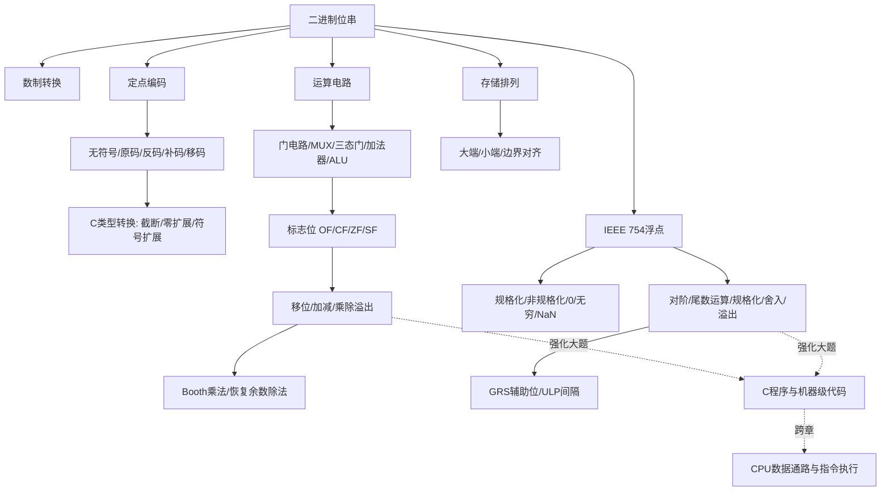

# 计算机组成原理 第2章 数据的表示和运算

> 来源：`27王道《计算机组成原理》高清带书签.pdf`，第2章 数据的表示和运算，PDF 页码 p32-p88。
> 复核：本轮重新读取教材 p32-p88、基础考点讲解第2章 22 份 PDF、期中/期末试卷与解析、组成原理强化 P2 大题总结及强化考试试题/答案，共 28 组 384 页；教材 57 页强制 OCR，另对 107 个低文本页补做 OCR，共直接查看 43 张页面联系图，重点核对公式、运算电路、逐拍流程、习题解析和真题评分点。

## 本章速览

- 本章主线：同一串二进制位，按无符号数、补码整数、IEEE 754 浮点数、字节序解释，含义会完全不同。
- 整数题抓四件事：编码范围、补码加减、`OF/CF/ZF/SF` 标志位、C 语言类型转换。
- 浮点题抓四件事：IEEE 754 字段、规格化/非规格化/特殊值、对阶舍入、C 中 float/double 精度损失。
- 运算电路题抓“同一硬件、不同语义”：ALU 不知道有符号还是无符号，解释由指令和标志位决定。
- 存储题抓“地址顺序”：大端/小端决定多字节数据的字节排列，边界对齐决定成员起始地址和填充。
- 做题顺序建议：先画位模式，再确定字长和类型，最后套范围/标志/舍入/字节序规则。
- 强化题常把本章和 CPU 数据通路、C 语言程序、数组循环、机器级代码混合考，入口仍是“位模式如何解释”。

## 课件补充来源

- 基础考点讲解 2.1：`2.1.1 进位计数制.pdf`；`2.1.2+2.1.3 定点数的编码表示.pdf`；`2.1.2+2.1.3（拓展）各种码的作用.pdf`；`2.1.4_1  C语言中的整数类型及类型转换.pdf`；`2.1.4_2 零扩展、符号扩展.pdf`。
- 基础考点讲解 2.2：`2.2.0_1  逻辑门电路（数字电路基础补充）.pdf`；`2.2.0_2 多路选择器、三态门（数字电路基础补充）.pdf`；`2.2.1_1 加法器.pdf`；`2.2.1_3  算数逻辑单元ALU.pdf`；`2.2.2 定点数的移位运算.pdf`；`2.2.3_1 定点数的加减运算.pdf`；`2.2.3_2 无符号数的加减运算.pdf`；`2.2.3_3 补码加减运算电路.pdf`；`2.2.4_0 乘法除法运算复习说明（书课适配说明）.pdf`；`2.2.4_1 无符号整数的乘法运算原理.pdf`；`2.2.4_2 带符号整数的乘法运算原理.pdf`；`2.2.4_3 计算机实现乘法运算的三种方式.pdf`；`2.2.4_4 无符号整数的除法运算原理.pdf`。
- 基础考点讲解 2.3：`2.3.1_1 浮点数的表示_IEEE 754.pdf`；`2.3.1_2 浮点数的表示_IEEE 754（例题训练）.pdf`；`2.3.1_3+4 浮点数的表示范围、几种特殊状态.pdf`；`2.3.4 数据的存储和排列.pdf`。
- 阶段卷：`计算机组成原理期中试卷及答案解析（学员版）.pdf`；`计算机组成原理期末试卷及答案解析（学员版）.pdf`。
- 强化资料：`计组P2_数据的表示和运算大题总结.pdf`；`计组强化课考试_试题.pdf`；`计组强化课考试_试题+答案.pdf`。
- 读取方式：可抽文字页用 PyMuPDF 抽取；文字少、公式/图表/手稿密集页渲染为图片后 OCR，并直接看图复核 ALU 图、IEEE 754 特殊值图、强化大题页和答案解析页。

## 关联导航

- 本章内部：[[02-数据的表示和运算#2.1 数制与编码|数制与编码]]、[[02-数据的表示和运算#2.2 运算方法和运算电路|运算方法和电路]]、[[02-数据的表示和运算#2.3 浮点数的表示与运算|浮点表示与运算]]、[[02-数据的表示和运算#2.3.4 数据的宽度和存储|数据宽度与存储排列]]。
- 同科联动：[[01-计算机系统概述#1.3 计算机的性能指标|性能指标]]、[[03-存储系统#3.5 高速缓冲存储器 Cache|Cache]]、[[05-中央处理器#5.3 数据通路的功能和基本结构|CPU 数据通路]]、[[05-中央处理器#5.5 异常和中断机制|异常和中断]]。
- 跨科联动：[[408/408考研笔记/操作系统/03-内存管理#3.2 虚拟内存管理|虚拟内存]]、[[408/408考研笔记/数据结构/04-串#4.2 串的模式匹配|位串与模式匹配]]。

## 知识网络

## 知识点清单

### 2.1 数制与编码

#### 2.1.1 进位计数制及其相互转换

- 计算机采用二进制的原因：
  - 两种稳定物理状态易实现，成本低。
  - `0/1` 与逻辑假/真天然对应，便于逻辑运算。
  - 二进制运算规则简单，容易用逻辑门和 ALU 实现。
- r 进制数：
  - 基数为 `r`，第 `i` 位权为 `r^i`。
  - 数值等于各位数码与位权乘积之和。
  - 常见后缀：`B` 二进制，`O` 八进制，`D` 十进制，`H` 十六进制；十六进制也常写 `0x...`。
- 二进制与八/十六进制转换：
  - 八进制：3 位二进制一组。
  - 十六进制：4 位二进制一组。
  - 整数部分从小数点向左分组，不足高位补 0；小数部分向右分组，不足低位补 0。
- 任意进制转十进制：按权展开求和。
- 十进制转 r 进制：
  - 整数部分：除基取余，余数逆序。
  - 小数部分：乘基取整，整数顺序。
- 十进制小数能否有限二进制表示：
  - 能写成 `k/2^n` 时可以有限精确表示。
  - `0.5` 可精确，`0.1`、`0.3` 通常不能有限二进制精确表示。
  - 有限二进制小数一定能精确转十进制。
- BCD 码：
  - 用 4 位二进制编码 1 位十进制数。
  - BCD 只是“按十进制语义解释的二进制编码”，不是计算机内部所有数据的默认表示。

#### 2.1.2 定点数的编码表示

- 真值和机器数：
  - 真值：带正负号的实际数值。
  - 机器数：将符号和数值一起编码后的位串，通常最高位 `0` 表示正，`1` 表示负。
- 定点数：
  - 定点小数：小数点约定在符号位之后、数值最高位之前。
  - 定点整数：小数点约定在数值最低位之后。
  - 机器内部没有真实小数点，小数点位置由表示约定决定。
  - `n+1` 位机器数含 1 位符号位、n 位数值位；原码/反码小数范围为 `-(1-2^-n) ~ 1-2^-n`，补码小数范围为 `-1 ~ 1-2^-n`。
  - 移码用于定点整数/浮点阶码，不用于表示定点小数。
- 原码：
  - 最高位为符号位，其余位表示绝对值。
  - `n+1` 位原码整数范围：`-(2^n-1) ~ 2^n-1`。
  - 有 `+0` 和 `-0` 两种零。
  - 优点：直观，乘除实现较方便；缺点：零不唯一，加减复杂。
- 补码：
  - 正数补码同原码。
  - 负数补码 = 绝对值按位取反加 1；或按模意义表示。
  - `n+1` 位补码整数范围：`-2^n ~ 2^n-1`。
  - 0 唯一，比原码多表示一个最小负数。
  - 特殊值：
    - `+0/-0`：全 0。
    - `-1`：全 1。
    - 最大正数：`0,11...1`。
    - 最小负数：`1,00...0`。
  - 补码优势：符号位参与运算，加减可统一为加法，硬件简单。
- 变形补码：
  - 又称双符号位补码，用两个符号位辅助判断溢出。
  - `00` 正无溢出，`01` 正溢出，`10` 负溢出，`11` 负无溢出。
  - 左符是真正符号位，右符用于溢出判断。
- 反码：
  - 正数同原码。
  - 负数由原码数值位取反得到，不加 1。
  - 也有 `+0/-0`，范围同原码，现代机器很少直接使用。
- 移码：
  - 主要用于浮点阶码。
  - 一般移码思想：`[x]_移 = bias + x`。
  - 若 `n+1` 位偏置取 `2^n`，范围为 `-2^n ~ 2^n-1`。
  - 与补码在相同字长下通常只有最高位相反。
  - 移码值越大，真值越大，便于阶码比较。
- 课件补充：各种码的“用途”常考选择题。
  - 原码直观，适合说明符号和绝对值，但加减硬件复杂。
  - 反码主要是补码转换的中间理解工具，现代整数运算很少直接用。
  - 补码把减法转化为加法，符号位参与运算，是统一加减电路的关键。
  - 移码让有符号阶码按无符号大小比较即可判断阶码大小。
- 四种编码对比：
  - 正数：原码、反码、补码相同，移码不同。
  - 原码/反码关于原点对称，有正零和负零。
  - 补码/移码不对称，0 唯一，多表示一个最小负数。
  - 负数补码和反码不能像原码那样直接按绝对值读大小；同为负数时，补码数值部分越大，真值也越大。

#### 2.1.3 整数的表示

- 无符号整数：
  - 所有位都表示数值，没有符号位。
  - n 位范围：`0 ~ 2^n-1`。
  - 常用于地址、指针、非负计数等。
- 有符号整数：
  - 现代计算机通常采用补码表示。
  - n 位补码范围：`-2^(n-1) ~ 2^(n-1)-1`。
  - 例：8 位补码范围 `-128 ~ 127`；8 位无符号范围 `0 ~ 255`。
- 记忆：相同字长下，无符号数非负范围更大；有符号补码负数个数比非负数多 1。

#### 2.1.4 C 语言中的整数类型及类型转换

- 常见整数类型宽度：
  - 408 题目常默认 `char=8b、short=16b、int=32b`；`long` 的宽度依平台/数据模型而定，必须以题设为准。
  - `signed char`、`unsigned char` 符号性明确；单独写 `char` 时有符号性由实现决定。
  - C 只保证 `sizeof(char)=1B`，不能把常见宽度当成跨平台定律。
- 常见范围记忆：
  - 16 位 `short`：`-32768 ~ 32767`。
  - 16 位 `unsigned short`：`0 ~ 65535`。
  - 32 位 `int`：`-2147483648 ~ 2147483647`。
  - 32 位 `unsigned int`：`0 ~ 4294967295`。
- 整型转换核心：位模式和解释规则分开看。
- 长类型转短类型：位截断。
  - 保留低位，丢弃高位。
  - 可能导致数值改变，但不是硬件“算错”，是截断后的位模式按目标类型重新解释。
- 相同字长 signed/unsigned 互转：位模式不变。
  - 只改变解释规则。
  - 例：16 位 `1111...1111` 按 `short` 是 `-1`，按 `unsigned short` 是 `65535`。
- 短类型转长类型：位扩展。
  - 源类型无符号：零扩展，高位补 0。
  - 源类型有符号补码：符号扩展，高位重复符号位。
  - 转换链中每一步的源类型会影响扩展方式。
  - 强化题口诀：短变长先按源类型扩展，再按目标类型解释；长变短先截断保留低位，再按目标类型解释。
- 运算前扩展：
  - `char/short` 参与算术运算前常先提升为 `int`。
  - ALU 数据通路宽度固定，短数据进入 ALU 前需要先扩展。
  - 判断扩展方式看“源操作数当时的类型”，不是看最后赋给谁。
  - 机器指令中的立即数由操作码语义决定零扩展还是符号扩展，不能只看目的寄存器。
- signed 与 unsigned 混合运算：
  - 常把 signed 转为 unsigned 后比较或运算。
  - 负数转换为 unsigned 往往变成很大的正数，是选择题常见陷阱。
  - 表达式先按操作数类型计算，再赋给目标变量；目标变量更宽不能挽回已发生的中间溢出，需在运算前强制提升。

#### 2.1.5 本节习题精选

- 本节习题主要反查：
  - 十进制小数是否能有限二进制表示。
  - 原码/反码/补码/移码的范围、零的个数、最大/最小值。
  - 固定位数下无符号数和补码有符号数的解释差异。
  - C 类型转换中的截断、符号扩展、零扩展和重解释。

#### 2.1.6 答案与解析

- 高频判题规则：
  - 任意十进制整数都能用二进制表示；十进制小数不一定能用有限二进制表示。
  - 8 位原码能表示 `2^8 - 1 = 255` 个不同数值，因为有两个 0。
  - 负数补码若要绝对值最大，符号位为 1 后，剩余的 1 尽量放低位。
  - 等长 `signed -> unsigned` 不改位，负数会按无符号正数解释。

### 2.2 运算方法和运算电路

#### 2.2.1 基本运算部件

- 运算器组成：ALU、移位器、状态寄存器 PSW、通用寄存器组等。
- ALU：
  - 可执行加、减、与、或、非、异或、移位等。
  - 加法器是 ALU 核心部件。
  - 乘除通常由 ALU 配合移位、寄存器、控制逻辑迭代完成，或用专门乘除电路完成。
- 基本逻辑电路：
  - 与、或、非、异或、与非、或非等门电路用于实现逻辑运算。
  - 异或用于“不同为 1”，同或用于“相同为 1”；异或常出现在加法器和溢出判断中。
  - 与非门、或非门都可单独构成任意逻辑函数，称为通用门。
  - 德摩根律：`~(A&B)=~A|~B`，`~(A|B)=~A&~B`，常用于门电路等价变换。
- 多路选择器 MUX：
  - 从多个输入中选一路输出，`k` 路输入至少需要 `ceil(log2 k)` 位选择信号。
  - ALU 可把多种功能电路并联，再由 MUX 根据 `ALUop` 选择最终结果。
  - 若题目要求“屏蔽所有输入”，还可能需要额外使能信号。
- 三态门：
  - 输出可为 `0/1/高阻态`。
  - 常用于总线结构，多个部件共享总线时同一时刻只能允许一个部件驱动总线。
- 一位全加器：
  - 输入：`A_i、B_i、C_{i-1}`。
  - 输出：本位和 `S_i`，向高位进位 `C_i`。
  - `S_i=A_i xor B_i xor C_{i-1}`。
  - `C_i=A_iB_i+(A_i xor B_i)C_{i-1}`。
- n 位加法器：
  - n 个一位全加器级联即可构成 n 位加法器。
  - 最低位进位输入可配合 `Sub` 控制加法或减法。
- 串行进位加法器：
  - n 个全加器级联，进位逐级传递。
  - 结构简单，延迟随位数增加。
- 并行进位加法器：
  - 用先行进位逻辑提前生成进位。
  - 速度快，电路复杂。
  - 令 `G_i=A_iB_i`、`P_i=A_i xor B_i`，则 `C_i=G_i+P_iC_{i-1}`；展开后各级进位可并行产生。
- 带标志加法器：
  - `ZF`：零标志，结果全 0 时为 1。
  - `SF`：符号标志，等于结果最高位，只对有符号数有意义。
  - `OF`：溢出标志，判断有符号溢出，常用 `OF=C_n xor C_{n-1}`，即符号位的进位输出与进位输入异或。
  - `CF`：进/借位标志，判断无符号加减是否溢出；本书电路定义为 `CF=C_out xor Sub`。
- ALU 结构：
  - 算术运算由带标志加法器完成。
  - 逻辑运算由门电路并行完成。
  - 最后通过 MUX 按 `ALUop` 选择输出。

#### 2.2.2 定点数的移位运算

- 左移一位：
  - 不溢出时相当于乘 2。
  - 移出高位可能导致溢出。
- 右移一位：
  - 忽略移出的低位时相当于除 2 取整/近似。
  - 可能丢失精度。
- 逻辑移位：
  - 把操作数看作无符号数。
  - 左移：高位移出，低位补 0；高位 1 移出表示无符号溢出。
  - 右移：低位移出，高位补 0。
  - 无符号数左移 `k` 位只有在移出的高 `k` 位全 0 时才等价于乘 `2^k`。
- 算术移位：
  - 把操作数看作有符号补码数。
  - 左移：高位移出，低位补 0；若移位后符号改变，表示溢出。
  - 右移：低位移出，高位补符号位；保留符号但可能损失精度。
  - 有符号补码左移 `k` 位只有在未改变符号且未丢失有效位时才等价于乘 `2^k`。
  - 算术右移通常等价于向负无穷方向取整，不一定等价于 C 语言整数除法向 0 取整。
- 浮点数不能靠“左移尾数字段”简单实现乘 2；浮点乘 2 本质上通常调整阶码，还要考虑规格化、溢出和特殊值。

#### 2.2.3 定点数的加减运算

- 补码加减公式：
  - `[A+B]_补 = [A]_补 + [B]_补 (mod 2^n)`。
  - `[A-B]_补 = [A]_补 + [-B]_补 (mod 2^n)`。
  - 符号位参与运算，最高进位丢弃，结果仍为补码。
- 取相反数：
  - `[-Y]_补 = ~[Y]_补 + 1`。
  - 对最小负数 `100...0` 取相反数仍为自身位模式，但数学真值已超出 n 位补码范围。
- 溢出发生条件：
  - 补码加法：同号相加才可能溢出。
  - 补码减法：异号相减才可能溢出。
  - 正 + 正得负是正溢出；负 + 负得正是负溢出。
- 溢出判断：
  - 符号法：两个加法输入同号、结果异号则溢出。
  - 进位法：符号位进位和最高数值位进位不同则溢出。
  - 双符号位法：双符号位不同则溢出。
- 标志位硬件公式：
  - `OF=C_n xor C_{n-1}`，即符号位的进位输出与进位输入不同则有符号溢出。
  - 加法也可按符号位写为 `OF=(~A_s&~B_s&S_s)|(A_s&B_s&~S_s)`；减法先把 `-B` 作为加法器第二输入再判断。
  - 无符号加法 `CF` 看最高位进位。
  - 本书统一加减电路中 `CF=C_out xor Sub`：加法时等于进位，减法时 `CF=1` 表示借位/无符号溢出。若题目另给 ISA 定义，以题设为准。
- 加减运算电路：
  - `Sub=0`：选择 `Y`，最低进位输入为 0，执行 `X+Y`。
  - `Sub=1`：选择 `~Y`，最低进位输入为 1，执行 `X+~Y+1`，即 `X-Y`。
  - 无符号数和补码有符号数用同一加法器完成加减，区别在解释和标志位。
- 标志位判题：
  - `OF`：有符号溢出。不能用它判断无符号溢出。
  - `CF`：无符号加法进位/减法借位。不能用它判断有符号溢出。
  - `SF`：结果最高位。仅按有符号解释时有意义。
  - `ZF`：结果是否为 0。两种解释都有意义。
  - 同一加法器产生同一结果位串，signed/unsigned 的区别体现在如何解释结果和看哪个标志位。
- 无符号数比较：
  - 执行 `A-B`。
  - `ZF=1`：`A=B`。
  - `ZF=0 且 CF=0`：`A>B`。
  - `CF=1`：`A<B`。
- 有符号数比较：
  - 执行 `[A]_补-[B]_补`。
  - `ZF=1`：`A=B`。
  - `ZF=0 且 OF=SF`：`A>B`。
  - `ZF=0 且 OF!=SF`：`A<B`。
- 原码加减：
  - 需要符号位和数值位分开处理。
  - 加法遵循同号求和、异号求差。
  - 控制逻辑复杂，现代机器普遍用补码加减。

#### 2.2.4 定点数的乘除运算

- 原码乘法：
  - 符号位单独异或。
  - 数值位按绝对值相乘，本质归结为无符号数乘法。
- 无符号乘法：
  - 用加法和右移迭代实现。
  - n 位乘 n 位完整乘积需要 2n 位。
  - 若只保留低 n 位，高 n 位非 0 表示无符号乘法溢出。
- 无符号乘法器：
  - 被乘数寄存器保存 `X`。
  - 乘积寄存器 `P` 保存高位部分积。
  - 乘数寄存器 `Y` 保存低位和逐步生成的结果。
  - 初始化 `P=0`，重复 n 轮：若 `Y_0=1` 则 `P=P+X`，再将 `[P,Y]` 整体逻辑右移一位；结束后 `[P,Y]` 为 2n 位乘积。
- 无乘法指令时：
  - 可由循环、移位和加法软件实现乘法。
  - 例如常数乘法可拆为若干左移和加减，但执行指令条数增加。
  - 强化题若给出“ALU 无乘法功能”，不要断言不能乘，只能说不能单周期/单指令直接乘。
- 有符号补码乘法：
  - 常用 Booth 思想，符号位和数值位统一参与运算。
  - 最终 2n 位乘积保存在 `[P:Y]`。
  - 若高 n 位不是低 n 位的符号扩展，则低 n 位结果溢出。
  - 有符号乘法溢出时通常同时置 `OF` 和 `CF`。
- Booth 一位乘手算：
  - 初始化 `P=0`、辅助位 `Y_{-1}=0`，重复 n 轮。
  - 看 `(Y_0,Y_{-1})`：`00/11` 不操作，`01` 做 `P=P+X`，`10` 做 `P=P-X`。
  - 每轮末将 `[P,Y,Y_{-1}]` 整体算术右移一位；最高进位丢弃，符号位扩展。
- 乘法溢出判定入口：
  - 若题目保存 2n 位完整乘积：不会因为乘法本身溢出。
  - 若题目只保存低 n 位：必须判定高 n 位是否可丢。
  - 无符号乘法：高 n 位全 0 才不溢出。
  - 补码有符号乘法：高 n 位必须等于低 n 位符号位的扩展才不溢出。
- 乘法实现方式：
  - 迭代式乘法器：硬件省，需多次加/移位，速度慢。
  - 阵列乘法器：并行生成和压缩部分积，速度快，硬件复杂。
  - 移位-加减法：把常数乘法拆成移位和加减，硬件成本低但速度慢。
  - 控制逻辑的作用是按节拍发出寄存器装入、移位、ALU 运算和计数控制信号。
- 除法预判：
  - 被除数为 0、除数非 0：商 0，余数 0。
  - 被除数绝对值小于除数绝对值：商 0，余数为被除数。
  - 除数为 0：除零异常。
  - 被除数和除数均为 0：除法错误异常。
- 无符号除法：
  - 通常用 `[R,Q]` 保存 2n 位被除数，Y 保存 n 位除数，最终 Q 为商、R 为余数。
  - 恢复余数法每轮：左移 `[R,Q]` -> 试算 `R=R-Y` -> 若 `R<0`，恢复 `R=R+Y` 并上商 0；否则上商 1。
  - 结果满足 `被除数=商*除数+余数` 且 `0<=余数<除数`。
  - n 位被除数除以 n 位非零除数不会商溢出；若输入被除数本来是 2n 位，则首轮商位为 1 可能表示 n 位商溢出。
- 补码除法：
  - 被除数先符号扩展到 2n 位。
  - 按 C/统考常用规则，商向 0 截断，余数与被除数同号，并满足 `|余数|<|除数|`。
  - 典型商溢出只有一种：`-2^(n-1) / -1` 得 `+2^(n-1)`，无法用 n 位补码表示。

#### 2.2.5 本节习题精选

- 本节习题主要反查：
  - ALU 核心部件和功能。
  - 逻辑移位、算术移位及溢出/精度损失。
  - `OF/CF/ZF/SF` 的适用对象。
  - 补码加减能否共用同一加法器。
  - 有符号/无符号乘法的溢出判断。
  - 乘法电路三种实现的速度和硬件代价。

#### 2.2.6 答案与解析

- 高频判题规则：
  - 有符号整数和无符号整数的加减都能用 n 位加法器实现，只是解释不同。
  - 两个 n 位整数相乘，用 2n 位保存完整乘积不会溢出；只保留低 n 位时才需要判断溢出。
  - 无符号乘法低 n 位不溢出的条件：高 n 位全 0。
  - 有符号乘法低 n 位不溢出的条件：高 n 位是低 n 位符号位的扩展。
  - 没有乘法指令也可用加法、移位和循环实现乘法，但执行时间长。
  - Booth 题必须写清“判最低位与辅助位 -> 加/减/不操作 -> 整体算术右移”，不能只写最终乘积。
  - 恢复余数除法每轮先试减；负数表示不够减，要恢复余数并上商 0。

### 2.3 浮点数的表示与运算

- 浮点表示通式：`N = (-1)^S * M * R^E`。
  - `S`：数符。
  - `M`：尾数，决定有效数字和精度，通常用原码表示。
  - `E`：阶码，决定小数点位置和表示范围，常用移码/偏置表示。
  - `R`：基数，IEEE 754 中隐含为 2。
- 浮点数用精度换范围：
  - 同字长下，浮点数表示范围大于定点数。
  - 浮点数需要分配位给阶码，尾数有效位减少，因此有效精度通常低于同字长定点数。

#### 2.3.1 IEEE 754 标准的浮点数

- IEEE 754 格式：
  - 单精度 `float`：1 位符号 `s`，8 位阶码 `e`，23 位尾数 `f`，偏置 127。
  - 双精度 `double`：1 位符号 `s`，11 位阶码 `e`，52 位尾数 `f`，偏置 1023。
  - 标准还定义半精度 16 位和四精度 128 位等格式；408 计算题重点掌握单/双精度。
  - 尾数最高位隐藏为 `1`，不存入字段。
  - 单精度实际有效位 24 位，双精度实际有效位 53 位。
- 规格化数真值：
  - 单精度：`(-1)^s * 1.f * 2^(e-127)`，`e=1..254`。
  - 双精度：`(-1)^s * 1.f * 2^(e-1023)`，`e=1..2046`。
- 单精度范围：
  - 最小规格化正数：`1.0 * 2^-126`。
  - 最大规格化正数：`(2 - 2^-23) * 2^127`。
  - 最小非规格化正数：`2^-149`。
- 双精度范围：
  - 最小规格化正数：`1.0 * 2^-1022`。
  - 最大规格化正数：`(2 - 2^-52) * 2^1023`。
  - 最小非规格化正数：`2^-1074`。
- 特殊值：
  - `e=0, f=0`：`+0` 或 `-0`。
  - `e=0, f!=0`：非规格化数，没有隐藏 1，指数真值按 `1-bias` 处理。
  - `e=全1, f=0`：`+inf` 或 `-inf`。
  - `e=全1, f!=0`：`NaN`。
- IEEE 754 判题先分型：
  - 阶码既非全 0 又非全 1：规格化数，尾数有隐藏 `1`。
  - 阶码全 0：零或非规格化数，尾数没有隐藏 `1`。
  - 阶码全 1：无穷或 NaN，不能再套规格化公式。
- 溢出和下溢：
  - 上溢常得到 `+inf/-inf` 并设置溢出标志，默认不一定中断。
  - 下溢先尝试用非规格化数表示；若仍过小，则变为机器零，并设置下溢标志。
  - `isinf`、`isnan` 可用于识别无穷和 NaN，普通大小比较不能可靠处理 NaN。
- 实数与 IEEE 754 互转步骤：
  - 转为二进制。
  - 规格化为 `1.x * 2^E`。
  - 写符号位。
  - 阶码字段 = 真阶码 + 偏置。
  - 尾数字段写小数点后部分，不写隐藏 1。
  - 超出尾数字段时按舍入规则处理。

#### 2.3.2 浮点数的加减运算

- 浮点加减步骤：
  - 对阶。
  - 尾数加减。
  - 规格化。
  - 舍入。
  - 溢出判断。
- 对阶：
  - 原则：小阶向大阶看齐。
  - 阶码较小的数尾数右移，阶码增大。
  - 右移时符号位不参与移位；规格化数的隐藏位会进入尾数小数部分。
  - 移出的低位要保留为附加位，参与后续舍入。
- 尾数加减：
  - IEEE 754 尾数采用原码小数思想。
  - 运算前要还原隐藏位，形成完整 `1.f`。
  - 符号相同做尾数加法，符号不同做尾数减法。
- 规格化：
  - 右规：尾数形如 `10.x...`，尾数右移 1 位，阶码加 1；右规最多一次。
  - 左规：尾数形如 `0.00...1...`，尾数左移，阶码减 1；可能左规多次。
- 舍入：
  - 就近舍入到偶数：默认方式，正中间时取尾数最低有效位为 0 的结果。
  - 正向舍入：朝 `+inf`。
  - 负向舍入：朝 `-inf`。
  - 截断舍入：朝 0，直接丢弃多余位。
  - 常用辅助位 G/R/S：保护位 G 是最低有效位后的第 1 位，舍入位 R 是第 2 位；其后被丢位只要有一个 1，粘滞位 S 就为 1。
  - 就近偶数：`G=0` 直接舍；`G=1` 且 `R|S=1` 进 1；`G=1,R=0,S=0` 为正中间，仅当保留部分最低位为 1 时进 1，使结果最低位为偶数。
  - 舍入后尾数可能再次溢出为 `10.0...`，还要右规并令阶码加 1。
- 溢出判断：
  - 真正溢出取决于阶码是否上溢/下溢。
  - 尾数相加溢出可通过右规修正，不等于最终溢出。
  - 阶码上溢通常得到无穷或触发异常。
  - 阶码下溢可进入非规格化数；过小则变为机器零。
  - 采用就近偶数时，单精度两数阶差 `Delta E>=25`、双精度 `Delta E>=54`，小阶数通常对结果无影响。

#### 2.3.3 C 语言中的浮点数类型

- `float` 通常对应 IEEE 754 单精度。
- `double` 通常对应 IEEE 754 双精度。
- `long double` 依编译器和平台而定。
- 隐式类型提升：
  - 常见顺序：`char -> int -> long -> double`，`float -> double`。
  - 混合运算时，较低类型通常先转为较高类型再运算。
  - `/` 的运算类型先由两个操作数决定：两个整数相除先做向 0 截断的整数除法，之后赋给 float 也不能恢复小数部分。
- 类型转换风险：
  - `int -> float`：通常不溢出，但超过 24 位有效位会舍入丢精度。
  - `int -> double`：通常能精确表示 32 位 int。
  - `float -> double`：通常不丢失原 float 值。
  - `double -> float`：可能溢出，也可能舍入丢精度。
  - `float/double -> int`：小数部分向 0 截断；若整数部分超出 int 范围则溢出或结果未定义/异常依环境。
- 强化题常用精度结论：
  - 单精度 `float` 有 24 位有效二进制位，`0 ~ 2^24` 范围内整数可连续精确表示。
  - 大于 `2^24` 后相邻可表示浮点数间隔变大，整数不一定逐个可表示。
  - 对规格化单精度数，区间 `[2^E,2^(E+1))` 内相邻数间隔 `ULP=2^(E-23)`；双精度为 `2^(E-52)`。
  - `0x7F800000` 是单精度 `+inf`，不是最大有限数。
- 浮点运算不满足普通实数运算的全部代数性质：
  - 对阶可能让小数被移没。
  - 舍入会引入误差。
  - 浮点加法通常不满足严格结合律。
  - NaN 与任何数（包括自身）的相等比较都为假，`NaN!=x` 为真；`0/0、inf-inf、sqrt(负数)` 等无效运算可产生 NaN。

#### 2.3.4 数据的宽度和存储

- 数据宽度单位：
  - bit，位，符号 `b`，最小信息单位。
  - byte，字节，符号 `B`，基本存储和寻址单位，`1B=8b`。
  - word，字，是体系结构定义的逻辑数据单位。
  - 机器字长：CPU 内部整数运算数据通路宽度，通常等于通用寄存器宽度。
- 字和字长不同：
  - 字是体系结构约定。
  - 字长反映硬件一次能处理的整数数据位数。
- 大端方式：
  - MSB 存低地址，LSB 存高地址。
  - 字节顺序与标准十六进制书写顺序一致。
- 小端方式：
  - LSB 存低地址，MSB 存高地址。
  - 字节顺序与标准十六进制书写顺序相反。
  - 读小端机器码中的立即数时，连续字节要按逆序重组。
- 大小端注意：
  - 只讨论多字节数据在内存中的字节排列。
  - 不改变一个字节内部的位序。
- 边界对齐：
  - 按字节编址时，一个地址对应 1 字节。
  - 32 位系统常见规则：`char` 任意地址，`short` 地址为 2 的倍数，`int/float` 地址为 4 的倍数，`double` 依平台可能 4 或 8 对齐。
  - 对齐能减少访存次数，提高效率，但可能插入填充字节。
- C 结构体对齐规则：
  - 每个成员起始地址必须是其对齐值的整数倍。
  - 结构体总大小必须是最大成员对齐值的整数倍。
  - 成员顺序不同，结构体大小可能不同。
  - 结构体数组中每个元素都按该总大小连续排列，因此尾部填充也会影响下一元素地址。
  - 对齐值由题设/ABI 决定；不能脱离平台武断认定 `double` 必为 8 字节对齐。

#### 2.3.5 本节习题精选

- 本节习题主要反查：
  - 混合类型运算的类型提升顺序。
  - 浮点范围与精度的取舍。
  - IEEE 754 阶码、尾数、特殊编码。
  - 浮点下溢/上溢、非规格化数和机器零。
  - 大端/小端与边界对齐。
  - float 有效位数导致的精度损失。

#### 2.3.6 答案与解析

- 高频判题规则：
  - IEEE 754 尾数采用原码小数，阶码采用偏置/移码。
  - 规格化的目的主要是提升有效精度，不是扩大表示范围。
  - 下溢是结果绝对值太小，不是负数溢出。
  - 判断浮点溢出看阶码；尾数溢出先右规。
  - 右规和舍入都可能使阶码加 1；左规可能导致阶码下溢；对阶本身不会改变大阶数的阶码。
  - 单精度对阶差达到 25 时，小阶操作数在就近偶数舍入下通常被完全吃掉。
  - `int -> float -> double` 中，若 int 位数超过 float 有效位，先转 float 时已经可能丢精度，之后转 double 不能恢复。
  - 结构体大小要同时考虑成员内部填充和尾部填充。
- 强化大题反查：
  - C 循环变量若为 `unsigned`，`i <= n-1` 在 `n=0` 时会出现 `n-1` 下溢为最大无符号数，可能导致死循环或越界。
  - `int` 与 `float` 混合表达式先做类型转换，再按目标格式舍入；不要用十进制直觉判断是否相等。
  - 若题目给机器代码、寄存器传送或 ALU 图，先判定本章的位串解释，再联动 [[05-中央处理器#5.3 数据通路的功能和基本结构|数据通路]] 分析控制信号。

### 2.4 本章小结

- 为什么用二进制：
  - 硬件两态易实现。
  - 便于表示逻辑真假。
  - 运算规则简单，适合逻辑门实现。
- 有限字长能否精确表示每个数：
  - 整数只要落在表示范围内就可精确表示。
  - 很多十进制小数不能有限二进制精确表示，只能近似。
- 同字长下浮点数和定点数的范围/精度：
  - 浮点数用部分位表示阶码，表示范围更大。
  - 定点数所有数值位用于精度，范围小但精度固定。
  - 浮点数尾数有效位有限，数值越大，相邻可表示数间隔越大。
- IEEE 754 用移码表示阶码的好处：
  - 便于阶码比较。
  - 阶码全 0 和全 1 可保留给 0、非规格化数、无穷、NaN 等特殊值。
- 强化大题边界：
  - “数值表示和运算”负责解释位串、标志位、舍入和溢出。
  - “CPU 数据通路”负责解释寄存器之间如何传送、ALU 如何被控制、指令如何分阶段执行。
  - 遇到综合题时先用本章确定每一步位级结果，再到 [[05-中央处理器#5.3 数据通路的功能和基本结构|数据通路]] 判断硬件动作。

### 2.5 常见问题和易混淆知识点

- 计算机中的数值数据都是二进制吗：
  - 物理存储都是二进制比特序列。
  - 解释规则不同，可解释为无符号数、补码有符号数、浮点数或 BCD 码。
- 无符号整数溢出：
  - n 位无符号整数范围 `0 ~ 2^n-1`。
  - 结果超过范围时硬件只保留低 n 位，相当于对 `2^n` 取模。
  - C 语言中无符号整数溢出有明确的模运算结果，带符号整数溢出通常无定义或需依环境讨论。
- 相同位数下定点数和浮点数谁表示的有效数更多：
  - n 位编码最多有 `2^n` 种位模式。
  - 定点数通常每种位模式都能表示一个有效数。
  - 浮点数中部分编码用于 `+0/-0、inf、NaN` 等特殊值，有效实数个数通常少于定点数。
- 现代机器是否要考虑原码加减法：
  - 不需要作为主流实现记忆。
  - IEEE 754 尾数虽用原码表示，但浮点加减的尾数处理由硬件转换为适合 ALU 的无符号/补码相关操作，不是要求掌握原码加减法细节。
- 为什么同一个加法器能算有符号和无符号：
  - 硬件执行的是 n 位模加法，输入位串相同则输出位串相同。
  - 有符号/无符号差异不在加法器本身，而在结果解释和标志位使用。
  - 判有符号溢出看 `OF`，判无符号进位/借位看 `CF`。
- 为什么强化题喜欢把本章和 C 程序混考：
  - C 变量类型决定位宽、扩展、截断和比较规则。
  - 机器级代码只保留位级操作，题目常要求反推“同一位串在源程序中是什么意思”。

## 易错点/易混点

- 二进制位串本身没有类型；类型来自解释规则。
- 机器内部没有真实小数点，定点小数/整数的小数点都是人为约定。
- 原码/反码有两个 0，补码/移码 0 唯一。
- `1000...0` 在补码中是最小负数，不是负零。
- `-2^(n-1)` 的相反数不能用 n 位补码表示，会溢出。
- 移码与补码“最高位相反”要满足相同字长和相应偏置条件；IEEE 754 阶码偏置是 `2^(k-1)-1`。
- 长转短是截断，不是四舍五入；短转长看源类型符号性。
- 短变长要“先扩展再解释”，长变短要“先截断再解释”；顺序颠倒会得到不同结果。
- 同字长 signed/unsigned 互转不改位，只改解释。
- 立即数的扩展方式由指令语义/控制信号决定，不由目标寄存器当前内容决定。
- ALU 不区分有符号和无符号；同一个结果要按指令语义看 `OF` 或 `CF`。
- `OF` 管有符号溢出，`CF` 管无符号进位/借位，不能互换。
- 算术右移高位补符号位，逻辑右移高位补 0。
- 浮点数左移尾数字段不等于乘 2；乘 2 通常调整阶码并处理特殊情况。
- n 位乘 n 位完整结果需要 2n 位；只取低 n 位才需要溢出判断。
- “无符号除法不会商溢出”只适用于 n 位被除数除以 n 位非零除数；2n 位被除数产生 n 位商时仍可能溢出。
- Booth 判位是 `00/11` 不操作、`01` 加 X、`10` 减 X，随后整体算术右移。
- IEEE 754 规格化数有隐藏位 1；非规格化数没有隐藏位。
- 阶码全 0 或全 1 时不能套规格化公式。
- 浮点对阶是小阶向大阶看齐，不能反过来。
- 尾数溢出可右规，真正浮点溢出看阶码。
- `int -> float` 可能丢精度；`float -> double` 不能恢复已丢失的精度。
- `0x7F800000` 是单精度正无穷，最大有限正数的阶码不是全 1。
- NaN 不能按普通大小关系比较；题目问“是否相等/是否大于”时先看是否出现 NaN。
- G/R/S 中粘滞位不是“下一位”，而是其后所有被丢位的逻辑或。
- `unsigned` 循环变量遇到 `n-1` 要警惕 `n=0` 下溢。
- MUX 的控制位数由“需要选择几路输出”决定，不等于数据位宽。
- 三态门用于共享总线控制，不是普通逻辑门多一个输出值那么简单。
- 没有乘法指令不等于不能完成乘法，可用移位、加法和循环实现。
- ALU 图题不要只看 ALU 本体，还要看寄存器输入/输出使能、暂存寄存器、标志寄存器和控制信号。
- 大小端只影响多字节数据的字节顺序，不影响单字节内部位序。
- 边界对齐和大小端是两类问题：一个决定地址和填充，一个决定字节排列。
- 结构体大小取决于成员顺序和最大对齐值，不能只把成员大小相加。

## 课件补充/强化题规则

- 数制转换题：
  - 二、八、十六进制互转优先分组，不要先转十进制。
  - 十进制小数转二进制用乘基取整，出现循环说明不能有限精确表示。
- 定点编码题：
  - 先确认题目字长是否“含符号位”，再写范围。
  - 补码负数比较大小时不要按绝对值读数值位；先还原真值或用补码有序性判断。
- C 类型转换题：
  - 先列每个变量类型和位宽，再按表达式逐步转换。
  - 同字长 signed/unsigned 互转不改位；短转长看源类型扩展；长转短只保留低位。
  - unsigned 比较中，负数常先变成很大的无符号数。
- 运算电路题：
  - 加减法硬件统一为 `X + Y` 或 `X + ~Y + 1`。
  - `OF=C_n xor C_{n-1}` 判断有符号溢出；本书电路用 `CF=C_out xor Sub` 判断无符号进位/借位。
  - `ZF/SF/OF/CF` 同时产生，但不同指令只关心其中一部分。
- 乘除大题：
  - 2n 位完整乘积不因乘法溢出；只保留低 n 位才判断高 n 位能否丢弃。
  - 无符号乘法高 n 位全 0 才不溢出；有符号乘法高 n 位必须是低 n 位符号扩展。
  - Booth 每轮看 `(Y_0,Y_-1)` 决定加减，再把 `[P,Y,Y_-1]` 整体算术右移。
  - 恢复余数除法按“左移 -> 试减 -> 判负 -> 恢复/上商”写表；2n 位被除数时先判首位商是否溢出。
  - 补码除法最经典商溢出是最小负数除以 `-1`。
- 浮点大题：
  - 先看阶码全 0/全 1/普通，再决定能否套规格化公式。
  - 单精度有效位 24 位，超过后整数不一定连续精确。
  - 对阶时保留 G/R/S；就近偶数的正中间情形看保留部分最低位，舍入进位后还要检查是否再次右规。
  - 浮点加减真正溢出看阶码，尾数溢出通常先右规。
- 综合大题：
  - C 程序题按“类型 -> 位宽 -> 转换 -> 位级运算 -> 标志/舍入 -> 输出解释”推进。
  - ALU/数据通路题按“寄存器源 -> 总线/暂存 -> ALUop -> 标志位 -> 目标寄存器”推进。
  - 机器代码题先判断大小端和指令/数据边界，再解释立即数、地址或浮点编码。

## 注解

- 位串题步骤：确定字长 -> 确定解释类型 -> 必要时截断/扩展 -> 再算真值。
- 编码范围题步骤：先确认题目说的是 n 位总位数，还是 `n+1` 位含符号位。
- 补码转换口诀：负数取绝对值、按位取反、加 1；补码还原负数也可取反加 1 得绝对值。
- 溢出题步骤：无符号先看范围和 `CF`；有符号先看范围和 `OF`。
- 比较题步骤：先做 `A-B`，无符号看 `ZF/CF`，有符号看 `ZF/OF/SF`。
- C 类型题步骤：先判断每一步源类型，再决定截断、零扩展、符号扩展或重解释。
- 表达式溢出题：先确定运算发生时的类型和位宽，再看赋值目标；需要扩大精度时必须在运算前转换至少一个操作数。
- C 程序大题步骤：逐行标注变量类型和位宽，遇到赋值/运算/比较就写一次转换，最后再看输出格式。
- ALU 图题步骤：找源寄存器、暂存寄存器、ALU 控制、标志寄存器、目标寄存器；缺哪条控制信号就不能完成对应传送。
- IEEE 754 转换步骤：转二进制 -> 规格化 -> 写符号位 -> 阶码加偏置 -> 写尾数 -> 舍入。
- IEEE 754 特殊值口诀：`e=0` 看 0/非规格化；`e=全1` 看无穷/NaN；中间才是规格化。
- IEEE 754 例题入口：先写出 `s/e/f` 三段，再判断特殊值，最后才计算真值。
- 浮点加减题步骤：对阶 -> 尾数加减 -> 规格化 -> 舍入 -> 阶码溢出判断。
- 大小端题步骤：先把数按字节切开；大端正序放，小端低字节放低地址。
- 结构体对齐题步骤：成员按顺序放，起始地址补到对齐值整数倍；最后总大小补到最大对齐值整数倍。
- 强化题阅卷思路：题目若让“说明理由”，不要只写结果，要写位模式、标志位或舍入原因。

## 速背检查

| 问题 | 快速答案 |
| --- | --- |
| 为什么采用二进制？ | 两态硬件易实现，适合逻辑，运算规则简单。 |
| 十进制小数何时能有限二进制表示？ | 能写成 `k/2^n` 时。 |
| 机器数和真值区别？ | 机器数是编码位串，真值是实际数值。 |
| 定点数小数点存储在机器里吗？ | 不存储，是人为约定。 |
| `n+1` 位原码范围？ | `-(2^n-1) ~ 2^n-1`。 |
| `n+1` 位补码范围？ | `-2^n ~ 2^n-1`。 |
| `n+1` 位补码小数范围？ | `-1 ~ 1-2^-n`。 |
| n 位无符号整数范围？ | `0 ~ 2^n-1`。 |
| n 位补码整数范围？ | `-2^(n-1) ~ 2^(n-1)-1`。 |
| 补码最小负数编码？ | `100...0`。 |
| 补码中 `-1` 的编码？ | 全 1。 |
| 原码/反码和补码的零？ | 原码/反码有两个 0，补码 0 唯一。 |
| 移码主要用途？ | 表示浮点阶码，便于比较。 |
| 长整型转短整型规则？ | 截断高位，保留低位。 |
| 短无符号转长类型？ | 零扩展。 |
| 短有符号补码转长类型？ | 符号扩展。 |
| ALU 核心部件？ | 加法器。 |
| 一位全加器本位和？ | `S_i=A_i xor B_i xor C_{i-1}`。 |
| k 路 MUX 至少几位选择信号？ | `ceil(log2 k)` 位。 |
| 三态门的第三态是什么？ | 高阻态，用于共享总线。 |
| `[-Y]_补` 怎么求？ | `~[Y]_补 + 1`。 |
| `OF` 判断什么？ | 有符号数溢出。 |
| `CF` 判断什么？ | 无符号数进位/借位。 |
| 有符号溢出硬件公式？ | `OF = C_s xor C_1`。 |
| 无符号减法借位常用公式？ | `CF = C_out xor Sub`。 |
| 无符号比较 `A-B` 后怎么看？ | `ZF=1` 相等，`ZF=0 CF=0` 为大，`CF=1` 为小。 |
| 有符号比较 `A-B` 后怎么看？ | `ZF=1` 相等，`OF=SF` 为大，`OF!=SF` 为小。 |
| 算术右移补什么？ | 补符号位。 |
| n 位乘 n 位完整乘积几位？ | 2n 位。 |
| 无符号乘法低 n 位不溢出条件？ | 高 n 位全 0。 |
| 有符号乘法低 n 位不溢出条件？ | 高 n 位是低 n 位符号位扩展。 |
| Booth 的 `01/10` 各做什么？ | `01` 加 X，`10` 减 X，随后整体算术右移。 |
| 恢复余数法试减后为负怎么办？ | 恢复余数并上商 0；非负则上商 1。 |
| 补码除法典型商溢出？ | 最小负数除以 `-1`。 |
| 单精度 IEEE 754 格式？ | 1 位符号，8 位阶码，23 位尾数，偏置 127。 |
| 双精度 IEEE 754 格式？ | 1 位符号，11 位阶码，52 位尾数，偏置 1023。 |
| 单精度有效位数？ | 24 位，含隐藏位。 |
| `e=0,f=0` 表示什么？ | `+0/-0`。 |
| `e=0,f!=0` 表示什么？ | 非规格化数，指数真值按 `1-bias`。 |
| `e=全1,f=0` 表示什么？ | 正/负无穷。 |
| `e=全1,f!=0` 表示什么？ | NaN。 |
| 单精度 `0x7F800000` 表示什么？ | `+inf`。 |
| 浮点对阶方向？ | 小阶向大阶看齐，尾数右移。 |
| G/R/S 分别是什么？ | 保护位、舍入位、其后所有丢弃位的逻辑或。 |
| 单精度同一阶区间的 ULP？ | `2^(E-23)`。 |
| 浮点真正溢出看什么？ | 阶码是否上溢或下溢。 |
| `int -> float` 一定精确吗？ | 不一定，超过 24 位有效位会舍入。 |
| `unsigned` 循环中 `n=0` 时 `n-1`？ | 下溢为最大无符号数。 |
| 大端方式？ | MSB 存低地址。 |
| 小端方式？ | LSB 存低地址。 |
| 结构体对齐两条规则？ | 成员地址按自身对齐，总大小按最大对齐值补齐。 |
