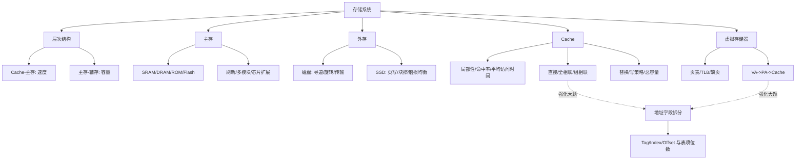

# 计算机组成原理 第3章 存储系统

> 来源：`27王道《计算机组成原理》高清带书签.pdf`，第3章 存储系统，PDF 页码 p89-p159。
>
> 复核：已对 p89-p159 做 OCR 抽文字骨架，并查看渲染页面图片；本轮又读取并复核计组基础考点讲解第3章 12 个 PDF、组成原理强化 P3、计组强化课考试解析、OS 强化存储系统串讲/手稿/真题补充，重点核对存储层次图、SRAM/DRAM 对比、DRAM 刷新、多模块存储器、主存扩展图、磁盘/SSD、Cache 映射/替换/写策略/容量计算、TLB/Page/Cache 组合、强化大题、习题解析、本章小结和常见问题。

## 本章速览

- 本章主线：用“寄存器 -> Cache -> 主存 -> 辅存”的层次结构，在速度、容量、成本之间折中；越靠近 CPU 越快越小越贵。
- 主存部分抓 SRAM/DRAM 差异、DRAM 刷新、地址复用、低位交叉存储器和芯片容量扩展。
- 外存部分抓磁盘容量与存取时间，SSD 的页写块擦、磨损均衡，以及 RAID 对吞吐率和可靠性的影响。
- Cache 是高频核心：局部性、命中率、平均访问时间、三种映射、替换算法、写策略、标记信息和容量计算。
- 虚拟存储器重点抓页表/TLB 地址转换、缺页处理，以及虚存与 Cache 的相同点和差异。
- 综合题做法：先拆地址字段，再按 `TLB -> 页表 -> 物理地址 -> Cache` 判断；不要把 TLB 缺失、Cache 缺失、Page 缺失混成一件事。
- 强化题抓两张图：Cache 题用 PA 拆 `Tag/Index/Offset`，TLB 题用 VPN 拆 `TLBT/TLBI`，最终再把 PPN 与页内偏移拼成 PA。

## 课件补充来源

- 基础考点讲解 3.1-3.2：`3.1 存储系统基本概念.pdf`；`3.2.0+3.2.3 主存储器的基本组成.pdf`；`3.2.1 SRAM和DRAM.pdf`；`3.2.2 只读存储器ROM.pdf`；`3.2.4 双端口RAM和多模块存储器.pdf`。
- 基础考点讲解 3.3-3.5：`3.3 主存储器与CPU的连接.pdf`；`3.4.1 磁盘存储器.pdf`；`3.4.2 固态硬盘SSD.pdf`；`3.5.1+3.5.2 Cache的基本原理.pdf`；`3.5.3 Cache和主存的映射方式.pdf`；`3.5.4 Cache替换算法.pdf`；`3.5.5 Cache写策略.pdf`。
- 计组强化资料：`计组P3_存储系统大题Cache、TLB总结.pdf`；`计组强化课考试_试题+答案.pdf`。
- 跨科强化资料：`操作系统P2_计组+操作系统存储系统串讲骚图.pdf`；`【带上课凌乱手稿】操作系统P2_计组+操作系统存储系统串讲骚图.pdf`；`操作系统P2_存储系统骚图pro.pdf`；`【带上课凌乱手稿】操作系统P2_存储系统骚图pro.pdf`；`操作系统P3（上半场）_存储系统真题补充.pdf`。
- 读取方式：可抽文字页用 PyMuPDF 抽取；低文本页和强化/手稿页渲染为图片，已对 DRAM/多模块、主存连接、Cache/TLB 大题图、强化考试地址转换图、OS 串讲页表/Cache 流程图做图片复核，并对关键渲染页做 OCR。

## 关联导航

- 本章内部：[[03-存储系统#3.1 存储器概述|存储器概述]]、[[03-存储系统#3.2 主存储器|主存储器]]、[[03-存储系统#3.3 主存储器与 CPU 的连接|主存连接]]、[[03-存储系统#3.5 高速缓冲存储器 Cache|Cache]]、[[03-存储系统#3.6 虚拟存储器|虚拟存储器]]。
- 同科联动：[[02-数据的表示和运算#2.3.4 数据的宽度和存储|数据宽度和字节编址]]、[[05-中央处理器#5.3 数据通路的功能和基本结构|CPU 数据通路]]、[[07-输入输出系统#7.3 I/O 方式|I/O 方式]]。
- 跨科联动：[[408/408考研笔记/操作系统/03-内存管理#3.2 虚拟内存管理|OS 虚拟内存管理]]、[[408/408考研笔记/操作系统/04-文件管理#4.3 文件系统|文件系统与磁盘]]。

## 知识网络

## 知识点清单

### 3.1 存储器概述

#### 3.1.1 存储器的分类

- 按存储介质：半导体存储器、磁表面存储器、光存储器。
- 按存取方式：
  - RAM：随机存取，任一单元读/写时间与位置无关；主存、Cache 属于此类。
  - SAM：顺序存取，访问位置越靠后通常越慢；典型是磁带。
  - DAM：直接存取，先定位到区域，再顺序读写；典型是磁盘。
  - CAM：相联存取，按内容匹配而非按地址寻址；常见于 TLB、Cache 标记阵列、路由表等。
- 按可改写性：读写存储器、只读存储器 ROM。
- 按断电保持性：易失性存储器 RAM；非易失性存储器 ROM、Flash、磁盘、光盘。
- 破坏性读出：读出后原信息被破坏，必须再生，如 DRAM；非破坏性读出如 SRAM。

#### 3.1.2 主存储器的组成和基本操作

- 主存由存储体、地址译码器、读写控制电路等组成。
- `MAR` 保存主存地址，位数通常等于地址总线位数，决定可寻址范围。
- `MDR` 暂存读/写数据，位数通常等于数据总线位数，决定一次传送的数据宽度。
- 按字节编址时，`n` 位地址可寻址 `2^n` 个字节；64 位数据线一次可传 8B。
- CPU 可直接访问 Cache 和主存，不能直接访问磁盘；外存数据必须先调入主存。
- 存储芯片基本信号：
  - 地址线选中片内存储单元；数据线传送读/写数据。
  - `CS/CE` 为片选或芯片使能；`WE` 控制写；`OE` 控制读。
  - 信号名上方有横线时表示低电平有效，读图题不要按高电平有效误判。
- 容量表达：
  - `2^n × m位` 表示有 `2^n` 个存储单元，每个单元 `m` 位。
  - 若按字节编址，还要把 bit 换算成 B；地址线位数和数据线位数不能混用。

#### 3.1.3 存储器的层次化结构

- 层次顺序：寄存器、Cache、主存、辅存。
- 速度：越靠上越快；容量：越靠下越大；单位成本：越靠上越高。
- Cache-主存层：主要解决 CPU 与主存速度不匹配，由硬件自动管理，对所有程序员透明。
- 主存-辅存层：主要解决主存容量不足，由硬件和操作系统协同管理，对应用程序透明。
- 上层保存下层活跃数据的副本，命中则直接访问上层，未命中再到下层调入。

#### 3.1.4 存储器的主要性能指标

- 存取时间 `Ta`：启动一次读/写到数据稳定输出或写入完成的时间。
- 存储周期 `Tm`：连续两次独立读/写所需的最小间隔，通常 `Tm >= Ta`。
- DRAM 读出后要恢复，存储周期可能明显大于存取时间。
- 存储器带宽：单位时间传送的最大数据量，常按数据宽度和存储周期计算。

#### 3.1.5/3.1.6 习题与解析反查

- 常考判断：Cache-主存层只提高平均速度，不增加主存容量；主存-辅存层才扩展可见地址空间。
- CPU 与主存交换信息不一定经过 Cache，但 CPU 访问外存必须经主存。
- 题目问“存储容量”时，一般主存容量不把 Cache 容量相加；Cache 是主存副本，不是地址空间扩展。

### 3.2 主存储器

#### 3.2.1 半导体随机存取存储器

- SRAM：
  - 存储元基于双稳态触发器，通常读出非破坏性。
  - 无需刷新，速度快。
  - 集成度低、功耗较大、成本高，常用于 Cache。
- DRAM：
  - 存储元用电容电荷表示 0/1，通常一晶体管一电容。
  - 集成度高、容量大、成本低、功耗较小，但速度慢。
  - 电荷会泄漏，必须周期刷新；读出具有破坏性，读后要再生。
  - 常用于主存，SDRAM 仍属于 DRAM，也需要刷新。
- SRAM 与 DRAM 对比：
  - 存储信息：SRAM 用触发器，DRAM 用电容。
  - 刷新：SRAM 不需要，DRAM 需要。
  - 地址传送：SRAM 通常一次送地址，DRAM 常行/列地址分时复用。
  - 用途：SRAM 适合高速小容量，DRAM 适合大容量主存。
- DRAM 刷新：
  - 刷新按行进行，只需提供行地址。
  - 刷新计数器产生行地址，位数等于行地址位数。
  - 刷新可能与 CPU 访存冲突，造成访存等待。
  - 行缓冲器保存被选中整行数据，通常用 SRAM 实现，可支持突发传输。

#### 3.2.2 非易失性存储器

- ROM 与 RAM 都可随机访问；差别在于 ROM 非易失，工作时主要读出。
- ROM 类型：
  - MROM：掩模式 ROM，出厂写入，可靠但不灵活。
  - PROM：用户可写一次，之后不能改。
  - EPROM：可擦除重写，典型用紫外线擦除。
  - EEPROM/E2PROM：可电擦除，能按字节或局部擦除。
  - Flash：在 EEPROM 基础上发展，常用于 U 盘、SD 卡、SSD。
- 重要 ROM 应用：主板 BIOS/UEFI 中保存自举装入程序，开机后把操作系统从辅存引导到主存。
- Flash 可电擦除和在线重写，读快写慢，擦写寿命有限。
- SSD 基于 Flash：
  - 优点：无机械寻道，随机访问快，抗震，功耗低。
  - 限制：以页为读写单位，以块为擦除单位；写前常需擦除，写放大和寿命是重点。
  - 磨损均衡：尽量让擦写分散到不同块，延长寿命。

#### 3.2.3 多模块存储器

- 双端口 RAM：
  - 两套独立地址线、数据线、控制线，允许两个端口并发访问。
  - 同时读不同单元或同一单元通常可行；同时写同一单元、读写同一单元会冲突。
  - 冲突时可置忙信号并延迟一个端口。408 大纲已淡化，了解概念即可。
- 目标：让多个结构相同的存储模块并行工作，提高连续访问吞吐率。
- 单体多字存储器：
  - 一个存储单元一次读出多个连续字，总线宽度也要能传多个字。
  - 只能一次取一组连续字，不适合随机取其中单个字。
- 连续编址/高位交叉：
  - 高位表示模块号，低位表示模块内地址。
  - 连续地址大多落在同一模块，难以并行，适合扩容但不擅长提速。
- 交叉编址/低位交叉：
  - 低位表示模块号，高位表示模块内地址。
  - 连续地址轮流分布到不同模块，适合连续读写。
  - `模块号 = 地址 mod 模块数`。
- 低位交叉条件：
  - 若存储周期为 `T`，总线传送周期为 `r`，理想模块数 `m = T/r`。
  - 更稳写法：为使流水线不断，应满足 `m >= T/r`。
  - 连续读 `m` 个字的理想时间约为 `T + (m-1)r`，不是 `mT`。
  - 连续读 `n` 个字的理想时间：`T + (n-1)r`。

#### 3.2.4/3.2.5 习题与解析反查

- DRAM 刷新只与行数有关，不是逐个存储单元刷新。
- 低位交叉题先看连续地址是否轮流落入各模块；若总线周期和存储周期给出，优先判断 `m = T/r`。
- 高位交叉更像容量扩展，低位交叉才常用于并行提速。

### 3.3 主存储器与 CPU 的连接

#### 3.3.1 连接原理

- CPU 与主存连接关注三类信号：
  - 地址线：选择存储单元或芯片。
  - 数据线：传送读/写数据。
  - 控制线：读、写、片选、使能等。
- 片选信号决定哪片存储芯片参与访问；高位地址常用于译码产生片选。
- 地址范围题要把“片内地址位”和“片选地址位”分开。

#### 3.3.2 主存容量的扩展

- 位扩展：
  - 增加每个存储字的位数。
  - 多片芯片共用地址线和控制线，各片提供数据总线的不同位。
- 字扩展：
  - 增加存储字个数。
  - 各芯片数据线并联，高位地址经译码产生片选，同一时刻只选中一片或一组。
- 片选方式：
  - 线选法：用若干高位地址线直接作为片选信号，电路简单，但可用地址空间常不连续。
  - 译码片选法：用高位地址经译码器产生片选，电路复杂一些，但地址空间可连续且利用率高。
  - 译码器可能带使能端，可由 `MREQ` 等控制信号保证地址稳定后再选片。
- 字位同时扩展：
  - 先按数据宽度分组做位扩展，再用多组做字扩展。
  - 芯片数 = 需要扩展的字数倍数 × 需要扩展的位数倍数。
- 地址分配：
  - 片内地址位数由单片容量决定。
  - 剩余高位地址用于片选；连续地址范围由片选高位组合决定。

#### 3.3.3/3.3.4 习题与解析反查

- 存储芯片数量题：先统一单位，如 `字数 × 位数` 或 `字节数 × 位数`，再分别算字扩展和位扩展。
- 起止地址题：先确定片内地址位数，再固定片选高位，低位全 0 是起始地址，低位全 1 是结束地址。
- 数据线位数不等于地址线位数；不要把 MDR 宽度和 MAR 宽度混用。

### 3.4 外部存储器

#### 3.4.1 磁盘存储器

- 磁盘结构：盘片、盘面、磁道、扇区、柱面、磁头。
- 扇区是磁盘读写的最小物理单位；文件系统中的“块/簇”通常由若干扇区组成。
- 磁盘地址常由驱动器号、柱面/磁道号、盘面号、扇区号组成。
- 磁盘由磁盘驱动器、磁盘控制器和盘片组成；磁盘控制器是硬盘与主机的接口。
- 容量计算：
  - 非格式化容量：按磁道原始记录能力估算。
  - 格式化容量：扣除扇区间隙、校验、控制信息后的可用容量，通常小于非格式化容量。
- 存取时间：
  - 平均存取时间 = 平均寻道时间 + 平均旋转延迟 + 传输时间。
  - 平均旋转延迟通常取半圈时间。
  - 传输率常按 `Dr = rN` 理解，`r` 为转速，`N` 为每转可读写字节数。
  - 若题目给转速 `R` 转/秒，一圈时间为 `1/R`，平均旋转延迟为 `1/(2R)`。
- 磁盘属于直接存取 DAM，不是随机存取 RAM；不同位置访问时间不同。
- RAID：
  - RAID0：条带化，提高吞吐率，但没有冗余。
  - RAID1：镜像，提高可靠性，空间利用率低。
  - RAID5：分布式校验，兼顾可靠性与空间利用率。
  - RAID 可提高并行访问和可靠性，不会提高单个盘片的记录密度。

#### 3.4.2 固态硬盘

- SSD 无机械寻道，随机访问性能通常优于机械磁盘。
- Flash 页可读写，块才可擦除；覆盖写通常需要擦除旧块或迁移有效页。
- 写入寿命有限，因此需要磨损均衡、垃圾回收和备用块。
- SSD 仍是辅存，CPU 不能直接执行其上的数据，仍需调入主存。

#### 3.4.3/3.4.4 习题与解析反查

- 磁盘访问时间题不要漏“平均旋转延迟”；只给转速时，平均等待通常取半圈。
- 连续扇区读取题要关注是否跨磁道、是否需要重新寻道或等待旋转。
- RAID 题先判断目标：提速、容错、空间利用率，别把 RAID0 当成可靠性方案。

### 3.5 高速缓冲存储器 Cache

#### 3.5.1 程序访问的局部性原理

- 时间局部性：刚被访问的数据或指令，短时间内可能再次访问。
- 空间局部性：刚被访问位置附近的数据或指令，短时间内可能被访问。
- 顺序执行、循环、数组连续存储都能体现局部性。
- C 语言二维数组按行优先存储：按行访问通常 Cache 命中率高；按列访问可能跨大步长，命中率差。

#### 3.5.2 Cache 的基本工作原理

- Cache 与主存划分为大小相同的块；Cache 中的块也称 Cache 行。
- CPU 访存时先查 Cache：
  - 命中：直接从 Cache 读/写。
  - 未命中：把对应主存块调入 Cache，再完成访问。
- 命中率 `H = Nc / (Nc + Nm)`；缺失率为 `1 - H`。
- 串行访问平均时间常用 `Ta = Tc + (1-H)Tm`，其中 `Tc` 为 Cache 命中时间，`Tm` 为主存访问时间或缺失代价。
- 若题设说明 Cache 与主存并行访问，应按题设重算，不能死套串行公式。
- Cache 只改善平均访问速度，不扩大主存地址空间。
- Cache 大题先列六个条件：
  - 物理地址 PA 位数。
  - Cache 总行数。
  - Cache 块大小。
  - Cache-主存映射方式。
  - 写策略。
  - 替换算法。
- 由总行数和块大小可得 Cache 数据区大小；但“Cache 总容量”还要加标记位、有效位、脏位、替换位等。

#### 3.5.3 Cache 和主存的映射方式

- 地址拆分先确定块大小：
  - 块内地址位数 = `log2(块大小/编址单位)`。
  - 主存块号 = 主存地址去掉块内地址后的高位部分。
- 直接映射：
  - 地址格式：`标记 | Cache 行号 | 块内地址`。
  - `Cache 行号 = 主存块号 mod Cache 总行数`。
  - 优点：实现简单、速度快；缺点：冲突多，命中率较低。
  - 不需要替换算法，因为每个主存块只能去固定行。
- 全相联映射：
  - 地址格式：`标记 | 块内地址`。
  - 任意主存块可放入任意 Cache 行。
  - 命中率高、冲突少，但比较电路复杂、成本高。
- 组相联映射：
  - 地址格式：`标记 | 组号 | 块内地址`。
  - Cache 分成若干组，组内有若干行。
  - `Cache 组号 = 主存块号 mod Cache 组数`，组内任意行可放。
  - 直接映射可看作 1 路组相联；全相联可看作只有 1 组。
- K 路组相联：
  - 每组有 `K` 个 Cache 行。
  - `组数 = Cache 总行数 / K`。
  - 组号位数 = `log2(组数)`。
- Cache 命中判断步骤：
  - 先按映射方式拆 PA 字段。
  - 直接映射：按行号定位唯一行，比较标记且有效位为 1。
  - 全相联：和所有行标记并行比较，标记匹配且有效位为 1。
  - 组相联：按组号定位一组，再在组内比较各路标记和有效位。

#### 3.5.4 Cache 中主存块的替换算法

- 直接映射无需替换算法；全相联和组相联才需要在候选行中选择替换对象。
- RAND：随机替换，实现简单但命中率不稳定。
- FIFO：替换最早调入的行，不考虑近期是否访问。
- LRU：替换最近最久未使用的行，利用时间局部性；若活跃块数超过组内行数，可能出现抖动。
- LFU：替换一段时间内访问次数最少的行；LRU 看“最近是否用过”，LFU 看“累计用了多少次”。
- 替换信息位：
  - 直接映射：无替换选择，替换信息为 0。
  - 随机替换：通常不需要在每行保存替换状态。
  - 全相联若用 LRU/FIFO：每行可用 `log2(Cache总行数)` 位记录替换次序。
  - K 路组相联若用 LRU/FIFO：每行可用 `log2(K)` 位记录组内替换次序。

#### 3.5.5 Cache 的一致性问题

- 写命中策略：
  - 全写法/直写法：同时写 Cache 和主存，主存实时一致；实现简单但主存写流量大，常配写缓冲。
  - 回写法：只写 Cache 并置脏位；该块被替换且脏位为 1 时才写回主存，效率高但一致性处理复杂。
- 写不命中策略：
  - 写分配法：把主存块调入 Cache 后再写 Cache，利用空间局部性。
  - 非写分配法：直接写主存，不把该块调入 Cache。
- 常见搭配：回写法 + 写分配；全写法 + 非写分配。
- 脏位只在回写策略中必要；直写法主存同步更新，通常不需要脏位。
- 写缓冲可缓解直写法带来的主存写等待，但写频繁时可能饱和。
- 强化题常问：
  - Cache 可以采用直写，因为写回主存代价相对可接受。
  - 页面/虚存内容修改通常采用回写，因为每次写都同步到磁盘代价过高。
  - Cache 缺失开销通常远小于缺页开销，缺页要访问辅存并陷入 OS。

#### 3.5.6 Cache 容量的计算举例

- 只问数据容量：`Cache 行数 × 块大小`。
- 问 Cache 总容量：每行都要加标记信息和控制位。
- 每行常见附加位：
  - 有效位：判断该行数据是否有效，所有 Cache 通常都需要。
  - 标记位：与地址高位比较，判断是否命中。
  - 脏位：回写策略需要。
  - 替换控制位：如 LRU 位，只有对应算法需要。
- 一个 Cache 行完整构成常写为：
  - `Tag标记 + 有效位 + 替换信息 + 脏位 + 数据块`。
  - 其中替换信息和脏位是否存在取决于映射方式、替换算法和写策略。
- 计算步骤：
  - 主存地址位数由地址空间和编址单位确定。
  - 块内地址位数由块大小确定。
  - 行号/组号位数由 Cache 行数或组数确定。
  - 标记位数 = 主存地址位数 - 行号/组号位数 - 块内地址位数。
- 组相联容量题要先算组数：`组数 = Cache 数据容量 / (块大小 × 路数)`。
- 强化例题模板：
  - PA 拆为 `CT | CI | CO`，分别对应 Cache Tag、Cache Index、Cache Offset。
  - `CO = log2(块大小)`。
  - `CI = log2(组数)`，直接映射时组数就是行数，全相联时 `CI=0`。
  - `CT = PA总位数 - CI - CO`。

#### 3.5.7 Cache 的应用

- 分离 Cache：
  - 指令 Cache 与数据 Cache 分开，减少流水线中取指和数据访存冲突。
  - 可分别针对指令局部性和数据局部性优化。
- 多级 Cache：
  - L1 靠近 CPU，速度最快、容量较小；L2/L3 容量更大但更慢。
  - 常用回写策略；L1 脏块可先写回 L2，减少主存写压力。
- Cache 性能受映射方式、容量、块大小、替换算法、写策略、级数、分离/统一结构共同影响。

#### 3.5.8/3.5.9 习题与解析反查

- 平均访问时间题：先判断命中时间、缺失代价和访问方式是串行还是并行。
- 数组缺失率题：
  - 先算每个 Cache 块可容纳多少个数组元素。
  - 再看首地址是否按块边界对齐；未对齐可能多访问一个块。
  - 循环有读有写时，总访问次数要按题意累加。
- 地址字段题：先算块内偏移，再算行号/组号，剩余高位为标记。
- 采用虚拟地址低位作 Cache 索引时，要确认索引位是否落在页内偏移范围；页内偏移在 VA 和 PA 中相同。

### 3.6 虚拟存储器

#### 3.6.1 虚拟存储器的基本概念

- 虚拟存储器由硬件和操作系统协同实现，用主存和辅存构造较大的逻辑地址空间。
- 虚地址/逻辑地址：程序发出的地址；实地址/物理地址：主存实际地址。
- 虚地址空间与物理地址空间分离，应用程序员通常只看到虚地址空间。
- 缺页：访问的虚页不在主存中，需要操作系统把页面从辅存调入主存。
- 若主存无空闲页框，需要按替换算法换出一页；脏页换出时要写回辅存。
- 虚拟存储器通常采用类似回写的策略，因为辅存访问代价很高，不能每次写都同步更新磁盘。

#### 3.6.2 页式虚拟存储器

- 页式虚存以页为基本单位；虚拟地址空间分虚页，主存分物理页/页框，二者大小相同。
- 虚拟地址格式：`虚页号 | 页内地址`。
- 物理地址格式：`页框号 | 页内地址`。
- 地址转换时页内地址不变，只把虚页号替换成页框号。
- 页表项常含：
  - 有效位/装入位：该页是否在主存。
  - 页框号：在主存中对应的物理页号。
  - 外存地址：未装入时在辅存中的位置。
  - 脏位/修改位：换出时是否需要写回。
  - 引用位/使用位：供 Clock、LRU 等替换算法参考。
  - 保护位：访问权限控制。
- 快表 TLB：
- TLB 是页表项的高速缓存，通常由 SRAM 构成。
- TLB 常用全相联或组相联查找。
- TLB 标记一般是虚页号；命中后给出页框号和控制位。
- TLB 大题先列条件：
  - 虚页号 VPN 位数。
  - TLB 可存多少个页表项。
  - TLB 映射方式和路数。
  - TLB 替换算法。
- TLB 字段拆分：
  - 虚拟地址 `VA = VPN | VPO`，页内偏移 `VPO` 位数由页大小决定。
  - 全相联 TLB：`VPN` 整体作 `TLBT`。
  - 组相联 TLB：`VPN = TLBT | TLBI`，`TLBI = log2(TLB组数)`。
  - 直接映射通常不用于 TLB，若题目硬给出也按“一组一路”处理。
- TLB 表项完整构成：
  - `TLB Tag + 有效位 + 页框号 PPN + 替换信息`。
  - `PPN` 位数由物理页框总数决定，也等于 `PA位数 - 页内偏移位数`。
- 具有 TLB 和 Cache 的访存流程：
  - CPU 给出 VA，先用虚页号查 TLB。
  - TLB 命中：得到页框号，拼接页内地址形成 PA。
  - TLB 缺失：访问主存中的页表；若页表有效，则更新 TLB 并形成 PA。
  - 若页表无效，触发缺页异常，操作系统调页、更新页表和 TLB。
  - 得到 PA 后，再按 Cache 映射方式查 Cache。
- 地址字段统一记法：
  - `VA = VPN | VPO`。
  - `PA = PPN | PPO`。
  - 页大小相同时 `VPO = PPO`，地址转换只替换页号。
  - 物理 Cache 常用 `PA = CT | CI | CO` 查 Cache。
- 三种缺失组合：
  - TLB 命中则 Page 一定命中，但 Cache 可命中也可缺失。
  - TLB 缺失时 Page 可命中也可缺失。
  - Page 缺失时 TLB 必缺失，Cache 也一定缺失。
  - Cache 缺失由硬件处理；缺页由操作系统缺页异常处理程序处理；TLB 缺失可由硬件或软件处理。

#### 3.6.3 段式虚拟存储器

- 段按程序逻辑结构划分，长度可变；虚拟地址格式：`段号 | 段内地址`。
- 段表记录段号、有效位、段首地址、段长等。
- 地址转换：查段表，若有效且段内地址不越界，则 `物理地址 = 段首地址 + 段内地址`。
- 优点：符合程序逻辑边界，便于共享、保护、编译和模块化管理。
- 缺点：段长可变，主存分配困难，容易产生外部碎片。
- 分段对程序员通常可见；分页对程序员透明。

#### 3.6.4 段页式虚拟存储器

- 先按逻辑结构分段，再把每段分页；主存也按页框划分。
- 虚拟地址格式：`段号 | 段内页号 | 页内地址`。
- 每个进程有段表，每段对应一个页表。
- 地址转换：查段表得到该段页表起始地址，再查页表得到页框号，最后拼页内地址。
- 优点：兼具分段的共享保护和分页的固定大小管理，避免段式外部碎片。
- 缺点：地址转换需多次查表，表项开销和访存开销较大。

#### 3.6.5 虚拟存储器与 Cache 的比较

- 相同点：
  - 都基于局部性原理，把活跃数据放到更快的层次。
  - 都有地址映射、替换算法和更新策略。
  - 都以块状单位交换信息，但虚存页通常远大于 Cache 块。
- 不同点：
  - 目标：Cache 主要解决 CPU 与主存速度差；虚存主要解决主存容量不足。
  - 管理：Cache 主要由硬件完成；虚存由硬件和操作系统共同完成。
  - 透明性：Cache 对所有程序员透明；虚存对应用程序员透明，但对系统程序员不完全透明。
  - 失效代价：Cache 缺失访问主存；缺页要访问磁盘，代价更大。
  - 访问路径：CPU 可直接访问 Cache 和主存；不能直接访问辅存。
  - 更新策略：Cache 可直写或回写；虚存通常采用回写，减少磁盘 I/O。

#### 3.6.6/3.6.7 习题与解析反查

- 缺页属于 CPU 执行指令过程中的内部异常，缺页处理后通常回到引发缺页的指令重新执行。
- MMU 地址转换阶段检查页表和权限，不能直接判断 Cache 是否命中；Cache 查询发生在得到物理地址后。
- TLB 与 Cache 都常用 SRAM；DRAM 需要刷新、速度偏低，不适合做这类高速小容量结构。
- 虚地址增加位数会扩大虚页号位数；页大小不变时页内地址位数不变。
- 页大小为 `2^k`B 时，VA 和 PA 的低 `k` 位相同；若 Cache 索引位完全落在这 `k` 位内，可直接用虚地址低位判断组号。
- 数组跨页题不要只看总大小，还要看起始地址是否页对齐；未对齐可能多占一个页。

### 3.7 本章小结

- 存储系统分层是为了兼顾速度、容量和成本：Cache-主存层让平均访问速度接近 Cache，主存-辅存层让程序可见容量接近辅存。
- Cache 与主存的信息调度由硬件自动完成；主存与辅存的信息调度由虚拟存储器机制完成，需要硬件和操作系统协同。
- Cache 命中率受映射方式、Cache 容量、块大小、替换算法、写策略、多级结构、指令/数据 Cache 是否分离等影响。
- Cache 行大小要适中：过小难利用空间局部性，过大增加缺失损失并减少行数。
- 页面大小也要适中：过小导致页表大、TLB 压力大；过大增加页内碎片和调页 I/O 时间。

### 3.8 常见问题和易混淆知识点

- Cache 行大小与命中率：
  - 行长变大可利用空间局部性，但缺失时传输时间变长。
  - Cache 总容量固定时，行长过大会减少行数，可能增加冲突。
  - 行长过小缺失代价小，但空间局部性利用差，命中率通常不高。
- 取指令 Cache 缺失处理：
  - 保持 PC 不变。
  - 根据 PC 地址从主存取出该指令所在块。
  - 调入 Cache，更新有效位和标记位。
  - 重新从 Cache 取指并继续执行。
- VA 到数据的完整访问链：
  - CPU 发出 VA，先拆 `VPN/VPO`。
  - 查 TLB；未命中再查主存页表；缺页则陷入 OS。
  - 得到 `PPN` 后拼接 `PPO` 得 PA。
  - 用 PA 拆 `CT/CI/CO` 查 Cache；Cache 命中直接取数，缺失再访问主存。
  - 因此 TLB 命中不代表 Cache 命中，Cache 缺失也不代表缺页。

## 易错点/易混点

- RAM 是按访问方式分类，不等于“可读写”这个普通含义；ROM 也可以随机访问。
- 磁盘是 DAM，不是 RAM；磁带是 SAM；TLB/Cache 标记查找常体现 CAM 思想。
- SRAM 不刷新，DRAM 要刷新；SDRAM 虽有同步接口，仍是 DRAM，仍需刷新。
- DRAM 刷新按行进行，不是按存储单元逐个刷新。
- Cache 容量不计入主存容量；Cache-主存层解决速度问题，主存-辅存层解决容量问题。
- 低位交叉才让连续地址分布到不同模块；高位交叉通常不能提升连续访问吞吐率。
- 主存扩展题先算位扩展再算字扩展；地址范围题片内地址和片选地址要分开。
- 磁盘平均访问时间不要漏平均旋转延迟；平均旋转延迟通常是半圈。
- RAID0 提速但无冗余；RAID1/RAID5 才体现容错。
- 直接映射没有替换算法；全相联和组相联才需要替换策略。
- Cache 地址字段先算块内偏移，再算行号/组号，剩余才是标记。
- Cache 总容量题若问“总容量”，要加入有效位、标记位、脏位、替换控制位等；只问数据容量才只算数据区。
- 全写/回写是写命中策略；写分配/非写分配是写不命中策略。
- 写缓冲只能缓解直写等待，不能无限吸收写请求；高频写入时可能饱和。
- TLB 缺失不一定缺页；Page 缺失必然 TLB 缺失且 Cache 缺失。
- TLB 命中说明页在主存，但不能说明数据在 Cache 中。
- MMU 完成地址转换和权限检查；Cache 命中判断发生在拿到物理地址之后。
- 页内偏移在 VA 到 PA 转换中保持不变；页大小决定不变的低位数。
- 缺页处理由操作系统通过异常完成，Cache 缺失通常由硬件自动处理。
- 虚拟存储器通常采用回写策略，因为每次写都同步到磁盘代价太高。
- 分页对程序员透明；分段按逻辑结构划分，对程序员通常不完全透明。
- `CS/CE/OE/WE` 等控制信号若上方有横线，表示低电平有效。
- 线选法电路简单但地址空间可能不连续；译码片选法更适合连续地址空间。
- 低位交叉不是“同时访问同一模块”，而是连续地址轮流落到不同模块形成流水。
- `m=T/r` 是理想模块数，题中若问“不间断”要写 `m >= T/r`。
- Cache 大题先看 PA 位数，不要直接拿 VA 去拆物理 Cache。
- TLB 大题先看 VPN 位数，不要把整个 VA 都当成 TLB 标记。
- TLB 表项里的页框号位数由物理页框数决定，不由虚页数决定。
- `VPO=PPO` 只说明页内偏移不变，不说明 VA 的高位能直接当 PA 高位。
- LRU/FIFO 替换信息的位数看候选集合大小：全相联看总行数，组相联看路数。
- 回写策略才需要脏位；直写策略通常不需要脏位但可能需要写缓冲。
- Cache 缺失由硬件处理，缺页由 OS 处理；缺页后通常重新执行引发缺页的指令。
- 缺页代价远大于 Cache 缺失代价，题目问“哪个开销大”优先选缺页。

## 课件补充/强化题规则

- Cache 命中分析：
  - 先列 6 个条件：PA 位数、Cache 总行数、块大小、映射方式、写策略、替换算法。
  - 地址字段：全相联 `PA=Tag|Offset`；直接映射 `PA=Tag|Line|Offset`；组相联 `PA=Tag|Set|Offset`。
  - 组相联先由组号定位组，再在组内多路并行比较 Tag 和有效位。
- Cache 行构成：
  - 必有：`Tag + 有效位 + 数据块`。
  - 回写加 `脏位`；LRU/FIFO 加替换信息；随机替换通常不加替换状态。
  - 直接映射没有替换算法，替换信息为 0。
- Cache 总容量题：
  - 数据容量 = 行数 × 块大小。
  - 总容量 = 每行完整位数 × 行数。
  - 每行完整位数要把 Tag、有效位、脏位、替换位和数据块都统一成 bit。
- TLB 命中分析：
  - 先拆 `VA=VPN|VPO`，只用 VPN 查 TLB。
  - 全相联 TLB 用整个 VPN 比较 Tag；组相联 TLB 先由 `TLBI` 定组，再比较 `TLBT`。
  - TLB 命中得到 PPN；TLB 缺失但页表有效时只是 Page 命中，不是缺页。
- VA/PA/Cache 综合题：
  - `VPO=PPO`，页内偏移直接保留。
  - `PA=PPN|PPO` 后，再拆 `CT|CI|CO` 查 Cache。
  - 若 Cache 索引位完全落在页内偏移范围内，可用 VA 低位提前确定 Cache 组号；否则必须等 PA。
- 多级页表题：
  - 页大小为 `2^k`B，则页内偏移 `k` 位。
  - 若页表项大小为 `s`B，则每页可放 `2^k/s` 个页表项。
  - 多级页号按每级页表能容纳的表项数拆分，最后一级页表项给出 PPN。
- 主存扩展题：
  - 先统一芯片容量单位，再分别算位扩展和字扩展。
  - 片内地址位由单片字数决定；高位地址用于片选。
  - 起止地址：片选位固定，片内低位全 0 为起始，全 1 为结束。
- 多模块存储器题：
  - 高位交叉偏扩容，连续地址常在同一模块。
  - 低位交叉偏提速，模块号常为地址低位或 `地址 mod 模块数`。
  - 连续取 `n` 个字理想耗时 `T+(n-1)r`。

## 注解

- 存储层次记忆：往上“快、小、贵”，往下“慢、大、便宜”。
- 访问时间题先辨认层次：Cache 缺失访问主存，Page 缺失访问磁盘，二者数量级不同。
- Cache 映射题固定步骤：算块内偏移 -> 算主存块号 -> 算行号/组号 -> 剩余高位作标记。
- Cache 数组题固定步骤：元素大小 -> 每块元素数 -> 地址是否对齐 -> 总访问次数 -> 缺失次数。
- TLB/页表题固定步骤：虚拟地址拆虚页号和页内偏移 -> 查 TLB/页表 -> 页框号拼原页内偏移 -> 再查 Cache。
- 强化大题字段口诀：TLB 看 `VPN`，Cache 看 `PA`；页内偏移不变，Cache 块内偏移由块大小决定。
- 看到“VA 的哪些位可作 Cache 索引”，先看页大小；只要索引位落在页内偏移内，VA 和 PA 对应位相同。
- 页面大小和 Cache 行大小都不是越大越好，本质都是在局部性收益、表/行数量、缺失代价之间折中。

## 速背检查

1. 存储层次从快到慢如何排序？答：寄存器、Cache、主存、辅存。
2. Cache-主存层和主存-辅存层分别解决什么问题？答：前者解决速度差，后者解决容量不足。
3. MAR 和 MDR 分别决定什么？答：MAR 位数决定寻址范围，MDR 位数决定一次数据传送宽度。
4. SRAM 和 DRAM 最大区别是什么？答：SRAM 用触发器、不刷新；DRAM 用电容、要刷新且读出破坏性。
5. DRAM 刷新按什么单位进行？答：按行刷新。
6. 低位交叉存储器模块号如何算？答：`模块号 = 地址 mod 模块数`。
7. 理想低位交叉模块数如何估计？答：`m = 存储周期T / 总线周期r`。
8. 磁盘平均存取时间由哪三部分组成？答：寻道时间、旋转延迟、传输时间。
9. Cache 命中率公式是什么？答：`H = Nc / (Nc + Nm)`。
10. 串行 Cache 平均访问时间公式是什么？答：`Ta = Tc + (1-H)Tm`。
11. 直接映射行号如何算？答：`Cache 行号 = 主存块号 mod Cache 总行数`。
12. 组相联映射组号如何算？答：`Cache 组号 = 主存块号 mod Cache 组数`。
13. Cache 总容量包括哪些内容？答：数据区 + 标记位 + 有效位 + 按策略需要的脏位/替换位。
14. 全写法和回写法分别处理什么情况？答：都是写命中策略。
15. 写分配和非写分配分别处理什么情况？答：都是写不命中策略。
16. 直接映射需要替换算法吗？答：不需要，每个主存块只有固定 Cache 行。
17. K 路组相联有多少组？答：`Cache总行数 / K`。
18. K 路组相联 LRU 每行替换信息常需几位？答：`log2(K)` 位。
19. 回写法为什么要脏位？答：替换时判断该块是否被修改、是否要写回主存。
20. Cache 大题先拆 VA 还是 PA？答：物理 Cache 通常先得到 PA，再拆 `CT/CI/CO`。
21. TLB 缺失一定缺页吗？答：不一定，页表项有效则 Page 命中。
22. Page 缺失时 Cache 可能命中吗？答：不可能，页不在主存，Cache 不会有对应数据。
23. 虚拟地址转换成物理地址时哪部分不变？答：页内偏移不变，即 `VPO=PPO`。
24. TLB 表项一定有什么？答：TLB Tag、有效位、页框号，按替换算法可有替换信息。
25. 组相联 TLB 如何查？答：VPN 拆成 `TLBT/TLBI`，先用 TLBI 定组，再比较 TLBT 和有效位。
26. 多级页表中每页能放多少 PTE？答：`页大小 / 页表项大小`。
27. 缺页由谁处理？答：操作系统的缺页异常处理程序。
28. Cache 缺失和缺页哪个代价大？答：缺页，通常要访问磁盘并陷入 OS。
29. 线选法和译码片选法差异？答：线选简单但地址不一定连续；译码片选可连续但电路复杂。
30. 虚存和 Cache 的核心区别是什么？答：Cache 主要解决速度差，虚存主要扩展地址空间/容量。
