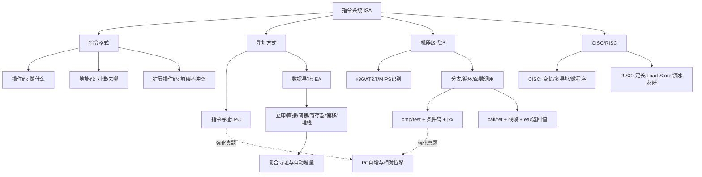

# 计算机组成原理 第4章 指令系统

> 来源：`27王道《计算机组成原理》高清带书签.pdf`，第4章 指令系统，PDF 页码 p160-p206。
>
> 复核：本轮共核对教材、13 份基础课、期中/期末卷、P4/P5、五段式流水线专题和强化考试 20 组 357 页，实际 OCR 213 页；已直接查看全部 66 张全资料联系图，并放大复核 38 个关键原页，成稿后再次复读其中 12 页。重点反查三组教材习题解析、阶段卷和强化真题中的指令格式、寻址、机器码、控制流、函数调用与 CISC/RISC 规则。

## 本章速览

- 主线：指令系统是软硬件接口，规定指令怎么编码、操作数地址怎么找、程序怎么跳转、过程怎么调用。
- 指令格式抓两块：操作码说明“做什么”，地址码说明“操作数/结果/转移目标在哪里”。
- 寻址方式抓核心公式：由形式地址 `A`、寄存器内容或存储单元内容得到有效地址 `EA`。
- 机器级代码重点读 32 位 x86 的 Intel 格式：目的操作数在前，源操作数在后，栈向低地址增长。
- 题目常考 PC 自增、相对位移补码、大/小端、多字节起始地址、标志位、数组比例因子和 `call/ret`。
- CISC/RISC 对比抓本质：CISC 复杂灵活，RISC 简单规整、LOAD/STORE、寄存器多、硬布线和流水线友好。
- 强化题入口：先识别 x86/AT&T/MIPS，再判断是否有分支、循环、函数调用、栈帧访问和条件码转移。

## 课件补充来源

- 基础考点讲解 4.1-4.2：`4.1.1+2+3  指令的基本格式.pdf`；`4.1.4 扩展操作码指令格式.pdf`；`4.2.1 指令寻址.pdf`；`4.2.2_1 数据寻址1.pdf`；`4.2.2_2 数据寻址2_偏移寻址.pdf`；`4.2.2_3 数据寻址3_堆栈寻址.pdf`。
- 基础考点讲解 4.3-4.4：`4.3.1_1 高级语言与机器级代码之间的对应.pdf`；`4.3.1_2 常用的x86汇编指令.pdf`；`4.3.1_3 AT&T格式和Intel格式.pdf`；`4.3.2 选择语句的机器级表示.pdf`；`4.3.3 循环语句的机器级表示.pdf`；`4.3.4 函数调用的机器级表示.pdf`；`4.4 CISC和RISC.pdf`。
- 阶段与强化资料：`计算机组成原理期中试卷及答案解析（学员版）.pdf`；`计算机组成原理期末试卷及答案解析（学员版）.pdf`；`计组P4_一堆指令的执行.pdf`；`计组P5_一条指令的执行.pdf`；`【录播】五段式指令流水线题型总结.pdf`；`计组强化课考试_试题+答案.pdf`。
- 读取方式：可抽文字页用 PyMuPDF 抽取；低文本页、手稿页、公式表格、栈帧图和真题页执行 OCR，并直接查看渲染图复核，不能以 OCR 结果代替图读。

## 关联导航

- 本章内部：[[04-指令系统#4.1 指令系统|指令系统]]、[[04-指令系统#4.2 寻址方式|寻址方式]]、[[04-指令系统#4.3 程序的机器级代码表示|机器级代码]]、[[04-指令系统#4.4 CISC 和 RISC 的基本概念|CISC/RISC]]。
- 同科联动：[[02-数据的表示和运算#2.2 运算方法和运算电路|标志位与补码运算]]、[[02-数据的表示和运算#2.3.4 数据的宽度和存储|大端/小端与数据存储]]、[[05-中央处理器#5.2 指令执行过程|指令执行过程]]、[[05-中央处理器#5.6 指令流水线|指令流水线]]。
- 跨科联动：[[408/408考研笔记/数据结构/03-栈、队列和数组#3.1 栈|栈与后缀表达式]]、[[408/408考研笔记/操作系统/03-内存管理#3.1 内存管理概念|重定位与基址思想]]。

## 知识网络

## 知识点清单

### 4.1 指令系统

#### 4.1.1 指令集体系结构

- 指令：控制计算机完成某种基本操作的机器命令。
- 指令系统/指令集：一台计算机能执行的全部机器指令集合。
- ISA 是软件和硬件的接口，机器语言/汇编程序员和编译器必须遵守。
- ISA 规定：
  - 指令格式、寻址方式、操作类型、操作数个数、类型和寻址约束。
  - 操作数数据类型，以及大端/小端存放方式。
  - 程序可访问寄存器的编号、数量和位数。
  - 存储空间大小、编址方式、程序员可见控制状态，如 PC、条件码。
  - 程序员可见的中断/异常处理约定及 I/O 指令或接口规则。
- ISA 不规定：
  - 控制信号细节、微程序内容、ALU 内部电路、具体数据通路和时钟周期等微结构实现。

#### 4.1.2 指令的基本格式

- 基本格式：`操作码字段 OP + 地址码字段 A`。
- 操作码：指出指令功能，如加、减、传送、转移、调用。
- 地址码：给出源操作数、目的操作数、结果保存位置、转移目标或子程序入口。
- 指令字长：
  - 指令字长是机器指令的总位数；机器字长反映 CPU 一次处理的基本数据位数；存储字长是一个存储字保存的位数，三者不必相等。
  - 主存按字节编址时，指令字长通常为字节的整数倍；题设若再按指令字长与机器字长的关系称半字长、单字长或双字长指令，则按题设口径判断。
  - 定长指令字：取指和译码简单，利于流水线，代码密度可能低。
  - 变长指令字：表达灵活、代码可能更短，但译码复杂。
  - 按字节编址时，PC 自增量等于当前指令字节数。
  - 定长且按字编址时，若指令字长等于存储字长，顺序执行常表现为 `PC <- PC+1`。
  - 定长且按字节编址时，若指令长 2B/4B，顺序执行常表现为 `PC <- PC+2/+4`。
  - 变长指令通常先取若干字节并译码，确定本条指令总长度 `n` 后再令 `PC <- PC+n`。
- 按显式地址数分类：
  - 零地址：无显式地址，可表示无操作数指令，也可用于栈机，操作数隐含在栈顶。
  - 一地址：可表示 `OP(A1)->A1`，也可配合 `ACC` 表示 `(ACC) OP (A1)->ACC`。
  - 二地址：常见 `(A1) OP (A2)->A1`，`A1` 兼目的地址和结果地址。
  - 三地址：常见 `(A1) OP (A2)->A3`，结果单独保存，地址码开销较大。
  - 四地址：`(A1) OP (A2)->A3`，`A4` 显式给出下一条指令地址；通常由 PC 自动形成下一地址，所以极少采用。
- 零地址栈机：
  - 算术指令常默认取栈顶和次栈顶两个操作数，运算结果再压回栈顶。
  - 与 [[408/408考研笔记/数据结构/03-栈、队列和数组#3.1 栈|栈]] 和后缀表达式联系紧密。
- 访存次数：
  - 若题目问“执行阶段”，通常不含取指。
  - 若题目问“完成整条指令”，要加取指访存。
  - 地址码均为主存地址时，一地址累加器型可能取指、取数、写回共 3 次；二/三地址运算可能取指、取两个操作数、写回共 4 次。
  - 四地址中的 `A4` 已随指令取入，不额外产生一次数据访存。
- **地址数与长度是两回事**：一地址指令也可因寻址方式、立即数或位移字段不同而采用变长格式。

#### 4.1.3 定长操作码指令格式

- 定长操作码：在指令字高位固定分配 `n` 位操作码。
- 最多可表示 `2^n` 条指令。
- 优点：译码简单、硬件实现容易、速度快。
- 常见于字长较长、格式规整的指令系统。

#### 4.1.4 扩展操作码指令格式

- 扩展操作码：地址码数减少时，把腾出的字段继续用作操作码，使操作码长度变长。
- 典型思路：三地址指令操作码短，一地址/零地址指令操作码长。
- 设计原则：
  - 短操作码不能成为长操作码的前缀，否则译码不唯一。
  - 各条指令操作码不能重复。
  - 高频指令适合分配较短操作码，低频复杂指令可分配较长操作码。
- 递推规则：
  - 若某一级地址字段长为 `n`，上一层留出 `m` 种状态，则下一层最多扩展出 `m*2^n` 种操作码状态。
  - 每一层要先扣除本层实际使用的操作码，再把剩余状态留给下一层。
  - 可把它看作“前缀编码”问题，类似哈夫曼编码不能出现前缀冲突。
- **统一码空间法**：若指令总长为 `L`、每个地址字段为 `k` 位，则一条 `m` 地址指令占用 `2^(mk)` 个零地址编码；必须满足 `sum(Nm*2^(mk)) <= 2^L`。
- **最短字长题**：先算满足编码数量的最少位数；若按字节编址并要求指令按字节对齐，再向上取 8 的整数倍。
- 定长操作码混合地址数时，各格式仍共用固定操作码长度；未使用的地址字段只有在题目明确采用扩展操作码时才能转作操作码。
- 经典 16 位示例：4 位基本操作码 + 3 个 4 位地址字段。
  - 可安排 15 条三地址、15 条二地址、15 条一地址、16 条零地址指令。
  - 每保留一个扩展码，下一级可扩展出的数量由剩余地址字段位数决定。

#### 4.1.5 指令的类型

- 数据传送：`MOV`、`LOAD`、`STORE`、`PUSH`、`POP`。
- 算术/逻辑：`ADD`、`SUB`、`MUL`、`DIV`、`INC`、`DEC`、`AND`、`OR`、`NOT`、`XOR`。
- 移位：算术移位、逻辑移位、循环移位。
- 顺序控制：`JMP`、条件转移、`CALL`、`RET`、`TRAP`。
- I/O 指令：CPU 与外设交换数据、状态或控制命令。
- CPU 控制：停机、开/关中断、模式切换等；很多属于特权指令，只能在内核态使用。
- `CALL` 与 `JMP` 的核心区别：`CALL` 保存返回地址，`JMP` 只改变 PC。
- **中断隐指令**是硬件在中断响应周期自动完成的保存断点、关中断和转中断入口等操作，不是指令系统中的显式机器指令，也不属于程序控制类指令；`TRAP` 则是程序可执行的陷阱指令。

#### 4.1.6/4.1.7 习题与解析反查

- ISA 题：看到“控制信号、微操作、数据通路细节”通常不属于 ISA；看到“寻址方式、寄存器、编址方式、大/小端”属于 ISA。
- 指令格式题：地址码个数影响表达能力，但不直接决定定长/变长；地址数多也不等于访存一定多，还要看地址码指向寄存器还是内存。
- 扩展操作码题：可分层统计保留前缀，也可换算到零地址统一码空间；最后必须检查前缀规则和字节对齐。
- “中断隐指令属于程序控制指令”错误；它是硬件响应动作，不是 ISA 中可由程序编写的指令。

### 4.2 寻址方式

#### 4.2.1 指令寻址和数据寻址

- 采用多种寻址方式的目的：缩短地址字段/指令字、扩大寻址范围、提高编程灵活性；代价是译码和控制更复杂。
- 指令寻址：确定下一条要执行的指令地址。
  - 顺序寻址：`PC <- PC + 当前指令长度`。
  - 跳跃寻址：由转移类指令修改 PC，分为绝对转移和相对转移。
- PC 自增：
  - 按字节编址时，16 位指令自增 2，32 位指令自增 4。
  - 相对转移计算通常使用“取指后已自增”的 PC。
- 变长指令字：
  - CPU 取入操作码后才知道本条指令总字节数。
  - 顺序执行时 PC 加的是本条指令长度，而不是固定 1。
  - CISC/x86 常见变长指令；MIPS/RISC-V 等 RISC 指令通常定长。
- 数据寻址：确定本条指令操作数地址。
  - 形式地址 `A`：指令地址码字段给出的值，不一定是真实地址。
  - 有效地址 `EA`：按寻址方式算出的真实操作数地址。
  - `EA` 是地址，最终操作数通常是 `M[EA]`；不要把“算出地址”和“读出内容”混为一步。
  - `(A)`：地址或寄存器 `A` 中存放的内容；多层括号表示继续按所得地址访问。
- 转移指令可从三个互不替代的维度分类：条件/无条件、直接/间接给出目标、相对/绝对形成目标。
- 寻址特征/寻址方式位：
  - 同一形式地址字段在不同寻址方式下含义不同，需由寻址特征位解释。
  - 做题先确认题目是否把寻址方式隐含在操作码里，还是单独给寻址方式字段。
- 地址字段位数的含义随寻址方式变化：
  - 立即寻址：决定立即数取值范围。
  - 直接寻址：决定直接可寻址空间。
  - 寄存器寻址：决定可编号寄存器数量。
  - 寄存器间接寻址：可寻址空间主要由寄存器位数决定。

#### 4.2.2 常见的数据寻址方式

| 寻址方式 | 有效地址/操作数 | 执行阶段访存次数 | 常考要点 |
| --- | --- | --- | --- |
| 隐含寻址 | 操作数隐含在 ACC 或栈顶 | 视指令而定 | 指令短，依赖专用硬件 |
| 立即寻址 | `A` 本身是操作数 | 0 | 常数/初值最快，范围受字段位数限制 |
| 直接寻址 | `EA=A` | 1 | 简单，地址固定，不利于浮动 |
| 一次间接寻址 | `EA=(A)` | 2 | 扩大寻址范围，支持指针，访存多 |
| `n` 次间接寻址 | 沿地址链取 `n` 次得到 `EA` | `n+1` | 前 `n` 次取地址，最后 1 次取操作数 |
| 寄存器寻址 | 操作数在 `Ri` | 0 | 快，地址码短，寄存器数有限 |
| 寄存器间接寻址 | `EA=(Ri)` | 1 | 寄存器存地址，范围由寄存器位数决定 |
| 相对寻址 | `EA=(PC)+A` | 1 | 主要用于转移，`A` 为补码偏移 |
| 基址寻址 | `EA=(BR)+A` | 1 | 基址由系统管理，便于重定位 |
| 变址寻址 | `EA=(IX)+A` | 1 | 变址由程序修改，适合数组循环 |
| 堆栈寻址 | 地址由 `SP` 隐含 | 依实现 | 硬栈可能 0 次；主存软栈通常每个操作数 1 次 |

- 立即寻址：`#A` 表示立即数；执行阶段不访存，通常最快。`n` 位无符号立即数范围为 `0~2^n-1`，补码立即数为 `-2^(n-1)~2^(n-1)-1`。
- 直接寻址：形式地址就是操作数地址；`n` 位地址按无符号数解释，可直接寻址 `0~2^n-1`，主存地址不存在“负地址”。
- 间接寻址：`A` 指向保存 `EA` 的主存单元；一次间接先取地址再取操作数。多级间接可用标志位区分“仍是地址”还是“已是最终地址”。
- 寄存器寻址：若有 32 个通用寄存器，寄存器编号至少 5 位。
- 寄存器间接寻址：比主存间接少一次访存；比寄存器寻址多一次访存。
- 寄存器间接自动增量 `(Ri)+`：先用旧 `(Ri)` 作 `EA` 访问操作数，再令 `Ri <- Ri+d`；`d` 由操作数大小或题设地址单位决定。自减/前减同理，但先后顺序必须按助记符定义。
- 相对寻址：
  - `PC` 是取指后已自动更新的值。
  - `A` 是相对该 PC 的偏移量，可正可负，通常用补码表示。
  - `n` 位补码位移范围为 `-2^(n-1)~2^(n-1)-1`；若按字/指令偏移，还要乘比例因子，因此向前、向后的可达条数常不对称。
  - 若题设写成 `PC + 指令长度 + 位移`，本质仍是“取指后 PC + 位移”。
  - 若偏移量单位不是字节，需按题设换算；例如 16 位定长指令可能出现 `PC+2+2*OFFSET`。
- 基址寻址：
  - 基址寄存器由操作系统设置，程序执行期间通常不变。
  - 形式地址 `A` 是偏移量，可由用户程序变化。
  - 适合多道程序重定位和扩大寻址范围。
  - 可联想 OS 中的重定位寄存器：程序整体搬到主存其他位置时，只需改变基址。
- 变址寻址：
  - 形式地址 `A` 常作为数组首地址，`IX` 保存元素偏移。
  - `IX` 面向用户程序，可在循环中动态改变。
  - 适合数组、表格、循环访问。
- 复合寻址：
  - 基址变址加位移：`EA=(BR)+(IX)+A`，即 base + index + displacement。
  - “先变址后间址”：先算 `T=(IX)+D`，再取 `EA=M[T]`；括号层次决定是否还要访问一次主存。
- 堆栈寻址：
  - 栈按后进先出访问，`SP` 指向栈顶。
  - 硬堆栈用寄存器组，速度快但容量小；软堆栈在主存中，容量大更常见。
  - `PUSH/POP` 常隐含 `SP`，减少显式地址字段。
  - 若题设规定 `SP` 指向栈顶元素，入栈/出栈时先改 SP 还是先访存要按题设或机器约定判断。
- 教材模型下速度通常是：立即寻址 > 寄存器寻址 > 一次主存寻址 > 多级间接寻址；根因是额外主存访问次数。

#### 4.2.3/4.2.4 习题与解析反查

- 相对位移题：先确定 PC 是否已经加过当前指令长度，再做补码符号扩展。
- 直接转移题：指令中的目标地址应送入 `PC`；`IR` 保存当前指令，`MAR` 只在访存时暂存地址。
- 若偏移单位是“指令条数”或“半字”，还要按题设乘以指令长度或左移。
- 基址与变址公式相同但语义不同：基址寄存器由系统管，变址寄存器由程序管。
- 复合寻址题先按括号逐层写中间量；`(IX)+D` 是地址运算，`M[(IX)+D]` 才是一次间接访存。
- 自动增量题既要写出本次使用的旧地址，也要写寄存器的副作用；只算操作数而漏改寄存器会丢分。
- 多字节操作数地址：指令中通常只给起始字节地址，CPU 根据类型连续读取多个字节。
- 大/小端：
  - 小端：最低有效字节放低地址。
  - 大端：最高有效字节放低地址。
  - 大/小端不改变数据值，只改变多字节对象在内存中的字节顺序。
- MIPS/RISC 常见规则：`lw rt,disp(base)` 是基址寻址，含义为 `R[rt] <- M[R[base]+disp]`；分支常按 `PC+4 + (signext(offset)<<2)` 形成目标，最终以题设公式为准。

### 4.3 程序的机器级代码表示

#### 4.3.1 常用汇编指令介绍

- 32 位 x86 通用寄存器：
  - `EAX`：累加器，常保存返回值。
  - `EBX`：基址寄存器。
  - `ECX`：计数寄存器。
  - `EDX`：数据寄存器。
  - `ESI/EDI`：变址寄存器。
  - `EBP`：栈帧基址指针。
  - `ESP`：栈顶指针。
- `EAX/EBX/ECX/EDX` 的低 16 位是 `AX/BX/CX/DX`，再可分为高低 8 位，如 `AH/AL`。
- Intel 格式：
  - 操作数顺序为“目的，源”，如 `mov eax, ebx` 表示 `R[eax] <- R[ebx]`。
  - 内存地址用方括号，如 `[ebp-8]`、`[edx+eax*2+8]`。
  - 内存操作数长度用 `byte ptr`、`word ptr`、`dword ptr` 标明。
  - x86 中 `word` 始终表示 16 位，`dword` 表示 32 位。
- AT&T 与 Intel 格式区别：
  - AT&T 为“源，目的”，Intel 为“目的，源”。
  - AT&T 寄存器前加 `%`，立即数前加 `$`；Intel 通常不加。
  - AT&T 内存写作 `disp(base,index,scale)`；Intel 写作 `[base+index*scale+disp]`。
  - AT&T 常用指令后缀 `b/w/l` 表示 1B/2B/4B，如 `movb/movw/movl`。
  - Intel 常在内存操作数前写 `byte ptr/word ptr/dword ptr` 表示读写长度。
  - `lea` 加载有效地址，不读取该地址处的内存内容。
  - 例：`movl 8(%ebp), %edx` 为 `R[edx] <- M[R[ebp]+8]`，不能把 AT&T 的源、目的方向读反。
- x86/MIPS 识别：
  - x86 常见寄存器名为 `eax/ebx/ecx/edx/ebp/esp`，CISC，指令长度不固定，很多指令可直接访存。
  - MIPS/RISC-V 题中常见 `R[0]、R[1]` 或固定编号寄存器，RISC，指令长度固定，通常只有 `load/store` 访存。
  - 真题若不给太多注释，先看寄存器名、指令长度是否固定、是否只有 load/store 访存。
- 常用指令规则：
  - `mov`：源复制到目的；两个操作数不能同时为内存。
  - 普通 `mov/lea` 不修改条件码；`cmp/test` 修改条件码但不保存运算结果。
  - `push`：32 位下通常先 `ESP-=4`，再写入栈顶地址。
  - `pop`：先读栈顶内容，再 `ESP+=4`。
  - `add/sub`：结果保存在第一个操作数。
  - `inc/dec`：自增/自减 1。
  - `imul`：有符号乘法；`mul`：无符号乘法，常用 `EDX:EAX` 保存乘积。
  - `idiv`：有符号除法，被除数常为 `EDX:EAX`，商入 `EAX`，余数入 `EDX`。
  - `and/or/xor/not/neg/shl/shr`：按位逻辑、取负、逻辑移位。
  - `sal`：算术左移，常用于整数乘以 `2^k`；无溢出且语义允许时 `sal $1, eax` 等价于 `eax*=2`。不能把 IEEE 754 浮点编码整体左移来实现浮点数乘 2。
  - `jmp`：无条件转移。
  - `jcondition`：按条件码转移，如 `je/jz`、`jne`、`jg`、`jge`、`jl`、`jle`。
  - `cmp`：做减法但不保存结果，只设置标志位。
  - `test`：做按位与但不保存结果，只设置标志位，常测是否为 0。
  - `call`：把返回地址压栈，再跳到子程序入口。
  - `ret`：从栈顶弹出返回地址并跳回。
- 标志位：
  - `ZF=1` 表示结果为 0。
  - `SF=1` 表示结果符号位为 1。
  - `CF` 主要用于无符号进/借位判断。
  - `OF` 主要用于有符号溢出判断。
- 条件转移常用判定：
  - `je/jz`：`ZF=1`。
  - `jne/jnz`：`ZF=0`。
  - 有符号 `jg`：`ZF=0 且 SF=OF`；`jge`：`SF=OF`；`jl`：`SF!=OF`；`jle`：`ZF=1 或 SF!=OF`。
  - 无符号 `ja`：`CF=0 且 ZF=0`；`jae`：`CF=0`；`jb`：`CF=1`；`jbe`：`CF=1 或 ZF=1`。
  - 题目若自定义检测位，如 `C/Z/N`，按题设解释，不要硬套 x86 指令名。

#### 4.3.2 选择语句的机器级表示

- C 语言中，整数表达式为 0 表示假，非 0 表示真。
- 编译器常用 `cmp/test + jcondition` 实现选择结构。
- `if-else` 常见机器级框架：
  - 先计算条件。
  - 条件为假时跳到 `else` 分支。
  - 真分支执行完后用无条件跳转跳过 `else`。
  - 两个分支在 `done` 汇合。
- 选择题判断规则：
  - 一般至少有一条条件转移指令。
  - **教材规范未优化框架**通常有一条条件转移和一条无条件转移，真分支执行后用 `jmp` 越过假分支。
  - **分析给定实码**时服从实际控制流；编译器可调整布局、合并分支或利用 fall-through，从而省去无条件转移。
  - `then` 和 `else` 的机器代码先后顺序不固定。
- 读选择语句汇编：
  - 找 `cmp/test`，看它比较谁和谁。
  - 找紧随其后的 `jxx`，判断条件为真跳还是条件为假跳。
  - 注意 Intel 与 AT&T 的操作数顺序相反，`cmpl %ecx,%edx` 本质比较 `edx-ecx`。

#### 4.3.3 循环语句的机器级表示

- 常见循环：`do-while`、`while`、`for`。
- `do-while`：
  - 先执行循环体，再测试条件。
  - 循环体至少执行一次。
- `while`：
  - 先测试条件，再进入循环体。
  - 初始条件为假时，循环体一次也不执行。
  - 编译时可转换为“先判断是否跳出，再执行类似 do-while 的结构”。
- `for(init; test; update)`：
  - 等价于先执行 `init`，再按 `while(test){ body; update; }` 理解。
  - 机器级代码常把频繁使用的循环变量放入寄存器。
- 循环机器级代码常见特征：
  - 必须有用于继续或退出循环的条件转移，但不一定另有无条件转移。
  - 结束条件常用 `cmp` 设置标志位，也可直接利用前一条算术/逻辑指令已经产生的条件码，不保证显式出现 `cmp`。
  - x86 `loop label` 会先令 `ECX<-ECX-1`，再在 `ECX!=0` 时转移到 `label`。
- 读循环汇编：
  - 找初始化语句对应的寄存器赋值。
  - 找循环变量更新，如 `add/inc`。
  - 找回跳指令，如 `jle L1`、`jne loop`、`bne ... loop`。
  - 若变量类型为 `unsigned`，要警惕 `n-1` 下溢和循环边界错误。

#### 4.3.4 过程调用的机器级表示

- 过程调用要完成：参数传递、控制转移、现场保护、返回值传递、栈帧建立与释放。
- 调用步骤：
  - 调用者把实参放到被调用者能访问的位置。
  - 执行 `call`，把返回地址压栈，并跳到被调用过程。
  - 被调用者建立栈帧，必要时保存寄存器。
  - 执行过程体。
  - 返回值放到约定位置，释放栈帧并恢复寄存器。
  - 执行 `ret`，弹出返回地址并回到调用者。
- 寄存器保存约定：
  - 调用者保存：`EAX`、`ECX`、`EDX`。调用者若还要用，调用前自行保存。
  - 被调用者保存：`EBX`、`ESI`、`EDI`。被调用者若要用，使用前保存，返回前恢复。
- 栈帧：
  - 栈从高地址向低地址增长。
  - `ESP` 始终指向当前栈顶，随入栈/出栈变化。
  - `EBP` 指向当前栈帧基址，当前过程内通常保持不变。
  - 常用 `[ebp+8]`、`[ebp+12]` 访问参数，用 `[ebp-4]` 等访问局部变量。
- 栈帧结构：
  - 在教材给定的 32 位 EBP 框架下，高地址一侧常是调用参数，再往低地址是返回地址、旧 `EBP`、局部变量、对齐填充、保存的寄存器和临时/出参空间。
  - `call` 压入的是返回地址，即 `call` 下一条指令地址。
  - 被调函数常先 `push ebp; mov ebp, esp; sub esp, n` 建立新栈帧。
  - 返回值通常放在 `EAX`；调用者再从 `EAX` 取回。
- `enter` 可完成建立栈帧的例行操作，可把它理解为保存旧 `EBP`、建立新基址并按需分配局部空间；具体语义以指令参数为准。
- `leave` 等价于：
  - `mov esp, ebp`
  - `pop ebp`
- 栈帧大小题要注意对齐填充：实际分配空间可能大于局部变量、参数和返回地址的简单相加。
- 上述 `[ebp+8]` 传参、`EAX` 返回和谁清理参数属于给定调用约定；64 位 ABI、寄存器传参或其他约定可能不同，必须服从题设。
- 优化编译或叶子函数可能省略帧指针及标准 `push ebp` 序言；判断是否建立栈帧要读实际代码，不能见到函数就机械套模板。

#### 4.3.5/4.3.6 习题与解析反查

- Intel 格式题先确认目的操作数在前；如 `sub bx, ax` 是 `bx <- bx - ax`。
- 标志位题：
  - 有符号溢出看 `OF`。
  - 无符号进/借位看 `CF`。
  - 即使有符号运算也会改变 `CF`，只是解释结果时未必用它。
- 小端机器码题：立即数或地址的低字节先存放在低地址/机器码低位置。
- 机器码长度：若已知下一符号/下一指令地址，代码长度为“结束地址 - 起始地址”；若只知最后一条地址，则为“最后指令地址 - 起始地址 + 最后一条指令字节数”，不能无条件 `+1`。
- 相对 `call/jmp` 的位移 = 目标地址 - 下一条指令地址；位移写入机器码时再按机器端序排列各字节。
- 数组寻址题：
  - `int` 常 4B，`double` 常 8B。
  - 一维数组元素地址 = 首地址 + 下标 × 元素大小。
  - 二维数组按行优先：`a[i][j]` 地址 = 首地址 + `(i*列数 + j)*元素大小`。
  - x86 地址形式 `[base + index*scale + disp]` 中，硬件比例因子只能取 1、2、4、8。
  - 先判断 index 保存的是原始下标还是已经乘过行宽/元素大小的偏移，避免重复乘比例因子。
- 结构体成员地址 = 结构体首地址 + 成员偏移；成员偏移要先按 [[02-数据的表示和运算#2.3.4 数据的宽度和存储|对齐规则]] 插入必要填充，不能只把前面字段长度机械相加。
- `call` 题：
  - 返回地址是 `call` 下一条指令地址。
  - 嵌套调用时返回地址通常压栈，不能只保存在单个通用寄存器中。
- 除法异常题：除数为 0 或最小负数除以 -1 可能触发异常；异常响应需保存断点和程序状态，转入内核异常处理程序。
- 溢出自陷题：算术/乘法指令先设置 `OF`，随后用检测溢出的条件转移或陷阱指令进入异常处理；不要把“置溢出标志”和“自动处理异常”当成同一步。

### 4.4 CISC 和 RISC 的基本概念

#### 4.4.1 复杂指令系统计算机(CISC)

- CISC 目标：增强指令功能，把部分复杂操作固化到硬件中。
- 典型代表：x86。
- 特点：
  - 指令系统庞大复杂，教材典型概括为常超过 200 条。
  - 指令长度不固定，格式和寻址方式多。
  - 多数指令可直接访问内存。
  - 各类指令使用频率差异大。
  - 指令执行时间差异大，很多指令需多个周期。
  - 控制器多采用微程序控制。
  - 编译优化难度较大。
- 统计规律：常用少数简单指令占执行多数，复杂指令使用频率低，这推动了 RISC 思想。

#### 4.4.2 精简指令系统计算机(RISC)

- RISC 目标：简化指令系统，强调寄存器-寄存器操作和规整格式。
- 典型代表：ARM、MIPS 等。
- 特点：
  - 只选高频简单指令，教材典型概括为常少于 100 条；复杂功能由简单指令组合完成。
  - 指令长度固定，格式和寻址方式少。
  - 只有 `LOAD/STORE` 指令访问内存，其余运算在寄存器间完成。
  - 通用寄存器数量多。
  - 普遍采用流水线，绝大多数指令一个周期完成。
  - 以硬布线控制为主，少用或不用微程序控制。
  - 高度依赖编译器优化。
- RISC 过程调用常优先用寄存器传递部分参数和返回值，超过寄存器容量或需保存现场时再使用栈；仍以具体 ABI/题设为准。
- 兼容性：CISC 通常向后兼容较好；RISC 因指令集和格式变化较大，兼容性通常较弱。

#### 4.4.3 CISC 和 RISC 的比较

| 对比项 | CISC | RISC |
| --- | --- | --- |
| 指令系统 | 复杂、庞大 | 简单、精简 |
| 指令数目 | 通常较多 | 通常较少 |
| 指令字长 | 不固定 | 定长 |
| 可访存指令 | 不加限制 | 通常只有 LOAD/STORE |
| 执行时间 | 相差较大 | 多数单周期 |
| 使用频度 | 相差大 | 大多较常用 |
| 通用寄存器 | 较少 | 较多 |
| 目标代码 | 编译优化较难 | 更利于优化编译 |
| 控制方式 | 多为微程序控制 | 多为硬布线控制 |
| 指令流水线 | 可实现但较难 | 必须实现、较适合 |

- RISC 优势：芯片面积利用高、速度高、易设计维护、利于编译优化。
- 现代处理器中两者界限变模糊：很多 CISC 内部吸收 RISC 思想。

#### 4.4.4/4.4.5 习题与解析反查

- “采用流水线的机器一定是 RISC”错误；CISC 也可采用流水线。
- “RISC 一定采用流水线”按本书表述为正确。
- “RISC 兼容性优于 CISC”错误，通常 CISC 兼容性更好。
- “RISC 普遍采用微程序控制器”错误，RISC 多采用硬布线控制。
- “RISC 指令功能尽可能强”错误，这是 CISC 倾向；RISC 复杂功能由简单指令组合实现。
- “RISC 难以采用流水线数据通路实现微架构”错误，RISC 非常适合流水线。
- “定长指令就一定是 RISC”不严谨；定长只是特征之一，还要结合 Load/Store、寻址方式、寄存器和控制方式判断。
- 指令数量的“多于 200/少于 100”只是教材中的典型比较，不是判定 CISC/RISC 的定义边界。

### 4.5 本章小结

- 指令系统对软件提供统一硬件抽象，对硬件决定微结构设计、性能潜力和适用领域。
- 典型指令由操作码和地址码组成：操作码决定功能，地址码给出操作数、结果或控制转移地址。
- 寻址方式越多，编程表达更灵活，但译码复杂、控制单元面积增大、流水线调度更难。
- 寻址方式越少，硬件更简单、执行更快，但复杂访问需要更多指令模拟，代码效率可能下降。
- 408 复习要把指令格式、寻址方式、PC 更新、标志位、栈帧、CISC/RISC 串起来看。

### 4.6 常见问题和易混淆知识点

- 常见寻址方式用途：
  - 立即寻址：常数和初值。
  - 直接寻址：固定地址访问。
  - 间接寻址：扩大范围、实现指针或返回地址表。
  - 寄存器寻址：高速运算。
  - 寄存器间接寻址：寄存器保存地址，兼顾灵活性和范围。
  - 基址寻址：重定位和多道程序。
  - 变址寻址：数组遍历和循环。
  - 相对寻址：转移指令。
- 多字节操作数：指令中通常只给起始地址，CPU 根据操作数类型连续读取多个字节。
- LOAD/STORE 型指令：
  - 访存与计算分离。
  - 只有 LOAD 从内存读到寄存器，STORE 从寄存器写到内存。
  - 运算指令只操作寄存器。
  - 指令格式规整，利于流水线，但可能增加数据搬移指令比例。

## 易错点/易混点

- ISA 包含程序员可见规则，不包含控制信号和微结构细节。
- 中断隐指令由硬件自动完成，不是 ISA 中可编写的指令；不要与显式 `TRAP` 指令混淆。
- 指令系统和机器语言密切相关，不是无关概念。
- 地址数相同不代表指令长度相同；还要看寻址方式、操作码和字段安排。
- 访存次数题要看是否包含取指；执行阶段访存次数通常不含取指。
- 扩展操作码中短码不能成为长码前缀，操作码不能重复。
- 扩展操作码容量题可把一条 `m` 地址指令折合为 `2^(mk)` 个零地址编码；算出最少位数后别漏掉字节对齐。
- `CALL` 与 `JMP` 的本质差别是 `CALL` 保存返回地址。
- 立即寻址的 `A` 是操作数本身；直接寻址的 `A` 是有效地址。
- 立即数是否有符号由题设/操作语义决定；主存直接地址按无符号数解释，不能出现“负地址”。
- 间接寻址中 `(A)` 是有效地址，不是最终操作数。
- 多级间接要沿地址链逐层访存；`(Ri)+` 还会在本次访问后修改寄存器，不能漏写副作用。
- 寄存器寻址的寄存器中放操作数；寄存器间接寻址的寄存器中放操作数地址。
- 相对寻址使用取指后已更新的 PC，不是当前指令首地址。
- 基址寻址和变址寻址公式相同，但基址寄存器多由系统管理，变址寄存器由程序管理。
- 复合寻址必须按括号算：`(BR)+(IX)+A` 与 `M[(IX)+D]` 的访存层数不同。
- 小端方式低有效字节放低地址；不要把字节顺序和数值大小混淆。
- Intel 格式操作数顺序是“目的，源”；AT&T 是“源，目的”。
- `movl 8(%ebp),%edx` 是从内存读入 `EDX`，不是把 `EDX` 写回内存。
- `mov` 两个操作数不能同时为内存。
- `lea` 计算地址，不取内存内容。
- `cmp/test` 只改标志位，不保存运算结果。
- 规范未优化 `if-else` 通常含条件转移和无条件转移；实际优化代码可能利用顺序落入而省去 `jmp`，按题目语境作答。
- 循环一定需要条件转移，但条件码不一定由显式 `cmp` 产生，也不一定含无条件转移。
- 有符号比较看 `OF/SF/ZF` 等组合，无符号比较主要看 `CF/ZF`。
- `call` 压入的是下一条指令地址；`ret` 从栈顶弹出返回地址。
- 相对 `call/jmp` 的位移以“下一条指令地址”为基准；函数代码长度也必须计入最后一条指令的真实字节数，不能一律 `+1`。
- 栈向低地址增长，32 位 `push` 通常使 `ESP-=4`，`pop` 通常使 `ESP+=4`。
- `[ebp+8]` 和标准序言只适用于教材给定的 32 位 EBP 调用框架；优化代码、叶子函数和其他 ABI 可能不同。
- RISC 不是寄存器少，而是通常通用寄存器更多。
- RISC 多采用硬布线控制，不是微程序控制。
- 流水线不是 RISC 独有，但 RISC 更适合流水线。
- CISC 指令格式多不利于编译优化；RISC 更利于优化编译。
- 扩展操作码题不能只算数量，还要保证短码不成为长码前缀。
- 变长指令题 PC 自增不固定，要先译码知道本条指令长度。
- MIPS/RISC 分支位移常以指令字为单位，x86 位移常按字节解释；具体以题设为准。
- `sal/shl` 左移实现乘 2 只有在不溢出、语义允许时才等价。
- 整数移位不能直接替代浮点乘 2，因为浮点位串同时含符号、阶码和尾数。
- 自定义条件转移指令的检测位按题设规则解释，不能强行套 x86 的 `jg/jl`。
- 机器级代码题先分清 AT&T/Intel，否则 `cmp` 和 `mov` 的方向会全错。

## 课件补充/强化题规则

- 指令系统总入口：
  - 先判断题目在考 ISA 规则还是 CPU 微结构；指令格式、寻址、寄存器、编址方式属 ISA，控制信号/数据通路属微结构。
  - 看到“PC、IR、MAR、MDR、CU、ALU”联动时，把本章规则链接到 [[05-中央处理器#5.2 指令执行过程|指令执行过程]]。
- 扩展操作码题：
  - 画层级：三地址 -> 二地址 -> 一地址 -> 零地址。
  - 本层可用状态数 = 上层留出状态数 × 本层地址字段组合数。
  - 本层用掉若干条后，剩余状态继续留给下一层。
  - 最后检查前缀不冲突、操作码不重复。
  - 也可用统一码空间验算：`sum(Nm*2^(mk)) <= 2^L`；最小 `L` 还要满足题设的字节对齐。
- PC 与相对转移题：
  - 先判编址单位：按字编址、按字节编址、还是按指令字编址。
  - 再判 PC 是否已自增；多数题的相对位移基准是“取指后 PC”。
  - 位移字段若为补码，先符号扩展；若位移单位是半字/字/指令条数，要乘对应长度。
  - 自定义真题公式可写成：转移目标 = 顺序下一条地址 + 位移换算量。
- x86/MIPS 机器级代码题：
  - x86：看 `eax/ebp/esp`、变长机器码、可直接访存、常有 `push/call/ret`。
  - MIPS/RISC：看固定 32 位指令、`R[i]`、`load/store`、分支偏移。
  - `lw rt,disp(base)` 是基址寻址；相对分支通常以 `PC+4` 为基准并把字偏移左移 2 位。
  - 有注释先用注释定位变量；无注释先根据寄存器初值、比较指令、回跳指令推断变量。
- 分支/循环题：
  - 选择结构找 `cmp/test + jxx`。
  - 循环结构找初始化、条件比较、循环体、更新、回跳。
  - 问“哪些指令改变程序执行流”，优先找条件转移、无条件跳转、`call`、`ret`。
  - 求机器码位移先算 `target-next_PC`；求函数/程序段字节数用地址差和最后一条指令长度。
- 函数调用题：
  - `call`：压返回地址并跳转。
  - `ret`：弹返回地址给 PC。
  - 参数常在 `[ebp+8]、[ebp+12]...`；局部变量常在 `[ebp-4]、[ebp-8]...`。
  - 返回值通常在 `eax`；栈向低地址增长，`push` 使 `esp` 减小。
  - 传统框架可用 `enter` 建栈帧、`leave` 撤栈帧；若实码省略帧指针，以实码为准。
- 标志位/条件码题：
  - `cmp A,B` 本质是减法；Intel 与 AT&T 的操作数顺序要先转换。
  - 有符号比较看 `OF/SF/ZF`，无符号比较看 `CF/ZF`。
  - 自定义检测位题按“检测位为 1 才检查对应标志，满足题设逻辑才转移”处理。
- CISC/RISC 题：
  - 判断是否 RISC，不只看“指令少”，还要看定长、Load/Store、寄存器多、硬布线、流水线友好。
  - “能采用流水线”不是 RISC 独占；“RISC 多采用微程序控制”通常错误。

## 注解

- 判断是否属于 ISA：问“写机器代码或编译器生成机器码时是否必须知道”。若必须知道，就是 ISA 层面。
- 扩展操作码题先画前缀树，再数每级保留码和展开数量。
- 地址码相同位数时，可用统一码空间快速验算扩展操作码；若两种方法不一致，优先检查是否漏乘地址组合数。
- 寻址题固定三步：识别寻址方式 -> 写 `EA` 公式 -> 判断取的是地址还是内容。
- 遇到自动增量或复合寻址，再补第四步：写寄存器副作用和额外访存层数。
- 相对转移题先算取指后的 PC，再加补码位移；若位移单位不是字节，按题设换算。
- 标志位题先确认 Intel 目的操作数，再做补码加减；最后区分有符号和无符号解释。
- 数组题先确定元素大小和行优先规则，再套 `[base + index*scale + disp]`。
- 过程调用题优先画栈：参数、返回地址、旧 EBP、局部变量、对齐填充分别在哪里。
- 机器级代码题优先判断汇编格式：AT&T 看 `%/$/()`，Intel 看 `[]/ptr/目的在前`。
- 机器码地址题统一写三行：下一条地址、位移差、端序拆字节，可显著减少正负号和小端错误。
- 若题目给 MIPS/RISC 分支机器码，分支目标通常要考虑 `PC+4` 和偏移左移 2 位；若题目另给公式，按题设。
- CISC/RISC 题不要只背复杂/精简，要联动指令长度、访存方式、控制器、寄存器数量、流水线和编译优化。

## 速背检查

1. ISA 规定与不规定什么？答：规定程序员可见的指令、数据、寄存器、寻址、编址和异常/I/O 规则；不规定数据通路、控制信号和电路实现。
2. 中断隐指令与 `TRAP` 的区别？答：前者是硬件自动响应动作，不是显式指令；后者是程序可执行的陷阱指令。
3. 地址数能否决定指令定长/变长？答：不能；寻址方式和字段布局也会改变长度。
4. 扩展操作码两种算法？答：逐层保留前缀；或用 `sum(Nm*2^(mk)) <= 2^L` 统一码空间验算。
5. 立即、直接、一次间接各取什么？答：立即取 `A`；直接取 `M[A]`；间接先得 `EA=M[A]`，再取 `M[EA]`。
6. `(Ri)+` 怎样执行？答：先用旧 `Ri` 间接访问，再按操作数步长增加 `Ri`。
7. 相对寻址基准和位移范围？答：基准是取指后的 PC；`n` 位补码为 `-2^(n-1)~2^(n-1)-1`，再按单位缩放。
8. 基址、变址和复合寻址？答：基址偏系统重定位，变址偏用户数组；复合式常为 `(BR)+(IX)+A`。
9. Intel 与 AT&T 的方向？答：Intel“目的,源”，AT&T“源,目的”；`movl 8(%ebp),%edx` 从内存读入 `EDX`。
10. `cmp/test`、`mov/lea` 对标志位的影响？答：前两者置标志不存结果；普通 `mov/lea` 不置标志。
11. 选择与循环必须有哪些转移？答：规范 `if-else` 常有条件和无条件转移；循环必须有条件转移，但二者在优化实码中都要按实际布局判断。
12. 相对 `call/jmp` 位移与代码长度怎么算？答：位移为目标减下一条地址；代码长为末地址减首地址再加末指令真实长度。
13. 传统 32 位 x86 栈帧主线？答：`call` 压返回地址，`enter`/序言建帧，参数常在正偏移、局部变量在负偏移，`EAX` 返回，`leave; ret` 撤帧返回。
14. 有符号与无符号条件转移看什么？答：有符号看 `SF/OF/ZF`，无符号看 `CF/ZF`；自定义指令服从题设。
15. RISC 的判题链？答：定长、寻址少、Load/Store、寄存器多、硬布线、流水友好；定长或指令少单独都不足以定性。
