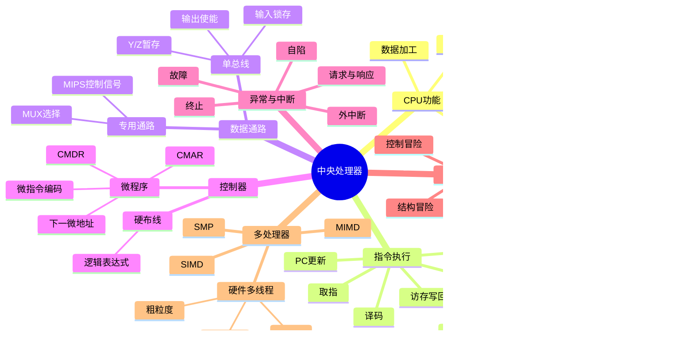

# 计算机组成原理 第5章 中央处理器

> 来源：`408/27王道《计算机组成原理》高清带书签.pdf`，第5章 p207-p285。
> 复核：本轮重新读取教材 p207-p285、14 份基础课件、期中/期末卷与解析、P4/P5、五段式流水线专题和强化考试，共 21 组 369 页；252 页补做 OCR，并直接查看全部 70 张联系图及 48 张关键原页，覆盖正文、图表、公式、习题和真题解析。

## 本章速览

- CPU 的主线：取指和译码、执行、访存/写回、PC 更新、异常和中断处理，所有动作都由控制器按时序发出微操作信号。
- 数据通路负责“数据怎么走”，控制器负责“什么时候让谁走”；总线结构省硬件但慢，专用数据通路并行度高但硬件复杂。
- 控制器两大类：硬布线控制器速度快、修改难；微程序控制器把控制逻辑存入控制存储器，规整但速度通常慢。
- 异常是 CPU 内部同步事件，中断是外设异步事件；故障通常返回当前指令重执行，自陷和外中断通常返回下一条指令。
- 流水线提高吞吐率而非缩短单条指令执行时间；考点集中在 `T=(k+n-1)Δt`、结构/数据/控制冒险、转发和 load-use。
- 多处理器按 Flynn 分为 SISD/SIMD/MISD/MIMD；硬件多线程、多核和 SMP 容易在“是否真正并行、共享什么资源”上出题。

## 课件补充来源

- 基础考点讲解：`5.1 CPU的功能和基本结构.pdf`、`5.2 指令执行过程.pdf`、`5.3_1 数据通路-单总线结构.pdf`、`5.3_2 数据通路-专用通路结构.pdf`。
- 基础考点讲解：`5.4.1 硬布线控制器.pdf`、`5.4.2 微程序控制器的基本原理.pdf`、`5.4.3 微指令的设计.pdf`、`5.4.4 微程序控制单元的设计.pdf`。
- 基础考点讲解：`5.6_1 指令流水线的基本概念和性能指标.pdf`、`5.6_2 指令流水线的影响因素和分类.pdf`、`5.6_3 五段式指令流水线.pdf`。
- 基础考点讲解：`5.7_1 多处理器基本概念.pdf`、`5.7_1 多处理器基本概念骚图.pdf`、`5.7_2 硬件多线程.pdf`。
- 阶段卷：`计算机组成原理期中试卷及答案解析（学员版）.pdf`、`计算机组成原理期末试卷及答案解析（学员版）.pdf`。
- 强化资料：`计组P5_一条指令的执行.pdf`、`计组P4_一堆指令的执行.pdf`、`【录播】五段式指令流水线题型总结.pdf`、`计组强化课考试_试题+答案.pdf`。

## 关联导航

- 本章内部：[[05-中央处理器#5.2 指令执行过程|指令执行过程]]、[[05-中央处理器#5.3 数据通路的功能和基本结构|数据通路]]、[[05-中央处理器#5.4 控制器的功能和工作原理|控制器]]、[[05-中央处理器#5.6 指令流水线|指令流水线]]。
- 同科联动：[[04-指令系统#4.3 程序的机器级代码表示|机器级代码]]、[[03-存储系统#3.5 高速缓冲存储器 Cache|Cache]]、[[07-输入输出系统#7.3 I/O 方式|I/O 方式]]。
- 跨科联动：[[408/408考研笔记/操作系统/01-计算机系统概述#1.3 操作系统的运行环境|OS 运行环境中的中断/异常]]。

## 知识网络

## 知识点清单

### 5.1 CPU 的功能和基本结构

#### 5.1.1 CPU 的功能

- 指令控制：按程序顺序取指、分析指令、形成下一条指令地址，遇到转移指令时改写 PC。
- 操作控制：把一条指令分解为若干微操作，并产生控制信号驱动数据通路。
- 时间控制：为取指、译码、执行、访存、写回等操作安排先后次序。
- 数据加工：由 ALU、移位器等完成算术和逻辑运算。
- 中断/异常处理：检测异常和中断请求，保存断点和状态，转入服务程序，必要时返回原程序。

#### 5.1.2 CPU 的基本结构

- 运算器：ALU、移位器、暂存寄存器、标志寄存器等，完成数据加工并产生状态标志。
- 控制器：指令寄存器 IR、指令译码器 ID、程序计数器 PC、时序系统、微操作信号发生器等。
- 寄存器组：通用寄存器、PC、IR、MAR、MDR、PSW/FR 等，保存地址、指令、数据和状态。
- 内部总线：连接寄存器、ALU、控制器等；外部通过地址总线、数据总线、控制总线访问主存和 I/O。
- 注意：地址译码器通常属于存储器系统，不属于 CPU 内部结构。

#### 5.1.3 CPU 中的寄存器

- PC：保存下一条待取指令地址；顺序执行时加上当前指令所占字节数，并非固定 `+1`，转移时装入目标地址。宽度通常等于地址总线宽度。
- IR：保存当前正在执行的指令，供译码器分析；宽度通常等于指令字长，程序员不可见。
- GPR：通用寄存器，存放操作数、地址和中间结果，通常对程序员可见。
- MAR：存放主存访问地址，位数反映可寻址主存单元数，和地址总线宽度相关。
- MDR：暂存主存读出或准备写入主存的数据，位数通常和数据总线宽度相关。
- PSW/FR：保存条件码、溢出、进位、中断允许、运行状态等；并非所有位都对程序员透明。
- 用户可见寄存器：能被机器指令直接或间接寻址的寄存器，主要是 GPR 和部分状态/控制寄存器；IR、MAR、MDR 通常仅供 CPU 内部使用。PC、PSW 是否归入“用户可见”须按教材口径和具体指令系统判断，不能把“程序运行会改变”当成“可由普通指令任意访问”。
- 课件补充：CPU 可拆成“控制器 + 数据通路”两条线理解；数据通路执行运算和传送，控制器根据 IR、PSW/标志、时序信号产生控制信号。
- 常用标志：`ZF` 判零，`SF` 判符号，`OF` 判有符号溢出，`CF` 判无符号进位/借位；有符号加减主要看 `OF/SF/ZF`，无符号加减主要看 `CF/ZF`。

#### 5.1.4/5.1.5 本节习题精选与答案解析吸收

- PC 不是“当前指令地址”的固定同义词，取指后通常已指向下一条指令。
- “机器字长”常等于 ALU 宽度和通用寄存器宽度；存储字长、指令字长可不同。
- 若指令按字对齐且按字寻址，PC 所需位数可小于按字节地址空间直接计数的位数。
- CPU 访存时通过 MAR/MDR 和总线完成，不能把地址译码器误认为 CPU 寄存器。

### 5.2 指令执行过程

#### 5.2.1 指令执行的一般流程

- 取指：PC 给出指令地址，访问主存或 Cache，取出的指令送 IR，同时 PC 更新。
- 译码：ID 分析操作码、寻址方式、寄存器字段、立即数等，形成控制信息。
- 取操作数：从寄存器、主存或立即数字段取得操作数。
- 执行：ALU 或功能部件完成运算、地址计算、转移条件判断等。
- 存结果：结果写回寄存器或主存。
- 中断/异常检查：执行结束或检测到异常时，保存断点和现场，PC 转入处理程序入口。
- 强化课做题线：先判断指令类型，再追“数据从哪里来、经过哪些部件、最后到哪里”；数据传送类看主存/寄存器方向，运算类看 ALU 和标志位，转移类看条件判断和 PC 更新。
- 取指固定骨架：`PC -> MAR`，读存储器，`M(MAR) -> MDR -> IR`，同时或随后完成 `PC+1/PC+指令长度 -> PC`；若题中按字节编址、变长指令或分支目标另给，要按题设修正。

#### 5.2.2 CPU 的时序控制

- 时钟周期：CPU 最基本的时间单位，由数据通路中组合逻辑最大延迟等决定。
- 机器周期：早期常把一次主存访问或一个基本操作阶段作为机器周期；现代 CPU 中该概念弱化。
- 节拍/工作脉冲：在一个机器周期内进一步划分操作先后。
- 传统层级：`指令周期 -> 若干机器周期/CPU 周期 -> 若干时钟周期（节拍）`；不同指令所含机器周期数、同一机器周期所含节拍数都可能不同。
- 控制信号必须满足稳定时间和先后关系，不能只看“逻辑上需要”，还要看“总线和寄存器是否同时可用”。

#### 5.2.3 指令周期的基本概念

- 指令周期：一条指令从取出到执行完成所经历的全部时间。
- 教材传统流程：取指周期 -> 可选间址周期 -> 执行周期 -> 可选中断周期；各周期可由状态触发器标识。现代五段式常写成取指、译码/读寄存器、执行/计算地址、访存、写回。
- 不同指令的指令周期可不同；同一 CPU 内时钟周期通常固定。
- 指令周期和时钟周期关系取决于处理器结构：单周期中一条指令一个长时钟周期，多周期/流水线中一条指令跨多个时钟周期。
- 中断周期不是执行中断服务程序本身，而是硬件保存断点、形成/取得服务程序入口并转入该入口的阶段。

#### 5.2.4 处理器指令执行模型

- 单周期模型：一条指令在一个时钟周期内完成，周期由最慢指令决定，控制简单但硬件利用率低。
- 多周期模型：把指令分成多个阶段，每阶段一个或多个时钟周期，可复用硬件，周期较短。
- 流水线模型：多条指令在不同阶段并行推进，提高吞吐率，但会引入冒险和流水段寄存器开销。

#### 5.2.5/5.2.6 本节习题精选与答案解析吸收

- CPU 区分“指令还是数据”主要靠取用时机和送入部件：取指阶段送 IR，执行/访存阶段作为数据送寄存器或 ALU。
- 不能说指令和数据在内存中的二进制形式本身可区分；冯诺依曼结构下二者都以二进制存储。
- 外中断通常在一条指令执行完后响应，异常可在当前指令执行过程中触发。
- 中断周期常见任务：保存断点、形成中断服务程序入口地址、关中断；“中断隐指令”指硬件完成的一组操作，不是指令系统里的一条普通指令。

### 5.3 数据通路的功能和基本结构

#### 5.3.1 数据通路的功能

- 数据通路是 CPU 内部数据传送和处理的路径，包括寄存器、ALU、总线、MUX、存储器接口等。
- 控制器通过控制信号决定数据源、数据目的、ALU 功能、寄存器写使能、存储器读写等。

#### 5.3.2 数据通路的组成

- 组合逻辑元件：ALU、加法器、译码器、MUX、三态门等，无状态，输出由当前输入决定。
- 时序逻辑元件：PC、IR、MAR、MDR、GPR、PSW、流水段寄存器等，需要时钟触发保存状态。
- 数据通路不是单纯“连线”，寄存器写入、ALU 运算、总线驱动都必须有控制信号配合。

#### 5.3.3 数据通路的组织与分类

- 按连接方式：
  - 总线数据通路：部件共享公共总线，结构简单、扩展方便，但同一时刻通常只允许一组数据传输。
  - 专用数据通路：部件间用专用连线，多路并行传输，效率高，但布线复杂、成本高、扩展差。
- 按时序组织：
  - 单周期数据通路：每条指令一个周期完成，周期由最慢指令决定。
  - 多周期数据通路：一条指令拆成多个阶段，提高硬件复用率。
  - 流水线数据通路：阶段间用流水段寄存器隔开，多条指令重叠执行。

#### 5.3.4 单总线结构的数据通路

- 单总线特点：所有内部数据传输共享一条总线，同一时刻只能一个部件输出到总线，可多个部件同时接收。
- 三态门/输出使能控制谁驱动总线，输入使能控制谁锁存总线数据。
- Y 寄存器：暂存 ALU 的一个输入，因为单总线不能同时给 ALU 两个输入。
- Z 寄存器：暂存 ALU 输出，因为 ALU 输出时总线可能正被其他传输占用。
- `rs`、`rd` 若各 4 位，可寻址 `2^4=16` 个通用寄存器。
- 典型取指微操作：
  - `PCout, MARin`：PC 经总线送 MAR。
  - `Read, MDRin`：读主存，数据进入 MDR。
  - `MDRout, IRin`：MDR 内容送 IR。
- 若还要完成 `(PC)+1 -> PC`，在单总线下要考虑总线冲突，常需借助 ALU、Y/Z 等暂存器分节拍完成；主存读出若慢于 CPU，还要等待存储器完成信号，不能把一次访存强塞进一个节拍。
- IR、FR/PSW 的输出常送控制器输入，用于译码和条件判断；控制信号由 CU 产生。
- 单总线并发判定：同一节拍只能有一个部件 `out` 驱动总线，但可有多个部件 `in` 锁存同一总线数据；若两个来源都想上总线，必须拆节拍。
- 读图题抓手：`PCout/MDRout/Rout` 是“谁送出”，`MARin/IRin/Rin` 是“谁接收”，`MDRinE/MDRoutE` 常表示 MDR 与外部数据总线之间的输入/输出。
- 写控制序列时先写寄存器传送语句，再反推 `out/in/ALU` 控制信号；微操作必须按数据依赖先后排列，不冲突的接收动作才可并行。

#### 5.3.5 专用结构的数据通路

- 专用数据通路用点到点连线连接寄存器堆、ALU、存储器等，减少总线竞争。
- 单周期 MIPS 数据通路常把指令存储器和数据存储器分开，不设置 IR，控制信号在一个周期内保持有效。
- 单周期数据通路中一条指令不能在同一周期重复使用同一功能部件，因此常为取指与数据访存配置独立存储器、为 PC 自增和 ALU 运算配置独立加法器；周期由最慢指令决定。
- 常见控制信号：
  - `RegDst`：选择写回寄存器编号，R 型选 `rd`，I 型/LOAD 选 `rt`。
  - `ALUSrc`：选择 ALU 第二操作数，R 型选寄存器 `rt`，I 型/访存选扩展立即数。
  - `ExtOp`：立即数扩展方式，算术常符号扩展，逻辑常零扩展。
  - `MemtoReg`：写回数据来源，ALU 结果或数据存储器读出值。
  - `RegWr`、`MemWr`：寄存器写使能、数据存储器写使能。
  - `Branch`、`Jump`、`Zero`：共同决定 PC 是否转向分支或跳转目标。
- LOAD/STORE 地址计算：`R[rs] + SignExt(imm16)`；LOAD 将内存数据写 `rt`，STORE 将 `rt` 内容写入内存。
- 单周期处理器不能采用单总线结构，因为一个时钟周期内要完成多次并行或连续传送，而单总线一次只能传一组数据。
- 专用通路简答题：说明某指令数据通路时按“地址形成 -> 访存/运算 -> 写回/写存储器”写箭头，例如 `ADD Y` 可概括为 `Y -> MAR`、`M(MAR) -> MDR`、`MDR/ACC -> ALU`、`ALU -> ACC`。
- 控制信号判题：先沿题图逐段追箭头，再看目的寄存器字段选 `rt/rd`、ALU 第二操作数选寄存器还是立即数、写回来源选 ALU 还是存储器；控制信号命名和高低有效值以题图为准，不能死背固定表。

#### 5.3.6/5.3.7 本节习题精选与答案解析吸收

- 看数据通路题先分清：哪一段是组合逻辑，哪一段必须等时钟边沿写入寄存器。
- 单总线题常考“为什么需要 Y/Z 暂存器”和“哪些控制信号可同一节拍发出”。
- 专用 MIPS 数据通路题常考 `RegDst/ALUSrc/MemtoReg` 的选择和 LOAD/STORE 数据方向。
- 控制信号既可能控制数据通路上的 MUX，也可能控制寄存器写入、存储器读写和 ALU 功能。

### 5.4 控制器的功能和工作原理

#### 5.4.1 控制器的结构和功能

- 控制器输入：IR 中的操作码、时序信号、条件标志、异常/中断请求等。
- 控制器输出：寄存器输入/输出使能、ALU 控制、存储器读写、PC 更新、总线控制等。
- 控制器任务：根据当前指令和状态，在正确时刻发出正确微操作命令。

#### 5.4.2 硬布线控制器

- 由组合逻辑和时序电路直接产生控制信号。某控制信号是“操作码译码结果、机器周期状态、节拍、条件标志”的布尔函数，可写成若干乘积项之和，如公共取指信号可形如 `C1=FE·T0`。
- 设计顺序：列出各指令周期 -> 写每周期微操作 -> 选择实现电路 -> 安排节拍 -> 写控制信号逻辑表达式并画电路。
- 节拍安排原则：按依赖顺序；同一受控对象的冲突操作分开；在一个节拍内尽量完成完整微操作；互不冲突且相容的微操作可并行。
- 优点：速度快，常适合指令格式规整、控制简单的 RISC。
- 缺点：设计和修改困难，指令系统复杂时控制逻辑庞大。
- “RISC 常硬布线、CISC 常微程序”只是典型倾向，不是绝对对应关系。

#### 5.4.3 微程序控制器

- 基本思想：把一条机器指令对应的控制过程写成微程序，存入控制存储器 CM；CM 还保存各指令共享的取指、间址、中断等微程序。
- 层级关系：一条机器指令 -> 一个微程序 -> 多条微指令 -> 若干微命令 -> 微操作。
- 微命令：控制部件发出的最基本控制信号；可分为相容性微命令和互斥性微命令。
- 微指令：若干相容微命令的集合，通常含操作控制字段和顺序/下地址字段，一条可并行发出一个或多个微命令。
- 微周期：执行一条微指令所需的基本时间，通常对应一个时钟周期或控制节拍。
- 主存和控制存储器区别：
  - 主存：存程序和数据，通常在 CPU 外部，多用 RAM。
  - 控制存储器 CM：存微程序，位于 CPU 内部，多用 ROM 或可写控制存储器。
- 地址/数据寄存器对应关系：
  - 主存：MAR 存主存地址，MDR 存主存读写数据。
  - 控存：CMAR/μPC 存微地址，CMDR/μIR 存读出的微指令。
- 下一微地址形成：`μPC+1` 顺序执行；微指令显式给出下地址（断定法/下地址法）；根据条件测试选择分支；由机器指令 OP 形成执行微程序入口；取指/中断等入口也可由专门硬件形成。
- 微程序控制器工作闭环：`CMAR/μPC` 给出微地址 -> 控存 CM 读出微指令 -> `CMDR/μIR` 保存微指令 -> 操作控制字段发微命令 -> 顺序控制字段、标志和 OP 共同形成下一微地址。
- 公共微程序段：取指、间址、中断等周期的微指令序列常被多条机器指令共享；执行周期微程序通常随操作码不同而不同。
- 微指令编码：
  - 直接编码：每位直接控制一个微命令，并行强、字长长。
  - 字段直接编码：同字段放互斥微命令，不同字段可发相容微命令；每组留“无操作”状态，总控制字段位数为 `Σceil(log2(ni+1))`。
  - 字段间接编码：某字段含义受另一字段解释，字长更短但译码最慢。
  - 以上三种都属于水平型微指令编码；垂直型则更接近机器指令格式。
- 微指令格式：
  - 水平型：一条微指令可并行发出多个微命令，速度快、字长长、编写难。
  - 垂直型：类似机器指令，编码紧凑、易写，但并行性弱、执行慢。
  - 混合型：以垂直型编码为主，再增加少量并行控制位，折中并行性与字长。

#### 5.4.4/5.4.5 本节习题精选与答案解析吸收

- 微程序不是普通软件程序：程序由软件开发者编写，存主存或辅存；微程序由体系结构设计者编写，固化在控制存储器中。
- 微命令和微操作不是一回事：微命令是控制信号，微操作是执行部件收到信号后发生的实际动作。
- 硬布线控制器中也可以讨论“微命令/微操作”，区别在于控制信号不是从微指令中取出。
- 水平型微指令字长长但并行强；垂直型微指令短但常需更多微指令完成同一任务。
- 微指令字长题：先算操作控制字段；若题目给测试/转移方式，再算判别字段；下地址字段至少能寻址全部控存单元，位数为 `ceil(log2(控存字数))`。若由“机器指令数 × 每条平均微指令数”估控存容量，公共取指/间址/中断微程序只能按实际份数计，不能对每条指令重复相加。
- 微程序控制单元设计题：先列每个机器周期的微操作，再补“取下一条微指令”的控制；断定法题要看下地址字段是否直接给出完整微地址，不能把其位数误算成条件种类数。
- 静态微程序多用 ROM 固化，动态微程序可修改控存内容；毫微程序是再用更低层“毫微指令”解释微指令，408 记概念和层级即可。

### 5.5 异常和中断机制

#### 5.5.1 异常和中断的基本概念

- 异常也称内中断：CPU 执行当前指令时由内部检测到的同步事件，如除零、非法操作码、缺页、溢出；同一程序在相同条件下通常可重现。
- 中断也称外中断：由外设或外部事件异步发起，如 I/O 完成、定时器、键盘输入、打印机缺纸。
- 异常与当前指令有确定关系，可由硬件错误检测或软件指令主动触发；外中断和当前指令无直接关系，CPU 通常只在指令边界采样并响应。
- 响应后 CPU 暂停当前程序，保存现场，转去执行处理程序；处理完成后可能返回，也可能终止进程。
- 异常/中断识别：MIPS 常由异常状态寄存器保存原因，先跳到统一入口再由软件分派；x86 常由硬件根据中断号/向量号找到对应处理入口。

#### 5.5.2 异常和中断的分类

- 异常分类：
  - 故障 Fault：在指令完成前检测到，若可恢复，处理后重执行引发故障的当前指令，如缺页。
  - 自陷 Trap：预先安排的主动陷入，指令正常完成后触发，如系统调用、断点、单步跟踪，返回下一条指令。
  - 终止 Abort：严重硬件或系统错误，通常不能定位到某条确定指令且不可恢复，如总线错误、严重校验错误。
- 中断分类：
  - 可屏蔽中断 INTR：受中断允许位和中断屏蔽字控制，可被暂时屏蔽。
  - 不可屏蔽中断 NMI：高优先级硬件事件，不能被普通软件屏蔽。
  - 向量中断：为中断源分配类型号，按类型号查中断向量表取得服务程序入口；中断向量是入口地址，向量地址是表中存放该向量的地址，二者勿混。
  - 非向量中断：由软件查询或轮询确定中断源。
  - 单重中断：服务期间不允许新的中断嵌套。
  - 多重中断：允许高优先级中断打断低优先级服务程序。

#### 5.5.3 异常和中断响应过程

- 外设“提出中断请求”不等于 CPU 已响应；CPU 要在当前指令结束后检查中断允许、屏蔽字和优先级，条件满足才响应。NMI 或某些高优先级异常不受普通可屏蔽中断关闭影响。
- 基本步骤：检测请求/异常 -> 关可屏蔽中断 -> 保存断点和 PSW -> 识别类型/中断源 -> 形成并装入处理程序入口 -> 软件保存通用寄存器现场并处理 -> 恢复现场并返回。
- 断点规则：
  - 故障：保存当前指令地址，处理后重执行当前指令。
  - 自陷：保存下一条指令地址，处理后从下一条继续。
  - 外中断：通常保存下一条指令地址，因为在当前指令结束后响应。
  - 终止：通常不返回原程序。
- 页故障、缺页：属于故障，处理后重执行发生缺页的访存指令。
- DMA 完成、打印机缺纸、键盘输入：属于外部中断，断点一般为下一条指令。
- 中断响应硬件动作常称中断隐指令：关中断、保存断点/PSW、识别或形成服务程序入口；保存通用寄存器、设置新屏蔽字和恢复完整现场通常由中断服务程序完成。
- 响应优先级通常由硬件排队/判优决定“先响应谁”；处理优先级由中断屏蔽字决定“服务期间允许谁打断谁”，两者可不同。

#### 5.5.4/5.5.5 本节习题精选与答案解析吸收

- “中断”狭义上多指外中断；“异常”是内部事件，不能把缺页误判为外中断。
- 系统调用属于自陷，断点为系统调用指令的下一条；缺页属于故障，断点为缺页指令本身。
- 是否可恢复决定处理后能否返回原程序；故障不一定都可恢复，终止通常不可恢复。
- 响应外中断不打断当前指令的执行，异常可能在指令执行过程中被检测。

### 5.6 指令流水线

#### 5.6.1 指令流水线的基本概念

- 时间并行：把一条指令划分为多个阶段，多条指令在不同阶段重叠执行，即流水线。
- 空间并行：配置多个功能部件，同时处理多个操作，如超标量。
- 典型五段流水线：
  - IF：取指。
  - ID：译码/读寄存器。
  - EX：执行或计算有效地址。
  - MEM：访存。
  - WB：写回寄存器。
- 指令集利于流水线的特征：定长指令、规整格式、LOAD/STORE 架构、操作数边界对齐。
- 流水线提高单位时间完成指令数，不缩短单条指令在流水线中的总延迟。

#### 5.6.2 流水线的基本实现

- 设计原则：
  - 流水段数量以最复杂指令所需功能段为准。
  - 流水段时长以最慢阶段为准。
  - 阶段间设置流水段寄存器，保存控制信号和中间结果。
- 理想 k 段流水线连续执行 n 条指令：
  - 总时间：`T=(k+n-1)Δt`。
  - 加速比：`S=kn/(k+n-1)`，n 很大时趋近 k。
  - 吞吐率：`TP=n/T`，理想最大值趋近 `1/Δt`。
  - 效率：`E=有效占用的时空区/总时空区=S/k=n/(k+n-1)`，n 很大时趋近 1。
- 若各段延迟不均或流水段寄存器开销较大，实际周期会变长；流水段越多不一定越快。
- 实际流水周期：`Δt = max(各段组合逻辑延迟) + 流水段寄存器延迟`；性能题若给寄存器开销，不能只取最长功能段。
- 表示方法：指令流程图主要用来分析冒险和资源冲突，时空图主要用来算总时间、吞吐率、加速比和效率。

#### 5.6.3 MIPS 指令集的流水段分析

- `lw` 最完整：IF -> ID -> EX 计算地址 -> MEM 读内存 -> WB 写寄存器。
- ALU/R 型和 I 型运算：通常不真正访问数据存储器，但为了统一 5 段，可在 MEM 段空过，再 WB。
- `sw`：IF -> ID -> EX 计算地址 -> MEM 写内存，无 WB。
- 条件分支：EX 判断条件并计算目标地址，若到 MEM 末才更新 PC，会造成控制冒险延迟。
- `j`：只需形成目标 PC，后续阶段可视为空段。
- 原则：同一功能部件在不同指令中尽量固定在同一流水段使用，避免结构冲突。

#### 5.6.4 流水线的冒险与处理

- 结构冒险：不同指令在同一周期实际争用同一功能部件；仅有同名阶段不代表冲突，必须看该指令是否真的使用该资源。
  - 例：统一存储器中，某条 LOAD 的 MEM 阶段访存和后一条指令 IF 阶段取指冲突。
  - 处理：暂停、分离指令/数据 Cache、增加端口或复制资源、固定资源使用阶段。
- 数据冒险：后续指令需要前面指令尚未产生或写回的结果。
  - RAW：写后读，后指令读前指令将写的值；按序流水线最常见。
  - WAR：读后写，后指令提前写，破坏前指令要读的旧值；多见于非按序执行。
  - WAW：写后写，后指令提前写，导致最终值不是程序顺序最后写入者；多见于非按序执行。
- RAW 处理：
  - 暂停/插入 nop：等前一指令结果安全可读。
  - 转发/旁路：把 EX/MEM 或 MEM/WB 中间结果直接送 ALU 输入。
  - 编译器调度：重排无关指令填空。
- load-use 冒险：LOAD 紧跟使用其结果的运算指令时，即使有转发也常需停顿一拍，因为数据到 MEM 后才可用。
- 强化题判 RAW：从前往后看，若前一条或前几条指令“写”某寄存器，后续相邻指令在 ID/EX 需要“读”同一寄存器，就有数据冒险；按序发射、按序完成的五段流水线通常只考 RAW。
- 无转发时：读寄存器指令的 ID 段必须等到写寄存器指令 WB 段之后；若题设“前半周期写、后半周期读”，可少等半拍/一拍，按题目画时空图。
- 有转发时：大多数 ALU-ALU RAW 可旁路解决；`lw` 的结果到 MEM 末才产生，紧邻后一条使用时通常仍需阻塞 1 个周期。
- 控制冒险：转移、返回、中断、异常导致 PC 改变。
  - 处理：暂停/插泡、延迟分支、提前计算分支条件和目标地址、静态/动态分支预测、预取目标指令；预测错后清空错误路径并从正确 PC 重新取指。
  - Cache 缺失、中断和异常也可能造成流水线阻塞或清空。
- 控制冒险题先找改变 PC 的指令：条件分支、无条件跳转、调用/返回、异常/中断；若题设分支阻塞 3 拍，要把每条实际执行的转移指令都计入。

#### 5.6.5 高级流水线技术

- 超标量流水线技术（动态多发射）：每个时钟周期可并发发射多条独立指令，需要多个功能部件和动态调度，理想 CPI 可小于 1。
- 超长指令字 VLIW（静态多发射）：编译器把可并行操作打包进一条长指令，硬件控制相对简单，但依赖编译器且兼容性较弱。
- 超流水线技术：进一步细分流水段以缩短时钟周期，提高主频；流水段寄存器和控制复杂度增加，不是越深越好。
- 基本流水线满载后 CPI 可接近 1；多发射超标量满载时 CPI 可小于 1。
- 流水线分类补充：部件功能级/处理机级/处理机间按层次分，单功能/多功能按能完成的功能分，静态/动态按同一时刻连接方式分，线性/非线性按是否有反馈回路分。

#### 5.6.6/5.6.7 本节习题精选与答案解析吸收

- 流水线不等于空间并行；空间并行由多个功能部件支持，常见于超标量或 SIMD/MIMD。
- 只有精简指令集才能流水线是错误说法；复杂指令也可流水，但规整指令集更适合。
- 流水线计算题先确定段数 k、指令数 n、段时长 `Δt`，再套 `T=(k+n-1)Δt`；若有停顿，要额外加停顿周期。
- 若寄存器堆“前半周期写、后半周期读”，某些 RAW 可少停一拍。
- 分支延迟周期为 C 且预测错误，通常损失 C 个时钟周期。

### 5.7 多处理器的基本概念

#### 5.7.1 SISD、SIMD、MIMD 的基本概念

- SISD：单指令流、单数据流，传统串行处理器；可采用流水线提升吞吐。
- SIMD：单指令流、多数据流，同一条指令同时作用于多个数据，适合规则、同构数据处理；向量处理器是典型实现。
- MISD：多指令流、单数据流，理论上存在，实际很少使用。
- MIMD：多指令流、多数据流，多个处理单元执行不同程序或线程，是主流并行计算模型。
- MIMD 两类：
  - 多计算机系统：各节点私有存储器和独立地址空间，通过消息传递通信。
  - 多处理器系统：共享存储器和统一物理地址空间，通过共享变量通信。
- 总体对比：SIMD 适合数据级并行，MIMD 适合线程级或任务级并行，适用范围更广。

#### 5.7.2 硬件多线程的基本概念

- 硬件多线程让处理器为多个线程保存独立寄存器组、PC 等关键状态，减少线程切换开销。
- 细粒度多线程：每个时钟周期切换线程，交替发射不同线程指令，提升部件利用率。
- 细粒度同一周期通常仍只发射一个线程的指令，只是连续周期来自不同线程，提供线程级并行而非同周期多线程发射。
- 粗粒度多线程：连续执行同一线程，遇到长延迟事件（如 Cache 缺失）才切换；被阻塞流水线需清空、切换后需重填，开销较大。
- 同时多线程 SMT：同一周期可发射多个线程的多条指令，既利用指令级并行也利用线程级并行。
- Hyper-Threading 是 SMT 的典型代表：一个物理核心呈现为多个逻辑处理器，但不是增加真正物理核心。
- 对比抓手：细粒度“每拍换线程”，粗粒度“遇长延迟才换”，SMT“同一拍多个线程可同时发射”；三者都不是增加物理核心。

#### 5.7.3 多核处理器的基本概念

- 多核处理器把多个独立处理单元集成在一个 CPU 芯片上，每个核心可独立执行线程。
- 多核能提升多线程程序或多任务吞吐；单线程程序若无法并行，不一定加速。
- 各核心可有私有 L1/L2 Cache，也可共享更高层 Cache；Cache 一致性是重要问题。
- 双核是一个芯片上有两个核心，不等于主板上有两个 CPU。
- 多核通过增加处理单元数量实现任务级并行；向量处理器通过一条指令处理多数据实现数据级并行。

#### 5.7.4 共享内存多处理器的基本概念

- SMP：多个处理器共享单一物理地址空间，所有 CPU 可用普通访存指令访问共享内存并通过共享变量通信；“对称”还表示各处理器地位和功能基本对等。
- 操作系统仍可为各进程提供独立虚拟地址空间，再映射到统一物理地址空间。
- UMA：统一存储访问，访问任意内存单元延迟基本相同。
- NUMA：非统一存储访问，访问延迟与请求 CPU 和目标内存物理位置有关。
- SMP 关注点：共享内存带宽、总线/互连瓶颈、Cache 一致性、同步互斥开销。

#### 5.7.5/5.7.6 本节习题精选与答案解析吸收

- 多核处理器属于 MIMD，不是 SIMD。
- 超线程模拟多个逻辑处理器，不能等同于真正双核。
- 多核 CPU 的多个核心主频通常相同；“2.4GHz 双核”不是两个核心主频相加。
- 只有支持并行的程序才能利用多核加速；单线程程序不会因核心数增加自动变快。
- 多任务系统可运行在单核 CPU 上，宏观并行、微观串行。

### 5.8 本章小结

- 指令和数据在主存中都以二进制存储，区别来自 CPU 在不同阶段对它们的解释和流向。
- 指令周期是完成一条指令的全部时间；时钟周期是 CPU 操作的基本节拍；二者关系由单周期、多周期或流水线结构决定。
- 微指令是微程序控制器中的基本控制单位，微命令是控制信号，微操作是执行动作。
- 流水线的优势是提高吞吐率，不是缩短单条指令延迟；实际效率受段不均、冒险、寄存器开销影响。

### 5.9 常见问题和易混淆知识点

- 流水段越多不一定越快：
  - 段数增加会引入更多流水段寄存器延迟。
  - 段数越多，冒险停顿和预测错误损失越明显。
  - 控制逻辑更复杂，可能形成新的性能瓶颈。
- WAR 与 WAW 主要出现在非按序执行流水线：
  - WAR：前指令还未读，后指令先写同一寄存器，前指令读到新值。
  - WAW：两条指令写同一寄存器，后指令先写，导致最终值顺序错误。
- 按序发射、按序完成的经典五段流水线通常只重点考虑 RAW；乱序执行还要处理 WAR/WAW，常用寄存器重命名。
- 判断断点位置：
  - 缺页/故障：当前指令。
  - 系统调用/自陷：下一条指令。
  - 外中断：下一条指令。
- 判断处理器并行类型：
  - 一条指令处理多数据：SIMD。
  - 多个线程/任务独立执行：MIMD。
  - 一个核心模拟多个逻辑线程：SMT，不等于多核。

## 易错点/易混点

- CPU 功能题不要漏“异常和中断处理”“时间控制”；CPU 结构题不要把地址译码器算进 CPU。
- PC 保存下一条待取指令地址是常态，但异常/转移/中断会改变 PC；题目问“断点”时要看事件类型。
- 指令和数据不能靠内存中的二进制内容区分，而靠 CPU 控制信号、阶段和目的寄存器区分。
- 单周期处理器周期由最慢指令决定；单周期 MIPS 常用专用数据通路，不能用单总线完成所有操作。
- 单总线中 ALU 两输入和输出都可能受总线限制，因此需要 Y/Z 等暂存寄存器。
- 硬布线控制信号不只由操作码决定，还同时受机器周期、节拍和条件标志影响；安排微操作时先查数据依赖和受控对象冲突。
- 微程序控制器中 CM 在 CPU 内部，通常存微程序；主存存机器程序和数据，二者不要混。
- 字段直接编码微指令时，互斥微命令分组必须留“无操作”码，因此不是简单 `log2(n)`，而是看 `n+1`。
- 下地址字段要能覆盖全部控存地址；断定法中的完整下地址、条件测试字段和 OP 形成入口是三种不同口径。
- 故障、自陷、终止不是按严重程度随意分类，而是按发生时机和返回方式分类。
- 中断请求不等于中断响应；向量、向量号和向量地址也不是同一概念，题目必须逐词判断。
- 流水线加速比公式默认“无冒险、无停顿、段时长相等”；实际题若给停顿必须加上。
- 结构冒险看两条指令是否在同周期真实使用同一资源，不能只凭都经过 MEM 阶段就判冲突。
- 转发不能解决所有 RAW，典型 load-use 仍可能需要停顿。
- 五段式流水线题不要只看相邻两条：无转发时，后一条读寄存器可能要等到前面写回；有转发时仍要单独检查 load-use。
- 结构冒险本质是硬件资源冲突，不是数据依赖；分离 I-Cache/D-Cache 可消除取指和访存冲突。
- 控制冒险不只来自条件分支，也可来自跳转、返回、异常和中断。
- 超标量是多发射，超流水线是加深流水段，VLIW 是编译器静态打包；三者不要混。
- 多核、SMP、SMT 都和并行有关，但共享层次不同：多核是真实核心，SMT 是逻辑线程，SMP 是共享物理地址空间的多处理器系统。

## 课件补充/强化题规则

- 一条指令硬件实现题：先拆成取指、译码、执行/访存、写回、PC 更新；再把每一步写成“源部件 -> 中间部件 -> 目的部件”，最后补控制信号。
- 单总线微操作题：同一节拍只能一个输出信号有效，多个输入信号可同时有效；ALU 若要两个输入，通常先把一个操作数锁存到 Y，结果先放 Z。
- 专用数据通路题：LOAD 看“地址计算 + 读存储器 + 写 rt”，STORE 看“地址计算 + rt 写存储器”，分支看“比较/Zero + 目标地址 + PC 选择”。
- MIPS 控制信号题：R 型常 `RegDst=1, ALUSrc=0, MemtoReg=0, RegWr=1`；`lw` 常 `RegDst=0, ALUSrc=1, MemtoReg=1, RegWr=1`；`sw` 写存储器不写寄存器；`beq` 依赖 `Branch` 和 `Zero` 选 PC。
- 微指令编码题：直接编码用 1 位对应 1 个微命令；字段直接编码把互斥命令放同段、相容命令放不同段，并为“不操作”留码，字段位数按 `ceil(log2(n+1))` 判断。
- 微程序设计题：CMAR 取地址、CMDR/μIR 存微指令；先算控制字段，再算判别字段和可寻址全部控存的下地址字段；当前下地址、OP 译码、条件标志和专门硬件共同形成下一微地址。
- 异常/中断题：先分内部同步异常还是外部异步中断，再判返回点；故障重做当前指令，自陷/外中断通常回下一条，终止通常不返回。
- 中断优先级题：先按硬件响应优先级选本次响应源，再按屏蔽字判断服务期间谁能嵌套；提出请求、允许响应和实际处理是三个时刻。
- 五段流水线题：先画 IF/ID/EX/MEM/WB 基准时空图，再逐一加结构、数据、控制停顿；题设“无转发/有转发/分支阻塞几拍”比默认经验更优先。
- 数据冒险题：核心是“前写后读同一寄存器”；转发可解决多数 ALU 结果依赖，但不能消掉紧邻 load-use 的 1 拍。
- 控制冒险题：只要指令可能改变 PC 就要警惕；分支、跳转、调用/返回、异常/中断都可能导致流水线清空或阻塞。
- 流水线性能题：先取 `Δt=max(各段延迟)+段寄存器开销`，再算理想 `T/TP/S/E`，最后把数据、控制、结构停顿和 Cache/异常代价加回总周期数。

## 注解

- 做数据通路题的入口：先找“数据从哪来、到哪去”，再判断是否需要经过总线、MUX、ALU、寄存器写入时钟边沿。
- 做微程序题的入口：先画层级“机器指令 -> 微程序 -> 微指令 -> 微命令 -> 微操作”，再判断微地址怎么形成。
- 做异常/中断题的入口：先问“事件来自 CPU 内部还是外部”，再问“当前指令是否完成”，最后确定断点是当前还是下一条。
- 做流水线计算题的入口：先算理想时间，再逐项加停顿；不要把“流水线条数”和“功能部件个数”混为一谈。
- 记忆 RAW/WAR/WAW：名字按“后续操作相对前面操作”的危险顺序读，RAW 是后读等前写，WAR 是后写抢前读，WAW 是后写抢前写。
- 记忆多处理器：SIMD 看“同一条指令很多数据”，MIMD 看“很多程序/线程各跑各的”，SMT 看“一个物理核心伪装成多个逻辑执行流”。
- 强化课的硬件实现题不要背图：把指令功能翻译成数据流，再由数据流反推需要 ALU、加法器、MUX、扩展器、寄存器和控制信号。
- 流水线强化题的最小流程：列每条指令的读写寄存器 -> 标出写后读 RAW -> 看是否有转发 -> 对 load-use、分支控制冒险单独加停顿。

## 速背检查

1. CPU 的五类功能是什么？答：指令控制、操作控制、时间控制、数据加工、异常/中断处理。
2. 传统周期层级是什么？答：指令周期包含若干机器周期，机器周期再含若干时钟周期/节拍；现代处理器可弱化机器周期概念。
3. 单总线控制序列怎么判合法？答：一拍只能一个 `out`，可多个 `in`；ALU 一个输入先存 Y、结果存 Z，再按数据依赖排节拍。
4. 单周期专用数据通路题先看什么？答：沿箭头追地址、操作数和结果，再判目的寄存器、ALU 输入、写回来源及 PC 选择。
5. 硬布线控制信号由什么决定？答：操作码译码、机器周期、节拍和条件/状态标志共同决定。
6. 微程序层级和寄存器是什么？答：机器指令 -> 微程序 -> 微指令 -> 微命令 -> 微操作；CMAR/μPC 存微地址，CMDR/μIR 存当前微指令。
7. 字段直接编码和下地址各怎么算？答：控制字段为 `Σceil(log2(ni+1))`，下地址字段至少为 `ceil(log2(控存字数))`，另按题设计判别字段。
8. 下一微地址有哪些来源？答：`μPC+1`、断定法下地址、条件测试分支、OP 形成入口及取指/中断专门入口。
9. 故障、自陷、终止和外中断从哪里返回？答：可恢复故障重做当前指令，自陷和外中断通常回下一条，终止通常不返回。
10. 中断请求到响应要满足什么？答：指令结束后检查允许位、屏蔽字和响应优先级；隐指令关中断、保存断点/PSW并形成入口。
11. 理想流水线四指标是什么？答：`T=(k+n-1)Δt`，`TP=n/T`，`S=kn/(k+n-1)`，`E=n/(k+n-1)`。
12. 三类冒险如何抓？答：同周期争用资源是结构冒险，前后指令寄存器依赖是数据冒险，PC 改变是控制冒险。
13. RAW 在无转发、有转发时怎么处理？答：无转发让 ID 等到 WB 可读；转发通常消除 ALU-ALU RAW，但紧邻 load-use 仍停 1 拍。
14. 超标量、超流水线、VLIW 区别是什么？答：超标量硬件动态多发射，超流水线加深流水段，VLIW 由编译器静态打包。
15. SIMD/MIMD 与三种硬件多线程怎么分？答：SIMD 一指令多数据，MIMD 多指令多数据；细粒度每拍换、粗粒度长阻塞才换、SMT 同拍发射多线程指令。
