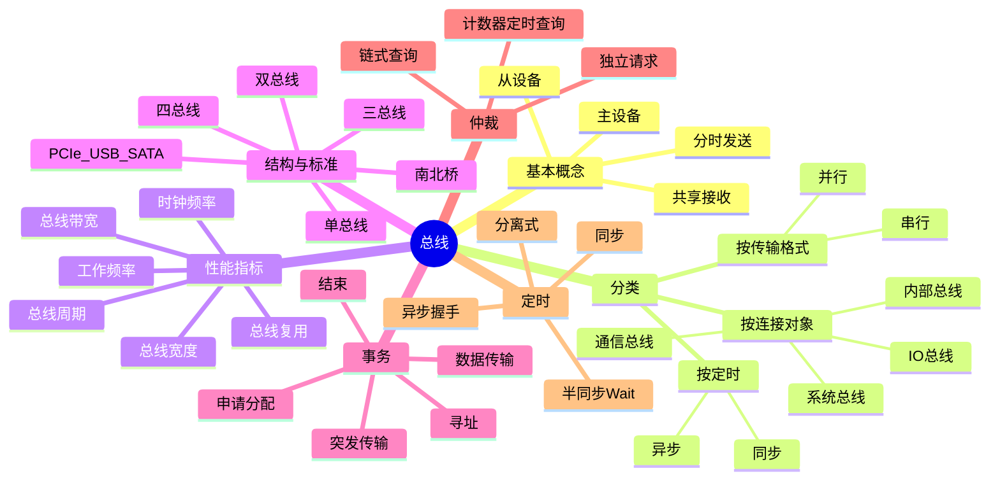
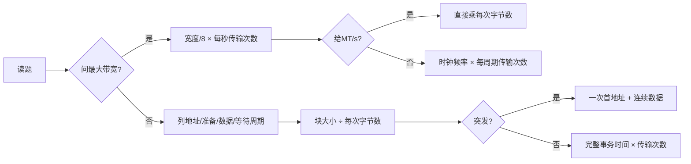

# 计算机组成原理 第6章 总线

> 来源：`408/27王道《计算机组成原理》高清带书签.pdf`，第6章 p286-p302。
> 复核：本轮共读取教材、基础课件、阶段卷和强化资料 11 组 186 页，其中 OCR 130 页；用 34 张联系图覆盖全部页面，并高清直读 25 个关键原页，复核分类、结构图、带宽题、总线事务、四种定时和习题解析。

## 本章速览

- 总线是一组多个部件分时共享的公共信息传输线路，核心是“分时发送、共享接收”。
- 系统总线按信息内容分为数据总线、地址总线、控制总线；题目常让你判断某信息走哪条线。
- 带宽题先分清总线宽度、总线时钟频率、总线工作频率；最大带宽不看事务开销，平均速率才看时序。
- 总线结构从单总线、双总线、三总线到南北桥和现代点对点互连，主线是减少共享瓶颈。
- 总线事务按地址/命令、从设备准备、数据传输三个阶段理解；突发传输只发首地址，连续传多数据。
- 总线定时抓四类：同步看统一时钟，异步看握手，半同步看 `Wait`，分离式看“请求后释放、响应再占用”。

## 课件补充来源

- 基础考点讲解：`6.1.1~6.1.3 总线概述.pdf`、`6.1.5 总线的性能指标.pdf`。
- 基础考点讲解：`6.2.0 拓展：总线仲裁（408大纲已删，简单了解即可）.pdf`、`6.2.1~6.2.3 总线操作和定时.pdf`、`6.3 拓展：总线标准（408大纲已删，简单了解即可）.pdf`。
- 阶段测试：`计算机组成原理期中试卷及答案解析（学员版）.pdf`、`计算机组成原理期末试卷及答案解析（学员版）.pdf`。
- 强化资料：`计组P1_大题备考策略、IO大题1.pdf`、`计组P5_一条指令的执行.pdf`、`计组强化课考试_试题+答案.pdf`；用于反查数据传送速率、控制总线、I/O 请求频率和 CPU 占用率题。

## 关联导航

- 本章内部：[[06-总线#6.1 总线概述|总线概述]]、[[06-总线#6.2 总线事务和定时|总线事务和定时]]、[[06-总线#6.4 常见问题和易混淆知识点|常见易混点]]。
- 同科联动：[[01-计算机系统概述#1.3 计算机的性能指标|性能指标]]、[[03-存储系统#3.3 主存储器与 CPU 的连接|主存与 CPU 连接]]、[[05-中央处理器#5.3 数据通路的功能和基本结构|CPU 数据通路]]、[[07-输入输出系统#7.2 I/O 接口|I/O 接口]]、[[07-输入输出系统#7.3 I/O 方式|I/O 方式]]。

## 知识网络

## 知识点清单

### 6.1 总线概述

- 分散连接：各部件用专用连线直接互连，速度可高，但连线多、扩展差、灵活性差。
- 总线连接：多个部件挂到公共线路上，分时共享线路完成通信。
- 总线核心特征：
  - 分时性：同一时刻通常只允许一个部件向总线发送信息。
  - 共享性：多个部件可同时挂接在总线上，也可同时接收总线信息。
- 一套总线规范由四类特性共同确定：机械特性（尺寸、形状、管脚及排列）、电气特性（传输方向和有效电平）、功能特性（每根线传地址/数据/控制中的什么）、时间特性（各信号的时序关系）。
- 课件补充：数据通路表示“数据流经的路径”，数据总线是“承载数据的媒介”，不能把 CPU 内部数据通路和系统数据总线混为一谈。

#### 6.1.1 总线的分类

- 教材按所在位置/连接对象依次分为：
  - 内部总线：CPU 芯片内部寄存器之间、寄存器与 ALU 之间的片内连接。
  - 系统总线：连接 CPU、主存、I/O 接口等系统功能部件。
  - I/O 总线：连接主机与 I/O 控制器或设备，如显卡、网卡、磁盘控制器等，常采用 PCI、PCIe 等标准。
  - 通信总线：主机与外部设备或不同计算机系统之间通信，如 RS-232、USB。
- 课件补充的另外两种分类维度：按数据传输格式分串行/并行，按定时方式分同步/异步；三种分类维度不能混答。
- 系统总线按传输内容分：

| 类型 | 传输内容 | 方向 | 判题规则 |
| --- | --- | --- | --- |
| 数据总线 `DB` | 指令、操作数、状态字、中断类型号等 | 双向 | 位数常与机器字长、存储字长有关，决定一次并行传输的数据位数 |
| 地址总线 `AB` | 主存单元地址、I/O 端口地址 | 通常由 CPU/主设备单向发出 | 位数决定可寻址单元数；容量还取决于按字节还是按字编址 |
| 控制总线 `CB` | 时钟、复位、读/写、请求/允许、中断请求/响应、传输确认等 | 各信号方向由定义决定，整组有出有入 | CPU 发控制命令，主存/外设返回状态与回答 |

- 地址/数据线复用：同一组物理线在不同时段传地址和数据，可减少引脚和成本，但不会直接提高传输速率。
- 主存识别“地址还是数据”看总线类型：地址在地址总线上，数据在数据总线上，不看数值本身。

#### 6.1.2 常见的总线标准

> 本节已从新版大纲删除，保留旧题最常用的分类即可。

| 类别 | 常见标准 | 做题标签 |
| --- | --- | --- |
| 系统总线 | ISA、EISA | 早期、并行；EISA 兼容 ISA，支持多主控和突发 |
| 局部总线 | VESA、PCI、AGP、PCIe | 前三者并行；PCIe 是串行点对点、全双工、多通道 |
| 设备/通信接口 | RS-232C、USB、IDE/ATA、SCSI、SATA | RS-232C/USB/SATA 串行；IDE、SCSI 为传统并行 |

- USB 支持即插即用、热插拔和集线器级联；一次传输仍是串行位流。
- PCIe `x16` 是 16 条串行 lane 的组合，不是传统并行总线；现代高速接口常靠差分、高频、多 lane 提升带宽。

#### 6.1.3 总线的性能指标

- 教材七项指标按顺序记：
  1. 总线传输周期（总线周期）：完成一次完整总线操作的时间，常含申请分配、寻址、传输、结束，通常由若干时钟周期组成。
  2. 总线时钟频率：总线时钟周期的倒数，即每秒时钟节拍数。
  3. 总线工作频率：每秒有效数据传输次数，是传输周期的倒数。
  4. 总线宽度：数据线根数，决定每次并行传输位数；带宽题不把地址线、控制线算入。
  5. 总线带宽：单位时间最大数据量，`B = 工作频率 × 宽度/8`（B/s）。
  6. 总线复用：同一组物理线在不同时段传不同信息，减少引脚与成本。
  7. 总线寻址能力：`n` 根地址线可寻址 `2^n` 个地址单元；容量还取决于编址单位。
- 课件/习题还常比较“信号线数”：它是地址线、数据线、控制线等物理线的总数，不能当作总线宽度。
- 周期关系不固定：一个传输周期可含多个时钟周期；一个时钟周期也可能在多个边沿完成多次传输，一律按题干。
- 若每时钟传 `m` 次，`工作频率 = 时钟频率 × m`；若已给 `MT/s`，它就是传输次数率，不再重复乘 DDR/QDR 倍数。
- 最大带宽与平均速率：
  - 最大带宽按物理参数算，不考虑地址/命令、准备、空闲和突发细节。
  - 平均数据传输率要根据事务过程、等待周期、读写比例等计算。
- 含校验/控制开销时，以题意确定“宽度”：若只算有效数据，用有效位数；若问线路原始速率，才计全部传输位。
- 块传输次数 `k = ceil(块大小/每次有效字节数)`；事务时间再加地址/命令、准备和等待周期。
- 串/并行判断：工作频率相同时，并行一次传多位通常更快；但并行高频有线间干扰和时序偏移，现代串行可通过高频差分、多通道和包传输超过传统并行。

#### 6.1.4 总线的结构

- 早期共享结构：
  - 单总线：CPU、主存和 I/O 接口共用系统总线；简单、低成本、易扩展，但争用严重，难满足高速 I/O。
  - 双总线：主存总线连接 CPU、主存和通道，I/O 总线连接通道与设备；通道是管理 I/O 的专用处理部件。它隔离低速 I/O，但增加通道硬件。
  - 三总线：CPU-主存走主存总线，CPU-I/O 走 I/O 总线，高速 I/O-主存走 DMA 总线；减轻 CPU 干预，但共享总线仍限制并发。
  - 四总线：用桥连接 CPU 总线、系统总线、高速总线、扩展总线；桥负责缓冲、转换和控制，实现按速度分层，代价是控制更复杂。
- 传统分层总线：南北桥结构。
  - 北桥 `MCH`：高速枢纽，连接 CPU、主存和显卡。
  - 南桥 `ICH`：I/O 控制器集线器，管理 USB、SATA、以太网、BIOS、扩展槽等。
  - 前端总线 `FSB`：CPU 与北桥之间的系统总线；所有高性能通道汇聚于此，容易成为瓶颈。
- 现代集成化结构：
  - 内存控制器集成到 CPU，缩短访存路径。
  - 支持双通道、三通道等多通道 DDR，理论带宽近似为单通道整数倍。
  - 多 CPU/多核之间通过 QPI 等点对点高速串行链路互连。
  - 高速外设可通过 PCIe 直连 CPU；低速设备由 PCH 管理。

#### 6.1.5/6.1.6 本节习题精选与答案解析吸收

- 多个设备只能分时向总线发送数据，但可同时从总线接收数据；接收者不会干扰总线。
- 系统总线连接 CPU、主存和 I/O 接口，不连接 CPU 内部寄存器与 ALU。
- 间址寻址第一次访存得到的是有效地址，但它作为“数据”经数据总线传回 CPU。
- 控制总线传时序、操作命令、请求/回答、响应信号；握手/应答信号不在数据总线上。
- USB 是设备总线、串行总线；PCI、AGP、PCIe 通常是局部总线。
- `n` 根地址线只能推出 `2^n` 个地址单元；只有再给编址单位，才能推出容量。无论总信号线有多少根，若数据线为 32 根，一次就只传 `32bit = 4B`。
- 典型题反查：

| 题型 | 一步式 |
| --- | --- |
| 32 位、66MHz、每周期 2 次 | `4B × 66M × 2 = 528MB/s` |
| 三通道、64 位、1333MT/s | `3 × 8B × 1333M ≈ 32GB/s` |
| QPI 每方向有效 16 位、全双工、2.4GHz、每周期 2 次 | `2B × 2方向 × 2.4G × 2 = 19.2GB/s` |
| 64 位、420MHz、每周期 2 次 | `8B × 420M × 2 = 6.72GB/s`；“最多突发 8 次”不影响最大带宽 |
| quad-pumped 但已给 1333MT/s、64 位 | `8B × 1333M ≈ 10.66GB/s`，不再乘 4 |
| 64 位总线，7 个时钟传 6 个字，66MHz | `48B × 66M/7 ≈ 452.6MB/s` |

- 平均速率用加权平均：若读速率 343MB/s、写速率 400MB/s，读写占比 70%/30%，则 `343×0.7 + 400×0.3 = 360.1MB/s`。

### 6.2 总线事务和定时

#### 6.2.1 总线事务

- 总线事务：主设备与从设备之间完成一次完整信息交换的过程。
  - 主设备：发起事务，如 CPU、DMA 控制器。
  - 从设备：响应请求，如主存、I/O 设备。
- 典型事务：存储器读、存储器写、I/O 读/写、中断响应。
- 总线传输周期可按四阶段理解：
  - 申请分配阶段：主设备提出请求，经仲裁获得下一传输周期的总线使用权。
  - 寻址阶段：主设备给出从设备地址和操作命令。
  - 数据传输阶段：主从之间交换数据。
  - 结束阶段：撤销相关信号并释放总线。
- 三个基本阶段：
  - 地址传送阶段：主设备发送目标地址和操作类型。
  - 从设备响应/数据准备阶段：从设备译码地址并准备数据或准备接收；题干未给时可忽略。
  - 数据传送阶段：完成实际数据交换。
- 非突发传输：
  - 每次只传一个数据单元。
  - 每个数据单元都要独立经历地址、准备、数据三个阶段。
  - 连续读多个相邻数据也要重复发送地址，地址开销大、效率低。
- 突发传输 `burst`：
  - 只发送数据块首地址，随后不释放总线，连续传送多个地址连续的数据单元。
  - 后续地址由硬件自动递增，不需要 CPU 每周期发送完整地址。
  - 常用于 Cache 块填充、SDRAM 行读取等。
  - 简记：非突发是“一次地址，一次数据”；突发是“一次地址，多次数据”。
- 注意：一次总线事务不一定只传一个数据单元，突发事务可在一次占用中传一个连续数据块。
- 串行传输：
  - 数据按 bit 顺序逐位传输，常用一条双向线或两条单向线。
  - 优点：引脚少、布线简单、抗干扰强，适合长距离和高频差分传输。
  - 典型：USB、PCIe、SATA。
  - 同步串行通信：收发时钟严格一致，效率高，硬件复杂。
  - 异步串行通信：收发双方独立时钟，每字符独立传输；空闲为逻辑 1，起始位为逻辑 0，数据位通常低位先传，可带校验位，停止位为逻辑 1。
- 并行传输：
  - 多条数据线同时传多个 bit，短距离低频时吞吐高。
  - 高频下串扰、时序偏移加重，频率难持续提升。
  - 现代高速接口常用串行化设计，并行不一定比串行快。

#### 6.2.2 总线定时

- 总线定时：主设备和从设备交换数据时协调操作时序的协议。
- 同步定时：
  - 使用系统统一时钟，每次传送在固定总线周期内完成。
  - 优点：传输快、控制逻辑简单。
  - 缺点：强制同步，无应答/握手，不能按从设备状态动态调整，可靠性较差。
  - 适用：总线短、各部件存取时间接近的系统。
  - 看时序图：从设备必须在主设备规定的采样沿之前把数据准备稳定，否则即使稍后给出正确数据也会错过本周期。
- 异步定时：
  - 不使用统一时钟，依靠请求 `request` 和回答 `acknowledge` 等握手信号。
  - 优点：周期长度可变，适合速度差异大的设备。
  - 缺点：控制复杂，整体速率较低。
  - 不互锁：主设备发请求后按预定延时自行撤销；从设备收到请求后应答并自行撤销。速度最快，可靠性最低。
  - 半互锁：主设备收到回答后才撤销请求；从设备发出回答后不等请求撤销，到时自行撤销。
  - 全互锁：主设备收到回答才撤销请求；从设备确认请求撤销后才撤销回答。可靠性最高，速度最慢。
- 半同步定时：
  - 统一时钟控制基本节拍，同时设置 `Wait` 信号让慢速设备反馈准备状态。
  - 地址、命令、数据发送严格参考时钟前沿；接收方通常在时钟后沿识别。
  - 主设备在采样沿检查等待信号；教材图中 `WAIT` 低有效：高电平表示未就绪并插入 `Tw`，低电平表示就绪。若题图极性不同，以横线标记和题干为准。
  - 优点：比异步简单，可靠性较高。
  - 缺点：系统时钟频率受最慢设备限制，整体速度不高。
- 分离式定时：
  - 把事务拆成两个同步子周期，各模块都可申请成为主设备，发出信息后不等待对方回答。
  - 请求子周期：原主设备获得总线，发送地址和命令后立即释放总线。
  - 应答子周期：原从设备准备好数据后主动申请总线，以主设备身份把数据返回。
  - 优点：从设备准备期间总线可服务其他事务，减少空闲等待，提高利用率。
  - 缺点：控制逻辑复杂，协议和仲裁开销大。
- 课件图示抓手：同步、异步、半同步、分离式都有“主模块发地址/命令、从模块准备数据、从模块发数据”的共同骨架；差别在准备数据期间是否占用总线、是否用统一时钟、是否等待回答。

#### 6.2.x 拓展：总线仲裁

> 课件标注为 408 新大纲已删，简要了解即可；习题或旧题出现时按以下规则判断。

- 仲裁原因：多个主设备同时请求时只能选一个获得控制权；“总线忙”由获权设备建立。

| 集中仲裁 | 控制线数（`n` 个设备） | 优缺点 |
| --- | --- | --- |
| 链式查询 | 3 | 线少、简单；离仲裁器越近优先级越高，故障敏感，可能饥饿 |
| 计数器定时查询 | `ceil(log2 n)+2` | 可改变计数起点，优先级较灵活；译码与控制较复杂 |
| 独立请求 | `2n+1` | 独立 `BRi/BGi`，响应最快、优先级灵活；线最多 |

- 分布仲裁：无中央仲裁器，各主设备用仲裁号在共享仲裁线上竞争；保留优先级最高者的仲裁号。

#### 6.2.3/6.2.4 本节习题精选与答案解析吸收

- 同步总线事务通常需要多个时钟周期；地址/命令阶段和数据阶段分时出现。
- 一次总线事务不一定只完成一次数据交换，现代同步总线可支持突发传输。
- 不同速度设备可选同步也可选异步；异步更适合速度差异大且可靠性要求高的外设通信。
- 异步握手一次完成一次通信，不等于只交换 1 bit。
- 异步串行字符帧：起始位 + 数据位 + 校验位 + 停止位。例：7 位 ASCII + 1 位奇校验 + 起始/停止各 1 位 = 10 bit/字符。
- 突发时间题：100MHz、32 位地址/数据复用总线传 128 位，地址 1 周期 + 数据 4 周期，共 `5×10ns = 50ns`。
- 非突发时间题：读 32B、64 位总线要 4 次；每次地址 1ns + 准备 6ns + 数据 1ns，共 `4×8ns = 32ns`。
- 有效速率题：50MHz 总线突发传 8 个 4B 字，地址 1 周期 + 准备 3 周期 + 数据 8 周期，共 `0.24μs`；`32B/0.24μs = 133.3MB/s`。
- 采用分离事务可提高利用率；采用地址/数据线复用只减少线数和成本，不能提高传输速率。
- 提高同步总线数据传输率：增加总线宽度、提高总线工作频率、支持突发传输；地址/数据线复用不是提速手段。
- 仲裁题若出现：链式查询优先级固定、线少但故障敏感；独立请求线最多、最快、最灵活；计数器方式介于二者之间。

### 6.3 本章小结

- 引入总线结构的好处：
  - 简化系统结构，便于设计制造。
  - 减少连线数量，利于布线、缩小体积、提高可靠性。
  - 统一接口标准，简化硬件接口设计。
  - 支持模块化与灵活扩展，便于升级、配置和功能扩充。
  - 简化软件编程，设备通过不同接口地址访问，驱动逻辑更统一。
  - 便于故障诊断、维护和成本控制。
- 引入总线后的问题与解决：
  - 问题：多个设备分时共享同一组信号线，多主设备同时请求会引发总线竞争和通信冲突。
  - 解决：配置总线仲裁部件，按某种策略选择一个主设备获得总线控制权。

### 6.4 常见问题和易混淆知识点

- 一个总线在同一时刻不能有多对主从设备并发通信。
- 任一总线周期内只能有一个主设备控制总线。
- 通信形式可以是一对一，也可以由一个主设备向所有从设备广播（一对多）。
- 若多对主从设备同时发送，会造成数据冲突，破坏传输正确性。

## 易错点/易混点

- “分时发送、可同时接收”是总线共享的基本判题句。
- 系统总线连接 CPU、主存、I/O 接口；内部总线才连接 CPU 内部寄存器和 ALU。
- 数据总线可传指令、操作数、中断类型号；握手/应答走控制总线。控制信号方向由具体定义决定，整组同时有 CPU 发出的命令和设备返回的状态。
- 地址线位数只决定地址单元数；未给编址单位时，不能直接断言存储容量。
- 地址/数据线复用是线数复用，不是并串转换，也不是提高速率。
- 最大带宽只看物理传输能力；平均速率才看地址周期、等待周期、读写比例和事务流程。
- 总线工作频率是每秒有效传输次数，总线时钟频率是每秒时钟周期数；二者不能直接等同。
- 总线宽度只看数据线根数，信号线数才把地址线、数据线、控制线都算上。
- 已给 `MT/s` 时不能再因 DDR/QDR 重复乘倍数；已给“每周期传几次”时才乘时钟频率。
- QPI/高速串行题要看题干是否只计有效数据位；校验位、控制位是否计入以题干为准。
- USB 是串行设备总线；PCIe `x16` 是多条串行通道组合，不是并行传输方式。
- 并行总线不绝对比串行快；现代高速串行可通过高频差分传输获得更大带宽。
- 突发传输只发首地址，后续地址自动递增；非突发连续读相邻数据也要反复发地址。
- 同步通信不是由各设备各自提供时钟，而是使用公共统一时钟。
- 异步通信只靠握手，不靠统一时钟；不互锁最快，全互锁最可靠。
- 半同步是统一时钟加 `WAIT`；高低电平含义先看信号是否低有效，不能死记“1=等待”或“0=等待”。
- 分离式定时的核心不是拆数据，而是把请求和响应拆开，让准备期间释放总线。
- 总线仲裁已弱化，但看到链式/计数器/独立请求题，先判控制线数、优先级灵活性、响应速度和故障敏感性。

## 课件补充/强化题规则

- 总线分类题：按连接对象答“内部/系统/I/O/通信”，按传输内容答“数据/地址/控制”，按格式答“串行/并行”；不要把数据通路当数据总线。
- 带宽题：先把总线宽度换成 Byte，再判断工作频率是否等于时钟频率；若每周期传 m 次，工作频率 `= 时钟频率 × m`。
- `MT/s` 题：`MT/s` 已经表示每秒传输次数，直接乘每次数据宽度；不要再额外乘 DDR/QDR 倍数。
- 块传输题：先算 `k = ceil(块大小/每次字节数)`；非突发把完整事务时间乘 `k`，突发通常只付一次首地址开销。
- 串并行题：同频并行更快，但现代串行可用高频差分、多通道和包传输反超；看到 USB、SATA、PCIe 优先判“串行”。
- 定时题：同步是统一时钟，异步是请求/回答握手，半同步是统一时钟加 `Wait`，分离式是从设备准备期间释放总线。
- 异步互锁题：不互锁最快可靠性最差，全互锁最可靠速度最慢，半互锁只要求主设备等回答后撤请求。
- 仲裁题：链式查询线少固定优先级，计数器定时查询优先级较灵活，独立请求响应最快但控制线最多。
- 阶段卷控制线题：时钟、操作命令、总线请求/允许、中断请求/响应、主存或 I/O 回答都属于控制总线信息。
- I/O 交叉题：设备每传 `w` Byte 请求一次、速率为 `r` B/s，则请求频率 `r/w`；CPU 占用率再乘每次服务时钟数并除以 CPU 主频。程序查询/中断按每次数据计开销，DMA 通常按整块计预处理和后处理开销，详见 [[07-输入输出系统#7.3 I/O 方式|I/O 方式]]。
- 强化课 P5 只用于确认边界：CPU 内部微操作走数据通路，本章系统总线讨论 CPU、主存和 I/O 接口间的公共传输媒介。

## 注解

- 判断三类系统总线：`DB` 传“内容”，`AB` 指“位置”，`CB` 管“时序/命令/请求/响应”。
- 带宽题四步：确定每次有效数据字节数 -> 确定每秒传输次数 -> 相乘 -> 按题意换算 MB/GB。
- 事务时间题三步：一次事务传多少数据 -> 每次事务有几个阶段/周期 -> 块大小需要几次事务。
- 总线结构题抓瓶颈：单总线瓶颈是共享系统总线，南北桥瓶颈是 FSB，现代结构用片上集成和点对点互连拆瓶颈。
- 定时方式记忆：同步“统一钟”，异步“请求-回答”，半同步“统一钟 + Wait”，分离式“先请求释放，后响应再占”。
- 仲裁记忆：链式像排队，排前面优先；计数器像点名，可换起点；独立请求像每人一条专线，快但线多。

## 速背检查

1. 总线的核心特征和四类规范特性是什么？答：分时、共享；机械、电气、功能、时间特性。
2. 按连接对象和按传输内容分别怎样分类？答：内部/系统/I/O/通信；数据/地址/控制。
3. `DB/AB/CB` 分别传什么、方向如何？答：DB 传数据且双向；AB 传地址且通常单向；CB 传命令/时序/请求/回答，具体信号方向由定义决定且整组有出有入。
4. `n` 根地址线一定能推出存储容量吗？答：只能推出 `2^n` 个地址单元，容量还需编址单位。
5. 带宽公式及 `MT/s` 规则是什么？答：`B = 宽度/8 × 每秒传输次数`；`MT/s` 已是传输次数率，不再乘 DDR/QDR 倍数。
6. 最大带宽与平均速率怎样区分？答：最大带宽忽略事务开销；平均速率计地址、准备、等待、读写比例。
7. 地址/数据线复用能提速吗？答：不能，只减少引脚和成本。
8. 单、双、三、四总线逐步解决什么？答：从共享争用，逐步按存储/I/O/DMA和设备速度分层；性能提高但硬件与控制更复杂。
9. PCIe `x16` 是并行总线吗？答：不是，是 16 条串行 lane 组成的全双工点对点链路。
10. 非突发与突发的时间入口是什么？答：非突发每个数据都付完整事务开销；突发只付一次首地址，后续地址自动递增。
11. 总线事务四阶段是什么？答：申请分配、寻址、数据传输、结束。
12. 同步、异步、半同步、分离式分别看什么信号？答：统一时钟、请求/回答、统一时钟加 `WAIT`、请求和应答两个独立子周期。
13. 异步三种互锁谁最快、谁最可靠？答：不互锁最快，全互锁最可靠，半互锁居中。
14. 分离式为何提高利用率？答：从设备准备数据时不占总线，准备好后重新申请并返回数据。
15. 一个总线同一时刻能否多对主从并发？答：不能；只能一个主设备控制，可一对一或向多个从设备广播。
