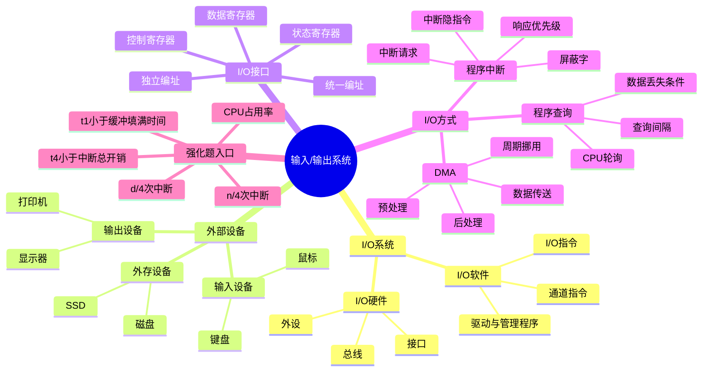

# 计算机组成原理 第7章 输入/输出系统

> 来源：`27王道《计算机组成原理》高清带书签.pdf`，第7章 输入/输出系统，PDF 页码 p303-p339。
> 复核：已 OCR 全章，并查看渲染页图 p303-p339；本轮追加读取第7章基础考点讲解 8 个 PDF、计组 P1 I/O 大题强化课件、计组强化课考试试题与答案；重点复核显存公式、I/O 接口结构图、端口编址、中断响应/屏蔽字、DMA 控制器、DMA 三种访存方式和 I/O 大题规则。

## 本章速览

- I/O 系统解决的是主机与外设在速度、格式、时序、电平上的不匹配，核心部件是 I/O 接口/控制器。
- I/O 接口中可被 CPU 访问的寄存器叫端口；端口不是接口本身，更不是外设本体。
- 编址方式只抓两类：独立编址用专用 I/O 指令，统一编址用普通访存指令。
- 三种 I/O 方式按 CPU 参与程度递减：程序查询全程轮询，程序中断事件触发，DMA 硬件成块搬运。
- 中断题重点分清：响应优先级 vs 处理优先级、断点 vs 现场、向量 vs 向量地址、硬件响应 vs 软件服务。
- DMA 适合高速大块数据，数据传送阶段不经 CPU 搬运，但预处理和后处理仍需要 CPU。

## 课件补充来源

- 基础考点讲解：`第七章 输入输出系统/7.1.1+7.1.2 输入输出系统和IO控制方式.pdf`、`7.1.3 外部设备.pdf`、`7.2 IO接口.pdf`、`7.3.1 程序查询方式.pdf`。
- 基础考点讲解：`7.3.2_1 中断的作用和原理.pdf`、`7.3.2_2 多重中断.pdf`、`7.3.2_3 程序中断方式.pdf`、`7.3.3 DMA方式.pdf`。
- 强化资料：`组成原理强化/课件/计组P1_大题备考策略、IO大题1.pdf`。
- 强化试题：`组成原理强化/计组强化课考试_试题+答案.pdf`。

## 关联导航

- 本章内：[[07-输入输出系统#7.2 I/O 接口|I/O 接口]]、[[07-输入输出系统#7.3 I/O 方式|I/O 方式]]、[[07-输入输出系统#课件补充/强化题规则|I/O 大题规则]]。
- 同科联动：[[05-中央处理器#5.5 异常和中断机制|CPU 异常和中断机制]]、[[06-总线#6.2 总线事务和定时|总线事务与定时]]、[[03-存储系统#3.3 主存储器与 CPU 的连接|主存与 CPU 连接]]。
- 跨科联动：[[408/408考研笔记/操作系统/05-输入输出管理#5.1 I/O 管理概述|OS I/O 管理概述]]、[[408/408考研笔记/操作系统/05-输入输出管理#5.3 磁盘和固态硬盘|磁盘调度与 SSD]]。

## 知识网络

## 知识点清单

### 7.1 I/O 系统基本概念

#### 7.1.1 输入/输出系统

- I/O 系统 = I/O 硬件 + I/O 软件。
- I/O 硬件：外部设备、设备控制器、I/O 接口、I/O 总线等。
- I/O 软件：设备驱动程序、I/O 管理程序、用户程序中的 I/O 调用等。
- I/O 指令由 CPU 执行，用于对 I/O 接口发命令、读状态、传数据；通道指令由通道执行，用于让通道代替 CPU 管理一批 I/O 操作。
- 含通道系统的工作入口：CPU 执行 I/O 指令启动通道 -> 通道执行通道程序管理设备 -> I/O 完成后通道/设备发中断通知 CPU。
- 输入：外设把信息送入主机；输出：主机把信息送到外设。
- I/O 接口位于主机与外设之间，负责设备选择、命令/状态交换、数据缓冲、格式转换和时序协调。

#### 7.1.2 外部设备

- 外设按功能分为输入设备、输出设备、外存设备。
- 输入设备：
  - 键盘：按键形成电信号 -> 翻译成主机可接收的编码（如 ASCII）-> 送入主机。
  - 鼠标：把平面位移和按键动作转换为位置信息和控制信息。
- 显示器常考参数：
  - 分辨率：屏幕像素数，如 `1600 x 1200`。
  - 灰度级/颜色数：每个像素可表示的状态数；颜色数为 `2^n` 时，色深为 `n bit`。
  - 刷新频率：每秒刷新画面的次数。
  - 显存容量：`分辨率 x 色深`。
  - 显存刷新带宽：`分辨率 x 色深 x 刷新频率`。
- 显示器分类：
  - 按器件：CRT、LCD、LED。
  - 按显示内容：字符显示器、图形显示器、图像显示器。
  - 按扫描方式：光栅扫描、随机扫描。
- 字符显示器：
  - 字符窗口 = 字符显示点阵 + 字符间隔。
  - 字模/点阵题：一个 `m x n` 点阵字符占 `m x n / 8` 字节，再乘字符数求字库容量。
  - 字模通常放在字符发生器 ROM；VRAM 中按字符窗口保存待显示字符的编码，以便刷新时查字模。
- 打印机：
  - 针式：击打式，可多层复写，速度和分辨率较低。
  - 喷墨：非击打式，适合彩色图像。
  - 激光：非击打式，速度快、质量高。
- 外存设备：磁盘、磁带、光盘、SSD 等，通常通过控制器或接口与主机交换数据。

#### 7.1.3/7.1.4 本节习题精选与答案解析吸收

- 显存容量、显存带宽先按 bit 计算，最后再换算成 Byte、KB、MB/s。
- 若题目说“刷新占总带宽的 50%”，则总带宽 = 刷新所需带宽 / 50%。
- 字库存储按点阵位数算，不按显示屏像素总数算。

### 7.2 I/O 接口

#### 7.2.1 I/O 接口的功能

- 地址译码和设备选择：识别 CPU 指定的接口/端口。
- 通信联络控制：用握手、查询、请求/响应等方式协调主机与外设。
- 数据缓冲：用寄存器暂存数据，缓解速度差异。
- 格式转换：串/并转换、电平转换、数据格式转换、模/数或数/模转换。
- 命令和状态传递：CPU 写控制命令，接口返回外设状态，必要时发中断/DMA 请求。

#### 7.2.2 I/O 接口的基本结构

- CPU 侧通过系统总线与接口相连，接口侧通过专用连线与外设相连。
- 接口内部常见寄存器：
  - 数据缓冲寄存器：暂存输入/输出数据。
  - 状态寄存器：保存就绪、忙、错误、中断请求等状态，通常只读。
  - 控制寄存器：保存 CPU 发出的启动、停止、方式选择等命令，通常只写。
- 状态寄存器和控制寄存器可共用同一端口地址：读时读状态，写时写控制。
- 地址译码和 I/O 控制逻辑负责译码端口地址、解释命令、控制传输、更新状态和产生请求信号。
- I/O 总线信号：
  - 数据线：传数据、命令字、状态字，也可传向量中断的中断类型号。
  - 地址线：指出访问哪个接口端口。
  - 控制线：传读/写控制、中断请求/响应、总线请求/允许、握手等信号。
- 接口的典型访问动作：
  - CPU 写控制端口：发启动、停止、读/写、工作方式等命令。
  - CPU 读状态端口：判断就绪、忙、错误、中断请求等状态。
  - CPU 读/写数据端口：完成数据寄存器与 CPU 寄存器之间的数据交换。
- 接口两侧不要混：CPU 侧接数据总线、地址总线、控制总线；设备侧接数据线、状态线、命令线或专用连接线。

#### 7.2.3 I/O 接口的类型

- 按数据传送方式：并行接口、串行接口。
- 按主机控制方式：程序查询接口、程序中断接口、DMA 接口。
- 按可编程性：可编程接口、不可编程接口。
- I/O 指令在独立编址体系中用于访问 I/O 端口，通常属于特权指令。
- 串/并行判断看接口与设备或接口与主机之间一次传几位：并行多位一起传，串行一位一位传，串行可能带起始位、校验位、停止位。

#### 7.2.4 I/O 端口及其编址

- I/O 端口：接口中能被 CPU 直接访问的寄存器，主要有数据端口、状态端口、控制端口。
- 端口是寄存器级概念，接口是控制逻辑加寄存器的整体；“端口地址”不等于“外设地址”。

| 编址方式 | 访问方式 | 优点 | 缺点 |
| --- | --- | --- | --- |
| 独立编址 / I/O 映射 | I/O 端口有独立地址空间，用 `IN`、`OUT` 等专用 I/O 指令 | 不占主存地址空间；I/O 操作语义清楚；地址译码相对简单 | 需要专用指令和控制信号；I/O 指令功能较少，编程灵活性差 |
| 统一编址 / 存储器映射 | I/O 端口占用部分主存地址空间，用普通访存指令 | 可用访存指令和寻址方式，编程灵活；可借助存储保护机制 | 占用主存地址空间；地址译码范围大，可能增加复杂度 |

#### 7.2.5/7.2.6 本节习题精选与答案解析吸收

- I/O 接口寄存器不包括 IR、MAR 这类 CPU 内部寄存器。
- 统一编址不是靠“另一套地址线”区分 I/O，而是靠地址范围区分。
- 独立编址也可使用系统地址线传端口地址，关键区别是地址空间和指令/控制信号。
- CPU 与打印机接口交换的是字符数据、状态、控制命令，不直接交换主存地址。
- 可编程中断控制器、打印机适配器、网络控制器属于接口/控制器范畴；磁盘驱动器本体不是 I/O 接口。

### 7.3 I/O 方式

#### 7.3.1 程序查询方式

- CPU 主动读取接口状态，外设就绪后再执行数据传送。
- 基本流程：初始化参数 -> 启动外设 -> 查询状态 -> 就绪则传送一个数据 -> 修改地址/计数 -> 未完成继续。
- 独占查询：CPU 一直轮询，简单但效率最低。
- 定时查询：CPU 周期性查询，查询间隔必须小于设备缓冲区被填满的时间。
- 设备节奏与丢数据：
  - 设备按自己速度把数据冲入接口缓冲区：CPU 不及时取走，就可能被新数据覆盖。
  - 设备受 CPU 指挥才输入下一字：CPU 取走一个字后才让设备送下一字，一般不产生覆盖式丢数据。
- 查询方式特点：
  - 硬件简单，控制直观。
  - CPU 与外设并行度低，CPU 时间大量消耗在忙等待上。
  - 适合低速、少量、实时性要求不高的设备。
- 计算入口：
  - `最大查询间隔 = 缓冲区容量 / 设备数据率`。
  - `每秒查询次数 = 1 / 查询间隔`。
  - `CPU 占用率 = 每秒查询次数 x 每次查询周期数 / CPU 每秒周期数`。
  - 若缓冲区为 `b` Byte、设备速率为 `n` B/s，为避免丢数据通常需 `查询间隔 < b/n`。

#### 7.3.2 程序中断方式

- 基本思想：CPU 启动外设后继续执行当前程序；外设就绪或发生事件时发中断请求，CPU 响应并执行中断服务程序。
- 适用：低速设备、字符设备、事件通知、异常处理、人机交互、实时响应等。
- 中断请求：
  - 中断源通过请求触发器置位，可形成中断请求寄存器。
  - `INTR`：可屏蔽中断请求。
  - `NMI`：不可屏蔽中断请求，通常用于紧急硬件故障。
  - 程序中断接口至少要有中断请求触发器和中断允许/屏蔽控制，外设事件发生只代表“有请求”，CPU 还要判定是否允许响应。
- 中断判优：
  - 响应优先级：多个请求同时到来时先响应谁，由硬件排队线路或查询顺序决定，通常固定。
  - 处理优先级：服务程序执行时谁能打断谁，由中断屏蔽字决定，可由软件设置。
  - 常见原则：非屏蔽中断 > 可屏蔽中断；高速设备 > 低速设备；输入 > 输出；实时事件 > 普通事件。
- CPU 响应中断的条件：
  - 中断源有有效请求。
  - CPU 处于开中断状态，且该请求未被屏蔽。
  - 当前指令执行结束，且没有更高优先级任务待处理。
  - 对外部 I/O 中断，还要看接口的中断请求触发器和中断允许触发器是否有效。
- 中断响应阶段由硬件完成，常称中断隐指令：
  - 关中断。
  - 保存断点，外部中断断点通常是下一条指令地址。
  - 识别中断源，形成或取得中断服务程序入口并送入 PC；可用软件查询法或硬件向量法。
  - 中断隐指令不是指令系统中的真实指令，不由程序员编写。
- 中断处理阶段由中断服务程序完成：
  - 保存现场和旧屏蔽字。
  - 设置新屏蔽字；若允许嵌套，则开中断。
  - 执行中断服务。
  - 关中断，恢复现场和旧屏蔽字。
  - 开中断，中断返回。
- 单重中断：服务程序执行期间不再响应新的中断。
- 多重中断/中断嵌套：高处理优先级中断可打断低处理优先级中断服务程序。
- 中断屏蔽字：
  - 本书约定 `1` 表示屏蔽该中断源，`0` 表示允许该中断源中断当前服务程序。
  - 屏蔽字通常在进入服务程序后由软件装入，因此控制的是处理优先级，不是最初的响应优先级。
  - 判断“谁能打断谁”看当前服务程序的屏蔽字，不只看硬件响应顺序。
  - 设置规律：每个中断源对应一个屏蔽字；处理某中断源时装入该源屏蔽字；至少要屏蔽自身；通常 `1` 越多，处理优先级越高。
- 向量相关：
  - 中断类型号/中断号：中断源给出的编号。
  - 向量地址：中断向量表中相应表项的地址。
  - 中断向量：中断服务程序入口地址。
  - 向量中断：CPU 由中断类型号查表，转入对应服务程序的方式。
  - 关系：`中断类型号 -> 向量地址 -> 中断向量 -> 服务程序入口`。
- 中断开销判断：若设备填满缓冲区的时间小于中断响应和处理总时间，则可能丢数据，不宜用中断搬运。
- 中断效率计算：若缓冲区 `b` Byte、设备速率 `n` B/s、每次中断总开销 `t3`，则每秒中断次数为 `n/b`，CPU 中断开销为 `(n/b)t3`。

#### 7.3.3 DMA 方式

- DMA：Direct Memory Access，直接内存访问。
- 基本思想：外设与主存之间的数据块传送由 DMA 控制器完成，CPU 不执行逐字搬运指令。
- “直接”指数据传送阶段不经 CPU 程序搬运，不表示主存和外设一定有物理专线。
- 适用：磁盘、SSD、网卡、显卡、声卡等高速大块数据传输。
- DMA 特点：
  - CPU 负责预处理和后处理；数据传送阶段由 DMA 控制器接管。
  - DMA 控制器能申请系统总线，自动给出主存地址、读写控制和传送计数。
  - 块传送结束或出错后，DMA 控制器以中断方式通知 CPU。
  - DMA 请求一般比 CPU 访存请求优先，以避免高速设备丢数据。
  - DMA 请求是请求总线/主存使用权，不是让 CPU 执行中断服务程序；DMA 结束后才用中断通知 CPU 后处理。
- DMA 控制器主要部件：
  - 主存地址计数器：保存当前主存地址，传送后自动加/减。
  - 字计数器/长度计数器：保存剩余传送量，传完一个字后修改，归零表示结束。
  - 数据缓冲寄存器：暂存外设与主存间的数据。
  - DMA 请求触发器：外设准备好后置位，请求 DMA 服务。
  - 控制/状态逻辑：控制传送方向、读写信号、总线请求与允许。
  - 中断机构：块传送结束或异常时请求 CPU 处理。
  - 常见信号：`HRQ` 表示 DMA 请求总线，`HLDA` 表示 CPU 允许交出总线。
- DMA 传送过程：
  - 预处理：CPU 设置主存起始地址、设备地址、传送方向、传送长度，启动设备。
  - 数据传送：DMA 控制器取得总线控制权，在接口和主存之间传送数据，并自动更新地址和计数。
  - 后处理：DMA 发中断，CPU 检查状态、处理错误、完成收尾。
- CPU 介入频率：程序查询通常每查询一次介入；程序中断通常每次缓冲区就绪/每个字介入一次；DMA 通常每传送一块只介入预处理和后处理。
- DMA 与主存共享的三种方式：
  - 停止 CPU 访存：DMA 传送整个数据块期间 CPU 暂停访存，控制简单但 CPU 利用率低。
  - 周期挪用：DMA 挪用一个主存周期传一个字，随后释放总线；最常考、最常用。
  - DMA 与 CPU 交替访存：把 CPU 周期分成 CPU 子周期和 DMA 子周期，无需动态申请/释放总线，但硬件复杂。
- 周期挪用的三种情况：
  - CPU 此时不访存，DMA 直接占用主存周期。
  - CPU 正在访存，DMA 等当前访存周期结束后占用。
  - CPU 和 DMA 同时请求主存，CPU 暂让 DMA 使用一个周期。
- DMA 与程序中断对比：
  - 中断请求 CPU 执行服务程序；DMA 请求总线/主存使用权。
  - 中断方式的数据传送由 CPU 指令完成；DMA 数据传送由硬件完成。
  - 中断通常在当前指令结束后响应；DMA 可在当前总线周期或存储周期结束后响应。
  - 中断需要保存和恢复 CPU 现场；DMA 数据传送阶段不破坏 CPU 现场。
  - DMA 完成后会中断 CPU，但该中断只做后处理，不负责逐字搬运。
- DMA 效率计算：若每块 `d` Byte，DMA 预处理+后处理总开销为 `t4`，与中断方式比较时，中断搬运同一块数据的 CPU 开销约为 `(d/b)t3`；DMA 更高效需 `t4 < (d/b)t3`。

#### 7.3.4/7.3.5 本节习题精选与答案解析吸收

- 程序查询题优先找“设备数据率、缓冲区大小、每次查询指令数、CPU 频率”。
- 中断题问“何时响应”时，I/O 中断看当前指令结束；DMA 请求看总线/存储周期结束。
- 外部中断隐指令负责关中断、保存断点、取得服务程序入口；保存通用寄存器是中断服务程序的软件工作。
- PC 的保存和修改属于硬件响应动作；通用寄存器和屏蔽字通常由软件保存。
- DMA 计算 CPU 占用率时，只把 CPU 参与的预处理、后处理和结束中断算入，不把数据块内部传送算作 CPU 指令时间。
- 周期挪用次数常按 `传送总字节数 / 总线一次传送字节数` 计算。
- DMA 优先级通常高于程序中断和 CPU 访存请求，原因是高速外设缓冲区更容易溢出。

### 7.4 本章小结

- I/O 编址本质是“端口地址放在哪里”：独立编址放 I/O 地址空间，统一编址放主存地址空间。
- CPU 响应外部中断的核心条件：CPU 开中断、外设有有效请求、请求未被屏蔽、当前指令结束。
- I/O 方式选择：
  - 少量低速：查询或中断。
  - 低速事件：中断。
  - 高速大块：DMA。
- 三种方式的 CPU 负担：查询最大，中断居中，DMA 最小。

### 7.5 常见问题和易混淆知识点

- 开中断状态下，CPU 在指令结束时检测到有效且未屏蔽的中断请求，一般会响应；若服务程序中关闭中断，则不满足开中断条件。
- 向量中断是方式，中断向量是入口地址，向量地址是向量表项地址。
- 子程序调用与中断的区别：
  - 子程序由程序主动调用，时机确定；中断由事件触发，时机随机。
  - 子程序服务主程序逻辑；中断服务独立事件或外设。
  - 子程序主要靠软件调用/返回；中断需要硬件响应与软件服务配合。
  - 子程序嵌套由程序结构决定；中断嵌套受优先级和屏蔽字控制。

## 易错点/易混点

- I/O 设备通常经控制器/接口接入系统，不是直接由 CPU 控制外设内部细节。
- I/O 接口寄存器是数据缓冲、状态、控制；不要把 IR、MAR、MDR 等 CPU/主存相关寄存器混入接口。
- 状态寄存器通常只读，控制寄存器通常只写；二者可共用端口地址。
- 端口是接口中的寄存器，接口是包含寄存器和控制逻辑的整体。
- 独立编址和统一编址的区别不是是否有地址线，而是地址空间和指令体系是否独立。
- 统一编址下，普通访存指令能访问 I/O 端口；“只能用 I/O 指令访问端口”只适用于独立编址。
- 数据线可传数据、命令字、状态字和中断类型号，不只传普通数据。
- 显存容量与显存带宽都先按 bit 算，再按题目单位换算。
- 程序查询方式不是没有并行性，而是 CPU 常被轮询占用，主程序推进受影响。
- I/O 中断响应在指令结束后；DMA 可在总线周期或存储周期结束后。
- 中断隐指令保存断点，服务程序保存现场；断点不等于现场。
- 响应优先级由硬件排队/查询顺序决定，处理优先级由屏蔽字决定。
- 屏蔽字 `1` 表示屏蔽、`0` 表示允许；不要按“1 为允许”误判。
- 屏蔽字题要看“当前正在执行哪个服务程序”的那一行，而不是只看硬件排队优先级。
- 中断处理时间若大于接口缓冲区再次写满的时间，可能覆盖旧数据；DMA 一般因总线优先级高、按块搬运，丢数据风险小。
- 不可屏蔽中断不受普通开/关中断控制；可屏蔽中断受开中断和屏蔽字控制。
- DMA 完成后发中断，不代表 DMA 数据传送阶段也由中断服务程序搬运。
- DMA 请求不是中断请求；DMA 请求总线使用权，DMA 完成后才向 CPU 发中断做后处理。
- 停止 CPU 访存是整块传送时暂停 CPU 访存；周期挪用是每次挪用一个主存周期。
- 高速块设备优先 DMA，低速字符设备常用中断，极简单或低频设备可用查询。

## 课件补充/强化题规则

- I/O 大题第一步先判结构：
  - CPU 介入类型：程序查询、程序中断、DMA。
  - 接口传输粒度：按字传输还是按块传输。
  - 设备节奏：设备自己按速率冲入缓冲区，还是 CPU 取走后才命令设备送下一字。
  - 总线类型：并行一次传多位，串行一位一位传，串行还可能有起始位、校验位、停止位。
- 程序查询：
  - CPU 每次介入：检查 I/O 接口数据是否准备好，必要时读/写数据端口。
  - 介入频率：取决于查询程序占 CPU 的时间频率；若每隔 `t1` 查询一次，则每秒查询 `1/t1` 次。
  - 不丢数据条件：若缓冲区 `b` Byte、设备速率 `n` B/s，则需 `t1 < b/n`。
  - CPU 开销：每秒约为 `(1/t1)t2`，其中 `t2` 为一次查询开销。
- 程序中断：
  - CPU 每次介入：中断响应隐指令 + 中断服务程序；常见题按“缓冲区每满一次发一次中断”处理。
  - 若缓冲区 `b=4B`、设备速率 `n` B/s，则每秒中断次数 `n/4`。
  - CPU 开销：每秒约为 `(n/b)t3`；当 `b=4B` 时为 `(n/4)t3`。
  - 中断方式比查询高效的条件：`(n/b)t3 < (1/t1)t2`；当 `b=4B` 时为 `(n/4)t3 < (1/t1)t2`。
- DMA：
  - CPU 每次介入：预处理设置参数；一整块完成后由 DMA 发中断，CPU 做后处理。
  - 介入频率：每传送一块介入一次，而不是每个字/每次缓冲区满都介入。
  - 若块大小为 `d` Byte、缓冲区 `b` Byte，中断方式传同一块约需 `d/b` 次中断；当 `b=4B` 时为 `d/4` 次。
  - DMA 比中断高效的条件：`t4 < (d/b)t3`；当 `b=4B` 时为 `t4 < (d/4)t3`。
  - 数据丢失判断：DMA 接口总线使用优先级高，通常可及时把数据块搬入/搬出主存；题目若明确访存冲突或总线不足，再按给定条件算。
- 屏蔽字题：
  - `1` 表示屏蔽，`0` 表示允许；每个中断源至少屏蔽自身。
  - 处理优先级越高，屏蔽字通常 `1` 越多；当前服务程序的屏蔽字决定哪些新请求能嵌套。
  - 响应优先级用于“同时来了先响应谁”，处理优先级用于“服务过程中谁能打断谁”。
- 显示器题：
  - 显存容量 = `水平像素 x 垂直像素 x 色深`。
  - 显存带宽 = `显存容量 x 刷新频率`。
  - 题目给“刷新占总带宽比例”时，总带宽 = 刷新带宽 / 比例。

## 注解

- 记 I/O 接口五件事：选设备、调时序、缓数据、变格式、传命令/状态。
- 端口编址题先问：CPU 用的是专用 I/O 指令，还是普通访存指令。
- 中断流程背成两段：硬件做“关中断、存断点、找入口”，软件做“存现场、设屏蔽字、服务、恢复、返回”。
- 向量题用链条压住：`类型号 -> 向量地址 -> 中断向量 -> ISR 入口`。
- 屏蔽字题不要先看谁编号小，先看当前服务程序屏蔽了谁、允许谁。
- DMA 题先排除 CPU 搬运数据，再计算 CPU 真正参与的预处理、后处理和结束中断开销。
- I/O 计算题先把单位统一成 Byte/s 和秒，再套“次数 x 单次开销”；很多错题不是公式错，而是 bit/Byte 或 MHz/ns 没换好。
- 看到 `32 bit 数据缓冲寄存器` 先改成 `4B`；设备速率 `n B/s` 时，缓冲区每 `4/n` 秒填满。

## 速背检查

1. I/O 接口存在的原因是什么？解决主机与外设的速度、格式、电平、时序不匹配。
2. I/O 接口的主要功能有哪些？选设备、联络控制、缓冲、格式转换、传命令/状态。
3. I/O 端口是什么？接口中能被 CPU 直接访问的寄存器。
4. 三类 I/O 端口是什么？数据端口、状态端口、控制端口。
5. 独立编址用什么访问端口？专用 I/O 指令。
6. 统一编址用什么访问端口？普通访存指令。
7. 显存容量公式是什么？`分辨率 x 色深`。
8. 显存刷新带宽公式是什么？`分辨率 x 色深 x 刷新频率`。
9. 程序查询方式的主要缺点是什么？CPU 忙等待，利用率低。
10. CPU 响应外部中断的基本条件是什么？有效请求、开中断且未屏蔽、当前指令结束。
11. 响应优先级由什么决定？硬件排队线路或查询顺序。
12. 处理优先级由什么决定？中断屏蔽字。
13. 本书屏蔽字中 `1` 表示什么？屏蔽该中断源。
14. 中断隐指令做什么？关中断、保存断点、取得服务程序入口。
15. 保存现场由谁做？中断服务程序软件完成。
16. 中断向量是什么？中断服务程序入口地址。
17. 向量地址是什么？中断向量表中对应表项的地址。
18. DMA 的三个阶段是什么？预处理、数据传送、后处理。
19. DMA 数据传送阶段谁搬运数据？DMA 控制器，不是 CPU 指令。
20. DMA 与中断的响应时机有什么不同？中断通常等指令结束，DMA 可等总线/存储周期结束。
21. DMA 三种主存共享方式是什么？停止 CPU 访存、周期挪用、交替访存。
22. 周期挪用的特点是什么？每次挪用一个主存周期传一个字，随后释放总线。
23. DMA 完成后为什么还要中断？通知 CPU 做状态检查、错误处理和收尾。
24. 子程序调用和中断的最大区别是什么？子程序调用由程序主动发生，中断由事件异步触发。
25. I/O 指令和通道指令谁执行？I/O 指令由 CPU 执行，通道指令由通道执行。
26. 字符显示器中字符编码和字模分别放在哪里？编码通常在 VRAM，字模通常在字符发生器 ROM。
27. 程序查询不丢数据条件怎么写？查询间隔小于缓冲区填满时间，即 `t1 < b/n`。
28. `32 bit` 缓冲区、输入速率 `n B/s` 时，每秒中断几次？`n/4` 次。
29. 中断比查询效率高的条件是什么？`(n/b)t3 < (1/t1)t2`。
30. 当 `b=4B` 时中断比查询效率高的条件是什么？`(n/4)t3 < (1/t1)t2`。
31. DMA 比中断效率高的条件是什么？`t4 < (d/b)t3`。
32. 当 `b=4B` 时 DMA 比中断效率高的条件是什么？`t4 < (d/4)t3`。
33. DMA 请求和中断请求的区别是什么？DMA 请求总线/主存使用权，中断请求 CPU 执行服务程序。
34. 屏蔽字题判断嵌套看什么？看当前服务程序装入的屏蔽字，`0` 对应的请求可申请打断。
35. 响应优先级和处理优先级分别解决什么？响应优先级解决同时到达先响应谁，处理优先级解决服务过程中谁能打断谁。
36. 并行和串行接口怎么区分？一次传多位是并行，一位一位传是串行。
