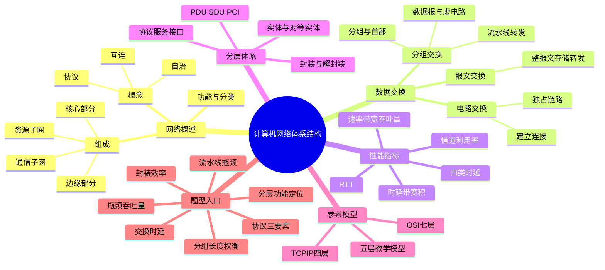

# 计算机网络 第1章 计算机网络体系结构

> 来源：`27王道《计算机网络》高清带书签.pdf`，第1章 计算机网络体系结构，PDF 页码 p13-p41。
> 复核：已按 p13-p41 全章 OCR 抽文字骨架，并直接查看渲染图片中的三种交换方式对比图、性能指标公式、时延/RTT 图、分层数据单元图、协议-接口-服务关系图、OSI/TCP-IP 对照图、两节习题解析和本章小结疑难点。
> 全局复核：本轮重新读取教材 p13-p41、9 份基础课件、期中/期末卷、P1 强化手稿与题号映射、强化结课考试，共 15 组 231 页；教材及扫描/低文本/手稿页共 194 页完成 OCR。
> 图片复核：已直接查看覆盖全部 231 页的 44 张页面联系图，并高清复核 15 个关键原页，覆盖时延图、教材综合题、分层封装、习题解析、章末疑难点和强化手写标注。

## 本章速览

- 主线：网络概念与组成 -> 交换方式 -> 分类与性能指标 -> 分层体系结构 -> 协议/接口/服务 -> OSI 与 TCP/IP。
- 交换方式考法重在“时延与利用率”：电路交换建路后快但独占链路；报文交换整报文存储转发；分组交换拆小包并流水转发。
- 性能指标先分清三组：速率/带宽/吞吐量，发送时延/传播时延/处理排队时延，RTT/时延带宽积/信道利用率。
- 分层题抓住一句话：协议是同层对等实体之间的水平规则，服务是下层给上层的垂直功能，接口/SAP 是相邻层的入口。
- OSI 七层要能按功能、PDU、设备和通信范围定位；TCP/IP 要抓 IP 无连接不可靠、TCP/UDP 分工。
- 本章真题高频：三种交换时延、瓶颈吞吐量、协议三要素、PDU 封装效率、设备最高层、OSI/TCP-IP 服务模式差异。

## 课件补充来源

- 教材：`27王道《计算机网络》高清带书签.pdf` 第1章 p13-p41，含正文、两节习题与答案解析、本章小结及疑难点。
- 1.1 基础课件：`1.0 开篇_欢迎来到计算机网路的世界.pdf`、`1.1_1 计算机网络的概念.pdf`、`1.1_2 计算机网络的组成和功能.pdf`、`1.1_3_1 电路交换、报文交换、分组交换.pdf`、`1.1_4 计算机网络的分类.pdf`、`1.1_5 计算机网络的性能指标.pdf`。
- 1.2 基础课件：`1.2.1+2 计算机网络分层结构.pdf`、`1.2.3_1 OSI参考模型.pdf`、`1.2.3_2 TCP IP模型.pdf`。
- 强化与试卷解析：`计网期中试卷及答案解析（学员版）.pdf`、`计网期末试卷及答案解析（学员版）.pdf`、`计网P1_Ch1~Ch3强化【上课版 凌乱手稿】.pdf`、`计网P1_Ch1~Ch3强化【无手稿，题号映射】.pdf`、`计算机网络强化结课考试.pdf`。

## 关联导航

- 本章内部：[[01-计算机网络体系结构#1.1.4 电路交换、报文交换与分组交换|三种交换]]、[[01-计算机网络体系结构#1.1.6 计算机网络的性能指标|性能指标]]、[[01-计算机网络体系结构#1.2.1 计算机网络分层结构|分层结构]]、[[01-计算机网络体系结构#1.2.2 协议、服务、接口的概念|协议/服务/接口]]、[[01-计算机网络体系结构#课件补充/强化题规则|强化题规则]]。
- 分层联动：[[02-物理层#2.1 通信基础|物理层通信基础]]、[[03-数据链路层#3.1 数据链路层的功能|相邻结点通信]]、[[04-网络层#4.1 网络层的功能|主机到主机通信]]、[[05-传输层#5.1 传输层提供的服务|端到端进程通信]]、[[06-应用层#6.1 网络应用模型|网络应用模型]]。
- 题型联动：[[03-数据链路层#3.4 流量控制与可靠传输机制|链路层流量控制]]、[[04-网络层#拥塞控制|网络层拥塞控制]]、[[05-传输层#TCP 流量控制|传输层流量控制]]、[[04-网络层#ARP|ARP]]、[[04-网络层#ICMP|ICMP]]。

## 知识网络

## 知识点清单

### 考纲内容与复习提示

- 考纲覆盖：计算机网络概念、组成、功能与分类；交换方式；性能指标；分层体系结构；协议、接口、服务；OSI 参考模型与 TCP/IP 模型。
- 复习重点：概念题要能判“属于哪一层/哪类指标/哪种服务”；计算题重点是分组交换的发送时延、传播时延、吞吐量和流水线过程。
- 复习策略：先背定义框架，再用习题反查易错规则，尤其注意“体系结构不管内部实现细节”“传输层才是端到端”“IP 不可靠不等于互联网不可用”。

### 1.1 计算机网络概述

#### 1.1.1 计算机网络的概念

- 计算机网络：将若干**分散的、自治的**计算机系统通过通信设备与线路互连，并借助软件/协议实现资源共享和信息传递的系统。
- 三个关键词：
  - 自治：每台计算机有独立硬件和操作系统，不是共享内存的紧耦合系统。
  - 互连：计算机之间能经通信介质和网络协议交换信息。
  - 集合体：所有通过通信线路与互连设备连接起来的自治计算机系统。
- 网络由结点和链路组成：
  - 结点：主机、路由器、交换机、集线器等。
  - 链路：连接结点的通信线路或信道。
- `internet` 与 `Internet`：
  - `internet` 泛指多个网络互连形成的互连网，可使用任意协议。
  - `Internet` 特指全球最大的、开放的、基于 TCP/IP 的互联网。
- ISP：互联网服务提供商，用户通常通过 ISP 接入 Internet 并获得网络服务。
- 发展脉络速记：ARPANET 是 Internet 的重要前身；ISO 提出 OSI 参考模型，但现实互联网采用的是 TCP/IP 标准体系。
- 网络只要求自治计算机能互连通信；分布式系统还强调多台计算机对用户表现为一个协同完成任务的整体，二者不能混同。

#### 1.1.2 计算机网络的组成

- 按组成部分：
  - 硬件：主机、网卡（NIC）、通信链路、交换设备和通信处理设备；网卡属于主机侧通信硬件，其速率也可能成为端到端瓶颈。
  - 软件：实现资源共享和通信服务的系统软件、应用软件。
  - 协议：规定数据交换规则，是网络有序通信的核心。
- 异构计算机能通信的直接条件是使用**相互兼容的协议组**，不取决于操作系统是否相同，也不等于必须采用某一种指定协议。
- 按工作方式：
  - 边缘部分：连接到互联网的主机和应用，面向用户通信与资源共享。
  - 核心部分：由网络和路由器等构成，为边缘部分提供连通性和交换服务。
- 按功能：
  - 通信子网：传输介质、通信设备和网络协议，负责数据传输、交换、控制和存储转发。
  - 资源子网：主机及其软件资源，负责资源共享和用户服务。

#### 1.1.3 计算机网络的功能

- 数据通信：最基本、最重要的功能，如文件传输、邮件、网页访问。
- 资源共享：共享硬件、软件和数据。
- 分布式处理：任务分散到多台计算机并行或协作完成。
- 提高可靠性：多台计算机可互为备份。
- 负载均衡：把任务均衡分配到各计算机，避免部分结点过载。
- 易考口径：王道习题常把“数据通信、资源共享、分布式处理”称为三大主要功能；“使计算机相对独立”不是网络功能。

#### 1.1.4 电路交换、报文交换与分组交换

- 网络核心部分主要通过路由器等交换设备实现数据转发。

| 方式 | 传输单位 | 核心过程 | 优点 | 缺点 | 适合场景 |
| --- | --- | --- | --- | --- | --- |
| 电路交换 | 连续比特流 | 建立连接 -> 传输数据 -> 释放连接 | 数据直达、传输时延小、有序、无冲突、实时性强 | 建连时间长，链路独占导致利用率低，灵活性差，不便差错控制 | 低频次、连续、大量数据，如传统电话 |
| 报文交换 | 整个报文 | 整报文逐跳存储转发 | 无需建连，线路分配灵活，利用率高，可做差错控制 | 必须完整接收再转发，缓存开销大，时延高，出错重传代价大 | 早期数据通信 |
| 分组交换 | 分组 | 报文拆成固定最大长度的小段，加首部后逐跳存储转发 | 缓冲小，流水线转发，时延低于报文交换，出错重传代价小，线路利用率高 | 首部开销大，仍有存储转发时延，可能丢失、重复、乱序 | 突发式数据通信，现代互联网 |

- 电路交换关键点：
  - 建立的是端到端专用物理通路，通信双方独占该线路直到释放。
  - 建立成功后，中间结点只提供通路，不做存储转发。
  - 若数据传输时间远大于建连时间，电路交换可能更合适。
- 报文交换关键点：
  - 每个报文携带源地址、目的地址等控制信息。
  - 交换结点完整接收报文后，按转发表选择下一跳。
  - 报文长度不固定且可能很长，因此缓存和重传成本高。
- 分组交换关键点：
  - 报文先划分为若干较小且有固定最大长度的数据段，再加首部构成分组。
  - 首部通常含源/目的地址、分组编号、控制信息等。
  - 分组可逐个发送并在各链路流水线转发，降低整体完成时间。
  - 分组的额外控制信息会增加约 5%-10% 的开销，题目给首部长度时要计入传输量。
- 数据报与虚电路：
  - 数据报服务：无连接，每个分组独立选路，可走不同路径，可能乱序、丢失或重复。
  - 虚电路服务：建立阶段确定逻辑路径并写入连接状态，传输阶段结点按虚电路号转发而不必为每个分组重新选路，最后释放连接；分组通常按序到达。
  - 虚电路不是独占的物理电路：同一物理链路及同一对站点之间都可同时存在多条虚电路，交换结点需保存连接状态。
- 三种交换特性表：

| 特性 | 电路交换 | 报文交换 | 分组交换 |
| --- | --- | --- | --- |
| 完成传输所需时间 | 最少或取决于建连占比 | 最多 | 较少 |
| 存储转发时延 | 无 | 高 | 较低 |
| 通信前是否建连 | 是 | 否 | 否 |
| 结点缓存开销 | 无 | 高 | 低 |
| 是否支持差错控制 | 不支持或较弱 | 支持 | 支持 |
| 数据是否有序到达 | 是 | 是 | 数据报不保证，虚电路可保证 |
| 额外控制信息 | 少 | 有 | 有且占比较大 |
| 线路分配灵活性 | 不灵活 | 灵活 | 非常灵活 |
| 线路利用率 | 低 | 高 | 非常高 |

#### 1.1.5 计算机网络的分类

- 按分布范围：
  - WAN 广域网：几十到数千千米，常作为互联网骨干，结点交换机通过高速链路互连。
  - MAN 城域网：覆盖城市范围，通常约 5-50km。
  - LAN 局域网：较小区域内高速互连，传统上常用广播技术。
  - PAN 个人区域网：个人工作区设备互连，也称 WPAN。
- 按传输技术：
  - 广播式网络：多主机共享公共信道，所有主机都能收到分组，再检查目的地址。
  - 点对点网络：一对一链路逐跳传输，远端通信通常经中间结点存储转发。
- 按拓扑结构：

| 拓扑 | 特点 | 常见判断 |
| --- | --- | --- |
| 总线形 | 主机共享一条总线 | 建网容易、省线；总线故障影响全网，重负载效率低 |
| 星形 | 终端经独立线路连接中央设备 | 管理方便；中央设备是关键故障点 |
| 环形 | 结点首尾相连成闭合环 | 信号通常单向传输，可单环或双环 |
| 网状 | 结点间多路径连接 | 可靠性高、控制复杂、成本高，常见于广域网 |

- 按使用者：公用网、专用网。
- 按传输介质：有线网络（双绞线、同轴电缆、光纤等）、无线网络（蓝牙、Wi-Fi、微波、无线电等）。
- 按数据交换技术：电路交换网、报文交换网、分组交换网。

#### 1.1.6 计算机网络的性能指标

- 速率：
  - 指结点在数字信道上传送数据的速率，也称数据传输速率、数据率或比特率。
  - 单位：bit/s、b/s，有时写 bps。
  - 描述速率时 `k=10^3`、`M=10^6`、`G=10^9`；描述数据量时常用 `K=2^10`、`M=2^20`、`G=2^30`。题目注明 `1M=10^6` 时按题目。
  - 单位换算先统一比特与字节：`1B=8b`；不要直接拿 MB 与 Mb/s 相除。
- 带宽：
  - 通信领域：信号频率范围，单位 Hz。
  - 计算机网络：链路可支持的最高数据传输速率，单位 b/s。
  - 端到端最高理论速率由发送主机网卡、链路带宽、交换设备和接收主机网卡的最小值决定。
- 吞吐量：
  - 单位时间通过某网络、信道或接口的实际数据量。
  - 端到端吞吐量由路径中的瓶颈链路决定，不能被中间高速链路单独提高。
- 时延：
  - 发送时延（传输时延）= 分组长度 / 发送速率，表示从第一个比特开始发送到最后一个比特全部进入链路的时间。
  - 传播时延 = 信道长度 / 电磁波在信道上的传播速率，表示一个比特从链路一端走到另一端的时间。
  - 处理时延：结点存储转发、首部解析、差错检验、路由查找等时间。
  - 排队时延：分组在输入/输出队列中等待的时间。
  - 总时延 = 发送时延 + 传播时延 + 处理时延 + 排队时延。
  - 题目未说明时，通常不考虑处理时延和排队时延；若明确给出必须加上。
- 时延带宽积：
  - 时延带宽积 = 传播时延 x 信道带宽。
  - 含义：发送端已发出但尚未到达接收端的最大比特数，也可理解为链路“管道容量”。
- RTT：
  - 本书口径：从数据分组最后一个比特进入链路（发送完该分组）起，到确认返回发送端所经历的时间。
  - 包含往返传播时延、接收端处理时延以及题目给出的中间结点处理/排队时延；教材图示忽略确认分组的发送时延，若题目明确给出则另计。
  - 不含发送方发送该数据的发送时延；若从“开始发送数据”计总时间，应再加数据发送时延。
- 信道利用率：
  - 信道利用率 = 有数据通过的时间 / (有数据通过的时间 + 无数据通过的时间)。
  - 不是越高越好：过低浪费资源，过高会导致排队时延显著增加并引发拥塞。

#### 1.1.7-1.1.8 习题反查要点

- 先统一符号：有效数据量 `F`，每组首部/尾部开销 `H`，每组有效载荷 `D`，分组总长 `L=D+H`，分组数 `m=ceil(F/D)`；链路段数不是路由器数，有 `q` 个路由器通常就是 `q+1` 段链路。
- 三种交换统一计算：
  - 电路交换：`T=T_setup+F/R_c+sum(d_prop)`，其中 `R_c` 是已建立电路的带宽；数据只连续注入一次，不在每个交换结点整报文重发。
  - 报文交换：整报文逐跳存储转发，`T=sum(F/R_i)+sum(d_prop_i)+结点处理/排队`。
  - 分组交换：先算第一个分组走完全程，再算其余分组从流水线流出的间隔；三种交换的快慢**没有脱离参数的固定排序**。
- 分组流水线通式：
  - 等速、无额外时延：`T=(k+m-1)L/R`。
  - 不等速理想链路：`T_first=sum(L/R_i)+sum(d_prop_i)`，随后每组间隔为 `max(L/R_i)`，故 `T=T_first+(m-1)max(L/R_i)`。
  - 若路由器一次只能处理一个分组，把每组处理时间也视为流水段：`T_first` 加上各处理时间，后续间隔取“各链路发送时延、各串行处理时延”中的最大者；复杂排队题直接画时空图。
- 分组首部开销：
  - 题目给“分组长度 `L`”时，有效载荷是 `L-H`；题目给“分组数据大小 `D`”时，总长是 `D+H`。每组都要算开销，最后一组是否补足按题意。
  - 传输效率 = 应用层有效数据 / 实际传输总量。
- 分组大小与丢失权衡：若 `F` 字节数据、每组开销 `H` 字节，恰有 1 个含错分组被丢弃，且 `F/D` 为整数，则“开销+丢失”`Y(D)=HF/D+D`，连续最优值 `D*=sqrt(HF)`；实际题还要在合法整数、上限和 `ceil` 附近复核。教材例 `F=10^6B、H=100B` 得 `D*=10^4B`。
- 发送时延等于传播时延：由 `L/R=d/v` 得 `R=Lv/d`，其中分组长度 `L` 必须换成 bit；教材 2km、`v=2x10^8m/s` 时传播时延为 `10us`。
- 确认粒度选择：易丢包网络适合逐分组确认，只重传丢失分组但确认开销多；高度可靠网络可整文件只确认一次，节省确认带宽，但任一分组丢失都可能导致重传整个文件。
- 2024 吞吐量类题：端到端最大吞吐量约等于所选路径上最小带宽链路的速率；所有路径共享的端侧链路也可能成为瓶颈。
- 题型总检查：先判题目从“开始发送”还是“发送完”计时，再判是否给传播/处理/排队/建连时延，最后检查 `B/b`、十进制 `M`、首部和最后一组。

### 1.2 计算机网络体系结构与参考模型

#### 1.2.1 计算机网络分层结构

- 网络体系结构：计算机网络各层及其协议的集合，是对网络及其应完成功能的抽象定义；描述层次划分、每层功能和每层协议。
- 体系结构是抽象的；协议内部算法、代码、具体硬件/软件和层间接口的实现方法属于实现问题。
- 分层基本原则：
  - 每层实现相对独立的功能，降低系统复杂度。
  - 层间接口清晰、简洁，依赖尽量少。
  - 层功能定义独立于具体实现方法。
  - 下层独立于上层，上层单向使用下层服务。
  - 分层结构应有利于标准化。
- 实体与对等实体：
  - 实体：能发送或接收信息的硬件或软件进程，可是程序、模块、子程序或设备。
  - 同一层称对等层，不同机器同一层实体称对等实体。
  - 第 `n` 层实体是服务提供者，第 `n+1` 层实体是服务用户；第 `n` 层向上提供的是本层及其以下各层服务的总和。
- 数据单元：
  - PDU：协议数据单元，对等层之间传送的数据单位。
  - SDU：服务数据单元，相邻层之间交换的数据单位。
  - PCI：协议控制信息，用于控制协议操作。
  - 关系：`n-SDU + n-PCI = n-PDU = (n-1)-SDU`。
- 常见 PDU 名称：
  - 物理层：比特流。
  - 数据链路层：帧。
  - 网络层：IP 分组/数据报。
  - 传输层：TCP 报文段或 UDP 用户数据报。
  - 任意层的 PDU 可笼统称为“分组”，但严格题要按层命名。
- 分层通信含义：
  - 第 n 层利用第 n-1 层服务，实现本层功能，并向第 n+1 层提供服务。
  - 最低层只提供服务，最高层面向用户提供服务。
  - 上层只能通过相邻层接口使用下层服务，不能跨层调用。
  - 对等层看似逻辑直通，实际传输仍要逐层封装、经物理链路传输、再逐层解封装。
  - 端系统经过全部层；路由器通常只处理到网络层，并在每一跳重新封装数据链路层首部和尾部。
  - 五层模型的发送封装顺序可记为“数据 -> 报文段/用户数据报 -> IP 分组 -> 帧 -> 比特流”，接收方按相反顺序解封装。

#### 1.2.2 协议、服务、接口的概念

- 协议：
  - 为网络数据交换建立的规则、标准或约定。
  - 控制对等实体通信，是水平的。
  - 非对等实体之间不存在协议。
  - 三要素：语法、语义、同步/时序。
- 协议三要素：
  - 语法：数据与控制信息的格式，如 TCP 首部格式。
  - 语义：控制信息含义、执行动作和应答，如某标志位表示什么。
  - 同步/时序：事件发生条件和先后顺序，如三次握手、四次挥手。
- 接口/SAP：
  - 同一结点内相邻两层实体交换信息的逻辑接口称为服务访问点 SAP。
  - 第 n 层 SAP 是第 n+1 层访问第 n 层服务的入口。
  - 每层只与紧邻上下层定义接口，不允许跨层定义接口。
  - 常见 SAP 定位：应用层 SAP 可理解为用户接口；数据链路层常用帧类型字段区分上层服务；网络层常用 IP 首部协议字段；传输层常用端口号。
- 服务：
  - 下层为紧邻上层提供的功能调用，是垂直的。
  - 下层协议对上层透明，上层能感知的是服务而不是协议内部细节。
  - 只有能被上层实体感知并调用的功能才构成服务。
  - 本层协议实现本层功能并向上提供服务；上层只看服务接口，不需要知道下层协议如何实现。
- 服务分类：

| 分类 | 判题规则 |
| --- | --- |
| 面向连接服务 | 先建立连接并分配资源，再传输，最后释放连接 |
| 无连接服务 | 不预先建立连接，每个分组带目的地址独立传输，通常尽最大努力交付 |
| 可靠服务 | 通过差错控制、确认、重传、排序等保证正确、完整、有序到达 |
| 不可靠服务 | 只尽最大努力交付，可靠性由高层或应用补足 |
| 有应答服务 | 接收方由传输系统自动返回肯定或否定应答 |
| 无应答服务 | 接收方不自动应答，若需确认由高层协议或应用实现 |

#### 1.2.3 OSI 参考模型和 TCP/IP 模型

##### OSI 参考模型

- OSI 七层自下而上：物理层、数据链路层、网络层、传输层、会话层、表示层、应用层。
- 通信范围：
  - 数据链路层：相邻结点之间，常基于 MAC 地址。
  - 网络层：主机到主机，常基于 IP 地址。
  - 传输层：进程到进程/端到端，基于端口号。
- 各层功能：

| 层 | PDU/单位 | 核心功能 | 常见关键词 |
| --- | --- | --- | --- |
| 应用层 | 报文 | 提供用户应用与网络的接口 | HTTP、FTP、DNS、SMTP、打印服务 |
| 表示层 | 报文 | 数据格式转换、字符集转换、压缩、加密/解密 | 异构系统数据表示、ASN.1 |
| 会话层 | 报文 | 会话建立、维护、终止，同步和检查点恢复 | 会话管理、断点续传式恢复 |
| 传输层 | 报文段/用户数据报 | 端到端通信，复用分用，连接管理，可靠传输，流量/差错控制 | TCP、UDP、端口号 |
| 网络层 | 数据报/分组 | 路由选择、流量/差错/拥塞控制、网际互联，主机到主机通信 | IP、路由器 |
| 数据链路层 | 帧 | 组帧，相邻结点通信，差错控制、流量控制，共享信道访问控制 | MAC、交换机、网桥 |
| 物理层 | 比特流 | 透明传输原始比特流，定义接口机械/电气特性、信号含义 | 中继器、集线器 |

- 物理层注意：
  - 传输介质如双绞线、光纤、无线信道不属于物理层协议范围，常被看作“第 0 层”。
  - 物理层没有下一层，因此不参与封装，不添加首部或尾部。
  - 物理层只负责正确、透明地传输原始比特流，不负责组帧、流量控制或端到端可靠交付。
- 数据链路层注意：
  - 把可能出错的物理链路改造成逻辑上较可靠的数据链路。
  - 在广播式网络中还要解决共享信道访问控制。
- 网络层注意：
  - 负责把分组从源主机送到目的主机，选择合适路径。
  - OSI 网络层既可提供面向连接的虚电路服务，也可提供无连接的数据报服务。
- 传输层注意：
  - OSI 传输层仅提供面向连接的可靠服务。
  - “自下而上第一个提供端到端服务”的层是传输层，不是网络层。
  - 只有传输层及以上各层的通信才能称为端到端；网络层只到主机，不能识别具体应用进程。
  - 复用：多个应用进程同时使用传输层服务；分用：把收到的数据交给正确的上层进程。
- 会话层/表示层/应用层：
  - 会话层：对话管理、同步、检查点，通信中断后可从检查点恢复。
  - 表示层：数据表示相关问题，如格式转换、压缩、加密解密。
  - 应用层：面向用户应用，提供访问网络环境的手段。
  - 应用层是协议体系中的一层，并不等同于浏览器、邮件客户端等用户应用程序本身。
- 设备最高工作层：
  - Hub/中继器：物理层。
  - 交换机/网桥：数据链路层。
  - 路由器：网络层。

##### TCP/IP 模型

- TCP/IP 四层自下而上：网络接口层、网际层、传输层、应用层。
- 对应关系：
  - 网络接口层：对应 OSI 的物理层和数据链路层。
  - 网际层：对应 OSI 的网络层。
  - 传输层：对应 OSI 的传输层。
  - 应用层：对应 OSI 的会话层、表示层、应用层。
- 网络接口层：
  - 从主机或结点接收 IP 分组，并发送到指定物理网络。
  - TCP/IP 不规定具体底层协议，只要求主机能通过某种底层网络传送 IP 分组。
- 网际层：
  - TCP/IP 体系结构核心，核心协议是 IP。
  - 为每个分组独立选择路由，提供无连接、不可靠、尽最大努力交付服务。
  - 不保证分组有序到达，顺序性和可靠性由高层负责。
  - 辅助协议：ARP、ICMP、IGMP 等。
  - TCP/IP 网际层不承担端到端排序、可靠性和流量控制，这些由传输层或应用补足。
- 传输层：
  - 实现发送端和接收端主机上对等进程之间的逻辑通信。
  - TCP：面向连接，可靠交付，单位为报文段。
  - UDP：无连接，不保证可靠，尽最大努力交付，单位为用户数据报。
- 应用层：
  - 集成 OSI 会话层、表示层、应用层功能。
  - 常见协议：FTP、DNS、HTTP、SMTP 等。
- IP 的两句设计哲学：
  - Everything over IP：各种应用都可构建在 IP 之上。
  - IP over Everything：IP 可运行在各种底层网络之上。

##### OSI 与 TCP/IP 的比较

- 相同点：
  - 都采用分层体系结构。
  - 都基于独立协议栈思想。
  - 都能解决异构网络互连问题。
- 不同点：
  - OSI 明确定义服务、协议、接口三者；TCP/IP 对三者区分不明显。
  - OSI 是 7 层；TCP/IP 是 4 层。
  - OSI 先有模型再有协议，通用性强；TCP/IP 先有协议栈再归纳模型，不适合描述非 TCP/IP 网络。
  - OSI 网络层同时支持无连接和面向连接，传输层仅面向连接。
  - TCP/IP 网际层仅无连接，传输层同时支持 TCP 面向连接和 UDP 无连接。
- 五层教学模型：物理层、数据链路层、网络层、传输层、应用层，兼顾 OSI 理论清晰和 TCP/IP 实用。

#### 1.2.4-1.2.5 习题反查要点

- 分层目标：提供标准语言、定义标准接口、增强功能独立性；不包括定义具体执行方法，也不保证 PDU 中有效载荷占比增大，因为逐层首部通常会增加开销。
- 体系结构描述：网络层次、每层功能、每层使用的协议；不包括协议内部实现细节。
- 协议题：
  - “对等实体之间的规则”选协议。
  - 首部格式图一般考语法。
  - 报文先后交互图一般考同步/时序。
  - 控制字段含义和动作一般考语义。
- 封装题：
  - 物理层不封装。
  - 数据链路层通常加首部和尾部。
  - 网络层加第三层地址和控制信息。
  - 传输层加端口和可靠性/流控相关信息，但其 PDU 不叫帧。
  - 解封装自下而上：比特流 -> 帧 -> IP 分组/数据报 -> TCP 报文段或 UDP 数据报 -> 应用数据。
- 传输效率题：
  - 传输效率 = 原始应用数据 / (原始应用数据 + 各层额外开销)。
  - 例：OSI 中除物理层和应用层外 5 层各加 20B，400B 数据总量 500B，效率 80%。
- 层次功能速判：
  - 比特变电信号：物理层。
  - 相邻结点流量控制：数据链路层。
  - 路由选择：网络层。
  - 端到端应答、排序、流量控制：传输层。
  - 插入同步点/检查点：会话层。
  - 格式转换、压缩、加密：表示层。
  - 面向用户应用：应用层。
- 流量控制不是某一层“专属”：数据链路层可控制相邻结点，网络层可面向全网拥塞，传输层可控制端到端发送速率；必须结合控制范围判层。
- 差错对象定位：介质中 `0/1` 翻转看物理层；帧序号错误看数据链路层；面向用户设备的错误命令（如打印指令）看应用层。

### 1.3 本章小结及疑难点

- 为什么 IP 层设计为无连接、不可靠：
  - 计算机是智能终端，端系统有能力处理可靠性。
  - 把网络层设计得简单，可降低基础设施复杂度和成本，提高扩展性。
  - 可靠性由传输层 TCP 或应用层机制在端到端实现。
  - 因此“IP 不可靠”不等于“互联网整体不可靠”。
- 点到点通信 vs 端到端通信：
  - 点到点通信：主机到主机之间的数据传递，可能由多段链路逐跳完成，不关心具体进程。
  - 端到端通信：建立在点到点通信基础上，面向不同主机上的应用进程，依靠端口号区分进程。
  - 分层对应：数据链路层是相邻结点；网络层是主机到主机；传输层是进程到进程。
- 传输速率 vs 传播速率：
  - 传输速率：主机或路由器把比特注入数字信道的速率，单位 b/s。
  - 传播速率：电磁波在物理介质中向前传播的速度，单位 m/s。
  - 链路上同时有多少比特，取决于传输速率/带宽；某个比特在何处，取决于传播速率。

## 课件补充/强化题规则

- 强化课高频顺序：OSI 各层功能与设备 > TCP/IP 协议关系 > 报文/分组交换性能 > 性能指标与分层概念小题。
- 交换时延四步法：先画链路段数 -> 统一 `b/B` 与速率单位 -> 算第一个报文/分组走完全程 -> 再加流水线中其余分组。两段等速链路发送 6Mb 报文：报文交换是 `2 x 6Mb/R`；若拆为 `m` 个等长分组，则是 `(m+1)L/R`。
- 真题流水线模板：`m` 个分组经过 `k` 段等速链路，忽略其他时延时为 `(k+m-1)L/R`；若分组含首部，`m` 必须按有效载荷计算，`L/R` 用含首部总长。
- 阶段卷的处理瓶颈题：不要默认后续分组间隔一定是链路发送时延；若路由器每组处理 `10ms`、两段发送各 `8ms`，第一个分组需 `26ms`，之后由 `10ms` 的处理阶段限速。
- 瓶颈题：最大长期吞吐量取沿途网卡、接入链路、中间链路中的最小速率；单个分组总时延则要把经过的每段发送时延都相加，两者不能混用。
- 最优分组题：首部多推动 `D` 变大，单组丢失代价推动 `D` 变小；先写 `HF/D+D` 再求极值，最后回到离散分组数和题目给定上限检查。
- 协议三要素识图：字段长度/首部布局是语法；字段含义、收到后动作是语义；双方报文箭头先后是同步/时序。TCP 首部图只体现语法，交互时序图才体现同步。
- 分层题先圈通信对象：相邻结点 -> 数据链路层；主机到主机与路由选择 -> 网络层；不同主机的进程到进程 -> 传输层。端口号是进程级端点，IP 地址是主机/接口级端点。
- 封装效率题：应用数据作分子，所有实际传输的首部/尾部作分母；物理层不再加首部。中间路由器会换链路层封装，但不会把传输层数据交给本机应用。
- 参考模型服务模式：OSI 网络层可有连接或无连接，传输层强调面向连接可靠服务；TCP/IP 网际层只有无连接尽力交付，传输层由 TCP/UDP 提供两种选择。
- 课件小题补充：异构主机能互通看协议是否兼容；虚电路是逻辑连接且同一对站点可建多条；解封装顺序与发送端封装顺序相反。

## 易错点/易混点

- 计算机网络强调“自治计算机互连”，不是共享内存多处理器系统，也不是单纯分布式系统。
- `internet` 是泛称，`Internet` 是基于 TCP/IP 的全球互联网。
- 计算机网络使计算机联系更紧密，“使各计算机相对独立”不是网络功能。
- 分组交换相对报文交换的关键改进：传输单位更小，且有固定最大长度；直接效果是减少传输时延。
- 数据报方式可不同路径、可乱序、可丢失；不代表只适合短报文。
- 电路交换传输阶段时延小，但要考虑建连时间和独占链路造成的低利用率。
- 报文交换和分组交换都采用存储转发；报文交换必须整报文收齐后再转发。
- 三种交换方式没有永恒的快慢次序：建连时间、数据量、链路数/速率和分组长度都会改变结果，必须按时间线计算。
- 发送时延看分组长度和发送速率；传播时延看距离和介质传播速率。
- 多分组不等速流水线的后续间隔由最慢的串行阶段决定，路由器逐组处理也可能比链路更慢。
- 吞吐量/最高理论速率由路径瓶颈决定，包括两端网卡和端侧链路。
- RTT 不包括数据分组本身的发送时延；总时间题要看是否还要发送数据或等待确认。
- 信道利用率不是越高越好，过高会带来排队时延和拥塞。
- 网络体系结构不规定协议内部实现细节，也不规定各层接口的具体实现方法。
- 分层能增强独立性和标准化，但逐层封装会增加控制开销，不能说它必然提高 PDU 的有效载荷占比。
- 协议是水平的，服务是垂直的；协议控制对等实体通信，服务由下层通过接口给上层。
- 语法看格式，语义看含义/动作，同步或时序看先后顺序。
- 物理层不封装；传输介质本身不属于物理层协议。
- 数据链路层是相邻结点，网络层是主机到主机，传输层是端到端进程通信。
- 应用层为应用进程提供网络服务，但应用层本身不是用户应用程序。
- Hub/中继器最高物理层，交换机/网桥最高数据链路层，路由器最高网络层。
- OSI 与 TCP/IP 服务模式常反着考：OSI 网络层两种模式、传输层仅面向连接；TCP/IP 网际层仅无连接、传输层两种模式。
- 相邻结点流量控制选数据链路层；端到端流量控制选传输层；全网拥塞控制多看网络层。
- 最优分组长度 `sqrt(HF)` 只在“每组固定开销、恰丢一个完整分组、连续近似”等前提下成立；有最大分组长、补齐或多个丢包时要重建目标函数。

## 注解

- 三种交换记忆：电路像先占专线，报文像整车中转，分组像拆小箱流水中转。
- 分组交换流水线题先定三件事：链路段数 `k`、分组数 `m`、单分组发送时延 `r`。等速且忽略传播/处理时，直接用 `(k + m - 1)r`。
- 不等速或含逐组处理时，把链路发送和串行处理都画成流水段：第一组走完所有段，后续每组按最慢段的节拍流出。
- 文件分组题不要把“文件有效数据”当成“实际传输量”：分组首部、最后一个分组、有效载荷大小都要算清。
- 吞吐量题不要被图中高速链路迷惑：端到端长期速率一定被最慢链路卡住。
- 分层封装可背成：上层数据到本层变 SDU，本层加 PCI 变 PDU，再交给下层当 SDU。
- OSI 上三层在 TCP/IP 中通常合并到应用层，但考试仍会单问会话层的检查点、表示层的格式转换。
- “可靠服务”不一定由底层完成；互联网的典型思路是在不可靠 IP 之上由 TCP 或应用实现可靠性。
- 端到端不是“两个主机之间”这么粗，而是两个主机上的应用进程之间；端口号是关键。

## 速背检查

1. 计算机网络定义的三个关键词是什么？答：自治、互连、集合体。
2. `internet` 与 `Internet` 的区别是什么？答：泛称互连网 vs 特指基于 TCP/IP 的全球互联网。
3. 网络按工作方式分哪两部分？答：边缘部分和核心部分。
4. 通信子网和资源子网分别负责什么？答：数据传输/交换/控制 vs 资源共享和用户服务。
5. 三大主要功能是什么？答：数据通信、资源共享、分布式处理。
6. 电路交换三阶段是什么？答：建立连接、传输数据、释放连接。
7. 报文交换和分组交换共同点是什么？答：都采用存储转发。
8. 分组交换相对报文交换的主要改进是什么？答：把长报文拆成固定最大长度的小分组。
9. 数据报服务有什么特点？答：无连接、独立选路、尽力交付，可能乱序/丢失/重复。
10. 发送时延公式是什么？答：分组长度 / 发送速率。
11. 传播时延公式是什么？答：信道长度 / 传播速率。
12. 时延带宽积表示什么？答：链路中可容纳的最大比特数。
13. RTT 是否包含数据分组发送时延？答：不包含。
14. 端到端吞吐量由什么决定？答：路径中的瓶颈链路或最低速端设备。
15. 协议三要素是什么？答：语法、语义、同步/时序。
16. SAP 是什么？答：服务访问点，上层访问下层服务的入口。
17. `n-SDU + n-PCI` 等于什么？答：`n-PDU`，也是下一层的 SDU。
18. OSI 七层自下而上是什么？答：物理、数据链路、网络、传输、会话、表示、应用。
19. Hub、交换机、路由器最高工作层分别是什么？答：物理层、数据链路层、网络层。
20. 自下而上第一个提供端到端服务的是哪层？答：传输层。
21. TCP/IP 四层是什么？答：网络接口层、网际层、传输层、应用层。
22. TCP 和 UDP 的核心区别是什么？答：TCP 面向连接且可靠，UDP 无连接且尽最大努力交付。
23. OSI 和 TCP/IP 在网络层/传输层服务模式上如何区别？答：OSI 网络层两种、传输层仅面向连接；TCP/IP 网际层仅无连接、传输层两种。
24. 传输速率和传播速率分别决定什么？答：单位时间注入多少比特；某个比特在介质中走多快。
25. `m` 个等长分组经过 `k` 段等速链路的流水线时间是什么？答：忽略其他时延时为 `(k+m-1)L/R`。
26. 虚电路和电路交换的物理电路有何区别？答：虚电路是共享链路上的逻辑连接，不独占物理资源。
27. 流量控制一定属于传输层吗？答：不一定；相邻结点、全网、端到端分别常对应数据链路层、网络层、传输层。
28. 不等速流水线的后续分组间隔由什么决定？答：各链路发送和串行处理阶段中最慢者。
29. 固定开销 `H`、数据总量 `F`、恰丢一个分组时，连续最优有效载荷是多少？答：`sqrt(HF)`，再按离散约束复核。
30. 发送时延等于传播时延时如何求带宽？答：由 `L/R=d/v` 得 `R=Lv/d`，`L` 用 bit。
31. 第 `n` 层实体和第 `n+1` 层实体分别是什么角色？答：服务提供者和服务用户。
32. 五层模型的解封装顺序是什么？答：比特流、帧、IP 分组、报文段/用户数据报、应用数据。
33. 比特翻转、帧序号错误、打印错误命令分别定位哪层？答：物理层、数据链路层、应用层。
34. 异构计算机能够通信的直接条件是什么？答：使用相互兼容的协议组。
