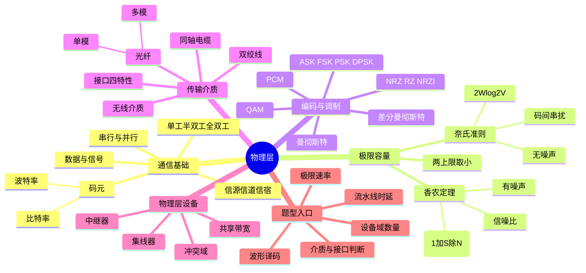

# 计算机网络 第2章 物理层

> 来源：`27王道《计算机网络》高清带书签.pdf`，第2章 物理层，PDF 页码 p42-p61。
> 全局复核：本轮重新读取教材 p42-p61、5 份基础课件、期中/期末卷、P1 强化手稿与题号映射、强化结课考试，共 11 组 132 页；教材及低文本/手稿页共 62 页完成 OCR。
> 图片复核：已直接查看覆盖全部 132 页的 27 张页面联系图，并高清复核 22 个关键原页，覆盖通信模型、极限容量、编码波形、QAM、介质与接口、物理层设备、三节习题解析及强化手写标注。

## 本章速览

- 物理层任务：定义如何在传输介质上传输原始比特流；它关注接口规则和信号含义，不等于传输介质本身。
- 通信基础主线：数据/信号/码元 -> 信道与通信方式 -> 比特率/波特率 -> 奈氏/香农 -> 编码与调制。
- 极限容量抓两条公式：无噪声理想低通信道用奈氏 `2Wlog2V`；有噪声实际信道用香农 `Wlog2(1+S/N)`。
- 编码/调制题多看波形：NRZ 不含同步，曼彻斯特中间跳变，差分曼彻斯特看起始跳变，FSK 改频率，QAM 看状态数。
- 传输介质题重对比：双绞线靠绞合/屏蔽抗干扰，光纤靠全反射，单模远距离，多模短距离。
- 物理层设备只处理比特信号：中继器/集线器不看帧、不寻址、不做协议转换，集线器不隔离冲突域和广播域。

## 课件补充来源

- 教材：`27王道《计算机网络》高清带书签.pdf` 第2章 p42-p61，含正文、三节习题与答案解析、本章小结及疑难点。
- 2.1 基础课件：`2.1.1 通信基础的基本概念.pdf`、`2.1.2 信道的极限容量.pdf`、`2.1.3 编码和调制.pdf`。
- 2.2-2.3 基础课件：`2.2 传输介质.pdf`、`2.3 物理层设备.pdf`。
- 强化与试卷解析：`计网期中试卷及答案解析（学员版）.pdf`、`计网期末试卷及答案解析（学员版）.pdf`、`计网P1_Ch1~Ch3强化【上课版 凌乱手稿】.pdf`、`计网P1_Ch1~Ch3强化【无手稿，题号映射】.pdf`、`计算机网络强化结课考试.pdf`。

## 关联导航

- 本章内部：[[02-物理层#2.1.2 信道的极限容量|奈氏与香农]]、[[02-物理层#2.1.3 编码与调制|编码与调制]]、[[02-物理层#2.2.1 双绞线、同轴电缆、光纤与无线传输介质|传输介质]]、[[02-物理层#2.3 物理层设备|物理层设备]]、[[02-物理层#课件补充/强化题规则|强化题规则]]。
- 前后章联动：[[01-计算机网络体系结构#1.1.6 计算机网络的性能指标|发送/传播时延]]、[[03-数据链路层#3.4 流量控制与可靠传输机制|流水线与信道利用率]]、[[03-数据链路层#CSMA/CD|冲突检测]]、[[03-数据链路层#以太网交换机|交换机隔离冲突域]]。
- 跨层定位：[[03-数据链路层#3.6 局域网|以太网与介质标准]]、[[04-网络层#冲突域与广播域|设备对冲突域/广播域的影响]]。

## 知识网络

## 知识点清单

### 考纲内容与复习提示

- 考纲覆盖：信道、信号、带宽、码元、波特、速率、信源/信宿；奈氏准则和香农定理；编码与调制；传输介质；物理层接口特性；中继器和集线器。
- 本章题型：
  - 计算题：波特率/比特率换算，奈氏/香农极限速率，QAM 状态数，分组发送与传播时延。
  - 概念题：编码波形判断、接口四特性、传输介质特点、物理层设备作用。
- 复习优先级：公式应用和条件判断 > 编码/调制波形 > 传输介质对比 > 中继器/集线器限制。

### 2.1 通信基础

#### 2.1.1 基本概念

##### 数据、信号与码元

- 信息：通信要传递的内容，如文字、图像、视频。
- 数据：信息的载体，是用于传送信息的实体。
- 信号：数据的电气或电磁表现，是数据在传输过程中的存在形式。
- 模拟信号：取值连续；数字信号：取值离散。
- 码元：
  - 一个固定时长的信号波形，表示一个 `k` 进制符号。
  - 码元宽度/信号周期：一个码元持续的时间。
  - 若一个码元有 `V` 种离散状态，则每个码元携带 `log2V` bit。
  - 例如 4 种信号状态可表示 2 bit，16 种信号状态可表示 4 bit。

##### 信源、信道与信宿

- 单向通信系统模型：信源 -> 变换器 -> 信道 -> 反变换器 -> 信宿。图中的噪声源是把通信系统各处噪声集中表示，并非只有信道本身才会产生噪声。
- 信源：产生并发送数据的源头。
- 信宿：接收数据的终点。
- 信道：信号的传输介质或通路。
  - 信道与通信电路不是一回事：一条通信电路可复用出多个用户信道。
  - 一条双向通信线路通常包含发送信道和接收信道。
  - 按信号形式：模拟信道、数字信道。
  - 按传输介质：有线信道、无线信道。
- 基带信号：信源发出的、未调制的原始电信号。
- 基带传输：在信道中直接传送基带信号，常用于短距离通信。
- 宽带信号：将基带信号调制到高频载波上形成的信号。
- 宽带传输：在信道上传输调制后的高频信号。
- 串行传输与并行传输：
  - 串行传输：逐比特按序传输，适合长距离，计算机网络常用。
  - 并行传输：多比特经多条线路同时传输，短距离速度快，常用于计算机内部；线路多、成本高，长距离还会出现串扰和到达时间偏斜。
  - 不要混类：串行/并行描述比特占用几条线路；同步/异步描述收发双方如何保持时序，不是串行/并行的同义词。
- 通信双方交互方式：

| 方式 | 特点 | 信道需求 | 例子 |
| --- | --- | --- | --- |
| 单向通信/单工 | 只有一个方向通信，无反向交互 | 1 个信道 | 广播、电视 |
| 半双工 | 双方都能收发，但不能同时收发 | 可同一信道分时双向传输 | 传统以太网广播通信 |
| 全双工 | 双方可同时发送和接收 | 2 个独立信道，每个方向 1 个 | 电话式通信 |

##### 速率、波特与带宽

- 码元传输速率：
  - 又称波特率/调制速率。
  - 表示每秒传输的码元数，单位 Baud。
  - 只数“每秒多少个码元”，与码元进制本身无关。
- 信息传输速率：
  - 又称比特率。
  - 表示每秒传输的比特数，单位 b/s。
- 二者关系：
  - `比特率 = 波特率 x 每码元比特数 = Baud x log2V`
  - `波特率 = 比特率 / 每码元比特数`
  - 若每隔 `T` 秒发送/采样一个码元，则 `波特率 B=1/T`；反求状态数用 `V=2^(R/B)`。
- 带宽：
  - 模拟通信：信道能传输信号的频率范围，单位 Hz。
  - 数字通信/计算机网络：通信线路传输数据的能力，常表示最大数据传输速率，单位 b/s。

#### 2.1.2 信道的极限容量

- 信号失真因素：码元速率越高、距离越远、噪声越强、介质越差，接收端波形失真越严重。
- 码间串扰：信道带宽有限，高频分量无法通过，导致接收端难以分清码元边界。

##### 奈奎斯特定理/奈氏准则

- 适用：理想低通信道，无噪声、带宽有限。
- 极限码元传输速率：`2W` Baud。
- 极限数据传输速率：
  - `C = 2Wlog2V`
  - `W`：信道频率带宽，单位 Hz。
  - `V`：每个码元的离散电平数/信号状态数。
- 结论：
  - 码元传输速率存在上限，超过上限会产生严重码间串扰。
  - 信道带宽越大，传输码元能力越强。
  - 奈氏准则只直接限制码元传输速率，可通过增加状态数提高每码元比特数；但状态越密越难抗噪，`V` 不能脱离信噪比无限增大，最终还受香农上限约束。

##### 香农定理

- 适用：带宽受限且有高斯白噪声的实际信道。
- 极限数据传输速率：
  - `C = Wlog2(1 + S/N)`
  - `W`：信道频率带宽，单位 Hz。
  - `S`：信号平均功率。
  - `N`：噪声功率。
  - `S/N`：信噪比，代入公式时必须用无单位线性值。
- 分贝换算：
  - `信噪比(dB) = 10log10(S/N)`
  - 常用：`10dB=10`，`20dB=100`，`30dB=1000`，`40dB=10000`。
- 结论：
  - 带宽或信噪比越大，理论极限速率越高。
  - 给定带宽和信噪比后，信息传输速率存在不可突破的上限。
  - 低于该上限时，理论上可找到方法实现任意低误码率。
  - 香农定理给的是理论极限，实际信道可达速率通常更低。
- 奈氏与香农同题：
  - 给了信噪比，先算香农上限。
  - 给了二进制限制、码元状态数、QAM 阶数，再算奈氏上限。
  - 实际极限速率取二者较小值。

#### 2.1.3 编码与调制

- 编码：把数据转换为数字信号。
- 调制：把数据转换为模拟信号。

##### 数字数据编码为数字信号

| 编码 | 判读规则 | 自同步 | 带宽 | 抗干扰 | 常考点 |
| --- | --- | --- | --- | --- | --- |
| 归零 RZ | 高/低电平表示 1/0，每码元中间归零 | 有 | 浪费 | 弱 | 可同步但效率低 |
| 非归零 NRZ | 整个码元保持高/低电平 | 无 | 不浪费 | 弱 | 效率高，但不含时钟信息 |
| 反向非归零 NRZI | 码元起始处有无跳变表示数据；书中约定有跳变为 0、无跳变为 1 | 需增加冗余位辅助同步 | 不太浪费 | 弱 | 兼顾效率和一定同步能力，USB 2.0 采用 |
| 曼彻斯特 | 每个码元中间必跳变，中间跳变既表示时钟又表示数据 | 有 | 浪费 | 强 | 传统以太网采用；408 常按上升沿为 0、下降沿为 1，也可能采用相反约定 |
| 差分曼彻斯特 | 中间跳变只同步；起始处有跳变为 0，无跳变为 1 | 有 | 浪费 | 强 | 只依赖相邻状态关系，抗极性反转，常用于令牌环 |

- 特性对比：
  - NRZ：无自同步能力，不浪费带宽，抗干扰弱。
  - RZ：有自同步能力，但归零浪费带宽。
  - NRZI：比 NRZ 多一定同步能力，比 RZ 省带宽。
  - 曼彻斯特/差分曼彻斯特：自同步能力强，抗干扰强，但占用频带约为原始基带的 2 倍。

##### 模拟数据编码为数字信号

- PCM 脉冲编码调制三步：
  - 采样：周期性取样，把时间连续信号变为时间离散信号。
  - 量化：把连续幅值按预设分级取整，变为离散数值。
  - 编码：把量化后的整数转换为二进制码。
- 采样定理：采样频率不得低于信号最高频率的 2 倍。

##### 数字数据调制为模拟信号

| 调制 | 改变对象 | 题目判别 |
| --- | --- | --- |
| ASK 幅移键控 | 振幅 | 有/无载波或不同幅度表示 0/1，易实现但抗干扰差 |
| FSK 频移键控 | 频率 | 二进制 FSK 需要两个不同频率载波，抗干扰能力强 |
| PSK 相移键控 | 相位 | 绝对相位表示 0/1 |
| DPSK 差分相移键控 | 相邻码元相位差 | 通过当前码元与前一码元相位是否变化表示信息 |
| QAM 正交幅度调制 | 振幅 + 相位 | 状态数越多，每码元比特数越多 |

- QAM：
  - 使用两路同频正交载波，通常为正弦波和余弦波，二者相位差 `90°`。
  - QAM-16：16 种信号状态，每码元 `log2 16 = 4bit`。
  - QAM-64：64 种信号状态，每码元 `6bit`。
  - `QAM-M` 中的 `M` 已是总状态数；除非题目明确给出“`m` 个相位、每相位 `n` 个幅值”，否则不要再把 `M` 乘一次。
  - 若波特率为 `B`，采用 `m` 个相位、每个相位 `n` 种振幅且组合均有效，则状态数 `V=mn`，`R = Blog2(mn)`。

##### 模拟数据直接传输为模拟信号

- 模拟数据可直接用模拟信号形式传输，如传统电话系统中的语音信号。
- 若需通过高频信道传输，可采用：
  - AM 调幅。
  - FM 调频。
  - PM 调相。

#### 2.1.4-2.1.5 习题反查要点

- 波特率/比特率：
  - 若波特率 `B=1000Baud`、数据率 `R=4kb/s`，则每码元 4bit，状态数 `2^4=16`。
  - 若比特率 `64kb/s`、每码元 4 个状态，则每码元 2bit，波特率 `32kBaud`。
  - 阶段卷典型题：`20000Baud`、16 种状态，对应 `20000 x log2 16 = 80kb/s`。
  - 若每隔 `T` 秒发送一个码元，则 `B=1/T`；已知目标数据率时，最少状态数满足 `V>=2^(R/B)`，再取可实现的整数阶数。
- 奈氏计算：
  - 无噪声 8kHz 信道，8 级信号：`2 x 8k x log2 8 = 48kb/s`。
  - 题目给“每秒采样 24k 次”但超过 `2W` 时，不突破奈氏上限。
- 香农计算：
  - `30dB -> S/N=1000`，电话信道 `W=3000Hz`，`C≈3000 x log2(1001)≈30kb/s`。
  - 信道频率范围 `3.5-3.9MHz`，带宽为 `0.4MHz`。
- 两个上限取小值：
  - 二进制信号在 `4kHz`、`S/N=127` 信道：香农 `28kb/s`，奈氏二进制 `8kb/s`，取 `8kb/s`。
  - QAM-32 且带宽/信噪比都提高时，要重新分别算奈氏和香农，再取小值。
- 波形题：
  - 曼彻斯特编码有互补约定，选项若同时出现互补串，以题目约定或王道解析为准。
  - 差分曼彻斯特只看比特周期起始处：有跳变为 0，无跳变为 1。
- 分组传输题：
  - 单个分组经 A-S-B：总时间 = 两段发送时延 + 两段传播时延 + 存储转发处理时间。
  - 两个分组且流水段不等长时，画时空图；相同流水段不能重叠。
  - 教材典型值：一个 `10000bit` 分组经两条 `10Mb/s` 链路，每段传播 `20us`、交换处理 `35us`，总时延 `1000+20+35+1000+20=2075us`。
  - 拆成两个 `5000bit` 分组后，阶段依次为 `500、20、35、500、20us`；第二组可在第一组离开同一发送链路后进入流水线，全部到达为 `1575us`。
  - 虚电路综合式：`s + (h+p)L/(pb) + (h+p)(k-1)/b + m(k-1) + kd`。
  - 变量：报文数据 `L` bit；每组有效载荷 `p` bit、首部 `h` bit；共 `k` 段链路；速率 `b`；每段传播时延 `d`；每个中间结点处理时延 `m`；建连时间 `s`。式中默认 `L/p` 为整数、共有 `k-1` 个中间结点，且存储转发流水理想、无排队；各项依次对应建连、源端发完全部分组、首组经过其余链路、结点处理和传播。

### 2.2 传输介质

#### 2.2.1 双绞线、同轴电缆、光纤与无线传输介质

- 传输介质/传输媒体：发送器与接收器之间的物理通路。
- 分类：
  - 导向传输介质：电磁波被约束在固体介质中传播，如铜线、光纤。
  - 非导向传输介质：电磁波在自由空间中传播，如空气、真空、海水。
- 各类介质承载的本质都是电磁波，满足 `波长 lambda = 传播速度 v / 频率 f`；一般频率越高，波长越短、方向性越强、可用带宽越大，频率越低则绕射能力更强。
- 以太网介质命名读法：`速率 + Base + 介质/段长`。
  - `10Base5`：10Mb/s、基带、粗同轴电缆，单段最长 500m。
  - `10Base2`：10Mb/s、基带、细同轴电缆，数字 2 近似 200m，实际约 185m。
  - `10/100Base-T`：双绞线，典型单段最长 100m，集线器/交换机组网物理拓扑通常为星形；`Base-F` 表示光纤系列。

##### 双绞线

- 结构：两根相互绝缘、按规则绞合的铜导线。
- 绞合目的：减少相邻导线之间的电磁干扰。
- 类型：
  - STP 屏蔽双绞线：外加金属屏蔽层，抗干扰更强。
  - UTP 非屏蔽双绞线：无屏蔽层，成本低、应用广。
- 特点：
  - 价格低廉，是局域网和传统电话网常用介质。
  - 可用于模拟传输，也可用于数字传输。
  - 可用带宽与导线粗细、传输距离等有关：通常导线越粗、距离越短，衰减越小，可支持的带宽越高。
  - 距离太远时，模拟传输用放大器，数字传输用中继器。

##### 同轴电缆

- 结构：内导体、绝缘层、外导体屏蔽层、绝缘保护套层。
- 类型：
  - `50Ω` 同轴电缆：主要用于基带数字信号传输，早期局域网使用。
  - `75Ω` 同轴电缆：主要用于宽带信号传输，有线电视系统常用。
- 特点：
  - 屏蔽性强，抗噪声性能好。
  - 适合较高速率传输。
  - 更粗的内导体可减小电阻和衰减，但教材“为何比双绞线带宽高”的首要判题依据是屏蔽性与抗噪声能力，不是只看铜芯粗细。
  - 局域网中已基本被双绞线取代。

##### 光纤

- 利用光脉冲传递信息：有光脉冲表示 1，无光脉冲表示 0。
- 结构：纤芯 + 包层；包层折射率略低于纤芯。
- 传输原理：光从高折射率介质射向低折射率介质，入射角大于临界角时发生全反射。
- 多模光纤：
  - 允许多条不同角度入射的光线在同一光纤中传播。
  - 输出脉冲展宽，损耗较大，更适合短距离通信。
- 单模光纤：
  - 光纤直径接近光波波长，只允许单一模式传播，几乎无反射。
  - 纤芯极细，需要定向性好的半导体激光器。
  - 衰减小，可实现数千米乃至数十千米无中继传输，适合远距离通信。
- 光纤优点：
  - 通信容量大。
  - 传输损耗小，中继距离长。
  - 抗雷电和电磁干扰强。
  - 无串音干扰，保密性好。
  - 体积小、重量轻。

##### 无线传输介质

- 无线电波：
  - 穿透能力较强，传播距离远。
  - 全向扩散，接收端通常无须对准发射源。
  - 常用于移动通信和 WLAN。
- 微波：
  - 频段高，带宽大，通信容量高。
  - 沿直线传播，地面传输距离受限，通常需要中继站。
- 卫星通信：
  - 利用地球同步卫星作中继。
  - 优点：通信容量大、覆盖范围广、传输距离远，易于广播和多址通信。
  - 缺点：成本高、传播时延长、受气候影响大、保密性差、误码率较高。
- 红外线与激光：
  - 把电信号转换为光信号在自由空间传播。
  - 常用于短距离点对点链路或室内通信。
  - 需视距，强指向，易被障碍物阻挡，不能穿透墙壁。

#### 2.2.2 物理层接口的特性

- 物理层关注如何在各种传输介质上传输比特流，而非介质本身。
- 物理层应屏蔽底层硬件与传输介质差异，使数据链路层感知不到这些差异。

| 特性 | 定义 | 判题例子 |
| --- | --- | --- |
| 机械特性 | 接口连接器形状、尺寸、引脚数目和排列、固定锁定装置 | 接口形状、插头规格 |
| 电气特性 | 电压范围、传输速率、距离限制 | `+10V~+15V`、电缆 15m 以内 |
| 功能特性 | 某条线路上某电平的意义，以及每条线的功能 | 高电平表示何种含义、数据线/控制线/时钟线 |
| 过程特性/规程特性 | 各功能事件发生顺序和时序关系 | 建立连接、传输数据、释放线路的先后顺序 |

#### 2.2.3-2.2.4 习题反查要点

- 双绞线绞合：减少两根导线之间的电磁干扰。
- 屏蔽层：提高电缆抗干扰能力，不是减少物理损坏或电阻。
- 传统以太网采用广播方式，同一时间只允许一台主机发送，因此通信方式是半双工。
- 同轴电缆带宽较高，得益于高屏蔽性，而不只是铜芯更粗。
- 不受电磁干扰和噪声影响的介质：光纤。
- 多模光纤依靠全反射传播光信号。
- 单模光纤：直径接近光的一个波长，光沿直线传播。
- 卫星通信的错误说法：不受气候影响、误码率很低。
- 物理接口题：
  - 电压范围、线缆长度限制 -> 电气特性。
  - 某高电平代表什么意义 -> 功能特性。
  - 事件发生顺序 -> 过程特性。
  - 物理地址/MAC 地址 -> 数据链路层，不属于物理层接口规范。

### 2.3 物理层设备

#### 2.3.1 中继器

- 功能：整形、放大并转发信号，消除长距离传输造成的衰减和失真，扩大传输距离。
- 原理：信号再生，不是简单放大。
  - 再生 = 放大 + 整形。
  - 放大器用于模拟信号，会同时放大噪声；中继器用于数字信号，可减少失真。
- 端口：通常 2 个端口，从一个端口输入，从另一个端口输出。
- 连接范围：
  - 连接的是同一局域网的不同网段，不是不同子网。
  - 所连网段仍构成一个局域网。
  - 可连接不同介质的局域网，如光纤和双绞线，前提是链路层协议相同。
  - 考试口径抓本质：可做物理信号/介质适配，但不能识别帧并完成链路层协议转换，也不能借此连接任意不同网络。
- 限制：
  - 中继器无法对帧解封装/重封装，不能实现链路层协议转换。
  - 只会再生收到的物理信号，错误码形、噪声判成的比特和冲突信号也会被转发，不能检查或纠正帧错误。
  - 两端节点不能同时发送，工作在半双工方式；所连接网段仍处于同一冲突域。
  - 串联数量受网络传播时延限制，不能无限延长。
  - 典型规则：粗同轴 10Base-5 以太网中的 `5-4-3` 规则，即最多 5 个网段、4 台中继器，其中只有 3 个网段可连接主机，另 2 段只作延伸。

#### 2.3.2 集线器

- 本质：多端口中继器。
- 工作方式：
  - 一个端口收到信号后，整形、放大、再生。
  - 转发到除输入端口外的所有工作端口。
  - 不查地址，不定向转发，是共享式广播设备。
- 重要特点：
  - 物理拓扑是星形，逻辑拓扑仍是总线形。
  - 只能半双工工作。
  - 所有端口属于同一个冲突域，也属于同一个广播域。
  - 不具备缓存能力，不具备寻址功能。
  - 不能连接不同链路层协议的网段。
  - 若连接 `10Mb/s` 与 `10/100Mb/s` 网段，可向下协商到共同的 `10Mb/s`；不能让任意不兼容速率同时工作。
- 带宽共享：
  - `10Mb/s` 集线器连接 `n` 台主机，理想平均带宽上限约为 `10/n Mb/s`。
  - 若多台主机同时发送导致冲突，实际平均带宽会更低。

#### 2.3.3-2.3.4 习题反查要点

- “为了使数字信号传得更远”选中继器，不选放大器、网桥、路由器。
- 中继器题常错：原理是再生，不是简单放大；作用于数字信号。
- 集线器接收一个端口的数据后，从除输入端口外的所有端口转发。
- 集线器不能分割冲突域，反而扩大冲突范围。
- 集线器连接的工作站集合：同属一个冲突域，也同属一个广播域。
- 中继器/集线器都在物理层，可放大和整形信号；互连网段数量受规则限制。
- 中继器/集线器不识别帧，正确比特、错误比特和冲突信号都会照样再生转发。
- 中继器可连接不同介质但相同协议的局域网，不能连接不同链路层协议的局域网。
- 设备对域的影响：集线器不隔离冲突域和广播域；交换机每端口隔离冲突域但默认不隔离广播域；路由器接口同时隔离冲突域和广播域。详见 [[04-网络层#冲突域与广播域|设备分域对比]]。

### 2.4 本章小结及疑难点

- 传输介质是否属于物理层：
  - 不属于，常被非正式称为“第 0 层”。
  - 传输介质只承载电信号或光信号，不能区分信号表示 1 还是 0。
  - 物理层通过电气、机械、功能和过程特性，把原始信号解释为有意义的比特流。
  - 记忆：传输介质是信号通道，物理层是规则制定者。
- 基带传输：
  - 直接发送原始数字信号，不经过调制。
  - 占用整个信道带宽，常用于短距离，如局域网或计算机内部连接。
- 频带传输：
  - 把数字信号调制到高频载波上，适合远距离或无线/模拟信道。
  - 电话线上网、Wi-Fi 等属于频带传输。
- 宽带传输：
  - 在传统通信语境中，利用频分复用把一条物理线路划分为多个频带信道。
  - 多个信号可并行传输，如有线电视网络一边上网一边看电视。
- 奈氏准则与香农定理区别：
  - 奈氏准则只考虑带宽限制，说明码元传输速率有上限。
  - 香农定理考虑带宽和噪声，说明可靠信息传输速率有不可突破的理论上限。
  - 提高通信速率通常只能增加带宽、改善信噪比或提高每码元承载比特数，但都受物理限制。
- 为什么信噪比常用 dB：
  - 线性值可能很大，如 `10^9`。
  - 分贝表示更简洁，不易数错，例如 `10^9 -> 90dB`。

## 课件补充/强化题规则

- 强化课高频顺序：奈氏/香农与调制（最高频） > 数字编码波形 > 物理层设备 > 传输介质和接口特性。
- 极限速率五步法：算频带宽度 `W=f高-f低` -> dB 转线性 `S/N=10^(dB/10)` -> 香农算有噪声上限 -> 根据二进制/ASK/QAM 状态数用奈氏算调制上限 -> 取较小值；若实际速率是理论值的某百分比，最后再乘比例。
- 反求状态数：要求 `2Wlog2V` 至少达到目标速率，先求 `log2V`，再取满足条件的最小整数状态数；同时必须确认目标没有超过香农上限。
- 波形题先找码元边界：NRZ 看电平，NRZI 看起始处“跳 0 不跳 1”，曼彻斯特看中间跳变方向，差分曼彻斯特只看起始处且中间必跳。首码若缺前一状态，按题图补出的初始电平判断。
- QAM/调制题：先数“可区分状态”，每码元信息量为 `log2V`；若有 `m` 个相位、每相位 `n` 个幅值，则通常 `V=mn`。二进制 FSK 是 ASK/PSK/DPSK/FSK 中唯一需要两个不同载波频率的方式。
- 不等长流水线不要套 `(k+n-1)t`：把每个分组拆成“发送、传播、处理、下一段发送”等阶段画时空图，同一资源上的同类阶段不能重叠。
- 介质题用关键词定位：绞合/屏蔽 -> 抗电磁干扰；全反射 -> 光纤；单模远、多模近；微波/红外/激光需视距；卫星覆盖广但时延大且受气候影响。
- 接口题四分法：形状尺寸是机械；电压、速率、距离是电气；电平含义/引脚用途是功能；动作先后是过程。MAC 地址不属于物理层接口。
- 设备题先问是否识别帧：中继器/集线器只再生比特，不查 MAC、无缓存、无协议转换；集线器从除输入口外的所有端口转发，所有端口共享带宽和冲突域。
- 介质标准名速解：`100Base-T` 中 100 是 100Mb/s，Base 是基带，T 是双绞线，物理拓扑通常为星形；不能把 `10Base2` 的 185m 套到双绞线标准。

## 易错点/易混点

- 信道不等于通信电路；一条双向通信电路往往包含两个信道。
- 串行/并行是传输排列方式，同步/异步是通信时序方式，选择题不要交叉归类。
- 调制是把数据转换为模拟信号，不是把模拟数据转换为数字信号。
- 波特率是每秒码元数，比特率是每秒比特数；`波特率 = 比特率 / 每码元比特数`。
- 香农公式的 `S/N` 必须用线性值，不能把 `30dB` 直接代入。
- 给出二进制限制或调制状态数时，奈氏和香农两个上限都要算，取较小值。
- 增大码元状态数能提高每码元比特数，但状态更难区分、抗噪性下降，不能据奈氏公式认为 `V` 可无限增大。
- 信号传播速度只影响传播时延，不影响信道数据传输速率。
- 采样率超过 `2W` 不代表数据率能超过奈氏上限。
- 曼彻斯特编码的每个码元中间都跳变；差分曼彻斯特中间跳变只用于同步。
- NRZ 不含同步信息；曼彻斯特和差分曼彻斯特含同步信息，但占用频带更大。
- FSK 是二进制调制中唯一需要两个不同频率载波的方式。
- QAM 的 `V` 是振幅与相位组合后的总状态数，不只是相位数。
- `QAM-M` 的 `M` 已是总状态数；只有题目分别给相位数和幅值数时才相乘。
- `100Base-T` 的 `T` 表示双绞线，典型段长 100m；`10Base2` 才是细同轴电缆约 185m。
- 双绞线绞合减少电磁干扰；屏蔽层提高抗干扰能力。
- 单模光纤适合远距离，多模光纤适合短距离；不要按“粗细越大越远”判断。
- 卫星通信不是不受气候影响；它时延大、费用高、保密性差。
- 物理层接口中，电压范围、传输距离是电气特性；电平含义是功能特性。
- 物理地址/MAC 地址属于数据链路层，不属于物理层接口定义。
- 中继器是信号再生，不是简单放大；放大器会同时放大噪声。
- 集线器物理星形、逻辑总线；它不隔离冲突域和广播域。
- 中继器/集线器不能实现不同链路层协议之间的转换。
- 中继器/集线器可因接口适配连接不同介质，但这不等于能解释、转换不同链路层协议。
- 集线器把速率向下兼容到共同速率，不代表它能让任意不同速率或不同链路层协议直接互通。

## 注解

- 极限速率题入口：先看“无噪声”还是“有噪声”，再看是否给 `V/QAM/二进制限制`，最后取小值。
- `QAM-m` 可直接把 `m` 当状态数：QAM-64 每码元 6bit。
- 差分曼彻斯特读波形：只看码元起始边界，有跳变记 0，无跳变记 1；中间跳变别拿来判数据。
- 物理层接口四特性记忆：外形是机械，电压/距离是电气，电平含义是功能，动作顺序是过程。
- 介质对比速记：双绞线便宜，同轴屏蔽强，光纤容量大且抗干扰，无线靠空间传播。
- 设备判断口诀：物理层设备只搬比特，不识别帧/MAC/IP，不缓存，不选路，不隔离冲突。
- 集线器平均带宽题要写“上限”：理想无冲突才是总带宽除以主机数，实际可能更低。

## 速背检查

1. 数据和信号的区别是什么？答：数据是信息载体，信号是数据的电气/电磁表现。
2. 一个码元有 `V` 种状态，可携带多少比特？答：`log2V` bit。
3. 比特率与波特率关系是什么？答：`比特率 = 波特率 x log2V`。
4. 单工、半双工、全双工的区别是什么？答：单向；可双向但不能同时；可同时双向。
5. 奈氏准则公式是什么？答：`C = 2Wlog2V`。
6. 香农定理公式是什么？答：`C = Wlog2(1+S/N)`。
7. `30dB` 对应的线性信噪比是多少？答：`S/N = 1000`。
8. 同时受奈氏和香农限制时怎么取值？答：分别计算，取较小上限。
9. NRZ 的最大缺点是什么？答：不含同步信息。
10. 曼彻斯特编码的中间跳变有什么作用？答：同步并表示数据。
11. 差分曼彻斯特如何判 0/1？答：起始处有跳变为 0，无跳变为 1。
12. PCM 三步是什么？答：采样、量化、编码。
13. ASK、FSK、PSK 分别改什么？答：幅度、频率、相位。
14. 哪种二进制调制需要两个不同频率载波？答：FSK。
15. QAM-64 每码元携带多少比特？答：6 bit。
16. 双绞线绞合的目的是什么？答：减少电磁干扰。
17. 光纤传输利用什么原理？答：全反射。
18. 单模光纤和多模光纤谁更适合远距离？答：单模光纤。
19. 物理层接口四特性是什么？答：机械、电气、功能、过程。
20. 中继器的原理是什么？答：信号再生，即整形、放大并转发。
21. 集线器收到一个端口信号后如何转发？答：从除输入端口外的所有端口广播出去。
22. 集线器能否隔离冲突域？答：不能，所有端口仍在同一冲突域。
23. `10Mb/s` 集线器连 5 台主机，理想平均带宽上限是多少？答：`2Mb/s`。
24. 传输介质属于物理层吗？答：不属于，常称第 0 层。
25. 信道频率范围为 `3.5-3.9MHz`，带宽是多少？答：`0.4MHz`。
26. 增大码元状态数能否无限提高速率？答：不能，状态越密抗噪性越差，且最终受香农上限约束。
27. `100Base-T` 三部分分别表示什么？答：100Mb/s、基带传输、双绞线。
28. 集线器、交换机、路由器如何隔离冲突域/广播域？答：集线器均不隔离；交换机隔离冲突域；路由器两者都隔离。
29. 每隔 `T` 秒发送一个码元，波特率是多少？答：`B=1/T` Baud。
30. 已知比特率 `R` 和波特率 `B`，最少需要多少状态？答：满足 `V>=2^(R/B)`，并检查香农上限。
31. `QAM-16` 中的 16 表示什么？答：振幅与相位组合后的 16 个总状态，每码元 4 bit。
32. 中继器收到错误或冲突信号会怎样？答：仍会整形再生并转发，不能检查帧错误。
33. `100Base-T` 的典型物理拓扑是什么？答：以集线器/交换机为中心的星形。
34. 两个 `5000bit` 分组为何能比一个 `10000bit` 分组更早全部到达？答：存储转发链路可让不同分组在不同阶段并行形成流水线。
