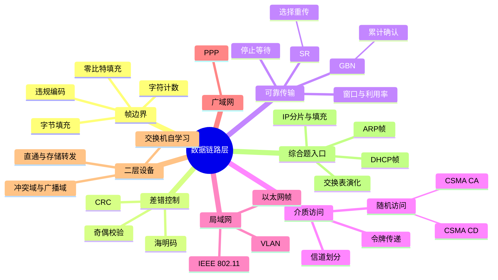

# 计算机网络 第3章 数据链路层

> 来源：`27王道《计算机网络》高清带书签.pdf`，第3章 数据链路层，PDF 页码 p62-p138。
> 全量复核：本轮重新读取教材 p62-p138、22 个基础考点 PDF、期中/期末卷、P1 强化手稿与题号映射及强化结课考试，共 28 组 438 页；193 个扫描/低文本页完成 OCR。
> 图片复核：已直接查看覆盖全部资料的 83 张页面联系图，并高清复核 40 个关键原页，覆盖公式、帧格式、时序图、教材习题、阶段卷与强化综合题；本章结论不直接采用未经原页核对的 OCR 公式。

## 本章速览

- 数据链路层只负责“一段链路/相邻结点”上的帧传输，核心问题是组帧、透明传输、差错检测、流量控制和介质访问控制。
- 可靠传输抓三类 ARQ：停止-等待最简单，GBN 累计确认且回退重传，SR 单独确认且只重传出错帧。
- 共享信道的关键是“谁能发”：静态划分靠频率/时间/码片，随机访问靠竞争，令牌传递靠轮流授权。
- 以太网常考 CSMA/CD、最短帧 64B、MAC 帧格式、交换机自学习；无线局域网常考 CSMA/CA、RTS/CTS、NAV 和 3 个地址字段。
- VLAN 把一个物理 LAN 划成多个逻辑广播域；PPP 是点到点链路上的有连接但不可靠服务。
- 判断设备层次：集线器物理层，交换机数据链路层，路由器网络层；交换机隔离冲突域但默认不隔离广播域。

## 考纲与复习提示

- 本章覆盖数据链路层功能、组帧、差错控制、流量控制与可靠传输、介质访问控制、局域网、广域网协议和二层设备。
- 复习主线是“帧如何可靠/有序/不冲突地在一段链路上传过去”：先定帧边界，再检错，必要时靠 ARQ 重传，共享介质还要解决访问控制。
- 计算题集中在 CRC、海明码、滑动窗口窗口上限、信道利用率、CSMA/CD 最短帧长、CDMA 码片内积。
- 选择题集中在协议边界：PPP 不可靠、以太网不确认、802.11 用 CSMA/CA、交换机隔离冲突域但默认不隔离广播域、VLAN 才划分广播域。

## 课件补充来源

- 教材：`27王道《计算机网络》高清带书签.pdf` 第3章 p62-p138，含正文、各节习题与解析、本章小结及疑难点。
- 3.1-3.4 基础课件：`3.1 数据链路层的功能.pdf`、`3.2 组帧.pdf`、`3.3.1_1 检错编码（奇偶校验码）.pdf`、`3.3.1_2 循环冗余校验码.pdf`、`3.3.2 纠错编码（海明校验码）.pdf`、`3.4_1 流量控制、可靠传输与滑动窗口机制.pdf`、`3.4_2 停止等待协议.pdf`、`3.4_3 后退N帧协议（GBN）.pdf`、`3.4_4 选择重传协议（SR）.pdf`、`3.4_5 三种协议的信道利用率分析.pdf`。
- 3.5 基础课件：`3.5.1 信道划分介质访问控制.pdf`、`3.5.2_1 随机访问介质访问控制.pdf`、`3.5.2_2+3 CSMA CD协议.pdf`、`3.5.2_4 CSMA CA协议.pdf`、`3.5.3 令牌传递协议.pdf`。
- 3.6-3.8 基础课件：`3.6.0 局域网与IEEE 802.pdf`、`3.6.1 局域网的基本概念和体系结构.pdf`、`3.6.2 以太网与IEEE 802.3.pdf`、`3.6.3 IEEE 802.11 无线局域网.pdf`、`3.6.4 VLAN的基本概念与基本原理.pdf`、`3.7 广域网.pdf`、`3.8 以太网交换机.pdf`。
- 强化与试卷解析：`计网期中试卷及答案解析（学员版）.pdf`、`计网期末试卷及答案解析（学员版）.pdf`、`计网P1_Ch1~Ch3强化【上课版 凌乱手稿】.pdf`、`计网P1_Ch1~Ch3强化【无手稿，题号映射】.pdf`、`计算机网络强化结课考试.pdf`。

## 关联导航

- 本章内部：[[03-数据链路层#3.3 差错控制|差错控制]]、[[03-数据链路层#3.4 流量控制与可靠传输机制|滑动窗口与 ARQ]]、[[03-数据链路层#CSMA/CD|CSMA/CD]]、[[03-数据链路层#IEEE 802.11 无线局域网|CSMA/CA]]、[[03-数据链路层#3.6.4 VLAN|VLAN]]、[[03-数据链路层#自学习与转发|交换机自学习]]、[[03-数据链路层#课件补充/强化题规则|强化题规则]]。
- 前后章联动：[[02-物理层#2.1.3 编码与调制|物理层编码]]、[[02-物理层#2.3 物理层设备|集线器与冲突域]]、[[04-网络层#IP 分片|MTU 与 IP 分片]]、[[04-网络层#ARP|ARP]]、[[04-网络层#DHCP|DHCP]]、[[05-传输层#TCP 可靠传输|端到端可靠传输]]。
- 跨层做题：帧长受 [[04-网络层#IP 分片|IP 数据报长度]] 影响；跨网转发先由 [[04-网络层#路由表与转发|路由表]] 选下一跳，再用 [[04-网络层#ARP|ARP]] 求该下一跳的 MAC 地址。

## 知识网络

## 知识点清单

### 3.1 数据链路层的功能

#### 基本概念

- 链路：相邻结点之间的物理线路，不含通信协议。
- 数据链路：链路加上实现通信协议的硬件和软件。
- 帧：数据链路层的协议数据单元，通常由首部、数据部分和尾部组成。
- 数据链路层服务范围：
  - 在一个网络或一段链路上交付帧。
  - 只处理相邻结点之间的问题，不负责端到端传输。
- 两类信道：
  - 点对点信道：一对一通信，如 PPP。
  - 广播信道：一对多共享信道，如早期总线以太网、无线局域网，需要介质访问控制。

#### 主要功能

- 链路管理：
  - 连接建立、维持、释放。
  - 主要用于面向连接服务。
- 封装成帧：
  - 给网络层数据报加首部和尾部，明确帧边界。
  - 首部/尾部可携带地址、控制、类型、差错检测等信息。
  - MTU 是帧的数据部分最大长度，不是整个帧最大长度。
- 透明传输：
  - 数据中即使出现与帧定界符相同的比特/字符，也不能被误判为帧边界。
  - 常靠字节填充、零比特填充等实现。
- 流量控制：
  - 控制发送方速率，防止接收方来不及处理。
  - 数据链路层是相邻结点间控制；传输层是端到端控制。
- 差错检测与可靠传输：
  - 比特差错：某些比特由 0 变 1 或由 1 变 0。
  - 帧差错：帧丢失、重复、失序。
  - 现代有线链路常只做差错检测并丢弃错帧，可靠性通常交给高层。

### 3.2 组帧

| 方法 | 思路 | 优点 | 缺点/考点 |
| --- | --- | --- | --- |
| 字符计数法 | 首部字段写明本帧字节数 | 简单 | 计数字段出错会连带影响后续帧边界 |
| 字节填充法 | 用特殊字符定界，数据中出现特殊字符时前插转义字符 | 适合字符流 | 发送端填充，接收端删除转义 |
| 零比特填充法 | 标志位 `01111110` 定界，数据中连续 5 个 1 后插入 0 | 适合比特流，HDLC 常用 | 接收端见连续 5 个 1 后的 0 要删除 |
| 违规编码法 | 用物理编码中不会出现的码型作为边界 | 无需填充 | 依赖冗余编码，不是所有编码都能用 |

- 字节填充法：
  - SOH/EOT 等特殊字符用于表示帧开始/结束。
  - 数据中出现定界字符或转义字符时，发送端前插 ESC。
  - 接收端删除 ESC，恢复原数据。
- 零比特填充法：
  - 发送端扫描数据字段，每遇到连续 5 个 `1`，立即插入一个 `0`。
  - 接收端扫描比特流，每遇到连续 5 个 `1` 后的 `0`，删除该 `0`。
  - 标志 `01111110` 中有 6 个连续 `1`，因此不会在数据中误出现。

### 3.3 差错控制

#### 基本思想

- 差错控制分为检错编码和纠错编码。
- 编码距离/海明距离：两个码字对应位不同的个数。
- 码距：某编码方案中任意两个合法码字的最小海明距离。
- 码距规律：
  - 检测 `d` 位错：码距至少 `d + 1`。
  - 纠正 `c` 位错：码距至少 `2c + 1`。
  - 同时检测 `d` 位错、纠正 `c` 位错：码距至少 `d + c + 1`，且 `d >= c`。

#### 奇偶校验码

- 在数据后加 1 位校验位，使整个码字中 1 的个数满足奇校验或偶校验。
- 能检测奇数位错误。
- 不能检测偶数位错误，也不能定位错误。
- 码距为 2，因此只能检错，不能纠错。

#### CRC 循环冗余校验

- 约定生成多项式/除数 `G`，其长度为 `r + 1` 位，最高位和最低位必须为 1。
- 发送端：
  - 在原始数据 `M` 后补 `r` 个 0。
  - 用模 2 除法除以 `G`。
  - 得到 `r` 位余数，位数不够时前面补 0。
  - 将余数作为 FCS 附加到 `M` 后发送。
- 接收端：
  - 用同一个 `G` 去除收到的整个帧。
  - 余数为 0 则认为无差错；余数非 0 则判为出错并丢弃。
- 模 2 运算：
  - 加法和减法都等价于异或。
  - 不借位、不进位。
- 注意：
  - 常用 CRC 能检测所有单比特错误；生成多项式次数为 `r` 时，能检测所有长度不超过 `r` 的突发错误，对更长突发错误也有很高检出率。
  - 余数为 0 只表示“按当前生成多项式未检出错误”，不能据此断言物理传输绝对无错。
  - CRC 只负责检错，不提供纠错；是否重传取决于上层或链路协议是否实现 ARQ。
  - FCS 是冗余校验序列；CRC 是生成/校验方法，二者不要混为一谈。

#### 海明码

- 目的：通过少量校验位实现单比特错误定位与纠正。
- 校验位数量：
  - 数据位 `n`，校验位 `k`，需满足 `2^k >= n + k + 1`。
  - `+1` 表示还要包含“无错”状态。
- 校验位位置：
  - 放在 1、2、4、8 等 `2^i` 位置。
  - 其余位置放数据位。
- 校验关系：
  - 每个数据位由若干校验位共同校验。
  - 某一位所在编号的二进制形式决定它参与哪些校验组。
- 错误定位：
  - 各校验组结果组成 syndrome。
  - syndrome 为 `000...0` 表示无错；非 0 时，其二进制值就是出错位置。
- 例：数据 `1010` 需要 3 个校验位，形成 7 位海明码；书中示例采用偶校验得到 `1010010`。
- 基本海明码的码距为 3，可纠正 1 位错；若直接按 syndrome 纠错，则无法区分“1 位错”和“2 位错”，可能把双错误纠。
- 扩展海明码在基本海明码外再加 1 位总体奇偶校验，形成 SECDED（纠正 1 位、检测 2 位）：

| syndrome | 总体奇偶校验 | 判断与处理 |
| --- | --- | --- |
| 0 | 通过 | 无错 |
| 非 0 | 失败 | 1 位错，按 syndrome 指示位置纠正 |
| 非 0 | 通过 | 2 位错，只能检出，需重传 |
| 0 | 失败 | 仅总体校验位出错，改正该位 |

### 3.4 流量控制与可靠传输机制

#### 三类窗口

| 协议 | 发送窗口 | 接收窗口 | 接收策略 | 重传策略 |
| --- | --- | --- | --- | --- |
| 停止-等待 | `W_T = 1` | `W_R = 1` | 一次收一个 | 超时重传当前帧 |
| GBN | `W_T > 1` | `W_R = 1` | 只收按序帧 | 出错帧及其后所有已发未确认帧 |
| SR | `W_T > 1` | `W_R > 1` | 可缓存失序正确帧 | 只重传出错/超时帧 |

#### 滑动窗口机制

- 发送窗口：发送方当前允许连续发送的帧序号范围。
- 接收窗口：接收方当前允许接收的帧序号范围。
- 窗口滑动：
  - 发送方收到确认后，发送窗口向前移动。
  - 接收方收到期望帧后，接收窗口向前移动。
- 层次辨析：数据链路层窗口通常按“帧”计数且协议参数相对固定；TCP 窗口按“字节”计数，并由接收方动态通告，见 [[05-传输层#TCP 流量控制|TCP 流量控制]]。
- 用 `n` 比特编号时，序号空间大小为 `2^n`。
- 一般约束：`W_T + W_R <= 2^n`，否则新帧和旧帧序号可能混淆。
- 读题先辨口径：若题目说“序号字段为 `n` bit”，序号总数是 `2^n`；若说“共 `N` 个序号/编号为 `0~N-1`”，GBN 最大发送窗口是 `N-1`，不能再对 `N` 取指数。

#### 停止-等待协议

- 发送方每发一帧，必须等待该帧 ACK 后才能发下一帧。
- 只需 1 比特编号，区分相邻两帧即可。
- 发送方需保存已发送但未确认的帧副本。
- 可能问题：
  - 数据帧丢失：发送方超时重传。
  - ACK 丢失：发送方重传，接收方识别重复帧并丢弃，再重发 ACK。
  - ACK 迟到：发送方可能已重传，迟到 ACK 通常被忽略或作为重复确认处理。
- 利用率：
  - `U = T_D / (T_D + RTT + T_A)`
  - `T_D` 是数据帧发送时延，`T_A` 是 ACK 发送时延，常可忽略。
  - RTT 远大于发送时延时，停止-等待效率很低。

#### GBN 协议

- Go-Back-N：回退 N 帧。
- 接收方只接收按序到达的帧，对失序帧直接丢弃。
- ACK 是累计确认：
  - `ACKn` 表示 n 号及以前帧都已正确收到，下一帧期望 n+1。
- 发送方只需要为最早未确认帧设置计时器。
- 一旦超时，重传该帧以及它之后所有已发送但未确认的帧。
- 用 `n` 比特编号时：
  - `1 < W_T <= 2^n - 1`
  - `W_R = 1`
  - 若 `W_T = 2^n`，所有 ACK 丢失时旧帧重传会与新一轮帧序号混淆。

#### SR 协议

- Selective Repeat：选择重传。
- 接收方可接收并缓存失序但正确的帧。
- 每个正确帧单独确认；发送方为每个未确认帧设置计时器。
- 出错/丢失的帧可由超时或 NAK 触发重传。
- 用 `n` 比特编号时：
  - `W_T + W_R <= 2^n`
  - `W_R <= W_T`
  - 常取 `W_T = W_R = 2^(n-1)` 以充分利用序号空间。

#### 连续 ARQ 的信道利用率

- 发送窗口为 `N`，最多连续发送 `N` 个数据帧。
- 若 `N T_D < T_D + RTT + T_A`：
  - `U = N T_D / (T_D + RTT + T_A)`
- 若 `N T_D >= T_D + RTT + T_A`：
  - `U = 1`
- 平均数据传输速率：
  - `平均速率 = 信道利用率 x 信道带宽`
  - 或 `平均速率 = 一个发送周期发送的数据量 / 发送周期`

### 3.5 介质访问控制

#### 三类 MAC 方法

| 类型 | 代表方法 | 特点 |
| --- | --- | --- |
| 信道划分 | FDM、TDM、STDM、WDM、CDM/CDMA | 静态或半静态分配资源，冲突少 |
| 随机访问 | ALOHA、CSMA、CSMA/CD、CSMA/CA | 用户随机竞争信道，可能冲突 |
| 轮询访问 | 轮询、令牌传递 | 按顺序授权发送，适合高负载 |

#### 信道划分

- FDM 频分复用：
  - 将频带划分为多个子信道，用户同时用不同频段通信。
  - 需留保护频带，避免相邻频段干扰。
- TDM 时分复用：
  - 按固定时间片轮流使用信道。
  - TDM 帧是时间概念，不是数据链路层的帧。
  - 用户无数据时仍占时间片，可能浪费。
- STDM 统计时分复用：
  - 动态分配时间片，只给有数据的用户。
  - 线路利用率高于固定 TDM。
- WDM 波分复用：
  - 光纤中的频分复用，用不同波长承载不同信号。
- CDM/CDMA 码分复用：
  - 各站使用相互正交的码片序列。
  - 发送 1：发送本码片；发送 0：发送反码片。
  - 码片常用 `+1/-1` 表示，归一化内积满足：自身为 1，反码为 -1，正交码为 0。
  - 接收端用目标站码片与叠加信号做内积，结果为 1 表示发送 1，为 -1 表示发送 0。

#### 随机访问

- ALOHA：
  - 纯 ALOHA：有数据立即发送，冲突后随机等待再发。
  - 纯 ALOHA 的易受干扰期为 `2T`，理论最大吞吐率约为 `1/(2e)=18.4%`。
  - 时隙 ALOHA：只能在时隙开始发送，减少冲突范围。
  - 时隙 ALOHA 的易受干扰期为 `T`，理论最大吞吐率约为 `1/e=36.8%`。
- CSMA：
  - 发送前先侦听信道，不能完全避免冲突，因为信号传播有时延。
- 1-坚持 CSMA：
  - 信道空闲立即发送；信道忙则持续侦听。
  - 空闲时抢发积极，冲突概率较高。
- 非坚持 CSMA：
  - 信道忙则随机等待一段时间再侦听。
  - 冲突少，但信道可能空闲时没人立即发送。
- p-坚持 CSMA：
  - 适用于时隙信道。
  - 信道空闲时以概率 `p` 发送，以 `1-p` 概率推迟到下一时隙。

#### 令牌传递

- 令牌是特殊控制帧，持有令牌的站点才可发送数据。
- 无冲突，访问公平，适合负载较高的网络。
- 空闲时令牌在环中循环；发送站获得令牌后发出数据帧，目的站复制数据并设置响应位，数据帧继续绕环回到源站，由源站收回后重新释放令牌。
- 最坏等待时间要计入其他各站允许持有令牌的最长时间及令牌环行传播时间，而不是只算本帧发送时间。

### 3.6 局域网

#### 局域网基础

- 局域网特点：范围小、速率高、时延低、误码率低、各站平等、支持广播和多播。
- 决定 LAN 性能的三要素：
  - 拓扑结构。
  - 传输介质。
  - 介质访问控制方法，其中 MAC 方法最关键。
- IEEE 802 将数据链路层拆为：
  - LLC：逻辑链路控制，向网络层提供统一接口。
  - MAC：介质访问控制，负责访问控制、帧格式、寻址、差错检测等。
- 网络适配器/NIC 横跨物理层与数据链路层：负责串/并转换、缓存、编码与解码、帧封装/解封装、MAC 寻址和介质访问控制；MAC 地址属于接口，不是整台主机只固定一个。
- 常见实现：
  - 以太网：逻辑总线，物理可为总线或星形。
  - 令牌环：逻辑环形。
  - FDDI：逻辑环形，物理双环。

#### 以太网与 IEEE 802.3

- 以太网服务：
  - 无连接，不编号，不确认。
  - 提供不可靠交付，错帧直接丢弃。
  - 差错恢复交给高层协议。
- 传统以太网使用曼彻斯特编码。
- 以太网地址：
  - MAC 地址 48 bit，即 6B。
  - 前 24 bit 通常为厂商标识，后 24 bit 由厂商分配。
  - 每个网络适配器/接口都有自己的 MAC 地址。
- 帧接收：
  - 单播：目的 MAC 是本机地址。
  - 广播：`FF-FF-FF-FF-FF-FF`。
  - 多播：属于本机加入的多播组。
  - 目的地址不接收、FCS 错误或帧长非法（如小于最短帧）的帧通常直接丢弃，不确认、不重传。
- 常见 10Mb/s 以太网：

| 名称 | 介质 | 拓扑/连接 | 最大段长 |
| --- | --- | --- | --- |
| 10Base-5 | 粗同轴电缆 | 总线 | 500m |
| 10Base-2 | 细同轴电缆 | 总线 | 185m |
| 10Base-T | 双绞线 | 星形 | 100m |
| 10Base-F | 光纤 | 点对点 | 2000m |

#### CSMA/CD

- 适用：总线型或半双工共享式以太网。
- 不适用：全双工交换式以太网。
- 口诀：先听后发，边听边发，冲突停发，随机重发。
- 争用期/冲突窗口：
  - 最大端到端往返传播时延 `2τ`。
  - 发送后若经过 `2τ` 未检测到冲突，就认为本帧不会再发生冲突。
- 最短帧长：
  - `最短帧长 = 2 x 最大单向传播时延 x 数据传输速率`
  - 10Mb/s 以太网争用期为 `51.2us`，可发送 `512bit = 64B`。
  - 小于 64B 的帧必须填充到 64B。
- 退避算法：
  - 冲突后发送干扰信号，通知所有站点。
  - 基本退避时间为一个争用期。
  - 第 `i` 次重传取 `k = min(i, 10)`，随机数 `r` 从 `[0, 2^k - 1]` 中选取，等待 `r x 2τ`。
  - 重传 16 次仍失败则放弃并向高层报告。
- 帧间最小间隔：
  - 10Mb/s 以太网为 `9.6us`，即 96 bit 发送时间。

#### 以太网 MAC 帧

- DIX Ethernet V2 最常考字段：

| 字段 | 长度 | 含义 |
| --- | --- | --- |
| 目的地址 | 6B | 目的 MAC 地址 |
| 源地址 | 6B | 源 MAC 地址 |
| 类型 | 2B | 上层协议类型 |
| 数据 | 46-1500B | 上层数据，短于 46B 要填充 |
| FCS | 4B | CRC 校验序列 |

- 物理层还会在 MAC 帧前插入 8B 前导码：
  - 7B 前同步码 + 1B 帧开始定界符。
  - 前导码不属于 MAC 帧，不计入 64B 最短帧长。
- 以太网帧无帧结束定界符：
  - 通过帧间间隔和编码空闲状态识别结束。
  - FCS 位于末尾，帮助确定数据字段结束并检错。
- 关键长度：
  - 最小 MAC 帧长：64B。
  - 最大数据字段：1500B，即以太网 MTU。
  - 首部和尾部共 18B，所以最小数据字段为 `64 - 18 = 46B`。

#### 高速以太网

- 100Base-T：
  - 双绞线星形，100Mb/s。
  - 支持全双工和半双工；半双工才用 CSMA/CD。
  - 最短帧仍为 64B，最大网段通常 100m。
  - 帧间间隔缩短为 `0.96us`。
- 千兆以太网：
  - 支持全双工和半双工，但实际常用全双工。
  - 仍兼容以太网帧格式。
- 10GbE：
  - 只支持全双工。
  - 不再使用 CSMA/CD。
  - 帧格式仍与以太网兼容。

#### IEEE 802.11 无线局域网

- 两种组织方式：
  - 有基础设施：站点通过 AP 接入，基本服务集 BSS 由 AP 和若干站点构成，以 SSID 标识；多个 BSS 可经分配系统 DS 组成 ESS。
  - 无固定基础设施：自组织网络，各站点平等通信。
- Portal 是 802.11 无线 LAN 接入其他 802 有线 LAN 的逻辑入口；AP 常需在 802.11 帧与以太网帧之间做格式转换。
- 802.11 使用 CSMA/CA，不使用 CSMA/CD：
  - 无线发送时难以同时检测冲突。
  - 存在隐藏站/暴露站问题。
  - 一旦冲突，往往整个帧已发完，代价更高。
- 802.11 引入 ACK/重传机制，可视为停止-等待式可靠传输。
- 介质访问方式：
  - DCF：分布式协调功能，必选，竞争访问信道。
  - PCF：点协调功能，可选，较少使用。
- IFS 间隔：
  - SIFS 最短：ACK、CTS、分片响应等高优先级短控制帧。
  - PIFS：PCF 使用。
  - DIFS 最长：DCF 中普通数据帧/管理帧发送前等待。
- CSMA/CA 基本过程：
  - 新帧到达时若信道持续空闲，等待 DIFS 后可直接发送，不必先随机退避。
  - 若信道忙、发生重传或已进入竞争，选择随机退避计数；竞争窗口随失败增大，常考最大为 1023 个时隙。
  - 退避计数在信道忙时冻结，信道重新空闲并等待 DIFS 后继续倒计时。
  - 未收到 ACK 则认为失败，增大退避窗口后重传。
- RTS/CTS 与 NAV：
  - RTS/CTS 用短控制帧预约信道，减少隐藏站导致的冲突。
  - 完整预约时序：`DIFS -> RTS -> SIFS -> CTS -> SIFS -> DATA -> SIFS -> ACK`。
  - 听到 RTS、CTS 或 DATA 的站点根据 Duration 字段设置 NAV，在预约时间内保持沉默。
  - RTS/CTS 有额外开销，通常只在数据帧较长或隐藏站明显时使用。
- CSMA/CD 与 CSMA/CA 区别：
  - CD：边发边听，检测到冲突就停止。
  - CA：先预约/退避，尽量避免冲突，不能保证完全无冲突。

#### 802.11 帧地址

- 802.11 数据帧常有 3 个地址字段。
- Address 1：直接接收方。
- Address 2：直接发送方。
- Address 3：原始源地址或最终目的地址，取决于帧方向。

| 方向 | To DS | From DS | 地址1 | 地址2 | 地址3 |
| --- | --- | --- | --- | --- | --- |
| 站点发往 AP | 1 | 0 | AP | 源站点 | 最终目的 |
| AP 发往站点 | 0 | 1 | 目的站点 | AP | 原始源 |

- `To DS=From DS=1` 用于无线分布系统/桥接，帧中需要第 4 个地址；普通站点通过 AP 通信通常只考上表三地址。
- 常见三地址数据帧首部为 24B；`To DS=From DS=1` 增加第 4 个 6B 地址后为 30B，随后是最多 2312B 的帧体和 4B FCS。

### 3.6.4 VLAN

- 一个普通以太网通常是一个广播域。
- VLAN：把一个大型局域网划分为若干逻辑上的独立 VLAN。
- 同一 VLAN 内主机可直接二层通信。
- 不同 VLAN 之间不能直接二层通信，需要路由器或三层交换机转发。
- VLAN 划分方法：
  - 基于端口：最简单、最常用，主机换端口可能进入新 VLAN。
  - 基于 MAC 地址：主机移动后仍可保持原 VLAN。
  - 基于 IP 地址/网络层协议：交换机依据网络层信息决定 VLAN 归属；这是成员分类方式，不表示普通二层广播能穿越路由器。
- IEEE 802.1Q：
  - 在源地址字段和类型字段之间插入 4B VLAN 标签。
  - 标签类型固定为 `0x8100`。
  - VID 为 12 bit，理论有 4096 个编号；`0` 和 `4095` 保留，通常可用 4094 个 VLAN。
  - 插入标签后 FCS 必须重新计算。
  - 最小帧长仍为 64B，因此数据字段最小值可从 46B 降为 42B。
  - 最大帧长由 1518B 增至 1522B。
- 链路类型：
  - 接入链路：主机与交换机之间，通常传普通以太网帧。
  - 干线链路/Trunk：交换机之间，传带 VLAN 标签的 802.1Q 帧。
  - 交换机向主机转发前通常剥离 VLAN 标签。
- 同一 VLAN 可借助 Trunk 跨越多台交换机，但仍是一个二层广播域；路由器是广播域边界，跨 VLAN 通信必须经过三层转发。

### 3.7 广域网与 PPP

#### 广域网

- WAN 范围大，强调远距离数据传输；LAN 范围小，强调资源共享。
- WAN 常采用点对点链路和分组交换。
- 广域网内部结点交换机用于存储转发分组。
- 路由器用于连接不同网络，不等同于 WAN 内部结点交换机。

#### PPP

- PPP：Point-to-Point Protocol，点到点链路控制协议。
- 常见场景：
  - 用户接入 ISP。
  - 两台网络设备通过点对点链路互连。
  - PPPoE 是把 PPP 封装在以太网帧中。
- PPP 三个组成部分：
  - LCP：建立、配置、测试和释放数据链路。
  - NCP：为不同网络层协议建立和配置逻辑连接。
  - 将 IP 数据报封装到串行链路中的方法。
- PPP 帧格式：

| 字段 | 长度 | 说明 |
| --- | --- | --- |
| F | 1B | 标志，`0x7E` |
| A | 1B | 地址，固定 `0xFF` |
| C | 1B | 控制，固定 `0x03` |
| 协议 | 2B | 指明信息字段承载的协议 |
| 信息 | 0-1500B | 上层数据 |
| FCS | 2B | CRC 检错 |
| F | 1B | 结束标志，`0x7E` |

- 透明传输：
  - 异步链路采用字节填充，转义字符 `0x7D`。
  - 同步链路采用零比特填充。
- PPP 特点：
  - 面向字节。
  - 只支持点到点全双工链路，不支持多点线路。
  - 可支持多种网络层协议。
  - 建链过程有确认，但数据传输阶段不编号、不确认。
  - 通过 FCS 检错，错帧直接丢弃，因此是“有连接的不可靠服务”。
  - 无 CSMA/CD，也没有最短帧长限制，信息字段可为 0B。
- PPP 状态过程：
  - 链路静止 -> 建立物理连接 -> LCP 配置 -> 可选认证 -> NCP 配置 -> 数据传输 -> 链路终止。

### 3.8 数据链路层设备

#### 以太网交换机

- 交换机本质：多端口网桥，工作在数据链路层。
- 作用：
  - 每个端口形成独立冲突域。
  - 端口直连主机时通常全双工，不使用 CSMA/CD。
  - 多对端口可并行通信，整机吞吐量可接近 `端口数 x 端口速率`。
  - 默认仍属于同一广播域，除非划分 VLAN。
- 端口连接集线器时：
  - 集线器侧所有设备仍在同一冲突域。
  - 该端口通常只能半双工，并需使用 CSMA/CD。

#### 交换方式

| 方式 | 工作过程 | 优点 | 缺点 |
| --- | --- | --- | --- |
| 直通交换 | 读到目的 MAC 后立即转发 | 时延低 | 不检查 FCS，可能转发错帧 |
| 存储转发 | 收完整帧并校验后再转发 | 可靠，可支持不同速率端口 | 时延较大 |

- 直通交换从 MAC 帧首比特开始计时，至少收完 6B 目的地址才能决定端口，理想引入时延约为 `48/R_in`，另加查表/处理时延；题目若计前导码则按题设再加。
- 存储转发至少先等待 `L/R_in` 收完整帧，之后才能检验 FCS、做速率匹配或协议转换；不能把两种方式都统一按整帧接收计时。

#### 自学习与转发

- 交换表字段：MAC 地址 + 端口号 + 老化信息。
- 收到帧后：
  - 学习源 MAC：把源 MAC 与入端口写入或更新交换表。
  - 查目的 MAC：决定转发方式。
- 转发规则：
  - 已知单播：只从对应端口转发。
  - 已知目的端口与入端口相同：过滤/丢弃，不再从其他端口转发。
  - 未知单播：向除入端口外的所有端口泛洪。
  - 广播帧：向除入端口外的所有端口泛洪。
  - 组播帧：通常按泛洪处理或按组播表处理。
- 老化机制：
  - 主机位置会变化，交换表项需超时删除。
- STP：
  - 以太网交换网络可能因冗余链路形成环路，引发广播风暴和帧循环。
  - STP 阻塞部分端口，形成无环逻辑拓扑。
  - 主链路故障时，可重新启用被阻塞端口恢复连通。

#### 共享式以太网与交换式以太网

| 对比 | 共享式以太网/集线器 | 交换式以太网/交换机 |
| --- | --- | --- |
| 工作层次 | 物理层 | 数据链路层 |
| 通信方式 | 半双工 | 全双工为主 |
| 带宽 | 所有主机共享 | 每端口独占 |
| 冲突域 | 全网一个冲突域 | 每端口一个冲突域 |
| 广播域 | 一个广播域 | 默认一个广播域 |
| 转发方式 | 盲目广播所有比特 | 按 MAC 表定向转发 |
| 安全性/效率 | 低 | 较高 |

### 3.9 本章小结及疑难点

- 连续 ARQ 中，若接收窗口为 1，则发送窗口最大只能是 `2^n - 1`：
  - 若发送窗口等于 `2^n`，发送方一轮编号全发完后，旧帧重传和新一轮同编号帧会让接收方无法区分。
  - GBN 正是 `W_R=1`，所以 `W_T <= 2^n - 1`。
- PPP 不用帧编号和确认机制来实现可靠传输：
  - PPP 运行在点到点链路上，链路层只做 FCS 检错，错帧直接丢弃。
  - IP 本身是尽最大努力交付，真正端到端可靠性通常由 TCP 等高层实现。
  - 加入编号、确认、重传会增加开销和时延，现代链路误码率较低，收益不大。
- CSMA/CD 中，若某帧在冲突窗口内未发生冲突，后续不会再发生冲突：
  - 冲突窗口是最远两站之间的往返传播时延 `2τ`。
  - 若 `2τ` 内没有检测到冲突，说明该帧的信号已到达所有站，其他站会听到忙而保持静默。
- 以太网速率提高时要维持冲突检测条件：
  - 最短帧发送时间必须不小于 `2τ`。
  - 从 10Mb/s 升到 100Mb/s，若最短帧仍为 64B，就要缩短最大网段长度或缩短帧间最小间隔。
- 习题反查优先抓“边界条件”：窗口编号是否会二义、最短帧是否能覆盖往返时延、是否需要 ACK/重传、设备是否隔离冲突域或广播域。

## 课件补充/强化题规则

| 强化优先级 | 课件统计 | 必须会做 |
| --- | --- | --- |
| 滑动窗口 | 小题 9、大题 2 | 窗口上限、时序图、确认/超时、利用率和极限速率 |
| 交换机 | 小题 8、大题 3 | 从空表逐帧学习、转发/泛洪/过滤、冲突域与广播域 |
| CSMA/CD | 小题 6、大题 2 | 距离与传播时延、`2τ`、最短帧、退避次数 |
| 802.11/CSMA/CA | 小题 5、大题 1 | 三地址、IFS、RTS/CTS/NAV 时序 |
| 跨层综合 | DHCP 大题 1、IP 大题 2、ARP 小题 2/大题 3 | 把网络层报文落实为源/目的 MAC 和交换表变化 |

- 滑动窗口时序题：先写序号空间和 `W_T/W_R`，再沿时间轴逐帧标“发送、到达、ACK、超时”；GBN 只看最后累计 ACK，重传其后全部未确认帧，SR 则只重传缺失帧。统一利用率可写成 `U=min(1, W_T T_D/(T_D+RTT+T_A))`，有效速率为 `U x 链路速率`。
- 停止-等待反求帧长：先由 `U=T_D/(T_D+2T_p+T_A)` 解出 `T_D`，再用 `L=R T_D`；题目说“至少达到某利用率”时，要保留不等号方向和 ACK 发送时延是否忽略。
- CSMA/CD 综合题：先算 `τ=距离/传播速度`，再把中继器/集线器等附加时延计入最坏往返路径；从开始发送到检测冲突的时间范围不超过 `2τ`。必须满足 `L_min/R >= 2τ`，题目改变速率、距离或设备时只需重新守住这个不等式。
- 二进制指数退避：第 `i` 次冲突用 `k=min(i,10)`；第 10 次后随机范围不再扩大，但仍可重传；第 16 次失败才放弃。不要把“指数上限 10”误当成“最多重传 10 次”。
- 802.11 预约题：先写 `DIFS-RTS-SIFS-CTS-SIFS-DATA-SIFS-ACK`；听到帧的非收发站按 Duration 设置 NAV。计算 NAV 时只累计该站听到当前帧之后尚未完成的 SIFS、控制帧和数据帧时长。
- 802.11 地址题：先判 `To DS/From DS`，地址 1/2 始终是本次无线链路的直接收/发方，地址 3 才补最终目的或原始源；不要直接把地址 1/2 当端到端地址。
- 空交换表模拟：每收到一帧都先用“源 MAC + 入端口”学习，再查目的 MAC；未知/广播就泛洪，已知异端口就定向转发，已知同端口就过滤。即使某主机不是最终目的，只要它发过帧，交换机就可能学到它。
- 交换时延题：直通交换只需收到能够识别目的 MAC 的前部后即可转发；存储转发必须先收完整帧，额外至少有一个 `帧长/入链路速率`。若多段链路串联，还要逐段加发送、传播和题设处理时延。
- DHCP 与链路层：初始分配按 DORA 追踪。Discover、Request 的源 MAC 是客户机，目的 MAC 是广播；常见 408 初始无地址模型中 Offer、ACK 也按服务器端口发出的广播帧分析，若题目明确可单播或给出广播标志则按题设。四类报文的网络层细节见 [[04-网络层#DHCP|DHCP]]。
- IP 与帧长：IP 数据报小于以太网 46B 最小数据字段时，由以太网在帧数据字段补齐；大于 MTU 时由网络层 [[04-网络层#IP 分片|IP 分片]]，不是数据链路层把帧“切碎”。802.1Q 帧因多 4B 标签，最小数据字段降为 42B。
- 以太网填充题直接用 `填充量=max(0,46-上层数据字节数)`；64B 最短 MAC 帧的 18B 首尾开销不含 8B 前导码。
- ARP 与链路层：同一广播域内 ARP 请求用广播 MAC、应答通常单播；跨网发送时解析的是默认网关/下一跳接口 MAC，不是远端主机 MAC。IP 源/目的通常端到端不变，帧的源/目的 MAC 每跳重写。
- DHCP/ARP/交换机综合题：按真实发生顺序列帧，逐帧同时更新交换表和各主机 ARP 缓存；交换机只看源 MAC 学习，ARP 缓存记录 IP-MAC 映射，两张表不能混写。若题目声明 ARP 被动学习，收到广播请求的主机也记录请求方映射。
- 低频但要保分：考前回看帧定界、奇偶/CRC/海明码、FDM/TDM/WDM/CDMA、PPP“检错但不确认重传”等定义边界。

## 易错点/易混点

- 数据链路层交付范围是相邻结点，不是端到端；端到端可靠性主要由传输层处理。
- 链路不等于数据链路；前者只是物理线路，后者包含协议和控制机制。
- MTU 是数据字段最大长度，不包括帧首部和尾部。
- 数据链路层流量控制是点到点/相邻结点，传输层流量控制是端到端。
- 透明传输解决的是“数据中出现定界符也能当普通数据传输”的问题。
- 字符计数法的计数字段一旦出错，可能导致后续帧边界全乱。
- 零比特填充是连续 5 个 1 后插 0，不是看到 6 个 1 才插。
- 奇偶校验只能检测奇数位错误，不能检测偶数位错误，也不能定位。
- CRC 的余数位数必须是 `r` 位；不足要在高位补 0。
- CRC 检错失败的帧通常直接丢弃，不会自动纠正。
- CRC 校验余数为 0 也只是“未检出”，不是传输绝对无错的数学证明。
- 海明码条件是 `2^k >= n+k+1`，不要漏掉无错状态。
- 扩展海明码中“syndrome 非 0、总体校验通过”表示双比特错，只能检出，不能照 syndrome 改位。
- GBN 的 ACK 是累计确认；SR 的 ACK 是逐帧确认。
- GBN 接收窗口固定为 1，失序帧即使正确也丢弃。
- SR 能缓存失序帧，但必须满足 `W_T + W_R <= 2^n`。
- 停止-等待效率低的根源是 RTT 大时信道大部分时间在等 ACK。
- 连续 ARQ 利用率要先判断 `N T_D` 是否覆盖一个发送周期，再决定是否取 1。
- TDM 帧是时间周期，不是数据链路层帧。
- CDMA 中 1 发本码片，0 发反码片；内积为 -1 代表发送 0。
- CSMA 先听后发仍可能冲突，因为传播时延导致多个站点以为信道空闲。
- CSMA/CD 只用于半双工共享式以太网；全双工交换式以太网不用 CSMA/CD。
- 以太网最短帧 64B 不包括 8B 前导码。
- 以太网最大数据字段 1500B，即 MTU；最小数据字段 46B。
- 如果某站在发送前 64B 内未检测到冲突，后续不会再发生冲突。
- 二进制指数退避的 `k` 最大取 10，但失败次数可到 16 次后放弃。
- 802.11 用 CSMA/CA 而不是 CSMA/CD；CA 只能降低冲突概率，不能保证无冲突。
- 首次侦听到信道持续空闲时等 DIFS 可直接发；经历忙信道或重传后才进入随机退避，不要见到 CSMA/CA 就机械加退避。
- RTS/CTS 是可选机制，适合隐藏站明显或长帧发送，不是每次必用。
- 802.11 的 Address 1/2 是直接收发双方，不一定是原始源和最终目的。
- VLAN 是逻辑广播域划分，不是新的物理局域网。
- 不同 VLAN 间不能直接二层通信，必须经三层设备。
- 同一 VLAN 可以跨多台交换机，但普通二层 VLAN 不跨路由器；“跨交换机”和“跨广播域”不是一回事。
- 802.1Q 标签插入后最大帧长变 1522B，FCS 必须重算。
- PPP 有连接体现在建链协商；不可靠体现在数据传输不编号、不确认、错帧丢弃。
- PPP 没有最短帧长限制，因为它是点到点链路，不使用 CSMA/CD。
- 交换机学习的是源 MAC 地址，不是目的 MAC 地址。
- 直通交换通常收完目的 MAC 即可开始转发；存储转发必须收完整帧后再校验，二者的时延起点不能混用。
- 未知单播和广播都会泛洪，但已知单播只定向转发。
- 交换机隔离冲突域，但默认不隔离广播域；VLAN 才能隔离广播域。
- 集线器连接的所有主机共享带宽并处于同一冲突域；交换机每个端口独占带宽。

## 注解

- 看到“相邻结点/一段链路/帧”优先想到数据链路层；看到“端到端/报文段/拥塞”优先想到传输层。
- 组帧题先找“边界如何标记”，再问“数据中出现边界标记如何处理”。
- CRC 题按四步做：确定 `r`，补 `r` 个 0，模 2 除，余数补齐作为 FCS。
- 海明码题先写位置号：1、2、4 放校验位；3、5、6、7... 放数据位，再按编号二进制分组。
- 扩展海明码题先分别算 syndrome 和总体奇偶校验，再查四种组合；不要只看 syndrome 就改位。
- 滑动窗口题先确定协议类型，再套窗口上限：停止-等待 1/1，GBN `2^n-1`，SR 常取 `2^(n-1)`。
- 信道利用率题不要把传播时延当作发送时延；`T_D = 帧长 / 数据传输速率`。
- CSMA/CD 最短帧长题本质是：发送方必须在发完前能听到最远冲突返回。
- 以太网帧长度题先问“前导码算不算”：一般 MAC 帧不算前导码。
- 无线局域网题把“隐藏站”与“暴露站”分清：隐藏站互相听不到却同时打到 AP；暴露站听到别人发送但实际可能不冲突。
- VLAN 题看链路位置：主机到交换机多为普通帧，交换机到交换机多为带标签帧。
- 交换时延题先问设备何时“具备转发条件”：直通是收到目的地址后，存储转发是完整帧到齐并完成校验后。
- 设备域题速记：Hub 不隔离任何域；Switch 隔离冲突域；Router 隔离冲突域和广播域。

## 速背检查

1. 数据链路层的 PDU 是什么？答：帧。
2. 链路和数据链路的区别是什么？答：链路是物理线路，数据链路是链路加协议与控制机制。
3. 数据链路层的五个典型功能是什么？答：链路管理、组帧、透明传输、流量控制、差错检测/可靠传输。
4. 零比特填充规则是什么？答：发送端连续 5 个 1 后插 0，接收端删除该 0。
5. 检测 `d` 位错误至少需要多大码距？答：`d+1`。
6. 纠正 `c` 位错误至少需要多大码距？答：`2c+1`。
7. CRC 中生成多项式长度为 `r+1` 时，FCS 几位？答：`r` 位。
8. 海明码校验位个数满足什么关系？答：`2^k >= n+k+1`。
9. 停止-等待的发送窗口和接收窗口是多少？答：都为 1。
10. GBN 的接收窗口是多少？答：1。
11. n 比特编号下 GBN 最大发送窗口是多少？答：`2^n - 1`。
12. n 比特编号下 SR 常用窗口大小是多少？答：发送窗口和接收窗口常取 `2^(n-1)`。
13. 停止-等待利用率公式是什么？答：`U = T_D / (T_D + RTT + T_A)`。
14. CDMA 内积为 -1 表示什么？答：该站发送 0。
15. CSMA/CD 的争用期是多少？答：最大端到端往返传播时延 `2τ`。
16. 10Mb/s 以太网最短帧长是多少？答：512bit，即 64B。
17. 以太网 MAC 帧的最小数据字段是多少？答：46B。
18. 以太网 MTU 通常是多少？答：1500B。
19. 802.11 为什么不用 CSMA/CD？答：无线发送时难以检测冲突，且有隐藏站等问题。
20. RTS/CTS 的作用是什么？答：预约信道，缓解隐藏站造成的冲突。
21. VLAN 标签插入在哪两个字段之间？答：源地址和类型字段之间。
22. 802.1Q 标签长度是多少？答：4B。
23. PPP 是否可靠？答：建链有确认，但数据传输不可靠，错帧丢弃。
24. 交换机如何学习 MAC 表？答：根据收到帧的源 MAC 和入端口学习。
25. 交换机能否隔离广播域？答：默认不能，划分 VLAN 后才能隔离。
26. 纯 ALOHA 与时隙 ALOHA 的易受干扰期分别是多少？答：`2T` 和 `T`。
27. CSMA/CA 使用 RTS/CTS 时的完整时序是什么？答：`DIFS-RTS-SIFS-CTS-SIFS-DATA-SIFS-ACK`。
28. 12 bit VID 通常有多少个可用 VLAN？答：4094 个，0 和 4095 保留。
29. 交换机查到目的 MAC 对应端口恰好是入端口时怎么办？答：过滤/丢弃，不向其他端口转发。
30. 访问异网主机前，ARP 解析谁的 MAC？答：默认网关或下一跳路由器接口的 MAC。
31. IP 数据报小于以太网最小数据字段或大于 MTU 时分别怎么办？答：前者由以太网填充，后者由网络层分片（DF 未禁止时）。
32. CRC 生成多项式次数为 `r` 时，必能检出多长的突发错误？答：长度不超过 `r` 的突发错误。
33. 扩展海明码 syndrome 非 0、总体奇偶校验通过表示什么？答：双比特错，只能检出并请求重传。
34. 802.11 新帧到达且信道持续空闲时是否必须随机退避？答：不必，等待 DIFS 后可直接发送。
35. 同一 VLAN 能否跨多台交换机或普通路由器？答：可经 Trunk 跨交换机，但普通二层 VLAN 不跨路由器。
36. 直通交换机从 MAC 帧首比特起至少收到多少比特才能按目的地址转发？答：6B 目的 MAC，即 48bit（题目另计前导码时再加）。
