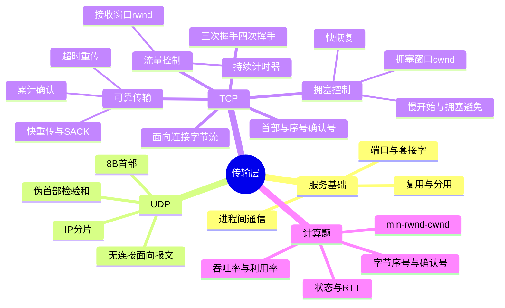

# 计算机网络 第5章 传输层

> 来源：`27王道《计算机网络》高清带书签.pdf`，第5章 传输层，PDF 页码 p236-p278。
> 复核：本章已对教材 p236-p278 和相关基础/强化课件做文字抽取，并直接查看端口号表、UDP 首部与伪首部、TCP 首部与手稿、握手挥手状态图、流量/拥塞控制时间轴、教材习题和强化题原图。

## 本章速览

- 传输层把网络层“主机到主机”的通信提升为“进程到进程”的逻辑通信，核心标识是端口号和套接字。
- UDP 只在 IP 上增加复用/分用和差错检测，首部 8B、面向报文、无连接、无可靠性、无流量控制和拥塞控制。
- TCP 是面向连接的可靠字节流协议，重点掌握首部字段、序号/确认、三次握手、四次挥手、可靠传输、流量控制、拥塞控制。
- TCP 计算题抓四条线：序号按字节编号，确认号表示期望收到的下一个字节，发送窗口上限为 `min(rwnd, cwnd)`，超时和 3 个冗余 ACK 的处理不同。
- 高频易错集中在：SYN/FIN 是否消耗序号、第三次握手是否消耗序号、TIME-WAIT 的 2MSL、UDP 伪首部不传输、MSS 与 MTU 的区别。

## 考纲与复习提示

- 本章覆盖传输层服务、端口与套接字、UDP、TCP 连接管理、可靠传输、流量控制和拥塞控制。
- 复习主线是“网络层只到主机，传输层到进程”：端口完成复用/分用，UDP 保留报文边界但不可靠，TCP 用连接、序号、确认、窗口和计时器保证可靠字节流。
- 计算题集中在 TCP 序号/确认号、握手挥手时间、发送窗口、吞吐率、拥塞窗口变化、UDP/TCP 校验和伪首部。
- 选择题集中在边界判断：端口号本地有效、UDP 伪首部不传输、TCP 首部不含 IP 地址、SYN/FIN 消耗序号、TIME-WAIT 在主动关闭方。
- 做题时先判断协议：UDP 题看 8B 首部/无连接/伪首部；TCP 题看字节编号、累计确认、窗口限制和拥塞事件类型。

## 课件补充来源

- 基础考点讲解：`5.1 传输层提供的服务.pdf`、`5.2.1 UDP数据报.pdf`、`5.2.2 UDP检验.pdf`。
- TCP 报文段：`5.3.1+2 TCP报文段（纯净版无手稿）.pdf`、`5.3.1+2 TCP报文段（有上课手稿）.pdf`。
- 连接管理：`5.3.3 TCP连接管理.pdf`。
- 可靠传输与流量控制：`5.3.4+5 TCP可靠传输、流量控制（纯净版无手稿）.pdf`、`5.3.4+5 TCP可靠传输、流量控制（有上课手稿）.pdf`。
- 快重传与拥塞控制：`5.3.5 （必看）快重传机制的易错点.pdf`、`5.3.6 TCP拥塞控制.pdf`。
- 试卷与强化：`计网期中试卷及答案解析（学员版）.pdf`、`计网期末试卷及答案解析（学员版）.pdf`、`计网P2手稿.pdf`、`计算机网络强化结课考试.pdf`。

## 关联导航

- 向下看封装与差错恢复：[[04-网络层#IP 分片|IP 分片]]、[[04-网络层#NAT|NAT 改写与校验和]]、[[03-数据链路层#3.4 流量控制与可靠传输机制|链路层 ARQ 与流量控制]]。
- 向上看应用如何使用传输服务：[[06-应用层#控制连接与数据连接|FTP 控制/数据连接]]、[[06-应用层#HTTP 操作过程|HTTP 连接与时延]]、[[06-应用层#常见应用层协议速表|常见端口与传输协议]]。

## 知识网络



## 知识点清单

### 5.1 传输层提供的服务

#### 传输层功能

- 层次位置：网络层之上、应用层之下。
- 通信对象：
  - 数据链路层：相邻节点之间。
  - 网络层：主机之间。
  - 传输层：不同主机上的应用进程之间。
- 传输层是面向通信部分的最高层，也是用户功能中的最低层。
- 主要功能：
  - 进程间逻辑通信：真正通信端点是进程，不只是主机。
  - 复用和分用：发送方多个应用进程共用传输层协议；接收方按端口交付给正确进程。
  - 差错检测：对整个传输层报文检查，含首部和数据；IP 只校验首部。
  - 提供两类服务：TCP 面向连接可靠服务，UDP 无连接不可靠服务。

#### 服务访问点与端口

| 层次 | 服务访问点 |
| --- | --- |
| 数据链路层 | 帧的类型字段 |
| 网络层 | IP 首部的协议字段 |
| 传输层 | 端口号字段 |
| 应用层 | 用户界面 |

- 端口号长度：16 bit，可表示 65536 个端口。
- 端口只具有本地意义：不同主机的同一端口号无直接关系；同一主机上 TCP 端口和 UDP 端口相互独立。
- 端口分类：

| 类型 | 范围 | 用途 |
| --- | --- | --- |
| 熟知端口 | 0-1023 | IANA 分配给重要应用 |
| 登记端口 | 1024-49151 | 普通服务器程序登记使用 |
| 短暂端口 | 49152-65535 | 客户端运行时动态分配 |

- 常见熟知端口：FTP 21，TELNET 23，SMTP 25，DNS 53，TFTP 69，HTTP 80，SNMP 161。
- FTP 易错：服务器控制端口是 21；主动模式中服务器数据连接常以 20 为源端口，被动模式的数据端口由协商决定，不能笼统说“FTP 数据端口永远是 20”。详见 [[06-应用层#控制连接与数据连接|FTP 双连接]]。

#### 套接字

- 套接字：`Socket = IP地址:端口号`。
- 套接字唯一标识网络中某台主机上的一个应用进程，是通信端点。
- 一条 TCP 连接由通信双方的两个套接字唯一确定。
- 同一 IP 地址可参与多个 TCP 连接，同一端口号也可出现在多个不同 TCP 连接中。

#### TCP 与 UDP 基本对比

| 对比 | TCP | UDP |
| --- | --- | --- |
| 连接 | 面向连接 | 无连接 |
| 可靠性 | 可靠交付 | 尽最大努力交付 |
| 数据单位 | 字节流 | 报文 |
| 通信方式 | 一对一 | 一对一、一对多、多对多 |
| 首部开销 | 至少 20B | 固定 8B |
| 控制机制 | 确认、重传、流量控制、拥塞控制 | 无确认、无流控、无拥塞控制 |
| 典型应用 | FTP、HTTP、SMTP、TELNET | DNS、TFTP、DHCP、RIP、SNMP、实时多媒体 |

- IP 数据报与 UDP 数据报区别：IP 数据报在网络层经路由器转发；UDP 数据报作为 IP 数据部分，路由器不查看其内部端口等内容。

### 5.2 UDP

#### UDP 特点

- UDP 在 IP 数据报服务上只增加：
  - 多路复用与分用。
  - 数据差错检测。
- UDP 的优点：
  - 无连接，无建立连接时延。
  - 面向报文，保留应用层报文边界，不合并也不拆分应用报文。
  - 首部小，固定 8B。
  - 支持一对多、多对多通信。
  - 无拥塞控制，发送速率不被网络拥塞机制主动降低，适合低时延实时业务。
- 报文大小要求：
  - 太长：到 IP 层可能分片。
  - 太短：IP/UDP 首部开销占比过大。
- UDP 长度字段只有 16 bit，因此 UDP 首部与数据的理论总长为 8-65535B、理论数据上限为 65527B；普通 IPv4 还受 IP 总长度字段和 IP 首部占用限制，跨层题要再扣 IP 首部。
- UDP 自身不负责分片与重组；过大的 UDP 数据报交给 [[04-网络层#IP 分片|IP 层分片]]，任一 IP 分片丢失都会使整个 UDP 数据报无法交付。
- UDP 不可靠不等于应用不能可靠，可靠性可由应用层自行实现。

#### UDP 首部

| 字段 | 长度 | 含义 |
| --- | --- | --- |
| 源端口 | 16 bit | 需要对方回复时使用，不需要可置 0 |
| 目的端口 | 16 bit | 接收进程端口，必须有效 |
| 长度 | 16 bit | UDP 数据报总长度，含首部和数据，最小 8B |
| 检验和 | 16 bit | 检查 UDP 首部和数据，IPv4 可选，IPv6 必须 |

- 若目的端口无对应进程：接收方丢弃该 UDP 数据报，并用 ICMP 返回“端口不可达”。

#### UDP 检验和

- 计算时临时添加 12B 伪首部，伪首部不向下传给网络层，也不向上交给应用层。
- IPv4 下 UDP 伪首部包括：源 IP、目的 IP、全 0 字节、协议号 17、UDP 长度。
- 检验范围：伪首部 + UDP 首部 + UDP 数据。
- 计算规则：
  - 检验和字段先置 0。
  - 按 16 bit 字进行二进制反码求和。
  - 若数据部分为奇数字节，末尾临时补 1 个全 0 字节。
  - 最高位进位要回卷加到最低位。
  - 发送方把求和结果取反后填入检验和字段。
  - 接收方重新求和，若结果为 16 位全 1，则认为无差错，否则丢弃。
- 易考补充：若 UDP 检验和计算结果恰好为 0，字段应填全 1；若字段为 0，表示未使用检验和。
- NAT 场景：若修改了 IP 地址或 UDP 源端口，则 UDP 检验和也要重新计算，因为伪首部包含 IP 地址。

### 5.3 TCP

#### TCP 特点

- TCP 在不可靠 IP 层上实现可靠传输，处理丢失、失序、重复和差错。
- 特点：
  - 面向连接，通信前建立连接，结束后释放连接。
  - 每条连接只有两个端点，只支持一对一，不支持广播和多播。
  - 提供可靠交付：无差错、不丢失、不重复、按序到达。
  - 全双工通信，双方都有发送缓存和接收缓存。
  - 面向字节流，不保留应用层数据块边界。
- TCP 报文段长度由窗口、拥塞程度、MSS 等决定，不由应用层一次交付的块大小直接决定。

#### TCP 首部

- TCP 首部固定部分 20B，选项最多 40B，总长度 20-60B。
- 数据偏移字段占 4 bit，单位为 4B。
  - 最小值 5，表示 20B。
  - 最大值 15，表示 60B。
- 关键字段：

| 字段 | 要点 |
| --- | --- |
| 源端口/目的端口 | 各 2B |
| 序号 seq | 本报文段数据部分第一个字节的序号 |
| 确认号 ack | 期望收到对方下一个数据字节的序号 |
| ACK | ACK=1 时确认号有效；连接建立后所有报文段 ACK 都为 1 |
| SYN | 建立连接请求或接受连接请求 |
| FIN | 释放连接，表示本方无数据再发 |
| RST | 连接严重差错，释放并重建，也可拒绝非法请求 |
| PSH | 尽快交付应用进程 |
| URG | 紧急指针有效，报文段开头存在应优先处理的紧急数据 |
| 窗口 | 本报文发送方作为接收方时还能接收的字节数，即自己的接收窗口 |
| 检验和 | 检查 TCP 首部和数据，计算时也加 12B 伪首部，协议号为 6 |
| 紧急指针 | `URG=1` 时指出紧急数据的范围/末尾，考试通常按“紧急数据字节数”理解 |
| 选项 | MSS、窗口扩大因子、时间戳、SACK 等；MSS 只限制 TCP 数据字段 |

- 序号空间为 32 bit，按 `mod 2^32` 循环。
- 若某段 `seq=301`，数据长度 `100B`，则字节序号为 301-400，下一个数据段从 401 开始。
- 若确认号为 `N`，表示到 `N-1` 为止的所有字节都已按序收到。
- 紧急数据可绕过发送队列优先发送，即使对方通告零窗口也可发送；`URG=0` 时紧急指针无意义。

#### TCP 连接建立：三次握手

| 步骤 | 报文 | 状态变化 | 是否耗序号 |
| --- | --- | --- | --- |
| 1 | 客户发 `SYN=1, seq=x` | CLOSED -> SYN-SENT | SYN 耗 1 |
| 2 | 服务器发 `SYN=1, ACK=1, seq=y, ack=x+1` | LISTEN -> SYN-RCVD | SYN 耗 1 |
| 3 | 客户发 `ACK=1, seq=x+1, ack=y+1` | SYN-SENT -> ESTABLISHED | 不带数据不耗序号 |

- 服务器收到第三次握手后进入 ESTABLISHED。
- 只有前两次握手 `SYN=1`。
- 只有第一次握手 `ACK=0`。
- 第三次握手可以携带数据；若不携带数据，不消耗序号。
- 从客户发出 SYN 起，客户最早 1RTT 后发送数据；服务器最早 1.5RTT 后发送数据。
- 不采用两次握手的原因：防止旧的失效连接请求迟到后让服务器误建立连接并浪费资源。
- 初始序号不能固定：避免旧连接中滞留的报文段落入新连接有效窗口，造成数据混乱。

#### TCP 连接释放：四次挥手

| 步骤 | 报文 | 状态变化 | 要点 |
| --- | --- | --- | --- |
| 1 | 主动方发 `FIN=1, seq=u` | ESTABLISHED -> FIN-WAIT-1 | FIN 即使无数据也耗 1 |
| 2 | 被动方发 `ACK=1, seq=v, ack=u+1` | 主动方 FIN-WAIT-1 -> FIN-WAIT-2；被动方 ESTABLISHED -> CLOSE-WAIT | 进入半关闭 |
| 3 | 被动方发 `FIN=1, ACK=1, seq=w, ack=u+1` | CLOSE-WAIT -> LAST-ACK | `w` 可能大于 `v` |
| 4 | 主动方发 `ACK=1, seq=u+1, ack=w+1` | FIN-WAIT-2 -> TIME-WAIT | 等 2MSL 后 CLOSED |

- 只有第一次和第三次挥手 `FIN=1`。
- 后三次挥手 `ACK=1`。
- 发送 FIN 的一端关闭自己的发送方向，但仍可接收对方数据。
- 第二、三次挥手之间被动方仍可发送剩余数据；第四次挥手由已关闭发送方向的主动方发出，通常是纯 ACK。
- TIME-WAIT 等待 2MSL 的目的：
  - 保证最后一个 ACK 可到达服务器。
  - 让本连接中滞留的旧报文段自然消失，避免影响新连接。
- 若被动方收到 FIN 后已无数据要发，可把第二次 ACK 和第三次 FIN 合并发送。
  - 从主动方发 FIN 起，主动方最短关闭时间：`1RTT + 2MSL`。
  - 被动方最短关闭时间：`1.5RTT`。
- 建连状态链：客户 `CLOSED -> SYN-SENT -> ESTABLISHED`；服务器 `CLOSED -> LISTEN -> SYN-RCVD -> ESTABLISHED`。
- 释放状态链：主动关闭方 `ESTABLISHED -> FIN-WAIT-1 -> FIN-WAIT-2 -> TIME-WAIT -> CLOSED`；被动关闭方 `ESTABLISHED -> CLOSE-WAIT -> LAST-ACK -> CLOSED`。
- 保活计时器：服务器收到客户数据就把保活时间复位为 2h；2h 无数据后发送探测，教材模型为每 75s 探测一次，连续 10 次无响应便关闭连接。它检测的是“长期无通信/对端故障”，不是替代重传计时器。

#### TCP 可靠传输

- 可靠性机制：检验和、序号、确认、重传。
- TCP 按字节编号，不是按报文段编号。
- 默认使用累积确认：
  - 只确认连续按序到达的最后一个字节之后的位置。
  - 若缺少中间段，即使后续段到达，也反复确认缺失段的起始序号。
- 捎带确认：有数据要发时顺便携带确认信息。
- 确认时机：
  - 正常按序数据可延迟确认，以等待捎带，课件按最长约 0.5s 记忆。
  - 收到失序段应立即发送重复 ACK；连续收到两个满 MSS 的按序段也应及时确认。
  - 接收方按序交付应用层，不必等接收缓存完全装满才交付。
- 重传触发：
  - 超时：计时器到期仍未收到确认。
  - 3 个冗余 ACK：快速重传丢失段。
- 冗余 ACK 易错：
  - 对某段的第一次正常确认不叫冗余 ACK。
  - 触发快速重传时，发送方通常共收到 1 个正常 ACK + 3 个冗余 ACK。
- TCP 既不像纯 GBN，也不像纯 SR：
  - 基础行为像 GBN，使用累积确认。
  - 接收方通常缓存失序报文段，并通过冗余 ACK 促使单点重传。
  - 启用 SACK 后更接近 SR。
- 自适应超时：测量报文段往返时间样本，以加权方式更新平均往返时间 `RTTS`，令重传超时 `RTO` 略大于 `RTTS`；RTO 太小会误重传，太大则恢复过慢。
- 某个 ACK 丢失不一定导致重传：若更高的累计确认在 RTO 前到达，发送方已知前面的字节也被收到，无须重传。

#### TCP 流量控制

- 目标：让发送方发送速率不超过接收方处理能力。
- TCP 用滑动窗口实现流量控制。
- 每条 TCP 连接的发送/接收缓存由操作系统维护，大小可动态变化；接收窗口 `rwnd` 就是接收缓存当前空闲量，并写入 TCP 首部窗口字段通知发送方。
- 若确认号为 `ack`，则当前可接收序号区间可写成 `[ack, ack+rwnd-1]`。
- 发送方窗口内包含“已发送未确认”和“允许发送但尚未发送”两部分；仅考虑流量控制时不能超过 `rwnd`，同时考虑拥塞后上限为 `min(rwnd,cwnd)`。
- 可继续发送量：`min(rwnd,cwnd) - 已发送未确认字节数`，结果小于 0 时按 0 处理。
- 零窗口问题：
  - 接收方通告 `rwnd=0` 后，发送方暂停发送新数据。
  - 若非零窗口通知丢失，双方可能死锁。
  - TCP 用持续计时器解决：超时后发送零窗口探测报文，对方在确认中给出当前窗口。
- 传输层流量控制 vs 数据链路层流量控制：
  - 传输层：端到端、进程间，窗口动态变化。
  - 数据链路层：相邻节点之间，窗口常为固定值。

#### TCP 拥塞控制

- 拥塞控制目标：防止过多数据注入网络，使路由器和链路不过载。
- 与流量控制区别：
  - 流量控制看接收方处理能力，是端到端问题。
  - 拥塞控制看网络承载能力，是全局问题。
- 发送窗口上限：

```text
发送窗口 = min(rwnd, cwnd)
```

- `rwnd` 由接收方通告；`cwnd` 由发送方根据网络拥塞状况维护。

#### 慢开始与拥塞避免

- 慢开始：
  - 教材计算模型中初始 `cwnd` 通常为 1MSS；若题目另给初值，严格按题目。
  - 每收到一个对新报文段的确认，`cwnd += 1MSS`。
  - 每经过 1 个 RTT，`cwnd` 近似加倍，呈指数增长。
  - “慢”指从小窗口开始，不是增长速度慢。
- 慢开始门限 `ssthresh`：
  - `cwnd < ssthresh`：慢开始。
  - `cwnd > ssthresh`：拥塞避免。
  - `cwnd = ssthresh`：两者均可，通常转拥塞避免。
- 拥塞避免：
  - 每经过 1 个 RTT，`cwnd += 1MSS`。
  - 线性增长，又称加法增大。
- 超时处理：
  - `ssthresh = max(cwnd / 2, 2MSS)`。
  - `cwnd = 1MSS`。
  - 重新慢开始。
- 慢开始边界易错：若下一轮 `2*cwnd > ssthresh`，则下一轮后的 `cwnd` 到 `ssthresh` 为止，不越过门限。
- 时间轴易错：某轮开头的 `cwnd` 决定该轮最多发送多少 MSS；本轮 ACK 到达后才更新下一轮 `cwnd`。接收窗口更小时，一轮实际发送量还要受 `rwnd` 限制。

#### 快重传与快恢复

- 快重传：
  - 接收方收到失序段后立即发送冗余 ACK。
  - 发送方连续收到 3 个相同冗余 ACK，立即重传丢失段，不等超时。
  - 图中看到 4 个相同确认号时，通常是“1 个首次正常 ACK + 3 个冗余 ACK”，在第 4 个同号 ACK 到达时触发快重传。
- 快恢复：
  - 3 个冗余 ACK 说明后续段能到达，网络未必严重拥塞。
  - 执行乘法减小：`ssthresh = cwnd / 2`。
  - 不把 `cwnd` 置 1，而是令 `cwnd = ssthresh`。
  - 直接进入拥塞避免。
- 总结：
  - 超时：`ssthresh=cwnd/2, cwnd=1`，慢开始。
  - 3 个冗余 ACK：`ssthresh=cwnd/2, cwnd=ssthresh`，快恢复后拥塞避免。
  - 以上按本教材计算模型；若题目明确指定其他 TCP 版本或规则，按题设更新。

#### TCP 窗口、吞吐率与序号回绕

- 稳态且链路带宽不构成瓶颈时，最大平均有效数据率近似为 `有效窗口/RTT`，其中有效窗口取 `min(rwnd,cwnd)`；若题目计入一批数据的发送时延，则分母还要按题意加入相应发送时间。
- 链路利用率：`U = 实际吞吐率 / 链路带宽`。文件大小用 `B`，链路速率常用 `bit/s`，计算前先统一单位。
- 32 bit 序号循环使用：以字节速率 `R` 发送时，序号绕回时间为 `2^32/R`；应保证旧报文仍可能存在期间不会让同一序号再次落入有效窗口。
- 大文件时间题按“建连 -> 每轮可发数据 -> 丢包/重传 -> 最后数据确认 -> 释放”画时间轴；只问服务器收到全部数据时，不要自动再加四次挥手。
- 一次短请求/响应若从零开始：UDP 无须建连，最少约 `1RTT`；TCP 可在第三次握手捎带请求，收到响应最少约 `2RTT`。

### 5.4 本章小结及疑难点

#### MSS 与 MTU

- MTU：链路层帧中数据部分最大长度。
- MSS：TCP 报文段中数据字段最大长度，不含 TCP 首部。
- MSS 主要目的：尽量避免 IP 分片，与接收缓存或接收窗口无直接关系。
- MSS 过小：首部占比大，网络利用率低。
- MSS 过大：可能超过路径 MTU 产生 IP 分片；任一分片丢失会导致整个 TCP 报文段重传。
- TCP 默认 MSS 可按 536B 数据理解，即 TCP 报文段总长度约为 556B。

#### TCP 使用 GBN 还是 SR

- TCP 基础确认机制是累积确认，表面上接近 GBN。
- 但 TCP 接收方通常不会丢弃正确到达的失序报文段，而是缓存并反复发送冗余 ACK。
- 发送方一般只重传被判断为丢失的报文段，而不是把后续所有已发送段都重传。
- 启用 SACK 后，接收方可明确告知哪些非连续数据块已收到，行为更接近 SR。
- 结论：TCP 重传机制可看作 GBN 与 SR 的混合，基础是累积确认和冗余 ACK，现代实现更偏选择性重传。

#### 超时与 3 个冗余 ACK 的处理差异

- 超时：说明 ACK 长时间未返回，可能是网络严重拥塞，处理更保守：
  - `ssthresh = cwnd / 2`
  - `cwnd = 1MSS`
  - 重新慢开始。
- 3 个冗余 ACK：说明后续报文段仍能到达接收方，网络仍有传输能力，只是某段可能丢失：
  - `ssthresh = cwnd / 2`
  - `cwnd = ssthresh`
  - 快速重传后进入快恢复/拥塞避免。

#### 为什么不能两次握手

- 两次握手无法确认客户端是否收到服务器的确认。
- 若旧的 SYN 连接请求在网络中滞留，服务器可能收到后直接建立连接并等待数据。
- 客户端发现不是当前连接请求，不会发送数据，服务器资源被白白占用。
- 三次握手通过最后一次 ACK 证明客户端确实收到服务器确认，避免旧请求导致误连接。

#### 为什么初始序号不能固定

- TCP 连接可能频繁建立和释放，网络中可能仍滞留旧连接的报文段。
- 若新连接继续使用相同初始序号，旧报文段可能落入新连接的有效窗口。
- 接收方可能把旧数据误认为新数据，造成数据混乱或协议错误。
- 因此 TCP 初始序号应随时间变化并尽量随机化。

#### TCP 可靠交付是否多余

- 即使链路不出错、节点不故障，TCP 可靠交付也不是多余。
- 原因：IP 层无连接且不可靠，仍可能出现：
  - 独立选路导致失序。
  - 路由循环导致 TTL 为 0 后丢弃。
  - 路由器突发拥塞导致丢弃。

## 课件补充/强化题规则

1. **先画双端时间轴**：每个报文标出 `SYN/FIN/ACK、seq、ack、数据长度、rwnd`；序号只增加“数据字节数 + SYN/FIN 各 1”，纯 ACK 不耗序号。
2. **确认号只追连续前缀**：收到失序段仍确认缺口起点；同号 ACK 第一次是正常确认，后续三个才是冗余 ACK，不能把“四个相同 ACK”说成四个冗余 ACK；低确认丢失但更高累计确认及时到达时，无须重传。
3. **窗口题分三步**：先求接收缓存空闲量 `rwnd`，再求拥塞窗口 `cwnd`，最后扣除已发未确认数据；答案是 `max(0, min(rwnd,cwnd)-未确认量)`。
4. **拥塞题逐轮写表**：列“轮次、轮初 cwnd、该轮发送量、事件、轮末 cwnd/ssthresh”；超时回 1，三冗余 ACK 减半，窗口更新发生在 ACK 到达后。
5. **吞吐题先确认计时区间**：只算数据阶段可用 `数据量/总耗时`；若从请求建连接开始，则加入握手；若截至服务器收齐数据，一般不加入释放连接。
6. **UDP 检验和题**：拼接伪首部、UDP 首部、数据，奇数字节补 0，16 bit 反码加法回卷，最后取反；临时补位和伪首部都不发送。
7. **跨层长度题**：`应用数据 -> TCP/UDP 首部 -> IP 首部/分片 -> 帧首尾` 逐层加减；MSS 不是 MTU，UDP 长度也不含 IP 首部。
8. **综合传输题**：FTP/HTTP 可能先建立应用所需的 TCP 连接，再经历慢开始、丢包恢复和最终确认；连接类型与端口先回到 [[06-应用层#控制连接与数据连接|FTP]] 或 [[06-应用层#HTTP 操作过程|HTTP]] 判断。

## 易错点/易混点

- 传输层提供的是进程到进程通信，不是主机到主机通信。
- 端口号只有本地意义；TCP 和 UDP 可在同一主机使用相同端口号，互不冲突。
- FTP 的 21 是控制连接服务器端口；20 只对应主动模式服务器数据连接的常见源端口，不能套到被动模式。
- 唯一标识进程靠 `IP地址 + 端口号`，不是 MAC 地址。
- UDP 长度字段包括 UDP 首部和数据，不包括伪首部。
- UDP 长度字段理论上限与普通 IPv4 可承载上限不是一回事；跨层题还要给 IP 首部留空间。
- UDP 首部没有“首部长度”字段，因为固定 8B。
- UDP 伪首部只用于检验和计算，不实际传输。
- UDP 检验和能间接发现源/目的 IP 地址出错，因为伪首部包含 IP 地址。
- IPv4 中 UDP 检验和可不用，IPv6 中必须用。
- UDP 目的端口不存在时，通常丢弃并返回 ICMP 端口不可达。
- NAT 转发 UDP 时若改源 IP 或源端口，必须重算 UDP 检验和。
- TCP 首部不含源/目的 IP 地址，IP 地址在 IP 首部。
- TCP 窗口字段表示“自己还能接收多少字节”，不是自己的拥塞窗口。
- `rwnd` 是接收缓存空闲量，不是缓存总容量；应用进程读走数据后，`rwnd` 可以增大。
- `URG=1` 时紧急指针才有效；紧急数据在数据部分前端，零窗口也不能简单断言“任何数据都绝对不能发”。
- TCP 确认号 `N` 表示期待收到 `N`，即 `N-1` 及以前已收到。
- TCP 序号按字节编号，不按报文段编号。
- SYN 和 FIN 即使不携带数据，也各消耗 1 个序号。
- 第三次握手可以带数据；不带数据时不消耗序号。
- 第一次握手 ACK=0；建立连接后所有 TCP 报文段 ACK=1。
- 正常 ACK 可延迟或捎带，失序段的重复 ACK 应立即发送；不要把“延迟确认”理解为所有 ACK 都固定等 0.5s。
- FIN 只表示本方没有数据再发，不表示双方连接立刻完全断开。
- TIME-WAIT 在主动关闭方，等待 2MSL 后才 CLOSED。
- 被动关闭方若无数据待发，可把 ACK 和 FIN 合并，最短 1.5RTT 关闭。
- 超时时新门限是“当前 cwnd 的一半”，不是旧门限的一半。
- 3 个冗余 ACK 触发快重传/快恢复，`cwnd` 减半；超时才把 `cwnd` 置 1。
- 四个相同确认号通常包含第一个正常 ACK，真正的冗余 ACK 只有后三个。
- 同时给出 `rwnd` 和 `cwnd` 时，实际发送窗口取较小值，还要扣除已发送未确认的数据。
- K 和 k 要分清：文件/存储常用 `K=1024`，通信速率常用 `k=1000`。

## 注解

- 记端口：服务器端口通常固定，客户端端口通常临时；服务器回包的目的端口就是客户原报文的源端口。
- 记 UDP：一眼看三点，8B 首部、报文边界、无连接不可靠；可靠性要么不要，要么应用层自己做。
- 记 TCP 序号：`seq` 看“我这段第一个字节”，`ack` 看“我下次想要你的哪个字节”。
- 记窗口：首部里的窗口是“我还能收多少”，发送方真正还能新发多少是 `min(rwnd,cwnd)-未确认量`。
- 连接建立口诀：`SYN x`，`SYN+ACK y/x+1`，`ACK x+1/y+1`。
- 连接释放口诀：主动方 `FIN` 后停发但仍可接收；被动方 `ACK` 后可继续发，最后也要 `FIN`。
- 拥塞控制口诀：慢开始指数试探，拥塞避免线性前进；超时回到 1，三重 ACK 只减半。
- 做窗口题先列三列：接收窗口、拥塞窗口、已发送未确认数据；可继续发送量 = `min(rwnd,cwnd) - 已发送未确认量`。
- 做时间题先画报文：建连通常前两次握手 1RTT，第三次握手可带数据；释放主动方通常还要加 2MSL。
- 做强化大题不要只数 RTT：先明确起止事件，再把握手、每轮发送、ACK 返回、重传和是否释放逐段计时。

## 速背检查

1. 传输层为谁提供逻辑通信？进程到进程。
2. 套接字由什么组成？IP 地址和端口号。
3. 熟知端口范围是多少？0-1023。
4. 客户端短暂端口范围是多少？49152-65535。
5. HTTP、DNS、TFTP 常见端口分别是多少？80、53、69。
6. UDP 首部长度是多少？固定 8B。
7. UDP 长度字段包括伪首部吗？不包括，只包括 UDP 首部和数据。
8. UDP 伪首部会被发送吗？不会，只用于计算检验和。
9. UDP 伪首部中的协议号是多少？17。
10. TCP 伪首部中的协议号是多少？6。
11. TCP 首部最小和最大长度是多少？20B 和 60B。
12. TCP 数据偏移字段单位是什么？4B。
13. TCP 确认号 N 表示什么？期望收到 N，N-1 及以前已收到。
14. SYN 是否消耗序号？消耗 1 个序号。
15. FIN 是否消耗序号？消耗 1 个序号。
16. 第三次握手不携带数据是否消耗序号？不消耗。
17. 主动关闭方收到对方 FIN 后进入什么状态？TIME-WAIT。
18. TIME-WAIT 等多久？2MSL。
19. 发送窗口上限公式是什么？`min(rwnd, cwnd)`。
20. 零窗口死锁靠什么解决？持续计时器和零窗口探测报文。
21. 慢开始阶段 cwnd 如何增长？每 RTT 近似翻倍。
22. 拥塞避免阶段 cwnd 如何增长？每 RTT 线性加 1MSS。
23. 超时后 cwnd 如何变化？`ssthresh=cwnd/2`，`cwnd=1MSS`。
24. 3 个冗余 ACK 后 cwnd 如何变化？`ssthresh=cwnd/2`，`cwnd=ssthresh`。
25. MSS 的主要目的是什么？尽量避免 IP 分片。
26. 四个相同确认号等于四个冗余 ACK 吗？不是，通常是 1 个正常 ACK 加 3 个冗余 ACK。
27. `rwnd` 表示什么？接收缓存当前空闲量。
28. 可继续发送量怎么算？`max(0, min(rwnd,cwnd)-已发送未确认量)`。
29. 普通按序 ACK 和失序重复 ACK 都能任意延迟吗？不能，失序段应立即回重复 ACK。
30. 平均有效数据率的窗口近似式是什么？`min(rwnd,cwnd)/RTT`，再受链路带宽和题设发送时延限制。
