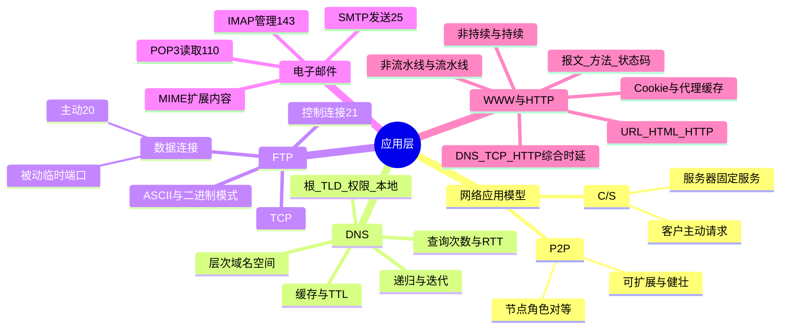

# 计算机网络 第6章 应用层

> 来源：`27王道《计算机网络》高清带书签.pdf`，第6章 应用层，PDF 页码 p279-p315。
> 复核：教材 p279-p315、8 个基础课件、网站根目录示例、阶段试卷及强化资料均已提取文字，并直接查看 C/S/P2P、DNS 查询、FTP 双连接、邮件流程、HTTP 连接/报文/综合题解析等关键页图片。

## 本章速览

- 应用层重点是“协议用途 + 端口 + 传输层协议 + 交互流程”，选择题和综合题都爱把多个协议串起来考。
- DNS 是 UDP/53、C/S 分布式命名系统，核心考递归/迭代查询、缓存 TTL、域名与 IP 不一一对应。
- FTP 是 TCP 协议，控制连接 21 号端口持久保持，数据连接按传输临时建立；主动模式服务器用 20 号端口连客户端。
- 电子邮件三件套：SMTP 发送和服务器间传送邮件，POP3/IMAP 读取邮件，Web 邮箱浏览器交互常用 HTTP。
- WWW 核心标准是 URL、HTTP、HTML；HTTP 基于 TCP，协议本身无状态，HTTP/1.1 默认持续连接。
- 访问网页综合题常按顺序串：DHCP 获取配置、DNS 解析、ARP 找下一跳 MAC、TCP 建连、HTTP 请求、TCP 释放。

## 考纲与复习提示

- 考纲点：网络应用模型，DNS，FTP，电子邮件，WWW/HTTP。
- 复习主线：先记“协议解决什么问题”，再记传输层协议、端口、连接建立方向和典型流程。
- 选择题高频：C/S 与 P2P、DNS 递归/迭代与缓存、FTP 双连接、SMTP/POP3/IMAP 分工、HTTP 无状态和持续连接。
- 综合题高频：DNS 查询次数与 RTT、网页访问全过程、HTTP 非持续/持续连接时延、FTP 控制/数据连接与 TCP 序号。
- 端口题默认问服务器熟知端口；客户进程通常使用临时端口，不能把服务器 20/21/80/110 号端口套到客户端。

## 课件补充来源

- 基础课件：`第六章 应用层/6.0 应用层Intro.pdf`、`6.1 补充(咸鱼).pdf`、`6.1 网络应用模型(楼楼老师).pdf`、`6.2 补充(咸鱼).pdf`、`6.2 域名系统DNS(楼楼老师).pdf`、`6.3 文件传输协议FTP（楼楼老师）.pdf`、`6.4 电子邮件(楼楼老师).pdf`、`6.5 WWW和HTTP.pdf`。
- 网站示例：`第六章 应用层/网站根目录.zip`，已核对 HTML、根目录资源和子目录资源的相对路径关系。
- 阶段试卷：`计网期中试卷及答案解析（学员版）.pdf`、`计网期末试卷及答案解析（学员版）.pdf`。
- 强化资料：`计算机网络强化/计网P2手稿.pdf`、`计算机网络强化/计算机网络强化结课考试.pdf`。
- 复核方式：上述课件、试卷及教材 p279-p315 均已提取文字，并直接查看 DNS、邮件、HTTP 过程图及真题解析页；下文只保留可复习、可判题的结论。

## 关联导航

- 前置基础：[[05-传输层#TCP 连接建立：三次握手|TCP 建连]]、[[05-传输层#TCP 连接释放：四次挥手|TCP 释放]]、[[05-传输层#TCP 窗口、吞吐率与序号回绕|TCP 窗口与吞吐]]。
- 网页访问链路：[[04-网络层#DHCP|DHCP]] -> [[06-应用层#6.2 域名系统 DNS|DNS]] -> [[04-网络层#ARP|ARP]] -> TCP -> [[06-应用层#6.5 万维网 WWW 与 HTTP|HTTP]]。
- 计算题联动：DNS/HTTP 的 RTT 题常与 [[05-传输层#TCP 拥塞控制|TCP 拥塞控制]]、对象传输时间和并行连接合并考查。
- 本章内部：[[06-应用层#域名解析过程|域名解析]]、[[06-应用层#控制连接与数据连接|FTP 双连接]]、[[06-应用层#SMTP、POP3、IMAP|邮件协议]]、[[06-应用层#非持续连接与持续连接|HTTP 连接方式]]。

## 知识网络



## 知识点清单

### 6.1 网络应用模型

#### 应用层协议定义

- 应用层协议规定应用进程交换报文的规则，至少包括：
  - **报文类型**：请求、响应等。
  - **语法**：报文字段及其书写格式。
  - **语义**：各字段代表的含义。
  - **时序**：何时发送、如何响应以及异常时如何处理。
- 应用层直接为用户进程提供服务，但报文仍依靠下层协议完成端到端传送。

#### C/S 模型

- 服务器：长期运行、被动等待、提供服务，通常使用固定地址和熟知端口。
- 客户：主动发起请求，等待服务器响应，必须事先知道服务器地址。
- 特点：
  - 地位不平等，管理集中。
  - 客户之间通常不直接通信。
  - 受服务器性能和带宽限制，可扩展性较差。
- 典型应用：Web、FTP、DNS、电子邮件等。
- 易错：连接建立后，服务器可以主动向客户发送数据；“客户只能请求、服务器只能响应”说得过死。

#### P2P 模型

- 节点没有固定客户/服务器角色，每个节点既可请求资源，也可提供资源。
- 本质上仍可看成 C/S 行为的组合：访问别人资源时是客户，给别人资源时是服务器。
- 优点：
  - 减轻中心服务器压力。
  - 节点可直接通信。
  - 可扩展性好，系统容量随节点增多而提高。
  - 健壮性强，单点失效影响较小。
- 缺点：占用节点 CPU、内存、磁盘 I/O 和网络带宽，可能造成拥塞。
- P2P 是构建在 IP 网络上的覆盖/逻辑网络，不是与互联网并列的新物理网络。

### 6.2 域名系统 DNS

#### DNS 基本概念

- 作用：把便于记忆的域名转换为 IP 地址，也支持反向解析。
- 模型：C/S 模型、分布式数据库系统。
- 传输层：通常使用 UDP，端口 53。
- DNS 三部分：层次域名空间、域名服务器、解析器。
- 域名与 IP/主机/MAC 都不一定一一对应：
  - 一个域名可对应多个 IP，用于负载均衡。
  - 多个域名可对应同一 IP，用于虚拟主机。
  - 一台主机可有多个网卡和多个 IP。

#### 层次域名空间

- 域名由多个标号组成，用点分隔；最低级写最左，最高级顶级域写最右。
- 标号规则：
  - 英文字母不区分大小写。
  - 除连字符 `-` 外，不得使用其他标点。
  - 每个标号最长 63 个字符。
  - 整个域名总长度不超过 255 个字符。
- 顶级域名：
  - 国家顶级域名，如 `.cn`、`.us`。
  - 通用顶级域名，如 `.com`、`.org`、`.net`、`.edu`、`.gov`。
  - 基础结构域名 `.arpa`，用于反向域名解析。

#### 域名服务器

| 类型 | 作用 |
| --- | --- |
| 根域名服务器 | 知道所有顶级域名服务器的域名和 IP，通常返回下一步查询的 TLD 服务器 |
| 顶级域名服务器 | 管理对应顶级域下的二级域名 |
| 权限域名服务器 | 管理某个区，能给出其管辖主机的域名到 IP 映射 |
| 本地域名服务器 | 主机 DNS 查询的第一站，通常由 ISP、学校或单位部署 |

- 区是服务器负责管辖的范围，范围小于或等于域；一个区内节点必须连通。
- 根服务器名称体系有 13 个逻辑标识，实际由分布在全球的多个服务器实例提供服务。
- 根域名服务器通常不直接给最终 IP，而是给下一步应查询的服务器地址。
- 每台主机必须在所属区的权限域名服务器处登记。

#### 域名解析过程

- 主机向本地域名服务器：通常采用递归查询，即本地服务器必须继续查到结果或明确失败后再答复主机。
- 本地域名服务器向其他域名服务器：可递归，也可迭代；实际通常采用迭代查询。
- 判别关键：递归是“被询问者继续往下问”，结果沿原路返回；迭代是“被询问者告诉查询者下一站”，查询者自己继续问。
- 典型迭代流程：
  - 主机向本地域名服务器查询。
  - 本地无缓存时，向根域名服务器查询。
  - 根服务器返回顶级域名服务器地址。
  - 本地域名服务器向顶级域名服务器查询。
  - 顶级域名服务器返回权限域名服务器地址。
  - 本地域名服务器向权限域名服务器查询。
  - 权限域名服务器返回目标 IP。
  - 本地域名服务器缓存结果并返回主机。
- 标准的本地、根、顶级、权限四段流程共有 4 个查询和 4 个回答；若权限域还分父区、子区，应按实际经过的服务器继续增加，不能机械认定最多只查 3 个外部服务器。
- 查询次数题先看缓存：本地命中时外部 DNS 查询可为 0；无缓存时逐个数根、TLD、各级权限服务器。
- RTT 题把每次 DNS 查询往返计作相应的 DNS RTT，再加 Web 访问 RTT。例如无缓存且依次查根、TLD、权限服务器时，DNS 先用 3RTT；若之后非持续 HTTP 获取一个对象再用 2RTT，共 5RTT。
- DNS 缓存/高速缓存：
  - 缓存近期域名/IP 映射，减少查询流量。
  - 记录有 TTL，到期失效。
  - 主机端和域名服务器端都可缓存。
- DNS 用 UDP 丢包怎么办：由应用层设置定时器，超时后重新查询；重复查询通常无害。
- 常规域名查询用 UDP/53；区域传送等需要可靠传输的特殊过程可用 TCP/53。

### 6.3 文件传输协议 FTP

#### FTP 基本工作

- 作用：在异构主机间可靠传输文件，支持交互式访问、文件类型/格式指定、权限控制和匿名 FTP。
- 匿名 FTP 常用用户名 `anonymous`，具体口令由服务器策略决定。
- 模型：C/S。
- 传输层：TCP。
- FTP 是有状态协议，服务器要维护用户账户、当前目录等会话状态。
- 服务器进程：
  - 主进程：监听连接请求。
  - 从属进程：处理单个客户请求。

#### 控制连接与数据连接

| 连接 | 服务器端口 | 生命周期 | 作用 |
| --- | --- | --- | --- |
| 控制连接 | 21 | 整个会话期间保持 | 登录、目录、传输命令、中断等控制信息 |
| 数据连接 | 主动模式用 20 | 每次数据传输临时建立，传完关闭 | 实际传输文件内容或目录列表 |

- FTP 控制信息属于带外传送：控制命令和文件数据走不同 TCP 连接。
- 控制连接先建立，后释放；数据连接后建立，先释放。
- `LIST` 获取目录列表也走数据连接。
- 传输模式：普通文本可用 ASCII 模式，图像、音视频、程序等应使用二进制模式；选错模式可能破坏文件内容。
- 客户端端口通常由系统临时分配，不是固定 20 或 21。
- 登录 FTP 服务器时建立的是控制连接；真正下载/上传文件时才另建数据连接。

#### 主动模式与被动模式

- 主动模式 PORT：
  - 客户先连接服务器 21 端口。
  - 客户随机开一个本地端口，并通过 PORT 命令告知服务器。
  - 服务器用 20 号端口主动连接客户指定端口。
- 被动模式 PASV：
  - 客户发送 PASV 命令。
  - 服务器随机开放一个端口并告知客户。
  - 客户主动连接该端口传输数据。
- 主动/被动的差别：数据连接由服务器主动连客户，还是服务器被动等客户连接；模式由客户端决定。
- 无特别说明时，常按主动模式理解；PASV 下服务器数据端口不是固定 20。
- FTP 综合题提示：若题目把 FTP 与 TCP 序号、慢启动混合考，数据连接建立还要先花 TCP 建连时间；发送文件和释放连接的 FIN 都会消耗序号。

#### FTP 与 NFS

- FTP 修改远程文件：通常先下载到本地，修改后再上传，可能需要两次完整传输。
- NFS 允许直接打开远程文件并读写指定位置，适合共享式远程文件访问。

### 6.4 电子邮件

#### 电子邮件系统组成

- 三部分：
  - 用户代理 UA：用户撰写、显示、处理邮件的客户端。
  - 邮件服务器：24 h 工作，发送、接收、暂存邮件，并反馈投递状态。
  - 邮件协议：SMTP、POP3、IMAP 等。
- 邮件服务器有双重角色：
  - 发送邮件时可作为 SMTP 客户。
  - 接收邮件时可作为 SMTP 服务器。

#### 发送与读取过程

- 发送邮件：
  - 用户代理用 SMTP 把邮件交给发送端邮件服务器。
  - 发送端邮件服务器先把邮件放入缓存队列，等待发送。
  - 发送端邮件服务器用 SMTP 把邮件推送到接收端邮件服务器。
  - 接收端邮件服务器把邮件放入收件人邮箱。
- 读取邮件：
  - 收件人用户代理用 POP3 或 IMAP 从接收端邮件服务器读取。
- SMTP 是 Push；POP3 是 Pull。
- SMTP 不使用中间邮件服务器逐跳转发，而是在发送端和接收端邮件服务器之间直接建立 TCP 连接；对方暂不可达时，发送端服务器等待后重试。
- Web 邮箱：浏览器与邮件服务器之间发送/读取通常用 HTTP；不同邮件服务器之间仍用 SMTP。

#### 邮件格式与 MIME

- 邮件由信封和内容组成；内容分为首部和主体。
- 常见首部：
  - `To`：必填，收件人地址。
  - `From`：必填，通常由系统自动填。
  - `Subject`：可选，邮件主题。
- 邮件地址格式：`用户名@邮箱所在主机的域名`。
- SMTP 原本只支持 7 位 ASCII 文本。
- SMTP 不能直接传送二进制对象，邮件服务器还可拒绝超过其长度限制的邮件。
- MIME：
  - 不替代 SMTP，只扩展 SMTP。
  - 发送端把非 ASCII 内容编码为 ASCII 后交给 SMTP。
  - 接收端用 MIME 解码还原。
  - 支持文字、图像、音频、视频、二进制附件等内容。
  - 主要补充 5 类首部字段：MIME 版本、内容描述、内容标识、传送编码、内容类型。

#### SMTP、POP3、IMAP

| 协议 | 作用 | 传输层 | 端口 | 特点 |
| --- | --- | --- | --- | --- |
| SMTP | 发送邮件、邮件服务器之间传送邮件 | TCP | 25 | Push，只直接传 7 位 ASCII |
| POP3 | 用户代理从服务器读取邮件 | TCP | 110 | Pull，简单，支持下载保留/下载删除 |
| IMAP | 在线管理远程邮箱 | TCP | 常用 143 | 支持服务器端文件夹、搜索、选择性下载 |

- SMTP 阶段：
  - **连接建立**：建立 TCP 连接，服务器返回 `220`，客户发送 `HELO`。
  - **邮件传送**：`MAIL FROM` 指定发件人；一个或多个 `RCPT TO` 预先验证收件人；`DATA` 得到 `354` 后发送内容，以 `<CRLF>.<CRLF>` 结束。
  - **连接释放**：客户发送 `QUIT`，服务器返回 `221` 后释放连接。
- 常见 SMTP 应答：`250` 表示请求成功，`550` 常表示用户不存在；命令与应答都采用可读 ASCII 文本。
- SMTP 不用于用户从服务器读取邮件。
- POP3 可在一条 TCP 连接中读取多封邮件，支持“下载并保留”和“下载并删除”两种工作方式。
- IMAP 在服务器端保存邮件状态，可建立文件夹、搜索、只下载邮件的一部分，适合多设备在线管理。

### 6.5 万维网 WWW 与 HTTP

#### WWW 基本组成

- WWW 是构建在互联网之上的分布式、联机式信息空间。
- 资源由 URL 唯一标识，通过 HTTP 传给用户，由浏览器展示。
- 三个核心标准：
  - URL：统一资源定位符。
  - HTTP：超文本传输协议。
  - HTML：超文本标记语言。
- URL 一般形式：

```text
<协议>://<主机>:<端口>/<路径>
```

- HTTP 默认端口为 80，路径可默认为根目录。
- 一个网页通常由 1 个基本 HTML 文件和若干独立引用对象组成；浏览器先取得并解析 HTML，才知道还需请求哪些图片、音视频或脚本。
- HTML 中 `./资源` 表示网站当前目录下的文件，`./子目录/资源` 表示当前目录的下级路径；课件网站根目录示例中的 HTML、图片、视频仍是分别请求的对象。
- 互联网是底层网络互联系统；万维网是运行在互联网之上的一种应用层生态。

#### HTTP 操作过程

- 浏览器访问网页的简化流程：
  - 输入 URL。
  - DNS 解析域名得到服务器 IP。
  - 浏览器与服务器 80 端口建立 TCP 连接。
  - 浏览器发送 HTTP 请求，如 `GET /index.htm`。
  - 服务器返回 HTTP 响应。
  - 连接释放或保持。
  - 浏览器解析 HTML 并显示网页。
- 可能涉及的协议：DHCP、DNS、HTTP、UDP、TCP、IP、ARP、以太网/PPP 等。

#### HTTP 特点

- HTTP 使用 TCP，保证数据可靠传输。
- HTTP 本身无连接：交换 HTTP 报文前不建立专门的 HTTP 连接。
- HTTP 无状态：服务器默认不记录之前和客户的交互历史。
- Cookie 解决状态跟踪：
  - 服务器产生 Cookie 识别码，并通过 `Set-cookie` 响应首部发给浏览器。
  - 浏览器保存 Cookie。
  - 后续请求携带 `Cookie` 首部。
  - 服务器据此在后端数据库中查用户活动记录。
- Cookie 存在用户主机上，不是只存在服务器端；可能带来隐私问题。

#### 非持续连接与持续连接

- HTTP/1.0：非持续连接。
  - 每个对象单独建立 TCP 连接。
  - 请求 1 个对象约需 `2RTT + 对象传输时间`。
  - 页面含 1 个 HTML + 3 张图片，则需 4 次 TCP 连接。
  - 若不并行，基本 HTML 加 N 个引用对象通常约需 `(N+1) * 2RTT + 各对象传输时间`。
  - 若浏览器支持并行 TCP 连接，引用对象可并行获取，总时延要按题目给的并行条件重算。
- HTTP/1.1：默认持续连接。
  - 同一 TCP 连接可传多个请求/响应。
  - 非流水线：必须等前一个响应到达后，再发下一个请求，每个引用对象仍常多 1RTT。
  - 流水线：可连续发送多个请求，服务器连续响应，理想情况下所有引用对象只多 1RTT。
- 注意：实际时延还受 TCP 发送窗口、拥塞控制和对象大小影响；不能只按应用层交互次数估算。
- 忽略传输时间、从第一次 TCP 建连开始的常用 RTT 模型：

| 获取方式（基本 HTML + N 个引用对象） | 理想时延骨架 |
| --- | --- |
| 非持续、串行 | `2(N+1)RTT + 各对象传输时间之和` |
| 非持续、引用对象并行 | 基本 HTML `2RTT`，随后对象组再约 `2RTT`，传输时间取并行中的瓶颈 |
| 持续、非流水线 | `1RTT 建连 + 1RTT 基本 HTML + N RTT + 传输时间` |
| 持续、流水线 | `1RTT 建连 + 1RTT 基本 HTML + 1RTT 引用对象组 + 传输时间` |

- 若题目从“发送 HTTP 请求”开始计时，说明 TCP 已建立，应去掉建连的 1RTT；若明确允许多个并行连接，才能按并行模型计算。
- 单个对象的纯发送时间为 `对象长度(bit) / 瓶颈链路速率(bit/s)`；若给出 MSS、接收窗口或 cwnd，还要按 [[05-传输层#TCP 窗口、吞吐率与序号回绕|TCP 窗口约束]] 增加等待轮次。

#### HTTP 报文

- HTTP 是面向文本的，字段为 ASCII 字符串。
- 请求报文和响应报文均由三部分组成：
  - 开始行。
  - 首部行。
  - 实体主体。
- 请求报文开始行叫请求行：方法、URL、版本。
- 响应报文开始行叫状态行：版本、状态码、短语。
- 首部行后必须有一个空行 `CRLF` 分隔实体主体。
- 典型请求可写为 `GET /path HTTP/1.1`，常见首部有 `Host`、`Connection: close/keep-alive`、`Cookie`。

| 方法 | 含义 |
| --- | --- |
| GET | 请求读取 URL 标识的信息 |
| HEAD | 只请求首部，不返回对象主体 |
| POST | 向服务器添加信息 |
| PUT | 在指定 URL 存储文档 |
| DELETE | 删除 URL 标识的资源 |
| CONNECT | 用于代理服务器 |

- 状态码首位表示类别：`1xx` 信息、`2xx` 成功、`3xx` 重定向、`4xx` 客户端错误、`5xx` 服务器错误。
- 常见状态行：
  - `202 Accepted`：接受请求。
  - `400 Bad Request`：错误请求。
  - `404 Not Found`：找不到页面。
- 代理服务器/Web 缓存：缓存近期请求与响应，命中时直接返回，减轻外部链路负载并降低时延。
- 代理缓存命中：客户从代理取响应，不再访问原始服务器；未命中：代理代表客户去原始服务器取回，并可缓存副本。
- 代理可部署在客户端、服务器端或网络中间节点，题目常用来考“访问外网链路负载是否降低”。

#### 常见应用层协议速表

| 应用/协议 | 传输层 | 熟知端口 |
| --- | --- | --- |
| FTP 数据连接 | TCP | 20（主动模式服务器端） |
| FTP 控制连接 | TCP | 21 |
| TELNET | TCP | 23 |
| SMTP | TCP | 25 |
| DNS | UDP | 53 |
| TFTP | UDP | 69 |
| HTTP | TCP | 80 |
| POP3 | TCP | 110 |
| IMAP | TCP | 143 |
| SNMP | UDP | 161 |

### 6.6 本章小结及疑难点

#### 客户端口与服务器端口

- 服务器进程使用固定、公开的熟知端口，便于客户找到服务。
- 客户进程使用临时端口，由操作系统自动分配，仅本次通信有效。
- 一条端到端连接由服务器熟知端口和客户临时端口共同区分。

#### 互联网与万维网

- 互联网是采用 TCP/IP 协议族互联起来的底层网络系统，强调主机之间的连通性。
- 万维网是构建在互联网之上的应用层生态，核心是 URL、HTTP、HTML。
- 简记：互联网是“路”，万维网是“路上跑的一种车”。

#### HTTP/1.1 持续连接仍可能多 RTT

- 应用层看，持续连接省去了为每个对象重新建 TCP 连接的开销。
- 但 HTTP 基于 TCP，若对象超过 MSS 或受拥塞窗口 cwnd 限制，服务器不能一次把所有数据发完。
- 因此题目若给出 MSS、cwnd、对象大小，要按 TCP 发送窗口/慢启动计算，而不是只按 HTTP 请求次数估算。

#### 开机后访问 Web 的完整链路

- DHCP：主机获取 IP、子网掩码、默认网关、DNS 服务器地址等。
- DNS：浏览器提取域名，向本地域名服务器查询 IP。
- ARP：若目标在本子网，解析目标 MAC；若不在本子网，解析默认网关 MAC。
- TCP：与 Web 服务器 80 端口建立连接。
- HTTP：发送 GET 请求，服务器返回 HTML。
- 资源请求：浏览器解析 HTML，继续请求图片、视频等引用对象。
- TCP 释放：资源传输完成后四次挥手释放连接。
- 抓包综合题按层剥头：以太网帧首部看 MAC，IP 首部看源/目的 IP，TCP 首部看端口，应用层数据看 HTTP/SMTP 等文本字段。

## 课件补充/强化题规则

1. **DNS 查询次数**：先判本机/本地 DNS 是否命中缓存，再按实际经过的根、TLD、父权限、子权限服务器逐个数；“最少”可为 0，“最多”取决于题给层级。
2. **DNS + HTTP 时延**：总时延 = 各级 DNS RTT + TCP/HTTP RTT + 对象传输时间。教材真题中的“3 级 DNS + 非持续获取 1 个对象”即 `3RTT + 2RTT = 5RTT`。
3. **FTP + TCP 综合题**：控制连接和每条数据连接分别维护 TCP 序号、窗口和建连/释放过程；上传文件不能只算数据发送时间，还要看数据连接的三次握手与 FIN。
4. **邮件方向判断**：发送端 UA -> 发送服务器、服务器 -> 服务器用 SMTP；接收端 UA 主动读取用 POP3/IMAP；Web 邮箱浏览器侧常用 HTTP。
5. **网页对象计数**：基本 HTML 也算 1 个对象、1 次请求；HTML + N 张图片在非持续连接下共建 `N+1` 条 TCP 连接，而不是 N 条。
6. **HTTP 计时起点**：从“输入 URL”开始要考虑 DNS；从“建立 TCP 连接”开始要含握手；从“发送 HTTP 请求”开始则 TCP 已建立。先圈定起点，再套 RTT 模型。
7. **连接方式判定**：HTTP/1.1 默认持续，但 `Connection: close` 明确要求关闭；流水线、并行连接只有题目说明时才采用。7 个图片并行的经典模型为基本 HTML 2RTT + 图片组 2RTT，共 4RTT。
8. **大对象传输**：对象发送时间按瓶颈速率计算；若给 MSS、rwnd、cwnd 或慢开始轮次，转入 [[05-传输层#TCP 拥塞控制|TCP 拥塞控制]] 计算，不能只数应用层 RTT。
9. **完整协议栈题**：若 DNS 服务器不在本子网，ARP 解析的是默认网关 MAC；若在本子网，解析 DNS 服务器 MAC。随后再依次分析 DNS、TCP、HTTP。

## 易错点/易混点

- P2P 是逻辑/覆盖网络模型，不是与互联网并列的物理网络。
- C/S 中客户之间通常不直接通信；P2P 中对等方可直接通信。
- DNS 使用 UDP 53；区域传送等特殊情况可用 TCP，但 408 常规题优先按 UDP。
- 域名与 IP、MAC、主机都不是一一对应关系。
- 主机只需知道本地域名服务器 IP，不需要知道根服务器或父节点服务器 IP。
- 主机向本地域名服务器查询是递归查询；本地域名服务器向外通常是迭代查询。
- 递归查询中，最初被询问的服务器最终把结果返回给客户。
- 迭代查询中，被询问服务器常返回“下一步该问谁”。
- FTP 服务器控制端口是 21，主动模式数据端口是 20；客户端端口不是固定 20/21。
- PASV 模式下服务器数据端口由服务器临时选定，不是固定 20。
- FTP 控制连接持久，数据连接非持久；控制信息是带外传送。
- FTP 传目录列表也走数据连接。
- FTP 普通文本可用 ASCII 模式，图片、程序等应使用二进制模式；匿名用户名通常是 `anonymous`。
- 说“FTP 使用 20、21 端口”通常指服务器端口。
- SMTP 用于发送邮件，不用于用户读取邮件。
- SMTP 在发送端和接收端邮件服务器之间直接建立 TCP 连接，不靠中间邮件服务器逐跳转发。
- POP3/IMAP 用于读取邮件，不用于用户代理向服务器发送邮件。
- Web 邮箱中，浏览器和邮件服务器交互常用 HTTP，不是直接 SMTP/POP3。
- SMTP 只能直接传 7 位 ASCII，非 ASCII 内容要经 MIME 编码。
- MIME 不取代 SMTP，只在 SMTP 基础上扩展邮件内容格式和编码。
- HTTP 基于 TCP，但 HTTP 本身无连接、无状态。
- Cookie 存在用户主机，可由服务器生成并通过响应首部设置。
- HTTP/1.0 非持续连接，请求基本 HTML 加 N 个图片对象通常要 N+1 次 TCP 连接。
- 浏览器必须先取得基本 HTML，才知道其中的引用对象；不能让图片请求早于 HTML 解析，除非题目另给对象信息。
- HTTP/1.1 默认持续不等于一定持续，`Connection: close` 明确表示响应后关闭连接。
- HTTP/1.1 默认持续连接，但仍可能因非流水线、TCP 拥塞窗口、对象大小而需要多个 RTT。
- 状态码看首位即可先定责任：`4xx` 是客户端请求问题，`5xx` 是服务器处理失败。
- HEAD 方法只返回首部，不返回请求对象，常用于测试或检查资源。
- 代理服务器命中缓存时不会再访问原始服务器；未命中才向原始服务器请求。
- 访问 Web 不会用到 SMTP；若需 DNS，会用 UDP。

## 注解

- 背端口时按“TCP 可靠类”和“UDP 轻量类”分组：FTP/TELNET/SMTP/HTTP/POP3 多用 TCP，DNS/TFTP/SNMP 多用 UDP。
- DNS 题先看缓存：有缓存可能 0 次外部查询；无缓存再按根、顶级、权限逐级算。
- DNS 题再看“谁继续问”：被询问服务器继续问是递归，原查询者拿下一站继续问是迭代。
- FTP 题先问“命令还是数据”，再问“主动还是被动”：命令走控制连接 21，文件/目录内容走数据连接。
- 邮件题先看方向：发件方向外推是 SMTP，收件人主动拉取是 POP3/IMAP，浏览器访问邮箱多是 HTTP；服务器间仍用 SMTP。
- HTTP 时延题先看四个条件：是否已完成 DNS、是否已建立 TCP、HTTP 版本、是否并行/流水线，再看 MSS、cwnd 和对象大小。
- 网页题把“HTML + 引用对象”画成两阶段最稳：先取 HTML，再按串行、并行、非流水线或流水线获取对象。
- 综合访问网页题可固定写成：DHCP -> DNS -> ARP -> TCP -> HTTP -> 资源追加请求 -> TCP 释放。

## 速背检查

1. C/S 中谁主动发起请求？客户。
2. P2P 的核心特点是什么？节点对等，既可请求也可提供资源。
3. DNS 使用哪个传输层协议和端口？UDP，53。
4. 主机向本地域名服务器采用什么查询？递归查询。
5. 本地域名服务器向根/TLD/权限服务器通常采用什么查询？迭代查询。
6. 域名与 IP 是否一一对应？不是。
7. DNS 缓存为什么要设置 TTL？映射可能变化，到期需失效。
8. FTP 控制连接服务器端口是多少？21。
9. FTP 主动模式数据连接服务器端口是多少？20。
10. FTP 控制连接是否传文件数据？不传，只传控制命令。
11. FTP 被动模式服务器数据端口一定是 20 吗？不是，由服务器临时选定并告知客户。
12. SMTP、POP3 的端口分别是多少？25、110。
13. SMTP 是 push 还是 pull？Push。
14. POP3 是 push 还是 pull？Pull。
15. SMTP 是否负责用户读取收件箱邮件？不负责，读取用 POP3/IMAP 或 Web 邮箱的 HTTP。
16. MIME 的作用是什么？把非 ASCII 内容编码成可由 SMTP 传输的形式。
17. HTTP 默认端口是多少？80。
18. HTTP/1.0 默认使用什么连接？非持续连接。
19. HTTP/1.1 默认使用什么连接？持续连接。
20. HTTP 是否有状态？无状态。
21. Cookie 存在哪里？用户主机上，同时服务器数据库保存对应状态。
22. 请求首部但不返回对象主体用什么方法？HEAD。
23. URL 一般形式是什么？`协议://主机:端口/路径`。
24. 常见应用层协议中哪些常用 UDP？DNS、TFTP、SNMP。
25. 访问网页前不知道服务器 IP，要先用什么协议？DNS。
26. 得到服务器 IP 后，HTTP 请求前要建立什么连接？TCP 连接。
27. 刚开机访问网页，最完整流程从哪个协议开始？DHCP。
28. HTTP/1.1 持续连接一定只需很少 RTT 吗？不一定，还受 MSS、cwnd、对象大小和流水线方式影响。
29. 应用层协议至少规定哪四项？报文类型、语法、语义、时序。
30. FTP 的 ASCII 与二进制模式分别适合什么？普通文本；图片、音视频、程序等二进制文件。
31. SMTP 邮件正文用什么标志结束？`<CRLF>.<CRLF>`。
32. HTML + N 个图片在 HTTP/1.0 下共需多少条连接？通常 N+1 条。
33. 题目从“发送 HTTP 请求”开始计时，还算 TCP 握手吗？不算，TCP 已建立。
34. HTTP 状态码首位 4 与 5 分别表示什么？客户端错误；服务器错误。
35. DNS 服务器不在本子网时，主机先用 ARP 获取谁的 MAC？默认网关的 MAC。
