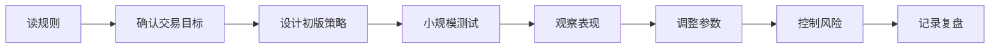

# 量化交易大赛

> [!note] 核心问题
> 量化交易大赛是低风险训练交易、编程、策略思维和团队协作的好方式。它的价值不只在获奖，更在于让你把市场机制、数据分析、风险管理和表达能力放进一个可展示的经历里。

## 学习目标

读完这篇，你要能做到：

1. 理解交易大赛为什么对量化求职有帮助。
2. 知道赛前需要准备哪些知识和工具。
3. 明白比赛中如何分工、记录、复盘和展示成果。
4. 避免只追求排名而忽略学习产出。
5. 把一次比赛转化为简历、项目和面试材料。

## 交易大赛是什么

交易大赛通常由高校、交易公司、做市商或金融科技平台举办。参赛者使用虚拟资金，在模拟交易环境中交易股票、期权、期货、事件合约或虚拟市场资产。

比赛形式可能包括：

- 手动交易；
- 算法交易；
- 做市挑战；
- 期权定价；
- 市场预测；
- 数据分析报告；
- 团队演示。

具体赛制每年都可能变化，报名时间、奖金和规则应以官网为准。

## 为什么值得参加

### 1. 训练真实约束下的决策

课堂学习常常没有时间压力和执行压力。比赛会迫使你面对：

- 信息不完整；
- 价格快速变化；
- 交易成本；
- 团队分歧；
- 风险暴露；
- 临场复盘。

### 2. 形成可展示经历

相比“我对量化很感兴趣”，比赛经历更具体：

- 我负责数据分析；
- 我写了做市算法；
- 我设计了风险限制；
- 我们如何复盘亏损；
- 策略最终表现如何。

这些内容都可以转化为简历和面试故事。

### 3. 接触公司和招聘人员

许多交易大赛会有赞助商、宣讲、社交和招聘环节。即使没有获奖，也可以通过高质量提问和项目展示留下印象。

## 常见比赛类型

| 类型 | 重点能力 | 适合准备 |
|---|---|---|
| 做市比赛 | 报价、库存管理、风险控制 | 订单簿、价差、概率 |
| 算法交易 | 编程、策略、回测、执行 | Python、数据结构、API |
| 期权比赛 | 定价、Greeks、波动率 | 期权基础、Black-Scholes |
| 事件合约 | 概率估计、信息更新 | 贝叶斯思维、新闻分析 |
| 数据研究 | 因子、统计、表达 | pandas、回归、可视化 |

不同比赛训练不同能力，不必都参加。选择和你目标岗位匹配的类型更重要。

## 赛前准备清单

### 基础知识

- 交易所和订单簿，见 [[translated_Quant_Trading_101|量化交易入门]]；
- 市价单、限价单、滑点和流动性；
- 简单概率和期望值；
- 风险收益比；
- 基础 Python；
- pandas 数据处理；
- 简单策略回测，见 [[回测方法论]]。

### 工具准备

| 工具 | 用途 |
|---|---|
| Python | 策略、数据处理、模拟 |
| pandas / numpy | 表格和数值计算 |
| matplotlib / plotly | 可视化 |
| Git | 团队协作和版本管理 |
| Markdown | 写报告和复盘 |
| Excel / Google Sheets | 快速计算和记录 |

### 团队分工

一个 3-4 人团队可以这样分：

| 角色 | 负责内容 |
|---|---|
| 策略负责人 | 设计交易逻辑和参数 |
| 工程负责人 | 实现算法、接口和数据处理 |
| 风控负责人 | 仓位、亏损限制、异常监控 |
| 记录/展示负责人 | 记录决策、整理复盘和演示 |

小团队可以一人多岗，但一定要有人专门负责风控和记录。

## 比赛中的工作流程

比赛中最重要的不是“不断改”，而是每次改动都知道为什么改。

建议记录：

- 时间；
- 当时市场状态；
- 做了什么决策；
- 决策理由；
- 结果；
- 后续调整。

这些记录会成为赛后复盘和面试材料。

## 比赛策略原则

### 1. 先读懂规则

很多比赛胜负不在模型复杂，而在是否读懂约束：

- 是否允许做空；
- 是否有仓位上限；
- 是否有交易成本；
- 是否有强平规则；
- 评分看收益还是风险调整收益；
- 是否惩罚大回撤。

### 2. 先活下来

比赛时间短，很多队伍会过度冒险。除非规则明确只看最终收益且没有回撤惩罚，否则风险控制通常比极端押注更稳。

### 3. 简单策略优先

比赛环境时间有限，复杂模型容易来不及调试。优先选择：

- 能解释；
- 能快速实现；
- 能监控；
- 出错后能定位问题的策略。

### 4. 做好沟通

团队比赛里，沟通失败常常比模型失败更致命。要提前约定：

- 谁有最终交易决策权；
- 什么情况停止策略；
- 多久同步一次；
- 如何处理意见分歧。

## 赛后如何转化为求职材料

### 简历写法

不要只写“参加某某比赛”。更好的写法：

- 实现了什么；
- 使用了什么工具；
- 如何控制风险；
- 有什么结果；
- 学到了什么。

示例：

> 在模拟做市比赛中负责库存风险模块，使用 Python 实现报价调整规则，根据持仓偏离动态扩大/收窄价差，记录并复盘策略在高波动阶段的表现。

### 面试讲法

准备回答：

1. 你们的策略假设是什么？
2. 你负责哪一部分？
3. 最大的 bug 或错误是什么？
4. 如果重做一次，你会改什么？
5. 你如何衡量策略风险？

面试官更看重你是否理解自己的工作，而不是只看排名。

## 常见比赛举例

以下赛事形式和时间会变化，参加前应查看官网：

| 比赛 | 常见特点 |
|---|---|
| Ready Trader Go / Optiver | 算法交易、模拟交易所、做市思维 |
| Prosperity / IMC Trading | 手动与算法结合，适合 Python 练习 |
| UChicago Trading Competition | 做市、期权、算法交易、团队挑战 |
| Berkeley Trading Competition | 校际交易比赛和企业交流 |
| 事件合约类比赛 | 概率估计和信息更新 |

不要把赛事列表当成固定日历。它更像方向地图，具体报名时间需要自己跟踪。

## 常见误区

| 误区 | 更好的做法 |
|---|---|
| 只追求获奖 | 把比赛转化为项目、复盘和面试材料 |
| 模型过度复杂 | 先做稳定、可解释、可调试的策略 |
| 不读规则 | 先理解评分和交易约束 |
| 没有人负责风控 | 明确止损、仓位、暂停条件 |
| 赛后不复盘 | 复盘才是比赛最大的长期价值 |

## 练习：准备一份参赛计划

| 项目 | 你的答案 |
|---|---|
| 想参加的比赛类型 |  |
| 需要补的知识 |  |
| 团队分工 |  |
| 初始策略想法 |  |
| 风控规则 |  |
| 赛后可展示产出 |  |

如果你现在还没有比赛可参加，可以先用模拟订单簿或历史数据做一次自定义挑战。

## 相关概念

[[translated_Quant_Trading_101|量化交易入门]] [[常见量化策略]] [[回测方法论]] [[风险管理框架]] [[translated_Quantitative_Finance_Portfolio_Projects|量化金融项目集]]
