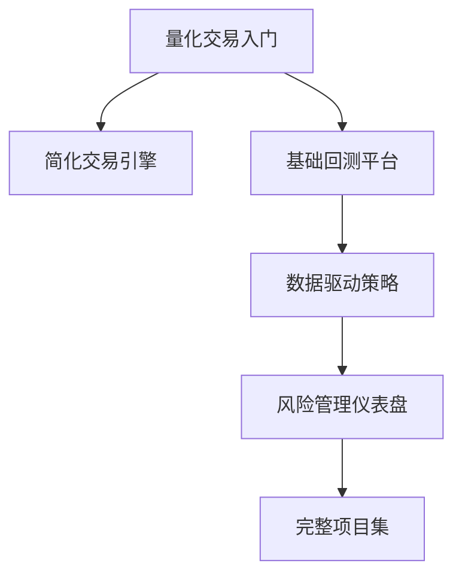

# 量化金融项目集

> [!note] 核心问题
> 量化金融项目的价值不是“看起来高级”，而是证明你能把金融问题拆成数据、模型、代码、验证和表达。一个小而完整的项目，通常比一堆没有复盘的代码更能展示能力。

## 学习目标

读完这篇，你要能做到：

1. 知道量化项目应该展示哪些能力。
2. 根据目标岗位选择合适项目。
3. 把项目拆成可交付成果，而不是只写代码。
4. 避免常见的项目集误区。
5. 设计一条从入门到求职展示的项目路线。

## 好项目应该展示什么

| 能力 | 项目中如何体现 |
|---|---|
| 金融理解 | 问题定义、收益来源、风险解释 |
| 数据能力 | 获取、清洗、对齐、检查数据 |
| 编程能力 | 清晰代码、模块化、可复现 |
| 统计思维 | 样本外、显著性、稳健性 |
| 风险意识 | 回撤、成本、压力测试 |
| 表达能力 | README、图表、结论和局限 |

雇主或读者通常不只看结果，还会看你是否理解局限。

## 项目选择原则

### 1. 小而完整

比起做一个宏大的“AI 自动交易平台”，更好的项目是：

- 数据来源清楚；
- 策略逻辑清楚；
- 代码能运行；
- 图表能解释；
- 结论不过度吹嘘；
- 有局限和下一步。

### 2. 和岗位匹配

| 目标方向 | 更适合的项目 |
|---|---|
| 量化研究 | 因子研究、策略回测、统计套利 |
| 量化开发 | 撮合引擎、交易系统、数据管线 |
| 量化交易 | 做市模拟、风险控制、订单执行 |
| 风险管理 | VaR/ES、压力测试、组合风险 |
| 金融数据 | 数据清洗、可视化、研究平台 |

### 3. 可复现

别人应该能按 README 运行你的项目，至少能理解：

- 环境如何安装；
- 数据从哪里来；
- 如何运行主脚本；
- 输出是什么；
- 结论是什么。

## 项目 1：从零构建简化交易引擎

### 适合方向

量化开发、交易系统、金融工程。

### 项目目标

实现一个简化交易系统，包括：

- 订单对象；
- 市价单和限价单；
- 买卖订单簿；
- 撮合逻辑；
- 成交记录；
- 简单行情输出。

### 你会学到

- 订单簿如何组织；
- 价格优先、时间优先如何实现；
- 市价单为什么会产生滑点；
- 做市和库存管理的基础。

### 可交付成果

| 成果 | 内容 |
|---|---|
| README | 系统设计和运行方式 |
| 核心代码 | Order、OrderBook、MatchingEngine |
| 单元测试 | 限价单、市价单、部分成交 |
| 示例 | 输入订单流，输出成交结果 |
| 复盘 | 系统限制和下一步优化 |

可配合阅读 [[translated_Quant_Trading_101|量化交易入门]]。

## 项目 2：机器学习概念可视化

### 适合方向

量化研究、机器学习、金融数据分析。

### 项目目标

选择一个机器学习概念，做成可交互或可视化项目。

可选主题：

- K-Means 聚类；
- PCA 降维；
- 决策树分类；
- 交叉验证；
- 过拟合演示；
- 正则化对模型的影响。

### 金融连接

不要只做通用 ML demo，要加金融语境：

- 用股票收益和波动率做聚类；
- 用 PCA 分解行业或资产收益；
- 用交叉验证展示策略过拟合；
- 用特征重要性解释因子模型。

### 可交付成果

- 可视化图表；
- 简短理论解释；
- 金融数据示例；
- 局限说明。

## 项目 3：数据驱动投资策略

### 适合方向

量化研究、资产管理、策略开发。

### 项目目标

从一个清晰假设出发，完成策略研究。

示例假设：

- 低估值高质量股票长期跑赢；
- 动量强的行业短期延续；
- 低波动 ETF 风险调整收益更好；
- 财报超预期后存在盈余漂移。

### 项目步骤

1. 提出经济逻辑；
2. 获取数据；
3. 清洗和对齐；
4. 定义信号；
5. 构建组合；
6. 加入交易成本；
7. 回测；
8. 做样本外和稳健性检验；
9. 写结论和局限。

这个项目应重点结合 [[因子投资体系]]、[[常见量化策略]] 和 [[回测方法论]]。

## 项目 4：期权定价模型

### 适合方向

金融工程、衍生品、量化研究。

### 可选模型

| 模型 | 重点 |
|---|---|
| Black-Scholes | 闭式解、Greeks、隐含波动率 |
| 二叉树 | 离散时间、提前行权、路径结构 |
| 蒙特卡洛 | 随机路径、折现、误差收敛 |

### 项目结构

- 输入：标的价格、行权价、到期时间、利率、波动率；
- 输出：期权价格、Delta、Gamma 等；
- 可视化：价格随波动率、到期时间、标的价格变化；
- 扩展：用市场价格反推出隐含波动率。

可配合阅读 [[期权策略]] 和 [[波动率]]。

## 项目 5：交易策略回测平台

### 适合方向

量化研究、量化交易、量化开发。

### 项目目标

实现一个最小可用回测框架：

- 输入历史数据；
- 生成交易信号；
- 模拟交易；
- 计算组合净值；
- 输出绩效指标。

### 最小功能

| 模块 | 功能 |
|---|---|
| 数据模块 | 读取价格和成交量 |
| 策略模块 | 均线、动量或均值回归 |
| 执行模块 | 成本、滑点、调仓 |
| 绩效模块 | 年化收益、最大回撤、夏普 |
| 报告模块 | 图表和结论 |

不要一开始就追求复杂框架。能正确处理成本、信号滞后和回撤，比功能很多更重要。

## 项目 6：风险管理仪表盘

### 适合方向

风险管理、资产配置、量化研究。

### 项目目标

输入一个投资组合，输出风险指标：

- 年化波动率；
- 最大回撤；
- 夏普比率；
- VaR；
- CVaR / ES；
- Beta；
- 相关性矩阵；
- 压力测试。

可配合阅读 [[风险管理框架]]、[[夏普比率]] 和 [[evt-var-es]]。

## 推荐项目路线

### 入门路线

1. 先做交易引擎或回测平台，理解基础设施。
2. 再做一个简单策略，理解数据和规则。
3. 然后做风险仪表盘，展示风险意识。
4. 最后整理 README、图表和复盘。

## 项目 README 模板

| 部分 | 应包含内容 |
|---|---|
| 背景 | 这个项目解决什么金融问题 |
| 方法 | 使用什么数据、模型、规则 |
| 运行方式 | 如何安装和运行 |
| 结果 | 主要图表和指标 |
| 风险 | 数据、模型、成本、样本外局限 |
| 下一步 | 可以如何扩展 |

## 常见误区

| 误区 | 更好的做法 |
|---|---|
| 项目很大但跑不起来 | 小项目完整可复现 |
| 只展示收益曲线 | 同时展示回撤、成本、失败情景 |
| 不写 README | 让别人一眼理解项目价值 |
| 复制教程代码 | 加入自己的问题、数据和复盘 |
| 不说明局限 | 主动写局限更显专业 |

## 练习：设计你的第一个项目

| 项目 | 你的答案 |
|---|---|
| 目标岗位 |  |
| 项目主题 |  |
| 数据来源 |  |
| 核心方法 |  |
| 最小可交付版本 |  |
| 评价指标 |  |
| 最大风险或局限 |  |
| README 标题 |  |

先把项目写小，做到能运行、能解释、能复盘，再逐步扩展。

## 相关概念

[[量化投资基础]] [[translated_Quant_Trading_101|量化交易入门]] [[常见量化策略]] [[回测方法论]] [[风险管理框架]] [[期权策略]] [[波动率]]
