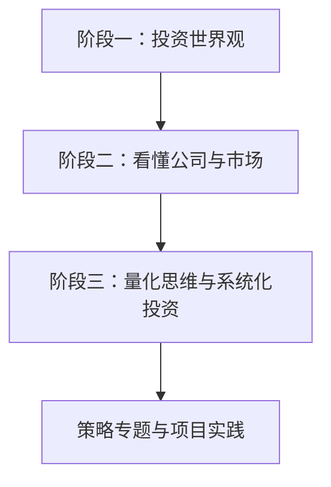

# 入门教程总览

> [!note] 核心问题
> 这个目录把入门教程拆成两条线：一条是从投资世界观到公司分析再到量化系统的主线课程；另一条是策略、风险、工具和职业项目的专题阅读。建议先走主线，再按兴趣补专题。

## 主线学习路径

| 阶段 | 入口 | 你会学到什么 |
|---|---|---|
| 阶段一 | [投资世界观与底层逻辑](阶段一-投资世界观/目录.md) | 复利、行为金融、心理偏误、阅读框架、资产配置 |
| 阶段二 | [看懂公司与市场](阶段二-看懂公司与市场/目录.md) | 财报、财务比率、杜邦分析、估值、技术分析、宏观基础 |
| 阶段三 | [量化思维与系统化投资](阶段三-量化思维与系统化投资/目录.md) | 量化基础、因子、策略、回测、风险管理 |

## 专题阅读顺序

### 1. 交易与市场机制

- [[translated_Quant_Trading_101|量化交易入门]]：交易所、订单、订单簿、撮合、做市。
- [[高频交易]]：自动化交易系统、低延迟架构、行情与执行。
- [交易策略专题](交易策略/)：交易风格、策略盈利来源、多空策略、策略设计。

适合在学习 [[技术分析入门]] 和 [[常见量化策略]] 后阅读。

### 2. 组合与风险

- [[马科维茨理论]]：现代资产组合理论和有效前沿。
- [[夏普比率]]：如何比较不同策略的风险调整收益。
- [[波动率]]：波动率、隐含波动率和期权市场视角。
- [[evt-var-es]]：VaR、ES 和尾部风险。

适合在学习 [[资产配置入门]] 和 [[风险管理框架]] 后阅读。

### 3. 策略地图

- [[九大策略]]：经典投资组合风格速览。
- [[策略分类]]：量化对冲基金常见策略分类。
- [[多策略]]：多策略基金如何组合不同收益来源。
- [[宏观对冲]]：全球宏观、固定收益相对价值、商品和新兴市场策略。
- [[事件驱动]]：并购、重组、激进主义、困境投资等事件型机会。
- [[期权策略]]：期权定价和风险管理基础。

适合在阶段三之后作为扩展阅读。

### 4. 职业与项目

- [[translated_Quantitative_Finance_Portfolio_Projects|量化金融项目集]]：用项目展示能力。
- [[translated_Quant_Trading_Competitions|量化交易大赛]]：如何通过竞赛训练交易和协作能力。
- [[point72-idea]]：股票分析师如何提出投资想法。

适合想进入量化、投研、交易或金融科技方向的人。

## 推荐学习节奏

| 周期 | 内容 | 产出 |
|---|---|---|
| 第 1-2 周 | 阶段一 | 一页个人投资者说明书 |
| 第 3-5 周 | 阶段二 | 一家公司基本面分析笔记 |
| 第 6-8 周 | 阶段三 | 一个可回测的策略研究计划 |
| 第 9 周以后 | 专题阅读 | 项目集、交易策略或风险专题 |

## 最小实践路线

如果你不想一次读太多，可以按这个最小路线走：

1. [[复利思维]]
2. [[资产配置入门]]
3. [[三张财务报表]]
4. [[估值方法入门]]
5. [[量化投资基础]]
6. [[回测方法论]]
7. [[风险管理框架]]
8. [[translated_Quantitative_Finance_Portfolio_Projects|量化金融项目集]]

读完这条线，你就能从“知道概念”走到“能做一个可展示的小项目”。

## 学习提醒

不要把入门教程当成百科词条逐篇背。更好的方法是每学一块就做一个小产出：

- 学复利：写长期投入计划；
- 学财报：分析一家真实公司；
- 学估值：写三种情景假设；
- 学策略：把规则写清楚；
- 学回测：检查数据和成本；
- 学风控：写最大亏损边界。

投资知识真正变扎实，靠的不是看过，而是用过。
