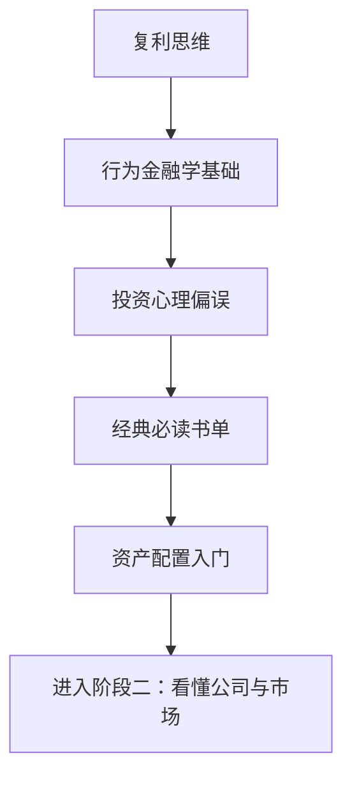

# 阶段一：投资世界观与底层逻辑

> [!note] 核心问题
> 阶段一不急着学选股、估值和交易技巧，而是先建立投资的底层世界观：长期收益从哪里来，风险为什么必须管理，人为什么会反复犯错，以及普通投资者怎样用简单规则保护自己。

## 本阶段学什么

投资初学者最容易犯的错误，是一上来就问“买什么”。更好的顺序是先回答五个问题：

1. 投资和投机有什么区别？
2. 复利为什么要求长期、低成本和少犯大错？
3. 市场为什么经常不理性？
4. 我自己最容易被哪些心理偏误影响？
5. 为什么资产配置通常比短线择时更重要？

阶段一的目标不是让你立刻变成高手，而是先建立“不会轻易被市场带着跑”的判断底盘。

## 学习路径

## 核心笔记

| 笔记 | 解决的问题 | 学完后的能力 |
|---|---|---|
| [[复利思维]] | 为什么长期投资最怕大亏和高费用？ | 能理解时间、收益率、回撤、成本对最终财富的影响 |
| [[行为金融学基础]] | 市场为什么不是完全理性的？ | 能理解泡沫、恐慌、动量、价值效应背后的人性因素 |
| [[投资心理偏误]] | 投资者最常犯哪些系统性错误？ | 能识别自己的过度自信、损失厌恶、确认偏差 |
| [[经典必读书单]] | 应该先读哪些书建立框架？ | 能按主题阅读，而不是被书单淹没 |
| [[资产配置入门]] | 为什么不要把钱押在一个资产上？ | 能搭建适合自己的基础组合和再平衡规则 |

## 推荐学习节奏

### 第 1 周：建立长期主义

读 [[复利思维]]，重点理解：

- 年化收益率的微小差异，为什么几十年后会被放大；
- 大幅回撤为什么会破坏复利；
- 费用、税费和频繁交易为什么会长期侵蚀收益；
- 为什么“长期持有”不是口号，而是数学要求。

练习：用 5%、8%、12% 三个年化收益率计算 20 年后的资产差异。

### 第 2 周：理解市场中的人

读 [[行为金融学基础]] 和 [[投资心理偏误]]，重点理解：

- 市场价格既反映信息，也反映人的情绪；
- 投资错误往往不是知识不足，而是情绪和纪律失控；
- 你不可能完全消灭偏误，只能用规则降低它的破坏力。

练习：回忆最近一次冲动消费或投资想法，标注里面有哪些心理偏误。

### 第 3 周：建立阅读框架

读 [[经典必读书单]]，不要求一次读完所有书。先理解每本书对应的投资问题：

- 《聪明的投资者》：安全边际和市场先生；
- 《漫步华尔街》：为什么指数投资适合大多数人；
- 《股票大作手回忆录》：交易心理和风险纪律；
- 《怎样选择成长股》：如何理解好公司；
- 《证券分析》：如何做更深入的基本面分析。

### 第 4 周：搭建组合雏形

读 [[资产配置入门]]，重点不是追求最优比例，而是先避免单一风险：

- 股票、债券、现金、黄金、海外资产分别承担什么角色；
- 核心-卫星策略为什么适合学习阶段；
- 再平衡为什么是纪律，而不是预测。

练习：写出自己的目标组合，例如“70% 宽基指数 + 20% 债券/现金 + 10% 学习仓”。

## 完成阶段一后的能力标准

完成本阶段后，你应该能够：

1. 用自己的话解释复利、回撤、通胀、交易成本对长期收益的影响。
2. 识别市场非理性和个人心理偏误，不把每次价格波动都解释成“有内幕”。
3. 知道价值投资、指数投资、成长股投资、交易心理分别解决什么问题。
4. 设计一个简单、可长期执行的资产配置方案。
5. 在进入阶段二前，明确自己的风险承受能力和学习仓位边界。

## 阶段一实战作业

完成一页“投资者说明书”：

| 项目 | 你要写下来的内容 |
|---|---|
| 投资目标 | 养老、教育、买房、财富增长，还是学习 |
| 时间期限 | 3 年以内、3-10 年、10 年以上 |
| 最大可承受回撤 | 例如 -10%、-20%、-30% |
| 核心组合 | 宽基指数、债券、现金等长期配置 |
| 学习仓位 | 用来练习个股、策略或量化的比例 |
| 禁止事项 | 不加杠杆、不满仓单一行业、不借钱投资等 |

这份说明书会在后续阶段反复使用。它能帮你在市场兴奋或恐慌时，不被情绪临时改写规则。

## 相关概念

[[夏普比率]] [[马科维茨理论]] [[回测方法论]] [[因子投资体系]] [[波动率]]
