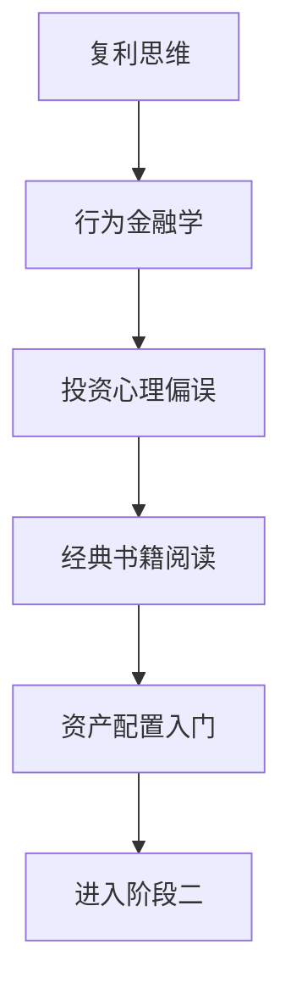

# 阶段一：投资世界观与底层逻辑

> [!note] 💡 概念解析
> 阶段一是投资学习的根基——不学怎么选股、怎么估值，而是先搞清楚"市场为什么存在"和"钱是怎么赚的"。这些知识通用性最强，终身受用。

## 学习路径

## 核心笔记

- [[复利思维]] — 投资最重要的数学概念
- [[行为金融学基础]] — 理解市场非理性的钥匙
- [[投资心理偏误]] — 投资者常犯的18种错误
- [[经典必读书单]] — 5本必读 + 进阶推荐
- [[资产配置入门]] — 资产配置是长期收益的最大决定因素

## 学习目标

完成阶段一后，你应该能够：
1. 理解复利的威力，区分投资与投机
2. 识别自己和他人的常见心理偏误
3. 知道行为金融学如何解释市场异常
4. 掌握经典投资书籍的核心思想
5. 理解资产配置的基本框架

## 📚 相关概念

[[夏普比率]] [[马科维茨理论]] [[回测]] [[因子投资]]
