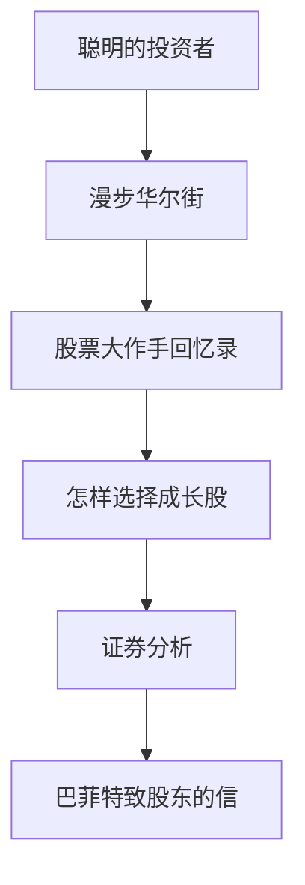

# 经典必读书单

> [!note] 核心问题
> 投资阅读不在于读了多少本，而在于能否建立稳定的思维框架。一本书如果能改变你的风险观、估值观或行为纪律，比匆忙读完几十本更有价值。

## 学习目标

读完这篇，你要能做到：

1. 知道每本经典书解决的核心投资问题。
2. 按主题建立阅读顺序，而不是被书单数量压垮。
3. 把阅读转化为投资检查清单和行动规则。
4. 理解不同投资流派之间的互补关系。

## 阅读原则

### 1. 先读框架书，再读技巧书

初学者不缺“技巧”，缺的是判断技巧适用边界的能力。先建立投资世界观，再学习财报、估值、策略和交易。

### 2. 慢读比快读重要

经典书的价值不在信息密度，而在反复校正你的思维。第一次读懂概念，第二次读懂风险，第三次往往才读懂自己。

### 3. 读完要产出

每读一本书，至少产出三样东西：

- 3 个核心观点；
- 3 条可以执行的规则；
- 1 个自己过去犯过的错误。

## 五本核心经典

### 1. 《聪明的投资者》：价值投资的底层语言

作者：本杰明·格雷厄姆

这本书最重要的不是教你买哪只股票，而是教你如何面对市场。

核心概念：

| 概念 | 含义 | 对投资者的启示 |
|---|---|---|
| 市场先生 | 市场每天给你报价，但情绪极不稳定 | 市场是工具，不是老师 |
| 内在价值 | 资产基于现金流和资产质量的合理价值 | 价格不等于价值 |
| 安全边际 | 用明显低于价值的价格买入 | 留出犯错空间 |
| 防御型投资者 | 以稳健、分散、低成本为主 | 大多数人更适合这一类 |

适合解决的问题：为什么不要把市场价格当成真理，为什么买入价格决定长期收益的一部分。

阅读重点：第 8 章“市场波动”和第 20 章“安全边际”。

### 2. 《漫步华尔街》：理解市场有效性和指数投资

作者：伯顿·马尔基尔

这本书会提醒你：市场很难被持续战胜。对大多数普通投资者而言，低成本指数基金可能比频繁选股更可靠。

核心概念：

- 随机漫步：短期股价高度不可预测；
- 主动基金长期跑赢指数很难；
- 分散化和资产配置比预测短期行情更重要；
- 投资者心理会造成泡沫和恐慌。

适合解决的问题：为什么“我努力研究就一定能跑赢市场”是危险假设。

阅读重点：有效市场、泡沫历史、指数投资章节。

### 3. 《股票大作手回忆录》：交易心理和风险纪律

作者：埃德温·勒菲弗

它虽然是交易故事，但本质是人性教材。很多市场错误不是不知道规则，而是在贪婪、恐惧和希望中无法执行规则。

核心概念：

| 概念 | 含义 |
|---|---|
| 顺势而为 | 不要和明显趋势硬扛 |
| 承认错误 | 错了要快速处理，不要祈祷 |
| 保护本金 | 活下来比抓住每次机会更重要 |
| 等待关键点 | 不要为了行动而行动 |

适合解决的问题：为什么交易中最大的敌人往往不是市场，而是自己。

阅读重点：主人公几次大亏后的心理变化。

### 4. 《怎样选择成长股》：理解好公司的定性分析

作者：菲利普·费雪

格雷厄姆强调“便宜”，费雪强调“好公司”。这本书帮助你理解：有些优秀公司可以长期创造高回报，不能只用低估值筛选。

核心概念：

- 十五要点：产品、市场、管理层、研发、利润率、销售能力；
- 闲聊法：从客户、供应商、竞争对手了解公司真实情况；
- 长期持有：真正优秀的公司不需要频繁买卖；
- 管理层质量：诚信和长期主义非常重要。

适合解决的问题：为什么好公司值得研究商业模式，而不是只看 PE。

阅读重点：十五要点和闲聊法。

### 5. 《证券分析》：基本面分析的技术手册

作者：格雷厄姆 & 多德

这本书更难，适合作为工具书反复查。它训练你从资产负债表、利润表、债券、优先股、普通股等角度做严谨分析。

核心价值：

- 建立证券分析的严谨态度；
- 学会区分资产价值、盈利能力和市场价格；
- 理解安全边际不是口号，而是分析结论；
- 认识到不同证券有不同风险收益结构。

适合解决的问题：如何从“投资理念”进入“财务和估值分析”。

阅读建议：不必一口气读完，可在学习 [[三张财务报表]] 和 [[估值方法入门]] 后回头查阅。

## 进阶阅读地图

| 主题 | 推荐书 | 解决的问题 |
|---|---|---|
| 行为金融 | 《思考，快与慢》 | 人为什么会系统性犯错 |
| 泡沫与周期 | 《非理性繁荣》 | 市场情绪如何推高资产价格 |
| 资产配置 | 《不落俗套的成功》 | 长期资金如何做组合管理 |
| 巴菲特思想 | 《巴菲特致股东的信》 | 如何理解商业模式和资本配置 |
| 风险与不确定性 | 《随机漫步的傻瓜》 | 运气、概率和幸存者偏差 |

## 推荐阅读顺序

### 为什么这样排

1. 先读《聪明的投资者》，建立价格与价值的区别。
2. 再读《漫步华尔街》，避免一开始就高估自己战胜市场的能力。
3. 接着读《股票大作手回忆录》，理解交易纪律和人性弱点。
4. 然后读《怎样选择成长股》，补足好公司和管理层视角。
5. 最后读《证券分析》，进入更细的财务和估值训练。

## 每本书的读书笔记模板

| 项目 | 记录内容 |
|---|---|
| 这本书解决什么问题 | 例如估值、心理、资产配置、交易纪律 |
| 三个核心观点 | 用自己的话写，不摘抄 |
| 一个反直觉观点 | 哪个观点改变了你的原有看法 |
| 一个实践规则 | 读完后你会如何改变投资行为 |
| 一个风险提醒 | 哪些观点可能被误用 |

## 常见误区

| 误区 | 更好的做法 |
|---|---|
| 收藏很多书单但不读 | 先读透 3-5 本核心书 |
| 只读支持自己风格的书 | 同时读价值、指数、成长、交易心理 |
| 把书中结论机械套用 | 结合市场环境、资产类别和个人能力 |
| 读完没有输出 | 每本书写一页行动笔记 |
| 迷信大师语录 | 理解背后的适用条件 |

## 练习：做一张个人阅读计划

| 周期 | 书名 | 目标 |
|---|---|---|
| 第 1 个月 | 《聪明的投资者》 | 写出安全边际和市场先生的理解 |
| 第 2 个月 | 《漫步华尔街》 | 写出指数投资适合自己的原因 |
| 第 3 个月 | 《股票大作手回忆录》 | 整理 5 条交易纪律 |
| 第 4-5 个月 | 《怎样选择成长股》 | 建立好公司分析清单 |
| 第 6 个月以后 | 《证券分析》 | 结合财报学习查阅 |

不要追求速度。投资阅读的目标，是让你在市场诱惑面前多停三秒。

## 相关概念

[[行为金融学基础]] [[投资心理偏误]] [[复利思维]] [[资产配置入门]] [[估值方法入门]]
