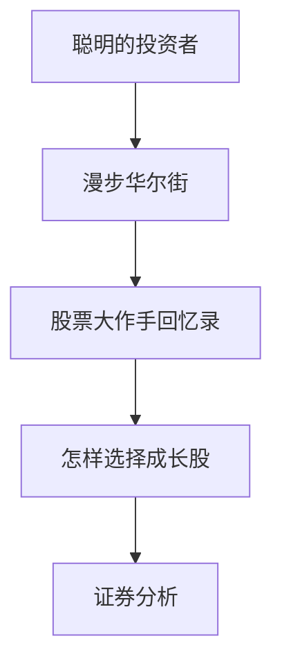

# 经典必读书单

> [!note] 💡 概念解析
> 不需要读完 50 本投资书才能开始投资。5 本核心经典 + 3 本进阶 = 建立扎实的投资思维框架。重点是"读透"而非"读多"。

## 5 本必读经典

### 1. 《聪明的投资者》— 本杰明·格雷厄姆

- **地位**：价值投资的"圣经"，巴菲特的导师之作
- **核心概念**：
  - **"市场先生"比喻**：市场情绪会极度波动，投资者应利用其非理性
  - **"内在价值"**：基于详尽分析评估资产真实价值
  - **"安全边际"**：买入价格远低于内在价值的资产——价值投资的基石
  - **防御型 vs 积极型投资者**：两种策略的选择
- **适合**：所有希望理解投资本质的人，入门首选

### 2. 《证券分析》— 格雷厄姆 & 多德

- **地位**：基本面分析的"开山之作"，比《聪明的投资者》更深
- **核心内容**：
  - 如何分析资产负债表、损益表
  - 债券/优先股/普通股的分析方法
  - "烟蒂股"策略：寻找市值低于净流动资产的公司
- **适合**：想深入学习基本面分析的进阶读者

### 3. 《怎样选择成长股》— 菲利普·费雪

- **地位**：成长股投资的奠基之作
- **核心概念**：
  - **"十五要点"选股原则**：评估管理层的诚信与能力、产品长期增长潜力
  - **"闲聊法"调研**：通过产业链上下游、竞争对手获取真实信息
  - **集中投资 + 长期持有**：真正理解的好公司不需要太多
- **适合**：关注企业长期增长潜力的投资者

> [!tip] 格雷厄姆 vs 费雪
> 格雷厄姆侧重"定量"（便宜就是硬道理），费雪侧重"定性"（好公司值得溢价）。巴菲特说他是"85% 的格雷厄姆 + 15% 的费雪"。

### 4. 《漫步华尔街》— 伯顿·马尔基尔

- **地位**：指数投资和个人投资实用指南的经典
- **核心概念**：
  - **随机漫步理论**：短期股价不可预测
  - **技术分析和基本面分析的局限性**
  - **指数基金是最佳选择**：大多数投资者（包括专业基金经理）无法持续战胜市场
  - 融入行为金融学洞见
- **适合**：想了解"为什么普通人应该买指数"的人

### 5. 《股票大作手回忆录》— 埃德温·勒菲弗

- **地位**：以小说形式写成的交易心理学经典
- **核心概念**：
  - **"价格沿最小阻力线运行"**：顺势而为
  - **"关键点"理论**：判断趋势转折
  - **交易纪律和风险管理**：承认错误、保护本金
  - 深刻洞察市场人性（贪婪、恐惧、希望）
- **适合**：所有市场参与者，每次重读都有新收获

## 进阶阅读

### 巴菲特系列
- 《巴菲特致股东的信》
- 《巴菲特之道》

### 行为金融学
- 《思考，快与慢》— 丹尼尔·卡尼曼（诺奖得主）
- 《非理性繁荣》— 罗伯特·席勒（诺奖得主）

### 资产配置
- 《不落俗套的成功》— 大卫·斯文森（耶鲁大学基金掌舵人）
- 《机构投资的创新之路》

## 阅读建议

1. **先读《聪明的投资者》**——先理解什么是"投资"
2. **再读《漫步华尔街》**——了解市场的不可预测性
3. **然后读《股票大作手回忆录》**——理解交易中的心理
4. **接着读《怎样选择成长股》**——补充成长股视角
5. **最后读《证券分析》**——进阶的技术性阅读

> [!important] 核心理念
> 经典常读常新。随着投资经验的积累，每次重读会有不同的理解。这些书构建了理解股票投资的坚实框架，是任何严肃投资者的必备品。

## 📚 相关概念

[[行为金融学基础]] [[投资心理偏误]] [[复利思维]] [[资产配置入门]] [[因子投资]]
