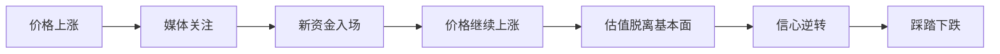

# 行为金融学基础

> [!note] 核心问题
> 行为金融学研究人在金融市场中的真实决策方式。传统金融假设投资者理性、市场有效；行为金融学提醒我们，人会恐惧、贪婪、从众、过度自信，市场价格也会因此出现系统性偏差。

## 学习目标

读完这篇，你要能做到：

1. 理解传统金融学和行为金融学的核心差异。
2. 知道有限理性、前景理论、损失厌恶为什么重要。
3. 用行为金融学解释泡沫、崩盘、价值效应和动量效应。
4. 把行为金融学转化为投资纪律，而不是只拿来解释别人犯错。

## 传统金融 vs 行为金融

| 维度 | 传统金融学 | 行为金融学 |
|---|---|---|
| 投资者假设 | 理性、会最大化效用 | 有限理性，受情绪和偏误影响 |
| 市场价格 | 充分反映信息 | 可能偏离内在价值 |
| 错误定价 | 很快被套利消除 | 可能持续很久 |
| 研究重点 | 风险、收益、均衡价格 | 决策心理、群体行为、非理性 |
| 投资启示 | 分散化、有效市场、资产定价 | 纪律、反脆弱、利用情绪极端 |

两者不是互相否定。更好的理解是：市场长期有一定效率，但短中期经常被人的情绪和约束扭曲。

## 两大核心支柱

### 一、有限理性

人类做投资决策时面对三种限制：

| 限制 | 在投资中的表现 |
|---|---|
| 信息限制 | 不可能掌握所有公司、行业和宏观信息 |
| 认知限制 | 无法同时处理太多变量，只能抓重点 |
| 时间限制 | 市场变化快，很多决策必须在不完全信息下完成 |

所以人们常用启发式规则替代最优决策。例如“最近涨得多就是好资产”“大公司一定安全”“朋友都买说明靠谱”。这些规则能节省脑力，但也会产生系统性错误。

### 二、前景理论

前景理论由卡尼曼和特沃斯基提出，解释了人在不确定性下如何看待收益和损失。

核心观点：

1. **损失厌恶**：亏 100 元的痛苦通常大于赚 100 元的快乐。
2. **参照依赖**：人们根据买入价、历史高点、账户盈亏等参照点判断好坏。
3. **概率加权**：人们容易高估小概率事件，低估中高概率事件。

投资中的典型表现：

- 盈利一点就卖，害怕利润回吐；
- 亏损很久也不卖，期待“回本”；
- 被彩票式高收益产品吸引，低估爆雷概率；
- 牛市中觉得下跌概率很低，熊市中觉得上涨概率很低。

## 行为金融学如何解释市场现象

### 1. 市场泡沫

泡沫通常不是因为所有人都不知道贵，而是因为很多人相信可以更高价卖给下一个人。

常见过程：

泡沫的心理燃料包括贪婪、从众、错失恐惧和过度自信。

### 2. 恐慌崩盘

恐慌时，投资者不再计算内在价值，而是优先考虑“先卖出去”。流动性变差时，价格可能低于基本面价值很远。

这解释了为什么长期投资者需要现金和仓位纪律：不是为了预测底部，而是为了在别人被迫卖出时还有行动能力。

### 3. 价值效应

低估值股票长期可能跑赢高估值股票，一个行为解释是：市场过度追逐热门叙事，低估了冷门、无聊、短期困难公司的均值回归。

但价值投资并不等于买所有低 PE 股票。低估值可能是机会，也可能是价值陷阱，需要结合 [[财务比率分析]] 和 [[估值方法入门]]。

### 4. 动量效应

过去上涨的资产短期继续上涨，可能来自投资者反应不足和羊群行为。信息刚出现时，市场没有一次性反映完；等趋势被更多人看到，又可能出现过度反应。

动量有效不代表追涨一定赚钱。动量策略最怕突然反转和拥挤交易。

## 行为偏误如何影响个人投资

| 偏误 | 常见行为 | 可能后果 |
|---|---|---|
| 过度自信 | 频繁交易、重仓单一标的 | 成本上升、风险集中 |
| 确认偏差 | 只看支持自己观点的信息 | 错误持仓越陷越深 |
| 损失厌恶 | 不愿止损，只想回本 | 小亏拖成大亏 |
| 羊群行为 | 热点越涨越想买 | 高位接盘 |
| 锚定效应 | 盯着买入价和历史高点 | 忽略当前价值变化 |

详细清单见 [[投资心理偏误]]。

## 如何把行为金融学变成投资优势

### 1. 把主观判断写成规则

规则不一定完美，但能减少情绪临场发挥。例如：

- 单只股票不超过总资产 10%；
- 学习仓不超过总资产 10%-20%；
- 每季度再平衡一次；
- 买入前必须写下买入理由和卖出条件。

### 2. 记录交易日志

每次买卖写下：

| 项目 | 内容 |
|---|---|
| 决策理由 | 为什么买/卖 |
| 当时情绪 | 兴奋、恐惧、焦虑、从众 |
| 反方观点 | 什么证据说明我可能错了 |
| 退出条件 | 什么情况卖出或减仓 |
| 复盘结果 | 事后看是逻辑正确还是运气 |

日志的价值不是预测市场，而是让你看见自己的重复错误。

### 3. 少接触噪音

财经新闻、短视频、群聊和盘中波动会不断触发情绪。信息越多不一定越理性，很多时候只是让你更想行动。

新手可以尝试：

- 每天固定时间看市场，不全天盯盘；
- 只保留少数高质量信息源；
- 重大决策隔夜再做；
- 不根据单条新闻满仓调仓。

### 4. 反过来观察市场情绪

行为金融学最有用的地方，是帮你在极端情绪中保持清醒：

- 当所有人都说“这次不一样”，要检查估值和杠杆；
- 当所有人都说“再也不会涨”，要检查资产质量和现金流；
- 当自己特别想立刻买入或卖出，先问是不是情绪在驱动。

## 常见误区

| 误区 | 更好的理解 |
|---|---|
| 学了行为金融学就能战胜市场 | 你自己也是有偏误的人 |
| 市场不理性，所以可以随便做逆向 | 市场可以比你想象中更久地不理性 |
| 泡沫一定马上破 | 高估值可以持续很久，不能只靠“看空”赚钱 |
| 只要有纪律就不会亏 | 纪律只能减少低级错误，不能消除市场风险 |

## 练习：做一次心理复盘

选择你最近一次投资、消费或学习决策，回答：

1. 我当时最强烈的情绪是什么？
2. 我有没有只寻找支持自己观点的信息？
3. 我是否受到他人观点或热门叙事影响？
4. 如果结果相反，我是否提前想过应对方案？
5. 下次遇到类似情境，我要用什么规则保护自己？

## 相关概念

[[投资心理偏误]] [[复利思维]] [[资产配置入门]] [[因子投资体系]] [[均值回归_Mean Reversion|均值回归]] [[动量投资_Momentum Investing|动量投资]]
