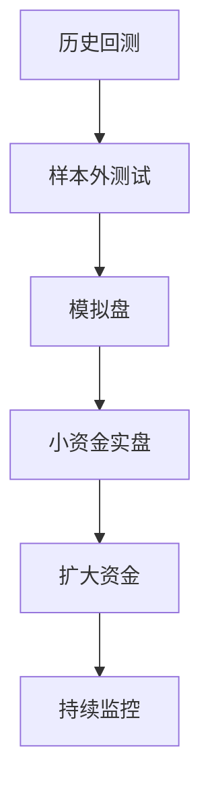

# 回测方法论

> [!note] 核心问题
> 回测是用历史数据检验策略规则，但它不是赚钱证明。回测最大的价值不是让曲线变漂亮，而是尽早发现策略是否依赖未来信息、数据偏差、过拟合或不现实的交易假设。

## 学习目标

读完这篇，你要能做到：

1. 理解完整回测流程：数据、信号、交易、组合、绩效。
2. 识别幸存者偏差、前视偏差、过拟合、成本低估等常见陷阱。
3. 知道如何设置交易成本、涨跌停、停牌、T+1 等真实约束。
4. 用收益、回撤、夏普、换手、稳定性等指标评价策略。
5. 理解从回测到实盘需要样本外、模拟盘和小资金验证。

## 回测的正确心态

错误心态：

> 我想证明这个策略能赚钱。

正确心态：

> 我想尽可能找出这个策略为什么可能亏钱。

回测越严苛，结果越有参考价值。宽松假设下的高收益，往往只是在历史数据里自我安慰。

## 回测流程

## 一、策略假设

回测前先写清楚策略为什么可能有效。

好的假设：

- 低估值且现金流好的公司可能被市场低估；
- 强动量资产短期可能因资金流继续上涨；
- 短期过度下跌的指数 ETF 可能均值回归。

差的假设：

- 我试了很多指标，这个组合收益最高；
- 参数 17 和 43 的均线最好；
- 过去 3 年涨得很顺，所以继续用。

没有经济逻辑的策略，即使回测好，也很难有信心实盘坚持。

## 二、数据准备

### 数据范围

| 项目 | 要明确 |
|---|---|
| 股票池 | 全市场、指数成分、行业池 |
| 时间范围 | 是否覆盖牛市、熊市、震荡市 |
| 数据频率 | 日线、分钟线、月度财报 |
| 复权方式 | 前复权、后复权、不复权 |
| 财报时间 | 使用公告日而不是报告期结束日 |

### 数据质量检查

- 是否包含退市股票；
- 是否有停牌和涨跌停信息；
- 是否有异常价格；
- 财报字段口径是否一致；
- 指数成分是否使用历史成分，而不是当前成分。

## 三、信号生成

信号必须只使用当时能知道的信息。

例子：

- 不能在 4 月 1 日使用 4 月 30 日才公布的年报；
- 不能用全样本均值和标准差给过去做标准化；
- 不能用当前指数成分回测十年前策略；
- 不能用未来最高价或最低价决定今天买卖。

> [!warning] 前视偏差
> 前视偏差是回测中最致命的问题之一。它会让策略看起来像有预知能力，实盘后立刻失效。

## 四、模拟交易

真实交易不是信号一出现就以理想价格成交。

### 必须考虑的约束

| 约束 | 回测里怎么处理 |
|---|---|
| 佣金 | 买卖双边扣除 |
| 印花税 | A 股卖出侧扣除 |
| 滑点 | 成交价相对信号价偏移 |
| 涨停 | 涨停可能买不进 |
| 跌停 | 跌停可能卖不出 |
| 停牌 | 停牌期间不能交易 |
| T+1 | 当日买入不能当日卖出 |
| 流动性 | 成交额太小不能假设无限成交 |

交易越频繁，这些约束越重要。

### 成本的直觉

如果策略每月换手 100%，单次买卖综合成本假设 0.15%，一年成本可能接近 3%-4% 甚至更高。很多策略的超额收益就是这样被吃掉的。

## 五、组合更新

回测不是只算单只股票信号，还要处理组合层面：

- 单票最大权重；
- 行业最大权重；
- 现金闲置；
- 分红处理；
- 调仓失败；
- 资金不足；
- 持仓停牌；
- 新股和退市。

组合规则越接近实盘，回测可信度越高。

## 六、绩效评估

### 收益指标

| 指标 | 含义 |
|---|---|
| 累计收益 | 整个回测期赚了多少 |
| 年化收益 | 折算成年收益 |
| 超额收益 | 相对基准多赚多少 |
| 月度胜率 | 有多少月份为正收益 |

### 风险指标

| 指标 | 含义 |
|---|---|
| 年化波动率 | 收益波动大小 |
| 最大回撤 | 从高点到低点的最大跌幅 |
| 下行波动率 | 只看负收益波动 |
| VaR/CVaR | 极端损失估计 |

### 风险调整收益

| 指标 | 公式直觉 | 用途 |
|---|---|---|
| 夏普比率 | 超额收益 / 波动 | 衡量单位波动收益 |
| Calmar | 年化收益 / 最大回撤 | 更关注回撤 |
| 信息比率 | 超额收益 / 跟踪误差 | 主动策略常用 |

不要只看年化收益。一个年化 30%、最大回撤 70% 的策略，可能很难真实执行。

## 七大回测陷阱

### 1. 幸存者偏差

只使用当前还存在的股票，等于提前知道哪些公司没有退市。

应对：使用历史股票池，包含退市和曾经被剔除的标的。

### 2. 前视偏差

使用当时还不存在的数据。

应对：所有数据必须按真实可获得时间进入模型。

### 3. 过拟合

不断调参数直到历史表现完美。

应对：

- 参数尽量少；
- 做样本内和样本外；
- 看参数附近区域是否稳定；
- 先有逻辑，再做优化。

### 4. 数据挖掘偏差

测试很多策略后，只展示成功的那个。

应对：记录所有尝试，不只记录成功版本。

### 5. 忽略交易成本

高换手策略如果不扣成本，结果几乎没有意义。

应对：成本假设宁可保守，不要乐观。

### 6. 流动性幻觉

假设任何金额都能按收盘价成交。

应对：限制单日成交量占比，过滤低流动性标的。

### 7. 回测期太短

只覆盖牛市，任何策略都可能好看。

应对：至少覆盖完整牛熊周期，最好跨多种市场环境。

## 稳健性检验

一个策略初步有效后，还要做：

| 检验 | 目的 |
|---|---|
| 样本外测试 | 看未参与调参的数据是否有效 |
| 滚动窗口测试 | 看不同年份是否稳定 |
| 参数敏感性 | 看参数微调是否导致结果崩溃 |
| 分市场环境 | 牛市、熊市、震荡市分别表现 |
| 分行业/市值 | 看收益是否来自单一暴露 |
| 成本压力测试 | 提高成本后是否仍有收益 |

真正稳健的策略，不应该只在一个参数、一个时期、一个市场状态下有效。

## 从回测到实盘

### 每一步要看什么

| 阶段 | 目标 |
|---|---|
| 样本外测试 | 检验过拟合 |
| 模拟盘 | 检验数据、信号、执行流程 |
| 小资金实盘 | 检验真实成本和心理承受 |
| 扩大资金 | 检验容量和流动性 |
| 持续监控 | 识别策略衰减 |

不要从漂亮回测直接跳到大资金实盘。

## 回测报告模板

| 模块 | 内容 |
|---|---|
| 策略假设 | 为什么有效 |
| 数据说明 | 股票池、区间、频率、复权、财报滞后 |
| 交易规则 | 入场、出场、调仓、仓位 |
| 成本假设 | 佣金、印花税、滑点、冲击成本 |
| 绩效指标 | 年化收益、超额、波动、最大回撤、夏普 |
| 稳健性 | 样本外、参数敏感性、分年度 |
| 风险暴露 | 行业、市值、风格、集中度 |
| 失败条件 | 什么情况暂停或废弃策略 |

## 练习：审查一个回测

找一个网上看到的策略回测，回答：

1. 是否说明股票池和回测区间？
2. 是否包含退市股票？
3. 财报数据是否按公告日使用？
4. 是否扣除了真实交易成本？
5. 是否考虑涨跌停、停牌、T+1？
6. 是否展示最大回撤和分年度收益？
7. 是否有样本外测试？

如果这些问题大多没有答案，这个回测只能当灵感，不能当证据。

## 相关概念

[[常见量化策略]] [[因子投资体系]] [[风险管理框架]] [[夏普比率]] [[技术分析入门]]
