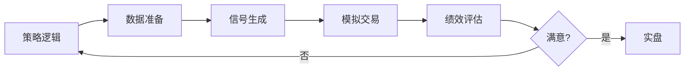

# 回测方法论

> [!note] 💡 概念解析
> 回测就是用历史数据模拟策略的表现——"如果 5 年前开始用这个策略，现在会赚多少？" 它是量化投资的核心验证环节，但也是最容易"自欺欺人"的环节。

## 回测流程

## 回测要素

### 1. 数据准备
- 股票池（全市场 or 特定指数成分股）
- 时间范围（至少覆盖牛熊完整周期）
- 复权处理（前复权 vs 后复权）
- 停牌处理（剔除 or 延续前价）

### 2. 信号生成
- 每只股票每天生成买入/持有/卖出信号
- 注意：**不能用未来信息！**（如用年报数据需延迟到实际发布日期）

### 3. 模拟交易
- 初始资金、单票仓位上限
- 手续费：A 股约 0.025%（佣金）+ 0.1%（印花税卖出）
- 滑点：成交价与信号价的偏差
- 涨跌停不可交易
- T+1 规则

### 4. 绩效评估
- 年化收益率（CAGR）
- 最大回撤（MDD）
- 夏普比率
- 胜率 + 盈亏比
- Alpha / Beta

## 回测的七大陷阱

### 陷阱 1：幸存者偏差
> [!warning] 最隐蔽的陷阱
> 如果只用当前还在交易的股票回测，等于假设你提前知道哪些公司没退市——严重高估收益。

**应对**：使用当时的成分股列表，包含已退市的股票。

### 陷阱 2：前视偏差
在回测时使用了当时还不存在的数据。

**例子**：用 2020 年的行业分类来回测 2015 年的策略。

**应对**：所有数据取"时点快照"——每个交易日只能用该日之前公布的数据。

### 陷阱 3：过拟合
> [!important] 最常见的错误
> 不断调整参数直到回测完美，但策略对样本外的数据无效。

**检测方法**：
- 样本内（70%）训练，样本外（30%）验证
- 参数越少越好——好的策略对参数不敏感
- 如果在 ±10% 参数范围内策略收益剧烈波动 → 过拟合

### 陷阱 4：忽略交易成本
- A 股印花税 0.05%（卖出单向）
- 佣金约 0.025%
- 滑点（大资金冲击成本）
- **高频策略更要重视——每月换仓 2 次，一年交易成本可能超过 5%**

### 陷阱 5：回测期太短
- 至少包含一个完整牛熊周期（A 股约 5-7 年）
- 如果只在牛市中回测 → 任何策略都赚钱

### 陷阱 6：使用收盘价成交
- A 股有涨跌停制度，涨停无法买入、跌停无法卖出
- 需判断：涨停不买入，跌停不卖出

### 陷阱 7：未来函数
- 用全样本标准化（Z-score 用全部数据算均值和标准差）
- 实盘中只有到当前日期的数据

## 常用回测框架

| 框架 | 语言 | 特点 | 适合 |
|---|---|---|---|
| Backtrader | Python | 功能全面，社区大 | 中低频策略 |
| Zipline | Python | Quantopian 开源 | 事件驱动回测 |
| VnPy | Python | 国内最流行 | A 股全品种 |
| 聚宽/米筐 | 在线平台 | 数据齐全，上手快 | 新手学习 |

## 从回测到实盘

> [!important] 核心理念
> 回测只能告诉你"如果过去有效，可能未来有效"。实盘前至少要做：
> 1. **样本外测试**：用回测期之后的数据跑一遍
> 2. **纸面交易**：模拟盘跑 1-3 个月
> 3. **小资金实盘**：用总资金的 1-5% 试运行
> 4. **逐步加仓**：策略稳定后再加资金

## 📚 相关概念

[[常见量化策略]] [[因子投资体系]] [[风险管理框架]] [[夏普比率]] [[Python量化]]
