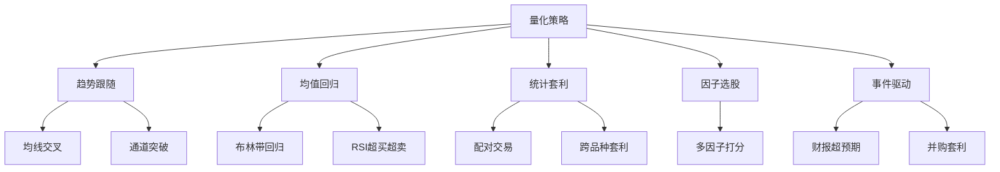

# 常见量化策略

> [!note] 💡 概念解析
> 量化策略就是用代码写成文的交易规则。从最基础的"金叉买入死叉卖出"到复杂的机器学习模型，核心逻辑只有几种：趋势、反转、套利。

## 策略分类总览



## 一、趋势跟随策略

### 逻辑
"趋势是你的朋友"——价格沿原有方向持续的概率大于反转。

### 经典实现：双均线交叉
```python
# 伪代码示意
if MA(短周期) > MA(长周期) and 此前 MA(短) < MA(长):
    买入  # 金叉
if MA(短周期) < MA(长周期) and 此前 MA(短) > MA(长):
    卖出  # 死叉
```

### 优点
- 能抓住大行情（不会错过牛市）
- 简单易懂，适合新手

### 缺点
- 震荡市中频繁假信号（反复亏损）
- 滞后——等信号确认时行情已走了一段

### 改进方向
- 加过滤条件（成交量确认、ADX>25）
- 多时间框架确认

## 二、均值回归策略

### 逻辑
"涨多了会跌，跌多了会涨"——价格最终回归均值。

### 经典实现：布林带策略
```
当价格触及下轨 → 买入（超卖）
当价格回到中轨 → 卖出
```

### 经典实现：RSI 策略
```
当 RSI < 30 → 买入（超卖）
当 RSI > 70 → 卖出（超买）
```

### 优点
- 震荡市中表现好
- 高胜率（小利润多次累计）

### 缺点
- 趋势市中逆势交易容易巨亏
- 需要止损配合

## 三、统计套利：配对交易

### 逻辑
两只高度相关的股票，价差偏离历史均值后终将回归。

### 经典案例
- 茅台 vs 五粮液
- 招商银行 vs 兴业银行
- 工商银行 vs 建设银行

### 步骤
1. 找到两只协整的股票（价差稳定）
2. 价差扩大 → 买入弱势股，卖空强势股
3. 价差回归 → 平仓

### 关键概念：协整
> 相关性 ≠ 协整。两只股票可以高度相关但价差不断扩大（如都涨但一个涨更快）。协整要求价差是平稳的——长期均值为 0。

## 四、多因子选股

### 逻辑
综合多个因子打分，定期买入得分最高的股票。

### 常见因子组合
| 类型 | 示例 |
|---|---|
| 价值 | PE/PB/PS 的倒数（越小越便宜→得分越高）|
| 动量 | 过去 6/12 个月收益 |
| 质量 | ROE/毛利率/负债率 |
| 低波 | 历史波动率倒数 |
| 规模 | 市值倒数 |

### 步骤
1. 每个因子标准化（Z-score）
2. 等权或 ICIR 加权求和
3. 选总分最高的 Top N 只
4. 月度/季度换仓

> [!tip] A 股实践建议
> 起步用最简单的——价值 + 动量双因子。价值因子稳定，动量因子在 A 股表现突出（散户追涨杀跌），两者互补。

## 五、事件驱动策略

### 逻辑
特定事件发生后，市场反应存在规律。

| 事件 | 典型反应 |
|---|---|
| 财报超预期 | 跳空高开后继续上涨（盈余漂移）|
| 大股东增持 | 利好信号，股价短期走强 |
| 分红除权 | 除权日后填权概率高 |
| 指数调整 | 被纳入指数的股票有被动买入 |

## 策略评估维度

| 维度 | 指标 | 优秀标准 |
|---|---|---|
| 年化收益 | CAGR | > 基准 + 3% |
| 风险 | 最大回撤 | < 20% |
| 风险调整收益 | 夏普比率 | > 1.0 |
| 胜率 | 盈利交易比例 | 不绝对，均值回归 > 50%, 趋势 < 50% |
| 盈亏比 | 平均盈利/平均亏损 | > 1.5 |

## 📚 相关概念

[[因子投资体系]] [[回测方法论]] [[技术分析入门]] [[风险管理框架]] [[均值回归]] [[动量效应]]
