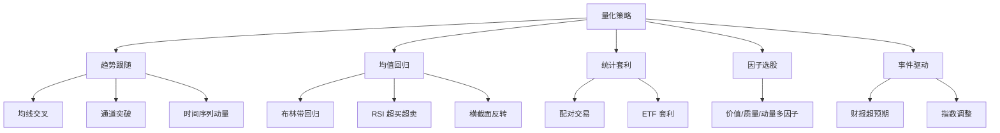

# 常见量化策略

> [!note] 核心问题
> 量化策略不是一堆神秘公式，而是把市场规律写成可执行规则。大多数策略都可以归入几类：趋势跟随、均值回归、统计套利、因子选股、事件驱动。理解每类策略适合什么环境，比记住某个指标更重要。

## 学习目标

读完这篇，你要能做到：

1. 区分趋势、反转、套利、因子、事件驱动的基本逻辑。
2. 知道每类策略的收益来源和失效环境。
3. 理解策略必须包含入场、出场、仓位、成本和风控。
4. 避免把单个技术指标误认为完整交易系统。
5. 能为一个简单策略写出清晰规则。

## 策略分类总览



策略没有绝对好坏，只有适用环境和风险边界。

## 一、趋势跟随策略

### 核心逻辑

趋势跟随相信：价格一旦形成方向，可能因资金流、信息扩散和行为惯性继续运行。

简单说：涨了还可能继续涨，跌了还可能继续跌。

### 常见实现

#### 双均线策略

```text
如果短期均线上穿长期均线，买入或持有；
如果短期均线下穿长期均线，卖出或降低仓位。
```

#### 通道突破策略

```text
如果价格突破过去 N 日最高价，买入；
如果价格跌破过去 N 日最低价，卖出。
```

#### 时间序列动量

```text
如果过去 12 个月收益为正，持有；
如果过去 12 个月收益为负，空仓或配置现金。
```

### 适合环境

- 单边上涨或下跌；
- 趋势持续时间较长；
- 市场情绪有惯性；
- 宏观或行业出现持续变化。

### 主要风险

| 风险 | 表现 |
|---|---|
| 震荡亏损 | 来回金叉死叉，频繁小亏 |
| 信号滞后 | 确认趋势时已经涨了一段 |
| 突然反转 | 趋势结束时回吐利润 |
| 交易成本 | 高频调仓会吃掉收益 |

趋势策略通常胜率不高，但靠少数大趋势贡献主要收益。不能用“每次都对”的标准评价它。

## 二、均值回归策略

### 核心逻辑

均值回归相信：价格短期偏离合理范围后，会向均值回归。

简单说：涨多了可能回落，跌多了可能反弹。

### 常见实现

#### 布林带策略

```text
价格跌破下轨，认为短期超卖；
价格回到中轨，止盈或平仓。
```

#### RSI 策略

```text
RSI < 30，认为超卖；
RSI > 70，认为超买。
```

#### 横截面反转

在同一股票池中，买入短期跌幅最大的股票，卖出或回避短期涨幅最大的股票。

### 适合环境

- 震荡市场；
- 资产有稳定估值锚；
- 市场短期过度反应；
- 流动性较好。

### 主要风险

| 风险 | 表现 |
|---|---|
| 接飞刀 | 下跌不是超卖，而是基本面恶化 |
| 单边趋势 | 越跌越买导致大亏 |
| 均值变化 | 历史均值不再有效 |
| 流动性风险 | 暴跌时无法按预期退出 |

均值回归策略必须有止损或仓位上限，否则一次趋势行情就可能吞掉大量小盈利。

## 三、统计套利：配对交易

### 核心逻辑

两只资产如果长期关系稳定，短期价差偏离后可能回归。

例子：

- 同行业龙头与次龙头；
- 两只银行股；
- 同一指数的 ETF 和期货；
- A/H 股价差。

### 基本流程

1. 选择有经济联系的资产对。
2. 检验价差或比值是否稳定。
3. 价差扩大到阈值，买入相对便宜的一边，卖出相对昂贵的一边。
4. 价差回归后平仓。

### 相关性和协整的区别

相关性只说明两个资产同向波动，协整更强调长期价差稳定。

两只股票可能高度相关，但一个长期涨得更多，价差不断扩大。这种情况下做回归交易会很危险。

### 主要风险

- 关系破裂：公司基本面或行业结构变化；
- 做空限制：A 股做空工具有限；
- 交易成本：双边交易成本更高；
- 拥挤交易：很多资金做同一对价差；
- 极端行情：价差偏离可能远超历史区间。

## 四、多因子选股

### 核心逻辑

用多个因子给股票打分，定期买入综合得分高的股票。

常见因子：

| 因子 | 示例指标 | 逻辑 |
|---|---|---|
| 价值 | PE、PB、FCF Yield | 买便宜 |
| 质量 | ROE、现金流、低负债 | 买好公司 |
| 动量 | 过去 6-12 个月收益 | 买趋势强 |
| 低波 | 波动率、Beta | 买稳健 |
| 规模 | 市值 | 捕捉小盘溢价 |

### 基本步骤

1. 定义股票池，例如沪深 300、中证 500 或全 A 非 ST。
2. 计算每个因子。
3. 去极值、标准化、行业中性。
4. 合成总分。
5. 选择 Top N 股票。
6. 月度或季度调仓。
7. 加入成本、停牌、涨跌停限制回测。

多因子策略的优势是系统化、覆盖广；风险是因子失效、拥挤和数据处理错误。

## 五、事件驱动策略

### 核心逻辑

特定事件发生后，市场反应可能存在规律。

| 事件 | 可能逻辑 | 风险 |
|---|---|---|
| 财报超预期 | 信息逐步被市场消化 | 预期定义困难 |
| 分红或回购 | 传递现金流和管理层信号 | 可能只是短期刺激 |
| 指数纳入 | 被动资金买入 | 事件前可能已被交易 |
| 并购重组 | 估值重估或协同效应 | 失败概率和监管风险 |
| 解禁 | 供给增加 | 市场可能提前反应 |

事件驱动策略的难点在于事件定义、公告时间、预期差和可交易性。

## 一个完整策略必须包含什么

| 模块 | 要写清楚的问题 |
|---|---|
| 策略假设 | 为什么这个规律可能存在 |
| 标的池 | 交易哪些资产，排除哪些资产 |
| 入场规则 | 什么条件买入 |
| 出场规则 | 什么条件卖出 |
| 调仓频率 | 多久检查和调仓 |
| 仓位规则 | 每个标的买多少 |
| 成本假设 | 佣金、印花税、滑点 |
| 风控规则 | 最大回撤、单票上限、止损 |
| 评估指标 | 年化收益、夏普、回撤、换手 |

没有这些模块，策略只是一个想法。

## 策略适用环境对比

| 策略 | 适合环境 | 最怕环境 |
|---|---|---|
| 趋势跟随 | 单边趋势 | 窄幅震荡 |
| 均值回归 | 区间震荡 | 单边下跌或上涨 |
| 配对交易 | 稳定关系、价差波动 | 关系破裂 |
| 多因子选股 | 因子有效、分散持仓 | 因子拥挤和风格切换 |
| 事件驱动 | 事件有稳定行为模式 | 事件被提前定价 |

策略组合的意义，是让不同策略在不同环境下互补。

## 策略评估维度

| 维度 | 指标 | 说明 |
|---|---|---|
| 收益 | 年化收益、超额收益 | 是否跑赢基准 |
| 风险 | 最大回撤、波动率 | 是否能承受 |
| 风险调整收益 | 夏普、Calmar | 承担风险是否值得 |
| 稳定性 | 月度胜率、滚动收益 | 是否只靠少数年份 |
| 成本 | 换手率、交易费用 | 毛收益能否保留下来 |
| 容量 | 成交额、冲击成本 | 资金变大后是否还能做 |

回测收益高但回撤巨大、换手极高、容量很小的策略，实用价值有限。

## 常见误区

| 误区 | 更好的理解 |
|---|---|
| 指标金叉就是策略 | 策略还需要仓位、出场和风控 |
| 胜率高就是好策略 | 盈亏比差也会亏钱 |
| 回测曲线越平滑越好 | 可能是过拟合或数据错误 |
| 策略复杂才专业 | 简单稳健的规则更容易长期执行 |
| 找到一个策略就够了 | 策略会周期性失效，需要组合和监控 |

## 练习：写一个双均线策略说明

不要写代码，先写规则：

| 模块 | 内容 |
|---|---|
| 标的 | 例如沪深 300 ETF |
| 入场 | MA20 上穿 MA60 |
| 出场 | MA20 下穿 MA60 |
| 仓位 | 满仓、半仓还是波动率调整 |
| 成本 | 佣金、滑点 |
| 风控 | 最大回撤超过多少暂停 |
| 评估 | 与买入持有比较 |

如果规则写完后发现很多细节说不清，说明还不适合回测。

## 相关概念

[[因子投资体系]] [[回测方法论]] [[技术分析入门]] [[风险管理框架]] [[均值回归_Mean Reversion|均值回归]] [[动量投资_Momentum Investing|动量投资]]
