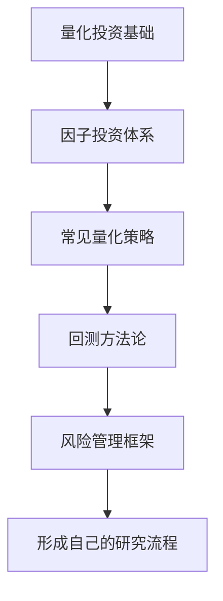

# 阶段三：量化思维与系统化投资

> [!note] 核心问题
> 阶段三要把投资从“我觉得”升级为“我能验证”。量化不只是写代码交易，更重要的是用数据、规则、回测和风险管理，把投资想法变成可以复盘、比较和改进的系统。

## 本阶段学什么

学完阶段二后，你已经能读公司、看估值、理解市场环境。阶段三进一步训练系统化思维：

1. 把投资观点写成明确规则；
2. 用数据检验规则是否曾经有效；
3. 识别回测里的自欺欺人；
4. 用风险管理控制策略失败时的损失；
5. 从单次判断转向可重复流程。

量化的核心不是复杂模型，而是“可验证”。

## 学习路径

## 核心笔记

| 笔记 | 解决的问题 | 学完后的能力 |
|---|---|---|
| [[量化投资基础]] | 什么是量化思维？ | 能把主观观点转成规则和数据问题 |
| [[因子投资体系]] | 什么特征能解释收益差异？ | 能理解价值、动量、质量、低波、规模等因子 |
| [[常见量化策略]] | 策略有哪些基本类型？ | 能区分趋势、均值回归、统计套利、多因子 |
| [[回测方法论]] | 如何验证策略？ | 能识别幸存者偏差、前视偏差、过拟合 |
| [[风险管理框架]] | 策略错了怎么办？ | 能设置仓位、回撤、止损、压力测试规则 |

## 推荐学习顺序

### 阶段 1：理解量化不是玄学

读 [[量化投资基础]]，重点理解：

- 量化是规则化和验证，不等于高频交易；
- 数据、模型、执行和风控缺一不可；
- Alpha 很难稳定获得，Beta 更便宜可靠；
- 个人投资者更适合低频、透明、可解释策略。

### 阶段 2：学习因子语言

读 [[因子投资体系]]，把阶段二的基本面知识量化成特征：

- 价值：便宜是否有回报；
- 动量：趋势是否会延续；
- 质量：好公司是否长期更强；
- 低波：低风险资产为何可能有更好风险调整收益；
- 规模：小公司是否有额外风险溢价。

### 阶段 3：认识常见策略

读 [[常见量化策略]]，理解不同策略适合不同市场状态：

- 趋势策略怕震荡；
- 均值回归怕单边趋势；
- 配对交易怕关系破裂；
- 多因子策略怕因子拥挤和失效；
- 事件驱动怕概率估计错误。

### 阶段 4：严肃对待回测

读 [[回测方法论]]。回测不是证明自己正确，而是尽量发现策略哪里可能错。

重点关注：

- 数据是否真实可获得；
- 是否用了未来信息；
- 交易成本是否充分；
- 样本外是否仍然有效；
- 参数是否过拟合。

### 阶段 5：先活下来

读 [[风险管理框架]]。策略收益可以不稳定，但风险边界必须清楚。

你要知道：

- 最大回撤比年化收益更影响执行；
- 仓位管理决定错误能否承受；
- 杠杆会放大收益，也会放大死亡速度；
- 压力测试比漂亮回测更重要。

## 阶段三最小研究流程

示例假设：

> 低估值且盈利质量高的股票，长期可能跑赢市场。

要把它变成策略，需要明确：

- 低估值用 PE、PB、FCF Yield 还是组合指标；
- 盈利质量用 ROE、毛利率、现金流还是应计利润；
- 股票池是什么；
- 多久调仓；
- 每只股票买多少；
- 交易成本如何估计；
- 何时停止策略。

## 完成阶段三后的能力标准

完成本阶段后，你应该能够：

1. 把一个投资想法拆成数据、规则、信号、仓位、交易、风控六部分。
2. 理解主要因子的含义、收益来源和失效风险。
3. 知道常见量化策略的适用环境和主要风险。
4. 能判断一个回测结果是否可能存在明显偏差。
5. 能为策略设置最大回撤、仓位上限、止损和复盘机制。

## 阶段三实战作业

任选一个简单策略，写一页研究计划：

| 模块 | 你要写下来的内容 |
|---|---|
| 策略假设 | 为什么这个规律可能存在 |
| 股票池/资产池 | 用哪些标的测试 |
| 信号规则 | 什么时候买，什么时候卖 |
| 调仓频率 | 日、周、月、季 |
| 仓位规则 | 等权、因子加权、风险平价等 |
| 成本假设 | 佣金、印花税、滑点 |
| 风险指标 | 最大回撤、波动率、夏普、胜率 |
| 失败条件 | 什么情况说明策略需要停止 |

如果这张表写不清，说明还不适合写代码回测。

## 相关概念

[[估值方法入门]] [[技术分析入门]] [[夏普比率]] [[资产配置入门]] [[回测方法论]] [[风险管理框架]]
