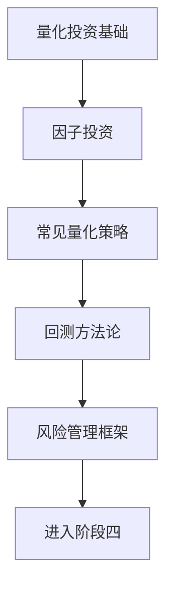

# 阶段三：量化思维与系统化投资

> [!note] 💡 概念解析
> 阶段三是投资学习的"升级"——从"凭感觉投资"到"用数据和规则投资"。量化不是神秘的高频交易，而是用科学方法把投资决策变成可重复、可验证的系统。

## 学习路径

## 核心笔记

- [[量化投资基础]] — 什么是量化？为什么需要量化思维？
- [[因子投资体系]] — 五大因子（价值/动量/质量/低波/规模）及因子构建
- [[常见量化策略]] — 均线/动量/均值回归/配对交易/多因子选股
- [[回测方法论]] — 如何验证策略是否有效？回测的常见陷阱
- [[风险管理框架]] — VaR/CVaR/最大回撤/夏普比率/仓位管理

## 学习目标

完成阶段三后，你应该能够：
1. 理解量化投资的核心理念和与传统投资的区别
2. 掌握因子投资的五大因子及构建方法
3. 了解常见量化策略的原理和适用场景
4. 学会回测的基本流程和避免常见陷阱
5. 建立基本的风险管理框架

## 📚 相关概念

[[估值方法入门]] [[技术分析入门]] [[夏普比率]] [[资产配置入门]] [[Python量化]]
