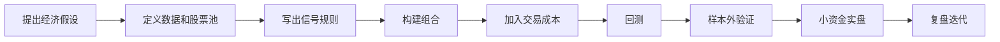

# 量化投资基础

> [!note] 核心问题
> 量化投资不是“用复杂模型预测市场”，而是把投资想法写成清晰规则，再用数据验证、执行和复盘。它的核心价值是减少情绪干扰、提高覆盖范围、让策略可以被检验。

## 学习目标

读完这篇，你要能做到：

1. 理解量化投资和传统主观投资的区别。
2. 知道量化系统由数据、信号、组合、执行、风控组成。
3. 区分 Alpha 和 Beta。
4. 明白个人投资者更适合低频、透明、可解释的量化方法。
5. 了解量化投资的主要风险：过拟合、数据质量、因子衰减、执行成本。

## 什么是量化投资

量化投资可以拆成一句话：

> 用明确规则处理数据，并根据规则进行投资决策。

例如一个主观判断是：

> 我想买便宜且质量好的公司。

量化表达需要变成：

- 便宜：PE、PB、FCF Yield 排名前 30%；
- 质量好：ROE、毛利率、经营现金流 / 净利润排名前 30%；
- 股票池：沪深 300 或全 A 非 ST；
- 调仓：每月一次；
- 仓位：等权或按得分加权；
- 风控：单票不超过 5%，行业不超过 25%。

只要规则清楚，就可以回测、复盘和改进。

## 量化 vs 传统投资

| 维度 | 传统主观投资 | 量化投资 |
|---|---|---|
| 决策方式 | 研究员判断、经验、直觉 | 数据、规则、模型 |
| 覆盖范围 | 深度研究少数公司 | 可覆盖大量标的 |
| 可验证性 | 事后复盘较难 | 可用历史数据回测 |
| 情绪影响 | 容易受恐惧和贪婪影响 | 规则执行可降低情绪干扰 |
| 优势 | 深度理解商业模式 | 广度、纪律、可重复 |
| 风险 | 主观偏误、样本少 | 过拟合、数据问题、模型失效 |

两者不是对立。优秀的量化策略往往来自清晰的经济逻辑，而不是盲目挖数据。

## 量化系统的五个模块

### 1. 数据

数据是策略的原材料。

| 数据类型 | 示例 | 常见问题 |
|---|---|---|
| 行情数据 | 开盘、最高、最低、收盘、成交量 | 复权、停牌、异常价格 |
| 基本面数据 | 财报、估值、盈利能力、负债 | 公告滞后、口径变化 |
| 宏观数据 | 利率、通胀、PMI、社融 | 发布频率低、修正 |
| 另类数据 | 新闻、舆情、搜索、卫星图像 | 噪音大、清洗难 |

量化里有一句老话：Garbage in, garbage out。数据错了，模型再漂亮也没有意义。

### 2. 信号

信号回答“什么时候买、卖或调仓”。

常见信号：

- 价值信号：估值低；
- 动量信号：过去一段时间表现强；
- 质量信号：ROE 高、现金流好；
- 低波信号：波动率低；
- 技术信号：均线突破、RSI 超卖；
- 事件信号：财报超预期、指数纳入。

好的信号需要有经济逻辑，而不是只在历史数据里偶然有效。

### 3. 组合构建

组合构建回答“买多少”。

常见方法：

| 方法 | 做法 | 优缺点 |
|---|---|---|
| 等权 | 每个标的买同样金额 | 简单，容易执行 |
| 市值加权 | 按市值分配权重 | 接近指数，偏大盘 |
| 因子加权 | 分数越高权重越大 | 更积极，但可能集中 |
| 风险平价 | 按风险贡献分配 | 稳健，但计算更复杂 |
| 约束优化 | 加行业、个股、风格限制 | 专业，但容易过度工程化 |

新手优先从等权开始。复杂权重方法只有在明确解决问题时才值得使用。

### 4. 交易执行

执行回答“规则能不能真实成交”。

要考虑：

- 佣金和印花税；
- 买卖价差；
- 滑点；
- 涨跌停；
- 停牌；
- 流动性；
- T+1 限制。

回测里能按收盘价成交，不代表实盘能做到。

### 5. 风险管理

风控回答“策略错了怎么办”。

包括：

- 单票上限；
- 行业上限；
- 最大回撤阈值；
- 杠杆限制；
- 止损或降仓规则；
- 压力测试；
- 策略暂停条件。

没有风控的量化模型，只是自动化冒险。

## Alpha 与 Beta

| 概念 | 含义 | 获取方式 |
|---|---|---|
| Beta | 市场整体收益 | 买宽基指数、承担系统性风险 |
| Alpha | 超越市场的收益 | 策略、选股、择时、结构性优势 |

$$
总收益 = Beta + Alpha
$$

对个人投资者很重要的一点：Beta 便宜、透明、容易获得；Alpha 稀缺、不稳定、成本更高。

所以更现实的目标是：

1. 用低成本指数获取可靠 Beta；
2. 用小比例学习仓研究 Alpha；
3. 不要为了追求 Alpha 破坏整体资产配置。

## 量化投资按频率分类

| 类型 | 持仓时间 | 数据要求 | 个人投资者适合度 |
|---|---|---|---|
| 高频交易 | 毫秒到分钟 | 极高，低延迟 | 很低 |
| 日内交易 | 分钟到小时 | 高，执行要求高 | 较低 |
| 中频策略 | 天到周 | 中等 | 一般 |
| 低频策略 | 月到季 | 可承受 | 较高 |
| 资产配置 | 季到年 | 较低 | 很高 |

个人投资者优先学习低频策略和资产配置量化，因为交易成本、数据质量和执行压力更可控。

## 量化投资的工作流程

其中最容易出问题的是回测环节。漂亮曲线不等于可赚钱策略，详见 [[回测方法论]]。

## 量化投资的主要风险

### 1. 过拟合

策略在历史数据上表现很好，但只是记住了过去噪音，未来无效。

信号：

- 参数非常多；
- 换一个时间段就失效；
- 交易逻辑缺乏经济解释；
- 只展示最优结果，不展示失败版本。

### 2. 数据挖掘偏差

测试了上百个想法，总会有几个看起来有效。问题是这些“有效”可能只是偶然。

### 3. 因子衰减

一个因子被越来越多人使用后，超额收益可能下降，拥挤时还可能集体回撤。

### 4. 交易成本

换手越高，成本越重要。很多策略毛收益不错，扣掉成本后就没有 Alpha。

### 5. 模型失效

市场结构会变化。注册制、涨跌停制度、资金结构、监管政策、交易拥挤程度都会影响策略。

## 个人投资者学习路线

1. 先学 [[资产配置入门]] 和指数投资，建立 Beta 底仓。
2. 学会用 Excel 或 Python 处理基础行情数据。
3. 从最简单的均线、动量、价值因子开始。
4. 学 [[回测方法论]]，理解常见陷阱。
5. 学 [[风险管理框架]]，先控制亏损。
6. 小资金实盘验证，不要直接大额投入。

## 常见误区

| 误区 | 更好的理解 |
|---|---|
| 量化就是高频交易 | 低频资产配置和因子投资也属于量化 |
| 模型越复杂越好 | 可解释、稳健、低成本更重要 |
| 回测收益高就能实盘赚钱 | 回测可能有偏差和过拟合 |
| 机器能消灭风险 | 机器只是按规则执行，规则错了会更快亏 |
| 有代码就专业 | 经济逻辑、数据质量、风控比代码更重要 |

## 练习：把主观想法量化

选择一个投资观点，填表：

| 模块 | 你的定义 |
|---|---|
| 投资假设 |  |
| 可用数据 |  |
| 买入规则 |  |
| 卖出/调仓规则 |  |
| 仓位规则 |  |
| 成本假设 |  |
| 风险控制 |  |
| 如何判断失败 |  |

如果每一格都能写清楚，你就已经迈入量化思维。

## 相关概念

[[因子投资体系]] [[常见量化策略]] [[回测方法论]] [[风险管理框架]] [[技术分析入门]]
