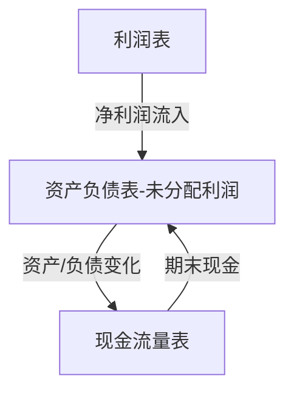

# 三张财务报表

> [!note] 💡 概念解析
> 三张财务报表是上市公司的"体检报告"——资产负债表告诉你公司有什么，利润表告诉你公司赚了多少，现金流量表告诉你钱真正流向了哪里。三张表必须一起看，缺一不可。

## 一、资产负债表

### 核心公式

$$
资产 = 负债 + 所有者权益
$$

> [!tip] 记忆诀窍
> 等式永远成立。资产 = 钱去哪了，负债 + 权益 = 钱从哪来。

### 资产端：钱去哪了

| 类别 | 内容 | 关键指标 |
|---|---|---|
| 流动资产 | 现金、应收账款、存货 | 变现能力 |
| 非流动资产 | 固定资产、无形资产、商誉 | 长期价值 |

### 负债端：借了多少钱

| 类别 | 内容 | 关注点 |
|---|---|---|
| 流动负债 | 短期借款、应付账款 | 短期偿债压力 |
| 非流动负债 | 长期借款、应付债券 | 长期财务结构 |

### 所有者权益：真正属于股东的

- 股本 + 资本公积 + 盈余公积 + 未分配利润

## 二、利润表

### 核心公式

$$
净利润 = 营业收入 - 营业成本 - 费用 - 税费
$$

### 关键科目

| 科目 | 含义 | 重要性 |
|---|---|---|
| 营业收入 | 卖东西收到的钱 | ⭐⭐⭐ |
| 营业成本 | 生产产品的直接成本 | ⭐⭐⭐ |
| **毛利** | 收入 - 成本，核心盈利能力 | ⭐⭐⭐⭐⭐ |
| 三费 | 销售费 + 管理费 + 财务费 | ⭐⭐ |
| 营业利润 | 主营业务的真实利润 | ⭐⭐⭐⭐ |
| **净利润** | 最终落到股东口袋的钱 | ⭐⭐⭐⭐⭐ |

> [!tip] 关键洞察
> 看利润表最重要的是看**趋势**而非绝对值。连续 3-5 年收入和利润是否稳步增长？毛利率是否稳定或提升？

## 三、现金流量表

### 核心公式

$$
现金净流量 = 经营活动现金流 + 投资活动现金流 + 筹资活动现金流
$$

### 三部分含义

| 类别 | 含义 | 优质公司特征 |
|---|---|---|
| 经营活动 | 卖产品/服务收到的现金 | 持续为正且增长 |
| 投资活动 | 买设备/建厂房/对外投资 | 适度为负（在扩张） |
| 筹资活动 | 借款/发股/分红/还债 | 分红 > 融资 |

> [!important] 核心认知
> **利润是"算"出来的，现金流是"收"到的。** 很多公司利润表很好看但现金流枯竭——这就是"纸面利润"。
>
> 黄金法则：经营现金流 > 净利润 > 0，才是真正的健康状态。

## 三张表的关系

## 新手速查

| 问题 | 看哪张表 | 看什么 |
|---|---|---|
| 公司赚钱吗？ | 利润表 | 净利润、毛利率 |
| 公司安全吗？ | 资产负债表 | 负债率、流动比率 |
| 公司的钱是真的吗？ | 现金流量表 | 经营现金流 vs 净利润 |
| 公司成长性如何？ | 三张表一起 | 收入增速、利润增速、现金流增速 |

## 常见造假信号

- 净利润大增但经营现金流为负（虚增收入）
- 应收账款增速远超收入增速（赊销充收入）
- 存货异常增加（滞销或虚增资产）
- 频繁变更会计师事务所

## 📚 相关概念

[[财务比率分析]] [[杜邦分析法]] [[估值方法入门]] [[自由现金流]]
