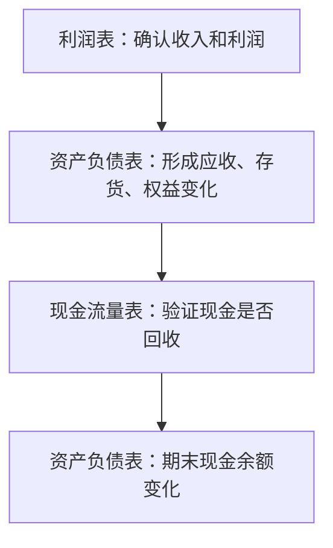

# 三张财务报表

> [!note] 核心问题
> 三张财务报表是理解公司的入口。资产负债表告诉你公司有什么、欠什么；利润表告诉你一段时间内赚了多少；现金流量表告诉你钱有没有真正进来。投资分析不能只看利润，因为利润可以被会计规则影响，现金流和资产质量才会暴露更多真实情况。

## 学习目标

读完这篇，你要能做到：

1. 说清楚三张表分别回答什么问题。
2. 理解“利润不等于现金，资产不等于价值”。
3. 找出资产、负债、利润、现金流里最容易出问题的科目。
4. 用一个固定顺序快速扫财报，形成初步判断。

## 三张表分别看什么

| 报表 | 时间视角 | 回答的问题 | 最该关注 |
|---|---|---|---|
| 资产负债表 | 某一天的快照 | 公司有什么，钱从哪来 | 资产质量、负债结构、股东权益 |
| 利润表 | 一段时间的经营结果 | 公司赚了多少，靠什么赚 | 收入质量、毛利率、费用率、净利润 |
| 现金流量表 | 一段时间的现金进出 | 钱有没有真正收到 | 经营现金流、资本开支、融资依赖 |

一句话记忆：

- 资产负债表：公司的“家底”。
- 利润表：公司的“成绩单”。
- 现金流量表：公司的“现金日记账”。

## 先建立三个底层认知

### 认知 1：会计恒等式永远成立

$$
资产 = 负债 + 所有者权益
$$

资产表示钱被放到了哪里，负债和权益表示钱从哪里来。公司借钱买设备，资产和负债同时增加；公司盈利并留下利润，资产和所有者权益同时增加。

### 认知 2：利润可以存在于账上，现金必须进入账户

公司卖出产品后，即使客户还没付款，也可能确认收入和利润；但现金流量表不会骗人，它只记录现金有没有进来。所以分析公司时要反复比较：

$$
经营活动现金流 \quad vs \quad 净利润
$$

长期健康的公司，经营现金流通常应当能够覆盖净利润和日常投资需求。

### 认知 3：资产不一定都值钱

现金和优质金融资产通常最容易变现；应收账款要看能不能收回；存货要看会不会滞销；固定资产要看产能是否有效；商誉要警惕减值风险。报表上的资产金额，不一定等于真实可变现价值。

## 一、资产负债表：看公司家底

资产负债表的核心是判断“资产质量”和“财务安全”。不要只看总资产规模大不大，要看资产是否能产生现金流，负债是否会造成还款压力。

### 资产端：钱放在哪里

| 科目 | 怎么理解 | 重点追问 |
|---|---|---|
| 货币资金 | 手上的现金和银行存款 | 是否足够覆盖短债？有没有受限资金？ |
| 应收账款 | 已确认收入但客户还没付款 | 增速是否远高于收入？坏账计提是否充分？ |
| 存货 | 原材料、在产品、产成品 | 是否积压？是否需要降价销售？ |
| 固定资产 | 厂房、机器、设备 | 是否带来收入增长？折旧压力大不大？ |
| 无形资产 | 专利、软件、土地使用权等 | 是否真正能创造收益？ |
| 商誉 | 并购时支付的溢价 | 并购资产是否达预期？是否可能减值？ |

> [!warning] 资产端常见风险
> 应收账款快速上升，可能说明公司用赊销拉收入；存货快速上升，可能说明产品卖不动；商誉占净资产比例过高，未来一旦减值会直接冲击利润。

### 负债端：钱从哪里来

| 科目 | 怎么理解 | 重点追问 |
|---|---|---|
| 短期借款 | 一年内要还的银行贷款 | 现金是否足够覆盖？是否借新还旧？ |
| 应付账款 | 欠供应商的钱 | 是议价能力强，还是资金紧张？ |
| 合同负债 | 客户先付款，公司以后交货 | 对消费、软件、预收款业务可能是好信号 |
| 长期借款 | 一年以上债务 | 利率、期限、还款压力如何？ |
| 应付债券 | 公司发行的债 | 到期集中度和融资能力如何？ |

短债压力是新手最容易忽略的地方。利润再好，如果短期债务集中到期、现金不足，公司也可能陷入流动性危机。

### 所有者权益：真正属于股东的部分

所有者权益主要包括股本、资本公积、盈余公积和未分配利润。对投资者最重要的是看：

- 未分配利润是否长期增加，说明公司能持续留存收益；
- 净资产是否被大额亏损或商誉减值侵蚀；
- 少数股东权益占比是否过高，避免把不完全属于上市公司股东的利润看成自己的。

## 二、利润表：看公司赚钱能力

利润表从收入开始，一层层扣掉成本、费用、税费，最后得到净利润。读利润表要抓住两条线：收入是否真实增长，利润率是否稳定。

### 从收入到净利润

| 层级 | 公式或含义 | 你要判断什么 |
|---|---|---|
| 营业收入 | 主营业务卖出的金额 | 需求是否增长，是否靠低质量赊销 |
| 营业成本 | 与产品或服务直接相关的成本 | 成本压力是否上升 |
| 毛利 | 营业收入 - 营业成本 | 产品有没有定价权 |
| 销售费用 | 获客、渠道、广告等费用 | 增长是否靠高投入砸出来 |
| 管理费用 | 管理人员、办公、研发外的组织成本 | 规模扩大后费用率能否下降 |
| 研发费用 | 研发投入 | 对科技、医药、制造业很关键 |
| 财务费用 | 利息收入和利息支出 | 债务负担是否过重 |
| 营业利润 | 主营业务为主的经营利润 | 比净利润更能反映持续经营 |
| 净利润 | 扣除税费后的最终利润 | 是否由主营业务支撑 |

### 三个利润率

| 指标 | 公式 | 代表什么 |
|---|---|---|
| 毛利率 | 毛利 / 营业收入 | 产品、品牌、技术或渠道的定价能力 |
| 营业利润率 | 营业利润 / 营业收入 | 主营业务扣除期间费用后的赚钱能力 |
| 净利率 | 净利润 / 营业收入 | 最终留给股东的利润比例 |

毛利率高不一定就是好公司。高毛利如果被销售费用、研发费用或坏账损失吃掉，最后净利率仍然可能很低。低毛利也不一定差，零售、物流等行业可能靠高周转赚钱。

### 利润表里的“质量问题”

| 信号 | 可能含义 |
|---|---|
| 收入增长很快，但应收账款增长更快 | 可能通过放宽信用条件拉收入 |
| 毛利率突然大幅变化 | 产品结构、价格、成本或会计口径可能变化 |
| 净利润增长主要来自投资收益或资产处置 | 主营业务不一定变好 |
| 销售费用率持续上升 | 获客成本变高，增长效率下降 |
| 财务费用快速上升 | 债务负担加重 |

## 三、现金流量表：看钱有没有回来

现金流量表分为经营、投资、筹资三部分。它的意义在于验证利润表：公司说自己赚钱，钱是否真的进来了？

### 三类现金流

| 类别 | 含义 | 常见解读 |
|---|---|---|
| 经营活动现金流 | 日常经营收到和支付的现金 | 优质公司应长期为正，并与净利润匹配 |
| 投资活动现金流 | 买设备、建厂、并购、理财等现金流 | 成长期公司常为负，但要看投向是否有效 |
| 筹资活动现金流 | 借款、发股、还债、分红等现金流 | 长期依赖融资输血要谨慎 |

### 经营现金流与净利润的关系

| 情况 | 初步判断 |
|---|---|
| 经营现金流 > 净利润 > 0 | 利润质量较好，现金回收强 |
| 净利润 > 0，但经营现金流长期为负 | 警惕纸面利润、赊销或存货积压 |
| 经营现金流为正，但净利润为负 | 可能折旧摊销高，也可能处于特殊阶段，需要继续拆 |
| 两者都为负 | 经营压力较大，需要看融资能力和现金储备 |

> [!important] 关键判断
> 利润表回答“赚没赚”，现金流量表回答“钱回没回来”。长期投资更看重后者，因为债务、工资、分红和再投资都需要现金支付。

### 投资现金流不是越高越好

投资活动现金流为负，可能是公司在扩张产能、研发项目、并购资产；这不一定坏。真正要判断的是：

- 投出去的钱未来能否带来收入和现金流；
- 资本开支是否过度激进；
- 并购资产是否形成大量商誉；
- 投资现金流为正是不是靠卖资产维持现金。

### 筹资现金流看融资依赖

筹资现金流持续为正，说明公司不断从外部拿钱，可能是成长需要，也可能是自我造血不足。筹资现金流持续为负，可能是公司在还债、回购、分红，通常说明现金创造能力较强，但也要确认是否影响再投资能力。

## 三张表如何互相验证

几个常见连接：

- 利润表的净利润会影响资产负债表中的未分配利润。
- 利润表确认收入但没收到钱，会进入资产负债表的应收账款。
- 采购原材料或生产未售出商品，会进入资产负债表的存货。
- 固定资产折旧会减少利润，但不直接流出现金。
- 资本开支会出现在投资活动现金流中，并增加固定资产。

## 新手读财报的顺序

可以按下面 6 步读，不必从年报第一页读到最后一页。

1. 先看公司主营业务，确认它到底卖什么。
2. 看利润表：收入、毛利率、营业利润、净利润的 3-5 年趋势。
3. 看现金流量表：经营现金流是否长期覆盖净利润。
4. 看资产负债表：现金、应收账款、存货、短债、商誉有没有异常。
5. 看附注或年报解释：重大变化有没有合理原因。
6. 和同行比较：同样的指标在行业里处于什么水平。

## 小例子：为什么利润不等于现金

假设一家公司今年卖货 100 万元，成本 60 万元，费用 20 万元，看起来净利润约 20 万元。但客户只付了 40 万元，剩下 60 万元记为应收账款。

这时利润表很好看：

- 收入 100 万元；
- 毛利 40 万元；
- 净利润约 20 万元。

但现金流可能很差：

- 只收到 40 万元现金；
- 还要支付供应商、员工和税费；
- 应收账款如果收不回来，利润未来可能要冲回。

所以你不能只问“公司赚了多少”，还要问“钱有没有收到”。

## 财报排雷清单

| 问题 | 看哪里 |
|---|---|
| 经营现金流长期低于净利润吗？ | 现金流量表、利润表 |
| 应收账款增速是否明显高于收入增速？ | 资产负债表、利润表 |
| 存货是否持续堆积？ | 资产负债表 |
| 短期债务是否远高于货币资金？ | 资产负债表 |
| 商誉是否占净资产比例过高？ | 资产负债表 |
| 利润是否依赖一次性收益？ | 利润表、附注 |
| 审计意见是否异常？ | 年报审计报告 |

## 练习：15 分钟快速读表

找一家你熟悉的上市公司，完成下面问题：

1. 最近 3 年收入和净利润是上升还是下降？
2. 经营现金流是否每年都为正？是否大致覆盖净利润？
3. 应收账款和存货有没有明显快于收入增长？
4. 短期借款和一年内到期债务是否超过货币资金？
5. 如果只能继续追问一个问题，你会问什么？

## 相关概念

[[财务比率分析]] [[杜邦分析法]] [[估值方法入门]] [[宏观经济基础]]
