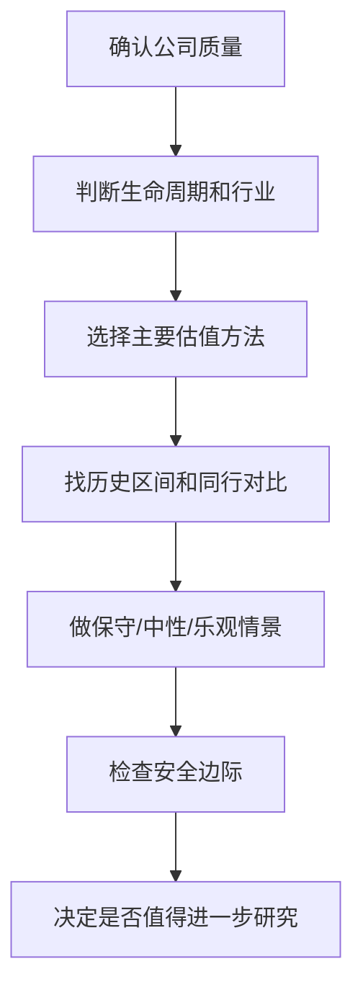

# 估值方法入门

> [!note] 核心问题
> 估值回答的不是“这家公司好不好”，而是“以当前价格买入，未来收益风险比是否合理”。好公司也可能买贵，差公司也可能因为足够便宜而有阶段性机会。估值的目标是给出合理区间，而不是算出一个精确数字。

## 学习目标

读完这篇，你要能做到：

1. 区分公司质量分析和价格估值分析。
2. 理解相对估值和绝对估值的逻辑差异。
3. 知道 PE、PB、PS、PEG、EV/EBITDA、DCF 的适用场景。
4. 能用多个方法交叉验证，避免单一指标误导。
5. 理解安全边际、折现率和增长假设对估值的影响。

## 估值前先问三个问题

### 1. 这家公司是否值得估值

估值不是第一步。先用 [[三张财务报表]]、[[财务比率分析]] 和 [[杜邦分析法]] 判断公司质量。如果公司商业模式看不懂、财务质量很差、现金流长期异常，估值再便宜也可能是陷阱。

### 2. 这家公司处于什么生命周期

| 生命周期 | 特征 | 更适合的方法 |
|---|---|---|
| 初创/亏损期 | 收入增长快，利润为负 | PS、EV/Revenue、单位经济模型 |
| 高速成长期 | 收入和利润快速增长 | PEG、DCF 情景分析 |
| 稳定成熟期 | 利润和现金流稳定 | PE、DCF、股息折现 |
| 周期波动期 | 利润随周期大幅变化 | PB、EV/EBITDA、周期中枢利润 |
| 衰退期 | 收入和利润下滑 | 清算价值、谨慎 PE |

### 3. 估值结果要回答什么

估值不是为了证明自己想买，而是回答：

- 现在价格隐含了多高增长？
- 如果增长不及预期，下行空间多大？
- 如果判断正确，上行空间是否足够补偿风险？
- 是否有足够安全边际？

## 两大估值流派

| 维度 | 相对估值法 | 绝对估值法 |
|---|---|---|
| 核心逻辑 | 和同行、历史、市场平均比贵不贵 | 根据未来现金流计算内在价值 |
| 代表方法 | PE、PB、PS、PEG、EV/EBITDA | DCF、股息折现、清算价值 |
| 优点 | 简单直观，容易落地 | 理论完整，能逼迫你思考增长和风险 |
| 缺点 | 可比公司可能整体高估或低估 | 输入假设敏感，容易制造精确幻觉 |
| 适合新手吗 | 更适合入门 | 适合用来训练思维 |

最佳实践不是二选一，而是用相对估值做市场比较，用 DCF 或现金流思维检查价格隐含假设。

## 一、PE：市盈率

$$
PE = \frac{市值}{净利润} = \frac{股价}{每股收益}
$$

PE 表示按当前利润水平，投资者愿意为 1 元利润支付多少价格。

### 适用场景

- 公司已经稳定盈利；
- 利润波动不太剧烈；
- 会计利润能较好代表现金创造能力；
- 同行业公司有可比性。

### 如何理解 PE

| PE | 常见含义 | 必须追问 |
|---:|---|---|
| 很低 | 市场预期悲观，可能便宜 | 利润是否即将下滑？是否有财务风险？ |
| 中等 | 可能接近合理 | 增长和质量是否匹配？ |
| 很高 | 市场预期乐观 | 高增长能持续多久？ |

PE 不能脱离增长和质量。一个稳定增长、现金流强、ROE 高的公司，合理 PE 可以高于低增长、重资产、高杠杆公司。

### PE 的常见陷阱

1. 周期行业在利润高点时 PE 很低，反而可能贵。
2. 一次性收益会压低 PE，让公司看起来便宜。
3. 利润为负时 PE 没有意义。
4. 不同会计政策会影响净利润。

## 二、PEG：把增长纳入 PE

$$
PEG = \frac{PE}{净利润增长率}
$$

如果 PE = 20，净利润增速 = 20%，PEG = 1。

| PEG | 常见解释 |
|---:|---|
| < 1 | 估值可能低于增长 |
| 1-1.5 | 大致合理 |
| > 1.5 | 需要更强质量或更长成长性支撑 |

### 适用条件

PEG 适合利润增长较稳定的成长公司，不适合：

- 利润为负公司；
- 增速极高但不可持续公司；
- 周期行业；
- 增速预测很不可靠的公司。

PEG 最大的问题是“增长率”通常来自预测，而预测最容易错。

## 三、PB：市净率

$$
PB = \frac{市值}{净资产}
$$

PB 表示市场愿意为公司每 1 元账面净资产支付多少钱。

### 适用场景

- 银行、保险、地产、资源、重资产制造；
- 资产价值较容易评估；
- 利润受周期影响较大，PE 容易失真。

### 如何理解 PB

PB 和 ROE 要一起看：

| ROE | PB | 初步判断 |
|---|---|---|
| 高 | 高 | 市场认可资产赚钱能力 |
| 高 | 低 | 可能低估，也可能 ROE 不可持续 |
| 低 | 高 | 估值风险较高 |
| 低 | 低 | 可能是低质量资产或周期底部 |

PB < 1 不一定便宜。账面资产如果质量差、减值不足、盈利能力弱，净资产本身可能不值账面金额。

## 四、PS：市销率

$$
PS = \frac{市值}{营业收入}
$$

PS 适用于利润暂时为负，但收入增长有价值的公司，例如早期 SaaS、互联网平台、生物科技、部分成长型公司。

### 使用 PS 必须同时看

- 毛利率：收入是否有足够利润空间；
- 销售费用率：增长是否靠烧钱；
- 留存率/复购率：收入是否可持续；
- 单位经济模型：每获得一个客户是否长期赚钱；
- 现金消耗速度：公司能烧多久。

PS 最大的陷阱是忽略成本。收入增长不等于价值增长。

## 五、EV/EBITDA：跨资本结构比较

$$
EV = 市值 + 有息负债 - 现金
$$

$$
EV/EBITDA = \frac{企业价值}{息税折旧摊销前利润}
$$

它试图排除资本结构、税率、折旧政策差异，更适合比较不同负债水平、不同国家税率、重资产企业。

适用场景：

- 制造业、资源、通信、基础设施；
- 并购估值；
- 跨市场公司比较。

局限：

- EBITDA 忽略资本开支；
- 高折旧行业可能看起来便宜；
- 不能替代自由现金流分析。

## 六、DCF：现金流折现

DCF 的核心思想：一家公司今天的价值，等于未来能产生的自由现金流折现回今天的总和。

$$
企业价值 = \sum_{t=1}^{n} \frac{自由现金流_t}{(1+r)^t} + \frac{终值}{(1+r)^n}
$$

其中：

- 自由现金流：公司经营后真正能分配给资本提供者的钱；
- r：折现率，代表风险和资金时间价值；
- 终值：预测期之后的长期价值。

### DCF 真正训练什么

DCF 最重要的不是算出 123.45 元的目标价，而是逼你思考：

1. 公司未来能增长多久？
2. 增长需要多少资本投入？
3. 自由现金流能否持续为正？
4. 这家公司风险有多高？
5. 当前价格隐含了多乐观的未来？

### DCF 的敏感性

DCF 对三个假设极其敏感：

| 假设 | 影响 |
|---|---|
| 收入/利润增长率 | 决定前期现金流 |
| 折现率 | 风险越高，估值越低 |
| 永续增长率 | 对终值影响巨大 |

差 1% 的折现率或永续增长率，可能让估值结果差几十个百分点。所以 DCF 应该输出区间和情景，而不是单点数字。

## 七、安全边际

安全边际是用明显低于合理价值的价格买入，给自己的判断错误留余地。

例如你估算一家公司的合理价值在 80-100 元之间，如果价格是 95 元，几乎没有容错；如果价格是 55 元，即使估值假设偏乐观，也可能仍有保护。

安全边际来自：

- 低买入价格；
- 高资产质量；
- 稳定现金流；
- 保守负债；
- 分散化；
- 足够长的投资期限。

## 估值方法选择指南

| 公司类型 | 首选方法 | 辅助方法 | 重点风险 |
|---|---|---|---|
| 稳定盈利蓝筹 | PE、DCF | 股息率、PEG | 增长放缓、估值压缩 |
| 高成长公司 | PEG、DCF 情景 | PS、EV/Revenue | 增长预测过度乐观 |
| 银行保险 | PB、ROE | PE、资产质量指标 | 资产减值、不良率 |
| 周期制造/资源 | EV/EBITDA、PB | 周期平均 PE | 利润高点误判便宜 |
| 亏损互联网/SaaS | PS、单位经济模型 | 现金消耗、留存率 | 增长烧钱不可持续 |
| 地产/重资产 | PB、资产重估 | 现金流、债务期限 | 杠杆和流动性 |

## 估值流程

## 常见误区

| 误区 | 更好的理解 |
|---|---|
| PE 低就是便宜 | 可能是利润高点或价值陷阱 |
| 好公司不怕贵 | 买入价格过高会透支多年收益 |
| DCF 算出来就是内在价值 | DCF 是假设模型，不是事实 |
| 同行业平均 PE 就是合理估值 | 整个行业可能高估或低估 |
| 目标价越精确越专业 | 区间和情景比精确小数更诚实 |

## 练习：做一次简化估值

任选一家稳定盈利公司，完成：

1. 写出公司所属行业和生命周期。
2. 查最近 5 年 PE/PB/PS 的历史区间。
3. 找 3 家同行公司做估值对比。
4. 判断当前估值处于历史和同行的什么位置。
5. 写一个保守、中性、乐观三种情景。
6. 回答：当前价格有没有足够安全边际？

## 相关概念

[[三张财务报表]] [[财务比率分析]] [[杜邦分析法]] [[复利思维]] [[宏观经济基础]]
