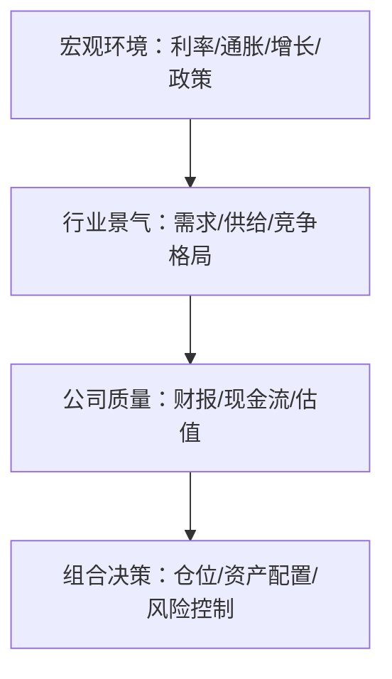

# 宏观经济基础

> [!note] 核心问题
> 宏观经济是投资的背景环境。它不会告诉你明天涨跌，但会影响利率、通胀、企业利润、估值中枢和资产配置。理解宏观的目的不是做短线预测，而是知道自己所处的“天气”和组合承受的系统性风险。

## 学习目标

读完这篇，你要能做到：

1. 理解利率、通胀、经济增长、汇率、信用周期如何影响资产价格。
2. 知道货币政策和财政政策的基本传导路径。
3. 能用经济周期框架理解股票、债券、商品、现金的表现差异。
4. 避免把宏观新闻当成短线交易信号。
5. 建立一张适合中国投资者的宏观观察清单。

## 宏观分析的位置

投资分析可以分三层：

宏观环境决定大风向，但不能替代公司分析。利率下降可能利好权益资产，但并不意味着所有公司都值得买。

## 一、利率：资金的价格

利率是理解资产价格最重要的宏观变量之一。

### 利率如何影响股票

1. 利率下降，融资成本降低，企业投资和居民消费更容易扩张。
2. 债券收益率下降，股票相对吸引力上升。
3. DCF 折现率下降，远期现金流价值上升。
4. 高估值成长股通常对利率更敏感。

### 利率如何影响债券

债券价格和市场利率通常反向变化：

- 利率上升，老债券票息吸引力下降，价格下跌；
- 利率下降，老债券票息相对更有吸引力，价格上涨。

久期越长，债券对利率变化越敏感。

### 常见利率指标

| 指标 | 含义 | 观察意义 |
|---|---|---|
| LPR | 中国贷款市场报价利率 | 影响企业和居民贷款成本 |
| 央行逆回购利率 | 短期政策利率信号 | 观察货币政策取向 |
| 10 年期国债收益率 | 无风险收益率锚 | 影响股债估值比较 |
| 美联储联邦基金利率 | 全球美元资金价格 | 影响全球流动性和汇率 |
| 美国 10 年期国债收益率 | 全球资产定价锚之一 | 对成长股和新兴市场影响大 |

## 二、通胀：货币购买力变化

通胀表示商品和服务价格整体上涨。适度通胀通常代表需求尚可，恶性通胀和通缩都不利于经济稳定。

### 主要指标

| 指标 | 含义 | 更影响谁 |
|---|---|---|
| CPI | 居民消费价格 | 居民感受、货币政策 |
| PPI | 工业生产者价格 | 企业成本和利润 |
| 核心 CPI | 剔除食品能源后的通胀 | 判断长期通胀趋势 |

### 通胀对资产的影响

| 通胀状态 | 可能影响 |
|---|---|
| 温和通胀 | 企业收入增长，股票可能受益 |
| 高通胀 | 央行可能加息，估值承压 |
| 成本推动通胀 | 原材料上涨挤压下游利润 |
| 通缩 | 需求不足，企业收入和利润承压 |

通胀不是单纯利好或利空，要看公司是否有定价权。能把成本转嫁给客户的企业更抗通胀。

## 三、经济增长：企业盈利的大背景

GDP 增长代表整体经济扩张速度。企业收入和利润长期很难完全脱离宏观增长环境。

### 观察经济增长的指标

| 指标 | 频率 | 作用 |
|---|---|---|
| GDP 增速 | 季度 | 总量增长情况 |
| PMI | 月度 | 制造业和服务业景气 |
| 工业增加值 | 月度 | 工业生产强弱 |
| 社会消费品零售总额 | 月度 | 消费需求 |
| 固定资产投资 | 月度 | 投资需求 |
| 出口增速 | 月度 | 外需强弱 |

宏观数据要看趋势和预期差。数据本身好，不一定市场涨；如果市场早已预期更好，反而可能下跌。

## 四、信用周期：钱是否容易借到

信用周期指融资环境的松紧变化。对房地产、基建、制造、金融和高杠杆企业尤其重要。

| 信用状态 | 特征 | 可能影响 |
|---|---|---|
| 信用扩张 | 贷款增长、社融改善、融资容易 | 经济和风险资产受益 |
| 信用收缩 | 融资变难、违约增加、风险偏好下降 | 高杠杆资产承压 |

中国投资者常看“社会融资规模”和“M2”。它们不是买卖信号，但能帮助判断资金环境。

## 五、汇率和全球流动性

汇率影响出口企业、进口成本、海外资产和资本流动。

人民币贬值可能：

- 利好部分出口企业；
- 推高进口成本；
- 影响海外资产折算收益；
- 改变外资流入流出预期。

美元利率和美元指数也会影响全球资金流向。美元强、美国利率高时，新兴市场资产往往承压。

## 经济周期框架

| 阶段 | 增长 | 通胀 | 常见表现 | 可能相对受益 |
|---|---|---|---|---|
| 复苏 | 上行 | 低位 | 利润改善，政策宽松 | 股票、信用债 |
| 繁荣 | 强劲 | 温和 | 需求旺盛，企业盈利好 | 股票、商品 |
| 过热 | 见顶 | 高位 | 加息压力，估值承压 | 商品、黄金、现金 |
| 衰退 | 下行 | 回落或通缩 | 盈利下滑，风险偏好低 | 国债、现金、防御资产 |

周期判断无法精确，但可以帮助你避免两个极端：繁荣末期过度乐观，衰退末期过度悲观。

## 政策传导

### 货币政策

| 政策方向 | 工具 | 传导逻辑 |
|---|---|---|
| 宽松 | 降息、降准、公开市场投放 | 资金成本下降，流动性改善 |
| 紧缩 | 加息、提高准备金、回笼流动性 | 资金成本上升，估值承压 |

宽松不一定立刻带来牛市。如果企业和居民不愿借钱，政策效果会打折。

### 财政政策

财政政策通过政府支出、税收、补贴、专项债等影响需求。

常见路径：

- 增加基建支出，拉动上游资源、工程机械、建筑链条；
- 减税降费，提高企业和居民可支配现金流；
- 补贴特定产业，改变行业景气和竞争格局。

## 宏观如何影响估值

估值不是只由公司决定。利率和风险偏好会改变市场愿意给多少 PE。

| 宏观变量 | 对估值的影响 |
|---|---|
| 利率上升 | 折现率上升，估值中枢下降 |
| 利率下降 | 折现率下降，估值中枢上升 |
| 通胀过高 | 加息预期上升，估值承压 |
| 流动性宽松 | 风险偏好提升，估值扩张 |
| 信用收缩 | 高杠杆公司估值和融资能力承压 |

这也是为什么同一家好公司，在不同宏观环境下合理估值区间会变化。

## 中国投资者宏观观察清单

| 数据 | 频率 | 主要来源 | 关注点 |
|---|---|---|---|
| GDP | 季度 | 国家统计局 | 总量增长趋势 |
| CPI/PPI | 月度 | 国家统计局 | 通胀和企业成本 |
| PMI | 月度 | 国家统计局/财新 | 景气方向 |
| 社融/M2 | 月度 | 央行 | 信用扩张或收缩 |
| LPR | 月度 | 央行授权发布 | 融资成本 |
| 10 年国债收益率 | 高频 | 债券市场 | 无风险利率 |
| 汇率 | 高频 | 外汇市场 | 外资流动和进出口影响 |
| 美联储利率 | 会议周期 | 美联储 | 全球流动性 |

## 宏观分析不该做什么

1. 不要用单条宏观新闻指导短线交易。
2. 不要试图精确预测每个数据。
3. 不要因为宏观悲观就忽略所有好公司。
4. 不要因为政策宽松就买入任何高估值资产。
5. 不要把经济增长和股票收益简单画等号。

正确做法：把宏观作为资产配置和估值判断的背景色，而不是每天买卖的按钮。

## 练习：写一页宏观温度计

每月更新一次：

| 变量 | 当前状态 | 对投资的含义 |
|---|---|---|
| 利率 | 上行/下行/震荡 |  |
| 通胀 | 高/低/温和 |  |
| 增长 | 改善/走弱/稳定 |  |
| 信用 | 扩张/收缩 |  |
| 汇率 | 升值/贬值/稳定 |  |
| 风险偏好 | 高/低/中性 |  |

最后写一句：当前宏观环境更支持进攻、防守，还是保持均衡？

## 网站与数据入口（补充）

| 资源 | URL / 位置 | 用途 |
|---|---|---|
| FRED | https://fred.stlouisfed.org/ | 美/全球宏观序列（GDP、利率等） |
| FRED 实操步骤 | [[FRED宏观数据实操]] | 检索、元数据、温度计 |
| 本库词条 | [[国内生产总值_Gross Domestic Product (GDP)]] [[联邦基金利率_Federal Funds Rate]] [[货币政策_Monetary Policy]] | 概念快查 |
| 进阶导航 | [[公司与宏观分析实操导航]] | 宏观敏感点写进公司一页纸 |
| 投管地图 | [[全球投管知识地图对照清单]] | Economics 主题对照 |
| 总外链 | [[全库网络资源总表]] | 分模块官网 |

**纪律：** 宏观数据用于情景与配置，不用于每日荐股按钮。

## 相关概念

[[资产配置入门]] [[估值方法入门]] [[技术分析入门]] [[风险管理框架]] [[债券_Bond|债券]] [[外汇_Forex|外汇]] [[公司与宏观分析实操导航]] [[全库网络资源总表]] [[全球投管知识地图对照清单]]
