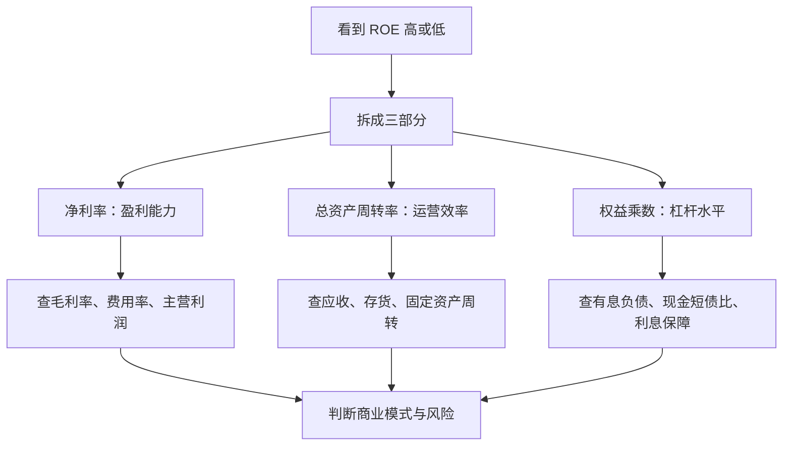

# 杜邦分析法

> [!note] 核心问题
> ROE 告诉你股东资本的回报率，杜邦分析告诉你这个回报率从哪里来。高 ROE 本身不是结论，它可能来自高利润率、高周转率，也可能来自高杠杆。投资分析要做的是区分“好生意创造的回报”和“风险堆出来的回报”。

## 学习目标

读完这篇，你要能做到：

1. 说清楚 ROE 为什么重要，以及为什么不能只看 ROE。
2. 用三步杜邦公式拆解 ROE。
3. 判断公司回报来自利润率、运营效率还是杠杆。
4. 识别 ROE 上升背后的风险信号。
5. 把杜邦分析和 [[三张财务报表]]、[[财务比率分析]] 连起来使用。

## ROE：结果，不是原因

ROE 的基础公式是：

$$
ROE = \frac{净利润}{平均净资产}
$$

它回答的是：股东投入的每 1 元净资产，一年能创造多少净利润。

例如 ROE = 20%，大致表示公司用 100 元股东权益创造了 20 元净利润。这个数字很有吸引力，但它没有告诉你 20 元利润是怎么来的。

可能的来源包括：

- 产品利润率高；
- 资产周转快；
- 借了很多钱放大规模；
- 净资产被压低；
- 一次性收益推高净利润。

所以 ROE 必须拆开看。

## 三步杜邦分析

核心公式：

$$
ROE = \frac{净利润}{营业收入} \times \frac{营业收入}{平均总资产} \times \frac{平均总资产}{平均净资产}
$$

也就是：

$$
ROE = 净利率 \times 总资产周转率 \times 权益乘数
$$

| 组成部分 | 公式 | 代表什么 | 投资含义 |
|---|---|---|---|
| 净利率 | 净利润 / 营业收入 | 每 1 元收入能留下多少利润 | 定价权、成本控制、费用效率 |
| 总资产周转率 | 营业收入 / 平均总资产 | 每 1 元资产能创造多少收入 | 运营效率、资产使用效率 |
| 权益乘数 | 平均总资产 / 平均净资产 | 每 1 元股东权益撬动多少资产 | 杠杆水平、财务风险 |

> [!tip] 口径提醒
> 更严谨的杜邦分析使用平均总资产和平均净资产。公司资产规模大幅变化、并购、分拆或增发时，平均数比期末数更可靠。

## 三个驱动因素怎么理解

### 1. 净利率：靠“每单赚得多”

净利率高，通常说明公司有较强的定价权、品牌力、技术壁垒、成本优势或费用控制能力。

常见特征：

- 毛利率较高或稳定；
- 销售费用率、管理费用率没有失控；
- 财务费用压力不大；
- 净利润主要来自主营业务，而不是一次性收益。

需要追问：

- 高净利率能否持续？
- 是否会吸引竞争者进入？
- 是否依赖涨价而不是销量增长？
- 是否被补贴、投资收益、资产处置推高？

### 2. 总资产周转率：靠“资产转得快”

总资产周转率高，说明公司能用较少资产创造较多收入。这类公司未必利润率高，但效率强。

常见特征：

- 存货周转快；
- 应收账款回款快；
- 固定资产利用率高；
- 供应链和渠道效率强。

需要追问：

- 高周转是否靠压低价格换来？
- 存货是否真的卖得快，还是通过促销清库存？
- 应收账款是否同步改善？
- 扩张后周转率会不会下降？

### 3. 权益乘数：靠“借钱放大”

权益乘数高，说明公司使用了更多负债。适度杠杆能提高 ROE，但过高杠杆会放大经营波动。

常见特征：

- 资产负债率较高；
- 有息负债较多；
- 利息费用对利润影响大；
- 短债和长期债务期限结构很重要。

需要追问：

- 负债是经营性负债，还是需要付息的金融负债？
- 现金流能否覆盖利息和本金？
- 债务是否集中到期？
- 行业下行时 ROE 会不会迅速恶化？

## 同样 ROE，不同商业模式

假设三家公司 ROE 都是 20%，但来源完全不同：

| 公司类型 | 净利率 | 总资产周转率 | 权益乘数 | ROE 来源 | 主要风险 |
|---|---:|---:|---:|---|---|
| 高端品牌型 | 25% | 0.5 | 1.6 | 高利润率 | 品牌老化、需求下滑 |
| 零售效率型 | 4% | 2.5 | 2.0 | 高周转 | 竞争激烈、费用上升 |
| 高杠杆资产型 | 8% | 0.5 | 5.0 | 高杠杆 | 利率上升、现金流断裂 |

三种模式没有绝对好坏，但质量和风险不同。长期投资通常更喜欢“净利率高且现金流强”的回报，其次是“周转效率高且风险可控”的回报；对“主要靠杠杆推高”的回报要格外谨慎。

## 分析流程

可以按 5 步执行：

1. 看 ROE 过去 3-5 年是上升、下降还是波动。
2. 拆出净利率、总资产周转率、权益乘数。
3. 找出变化最大的驱动项。
4. 回到财报科目验证原因。
5. 判断这种变化是可持续改善，还是短期扰动或风险上升。

## ROE 上升的几种情况

| ROE 上升原因 | 可能是好事吗 | 继续查什么 |
|---|---|---|
| 毛利率提升，费用率稳定 | 通常偏好 | 产品结构、涨价能力、竞争格局 |
| 资产周转率提升 | 可能是好事 | 存货、应收账款、产能利用率 |
| 权益乘数提升 | 需要谨慎 | 有息负债、短债压力、利息费用 |
| 净资产下降 | 不一定好 | 分红、回购、亏损、减值 |
| 一次性收益推高净利润 | 通常不可持续 | 投资收益、资产处置、政府补助 |

> [!warning] 高 ROE 陷阱
> ROE 很高但经营现金流差、负债快速上升、应收账款和存货异常增加时，不要急着判断为好公司。高回报如果没有现金流验证，可能只是财务数字暂时漂亮。

## 五步杜邦分析：进阶拆解

三步杜邦把 ROE 拆成利润率、周转率、杠杆。五步杜邦进一步把净利率拆开：

$$
ROE = 税负系数 \times 利息负担系数 \times EBIT利润率 \times 总资产周转率 \times 权益乘数
$$

各部分含义：

| 因素 | 近似公式 | 解释 |
|---|---|---|
| 税负系数 | 净利润 / 税前利润 | 税收对利润的影响 |
| 利息负担系数 | 税前利润 / EBIT | 债务利息对利润的侵蚀 |
| EBIT 利润率 | EBIT / 营业收入 | 不考虑利息和税之前的经营盈利能力 |
| 总资产周转率 | 营业收入 / 平均总资产 | 资产使用效率 |
| 权益乘数 | 平均总资产 / 平均净资产 | 杠杆水平 |

五步杜邦适合用来回答更细的问题：

- 净利率下降，是经营利润率下降，还是利息费用上升？
- ROE 提升，是经营变强，还是税率、利息、杠杆带来的短期变化？
- 公司加杠杆后，利息负担是否已经抵消了经营收益？

## 杜邦分析与行业特征

| 行业类型 | 常见 ROE 来源 | 分析重点 |
|---|---|---|
| 消费品牌 | 高净利率 | 品牌力、提价能力、渠道控制 |
| 零售连锁 | 高周转率 | 存货周转、供应链、现金转换周期 |
| 制造业 | 利润率 + 资产效率 | 产能利用率、资本开支、周期波动 |
| 软件互联网 | 高毛利 + 规模效应 | 获客成本、续费率、研发投入 |
| 银行保险 | 高杠杆行业属性 | 资产质量、不良率、资本充足率 |
| 地产建筑 | 杠杆 + 项目周转 | 现金短债比、预售回款、存货质量 |

不要把不同行业的 ROE 结构简单排名。杜邦分析的意义不是找“最高 ROE”，而是理解“这个 ROE 是否与商业模式一致，是否可持续”。

## 常见错误

1. **只看 ROE 排名**：高 ROE 可能来自高杠杆，也可能来自净资产被减值压低。
2. **忽略现金流**：净利润推高 ROE，但现金没回来，质量存疑。
3. **跨行业硬比**：银行、软件、白酒、零售的 ROE 结构天然不同。
4. **把短期改善当长期趋势**：一年 ROE 提升可能只是周期或一次性收益。
5. **忽略负债期限**：权益乘数高不可怕，可怕的是短债集中到期且现金不足。

## 练习：拆一家公司 ROE

任选一家上市公司，填下面的表：

| 指标 | 第 1 年 | 第 2 年 | 第 3 年 | 趋势判断 |
|---|---:|---:|---:|---|
| ROE |  |  |  |  |
| 净利率 |  |  |  |  |
| 总资产周转率 |  |  |  |  |
| 权益乘数 |  |  |  |  |
| 经营现金流 / 净利润 |  |  |  |  |
| 资产负债率 |  |  |  |  |

最后回答 4 个问题：

1. ROE 的主要来源是什么？
2. 最近几年 ROE 变化最大的驱动项是什么？
3. 这种变化来自经营改善，还是财务杠杆变化？
4. 现金流是否支持这个 ROE？

## 相关概念

[[三张财务报表]] [[财务比率分析]] [[估值方法入门]] [[宏观经济基础]]
