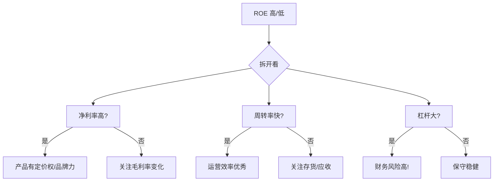

# 杜邦分析法

> [!note] 💡 概念解析
> 杜邦分析把 ROE 拆成三个部分，告诉你一家公司的赚钱能力到底来自哪里——是产品利润高？卖得快？还是借钱多？

## 三步杜邦分析（核心）

$$
ROE = \frac{净利润}{净资产} = \frac{净利润}{收入} \times \frac{收入}{总资产} \times \frac{总资产}{净资产}
$$

即：

$$
ROE = 净利率 \times 资产周转率 \times 权益乘数
$$

| 组成部分 | 含义 | 代表了 |
|---|---|---|
| 净利率 | 每 1 元收入能赚多少 | **盈利能力** |
| 资产周转率 | 每 1 元资产产生多少收入 | **运营效率** |
| 权益乘数 | 每 1 元净资产撬动多少资产 | **杠杆水平** |

## 实战对比

| | 茅台（高端白酒） | 沃尔玛（零售） | 银行（金融） |
|---|---|---|---|
| ROE | ~30% | ~20% | ~12% |
| 净利率 | ~50%（超高） | ~2%（微薄） | ~25% |
| 资产周转率 | ~0.4（慢） | ~2.5（快） | ~0.03（极慢） |
| 权益乘数 | ~1.5（低杠杆） | ~3.0（中杠杆） | ~12（高杠杆） |

> [!tip] 关键洞察
> 同样高的 ROE，来源可以完全不同：
> - **茅台**：靠高利润率（一瓶酒赚一半）
> - **沃尔玛**：靠高周转（薄利多销，货架上的商品转得飞快）
> - **银行**：靠高杠杆（拿别人的钱赚钱）
>
> 三种模式没有绝对好坏，但**靠杠杆堆出来的 ROE 风险最高**。

## 五步杜邦分析（进阶）

$$
ROE = 税负系数 \times 利息负担 \times EBIT利润率 \times 资产周转率 \times 权益乘数
$$

把三步中的净利率进一步拆成三块：
1. **税负系数**：税务筹划效率
2. **利息负担**：财务费用对利润的侵蚀
3. **EBIT 利润率**：经营本身的盈利能力（扣除利息和税之前）

## 使用注意事项

1. **杠杆是把双刃剑**：高权益乘数放大 ROE 的同时也放大了亏损风险
2. **行业比较才有意义**：科技公司和银行不能直接比 ROE 结构
3. **看趋势**：ROE 在上升还是下降？是哪个驱动因素在变化？
4. **警惕会计操纵**：ROE 的所有输入数据都可能被粉饰

## 分析流程

## 📚 相关概念

[[三张财务报表]] [[财务比率分析]] [[估值方法入门]] [[ROE]]
