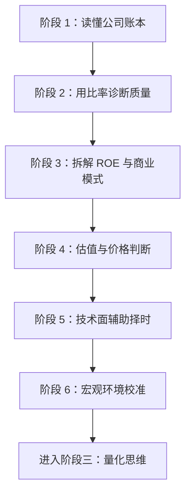

# 阶段二：看懂公司与市场

> [!note] 核心问题
> 阶段二要解决的不是“今天买什么”，而是建立一套判断公司和市场的基本框架：一家公司有没有真实赚钱能力、财务是否健康、增长是否可持续、当前价格是否合理，以及宏观环境会怎样影响这些判断。

## 本阶段学什么

阶段一更偏投资世界观，阶段二开始进入公司分析。你要从“看到一个股票代码”升级到“能读出一家公司的商业模式、财务质量和估值风险”。

最重要的四个问题：

1. 公司靠什么赚钱？
2. 赚到的钱有没有变成现金？
3. 这种赚钱方式能否持续？
4. 现在的价格是否已经透支了未来？

## 三段式学习路线

### 阶段 1：读懂公司账本

对应笔记：[[三张财务报表]]

目标不是背会计科目，而是能回答：

- 公司资产里哪些是真金白银，哪些可能只是账面数字？
- 利润是主营业务赚来的，还是一次性收益撑起来的？
- 净利润有没有被经营现金流验证？
- 应收账款、存货、商誉、短债这些科目有没有异常？

学习产出：能用 15 分钟快速扫一份年报三张表，写出“这家公司财务上最值得追问的 3 个问题”。

### 阶段 2：用比率诊断质量

对应笔记：[[财务比率分析]]

财务比率是把报表数字变成可比较语言。单个数字没有意义，真正有用的是三种比较：

- 和自己过去 3-5 年比，看趋势是否变好；
- 和同行公司比，看竞争力是否突出；
- 和商业模式比，看数字是否符合常识。

学习产出：能从盈利能力、偿债能力、运营效率、成长质量四个角度给公司做一次基础体检。

### 阶段 3：拆解 ROE 与商业模式

对应笔记：[[杜邦分析法]]

ROE 是结果，不是原因。杜邦分析把 ROE 拆成净利率、资产周转率和权益乘数，帮助你看清公司到底靠什么赚钱：

- 靠高利润率，通常意味着品牌、专利、渠道或定价权；
- 靠高周转，通常意味着供应链、效率和规模；
- 靠高杠杆，可能提高回报，也可能放大风险。

学习产出：看到一家公司的 ROE 后，能判断它的回报来自“好生意”“高效率”还是“高杠杆”。

## 后续扩展模块

| 笔记 | 解决的问题 | 使用时机 |
|---|---|---|
| [[估值方法入门]] | 公司贵不贵？ | 已经确认公司质量后 |
| [[技术分析入门]] | 什么时候买卖更合适？ | 辅助择时，不代替基本面 |
| [[宏观经济基础]] | 大环境对资产价格有什么影响？ | 做资产配置和风险校准时 |

## 推荐学习顺序

1. 先读 [[三张财务报表]]，建立“利润不等于现金”的底层认知。
2. 再读 [[财务比率分析]]，学会把报表数字转成判断语言。
3. 接着读 [[杜邦分析法]]，把 ROE 拆成商业模式。
4. 然后读 [[估值方法入门]]，理解好公司也可能买贵。
5. 最后读 [[技术分析入门]] 和 [[宏观经济基础]]，把公司判断放进市场环境。

## 学习方法

不要只读概念。每学一篇，都找一家真实上市公司做练习，最好选你熟悉的消费、互联网、银行、制造业公司各一家。

建议记录以下模板：

| 项目 | 你要写下来的内容 |
|---|---|
| 商业模式 | 公司卖什么？客户是谁？收入如何产生？ |
| 财务质量 | 利润、现金流、资产负债有没有互相验证？ |
| 核心指标 | ROE、毛利率、净利率、负债率、周转率的趋势 |
| 风险问题 | 最值得担心的 3 个财务或经营信号 |
| 初步判断 | 好公司、普通公司、问题公司，还是暂时看不懂 |

## 完成阶段二后的能力标准

完成本阶段后，你应该能够：

1. 读懂三大财务报表的核心科目，并知道每张表最容易“藏问题”的地方。
2. 用关键财务比率判断公司盈利能力、偿债能力、运营效率和成长质量。
3. 用杜邦分析拆解 ROE，判断公司回报来自利润率、周转率还是杠杆。
4. 理解 PE、PB、PS、PEG、DCF 等估值方法的适用场景和局限。
5. 知道技术分析只能辅助择时，不能替代公司质量判断。
6. 理解利率、通胀、货币政策、经济周期如何影响估值和资产配置。

## 最小实战练习

任选一家公司，按下面顺序完成一页笔记：

1. 用一句话描述公司如何赚钱。
2. 列出最近 3 年收入、净利润、经营现金流的变化。
3. 计算毛利率、净利率、ROE、资产负债率、应收账款周转率。
4. 用杜邦公式拆 ROE。
5. 写出“我还不确定，需要继续查证”的问题。

这一步做完，你就已经从“看行情”进入“看公司”了。

## 相关概念

[[复利思维]] [[行为金融学基础]] [[资产配置入门]] [[因子投资体系]] [[回测方法论]] [[夏普比率]]
