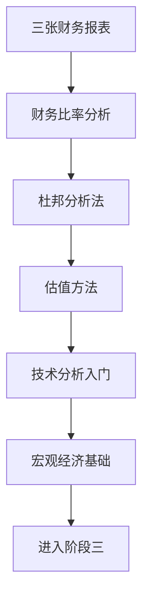

# 阶段二：看懂公司与市场

> [!note] 💡 概念解析
> 阶段二回答核心问题：**怎么判断一家公司值不值得投？** 学完阶段一你知道了市场会犯错，阶段二教你如何发现这些错误——通过财务报表、估值工具和技术指标三大武器。

## 学习路径

## 核心笔记

- [[三张财务报表]] — 资产负债表、利润表、现金流量表，读懂公司的"体检报告"
- [[财务比率分析]] — ROE/毛利率/负债率/现金流，用数字判断公司质地
- [[杜邦分析法]] — 把 ROE 拆成三块，看清公司靠什么赚钱
- [[估值方法入门]] — PE/PB/PS/PEG/DCF，判断公司是贵还是便宜
- [[技术分析入门]] — K线/均线/成交量，辅助判断买卖时机
- [[宏观经济基础]] — 利率/通胀/货币政策，理解大环境对投资的影响

## 学习目标

完成阶段二后，你应该能够：
1. 读懂三大财务报表的核心科目
2. 用关键财务比率判断公司盈利能力、偿债能力和运营效率
3. 用杜邦分析拆解 ROE 的驱动因素
4. 理解 PE/PB/DCF 等估值方法的适用场景
5. 知道技术分析的用途和局限
6. 理解宏观因素如何影响资产价格

## 📚 相关概念

[[复利思维]] [[行为金融学基础]] [[资产配置入门]] [[因子投资]] [[回测]] [[夏普比率]]
