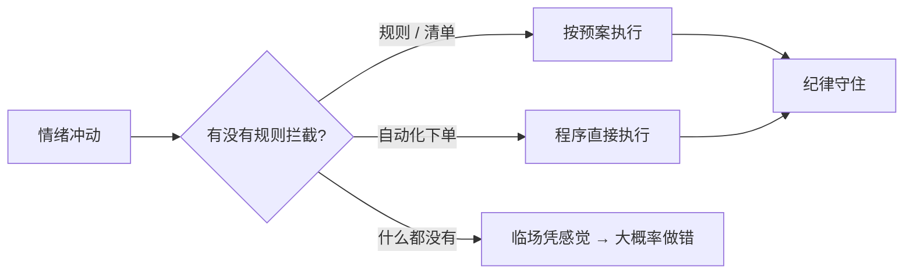

# 交易心理与执行纪律

> [!note] 核心问题
> 大多数投资亏损不是因为你不懂，而是因为临场情绪压过了纪律。[[投资心理偏误]] 讲的是认知层面「为什么会想错」，本篇讲执行层面「为什么知道了还是做不到」。这是把前面所有知识真正落地的最后一公里。

## 学习目标

读完这篇，你要能做到：

1. 区分「认知偏误」和「执行偏误」，知道本篇要解决的是后者。
2. 识别上头、报复性交易、FOMO、处置效应等临场陷阱，并对每一种准备好对策。
3. 用「过程 vs 结果」四象限评价自己，而不是用单次盈亏。
4. 用决策日志、事前验尸、回撤预案把纪律从「靠意志力」变成「靠制度」。
5. 给自己写一份可复制的交易决策日志模板，并理解仓位、睡眠、状态如何影响执行。

## 知道 ≠ 做到

阶段一你已经学过过度自信、损失厌恶、确认偏差。那篇解决的是「认知」：你为什么会形成错误的判断。

但真实交易里有一个更尴尬的现象：**很多人道理全懂，复盘头头是道，临场却照样做反。** 知道要止损，跌的时候手就是按不下去；知道不该追高，看到别人赚钱还是冲进去了。

举一个假设的场景（用于说明，非真实交易）：小李学完了止损纪律，给一只票设了 -8% 的止损。结果它跌了 -8%，他盯着屏幕，心里冒出一句「再等等，万一是洗盘呢」，手就停住了。第二天跌到 -15%，他更不舍得割了。最后亏 -30% 才割在地板上。他不是不懂止损——他能给你讲半小时止损的好处——他只是在那个心跳加速的当下，被「不想认亏」的情绪绑住了手。

这就是认知和执行的差距：

| 层面 | 问题 | 出现时机 | 本篇是否处理 |
|---|---|---|---|
| 认知偏误 | 我把事情想错了 | 分析、判断阶段 | 否（见 [[投资心理偏误]]） |
| 执行偏误 | 我想对了却做不到 | 下单、持有、卖出的临场 | 是 |

> [!tip] 一句话区分
> 认知偏误是「脑子骗了你」，执行偏误是「情绪绑架了手」。前者靠学习和复盘改善，后者光靠学习几乎没用，必须靠规则和环境约束。

## 执行层面的心理陷阱

下面这些都不是「不懂」，而是「懂了也守不住」。先认清它们长什么样、会带来什么后果，再谈对策。

| 陷阱 | 临场表现 | 后果 | 对策 |
|---|---|---|---|
| 上头 / 情绪化交易（tilt） | 一笔单子让你心跳加速、坐立不安，开始凭情绪点鼠标 | 偏离计划、加码、乱改止损 | 设「冷却期」，情绪上来先停手离开屏幕 |
| 报复性交易 | 刚亏一笔，立刻想用下一笔扳回来 | 仓位失控、连环亏损 | 单日 / 单笔亏损达阈值即强制收工 |
| FOMO 追高 | 看到别人都在赚，怕错过，不看估值就买 | 买在情绪高点，套在山顶 | 买入必须有事先写好的理由，临时起意不下单 |
| 锚定买入成本 | 「我 50 买的，回本再卖」 | 套牢不肯走，小亏拖成大亏 | 问：手上若是现金，今天还会按现价买它吗 |
| 处置效应 | 赚的太早落袋，亏的死扛 | 砍掉了利润，留下了亏损 | 卖出理由只看「未来收益风险比」，不看成本价 |
| 过度交易 | 闲不住，总想做点什么 | 手续费和滑点吃掉收益，错误次数变多 | 给自己设交易频率上限，无信号就不动 |
| 确认偏差式持仓 | 买入后只看利好，把利空都解释成「市场误解」 | 逻辑被证伪还死拿 | 买入时先写下「什么事实出现我必须重估」 |

这些陷阱有一个共同点：**它们都发生在你最不该决策的时刻——情绪最激动的时候。** 后面所有方法，本质上都是想办法把决策从这种时刻挪走。

为什么「下次我注意点」基本没用？因为情绪上头时，大脑负责理性的部分本来就被压制了。你不是「忘了」纪律，而是**在那一刻根本调用不出它**。这就是为什么对抗执行偏误不能靠临场自律，只能靠事先定好、事中不需要动脑的规则。

### 处置效应：值得单独说

处置效应是损失厌恶在交易里最常见的具体形态：**过早卖出盈利的，长期死扛亏损的。** 它特别隐蔽，因为「落袋为安」听起来很有道理。

每次想卖之前，问自己两个问题：

1. 我想卖，是因为价格涨了，还是因为它未来的收益风险比真的变差了？
2. 我留着这个亏损仓，是因为基本面没变，还是只是不想承认自己错了？

如果卖出的理由是「涨了」、持有的理由是「不想认错」，那你正在被处置效应支配。

### 报复性交易：连环亏损的引擎

报复性交易是最快把账户打穿的一种。逻辑链是这样的：亏一笔 → 不甘心 → 想立刻扳回来 → 加大仓位 / 降低标准 → 更可能再亏 → 更不甘心 → 仓位再加大。每一环都让下一环更糟。

它和正常交易的区别在于**动机**：正常交易的动机是「这里有机会」，报复性交易的动机是「我要把刚才那笔的钱拿回来」。后者和市场机会毫无关系，纯粹是情绪。

唯一可靠的对策是**物理隔断**：给自己设一条「单日 / 单笔亏损达到 X 就当天收工」的硬规则，到点强制离场，不给「再来一笔」的机会。事先定好，事中不商量。

## 过程 vs 结果（本篇重点）

这是交易心理里最反直觉、也最重要的一点。

新手习惯用「这笔赚没赚」来判断自己对不对。但市场有运气成分，**短期里好过程也可能坏结果，坏过程也可能好结果。** 用单次盈亏评价决策，等于让运气替你定义对错。

> [!warning] 核心警告
> 赚钱不等于你对，亏钱不等于你错。一次结果好不好，是「决策质量 + 运气」的混合。你能控制的只有决策质量。

把过程和结果拆成两个维度，就得到一张四象限表：

| | 结果好（赚钱） | 结果坏（亏钱） |
|---|---|---|
| **过程好**（决策正确） | 应得的成功——可以复制 | 运气不好——不必自责，继续按系统做 |
| **过程坏**（决策错误） | 侥幸——最危险，会强化坏习惯 | 活该——但至少结论是对的 |

四个格子里，**最危险的不是「过程坏 + 结果坏」，而是「过程坏 + 结果好」**（右上转左下那一格，即决策错却赚到钱）。因为它会奖励你的坏习惯：你追高赌了一把恰好赚了，大脑就记住「追高有用」，下次加倍。赌徒就是这样养成的。

反过来，「过程好 + 结果坏」最容易让人动摇：明明按规则做了却亏钱，于是开始怀疑、推翻系统。但如果你的过程确实有正期望，这种亏损只是必然出现的方差，**坚持才是对的**。

用一个假设的数字例子（仅为说明期望值，非真实策略）：某个交易规则胜率 40%，赢的时候赚 3 倍、输的时候亏 1 倍。

$$
\text{单笔期望} = 0.4 \times 3 - 0.6 \times 1 = +0.6
$$

这是个正期望的好过程。但胜率只有 40%，意味着**你会经常亏，甚至可能连亏五六笔**。如果你用单次结果评价它，很可能在连亏阶段就把这个本来赚钱的系统给砍了。能不能扛过这种「过程对、短期结果差」的阶段，是新手和成熟交易者的分水岭。

这一节直接呼应两篇旧文：

- [[业绩评估与归因]]：区分运气与技能，单看收益数字会骗人。
- [[回测方法论]]：小样本不可信，一两笔交易说明不了任何问题。

所以正确的自我评价方式是：**按决策质量打分，而不是按单次盈亏打分。** 一笔交易做完，先问「我的过程对不对」，再看结果，最后把它归到上面四个格子里的一个。

## 决策质量与复盘工具

既然要按过程评价自己，就需要把「当时的过程」如实记录下来，否则事后回忆一定会被结果污染（这就是后见之明偏差：赚了就觉得「我早知道」）。

### 决策日志（decision journal）

在**买入的当下**，趁还没有结果干扰，写下：

- 我为什么买（核心逻辑）；
- 我预期会发生什么（目标、时间、催化剂）；
- 我承担什么风险（最大可接受亏损、止损条件）；
- 什么证据会证明我错了。

事后对照这份原始记录复盘，而不是凭记忆。**关键纪律：不要事后修改它。** 原文越「丑」，复盘越有价值。

### 事前验尸（pre-mortem）

下单之前，做一个思想实验：**假设半年后这笔交易彻底失败了，把钱亏光了，最可能是因为什么？**

把答案写下来。这个动作能强行打开确认偏差的盲区，逼你提前看到下行风险。很多本可避免的亏损，都是因为买入时压根没认真想过「会怎么死」。

事前验尸和事后复盘的区别：

| 工具 | 时机 | 作用 |
|---|---|---|
| 事前验尸 pre-mortem | 决策之前 | 提前发现风险、打破过度乐观 |
| 决策日志 decision journal | 决策当下 | 锁定原始理由，供日后对照 |
| 事后复盘 post-mortem | 结果出来后 | 区分运气与技能，更新方法 |

## 仓位与情绪

仓位不只是数学问题，更是心理问题。这一节呼应 [[资金管理与杠杆]]。

**仓位过重，会让你在最差的时刻做最差的决定。** 同样一段 -15% 的下跌，5% 的仓位你能淡定持有，50% 的仓位可能让你半夜失眠、第二天在最低点割肉。注意：让你做错决策的不是行情本身，而是「过重的仓位 × 行情」。

> [!tip] 睡眠测试
> 判断仓位是不是太大，有个朴素又好用的标准：**这个仓位大到让你睡不好觉了吗？** 如果一个持仓让你夜里反复看盘、焦虑到失眠，那它就是太大了——不管模型怎么算。把它降到你能睡着的水平。

仓位和回撤的心理关系，可以粗略地这样理解（以下为示意，非精确公式）：

$$
\text{临场心理压力} \;\approx\; \text{仓位比例} \times \text{当前回撤} \times \text{杠杆}
$$

三个因子相乘，任何一个偏大，压力就指数级上升，纪律就更容易被击穿。降低仓位和远离杠杆，本质上是在给自己的纪律留余量。

## 连续亏损与回撤的心理管理

回撤是纪律最大的敌人。账户绿了一片的时候，再好的规则也容易被「再等等」「这次不一样」冲垮。

关键思路和 [[风险管理框架]] 完全一致：**规则要写在上涨时，而不是下跌时。** 因为下跌时你的判断力已经被恐惧污染了，这时候临时决定怎么办，几乎必错。

所以在情绪平静、账户还在高点的时候，提前写好回撤预案：

| 回撤档位 | 预先写好的应对（示意，需按自身情况设定） |
|---|---|
| -10% | 正常波动，不动作，只记录 |
| -20% | 暂停开新仓，复查每个持仓逻辑是否还成立 |
| -30% | 降低总仓位 / 杠杆，回到能睡着的水平 |
| -40% 或更深 | 触发预设的「停止线」，全面收工，离场冷静复盘 |

写下来的预案有两个作用：一是真到那天你知道该干什么，不用临场拍脑袋；二是它把「我现在好慌该怎么办」变成「执行第几档规则」，把情绪移出了决策。

## 把纪律系统化

读到这里你应该能感觉到一条主线：**对抗执行偏误，靠的不是意志力，而是制度设计。** 意志力会疲劳、会在压力下崩溃；规则不会。

系统化的三种武器：

- **规则**：把「该怎么做」事先写成明确条件（达到 X 就做 Y），不给情绪留解释空间。
- **清单**：买入前、卖出前各过一遍检查清单，强制走完流程（呼应 [[投资心理偏误]] 里的「偏误防火墙」）。
- **自动化**：用程序化、自动下单把「人」从执行环节里拿掉。

> [!note] 量化的一个隐藏价值
> 大家常说量化的优势是速度和算力。但对个人投资者，量化/自动下单还有一个被低估的好处：**它把临场情绪彻底移出了执行环节。** 止损线写进程序，跌到位就自动成交，你没有机会在最痛的时刻手软。这一点和 [[市场微观结构与交易执行]] 关心的「如何把单子更好地送进市场」互补——一个管「执行得好不好」，一个管「该不该手动干预」。

## 交易日志模板

下面是一份可以直接复制使用的字段清单。每笔交易开仓时填前半部分，平仓后填复盘部分。

| 字段 | 填什么 |
|---|---|
| 日期 | 开仓日期 |
| 标的 | 代码 / 名称 |
| 方向与仓位 | 买 / 卖，占总资产比例 |
| 买入理由 | 核心逻辑，一两句话说清 |
| 预期 | 目标价 / 收益、预计时间、催化剂 |
| 风险 | 最大可接受亏损、止损条件、什么证据证明我错了 |
| 事前验尸 | 假设这笔失败了，最可能死于什么 |
| 情绪状态 | 下单时的情绪（平静 / 兴奋 / 焦虑 / 报复 / FOMO） |
| —— 平仓后填 —— | |
| 实际结果 | 盈亏金额与比例、持有时长 |
| 过程-结果象限 | 归入四象限的哪一格（过程好坏 × 结果好坏） |
| 复盘结论 | 这是技能还是运气？下次改什么？规则要不要更新？ |

「情绪状态」这一栏特别值得加。坚持几个月你会发现：标着「焦虑」「报复」「FOMO」的那些单子，胜率往往明显更差。**这条数据本身就会帮你戒掉冲动交易。**

## 身体与状态

最后一块常被忽略：交易质量和你的生理状态直接相关。

- **睡眠**：睡不好时，人对损失更敏感、更容易冲动，自控力下降。熬夜后尽量别做重大调仓。
- **压力**：生活里有大事（搬家、吵架、工作危机）时，情绪阈值会变低，平时守得住的纪律可能守不住。
- **决策疲劳**：连续盯盘几小时后，判断力会随决策次数累积而退化，越往后越容易乱来——这也是「过度交易」常发生在尾盘的原因之一。

> [!tip] 实务建议
> 把交易当成需要状态的事来对待。状态差的时候，最好的操作往往是**不操作**：关掉屏幕，让仓位按既定规则自己走。不交易也是一种交易决策，而且常常是更好的那个。

## 常见误区

| 误区 | 更好的理解 |
|---|---|
| 赚钱就说明我做对了 | 可能只是运气；要看过程，别让侥幸强化坏习惯 |
| 这次不一样 | 大多数「这次不一样」最后都一样，它常是 FOMO 的借口 |
| 等回本就卖 | 成本价对市场毫无意义；只看未来收益风险比 |
| 纪律靠意志力 | 意志力会疲劳和崩溃；纪律要靠规则、清单和自动化 |
| 复盘只看盈亏 | 盈亏混了运气；要按决策质量复盘，落到四象限里 |
| 亏了赶紧扳回来 | 报复性交易是连环爆仓的起点；该收工就收工 |

## 练习：填一份交易决策日志，并做一次四象限归类

分两步，都要动笔写下来：

**第一步：填日志。** 用上面的模板，给你**当前持有**（或最近一笔）的交易完整填一遍，重点别漏「风险」「事前验尸」「情绪状态」三栏。

**第二步：四象限归类。** 回想你**最近一次冲动交易**（追高、报复、FOMO 都算），诚实回答：

1. 当时的**过程**是好是坏？（有没有事先写好的理由和风险，还是纯凭情绪？）
2. 最终**结果**是赚是亏？
3. 把它放进下面的格子，并写一句话结论：

| | 结果好 | 结果坏 |
|---|---|---|
| 过程好 | □ 应得 | □ 运气差，继续坚持 |
| 过程坏 | □ 侥幸（最危险，要警惕） | □ 活该，但结论对 |

如果它落在「过程坏 + 结果好」那一格，请格外当心：你可能正在被一次侥幸训练成赌徒。**把这次的教训写成一条规则，加进你的检查清单。** 这比「我下次冷静点」有用得多。

## 相关概念

[[投资心理偏误]] [[行为金融学基础]] [[资金管理与杠杆]] [[风险管理框架]] [[业绩评估与归因]] [[回测方法论]] [[市场微观结构与交易执行]] [[实战案例与经典风险事件]]
