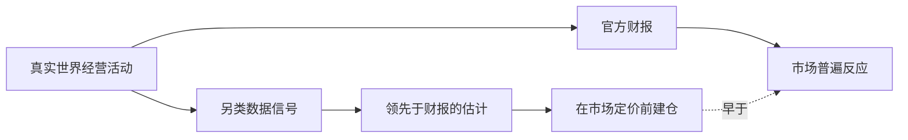

# 另类数据与信息优势

> [!note] 核心问题
> 超额收益不会凭空出现，它来自某种别人没有的优势（edge）。这篇讲清优势到底从哪来，以及另类数据这个现代信息来源：它能更早看到什么、处理为什么这么难、优势为什么会衰减，以及哪里是合规与道德的红线。

## 学习目标

读完这篇，你要能做到：

1. 说清优势的三种来源：信息优势、分析优势、行为/结构优势。
2. 区分传统数据和另类数据，理解另类数据想解决什么问题。
3. 认识主要的另类数据类型，以及它们各自能提前反映什么。
4. 理解数据处理的真正难点和 alpha 衰减为什么不可避免。
5. 用一套清单评估一个数据源是否值得用，并守住合规底线。

## 没有优势就没有超额收益

市场收益可以拆成两部分：跟着市场涨跌拿到的部分（beta），和超越市场的部分（alpha）。beta 谁都能拿，买指数就行。alpha 是相对别人多赚的，而别人也在努力赚同一笔钱。

所以第一个要回答的问题不是"这个策略能不能赚钱"，而是：

> 我凭什么比市场上其他人赚得多？我的优势是什么？

如果答不上来，回测再漂亮也只是历史的巧合。优势可以归为三类。

### 三类优势对比

| 优势类型 | 含义 | 典型例子 | 呼应 |
|---|---|---|---|
| 信息优势 | 更早或更全地拿到数据 | 用卫星车流提前估算季度销售 | 本篇另类数据 |
| 分析优势 | 同样的数据，看得更深 | 用机器学习挖掘非线性关系 | [[机器学习与AI在量化中的应用]] |
| 行为/结构优势 | 别人受约束或系统性犯错 | 利用基金被迫调仓、散户追涨杀跌 | [[行为金融学基础]] |

这三类不是互斥的。一个好策略往往同时占两到三种：更早的数据（信息）+ 更好的模型（分析）+ 别人因为制度约束做不了（结构）。优势叠加得越多，越难被复制。

> [!tip] 先问优势，再谈数据
> 另类数据只是"信息优势"这一类里的一种具体手段。买数据之前先想清楚：我要的是信息优势、分析优势还是结构优势？如果只是把人人都有的数据再算一遍，那其实没有优势。

## 市场越有效，优势越难持续

有效市场假说的极端版本说：价格已反映所有信息，没人能持续跑赢。现实没那么极端，但方向是对的——越多聪明人盯着同一个市场，可持续的优势就越稀缺。

这带来一个必须反复问的问题：

> 我的优势为什么能持续？是别人看不到、算不出，还是不愿做、做不了？

- **看不到**：信息优势。但数据会被越来越多人买到。
- **算不出**：分析优势。但模型和方法会扩散。
- **不愿做、做不了**：行为/结构优势。这一类往往最持久，因为它根植于人性和制度约束，不容易消失。

记住这个排序：纯信息优势通常最容易被抹平，行为/结构优势相对最耐久。另类数据属于最容易被抹平的那一类，所以更要警惕衰减。

## 传统数据 vs 另类数据

传统数据指人人都能拿到的标准化数据：财报、价量、宏观指标。它们的问题不是不准，而是太普及、太滞后。财报一个季度才出一次，公布时信息早已是过去式。

另类数据（alternative data）指非传统来源的数据，试图更早、更细地看到基本面的"实时影子"——在财报公布之前，就从侧面观察一家公司的经营状况。

| 维度 | 传统数据 | 另类数据 |
|---|---|---|
| 来源 | 财报、交易所、统计局 | 卫星、支付、网页、App、传感器 |
| 普及度 | 人人都有 | 需要采购或自行采集 |
| 频率 | 季度、月度为主 | 可到每日甚至实时 |
| 时效 | 滞后（公布即过去） | 领先（先于财报） |
| 结构 | 干净、标准化 | 杂乱、需大量清洗 |
| 信息优势 | 几乎没有 | 可能有，但会衰减 |

核心区别在"时效"。另类数据的价值，本质是把你对基本面的观察时点往前挪——别人等季报，你在季中就看到了苗头。

## 另类数据类型

下面是常见的几类。注意每一类"能提前反映什么"——这才是它的价值所在。所有数字均为**假设示例**，仅用于说明逻辑。

| 数据类型 | 观察对象 | 能提前反映什么 | 主要难点 |
|---|---|---|---|
| 卫星图像 | 停车场车流、油罐阴影、农田长势 | 零售客流、原油库存、农作物产量 | 图像识别、天气遮挡、成本高 |
| 信用卡/支付流水 | 消费者刷卡记录 | 某品牌或商户的销售趋势 | 样本代表性、隐私、口径 |
| 网页抓取 | 电商价格、招聘岗位、用户评论 | 定价策略、扩张/收缩、口碑变化 | 反爬、合法性、结构不稳定 |
| App 使用与下载 | 下载量、日活、使用时长 | 互联网公司的用户增长 | 平台口径变化、地域覆盖 |
| 社交媒体情绪 | 帖子、搜索、讨论热度 | 短期情绪、突发事件关注度 | 噪声大、易被操纵 |
| 供应链/物流 | 货运量、港口吞吐、提单 | 制造与贸易景气、企业产销 | 实体映射、覆盖不全 |
| 地理位置 | 人流热力、到店频次 | 线下门店经营、商圈活跃度 | 隐私、样本偏差 |

不同数据服务于不同场景。例如 [[事件驱动]] 策略特别能受益于此：并购传闻、产品发布、门店关停，往往先在另类数据里露出痕迹，再反映到价格上。

这张图说明另类数据的整个逻辑：经营活动同时留下"另类数据痕迹"和"未来的财报"。如果你能从前者更早估出后者，就有机会在市场普遍反应之前行动。关键词是"更早"。

## 数据处理的真正难点

新手容易以为难点是"找到数据"。其实买到或抓到数据只是开始，**大部分工作量在处理**。处理不当，再独特的数据也是噪声，甚至会制造假的优势。

### 1. 清洗

原始数据通常脏乱：缺失、重复、异常值、格式不一。卫星图有云遮挡，刷卡数据有退款冲销，抓取数据有页面改版。不清洗就建模，等于在沙地上盖楼。

### 2. 实体映射

这是另类数据最容易被低估的难点。你必须把数据准确对应到正确的股票代码。

- 一个品牌可能属于某家上市公司，也可能是其子公司或合资公司；
- 同一家公司有多个商户名、App 名、简称；
- 公司更名、分拆、并购会让映射关系随时间变化。

映射错了，等于给 A 公司的信号挂在 B 公司头上，结论全错。

### 3. 时点正确（point-in-time）

数据进入模型的时间，必须是当时**真实可获得**的时间，不能用"后来才知道"的版本。这与 [[回测方法论]] 里的前视偏差是同一件事，但在另类数据里更隐蔽：

- 数据供应商可能事后修正历史数据，回测若用修正后的版本，就用了未来信息；
- 数据有采集和交付延迟，信号"产生日"和"可用日"往往不是同一天。

> [!warning] 另类数据里的前视偏差
> 另类数据最常见的致命错误，是用"现在整理好的干净历史"去回测，而当年根本拿不到这么及时、这么干净的数据。务必区分"信号发生日"和"你实际能用到的日期"，按后者入模。

### 4. 幸存者偏差

如果数据集只包含"现在还存在"的商户、App 或公司，就漏掉了已经倒闭、下架、退市的样本，等于提前知道谁活了下来。这与回测里的幸存者偏差同理。

### 5. 覆盖度与历史长度不足

另类数据普遍历史短。很多数据源只有三五年，可能没经历过一个完整的牛熊周期。历史太短，你无法判断信号是真有效，还是恰好赶上一段顺风行情。覆盖度不足则意味着信号只对一部分股票有效，对其余股票完全没有。

### 6. 口径变化

数据源的统计口径会变：支付公司换了采样人群，App 商店改了统计方式，抓取目标改了网页结构。口径一变，前后数据不可比，时间序列出现断点而你可能浑然不觉。

## Alpha 衰减

优势不是永久资产，而是会折旧的资产。

一个数据源刚出现时，用的人少，信号有效。随着越来越多机构买入同一份数据、做类似的交易，价格会越来越快地反映这份信息，信号的有效性逐步消失。这就是 **alpha 衰减（alpha decay）**。

衰减的根源是"拥挤"——同一个信号上挤满了人。这与 [[统计套利与配对交易]] 里的拥挤交易是同一种现象：当大家都在做同一笔交易，不仅收益被摊薄，回撤时还会因为同时平仓而互相踩踏。

衰减速度大致受这些因素影响：

| 因素 | 衰减更快 | 衰减更慢 |
|---|---|---|
| 数据独特性 | 很多人都买得到 | 自有采集、难以复制 |
| 处理门槛 | 拿来即用 | 处理极难，劝退多数人 |
| 容量 | 信号只在小盘有效，容易拥挤 | 容量大，能容纳更多资金 |
| 优势类型 | 纯信息优势 | 叠加了结构/行为优势 |

务实的态度：把每个数据源都当成有保质期的东西。持续监控信号是否还有效，并不断寻找新来源。指望买一份数据吃十年，是不现实的。

## 如何评估一个数据源

在花钱或投入大量精力之前，用一张清单系统地评估。关键不只是"这个数据有没有用"，而是"它能不能在**已有信息之外**带来增量"。

| 评估维度 | 要问的问题 | 为什么重要 |
|---|---|---|
| 覆盖度 | 覆盖多少股票/多少比例市值？ | 覆盖太窄，只能用在很小范围 |
| 历史长度 | 有几年历史？经历过牛熊吗？ | 太短无法验证稳健性 |
| 延迟 | 从发生到可用要多久？ | 延迟太大，优势被抵消 |
| 唯一性 | 多少人也能拿到同样数据？ | 越独特，衰减越慢 |
| 增量信息 | 与已有因子相关性高不高？ | 高度相关＝没带来新东西 |
| 成本 | 采购/处理/维护要多少钱和人力？ | 成本可能吃掉全部 alpha |

> [!tip] 增量才是关键
> 一个数据源即使本身能预测收益，如果它和你已有的因子高度相关，那它没有提供任何新信息——你早就通过别的途径捕捉到了。评估另类数据，永远要问"它在我现有体系之外，多带来了什么"。这与 [[因子投资体系]] 里强调的增量信息是同一个道理。

成本这一项尤其容易被忽略。另类数据采购费用可能很高，加上清洗、映射、维护的人力，总成本经常超出预期。如果一个数据源的预期 alpha 撑不起它的成本，它就不值得用，哪怕信号本身是真的。

## 合规与道德

这一节不是可选项。为了 alpha 踩法律和道德的线，代价远大于收益。

### 重大非公开信息（MNPI）红线

最重要的红线是不得使用**重大非公开信息**（Material Non-Public Information, MNPI），也就是内幕信息。如果一份数据实质上等同于尚未公开的、会显著影响股价的公司内部信息，基于它交易就可能构成内幕交易。

另类数据的灰色地带在于：合法的另类数据是从外部观察、间接推断；而内幕信息是从内部直接获取。两者有时界限微妙，但原则清晰——你的信息应当来自对公开世界的观察，而非对方有保密义务的内部渠道。

| 维度 | 合法的另类数据 | MNPI/内幕信息（红线） |
|---|---|---|
| 来源 | 外部观察、公开可见 | 公司内部、受保密约束 |
| 性质 | 间接推断基本面 | 直接得知未公开事实 |
| 例子 | 卫星拍到的停车场车流 | 内部人提前告知的并购消息 |
| 结论 | 可用 | 严禁，可能违法 |

### 其他必须守住的边界

| 风险点 | 说明 |
|---|---|
| 隐私 | 涉及个人的支付、位置数据须合规脱敏，遵守隐私法规 |
| 抓取合法性 | 网页抓取要看对方条款、robots 规则和当地法律，未必都合法 |
| 数据授权 | 确认供应商对数据有合法授权可转售，避免买到无权出售的数据 |
| 来源链路 | 数据是怎么来的？源头不干净，使用者也可能担责 |

务实原则：拿不准的，就当成不能用。alpha 没了可以再找，触法的代价无法挽回。

## 个人投资者的"另类信息"

看到这里，个人投资者可能觉得另类数据是机构专属——确实，买卫星数据不现实。但"信息优势"的本质，对小资金反而更友好。

机构受制于规模和合规，很多事做不了；个人船小好调头，可以在自己真正懂的小领域，形成机构覆盖不到的差异化认知。你的"另类数据"是：

- **生活观察**：你常去的店是不是更挤了，某个产品是不是突然到处都是；
- **行业一手经验**：你在某个行业工作，对它的景气、技术、竞争格局有外人没有的体感；
- **能力圈内的深度**：在你真正懂的几家公司上，比泛泛覆盖的分析师看得更透。

这正是 [[行为金融学基础]] 里"能力圈"思想的延伸：不在所有领域和机构比拼，只在自己有真实信息优势的小圈子里下注。小资金做差异化，靠的不是数据量，而是别人没有的一手认知。

> [!tip] 个人优势更偏结构/行为
> 个人投资者很难有信息优势的"速度"，但可以有结构/行为优势：你不受基准约束、不必每季交差、可以长期持有、可以只投自己看得懂的少数标的。把优势建在这些机构学不来的地方，比追逐另类数据更现实。

## 常见误区

| 误区 | 纠正 |
|---|---|
| 数据越多越好 | 没有增量信息的数据只是噪声，还会增加过拟合风险，关键是独特和增量，不是数量 |
| 另类数据＝稳定 alpha | alpha 会衰减，越多人用消失越快，它是会折旧的资产，不是永动机 |
| 抓到数据就能用 | 大部分工作在清洗、实体映射、时点处理，没处理好的数据会制造假优势 |
| 优势是永久的 | 任何优势都需要持续验证和更新，纯信息优势尤其容易被抹平 |
| 另类数据是机构专利 | 个人在能力圈内的一手观察，同样是别人没有的信息优势 |
| 为 alpha 可以踩点线 | MNPI 和隐私是红线，触法代价远超任何收益 |

## 练习：盘点一个行业的另类数据信号

选一个你熟悉的行业（如餐饮连锁、新能源车、手游、快递），完成下面的表，列出 **3 个可能领先于财报的另类数据信号**：

| 信号 | 能提前反映什么 | 获取难度 | 潜在前视/合规风险 |
|---|---|---|---|
| 示例：门店停车场车流 | 季度客流与销售趋势 | 高（需卫星/图像） | 注意数据是否事后修正造成前视 |
|  |  |  |  |
|  |  |  |  |
|  |  |  |  |

填完后回答：

1. 这三个信号里，哪个**唯一性**最高、最难被别人复制？
2. 哪个的**实体映射**最麻烦（数据对应到正确公司很难）？
3. 每个信号的"发生日"和"你真正能用到的日期"差多久？会不会导致前视？
4. 有没有哪个信号在获取方式上踩到隐私、抓取合法性或 MNPI 的边界？
5. 把这些信号和你已有的判断比，它们真的带来了**增量信息**吗？

如果一个信号既不独特、又难映射、还有合规风险，那它大概率不值得做。

## 相关概念

[[因子投资体系]] [[机器学习与AI在量化中的应用]] [[行为金融学基础]] [[统计套利与配对交易]] [[事件驱动]] [[回测方法论]] [[风险管理框架]]
