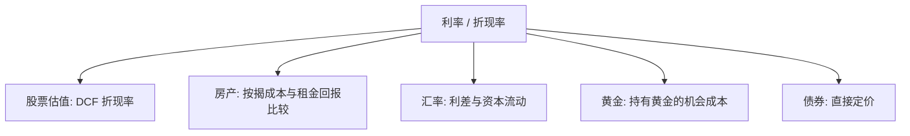
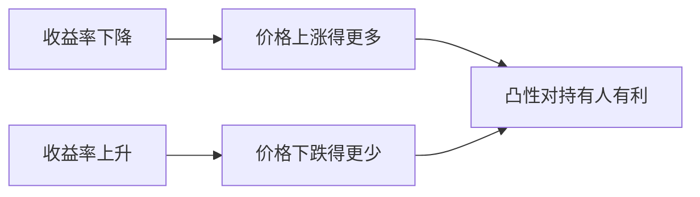

# 固定收益与利率

> [!note] 核心问题
> 很多人只懂股票，但利率才是金融世界的引力：它是几乎所有资产的折现率。股票、房产、汇率、黄金的价格，背后都被这把无形的尺子拉扯。读懂债券与利率，不是为了去做债券交易员，而是为了理解你手里那只成长股，为什么会在「利率上行」四个字面前突然跌掉两成。

## 学习目标

读完这篇，你要能做到：

1. 说清债券的基本术语（面值、票息、到期日），并解释「利率涨、债券价格跌」背后的直觉。
2. 理解到期收益率 YTM 是什么，为什么它是债券的「内部收益率」。
3. 用久期估算利率变动对债券价格的影响，并理解凸性为什么对持有人有利。
4. 读懂收益率曲线的三种形态，知道「倒挂」为什么常被当作衰退信号。
5. 判断利率变动对股票、成长股、债券、黄金、房产、汇率分别意味着什么。

## 一、为什么交易者必须懂利率

任何一项资产，价值都等于它未来能给你的全部现金流，折算到今天。折算用的那个比率，就是折现率，而折现率的地基就是利率。

呼应 [[估值方法入门]] 的 DCF：一家公司值多少钱，等于未来自由现金流按折现率贴现之和。折现率里最核心的一块，就是无风险利率（通常用长期国债收益率代表）。

$$
现值 = \sum_{t=1}^{T} \frac{现金流_t}{(1+r)^t}
$$

请注意分母里的 $r$。它一旦变大，越靠后的现金流被压缩得越狠。这就解释了一个反复出现的现象：利率上行时，盈利集中在遥远未来的成长股，跌得比盈利就在眼前的价值股更惨。

著名投资人巴菲特把这件事比作物理学：利率之于资产价格，就像引力之于物体。引力越大（利率越高），把所有资产价格往下拽的力量就越强。

所以即便你只买股票，也躲不开利率。它是背景里那台一直在运转的机器。

## 二、债券基础：先把术语对齐

债券本质是一张借条：你把钱借给政府或企业，对方承诺定期付息、到期还本。

| 术语 | 含义 | 例子（假设） |
|---|---|---|
| 面值（Par） | 到期时偿还的本金 | 100 元 |
| 票息率（Coupon） | 按面值计算的年付息比例 | 3%，即每年付 3 元 |
| 票息（Coupon Payment） | 实际收到的利息金额 | 3 元/年 |
| 到期日（Maturity） | 偿还本金的日期 | 5 年后 |
| 价格（Price） | 当前市场买卖价 | 可能高于或低于 100 |
| 收益率（Yield） | 按当前价格算出的真实回报率 | 见下文 YTM |

关键概念有三层要分清：票息率是发行时印在债券上的、固定不变的；价格是市场上每天波动的；而收益率是把价格和现金流连起来算出的真实回报。

### 价格与收益率为什么反向

这是固定收益里最反直觉、却最重要的一条规律：**市场利率上升，债券价格下跌；市场利率下降，债券价格上涨。**

用一个假设例子建立直觉。你手上有一张票息率 3% 的债券，每年付 3 元。现在市场上新发的同类债券利率涨到了 5%，新债每年付 5 元。没有人愿意按原价买你那张只付 3 元的旧债了，于是你的债券只能降价出售，直到「折价带来的额外回报」补足了那 2 元的差距。反过来，如果市场利率跌到 1%，你那张付 3 元的旧债就成了香饽饽，价格会被抬高。

> [!tip] 一句话记忆
> 债券价格和市场利率像跷跷板的两端：一端上去，另一端必然下来。票息固定，就只能靠价格变动来重新匹配市场要求的回报。

## 三、到期收益率 YTM：债券的内部收益率

到期收益率（Yield to Maturity, YTM）是这样一个利率：用它把债券未来所有现金流（每期票息 + 到期本金）折现，加总恰好等于当前市场价格。

$$
价格 = \sum_{t=1}^{T} \frac{票息}{(1+YTM)^t} + \frac{面值}{(1+YTM)^T}
$$

换句话说，YTM 就是债券的内部收益率（IRR）：如果你今天按市价买入、持有到期、且所有票息能按 YTM 再投资，你最终拿到的年化回报就是 YTM。

价格和 YTM 是同一枚硬币的两面，已知其一即可反解另一。这里有一组必须记住的关系：

| 价格相对面值 | 称呼 | 票息率与 YTM 的关系 |
|---|---|---|
| 价格 > 面值 | 溢价债券 | 票息率 > YTM |
| 价格 = 面值 | 平价债券 | 票息率 = YTM |
| 价格 < 面值 | 折价债券 | 票息率 < YTM |

直觉是：如果债券卖得比面值贵（溢价），说明它的票息比市场要求的回报更慷慨，所以真实收益率 YTM 会被价格拉低到票息率之下。这一条会在文末的练习里直接用到。

## 四、久期：利率风险的标尺

知道了价格随利率反向变动，下一个问题是：**变动多少？** 答案就是久期（Duration）。久期有两个常被混用、其实不同的概念。

### 麦考利久期

麦考利久期（Macaulay Duration）是债券各期现金流的「加权平均回收时间」，权重是每期现金流现值占总现值的比例，单位是年。它回答：平均而言，你要等多久才能把投进去的钱收回来。

零息债券（中途不付息、只在到期还本）的麦考利久期，恰好等于它的到期年限；而付息债券因为中途有现金流回流，久期总是小于到期年限。

### 修正久期

修正久期（Modified Duration）才是交易者每天用的那个，它直接度量价格对收益率的敏感度：

$$
\frac{\Delta P}{P} \approx -D_{mod} \times \Delta y
$$

其中 $\Delta y$ 是收益率变化（用小数表示），$\frac{\Delta P}{P}$ 是价格的百分比变化。负号正是前面那条「反向关系」的数学化身。

举个假设例子：某债券修正久期为 7，市场收益率上升 1%（即 $\Delta y = 0.01$），则价格大约下跌：

$$
\frac{\Delta P}{P} \approx -7 \times 0.01 = -7\%
$$

下面这张表展示了同样 1% 的利率上行，对不同久期债券的杀伤力差异：

| 修正久期 | 收益率 +1% 的价格变化（近似） | 风险特征 |
|---:|---:|---|
| 2 | −2% | 短债，利率风险小 |
| 5 | −5% | 中期债 |
| 10 | −10% | 长债，利率风险大 |
| 20 | −20% | 超长债 / 零息长债，对利率极敏感 |

一句话总结：**久期越长，利率风险越大。** 这也是为什么在加息周期里，长久期债券基金可能跌得让人怀疑「债券怎么也这么吓人」。

## 五、凸性：久期之外的二阶修正

久期是一种线性近似，它假设价格随收益率走一条直线。但债券真实的价格-收益率关系是一条**向原点凸出**的曲线，这种弯曲程度就叫凸性（Convexity）。

凸性带来一个对债券持有人友好的不对称：

- 当收益率下降时，实际价格上涨幅度**大于**久期的线性预测；
- 当收益率上升时，实际价格下跌幅度**小于**久期的线性预测。

也就是说，无论利率往哪边动，真实结果都比「直线估计」更有利一点。所以在其他条件相同的情况下，凸性更高的债券更受欢迎。

> [!note] 实务提醒
> 久期适合小幅利率变动的快速估算；一旦利率大幅波动，只用久期会高估损失、低估收益，必须叠加凸性修正。前面那个「久期 7、−7%」的算法，在利率大动时只是粗略的第一近似。

## 六、收益率曲线：把不同期限连起来看

把同一发行人（通常是国债）、不同到期期限的收益率画在一张图上，横轴是期限、纵轴是收益率，连成的线就是收益率曲线（Yield Curve）。它的形态藏着市场对未来的集体判断。

| 曲线形态 | 长短端关系 | 常见含义 |
|---|---|---|
| 正常（上斜） | 长端利率 > 短端 | 经济健康，期限越长要求补偿越高 |
| 平坦 | 长短端接近 | 增长与政策预期不明朗，可能处于转折点 |
| 倒挂（下斜） | 长端利率 < 短端 | 市场预期央行未来降息 / 衰退临近 |

### 倒挂为什么是衰退信号

正常情况下，借得越久、不确定性越大，你会要求更高的利率，所以曲线上斜。当曲线**倒挂**——短期利率反而高于长期利率——通常意味着：市场预期央行未来会因为经济转弱而降息，于是提前把长端利率压了下去。

这并非玄学。历史经验上，长短端利率倒挂往往领先于经济衰退出现（这是一种被广泛观察到的经验规律，而非必然因果，且领先时间长短不一）。把它和 [[宏观经济基础]] 里的经济周期框架对照看：倒挂常出现在周期由过热转向回落的阶段。

## 七、利率期限结构的直觉（点到为止）

为什么长期利率和短期利率会不一样？两个主流解释，知道大意即可：

- **预期假设**：长期利率约等于市场对未来一连串短期利率的平均预期。如果大家预期未来要加息，长端就高；预期要降息，长端就低（倒挂的逻辑来源）。
- **期限溢价**：把钱锁定更久要承担更多不确定性，投资者会额外索取一份补偿，叫期限溢价。它让曲线在「纯预期」之上再抬高一截，也解释了为什么正常曲线倾向于上斜。

真实曲线是这两股力量叠加的结果。这里点到为止，深入可参见后续的宏观相对价值讨论。

## 八、信用利差与信用风险

到目前为止讨论的多以国债为基准——通常视为「无（违约）风险」。但企业可能违约，所以企业债（信用债）必须给出比国债更高的收益率，多出来的那部分就是信用利差（Credit Spread）。

$$
信用利差 = 信用债收益率 - 同期限国债收益率
$$

利差越大，市场认为违约风险越高。评级机构用字母给债券的信用质量打分：

| 评级档次 | 大致类别 | 含义 |
|---|---|---|
| AAA / AA / A | 投资级（高） | 违约风险低，利差小 |
| BBB | 投资级（下沿） | 尚属安全，但接近分界线 |
| BB / B 及以下 | 投机级 / 高收益债 | 违约风险高，利差大，俗称「垃圾债」 |

信用利差是一个极好的市场情绪温度计：**利差扩大 = 避险情绪上升**。当市场恐慌时，资金从信用债涌向国债，信用债价格下跌、收益率上升，利差骤然走阔。

这一点呼应 [[相关性与协方差估计]] 里的危机相关性：平时看似无关的资产，会在危机中一起下跌，因为它们共同暴露于「信用利差走阔 / 流动性枯竭」这个隐藏因子。分散化在最需要它的时候往往最不管用，根源就在这里。

## 九、利率与各类资产：一张全景表

这是本篇最该贴在墙上的一张表。注意这些是**一般倾向**而非铁律，真实市场还受预期、起点估值和具体情境影响。

| 资产 | 利率上升时的一般影响 | 核心逻辑 |
|---|---|---|
| 股票（整体） | 偏空 | 折现率上升，估值中枢下移 |
| 成长股 | 更偏空 | 现金流靠后，对折现率最敏感 |
| 价值股 | 相对抗跌 | 现金流靠前，且常受益于利率上行环境（如银行） |
| 债券（已持有） | 偏空 | 价格与利率反向，久期越长越痛 |
| 黄金 | 偏空 | 持有黄金无息，机会成本上升 |
| 房产 | 偏空 | 按揭成本上升，需求与估值承压 |
| 本币汇率 | 偏多 | 利率高吸引资本流入，本币走强 |

把这张表读熟，你就能在听到「美联储加息」时，迅速在脑中过一遍自己组合里每一类资产的受力方向。

## 十、央行与货币政策如何驱动利率

利率不是凭空波动的，短端利率很大程度上被央行的政策利率锚定。这部分与 [[宏观经济基础]] 的货币政策传导直接衔接，这里只做固定收益视角的提炼。

| 政策方向 | 工具 | 对利率与债券的影响 |
|---|---|---|
| 宽松（降息） | 降息、降准、公开市场投放 | 短端利率下行，债券价格上涨 |
| 紧缩（加息） | 加息、提高准备金、回笼流动性 | 短端利率上行，债券价格下跌 |

需要理解的传导链条：央行直接调控的是**短端**政策利率；长端利率则更多由市场对未来政策路径的预期、通胀预期和期限溢价共同决定。这就是为什么有时央行降息，长端利率却不降反升——市场可能担心宽松会推高未来通胀。

## 十一、债券在组合中的角色

对配置者来说，债券不只是「收益低的资产」，它承担三个独特职能，呼应 [[资产配置入门]]：

- **稳定器**：波动率通常远低于股票，平抑组合整体波动。
- **现金流来源**：定期票息提供可预期的现金流。
- **分散化工具**：与股票的相关性常常较低，甚至在某些环境下为负，从而对冲股票风险。

但这里有一个新手极易踩的坑：**股债相关性不是固定的，它会随宏观环境变号。**

| 宏观环境 | 股债相关性倾向 | 直觉 |
|---|---|---|
| 增长担忧主导（通胀温和） | 偏负相关 | 经济转弱时股跌、避险买债，债券对冲股票 |
| 通胀担忧主导（高通胀） | 可能转正相关 | 加息同时打压股和债，两者一起跌 |

经典的「股债负相关、债券避险」叙事，主要成立于低通胀环境。一旦进入高通胀、加息周期，股和债可能同步下跌，债券的「保护伞」会暂时失灵。这不是理论假设，理解它能让你对「为什么经典配置组合有时两头挨打」不再困惑。

## 十二、利率与债券交易策略简介

最后简要介绍三类思路，作为通往 [[宏观对冲]] 固定收益相对价值的桥梁。这里只讲框架，不构成操作建议。

| 策略 | 核心思路 | 押注的是什么 |
|---|---|---|
| 套息（Carry） | 持有高票息 / 高收益资产，赚取利差与时间收益 | 在持有期内利率与利差大体稳定 |
| 曲线交易 | 同时做多一端、做空另一端，押注曲线形态变化 | 收益率曲线变陡或变平，而非整体水平 |
| 久期押注 | 看多利率下行就拉长久期，看空就缩短久期 | 利率的整体方向 |

> [!tip] 曲线交易的两个方向
> 变陡交易（Steepener）：押注长端相对短端走高（曲线变陡）。
> 变平交易（Flattener）：押注长端相对短端走低（曲线变平）。
> 二者都对冲掉了利率整体平移的风险，只暴露在曲线「形状」的变化上，是相对价值思路的典型代表。

## 常见误区

| 误区 | 更准确的理解 |
|---|---|
| 债券一定安全 | 利率风险、信用风险、流动性风险都真实存在，长债与垃圾债波动不小 |
| 持有到期就没风险 | 锁定了价格波动，但仍有违约风险、再投资风险和通胀侵蚀购买力 |
| 利率涨债券就亏到底 | 价格下跌，但票息会以更高利率再投资，长期持有未必是净损失 |
| 久期就是到期时间 | 久期是利率敏感度（修正久期）或加权回收时间（麦考利久期），只有零息债才等于到期年限 |
| 股债永远负相关 | 相关性随通胀环境变号，高通胀时可能同涨同跌 |

## 练习：两道必做的固定收益题

**第一题（YTM 与票面利率孰高孰低）**

假设一张债券：面值 100 元，票息率 4%（每年付 4 元），当前市价 95 元（折价）。请判断它的到期收益率 YTM 与票息率孰高孰低，并说明理由。

> 提示：回看第三节那张表。债券**折价**交易（价格 < 面值）意味着什么？折价说明市场要求的回报高于这张债券印着的票息，所以 **YTM > 票息率（即 YTM > 4%）**。直觉是：你今天只花 95 元就能在到期拿回 100 元，这笔 5 元的资本利得叠加每年 4 元票息，使真实年化回报被推到票息率之上。

**第二题（用修正久期估算价格变化）**

假设某债券修正久期为 8，当前价格 100 元。若市场收益率上升 1%（$\Delta y = 0.01$），用近似公式估算债券价格的变化金额。

> 提示：套用 $\frac{\Delta P}{P} \approx -D_{mod}\times \Delta y$。
> 计算：$\frac{\Delta P}{P} \approx -8 \times 0.01 = -8\%$，即价格约下跌 8%，从 100 元跌到约 92 元。
> 进阶思考：如果利率不是上升 1% 而是上升 3%，只用久期估算会高估还是低估真实损失？（答案：会高估损失，因为凸性使实际下跌幅度小于线性预测——回看第五节。）

## 相关概念

[[宏观经济基础]] [[估值方法入门]] [[资产配置入门]] [[相关性与协方差估计]] [[宏观对冲]] [[衍生品与期权进阶]] [[风险管理框架]]
